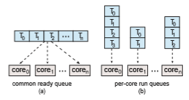
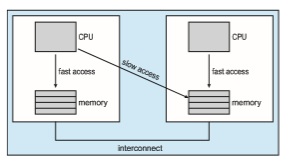

# Multi-Processor Scheduling

Our discussion thus far has focused on the problems of scheduling the CPU in a system with a single processing core. If multiple CPUs are available, **load shar- ing**, where multiple threads may run in parallel, becomes possible, however scheduling issues become correspondingly more complex. Many possibilities have been tried; and as we saw with CPU scheduling with a single-core CPU, there is no one best solution.

Traditionally, the term **multiprocessor** referred to systems that provided multiple physical processors, where each processor contained one single-core CPU. However, the definition of multiprocessor has evolved significantly, and on modern computing systems, **_multiprocessor_** now applies to the following system architectures:

• Multicore CPUs

• Multithreaded cores

• NUMA systems

• Heterogeneous multiprocessing

Here, we discuss several concerns inmultiprocessor scheduling in the con- text of these different architectures. In the first three examples we concentrate on systems in which the processors are identical—homogeneous—in terms of their functionality. We can then use any available CPU to run any process in the queue. In the last example we explore a system where the processors are not identical in their capabilities.

## Approaches to Multiple-Processor Scheduling

One approach to CPU scheduling in amultiprocessor system has all scheduling decisions, I/O processing, and other system activities handled by a single processor — the master server. The other processors execute only user code. This **asymmetric multiprocessing** is simple because only one core accesses the system data structures, reducing the need for data sharing. The downfall of this approach is themaster server becomes a potential bottleneckwhere overall system performance may be reduced.

The standard approach for supporting multiprocessors is **symmetric mul- tiprocessing** (**SMP**), where each processor is self-scheduling. Scheduling pro- ceeds by having the scheduler for each processor examine the ready queue and select a thread to run. Note that this provides two possible strategies for organizing the threads eligible to be scheduled:

**1\.** All threads may be in a common ready queue.

**2\.** Each processor may have its own private queue of threads.

These two strategies are contrasted in Figure 5.11. If we select the first option, we have a possible race condition on the shared ready queue and therefore must ensure that two separate processors do not choose to schedule the same thread and that threads are not lost from the queue. As discussed in  

**Figure 5.11** Organization of ready queues.

Chapter 6, we could use some form of locking to protect the common ready queue from this race condition. Locking would be highly contended, however, as all accesses to the queue would require lock ownership, and accessing the shared queue would likely be a performance bottleneck. The second option permits each processor to schedule threads from its private run queue and therefore does not suffer from the possible performance problems associated with a shared run queue. Thus, it is the most common approach on systems supporting SMP. Additionally, as described in Section 5.5.4, having private, per- processor run queues in fact may lead to more efficient use of cache memory. There are issues with per-processor run queues—most notably, workloads of varying sizes. However, as we shall see, balancing algorithms can be used to equalize workloads among all processors.

Virtually all modern operating systems support SMP, including Windows, Linux, and macOS as well as mobile systems including Android and iOS. In the remainder of this section, we discuss issues concerning SMP systems when designing CPU scheduling algorithms.

## Multicore Processors

Traditionally, SMP systems have allowed several processes to run in parallel by providing multiple physical processors. However, most contemporary com- puter hardware now places multiple computing cores on the same physical chip, resulting in a **multicore processor**. Each core maintains its architectural state and thus appears to the operating system to be a separate logical CPU. SMP systems that use multicore processors are faster and consume less power than systems in which each CPU has its own physical chip.

Multicore processors may complicate scheduling issues. Let’s consider how this can happen. Researchers have discovered that when a processor accesses memory, it spends a significant amount of time waiting for the data to become available. This situation, known as a **memory stall**, occurs primarily because modern processors operate at much faster speeds thanmemory. How- ever, a memory stall can also occur because of a cache miss (accessing data that are not in cache memory). Figure 5.12 illustrates a memory stall. In this scenario, the processor can spend up to 50 percent of its time waiting for data to become available from memory.  

**Figure 5.12** Memory stall.

To remedy this situation, many recent hardware designs have imple- mented multithreaded processing cores in which two (or more) **hardware threads** are assigned to each core. That way, if one hardware thread stalls while waiting for memory, the core can switch to another thread. Figure 5.13 illus- trates a dual-threaded processing core on which the execution of thread 0 and the execution of thread 1 are interleaved. From an operating system perspec- tive, each hardware thread maintains its architectural state, such as instruction pointer and register set, and thus appears as a logical CPU that is available to run a software thread. This technique—known as **chip multithreading** (CMT) —is illustrated in Figure 5.14. Here, the processor contains four computing cores, with each core containing two hardware threads. From the perspective of the operating system, there are eight logical CPUs.

Intel processors use the term **hyper-threading** (also known as **simultane- ous multithreading**or SMT) to describe assigningmultiple hardware threads to a single processing core. Contemporary Intel processors—such as the i7—sup- port two threads per core, while the Oracle Sparc M7 processor supports eight threads per core, with eight cores per processor, thus providing the operating system with 64 logical CPUs.

In general, there are two ways to multithread a processing core: **coarse- grained** and **fine-graine** multithreading. With coarse-grained multithread- ing, a thread executes on a core until a long-latency event such as a memory stall occurs. Because of the delay caused by the long-latency event, the core must switch to another thread to begin execution. However, the cost of switch- ing between threads is high, since the instruction pipeline must be flushed before the other thread can begin execution on the processor core. Once this new thread begins execution, it begins filling the pipeline with its instructions. Fine-grained (or interleaved) multithreading switches between threads at a much finer level of granularity—typically at the boundary of an instruction

**Figure 5.13** Multithreaded multicore system.  

**Figure 5.14** Chip multithreading.

cycle. However, the architectural design of fine-grained systems includes logic for thread switching. As a result, the cost of switching between threads is small.

It is important to note that the resources of the physical core (such as caches and pipelines) must be shared among its hardware threads, and therefore a processing core can only execute one hardware thread at a time. Consequently, a multithreaded, multicore processor actually requires two different levels of scheduling, as shown in Figure 5.15, which illustrates a dual-threaded process- ing core.

On one level are the scheduling decisions that must be made by the oper- ating system as it chooses which software thread to run on each hardware thread (logical CPU). For all practical purposes, such decisions have been the primary focus of this chapter. Therefore, for this level of scheduling, the oper- ating systemmay choose any scheduling algorithm, including those described in Section 5.3.

A second level of scheduling specifies how each core decides which hard- ware thread to run. There are several strategies to adopt in this situation. One approach is to use a simple round-robin algorithm to schedule a hardware thread to the processing core. This is the approach adopted by the UltraSPARC T3. Another approach is used by the Intel Itanium, a dual-core processor with two hardware-managed threads per core. Assigned to each hardware thread is a dynamic **_urgency_** value ranging from 0 to 7, with 0 representing the lowest urgency and 7 the highest. The Itanium identifies five different events that may  

**Figure 5.15** Two levels of scheduling.

trigger a thread switch. When one of these events occurs, the thread-switching logic compares the urgency of the two threads and selects the thread with the highest urgency value to execute on the processor core.

Note that the two different levels of scheduling shown in Figure 5.15 are not necessarily mutually exclusive. In fact, if the operating system scheduler (the first level) is made aware of the sharing of processor resources, it canmake more effective scheduling decisions. As an example, assume that a CPU has two processing cores, and each core has two hardware threads. If two software threads are running on this system, they can be running either on the same core or on separate cores. If they are both scheduled to run on the same core, they have to share processor resources and thus are likely to proceed more slowly than if they were scheduled on separate cores. If the operating system is aware of the level of processor resource sharing, it can schedule software threads onto logical processors that do not share resources.

## Load Balancing

On SMP systems, it is important to keep the workload balanced among all processors to fully utilize the benefits of having more than one processor. Oth- erwise, one or more processors may sit idle while other processors have high workloads, alongwith ready queues of threads awaiting the CPU. **Load balanc- ing** attempts to keep the workload evenly distributed across all processors in an SMP system. It is important to note that load balancing is typically necessary only on systemswhere each processor has its own private ready queue of eligi- ble threads to execute. On systems with a common run queue, load balancing is unnecessary, because once a processor becomes idle, it immediately extracts a runnable thread from the common ready queue.

There are two general approaches to load balancing: push migration and pull migration. With **push migration**, a specific task periodically checks the load on each processor and—if it finds an imbalance—evenly distributes the load by moving (or pushing) threads from overloaded to idle or less-busy processors. **Pull migration** occurs when an idle processor pulls a waiting task from a busy processor. Push and pullmigration need not bemutually exclusive and are, in fact, often implemented in parallel on load-balancing systems. For example, the Linux CFS scheduler (described in Section 5.7.1) and the ULE scheduler available for FreeBSD systems implement both techniques.

The concept of a “balanced load” may have different meanings. One view of a balanced load may require simply that all queues have approximately the same number of threads. Alternatively, balance may require an equal distri- bution of thread priorities across all queues. In addition, in certain situations, neither of these strategiesmay be sufficient. Indeed, theymaywork against the goals of the scheduling algorithm. (We leave further consideration of this as an exercise.)

## Processor Affinity

Considerwhat happens to cachememorywhen a thread has been running on a specific processor. The data most recently accessed by the thread populate the cache for the processor. As a result, successive memory accesses by the thread are often satisfied in cache memory (known as a “warm cache”). Now consider what happens if the thread migrates to another processor—say, due to load balancing. The contents of cache memory must be invalidated for the first pro- cessor, and the cache for the second processor must be repopulated. Because of the high cost of invalidating and repopulating caches, most operating systems with SMP support try to avoidmigrating a thread fromone processor to another and instead attempt to keep a thread running on the same processor and take advantage of a warm cache. This is known as **processor affinit** —that is, a process has an affinity for the processor on which it is currently running.

The two strategies described in Section 5.5.1 for organizing the queue of threads available for scheduling have implications for processor affinity. If we adopt the approach of a common ready queue, a thread may be selected for execution by any processor. Thus, if a thread is scheduled on a new processor, that processor’s cache must be repopulated. With private, per-processor ready queues, a thread is always scheduled on the same processor and can therefore benefit from the contents of a warm cache. Essentially, per-processor ready queues provide processor affinity for free!

Processor affinity takes several forms. When an operating system has a policy of attempting to keep a process running on the same processor—but not guaranteeing that it will do so—we have a situation known as **soft affinit** . Here, the operating systemwill attempt to keep a process on a single processor, but it is possible for a process to migrate between processors during load balancing. In contrast, some systems provide system calls that support **hard affinit** , thereby allowing a process to specify a subset of processors onwhich it can run. Many systems provide both soft and hard affinity. For example, Linux implements soft affinity, but it also provides the sched setaffinity() system call, which supports hard affinity by allowing a thread to specify the set of CPUs on which it is eligible to run.

The main-memory architecture of a system can affect processor affinity issues as well. Figure 5.16 illustrates an architecture featuring non-uniform memory access (NUMA)where there are two physical processor chips eachwith their own CPU and local memory. Although a system interconnect allows all CPUs in a NUMA system to share one physical address space, a CPU has faster access to its localmemory than tomemory local to another CPU. If the operating system’s CPU scheduler and memory-placement algorithms are **_NUMA-aware_**  

**Figure 5.16** NUMA and CPU scheduling.

andwork together, then a thread that has been scheduled onto a particular CPU can be allocated memory closest to where the CPU resides, thus providing the thread the fastest possible memory access.

Interestingly, load balancing often counteracts the benefits of processor affinity. That is, the benefit of keeping a thread running on the same processor is that the thread can take advantage of its data being in that processor’s cache memory. Balancing loads by moving a thread from one processor to another removes this benefit. Similarly, migrating a thread between processors may incur a penalty on NUMAsystems, where a threadmay bemoved to a processor that requires longer memory access times. In other words, there is a natural tension between load balancing and minimizing memory access times. Thus, scheduling algorithms formodernmulticoreNUMAsystems have become quite complex. In Section 5.7.1, we examine the Linux CFS scheduling algorithm and explore how it balances these competing goals.

## Heterogeneous Multiprocessing

In the examples we have discussed so far, all processors are identical in terms of their capabilities, thus allowing any thread to run on any processing core. The only difference being that memory access timesmay vary based upon load balancing and processor affinity policies, as well as on NUMA systems.

Although mobile systems now include multicore architectures, some sys- tems are now designed using cores that run the same instruction set, yet vary in terms of their clock speed and power management, including the ability to adjust the power consumption of a core to the point of idling the core. Such systems are known as **heterogeneous multiprocessing** (HMP). Note this is not a form of asymmetric multiprocessing as described in Section 5.5.1 as both system and user tasks can run on any core. Rather, the intention behind HMP is to better manage power consumption by assigning tasks to certain cores based upon the specific demands of the task.

For ARM processors that support it, this type of architecture is known as **big.LITTLE** where higher-peformance **_big_** cores are combined with energy efficient **_LITTLE_** cores. **_Big_** cores consume greater energy and therefore should only be used for short periods of time. Likewise, **_little_** cores use less energy and can therefore be used for longer periods.

There are several advantages to this approach. By combining a number of slower c
ores with faster ones, a CPU scheduler can assign tasks that do not require high performance, but may need to run for longer periods, (such as background tasks) to little cores, thereby helping to preserve a battery charge. Similarly, interactive applications which require more processing power, but may run for shorter durations, can be assigned to big cores. Additionally, if the mobile device is in a power-saving mode, energy-intensive big cores can be disabled and the system can rely solely on energy-efficient little cores. Win- dows 10 supports HMP scheduling by allowing a thread to select a scheduling policy that best supports its power management demands.