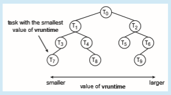
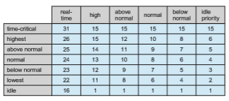

# Operating-System Examples

We turn next to a description of the scheduling policies of the Linux, Win- dows, and Solaris operating systems. It is important to note that we use the term **_process scheduling_** in a general sense here. In fact, we are describing the scheduling of **_kernel threads_** with Solaris and Windows systems and of **_tasks_** with the Linux scheduler.

## Example: Linux Scheduling

Process scheduling in Linux has had an interesting history. Prior to Version 2.5, the Linux kernel ran a variation of the traditional UNIX scheduling algorithm. However, as this algorithm was not designed with SMP systems in mind, it did not adequately support systems with multiple processors. In addition, it resulted in poor performance for systemswith a large number of runnable pro- cesses. With Version 2.5 of the kernel, the scheduler was overhauled to include a scheduling algorithm—known as _O_(1)—that ran in constant time regard- less of the number of tasks in the system. The _O_(1) scheduler also provided  

```
#include _<_pthread.h_\>_ #include _<_stdio.h_\>_ #define NUM THREADS 5

int main(int argc, char \*argv\[\]) _{_

int i, policy; pthread t tid\[NUM THREADS\]; pthread attr t attr;

/\* get the default attributes \*/ pthread attr init(&attr);

/\* get the current scheduling policy \*/ if (**pthread attr getschedpolicy**(&attr, &policy) != 0)

fprintf(stderr, "Unable to get policy.∖n"); else _{_

if (policy == SCHED OTHER) printf("SCHED OTHER∖n");

else if (policy == SCHED RR) printf("SCHED RR∖n");

else if (policy == SCHED FIFO) printf("SCHED FIFO∖n");

_}_

/\* set the scheduling policy - FIFO, RR, or OTHER \*/ if (**pthread attr setschedpolicy**(&attr, SCHED FIFO) != 0)

fprintf(stderr, "Unable to set policy.∖n");

/\* create the threads \*/ for (i = 0; i < NUM THREADS; i++)

pthread create(&tid\[i\],&attr,runner,NULL);

/\* now join on each thread \*/ for (i = 0; i < NUM THREADS; i++)

pthread join(tid\[i\], NULL); _}_

/\* Each thread will begin control in this function \*/ void \*runner(void \*param) _{_

/\* do some work ... \*/

pthread exit(0); _}_
```
**Figure 5.25** POSIX real-time scheduling API.  

increased support for SMP systems, including processor affinity and load bal- ancing between processors. However, in practice, although the _O_(1) scheduler delivered excellent performance on SMP systems, it led to poor response times for the interactive processes that are common on many desktop computer sys- tems. During development of the 2.6 kernel, the scheduler was again revised; and in release 2.6.23 of the kernel, the **_Completely Fair Scheduler_** (CFS) became the default Linux scheduling algorithm.

Scheduling in the Linux system is based on **scheduling classes**. Each class is assigned a specific priority. By using different scheduling classes, the kernel can accommodate different scheduling algorithms based on the needs of the system and its processes. The scheduling criteria for a Linux server, for exam- ple, may be different from those for a mobile device running Linux. To decide which task to run next, the scheduler selects the highest-priority task belong- ing to the highest-priority scheduling class. Standard Linux kernels implement two scheduling classes: (1) a default scheduling class using the CFS scheduling algorithm and (2) a real-time scheduling class. We discuss each of these classes here. New scheduling classes can, of course, be added.

Rather than using strict rules that associate a relative priority value with the length of a time quantum, the CFS scheduler assigns a proportion of CPU processing time to each task. This proportion is calculated based on the **nice value** assigned to each task. Nice values range from −20 to +19, where a numerically lower nice value indicates a higher relative priority. Tasks with lower nice values receive a higher proportion of CPU processing time than tasks with higher nice values. The default nice value is 0. (The term **_nice_** comes from the idea that if a task increases its nice value from, say, 0 to +10, it is being nice to other tasks in the systemby lowering its relative priority. In otherwords, nice processes finish last!) CFS doesn’t use discrete values of time slices and instead identifies a **targeted latency**, which is an interval of time during which every runnable task should run at least once. Proportions of CPU time are allocated from the value of targeted latency. In addition to having default and minimum values, targeted latency can increase if the number of active tasks in the system grows beyond a certain threshold.

The CFS scheduler doesn’t directly assign priorities. Rather, it records how long each task has run by maintaining the **virtual run time** of each task using the per-task variable vruntime. The virtual run time is associated with a decay factor based on the priority of a task: lower-priority tasks have higher rates of decay than higher-priority tasks. For tasks at normal priority (nice values of 0), virtual run time is identical to actual physical run time. Thus, if a task with default priority runs for 200 milliseconds, its vruntime will also be 200 milliseconds. However, if a lower-priority task runs for 200 milliseconds, its vruntime will be higher than 200 milliseconds. Similarly, if a higher-priority task runs for 200 milliseconds, its vruntimewill be less than 200 milliseconds. To decide which task to run next, the scheduler simply selects the task that has the smallest vruntime value. In addition, a higher-priority task that becomes available to run can preempt a lower-priority task.

Let’s examine the CFS scheduler in action: Assume that two tasks have the same nice values. One task is I/O-bound, and the other is CPU-bound. Typically, the I/O-bound taskwill run only for short periods before blocking for additional I/O, and the CPU-bound taskwill exhaust its timeperiodwhenever it has an opportunity to run on a processor. Therefore, the value of vruntimewill  

**_CFS PERFORMANCE_**

The Linux CFS scheduler provides an efficient algorithm for selecting which task to run next. Rather than using a standard queue data structure, each runnable task is placed in a red-black tree—a balanced binary search tree whose key is based on the value of vruntime. This tree is shown below.

When a task becomes runnable, it is added to the tree. If a task on the tree is not runnable (for example, if it is blocked while waiting for I/O), it is removed.Generally speaking, tasks that have been given less processing time (smaller values of vruntime) are toward the left side of the tree, and tasks that have been given more processing time are on the right side. According to the properties of a binary search tree, the leftmost node has the smallest key value, which for the sake of the CFS scheduler means that it is the task with the highest priority. Because the red-black tree is balanced, navigating it to discover the leftmost node will require _O_(_log N_) operations (where _N_ is the number of nodes in the tree). However, for efficiency reasons, the Linux scheduler caches this value in the variable rb leftmost, and thus determiningwhich task to run next requires only retrieving the cached value.

eventually be lower for the I/O-bound task than for the CPU-bound task, giving the I/O-bound task higher priority than the CPU-bound task. At that point, if the CPU-bound task is executing when the I/O-bound task becomes eligible to run (for example, when I/O the task is waiting for becomes available), the I/O-bound task will preempt the CPU-bound task.

Linux also implements real-time scheduling using the POSIX standard as described in Section 5.6.6. Any task scheduled using either the SCHED FIFO or the SCHED RR real-time policy runs at a higher priority than normal (non-real- time) tasks. Linux uses two separate priority ranges, one for real-time tasks and a second for normal tasks. Real-time tasks are assigned static priorities within the range of 0 to 99, and normal tasks are assigned priorities from 100 to 139. These two rangesmap into a global priority schemewherein numerically lower values indicate higher relative priorities. Normal tasks are assigned a priority  

**Figure 5.26** Scheduling priorities on a Linux system.

based on their nice values, where a value of−20maps to priority 100 and a nice value of +19 maps to 139. This scheme is shown in Figure 5.26.

The CFS scheduler also supports load balancing, using a sophisticated technique that equalizes the load among processing cores yet is also NUMA- aware and minimizes the migration of threads. CFS defines the load of each thread as a combination of the thread’s priority and its average rate of CPU utilization. Therefore, a thread that has a high priority, yet is mostly I/O-bound and requires little CPU usage, has a generally low load, similar to the load of a low-priority thread that has high CPU utilization. Using this metric, the load of a queue is the sum of the loads of all threads in the queue, and balancing is simply ensuring that all queues have approximately the same load.

As highlighted in Section 5.5.4, however, migrating a thread may result in a memory access penalty due to either having to invalidate cache con- tents or, on NUMA systems, incurring longer memory access times. To address this problem, Linux identifies a hierarchical system of scheduling domains. A **scheduling domain** is a set of CPU cores that can be balanced against one another. This idea is illustrated in Figure 5.27. The cores in each scheduling domain are grouped according to how they share the resources of the system. For example, although each core shown in Figure 5.27 may have its own level 1 (L1) cache, pairs of cores share a level 2 (L2) cache and are thus organized into separate _domain_0 and _domain_1\. Likewise, these two domains may share a level 3 (L3) cache, and are therefore organized into a processor-level domain (also known as a **NUMA node**). Taking this one-step further, on a NUMAsystem,

**Figure 5.27** NUMA-aware load balancing with Linux CFS scheduler.  
a larger system-level domain would combine separate processor-level NUMA nodes.

The general strategy behind CFS is to balance loads within domains, begin- ning at the lowest level of the hierarchy. Using Figure 5.27 as an example, initially a thread would only migrate between cores on the same domain (i.e. within _domain_0 or _domain_1.) Load balancing at the next level would occur between _domain_0 and _domain_1\. CFS is reluctant to migrate threads between sep- arate NUMA nodes if a thread would be moved farther from its local memory, and such migration would only occur under severe load imbalances. As a general rule, if the overall system is busy, CFS will not load-balance beyond the domain local to each core to avoid the memory latency penalties of NUMA systems.

## Example: Windows Scheduling

Windows schedules threads using a priority-based, preemptive scheduling algorithm. The Windows scheduler ensures that the highest-priority thread will always run. The portion of the Windows kernel that handles scheduling is called the **dispatcher**. A thread selected to run by the dispatcher will run until it is preempted by a higher-priority thread, until it terminates, until its time quantum ends, or until it calls a blocking system call, such as for I/O. If a higher-priority real-time thread becomes ready while a lower-priority thread is running, the lower-priority threadwill be preempted. This preemption gives a real-time thread preferential access to the CPU when the thread needs such access.

The dispatcher uses a 32-level priority scheme to determine the order of thread execution. Priorities are divided into two classes. The **variable class** contains threads having priorities from 1 to 15, and the **real-time class** contains threads with priorities ranging from 16 to 31. (There is also a thread running at priority 0 that is used for memory management.) The dispatcher uses a queue for each scheduling priority and traverses the set of queues from highest to lowest until it finds a thread that is ready to run. If no ready thread is found, the dispatcher will execute a special thread called the **idle thread**.

There is a relationship between the numeric priorities of the Windows kernel and the Windows API. The Windows API identifies the following six priority classes to which a process can belong:

• IDLE PRIORITY CLASS

• BELOW NORMAL PRIORITY CLASS

• NORMAL PRIORITY CLASS

• ABOVE NORMAL PRIORITY CLASS

• HIGH PRIORITY CLASS

• REALTIME PRIORITY CLASS

Processes are typically members of the NORMAL PRIORITY CLASS. A process belongs to this class unless the parent of the process was a member of the IDLE PRIORITY CLASS or unless another class was specified when the process was created. Additionally, the priority class of a process can be altered with the SetPriorityClass() function in theWindows API. Priorities in all classes except the REALTIME PRIORITY CLASS are variable, meaning that the priority of a thread belonging to one of these classes can change.

Athreadwithin a given priority class also has a relative priority. The values for relative priorities include:

• IDLE

• LOWEST

• BELOW NORMAL

• NORMAL

• ABOVE NORMAL

• HIGHEST

• TIME CRITICAL

The priority of each thread is based on both the priority class it belongs to and its relative priority within that class. This relationship is shown in Figure 5.28. The values of the priority classes appear in the top row. The left column contains the values for the relative priorities. For example, if the relative priority of a thread in the ABOVE NORMAL PRIORITY CLASS is NORMAL, the numeric priority of that thread is 10.

Furthermore, each thread has a base priority representing a value in the priority range for the class to which the thread belongs. By default, the base priority is the value of the NORMAL relative priority for that class. The base priorities for each priority class are as follows:

• REALTIME PRIORITY CLASS—24

• HIGH PRIORITY CLASS—13

• ABOVE NORMAL PRIORITY CLASS—10

• NORMAL PRIORITY CLASS—8

**Figure 5.28** Windows thread priorities.  

• BELOW NORMAL PRIORITY CLASS—6

• IDLE PRIORITY CLASS—4

The initial priority of a thread is typically the base priority of the process the thread belongs to, although the SetThreadPriority() function in the Windows API can also be used to modify a thread’s base priority.

When a thread’s time quantum runs out, that thread is interrupted. If the thread is in the variable-priority class, its priority is lowered. The priority is never lowered below the base priority, however. Lowering the priority tends to limit the CPU consumption of compute-bound threads. When a variable- priority thread is released from a wait operation, the dispatcher boosts the priority. The amount of the boost depends on what the thread was waiting for. For example, a thread waiting for keyboard I/O would get a large increase, whereas a thread waiting for a disk operation would get a moderate one. This strategy tends to give good response times to interactive threads that are using the mouse and windows. It also enables I/O-bound threads to keep the I/O devices busy while permitting compute-bound threads to use spare CPU cycles in the background. This strategy is used by several operating systems, including UNIX. In addition, the window with which the user is currently interacting receives a priority boost to enhance its response time.

When a user is running an interactive program, the system needs to pro- vide especially good performance. For this reason, Windows has a special scheduling rule for processes in theNORMAL PRIORITY CLASS.Windows distin- guishes between the **foreground process** that is currently selected on the screen and the **background processes** that are not currently selected. When a process moves into the foreground, Windows increases the scheduling quantum by some factor—typically by 3. This increase gives the foreground process three times longer to run before a time-sharing preemption occurs.

Windows 7 introduced **user-mode scheduling** (**UMS**), which allows appli- cations to create and manage threads independently of the kernel. Thus, an application can create and schedule multiple threads without involving the Windows kernel scheduler. For applications that create a large number of threads, scheduling threads in user mode is much more efficient than kernel- mode thread scheduling, as no kernel intervention is necessary.

Earlier versions of Windows provided a similar feature known as **fiber** , which allowed several user-mode threads (fibers) to be mapped to a single kernel thread. However, fibers were of limited practical use. Afiber was unable to make calls to the Windows API because all fibers had to share the thread environment block (TEB) of the thread on which they were running. This pre- sented a problem if a Windows API function placed state information into the TEB for one fiber, only to have the information overwritten by a different fiber. UMS overcomes this obstacle by providing each user-mode threadwith its own thread context.

In addition, unlike fibers, UMS is not intended to be used directly by the programmer. The details of writing user-mode schedulers can be very chal- lenging, and UMS does not include such a scheduler. Rather, the schedulers come from programming language libraries that build on top of UMS. For example, Microsoft provides **Concurrency Runtime** (ConcRT), a concurrent programming framework for C++ that is designed for task-based parallelism  

(Section 4.2) on multicore processors. ConcRT provides a user-mode scheduler together with facilities for decomposing programs into tasks, which can then be scheduled on the available processing cores.

Windows also supports scheduling on multiprocessor systems as described in Section 5.5 by attempting to schedule a thread on the most optimal processing core for that thread, which includes maintaining a thread’s preferred as well as most recent processor. One technique used by Windows is to create sets of logical processors (known as **SMT sets**). On a hyper-threaded SMT system, hardware threads belonging to the same CPU core would also belong to the same SMT set. Logical processors are numbered, beginning from 0. As an example, a dual-threaded/quad-core system would contain eight logical processors, consisting of the four SMT sets: _{_0, 1_}_, _{_2, 3_}_, _{_4, 5_}_, and _{_6, 7_}_. To avoid cache memory access penalites highlighted in Section 5.5.4, the scheduler attempts to maintain a thread running on logical processors within the same SMT set.

To distribute loads across different logical processors, each thread is assigned an **ideal processor**, which is a number representing a thread’s preferred processor. Each process has an initial seed value identifying the ideal CPU for a thread belonging to that process. This seed is incremented for each new thread created by that process, thereby distributing the load across different logical processors. On SMT systems, the increment for the next ideal processor is in the next SMT set. For example, on a dual-threaded/quad-core system, the ideal processors for threads in a specific process would be assigned 0, 2, 4, 6, 0, 2, .... To avoid the situation wherby the first thread for each process is assigned processor 0, processes are assigned different seed values, thereby distributing the load of threads across all physical processing cores in the system. Continuing our example from above, if the seed for a second process were 1, the ideal processors would be assigned in the order 1, 3, 5, 7, 1, 3, and so forth.

## Example: Solaris Scheduling

Solaris uses priority-based thread scheduling. Each thread belongs to one of six classes:

**1\.** Time sharing (TS)

**2\.** Interactive (IA)

**3\.** Real time (RT)

**4\.** System (SYS)

**5\.** Fair share (FSS)

**6\.** Fixed priority (FP)

Within each class there are different priorities and different scheduling algo- rithms.

The default scheduling class for a process is time sharing. The scheduling policy for the time-sharing class dynamically alters priorities and assigns time slices of different lengths using a multilevel feedback queue. By default, there is an inverse relationship between priorities and time slices. The higher the  

**Figure 5.29** Solaris dispatch table for time-sharing and interactive threads.

priority, the smaller the time slice; and the lower the priority, the larger the time slice. Interactive processes typically have a higher priority; CPU-bound processes, a lower priority. This scheduling policy gives good response time for interactive processes and good throughput for CPU-bound processes. The interactive class uses the same scheduling policy as the time-sharing class, but it gives windowing applications—such as those created by the KDE or GNOME window managers—a higher priority for better performance.

Figure 5.29 shows the simplifieddispatch table for scheduling time-sharing and interactive threads. These two scheduling classes include 60 priority levels, but for brevity, we display only a handful. (To see the full dispatch table on a Solaris system or VM, run dispadmin -c TS -g.) The dispatch table shown in Figure 5.29 contains the following fields:

• **Priority**. The class-dependent priority for the time-sharing and interactive classes. A higher number indicates a higher priority.

• **Time quantum**. The time quantum for the associated priority. This illus- trates the inverse relationship between priorities and time quanta: the lowest priority (priority 0) has the highest time quantum (200 millisec- onds), and the highest priority (priority 59) has the lowest time quantum (20 milliseconds).

• **Time quantum expired**. The new priority of a thread that has used its entire time quantum without blocking. Such threads are considered CPU- intensive. As shown in the table, these threads have their priorities low- ered.  

• **Return from sleep**. The priority of a thread that is returning from sleeping (such as fromwaiting for I/O). As the table illustrates,when I/O is available for a waiting thread, its priority is boosted to between 50 and 59, support- ing the scheduling policy of providing good response time for interactive processes.

Threads in the real-time class are given the highest priority. A real-time process will run before a process in any other class. This assignment allows a real-time process to have a guaranteed response from the system within a bounded period of time. In general, however, few processes belong to the real-time class.

Solaris uses the system class to run kernel threads, such as the scheduler and paging daemon. Once the priority of a system thread is established, it does not change. The system class is reserved for kernel use (user processes running in kernel mode are not in the system class).

The fixed-priority and fair-share classes were introduced with Solaris 9. Threads in the fixed-priority class have the same priority range as those in the time-sharing class; however, their priorities are not dynamically adjusted. The fair-share class uses CPU **shares** instead of priorities to make scheduling decisions. CPU shares indicate entitlement to available CPU resources and are allocated to a set of processes (known as a **project**).

Each scheduling class includes a set of priorities. However, the scheduler converts the class-specific priorities into global priorities and selects the thread with the highest global priority to run. The selected thread runs on the CPU until it (1) blocks, (2) uses its time slice, or (3) is preempted by a higher-priority thread. If there are multiple threads with the same priority, the scheduler uses a round-robin queue. Figure 5.30 illustrates how the six scheduling classes relate to one another and how they map to global priorities. Notice that the kernel maintains ten threads for servicing interrupts. These threads do not belong to any scheduling class and execute at the highest priority (160–169). Asmentioned, Solaris has traditionally used themany-to-manymodel (Section 4.3.3) but switched to the one-to-one model (Section 4.3.2) beginning with Solaris 9.