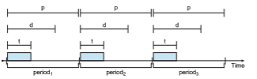
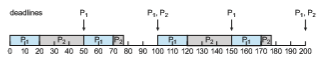

# Real-Time CPU Scheduling

CPU scheduling for real-time operating systems involves special issues. In general, we can distinguish between soft real-time systems and hard real-time systems. **Soft real-time systems** provide no guarantee as to when a critical real-time process will be scheduled. They guarantee only that the process will be given preference over noncritical processes. **Hard real-time systems** have stricter requirements. A task must be serviced by its deadline; service after the deadline has expired is the same as no service at all. In this section, we explore several issues related to process scheduling in both soft and hard real-time operating systems.

## Minimizing Latency

Consider the event-driven nature of a real-time system. The system is typically waiting for an event in real time to occur. Events may arise either in software —as when a timer expires—or in hardware—as when a remote-controlled vehicle detects that it is approaching an obstruction. When an event occurs, the system must respond to and service it as quickly as possible. We refer to **event latency** as the amount of time that elapses fromwhen an event occurs to when it is serviced (Figure 5.17).

**Figure 5.17** Event latency.  
Usually, different events have different latency requirements. For example, the latency requirement for an antilock brake system might be 3 to 5 millisec- onds. That is, from the time a wheel first detects that it is sliding, the system controlling the antilock brakes has 3 to 5milliseconds to respond to and control the situation. Any response that takes longer might result in the automobile’s veering out of control. In contrast, an embedded system controlling radar in an airliner might tolerate a latency period of several seconds.

Two types of latencies affect the performance of real-time systems:

**1\.** Interrupt latency

**2\.** Dispatch latency

**Interrupt latency** refers to the period of time from the arrival of an interrupt at the CPU to the start of the routine that services the interrupt. When an interrupt occurs, the operating system must first complete the instruction it is executing and determine the type of interrupt that occurred. It must then save the state of the current process before servicing the interrupt using the specific interrupt service routine (ISR). The total time required to perform these tasks is the interrupt latency (Figure 5.18).

Obviously, it is crucial for real-time operating systems to minimize inter- rupt latency to ensure that real-time tasks receive immediate attention. Indeed, for hard real-time systems, interrupt latency must not simply be minimized, it must be bounded to meet the strict requirements of these systems.

One important factor contributing to interrupt latency is the amount of time interrupts may be disabled while kernel data structures are being updated. Real-time operating systems require that interrupts be disabled for only very short periods of time.

The amount of time required for the scheduling dispatcher to stop one process and start another is known as **dispatch latency**. Providing real-time

**Figure 5.18** Interrupt latency.  

**Figure 5.19** Dispatch latency.

tasks with immediate access to the CPU mandates that real-time operating systemsminimize this latency aswell. Themost effective technique for keeping dispatch latency low is to provide preemptive kernels. For hard real-time systems, dispatch latency is typically measured in several microseconds.

In Figure 5.19, we diagram the makeup of dispatch latency. The **conflic phase** of dispatch latency has two components:

**1\.** Preemption of any process running in the kernel

**2\.** Release by low-priority processes of resources needed by a high-priority process

Following the conflict phase, the dispatch phase schedules the high-priority process onto an available CPU.

## Priority-Based Scheduling

Themost important feature of a real-time operating system is to respond imme- diately to a real-time process as soon as that process requires the CPU. As a result, the scheduler for a real-time operating system must support a priority- based algorithm with preemption. Recall that priority-based scheduling algo- rithms assign each process a priority based on its importance; more important tasks are assigned higher priorities than those deemed less important. If the scheduler also supports preemption, a process currently running on the CPU will be preempted if a higher-priority process becomes available to run.

Preemptive, priority-based scheduling algorithms are discussed in detail in Section 5.3.4, and Section 5.7 presents examples of the soft real-time schedul- ing features of the Linux, Windows, and Solaris operating systems. Each of these systems assigns real-time processes the highest scheduling priority. For  

**Figure 5.20** Periodic task.

example,Windows has 32 different priority levels. The highest levels—priority values 16 to 31—are reserved for real-time processes. Solaris and Linux have similar prioritization schemes.

Note that providing a preemptive, priority-based scheduler only guaran- tees soft real-time functionality. Hard real-time systemsmust further guarantee that real-time taskswill be serviced in accordwith their deadline requirements, and making such guarantees requires additional scheduling features. In the remainder of this section, we cover scheduling algorithms appropriate for hard real-time systems.

Before we proceed with the details of the individual schedulers, however, wemust define certain characteristics of the processes that are to be scheduled. First, the processes are considered **periodic**. That is, they require the CPU at constant intervals (periods). Once a periodic process has acquired the CPU, it has a fixed processing time _t_, a deadline _d_ by which it must be serviced by the CPU, and a period _p_. The relationship of the processing time, the deadline, and the period can be expressed as 0 ≤ _t_ ≤ _d_ ≤ _p_. The **rate** of a periodic task is 1∕_p_. Figure 5.20 illustrates the execution of a periodic process over time. Schedulers can take advantage of these characteristics and assign priorities according to a process’s deadline or rate requirements.

What is unusual about this form of scheduling is that a processmay have to announce its deadline requirements to the scheduler. Then, using a technique known as an **admission-control** algorithm, the scheduler does one of two things. It either admits the process, guaranteeing that the processwill complete on time, or rejects the request as impossible if it cannot guarantee that the task will be serviced by its deadline.

## Rate-Monotonic Scheduling

The **rate-monotonic** scheduling algorithm schedules periodic tasks using a static priority policy with preemption. If a lower-priority process is run- ning and a higher-priority process becomes available to run, it will preempt the lower-priority process. Upon entering the system, each periodic task is assigned a priority inversely based on its period. The shorter the period, the higher the priority; the longer the period, the lower the priority. The rationale behind this policy is to assign a higher priority to tasks that require the CPU more often. Furthermore, rate-monotonic scheduling assumes that the process-  

**Figure 5.21** Scheduling of tasks when _P_2 has a higher priority than _P_1.

ing time of a periodic process is the same for each CPU burst. That is, every time a process acquires the CPU, the duration of its CPU burst is the same.

Let’s consider an example. We have two processes, _P_1 and _P_2\. The periods for _P_1 and _P_2 are 50 and 100, respectively—that is, _p_1 = 50 and _p_2 = 100. The processing times are _t_1 = 20 for _P_1 and _t_2 = 35 for _P_2\. The deadline for each process requires that it complete its CPU burst by the start of its next period.

We must first ask ourselves whether it is possible to schedule these tasks so that each meets its deadlines. If we measure the CPU utilization of a process _Pi_ as the ratio of its burst to its period—_ti_∕_pi_—the CPU utilization of _P_1 is 20∕50 = 0_._40 and that of _P_2 is 35∕100 = 0_._35, for a total CPU utilization of 75 percent. Therefore, it seems we can schedule these tasks in such a way that both meet their deadlines and still leave the CPU with available cycles.

Suppose we assign _P_2 a higher priority than _P_1\. The execution of _P_1 and _P_2 in this situation is shown in Figure 5.21. As we can see, _P_2 starts execution first and completes at time 35. At this point, _P_1 starts; it completes its CPU burst at time 55. However, the first deadline for _P_1 was at time 50, so the scheduler has caused _P_1 to miss its deadline.

Now suppose we use rate-monotonic scheduling, in which we assign _P_1 a higher priority than _P_2 because the period of _P_1 is shorter than that of _P_2\. The execution of these processes in this situation is shown in Figure 5.22. _P_1 starts first and completes its CPU burst at time 20, thereby meeting its first deadline._P_2 starts running at this point and runs until time 50. At this time, it is preempted by _P_1, although it still has 5milliseconds remaining in its CPU burst. _P_1 completes its CPU burst at time 70, at which point the scheduler resumes _P_2\. _P_2 completes its CPU burst at time 75, alsomeeting its first deadline. The system is idle until time 100, when _P_1 is scheduled again.

Rate-monotonic scheduling is considered optimal in that if a set of pro- cesses cannot be scheduled by this algorithm, it cannot be scheduled by any other algorithm that assigns static priorities. Let’s next examine a set of pro- cesses that cannot be scheduled using the rate-monotonic algorithm.

Assume that process _P_1 has a period of _p_1 = 50 and a CPU burst of _t_1 = 25. For _P_2, the corresponding values are _p_2 = 80 and _t_2 = 35. Rate-monotonic

**Figure 5.22** Rate-monotonic scheduling.  

**Figure 5.23** Missing deadlines with rate-monotonic scheduling.

scheduling would assign process _P_1 a higher priority, as it has the shorter period. The total CPU utilization of the two processes is (25∕50) + (35∕80) = 0_._94, and it therefore seems logical that the two processes could be scheduled and still leave the CPU with 6 percent available time. Figure 5.23 shows the scheduling of processes _P_1 and _P_2\. Initially, _P_1 runs until it completes its CPU burst at time 25. Process _P_2 then begins running and runs until time 50, when it is preempted by _P_1\. At this point, _P_2 still has 10 milliseconds remaining in its CPU burst. Process _P_1 runs until time 75; consequently, P2 finishes its burst at time 85, after the deadline for completion of its CPU burst at time 80.

Despite being optimal, then, rate-monotonic scheduling has a limitation: CPU utilization is bounded, and it is not always possible to maximize CPU resources fully. The worst-case CPU utilization for scheduling _N_ processes is

_N_(21∕_N_ − 1)_._

With one process in the system, CPU utilization is 100 percent, but it falls to approximately 69 percent as the number of processes approaches infinity. With two processes, CPU utilization is bounded at about 83 percent. Combined CPU utilization for the two processes scheduled in Figure 5.21 and Figure 5.22 is 75 percent; therefore, the rate-monotonic scheduling algorithm is guaranteed to schedule them so that they can meet their deadlines. For the two processes scheduled in Figure 5.23, combined CPU utilization is approximately 94 per- cent; therefore, rate-monotonic scheduling cannot guarantee that they can be scheduled so that they meet their deadlines.

## Earliest-Deadline-First Scheduling

**Earliest-deadline-firs** (**EDF**) scheduling assigns priorities dynamically accord- ing to deadline. The earlier the deadline, the higher the priority; the later the deadline, the lower the priority. Under the EDF policy, when a process becomes runnable, it must announce its deadline requirements to the system. Priorities may have to be adjusted to reflect the deadline of the newly runnable process. Note how this differs from rate-monotonic scheduling, where priorities are fixed.

To illustrate EDF scheduling, we again schedule the processes shown in Figure 5.23, which failed to meet deadline requirements under rate-monotonic scheduling. Recall that _P_1 has values of _p_1 = 50 and _t_1 = 25 and that _P_2 has values of _p_2 = 80 and _t_2 = 35. The EDF scheduling of these processes is shown in Figure 5.24. Process_P_1 has the earliest deadline, so its initial priority is higher than that of process _P_2\. Process _P_2 begins running at the end of the CPU burst for _P_1\. However, whereas rate-monotonic scheduling allows _P_1 to preempt _P_2  

**Figure 5.24** Earliest-deadline-first scheduling.

at the beginning of its next period at time 50, EDF scheduling allows process _P_2 to continue running. _P_2 now has a higher priority than _P_1 because its next deadline (at time 80) is earlier than that of _P_1 (at time 100). Thus, both _P_1 and _P_2 meet their first deadlines. Process _P_1 again begins running at time 60 and completes its second CPU burst at time 85, also meeting its second deadline at time 100. _P_2 begins running at this point, only to be preempted by _P_1 at the start of its next period at time 100. _P_2 is preempted because _P_1 has an earlier deadline (time 150) than _P_2 (time 160). At time 125, _P_1 completes its CPU burst and _P_2 resumes execution, finishing at time 145 and meeting its deadline as well. The system is idle until time 150, when _P_1 is scheduled to run once again.

Unlike the rate-monotonic algorithm, EDF scheduling does not require that processes be periodic, nor must a process require a constant amount of CPU time per burst. The only requirement is that a process announce its deadline to the scheduler when it becomes runnable. The appeal of EDF scheduling is that it is theoretically optimal—theoretically, it can schedule processes so that each process can meet its deadline requirements and CPU utilization will be 100 percent. In practice, however, it is impossible to achieve this level of CPU utilization due to the cost of context switching between processes and interrupt handling.

## Proportional Share Scheduling

**Proportional share** schedulers operate by allocating _T_ shares among all appli- cations. An application can receive _N_ shares of time, thus ensuring that the application will have _N_∕_T_ of the total processor time. As an example, assume that a total of _T_ \= 100 shares is to be divided among three processes, _A_, _B_, and _C_. _A_ is assigned 50 shares, _B_ is assigned 15 shares, and _C_ is assigned 20 shares. This scheme ensures that _A_will have 50 percent of total processor time, _B_will have 15 percent, and _C_ will have 20 percent.

Proportional share schedulers must work in conjunction with an admission-control policy to guarantee that an application receives its allocated shares of time. An admission-control policy will admit a client requesting a particular number of shares only if sufficient shares are available. In our current example, we have allocated 50 + 15 + 20 = 85 shares of the total of 100 shares. If a new process _D_ requested 30 shares, the admission controller would deny _D_ entry into the system.

## POSIX Real-Time Scheduling

The POSIX standard also provides extensions for real-time computing— POSIX.1b. Here, we cover some of the POSIX API related to scheduling real-time threads. POSIX defines two scheduling classes for real-time threads:  

• SCHED FIFO

• SCHED RR

SCHED FIFO schedules threads according to a first-come, first-served policy using a FIFO queue as outlined in Section 5.3.1. However, there is no time slic- ing among threads of equal priority. Therefore, the highest-priority real-time thread at the front of the FIFO queue will be granted the CPU until it termi- nates or blocks. SCHED RR uses a round-robin policy. It is similar to SCHED FIFO except that it provides time slicing among threads of equal priority. POSIX provides an additional scheduling class—SCHED OTHER—but its implemen- tation is undefined and system specific; it may behave differently on different systems.

The POSIX API specifies the following two functions for getting and setting the scheduling policy:

• pthread attr getschedpolicy(pthread attr t \*attr, int \*policy)

• pthread attr setschedpolicy(pthread attr t \*attr, int policy)

The first parameter to both functions is a pointer to the set of attributes for the thread. The second parameter is either (1) a pointer to an integer that is set to the current scheduling policy (for pthread attr getsched policy()) or (2) an integer value (SCHED FIFO, SCHED RR, or SCHED OTHER) for the pthread attr setsched policy() function. Both functions return nonzero values if an error occurs.

In Figure 5.25, we illustrate a POSIX Pthread program using this API. This program first determines the current scheduling policy and then sets the scheduling algorithm to SCHED FIFO.