# Processes

Early computers allowed only one program to be executed at a time. This pro- gram had complete control of the system and had access to all the system’s resources. In contrast, contemporary computer systems allow multiple pro- grams to be loaded into memory and executed concurrently. This evolution required firmer control and more compartmentalization of the various pro- grams; and these needs resulted in the notion of a **process**, which is a program in execution. A process is the unit of work in a modern computing system.

The more complex the operating system is, the more it is expected to do on behalf of its users. Although itsmain concern is the execution of user programs, it also needs to take care of various system tasks that are best done in user space, rather than within the kernel. A system therefore consists of a collection of processes, some executing user code, others executing operating system code. Potentially, all these processes can execute concurrently, with the CPU (or CPUs) multiplexed among them. In this chapter, you will read about what processes are, how they are represented in an operating system, and how they work.

**CHAPTER OBJECTIVES**

• Identify the separate components of a process and illustrate how they are represented and scheduled in an operating system.

• Describe how processes are created and terminated in an operating sys- tem, including developing programs using the appropriate system calls that perform these operations.

• Describe and contrast interprocess communication using shared memory and message passing.

• Design programs that use pipes and POSIX shared memory to perform interprocess communication.

• Describe client–server communication using sockets and remote proce- dure calls.

• Design kernel modules that interact with the Linux operating system.

## Process Concept

A question that arises in discussing operating systems involves what to call all the CPU activities. Early computers were batch systems that executed **jobs**, followed by the emergence of time-shared systems that ran **user programs**, or **tasks**. Even on a single-user system, a usermay be able to run several programs at one time: a word processor, a web browser, and an e-mail package. And even if a computer can execute only one program at a time, such as on an embedded device that does not support multitasking, the operating system may need to support its own internal programmed activities, such asmemorymanagement. Inmany respects, all these activities are similar, sowe call all of them**processes**.

Although we personally prefer the more contemporary term **_process_**, the term **_job_** has historical significance, as much of operating system theory and terminologywas developedduring a timewhen themajor activity of operating systems was job processing. Therefore, in some appropriate instances we use **_job_**when describing the role of the operating system. As an example, it would be misleading to avoid the use of commonly accepted terms that include the word **_job_** (such as **_job scheduling_**) simply because **_process_** has superseded **_job._**

### The Process

Informally, asmentioned earlier, a process is a program in execution. The status of the current activity of a process is represented by the value of the **program counter** and the contents of the processor’s registers. The memory layout of a process is typically divided into multiple sections, and is shown in Figure 3.1. These sections include:

• **Text section**—the executable code

• **Data section**—global variables

**Figure 3.1** Layout of a process in memory.  

• **Heap section**—memory that is dynamically allocated during program run time

• **Stack section**—temporary data storage when invoking functions (such as function parameters, return addresses, and local variables)

Notice that the sizes of the text and data sections are fixed, as their sizes do not change during program run time.However, the stack and heap sections can shrink and grow dynamically during program execution. Each time a function is called, an **activation record** containing function parameters, local variables, and the return address is pushed onto the stack; when control is returned from the function, the activation record is popped from the stack. Similarly, the heap will grow as memory is dynamically allocated, and will shrink when memory is returned to the system. Although the stack and heap sections grow **_toward_** one another, the operating systemmust ensure theydonot**_overlap_** one another.

We emphasize that a program by itself is not a process. A program is a **_passive_** entity, such as a file containing a list of instructions stored on disk (often called an **executable fil** ). In contrast, a process is an **_active_** entity, with a program counter specifying the next instruction to execute and a set of associated resources. A program becomes a process when an executable file is loaded into memory. Two common techniques for loading executable files are double-clicking an icon representing the executable file and entering the name of the executable file on the command line (as in prog.exe or a.out).

Although two processes may be associated with the same program, they are nevertheless considered two separate execution sequences. For instance, several users may be running different copies of the mail program, or the same user may invoke many copies of the web browser program. Each of these is a separate process; and although the text sections are equivalent, the data, heap, and stack sections vary. It is also common to have a process that spawns many processes as it runs. We discuss such matters in Section 3.4.

Note that a process can itself be an execution environment for other code. The Java programming environment provides a good example. In most cir- cumstances, an executable Java program is executed within the Java virtual machine (JVM). The JVM executes as a process that interprets the loaded Java code and takes actions (via native machine instructions) on behalf of that code. For example, to run the compiled Java program Program.class, we would enter

**java Program**

The command java runs the JVM as an ordinary process, which in turns executes the Java program Program in the virtual machine. The concept is the same as simulation, except that the code, instead of beingwritten for a different instruction set, is written in the Java language.

### Process State

As a process executes, it changes **state**. The state of a process is defined in part by the current activity of that process. Aprocess may be in one of the following states:  

**_MEMORY LAYOUT OF AC PROGRAM_**

The figure shown below illustrates the layout of a C program in memory, highlighting how the different sections of a process relate to an actual C program. This figure is similar to the general concept of a process in memory as shown in Figure 3.1, with a few differences:

• The global data section is divided into different sections for (a) initialized data and (b) uninitialized data.

• Aseparate section is provided for the argc and argv parameters passed to the main() function.

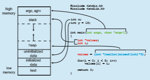
The GNU size command can be used to determine the size (in bytes) of some of these sections. Assuming the name of the executable file of the above C program is memory, the following is the output generated by entering the command size memory:

text data bss dec hex filename 1158 284 8 1450 5aa memory

The data field refers to uninitialized data, and bss refers to initialized data. (bss is a historical term referring to **_block started by symbol_**.) The dec and hex values are the sum of the three sections represented in decimal and hexadecimal, respectively.

• **New**. The process is being created.

• **Running**. Instructions are being executed.

• **Waiting**. The process is waiting for some event to occur (such as an I/O completion or reception of a signal).

• **Ready**. The process is waiting to be assigned to a processor.  


**Figure 3.2** Diagram of process state.

• **Terminated**. The process has finished execution.

These names are arbitrary, and they vary across operating systems. The states that they represent are found on all systems, however. Certain operating sys- tems also more finely delineate process states. It is important to realize that only one process can be _running_ on any processor core at any instant. Many processesmay be _ready_ and_waiting,_ however. The state diagram corresponding to these states is presented in Figure 3.2.

### Process Control Block

Each process is represented in the operating system by a **process control block** (**PCB**)—also called a **task control block**. A PCB is shown in Figure 3.3. It contains many pieces of information associated with a specific process, including these:

• **Process state**. The state may be new, ready, running, waiting, halted, and so on.

• **Program counter**. The counter indicates the address of the next instruction to be executed for this process.
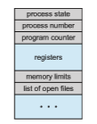

**Figure 3.3** Process control block (PCB).  

• **CPU registers**. The registers vary in number and type, depending on the computer architecture. They include accumulators, index registers, stack pointers, and general-purpose registers, plus any condition-code informa- tion. Alongwith the program counter, this state informationmust be saved when an interrupt occurs, to allow the process to be continued correctly afterward when it is rescheduled to run.

• **CPU-scheduling information**. This information includes a process prior- ity, pointers to scheduling queues, and any other scheduling parameters. (Chapter 5 describes process scheduling.)

• **Memory-management information**. This information may include such items as the value of the base and limit registers and the page tables, or the segment tables, depending on the memory system used by the operating system (Chapter 9).

• **Accounting information**. This information includes the amount of CPU and real time used, time limits, account numbers, job or process numbers, and so on.

• **I/O status information**. This information includes the list of I/O devices allocated to the process, a list of open files, and so on.

In brief, the PCB simply serves as the repository for all the data needed to start, or restart, a process, along with some accounting data.

### Threads

The processmodel discussed so far has implied that a process is a program that performs a single **thread** of execution. For example, when a process is running a word-processor program, a single thread of instructions is being executed. This single thread of control allows the process to perform only one task at a time. Thus, the user cannot simultaneously type in characters and run the spell checker. Most modern operating systems have extended the process concept to allow a process to have multiple threads of execution and thus to perform more than one task at a time. This feature is especially beneficial on multicore systems, where multiple threads can run in parallel. A multithreaded word processor could, for example, assign one thread to manage user input while another thread runs the spell checker. On systems that support threads, the PCB is expanded to include information for each thread. Other changes throughout the system are also needed to support threads. Chapter 4 explores threads in detail.

## Process Scheduling

The objective ofmultiprogramming is to have someprocess running at all times so as to maximize CPU utilization. The objective of time sharing is to switch a CPU core among processes so frequently that users can interact with each program while it is running. To meet these objectives, the **process scheduler** selects an available process (possibly from a set of several available processes) for program execution on a core. Each CPU core can run one process at a time.  

**_PROCESS REPRESENTATION IN LINUX_**

The process control block in the Linux operating system is rep- resented by the C structure task struct, which is found in the <include/linux/sched.h> include file in the kernel source-code directory. This structure contains all the necessary information for representing a process, including the state of the process, scheduling and memory-management information, list of open files, and pointers to the process’s parent and a list of its children and siblings. (A process’s **parent** is the process that created it; its **children** are any processes that it creates. Its **siblings** are children with the same parent process.) Some of these fields include:

long state;     /\* state of the process \*/ 
struct sched entity se;     /\* scheduling information \*/ 
struct task struct \*parent;     /\* this process’s parent \*/ 
struct list head children;    /\* this process’s children \*/ 
struct files struct \*files;    /\* list of open files \*/ 
struct mm struct \*mm;    /\* address space \*/

For example, the state of a process is represented by the field long state in this structure. Within the Linux kernel, all active processes are represented using a doubly linked list of task struct. The kernel maintains a pointer– current–to the process currently executing on the system, as shown below:


As an illustration of how the kernel might manipulate one of the fields in the task struct for a specified process, let’s assume the system would like to change the state of the process currently running to the value new state. If current is a pointer to the process currently executing, its state is changed with the following:

current->state = new state;

For a system with a single CPU core, there will never be more than one process running at a time, whereas a multicore system can run multiple processes at one time. If there are more processes than cores, excess processes will have  

**Figure 3.4** The ready queue and wait queues.

to wait until a core is free and can be rescheduled. The number of processes currently in memory is known as the **degree of multiprogramming**.

Balancing the objectives of multiprogramming and time sharing also requires taking the general behavior of a process into account. In general, most processes can be described as either I/O bound or CPU bound. An **I/O-bound process** is one that spends more of its time doing I/O than it spends doing computations. A **CPU-bound process**, in contrast, generates I/O requests infrequently, using more of its time doing computations.

### Scheduling Queues

As processes enter the system, they are put into a **ready queue**, where they are ready and waiting to execute on a CPU’s core This queue is generally stored as a linked list; a ready-queue header contains pointers to the first PCB in the list, and each PCB includes a pointer field that points to the next PCB in the ready queue.

The system also includes other queues. When a process is allocated a CPU core, it executes for a while and eventually terminates, is interrupted, or waits for the occurrence of a particular event, such as the completion of an I/O request. Suppose the process makes an I/O request to a device such as a disk. Since devices run significantly slower than processors, the process will have to wait for the I/O to become available. Processes that are waiting for a certain event to occur — such as completion of I/O — are placed in a **wait queue** (Figure 3.4).

A common representation of process scheduling is a **queueing diagram**, such as that in Figure 3.5. Two types of queues are present: the ready queue and a set of wait queues. The circles represent the resources that serve the queues, and the arrows indicate the flow of processes in the system.

A new process is initially put in the ready queue. It waits there until it is selected for execution, or **dispatched**. Once the process is allocated a CPU core and is executing, one of several events could occur:  
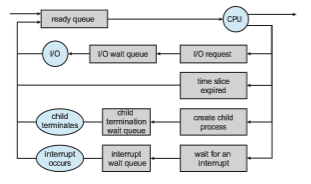
**Figure 3.5** Queueing-diagram representation of process scheduling.

• The process could issue an I/O request and then be placed in an I/O wait queue.

• The process could create a new child process and then be placed in a wait queue while it awaits the child’s termination.

• The process could be removed forcibly from the core, as a result of an interrupt or having its time slice expire, and be put back in the readyqueue.

In the first two cases, the process eventually switches from thewaiting state to the ready state and is then put back in the ready queue. Aprocess continues this cycle until it terminates, at which time it is removed from all queues and has its PCB and resources deallocated.

### CPU Scheduling

Aprocess migrates among the ready queue and various wait queues through- out its lifetime. The role of the **CPU scheduler** is to select from among the processes that are in the ready queue and allocate a CPU core to one of them. The CPU scheduler must select a new process for the CPU frequently. An I/O-bound process may execute for only a few milliseconds before waiting for an I/O request.Although a CPU-bound processwill require a CPU core for longer dura- tions, the scheduler is unlikely to grant the core to a process for an extended period. Instead, it is likely designed to forcibly remove the CPU from a process and schedule another process to run. Therefore, the CPU scheduler executes at least once every 100 milliseconds, although typically much more frequently.

Some operating systems have an intermediate form of scheduling, known as **swapping**, whose key idea is that sometimes it can be advantageous to remove a process from memory (and from active contention for the CPU) and thus reduce the degree of multiprogramming. Later, the process can be reintroduced into memory, and its execution can be continued where it left off. This scheme is known as **_swapping_** because a process can be “swapped out”  

from memory to disk, where its current status is saved, and later “swapped in” from disk back to memory, where its status is restored. Swapping is typically only necessary when memory has been overcommitted and must be freed up. Swapping is discussed in Chapter 9.

### Context Switch

Asmentioned in Section 1.2.1, interrupts cause the operating system to change a CPU core from its current task and to run a kernel routine. Such operations happen frequently on general-purpose systems. When an interrupt occurs, the system needs to save the current **context** of the process running on the CPU core so that it can restore that context when its processing is done, essentially suspending the process and then resuming it. The context is represented in the PCB of the process. It includes the value of the CPU registers, the process state (see Figure 3.2), and memory-management information. Generically, we perform a **state save** of the current state of the CPU core, be it in kernel or user mode, and then a **state restore** to resume operations.

Switching the CPU core to another process requires performing a state save of the current process and a state restore of a different process. This task is known as a **context switch** and is illustrated in Figure 3.6. When a context switch occurs, the kernel saves the context of the old process in its PCB and loads the saved context of the new process scheduled to run. Context- switch time is pure overhead, because the system does no useful work while switching. Switching speed varies frommachine tomachine, depending on the
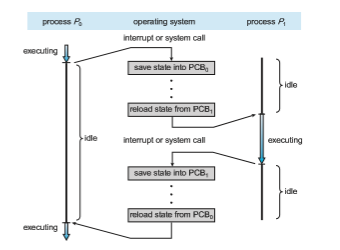
**Figure 3.6** Diagram showing context switch from process to process.  

**_MULTITASKING IN MOBILE SYSTEMS_**

Because of the constraints imposed on mobile devices, early versions of iOS did not provide user-application multitasking; only one application ran in the foregroundwhile all other user applications were suspended. Operating- system tasks were multitasked because they were written by Apple and well behaved. However, beginning with iOS 4, Apple provided a limited form of multitasking for user applications, thus allowing a single foreground appli- cation to run concurrently with multiple background applications. (On a mobile device, the **foreground** application is the application currently open and appearing on the display. The **background** application remains in mem- ory, but does not occupy the display screen.) The iOS 4 programming API provided support formultitasking, thus allowing a process to run in the back- groundwithout being suspended.However, it was limited and only available for a few application types. As hardware for mobile devices began to offer larger memory capacities, multiple processing cores, and greater battery life, subsequent versions of iOS began to support richer functionality for multi- tasking with fewer restrictions. For example, the larger screen on iPad tablets allowed running two foreground apps at the same time, a technique known as **split-screen**.

Since its origins, Android has supported multitasking and does not place constraints on the types of applications that can run in the background. If an application requires processing while in the background, the application must use a **service**, a separate application component that runs on behalf of the background process. Consider a streaming audio application: if the application moves to the background, the service continues to send audio data to the audio device driver on behalf of the background application. In fact, the service will continue to run even if the background application is suspended. Services do not have a user interface and have a small memory footprint, thus providing an efficient technique for multitasking in a mobile environment.

memory speed, the number of registers that must be copied, and the existence of special instructions (such as a single instruction to load or store all registers). A typical speed is a several microseconds.

Context-switch times are highly dependent on hardware support. For instance, some processors provide multiple sets of registers. A context switch here simply requires changing the pointer to the current register set. Of course, if there are more active processes than there are register sets, the system resorts to copying register data to and frommemory, as before. Also, themore complex the operating system, the greater the amount of work that must be done during a context switch. As we will see in Chapter 9, advanced memory-management techniques may require that extra data be switched with each context. For instance, the address space of the current process must be preserved as the space of the next task is prepared for use. How the address space is preserved, and what amount of work is needed to preserve it, depend on the memory- management method of the operating system.  


## Operations on Processes

The processes in most systems can execute concurrently, and they may be cre- ated and deleted dynamically. Thus, these systems must provide a mechanism for process creation and termination. In this section, we explore the mecha- nisms involved in creating processes and illustrate process creation on UNIX and Windows systems.

### Process Creation

During the course of execution, a processmay create several new processes. As mentioned earlier, the creating process is called a parent process, and the new processes are called the children of that process. Each of these new processes may in turn create other processes, forming a **tree** of processes.

Most operating systems (including UNIX, Linux, and Windows) identify processes according to a unique **process identifie** (or **pid**), which is typically an integer number. The pid provides a unique value for each process in the system, and it can be used as an index to access various attributes of a process within the kernel.

Figure 3.7 illustrates a typical process tree for the Linux operating system, showing the name of each process and its pid. (We use the term **_process_** rather loosely in this situation, as Linux prefers the term **_task_** instead.) The systemd process (which always has a pid of 1) serves as the root parent process for all user processes, and is the first user process created when the system boots. Once the system has booted, the systemd process creates processes which provide additional services such as a web or print server, an ssh server, and the like. In Figure 3.7, we see two children of systemd—logind and sshd. The logind process is responsible for managing clients that directly log onto the system. In this example, a client has logged on and is using the bash shell, which has been assigned pid 8416. Using the bash command-line interface, this user has created the process ps as well as the vim editor. The sshd process is responsible for managing clients that connect to the system by using ssh (which is short for **_secure shell_**).
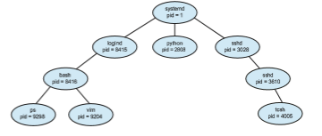
**Figure 3.7** A tree of processes on a typical Linux system.  

**_THE init AND systemd PROCESSES_**

Traditional UNIX systems identify the process init as the root of all child processes. init (also known as **System V** init) is assigned a pid of 1, and is the first process created when the system is booted. On a process tree similar to what is shown in Figure 3.7, init is at the root.

Linux systems initially adopted the System V init approach, but recent distributions have replaced it with systemd. As described in Section 3.3.1, systemd serves as the system’s initial process, much the same as System V init; however it is much more flexible, and can provide more services, than init.

On UNIX and Linux systems, we can obtain a listing of processes by using the ps command. For example, the command

ps -el

will list complete information for all processes currently active in the system. A process tree similar to the one shown in Figure 3.7 can be constructed by recursively tracing parent processes all the way to the systemd process. (In addition, Linux systems provide the pstree command, which displays a tree of all processes in the system.)

In general, when a process creates a child process, that child process will need certain resources (CPU time, memory, files, I/O devices) to accomplish its task. A child process may be able to obtain its resources directly from the operating system, or it may be constrained to a subset of the resources of the parent process. The parent may have to partition its resources among its children, or it may be able to share some resources (such as memory or files) among several of its children. Restricting a child process to a subset of the parent’s resources prevents any process from overloading the system by creating too many child processes.

In addition to supplying various physical and logical resources, the parent process may pass along initialization data (input) to the child process. For example, consider a processwhose function is to display the contents of a file— say, hw1.c—on the screen of a terminal.When the process is created, it will get, as an input from its parent process, the name of the file hw1.c. Using that file name, it will open the file and write the contents out. It may also get the name of the output device. Alternatively, some operating systems pass resources to child processes. On such a system, the new process may get two open files, hw1.c and the terminal device, and may simply transfer the datum between the two.

When a process creates a new process, two possibilities for execution exist:

**1\.** The parent continues to execute concurrently with its children.

**2\.** The parent waits until some or all of its children have terminated.

There are also two address-space possibilities for the new process:  


**1\.** The child process is a duplicate of the parent process (it has the same program and data as the parent).

**2\.** The child process has a new program loaded into it.

To illustrate these differences, let’s first consider the UNIX operating system. In UNIX, as we’ve seen, each process is identified by its process identifier, which is a unique integer. A new process is created by the fork() system call. The new process consists of a copy of the address space of the original process. This mechanism allows the parent process to communicate easilywith its child process. Both processes (the parent and the child) continue execution at the instruction after the fork(), with one difference: the return code for the fork() is zero for the new (child) process, whereas the (nonzero) process identifier of the child is returned to the parent.

After a fork() system call, one of the two processes typically uses the exec() system call to replace the process’s memory space with a new pro- gram. The exec() system call loads a binary file into memory (destroying the memory image of the program containing the exec() system call) and starts

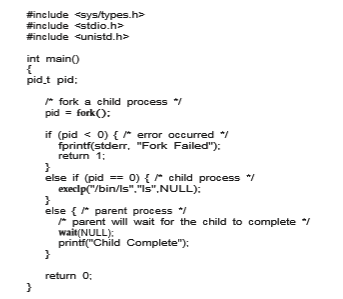
**Figure 3.8** Creating a separate process using the UNIX fork() system call.  

its execution. In this manner, the two processes are able to communicate and then go their separate ways. The parent can then create more children; or, if it has nothing else to do while the child runs, it can issue a wait() system call to move itself off the ready queue until the termination of the child. Because the call to exec() overlays the process’s address space with a new program, exec() does not return control unless an error occurs.

The C program shown in Figure 3.8 illustrates the UNIX system calls pre- viously described. We now have two different processes running copies of the same program. The only difference is that the value of the variable pid for the child process is zero, while that for the parent is an integer value greater than zero (in fact, it is the actual pid of the child process). The child process inherits privileges and scheduling attributes from the parent, as well certain resources, such as open files. The child process then overlays its address space with the UNIX command /bin/ls (used to get a directory listing) using the execlp() system call (execlp() is a version of the exec() system call). The parent waits for the child process to complete with the wait() system call. When the child process completes (by either implicitly or explicitly invoking exit()), the par- ent process resumes from the call to wait(), where it completes using the exit() system call. This is also illustrated in Figure 3.9.

Of course, there is nothing to prevent the child from **_not_** invoking exec() and instead continuing to execute as a copy of the parent process. In this scenario, the parent and child are concurrent processes running the same code instructions. Because the child is a copy of the parent, each process has its own copy of any data.

As an alternative example, we next consider process creation in Windows. Processes are created in the Windows API using the CreateProcess() func- tion, which is similar to fork() in that a parent creates a new child process. However, whereas fork() has the child process inheriting the address space of its parent, CreateProcess() requires loading a specified program into the address space of the child process at process creation. Furthermore, whereas fork() is passed no parameters, CreateProcess() expects no fewer than ten parameters.

The C program shown in Figure 3.10 illustrates the CreateProcess() function, which creates a child process that loads the application mspaint.exe. We opt for many of the default values of the ten parameters passed to Cre- ateProcess(). Readers interested in pursuing the details of process creation and management in the Windows API are encouraged to consult the biblio- graphical notes at the end of this chapter.

The two parameters passed to the CreateProcess() function are instances of the STARTUPINFO and PROCESS INFORMATION structures. STARTUPINFO specifies many properties of the new process, such as window
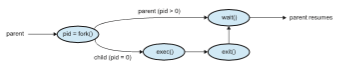
**Figure 3.9** Process creation using the fork() system call.  


**Figure 3.10** Creating a separate process using the Windows API.

size and appearance and handles to standard input and output files. The PROCESS INFORMATION structure contains a handle and the identifiers to the newly created process and its thread. We invoke the ZeroMemory() function to allocate memory for each of these structures before proceeding with CreateProcess().

The first two parameters passed to CreateProcess() are the application name and command-line parameters. If the application name is NULL (as it is in this case), the command-line parameter specifies the application to load.  

In this instance, we are loading the Microsoft Windows mspaint.exe appli- cation. Beyond these two initial parameters, we use the default parameters for inheriting process and thread handles aswell as specifying that therewill be no creation flags.We also use the parent’s existing environment block and starting directory. Last, we provide two pointers to the STARTUPINFO and PROCESS - INFORMATION structures created at the beginning of the program. In Figure 3.8, the parent process waits for the child to complete by invoking the wait() system call. The equivalent of this in Windows is WaitForSingleObject(), which is passed a handle of the child process—pi.hProcess—and waits for this process to complete. Once the child process exits, control returns from the WaitForSingleObject() function in the parent process.

### Process Termination

A process terminates when it finishes executing its final statement and asks the operating system to delete it by using the exit() system call. At that point, the process may return a status value (typically an integer) to its waiting parent process (via the wait() system call). All the resources of the process —including physical and virtual memory, open files, and I/O buffers—are deallocated and reclaimed by the operating system.

Termination can occur in other circumstances as well. A process can cause the termination of another process via an appropriate system call (for example, TerminateProcess() inWindows). Usually, such a system call can be invoked only by the parent of the process that is to be terminated. Otherwise, a user— or a misbehaving application—could arbitrarily kill another user’s processes. Note that a parent needs to know the identities of its children if it is to terminate them. Thus, when one process creates a new process, the identity of the newly created process is passed to the parent.

A parent may terminate the execution of one of its children for a variety of reasons, such as these:

• The child has exceeded its usage of some of the resources that it has been allocated. (To determine whether this has occurred, the parent must have a mechanism to inspect the state of its children.)

• The task assigned to the child is no longer required.

• The parent is exiting, and the operating system does not allow a child to continue if its parent terminates.

Some systems do not allow a child to exist if its parent has terminated. In such systems, if a process terminates (either normally or abnormally), then all its children must also be terminated. This phenomenon, referred to as **cascading termination**, is normally initiated by the operating system.

To illustrate process execution and termination, consider that, in Linux and UNIX systems, we can terminate a process by using the exit() system call, providing an exit status as a parameter:

/\* exit with status 1 \*/ exit(1);  

In fact, under normal termination, exit() will be called either directly (as shown above) or indirectly, as the C run-time library (which is added to UNIX executable files) will include a call to exit() by default.

A parent process may wait for the termination of a child process by using the wait() system call. The wait() system call is passed a parameter that allows the parent to obtain the exit status of the child. This system call also returns the process identifier of the terminated child so that the parent can tell which of its children has terminated:

pid t pid; int status;

pid = wait(&status);

When a process terminates, its resources are deallocated by the operating system. However, its entry in the process table must remain there until the parent calls wait(), because the process table contains the process’s exit status. A process that has terminated, but whose parent has not yet called wait(), is known as a **zombie** process. All processes transition to this state when they terminate, but generally they exist as zombies only briefly. Once the parent calls wait(), the process identifier of the zombie process and its entry in the process table are released.

Now consider what would happen if a parent did not invoke wait() and instead terminated, thereby leaving its child processes as **orphans**. Traditional UNIX systems addressed this scenario by assigning the init process as the new parent to orphan processes. (Recall from Section 3.3.1 that init serves as the root of the process hierarchy in UNIX systems.) The init process periodically invokes wait(), thereby allowing the exit status of any orphaned process to be collected and releasing the orphan’s process identifier and process-table entry.

Althoughmost Linux systems have replaced initwith systemd, the latter process can still serve the same role, although Linux also allows processes other than systemd to inherit orphan processes and manage their termination.

#### Android Process Hierarchy

Because of resource constraints such as limited memory, mobile operating systems may have to terminate existing processes to reclaim limited system resources. Rather than terminating an arbitrary process, Android has identified an **_importance hierarchy_** of processes, and when the system must terminate a process to make resources available for a new, or more important, process, it terminates processes in order of increasing importance. From most to least important, the hierarchy of process classifications is as follows:

• **Foreground process**—The current process visible on the screen, represent- ing the application the user is currently interacting with

• **Visible process**—A process that is not directly visible on the foreground but that is performing an activity that the foreground process is referring to (that is, a process performing an activity whose status is displayed on the foreground process)  

• **Service process**—A process that is similar to a background process but is performing an activity that is apparent to the user (such as streaming music)

• **Background process**—A process that may be performing an activity but is not apparent to the user.

• **Empty process**—A process that holds no active components associated with any application

If system resources must be reclaimed, Android will first terminate empty processes, followed by background processes, and so forth. Processes are assigned an importance ranking, and Android attempts to assign a process as high a ranking as possible. For example, if a process is providing a service and is also visible, it will be assigned the more-important visible classification.

Furthermore, Android development practices suggest following the guide- lines of the process life cycle. When these guidelines are followed, the state of a process will be saved prior to termination and resumed at its saved state if the user navigates back to the application.

## Interprocess Communication

Processes executing concurrently in the operating system may be either inde- pendent processes or cooperating processes. Aprocess is **_independent_** if it does not share data with any other processes executing in the system. A process is **_cooperating_** if it can affect or be affected by the other processes executing in the system. Clearly, any process that shares data with other processes is a cooperating process.

There are several reasons for providing an environment that allows process cooperation:

• **Information sharing**. Since several applications may be interested in the same piece of information (for instance, copying and pasting), we must provide an environment to allow concurrent access to such information.

• **Computation speedup**. If we want a particular task to run faster, we must break it into subtasks, each of which will be executing in parallel with the others. Notice that such a speedup can be achieved only if the computer has multiple processing cores.

• **Modularity**. We may want to construct the system in a modular fashion, dividing the system functions into separate processes or threads, as we discussed in Chapter 2.

Cooperating processes require an **interprocess communication** (**IPC**) mechanism that will allow them to exchange data— that is, send data to and receive data from each other. There are two fundamental models of interprocess communication: **shared memory** and **message passing**. In the shared-memory model, a region of memory that is shared by the cooperating processes is established. Processes can then exchange information by reading and writing data to the shared region. In the message-passing model,  

**_MULTIPROCESS ARCHITECTURE—CHROME BROWSER_**

Many websites contain active content, such as JavaScript, Flash, and HTML5 to provide a rich and dynamic web-browsing experience. Unfortunately, these web applications may also contain software bugs, which can result in sluggish response times and can even cause the web browser to crash. This isn’t a big problem in aweb browser that displays content from only oneweb- site. But most contemporary web browsers provide tabbed browsing, which allows a single instance of aweb browser application to open severalwebsites at the same time, with each site in a separate tab. To switch between the dif- ferent sites, a user need only click on the appropriate tab. This arrangement is illustrated below:

A problemwith this approach is that if aweb application in any tab crashes, the entire process—including all other tabs displaying additional websites— crashes as well.

Google’s Chrome web browser was designed to address this issue by using a multiprocess architecture. Chrome identifies three different types of processes: browser, renderers, and plug-ins.

• The **browser** process is responsible for managing the user interface as well as disk and network I/O. A new browser process is created when Chrome is started. Only one browser process is created.

• **Renderer** processes contain logic for rendering web pages. Thus, they contain the logic for handling HTML, Javascript, images, and so forth. As a general rule, a new renderer process is created for each website opened in a new tab, and so several renderer processes may be active at the same time.

• A **plug-in** process is created for each type of plug-in (such as Flash or QuickTime) in use. Plug-in processes contain the code for the plug-in as well as additional code that enables the plug-in to communicate with associated renderer processes and the browser process.

The advantage of the multiprocess approach is that websites run in iso- lation from one another. If one website crashes, only its renderer process is affected; all other processes remain unharmed. Furthermore, renderer pro- cesses run in a **sandbox**, which means that access to disk and network I/O is restricted, minimizing the effects of any security exploits.

communication takes place by means of messages exchanged between the cooperating processes. The two communications models are contrasted in Figure 3.11.  
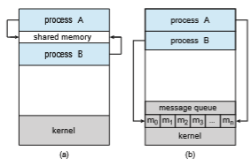
**Figure 3.11** Communications models. (a) Shared memory. (b) Message passing.

Both of the models just mentioned are common in operating systems, and many systems implement both. Message passing is useful for exchanging smaller amounts of data, because no conflicts need be avoided. Message pass- ing is also easier to implement in a distributed system than shared memory. (Although there are systems that provide distributed shared memory, we do not consider them in this text.) Sharedmemory can be faster thanmessagepass- ing, since message-passing systems are typically implemented using system calls and thus require the more time-consuming task of kernel intervention. In shared-memory systems, system calls are required only to establish shared- memory regions. Once shared memory is established, all accesses are treated as routine memory accesses, and no assistance from the kernel is required.

In Section 3.5 and Section 3.6 we explore shared-memory and message- passing systems in more detail.

## IPC in Shared-Memory Systems

Interprocess communication using shared memory requires communicating processes to establish a region of shared memory. Typically, a shared-memory region resides in the address space of the process creating the shared-memory segment. Other processes that wish to communicate using this shared-memory segment must attach it to their address space. Recall that, normally, the oper- ating system tries to prevent one process from accessing another process’s memory. Shared memory requires that two or more processes agree to remove this restriction. They can then exchange information by reading and writing data in the shared areas. The form of the data and the location are determined by these processes and are not under the operating system’s control. The pro- cesses are also responsible for ensuring that they are not writing to the same location simultaneously.  


To illustrate the concept of cooperating processes, let’s consider the pro- ducer–consumer problem, which is a common paradigm for cooperating pro- cesses. A **producer** process produces information that is consumed by a **con- sumer** process. For example, a compiler may produce assembly code that is consumed by an assembler. The assembler, in turn, may produce object mod- ules that are consumed by the loader. The producer–consumer problem also provides a usefulmetaphor for the client–server paradigm.We generally think of a server as a producer and a client as a consumer. For example, a web server produces (that is, provides) web content such as HTML files and images, which are consumed (that is, read) by the client web browser requesting the resource.

One solution to the producer–consumer problem uses shared memory. To allow producer and consumer processes to run concurrently, we must have available a buffer of items that can be filled by the producer and emptied by the consumer. This buffer will reside in a region of memory that is shared by the producer and consumer processes. Aproducer can produce one itemwhile the consumer is consuming another item. The producer and consumer must be synchronized, so that the consumer does not try to consume an item that has not yet been produced.

Two types of buffers can be used. The **unbounded buffer** places no prac- tical limit on the size of the buffer. The consumer may have to wait for new items, but the producer can always produce new items. The **bounded buffer** assumes a fixed buffer size. In this case, the consumer must wait if the buffer is empty, and the producer must wait if the buffer is full.

Let’s look more closely at how the bounded buffer illustrates interprocess communication using shared memory. The following variables reside in a region of memory shared by the producer and consumer processes:
```
#define BUFFER SIZE 10

typedef struct _{_ . . .

_}_ item;

item buffer\[BUFFER SIZE\];
 int in = 0; int out = 0;
```
The shared buffer is implemented as a circular arraywith two logical pointers: in and out. The variable in points to the next free position in the buffer; out points to the first full position in the buffer. The buffer is empty when in == out; the buffer is full when ((in + 1) % BUFFER SIZE) == out.

The code for the producer process is shown in Figure 3.12, and the code for the consumer process is shown in Figure 3.13. The producer process has a local variable next produced in which the new item to be produced is stored. The consumer process has a local variable next consumed in which the item to be consumed is stored.

This scheme allows at most BUFFER SIZE − 1 items in the buffer at the same time. We leave it as an exercise for you to provide a solution in which BUFFER SIZE items can be in the buffer at the same time. In Section 3.7.1, we illustrate the POSIX API for shared memory.  


**Figure 3.12** The producer process using shared memory.

One issue this illustration does not address concerns the situation in which both the producer process and the consumer process attempt to access the shared buffer concurrently. In Chapter 6 and Chapter 7, we discuss how syn- chronization among cooperating processes can be implemented effectively in a shared-memory environment.

## IPC in Message-Passing Systems

In Section 3.5, we showed how cooperating processes can communicate in a shared-memory environment. The scheme requires that these processes share a region of memory and that the code for accessing andmanipulating the shared memory be written explicitly by the application programmer. Another way to achieve the same effect is for the operating system to provide the means for cooperating processes to communicate with each other via a message-passing facility.
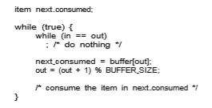
**Figure 3.13** The consumer process using shared memory.  

Message passingprovides amechanism to allowprocesses to communicate and to synchronize their actions without sharing the same address space. It is particularly useful in a distributed environment, where the communicating processes may reside on different computers connected by a network. For example, an Internet chat program could be designed so that chat participants communicate with one another by exchanging messages.

Amessage-passing facility provides at least two operations:

send(message) and

receive(message)

Messages sent by a process can be either fixed or variable in size. If only fixed-sized messages can be sent, the system-level implementation is straight- forward. This restriction, however, makes the task of programming more diffi- cult. Conversely, variable-sizedmessages require amore complex system-level implementation, but the programming task becomes simpler. This is a common kind of tradeoff seen throughout operating-system design.

If processes_P_ and_Q_want to communicate, theymust sendmessages to and receive messages from each other: a **_communication link_** must exist between them. This link can be implemented in a variety ofways.We are concerned here notwith the link’s physical implementation (such as sharedmemory, hardware bus, or network, which are covered in Chapter 19) but rather with its logical implementation. Here are several methods for logically implementing a link and the send()/receive() operations:

• Direct or indirect communication

• Synchronous or asynchronous communication

• Automatic or explicit buffering

We look at issues related to each of these features next.

### Naming

Processes that want to communicate must have a way to refer to each other. They can use either direct or indirect communication.

Under **direct communication**, each process that wants to communicate must explicitly name the recipient or sender of the communication. In this scheme, the send() and receive() primitives are defined as:

• send(P, message)—Send a message to process P.

• receive(Q, message)—Receive a message from process Q.

A communication link in this scheme has the following properties:

• A link is established automatically between every pair of processes that want to communicate. The processes need to know only each other’s identity to communicate.  

• A link is associated with exactly two processes.

• Between each pair of processes, there exists exactly one link.

This scheme exhibits **_symmetry_** in addressing; that is, both the sender pro- cess and the receiver process must name the other to communicate. A variant of this scheme employs **_asymmetry_** in addressing. Here, only the sender names the recipient; the recipient is not required to name the sender. In this scheme, the send() and receive() primitives are defined as follows:

• send(P, message)—Send a message to process P.

• receive(id, message)—Receive a message from any process. The vari- able id is set to the name of the process with which communication has taken place.

The disadvantage in both of these schemes (symmetric and asymmetric) is the limited modularity of the resulting process definitions. Changing the identifier of a process may necessitate examining all other process definitions. All references to the old identifier must be found, so that they can be modified to the new identifier. In general, any such **_hard-coding_** techniques, where iden- tifiers must be explicitly stated, are less desirable than techniques involving indirection, as described next.

With **_indirect communication_**, the messages are sent to and received from **_mailboxes_**, or **_ports_**. A mailbox can be viewed abstractly as an object into which messages can be placed by processes and from which messages can be removed. Each mailbox has a unique identification. For example, POSIX message queues use an integer value to identify a mailbox. Aprocess can com- municate with another process via a number of different mailboxes, but two processes can communicate only if they have a shared mailbox. The send() and receive() primitives are defined as follows:

• send(A, message)—Send a message to mailbox A.

• receive(A, message)—Receive a message from mailbox A.

In this scheme, a communication link has the following properties:

• A link is established between a pair of processes only if both members of the pair have a shared mailbox.

• A link may be associated with more than two processes.

• Between each pair of communicating processes, a number of different links may exist, with each link corresponding to one mailbox.

Now suppose that processes _P_1, _P_2, and _P_3 all share mailbox _A_. Process _P_1 sends amessage to_A_, while both _P_2 and_P_3 execute a receive() from_A_.Which process will receive the message sent by _P_1? The answer depends on which of the following methods we choose:

• Allow a link to be associated with two processes at most.  


• Allow at most one process at a time to execute a receive() operation.

• Allow the system to select arbitrarily which process will receive the mes- sage (that is, either _P_2 or _P_3, but not both, will receive the message). The system may define an algorithm for selecting which process will receive the message (for example, **_round robin,_**where processes take turns receiv- ing messages). The system may identify the receiver to the sender.

A mailbox may be owned either by a process or by the operating system. If the mailbox is owned by a process (that is, the mailbox is part of the address space of the process), then we distinguish between the owner (which can only receive messages through this mailbox) and the user (which can only send messages to the mailbox). Since each mailbox has a unique owner, there can be no confusion about which process should receive a message sent to this mailbox. When a process that owns a mailbox terminates, the mailbox disappears. Any process that subsequently sends a message to this mailbox must be notified that the mailbox no longer exists.

In contrast, a mailbox that is owned by the operating system has an exis- tence of its own. It is independent and is not attached to any particular process. The operating system then must provide a mechanism that allows a process to do the following:

• Create a new mailbox.

• Send and receive messages through the mailbox.

• Delete a mailbox.

The process that creates a new mailbox is that mailbox’s owner by default. Initially, the owner is the only process that can receive messages through this mailbox. However, the ownership and receiving privilege may be passed to other processes through appropriate system calls. Of course, this provision could result in multiple receivers for each mailbox.

### Synchronization

Communication between processes takes place through calls to send() and receive() primitives. There are different design options for implementing each primitive. Message passing may be either **blocking** or **nonblocking**— also known as **synchronous** and **asynchronous**. (Throughout this text, youwill encounter the concepts of synchronous and asynchronous behavior in relation to various operating-system algorithms.)

• **Blocking send**. The sending process is blocked until the message is received by the receiving process or by the mailbox.

• **Nonblocking send**. The sending process sends the message and resumes operation.

• **Blocking receive**. The receiver blocks until a message is available.

• **Nonblocking receive**. The receiver retrieves either a valid message or a null.  


**Figure 3.14** The producer process using message passing.

Different combinations of send() and receive() are possible. When both send() and receive() are blocking, we have a **rendezvous** between the sender and the receiver. The solution to the producer–consumer problem becomes trivial when we use blocking send() and receive() statements. The producer merely invokes the blocking send() call and waits until the message is delivered to either the receiver or the mailbox. Likewise, when the consumer invokes receive(), it blocks until a message is available. This is illustrated in Figures 3.14 and 3.15.

### Buffering

Whether communication is direct or indirect, messages exchanged by commu- nicating processes reside in a temporary queue. Basically, such queues can be implemented in three ways:

• **Zero capacity**. The queue has a maximum length of zero; thus, the link cannot have any messages waiting in it. In this case, the sender must block until the recipient receives the message.

• **Bounded capacity**. The queue has finite length _n;_ thus, at most _n_messages can reside in it. If the queue is not full when a new message is sent, the message is placed in the queue (either the message is copied or a pointer to the message is kept), and the sender can continue execution without

**Figure 3.15** The consumer process using message passing.  

waiting. The link’s capacity is finite, however. If the link is full, the sender must block until space is available in the queue.

• **Unbounded capacity**. The queue’s length is potentially infinite; thus, any number of messages can wait in it. The sender never blocks.

The zero-capacity case is sometimes referred to as a message system with no buffering. The other cases are referred to as systems with automatic buffering.

## Examples of IPC Systems

In this section, we explore four different IPC systems. We first cover the POSIX API for shared memory and then discuss message passing in the Mach oper- ating system. Next, we present Windows IPC, which interestingly uses shared memory as a mechanism for providing certain types of message passing. We conclude with pipes, one of the earliest IPC mechanisms on UNIX systems.

### POSIX Shared Memory

Several IPC mechanisms are available for POSIX systems, including shared memory and message passing. Here, we explore the POSIX API for shared memory.

POSIX shared memory is organized using memory-mapped files, which associate the region of shared memory with a file. A process must first create a shared-memory object using the shm open() system call, as follows:

fd = shm open(name, O CREAT | O RDWR, 0666);

The first parameter specifies the name of the shared-memory object. Processes that wish to access this shared memory must refer to the object by this name. The subsequent parameters specify that the shared-memory object is to be cre- ated if it does not yet exist (O CREAT) and that the object is open for reading and writing (O RDWR). The last parameter establishes the file-access permissions of the shared-memory object. A successful call to shm open() returns an integer file descriptor for the shared-memory object.

Once the object is established, the ftruncate() function is used to configure the size of the object in bytes. The call

ftruncate(fd, 4096);

sets the size of the object to 4,096 bytes. Finally, the mmap() function establishes a memory-mapped file containing

the shared-memory object. It also returns a pointer to the memory-mapped file that is used for accessing the shared-memory object.

The programs shown in Figure 3.16 and Figure 3.17 use the producer– consumer model in implementing shared memory. The producer establishes a shared-memory object and writes to shared memory, and the consumer reads from shared memory.  


**Figure 3.16** Producer process illustrating POSIX shared-memory API.  

The producer, shown in Figure 3.16, creates a shared-memory object named OS and writes the infamous string "Hello World!" to shared memory. The program memory-maps a shared-memory object of the specified size and allows writing to the object. The flag MAP SHARED specifies that changes to the shared-memory object will be visible to all processes sharing the object. Notice that we write to the shared-memory object by calling the sprintf() function and writing the formatted string to the pointer ptr. After each write, we must increment the pointer by the number of bytes written.
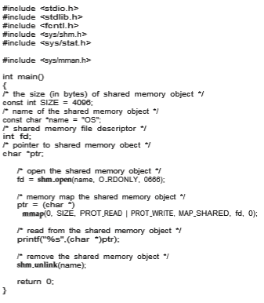
**Figure 3.17** Consumer process illustrating POSIX shared-memory API.  

The consumer process, shown in Figure 3.17, reads and outputs the con- tents of the shared memory. The consumer also invokes the shm unlink() function, which removes the shared-memory segment after the consumer has accessed it.We provide further exercises using the POSIX shared-memoryAPI in the programming exercises at the end of this chapter. Additionally, we provide more detailed coverage of memory mapping in Section 13.5.

### Mach Message Passing

As an example of message passing, we next consider the Mach operating system.Mach was especially designed for distributed systems, but was shown to be suitable for desktop and mobile systems as well, as evidenced by its inclusion in the macOS and iOS operating systems, as discussed in Chapter 2.

The Mach kernel supports the creation and destruction of multiple **_tasks_**, which are similar to processes but have multiple threads of control and fewer associated resources.Most communication inMach—including all inter- task communication—is carried out by **messages**. Messages are sent to, and received from,mailboxes,which are called**ports** inMach. Ports are finite in size and unidirectional; for two-way communication, a message is sent to one port, and a response is sent to a separate **_reply_** port. Each port may have multiple senders, but only one receiver. Mach uses ports to represent resources such as tasks, threads, memory, and processors, while message passing provides an object-oriented approach for interacting with these system resources and services. Message passing may occur between any two ports on the same host or on separate hosts on a distributed system.

Associated with each port is a collection of **port rights** that identify the capabilities necessary for a task to interact with the port. For example, for a task to receive a message from a port, it must have the capability MACH PORT RIGHT RECEIVE for that port. The task that creates a port is that port’s owner, and the owner is the only task that is allowed to receivemessages from that port. A port’s owner may also manipulate the capabilities for a port. This is most commonly done in establishing a reply port. For example, assume that task _T_1 owns port _P_1, and it sends a message to port _P_2, which is owned by task _T_2\. If _T_1 expects to receive a reply from _T_2, it must grant _T_2 the right MACH PORT RIGHT SEND for port _P_1\. Ownership of port rights is at the task level, which means that all threads belonging to the same task share the same port rights. Thus, two threads belonging to the same task can easily communicate by exchanging messages through the per-thread port associated with each thread.

When a task is created, two special ports—the **_Task Self_** port and the **_Notify_** port—are also created. The kernel has receive rights to the Task Self port, which allows a task to send messages to the kernel. The kernel can send notification of event occurrences to a task’s Notify port (to which, of course, the task has receive rights).

The mach port allocate() function call creates a new port and allocates space for its queue of messages. It also identifies the rights for the port. Each port right represents a **_name_** for that port, and a port can only be accessed via a right. Port names are simple integer values and behave much like UNIX file descriptors. The following example illustrates creating a port using this API:
```
mach port t port; // the name of the port right

mach port allocate( mach task self(), // a task referring to itself MACH PORT RIGHT RECEIVE, // the right for this port &port); // the name of the port right
```
Each task also has access to a **bootstrap port**, which allows a task to register a port it has createdwith a system-wide **bootstrap server**. Once a port has been registered with the bootstrap server, other tasks can look up the port in this registry and obtain rights for sending messages to the port.

The queue associated with each port is finite in size and is initially empty. As messages are sent to the port, the messages are copied into the queue. All messages are delivered reliably and have the same priority. Mach guarantees that multiple messages from the same sender are queued in first-in, first- out (FIFO) order but does not guarantee an absolute ordering. For instance, messages from two senders may be queued in any order.

Mach messages contain the following two fields:

• A fixed-size message header containing metadata about the message, including the size of the message as well as source and destination ports. Commonly, the sending thread expects a reply, so the port name of the source is passed on to the receiving task, which can use it as a “return address” in sending a reply.

• A variable-sized body containing data.

Messages may be either **_simple_** or **_complex_**. A simple message contains ordinary, unstructured user data that are not interpreted by the kernel. A complex message may contain pointers to memory locations containing data (known as “out-of-line” data) or may also be used for transferring port rights to another task. Out-of-line data pointers are especially useful when amessage must pass large chunks of data. A simple message would require copying and packaging the data in the message; out-of-line data transmission requires only a pointer that refers to the memory location where the data are stored.

The function mach msg() is the standard API for both sending and receiving messages. The value of one of the function’s parameters—either MACH SEND MSG or MACH RCV MSG—indicates if it is a send or receive operation. We now illustrate how it is used when a client task sends a simple message to a server task. Assume there are two ports—client and server—associated with the client and server tasks, respectively. The code in Figure 3.18 shows the client task constructing a header and sending a message to the server, as well as the server task receiving the message sent from the client.

The mach msg() function call is invoked by user programs for performing message passing. mach msg() then invokes the function mach msg trap(), which is a system call to the Mach kernel. Within the kernel, mach msg trap() next calls the function mach msg overwrite trap(), which then handles the actual passing of the message.  
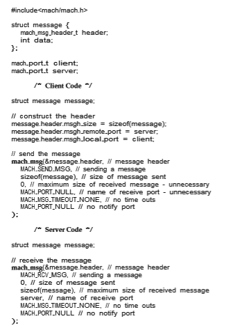
**Figure 3.18** Example program illustrating message passing in Mach.

The send and receive operations themselves are flexible. For instance,when a message is sent to a port, its queue may be full. If the queue is not full, the message is copied to the queue, and the sending task continues. If the  

port’s queue is full, the sender has several options (specified via parameters to mach msg():

**1\.** Wait indefinitely until there is room in the queue.

**2\.** Wait at most _n_milliseconds.

**3\.** Do not wait at all but rather return immediately.

**4\.** Temporarily cache a message. Here, a message is given to the operating system to keep, even though the queue to which that message is being sent is full. When the message can be put in the queue, a notification message is sent back to the sender. Only one message to a full queue can be pending at any time for a given sending thread.

The final option is meant for server tasks. After finishing a request, a server task may need to send a one-time reply to the task that requested the service, but it must also continue with other service requests, even if the reply port for a client is full.

The major problem with message systems has generally been poor perfor- mance caused by copying of messages from the sender’s port to the receiver’s port. The Mach message system attempts to avoid copy operations by using virtual-memory-management techniques (Chapter 10). Essentially,Machmaps the address space containing the sender’s message into the receiver’s address space. Therefore, the message itself is never actually copied, as both the sender and receiver access the same memory. This message-management technique provides a large performance boost but works only for intrasystem messages.

### Windows

The Windows operating system is an example of modern design that employs modularity to increase functionality and decrease the time needed to imple- ment new features. Windows provides support for multiple operating envi- ronments, or **_subsystems._** Application programs communicate with these sub- systems via a message-passingmechanism. Thus, application programs can be considered clients of a subsystem server.

The message-passing facility in Windows is called the **advanced local pro- cedure call** (**ALPC**) facility. It is used for communication between two processes on the same machine. It is similar to the standard remote procedure call (RPC) mechanism that is widely used, but it is optimized for and specific toWindows. (Remote procedure calls are covered in detail in Section 3.8.2.) LikeMach,Win- dows uses a port object to establish and maintain a connection between two processes. Windows uses two types of ports: **connection ports** and **communi- cation ports**.

Server processes publish connection-port objects that are visible to all pro- cesses. When a client wants services from a subsystem, it opens a handle to the server’s connection-port object and sends a connection request to that port. The server then creates a channel and returns a handle to the client. The chan- nel consists of a pair of private communication ports: one for client–server messages, the other for server–client messages. Additionally, communication channels support a callback mechanism that allows the client and server to accept requests when they would normally be expecting a reply.  
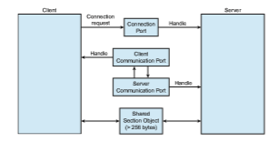

**Figure 3.19** Advanced local procedure calls in Windows.

When an ALPC channel is created, one of threemessage-passing techniques is chosen:

**1\.** For small messages (up to 256 bytes), the port’s message queue is used as intermediate storage, and the messages are copied from one process to the other.

**2\.** Larger messages must be passed through a **section object**, which is a region of shared memory associated with the channel.

**3\.** When the amount of data is too large to fit into a section object, an API is available that allows server processes to read and write directly into the address space of a client.

The client has to decide when it sets up the channel whether it will need to send a large message. If the client determines that it does want to send large messages, it asks for a section object to be created. Similarly, if the server decides that replies will be large, it creates a section object. So that the section object can be used, a small message is sent that contains a pointer and size information about the section object. Thismethod ismore complicated than the firstmethod listed above, but it avoids data copying. The structure of advanced local procedure calls in Windows is shown in Figure 3.19.

It is important to note that the ALPC facility in Windows is not part of the Windows API and hence is not visible to the application programmer. Rather, applications using the Windows API invoke standard remote procedure calls. When the RPC is being invoked on a process on the same system, the RPC is handled indirectly through an ALPC procedure call. Additionally, many kernel services use ALPC to communicate with client processes.

### Pipes

A **pipe** acts as a conduit allowing two processes to communicate. Pipes were one of the first IPC mechanisms in early UNIX systems. They typically pro- vide one of the simpler ways for processes to communicate with one another, although they also have some limitations. In implementing a pipe, four issues must be considered:  

**1\.** Does the pipe allow bidirectional communication, or is communication unidirectional?

**2\.** If two-way communication is allowed, is it half duplex (data can travel only one way at a time) or full duplex (data can travel in both directions at the same time)?

**3\.** Must a relationship (such as **_parent–child_**) exist between the communi- cating processes?

**4\.** Can the pipes communicate over a network, or must the communicating processes reside on the same machine?

In the following sections, we explore two common types of pipes used on both UNIX and Windows systems: ordinary pipes and named pipes.

#### Ordinary Pipes

Ordinary pipes allow two processes to communicate in standard producer– consumer fashion: the producer writes to one end of the pipe (the **write end**) and the consumer reads from the other end (the **read end**). As a result, ordinary pipes are unidirectional, allowing only one-way communication. If two-way communication is required, two pipes must be used, with each pipe sending data in a different direction. We next illustrate constructing ordinary pipes on both UNIX and Windows systems. In both program examples, one process writes the message Greetings to the pipe, while the other process reads this message from the pipe.

On UNIX systems, ordinary pipes are constructed using the function

pipe(int fd\[\])

This function creates a pipe that is accessed through the int fd[] file descrip- tors: fd[0] is the read end of the pipe, and fd[1] is the write end. UNIX treats a pipe as a special type of file. Thus, pipes can be accessed using ordinary read() and write() system calls.

An ordinary pipe cannot be accessed from outside the process that created it. Typically, a parent process creates a pipe and uses it to communicate with a child process that it creates via fork(). Recall from Section 3.3.1 that a child process inherits open files from its parent. Since a pipe is a special type of file, the child inherits the pipe from its parent process. Figure 3.20 illustrates

**Figure 3.20** File descriptors for an ordinary pipe.  
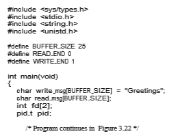
**Figure 3.21** Ordinary pipe in UNIX.

the relationship of the file descriptors in the fd array to the parent and child processes. As this illustrates, any writes by the parent to its write end of the pipe—fd[1]—can be read by the child from its read end—fd[0]—of the pipe.

In the UNIX program shown in Figure 3.21, the parent process creates a pipe and then sends a fork() call creating the child process. What occurs after the fork() call depends on how the data are to flow through the pipe. In this instance, the parent writes to the pipe, and the child reads from it. It is important to notice that both the parent process and the child process initially close their unused ends of the pipe. Although the program shown in Figure 3.21 does not require this action, it is an important step to ensure that a process reading from the pipe can detect end-of-file (read() returns 0) when thewriter has closed its end of the pipe.

Ordinary pipes on Windows systems are termed **anonymous pipes**, and they behave similarly to their UNIX counterparts: they are unidirectional and employ parent–child relationships between the communicating processes. In addition, reading and writing to the pipe can be accomplished with the ordi- nary ReadFile() and WriteFile() functions. The Windows API for creating pipes is the CreatePipe() function, which is passed four parameters. The parameters provide separate handles for (1) reading and (2) writing to the pipe, as well as (3) an instance of the STARTUPINFO structure, which is used to specify that the child process is to inherit the handles of the pipe. Furthermore, (4) the size of the pipe (in bytes) may be specified.

Figure 3.23 illustrates a parent process creating an anonymous pipe for communicating with its child. Unlike UNIX systems, in which a child pro- cess automatically inherits a pipe created by its parent, Windows requires the programmer to specify which attributes the child process will inherit. This is  
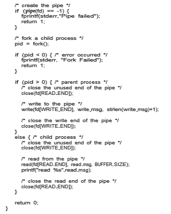
**Figure 3.22** Figure 3.21, continued.

accomplished by first initializing the SECURITY ATTRIBUTES structure to allow handles to be inherited and then redirecting the child process’s handles for standard input or standard output to the read or write handle of the pipe. Since the child will be reading from the pipe, the parent must redirect the child’s standard input to the read handle of the pipe. Furthermore, as the pipes are half duplex, it is necessary to prohibit the child from inheriting the write end of the  

**Figure 3.23** Windows anonymous pipe—parent process.

pipe. The program to create the child process is similar to the program in Figure 3.10, except that the fifth parameter is set to TRUE, indicating that the child process is to inherit designated handles from its parent. Before writing to the pipe, the parent first closes its unused read end of the pipe. The child process that reads from the pipe is shown in Figure 3.25. Before reading from the pipe, this programobtains the readhandle to the pipe by invoking GetStdHandle().

Note that ordinary pipes require a parent–child relationship between the communicating processes on both UNIX and Windows systems. This means that these pipes can be used only for communication between processes on the same machine.

#### Named Pipes

Ordinary pipes provide a simple mechanism for allowing a pair of processes to communicate. However, ordinary pipes exist only while the processes are communicating with one another. On both UNIX and Windows systems, once the processes have finished communicating and have terminated, the ordinary pipe ceases to exist.

Named pipes provide a much more powerful communication tool. Com- munication can be bidirectional, and no parent–child relationship is required. Once a named pipe is established, several processes can use it for communi- cation. In fact, in a typical scenario, a named pipe has several writers. Addi- tionally, named pipes continue to exist after communicating processes have finished. Both UNIX andWindows systems support named pipes, although the details of implementation differ greatly. Next, we explore named pipes in each of these systems.

Named pipes are referred to as FIFOs in UNIX systems. Once created, they appear as typical files in the file system. A FIFO is created with the mkfifo() system call and manipulated with the ordinary open(), read(), write(), and close() system calls. It will continue to exist until it is explicitly deleted  
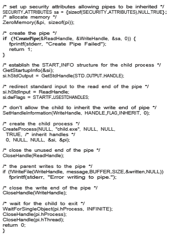
**Figure 3.24** Figure 3.23, continued.  

**Figure 3.25** Windows anonymous pipes—child process.

from the file system. Although FIFOs allow bidirectional communication, only half-duplex transmission is permitted. If data must travel in both directions, two FIFOs are typically used. Additionally, the communicating processes must reside on the same machine. If intermachine communication is required, sock- ets (Section 3.8.1) must be used.

Named pipes onWindows systems provide a richer communicationmech- anism than their UNIX counterparts. Full-duplex communication is allowed, and the communicating processes may reside on either the same or different machines. Additionally, only byte-oriented data may be transmitted across a UNIX FIFO, whereas Windows systems allow either byte- or message-oriented data. Named pipes are created with the CreateNamedPipe() function, and a client can connect to a named pipe using ConnectNamedPipe(). Communi- cation over the named pipe can be accomplished using the ReadFile() and WriteFile() functions.

## Communication in Client–Server Systems

In Section 3.4, we described how processes can communicate using shared memory and message passing. These techniques can be used for communica- tion in client–server systems (Section 1.10.3) as well. In this section, we explore two other strategies for communication in client–server systems: sockets and  

**_PIPES IN PRACTICE_**

Pipes are used quite often in the UNIX command-line environment for situ- ations in which the output of one command serves as input to another. For example, the UNIX ls command produces a directory listing. For especially long directory listings, the output may scroll through several screens. The command less manages output by displaying only one screen of output at a time where the user may use certain keys to move forward or backward in the file. Setting up a pipe between the ls and less commands (which are running as individual processes) allows the output of ls to be delivered as the input to less, enabling the user to display a large directory listing a screen at a time. A pipe can be constructed on the command line using the | character. The complete command is

ls | less

In this scenario, the ls command serves as the producer, and its output is consumed by the less command.

Windows systems provide a more command for the DOS shell with func- tionality similar to that of its UNIX counterpart less. (UNIX systems also provide a more command, but in the tongue-in-cheek style common in UNIX, the less command in fact provides _more_ functionality than more!) The DOS shell also uses the | character for establishing a pipe. The only difference is that to get a directory listing, DOS uses the dir command rather than ls, as shown below:

dir | more

remote procedure calls (RPCs). As we shall see in our coverage of RPCs, not only are they useful for client–server computing, but Android also uses remote procedures as a form of IPC between processes running on the same system.

### Sockets

A**socket** is defined as an endpoint for communication. Apair of processes com- municating over a network employs a pair of sockets—one for each process. A socket is identified by an IP address concatenated with a port number. In general, sockets use a client–server architecture. The serverwaits for incoming client requests by listening to a specified port. Once a request is received, the server accepts a connection from the client socket to complete the connection. Servers implementing specific services (such as SSH, FTP, and HTTP) listen to **_well-known_** ports (an SSH server listens to port 22; an FTP server listens to port 21; and a web, or HTTP, server listens to port 80). All ports below 1024 are considered**_well known_** and are used to implement standard services.

When a client process initiates a request for a connection, it is assigned a port by its host computer. This port has some arbitrary number greater than 1024. For example, if a client on host X with IP address 146.86.5.20 wishes to establish a connection with a web server (which is listening on port 80) at  

**Figure 3.26** Communication using sockets.

address 161.25.19.8, host X may be assigned port 1625. The connection will consist of a pair of sockets: (146.86.5.20:1625) on host X and (161.25.19.8:80) on the web server. This situation is illustrated in Figure 3.26. The packets traveling between the hosts are delivered to the appropriate process based on the destination port number.

All connections must be unique. Therefore, if another process also on host Xwished to establish another connection with the sameweb server, it would be assigned a port number greater than 1024 and not equal to 1625. This ensures that all connections consist of a unique pair of sockets.

Although most program examples in this text use C, we will illustrate sockets using Java, as it provides a much easier interface to sockets and has a rich library for networking utilities. Those interested in socket programming in C or C++ should consult the bibliographical notes at the end of the chapter.

Java provides three different types of sockets. **Connection-oriented** (**TCP**) sockets are implemented with the Socket class. **Connectionless** (**UDP**) sockets use the DatagramSocket class. Finally, the MulticastSocket class is a sub- class of the DatagramSocket class. Amulticast socket allows data to be sent to multiple recipients.

Our example describes a date server that uses connection-oriented TCP sockets. The operation allows clients to request the current date and time from the server. The server listens to port 6013, although the port could have any arbitrary, unused number greater than 1024. When a connection is received, the server returns the date and time to the client.

The date server is shown in Figure 3.27. The server creates a ServerSocket that specifies that it will listen to port 6013. The server then begins listening to the port with the accept() method. The server blocks on the accept() methodwaiting for a client to request a connection. When a connection request is received, accept() returns a socket that the server can use to communicate with the client.

The details of how the server communicates with the socket are as follows. The server first establishes a PrintWriter object that it will use to communi- cate with the client. A PrintWriter object allows the server to write to the socket using the routine print() and println() methods for output. The  


**Figure 3.27** Date server.

server process sends the date to the client, calling themethod println(). Once it has written the date to the socket, the server closes the socket to the client and resumes listening for more requests.

A client communicates with the server by creating a socket and connecting to the port on which the server is listening. We implement such a client in the Java program shown in Figure 3.28. The client creates a Socket and requests a connection with the server at IP address 127.0.0.1 on port 6013. Once the connection is made, the client can read from the socket using normal stream I/O statements. After it has received the date from the server, the client closes the socket and exits. The IP address 127.0.0.1 is a special IP address known as the **loopback**.When a computer refers to IP address 127.0.0.1, it is referring to itself. This mechanism allows a client and server on the same host to communicate using the TCP/IP protocol. The IP address 127.0.0.1 could be replaced with the IP address of another host running the date server. In addition to an IP address, an actual host name, such as www.westminstercollege.edu, can be used as well.  


**Figure 3.28** Date client.

Communication using sockets—although common and efficient—is con- sidered a low-level form of communication between distributed processes. One reason is that sockets allow only an unstructured stream of bytes to be exchanged between the communicating threads. It is the responsibility of the client or server application to impose a structure on the data. In the next sub- section, we look a higher-level method of communication: remote procedure calls (RPCs).

### Remote Procedure Calls

One of the most common forms of remote service is the RPC paradigm, which was designed as a way to abstract the procedure-call mechanism for use between systemswith network connections. It is similar inmany respects to the IPC mechanism described in Section 3.4, and it is usually built on top of such a system. Here, however, because we are dealing with an environment in which the processes are executing on separate systems, wemust use a message-based communication scheme to provide remote service.  

In contrast to IPC messages, the messages exchanged in RPC communi- cation are well structured and are thus no longer just packets of data. Each message is addressed to an RPC daemon listening to a port on the remote sys- tem, and each contains an identifier specifying the function to execute and the parameters to pass to that function. The function is then executed as requested, and any output is sent back to the requester in a separate message.

A**port** in this context is simply a number included at the start of a message packet. Whereas a system normally has one network address, it can have many ports within that address to differentiate the many network services it supports. If a remote process needs a service, it addresses a message to the proper port. For instance, if a system wished to allow other systems to be able to list its current users, it would have a daemon supporting such an RPC attached to a port—say, port 3027. Any remote system could obtain the needed information (that is, the list of current users) by sending an RPCmessage to port 3027 on the server. The data would be received in a reply message.

The semantics of RPCs allows a client to invoke a procedure on a remote host as it would invoke a procedure locally. The RPC system hides the details that allow communication to take place by providing a **stub** on the client side. Typically, a separate stub exists for each separate remote procedure. When the client invokes a remote procedure, the RPC system calls the appropriate stub, passing it the parameters provided to the remote procedure. This stub locates the port on the server and **marshals** the parameters. The stub then transmits a message to the server using message passing. A similar stub on the server side receives this message and invokes the procedure on the server. If necessary, return values are passed back to the client using the same technique. OnWindows systems, stub code is compiled from a specification written in the **Microsoft Interface Definitio Language** (**MIDL**), which is used for defining the interfaces between client and server programs.

Parameter marshaling addresses the issue concerning differences in data representation on the client and server machines. Consider the representa- tion of 32-bit integers. Some systems (known as **big-endian**) store the most significant byte first, while other systems (known as **little-endian**) store the least significant byte first. Neither order is “better” per se; rather, the choice is arbitrary within a computer architecture. To resolve differences like this, many RPC systems define a machine-independent representation of data. One such representation is known as **external data representation** (**XDR**). On the client side, parameter marshaling involves converting the machine-dependent data into XDR before they are sent to the server. On the server side, the XDR data are unmarshaled and converted to the machine-dependent representation for the server.

Another important issue involves the semantics of a call. Whereas local procedure calls fail only under extreme circumstances, RPCs can fail, or be duplicated and executed more than once, as a result of common network errors. One way to address this problem is for the operating system to ensure that messages are acted on **_exactly once,_** rather than **_at most once._** Most local procedure calls have the “exactly once” functionality, but it is more difficult to implement.

First, consider “atmost once.”This semantic can be implemented by attach- ing a timestamp to each message. The server must keep a history of all the timestamps of messages it has already processed or a history large enough to ensure that repeated messages are detected. Incoming messages that have a timestamp already in the history are ignored. The client can then send a message one or more times and be assured that it only executes once.

For “exactly once,” we need to remove the risk that the server will never receive the request. To accomplish this, the servermust implement the “at most once” protocol described above but must also acknowledge to the client that the RPC call was received and executed. These ACK messages are common throughout networking. The client must resend each RPC call periodically until it receives the ACK for that call.

Yet another important issue concerns the communication between a server and a client. With standard procedure calls, some form of binding takes place during link, load, or execution time (Chapter 9) so that a procedure call’s name is replaced by the memory address of the procedure call. The RPC scheme requires a similar binding of the client and the server port, but howdoes a client know the port numbers on the server? Neither system has full information about the other, because they do not share memory.

Two approaches are common. First, the binding informationmay be prede- termined, in the form of fixed port addresses. At compile time, an RPC call has a fixed port number associated with it. Once a program is compiled, the server cannot change the port number of the requested service. Second, binding can be done dynamically by a rendezvousmechanism. Typically, an operating system provides a rendezvous (also called a **matchmaker**) daemon on a fixed RPC port. Aclient then sends amessage containing the name of the RPC to the rendezvous daemon requesting the port address of the RPC it needs to execute. The port number is returned, and the RPC calls can be sent to that port until the process terminates (or the server crashes). This method requires the extra overhead of the initial request but ismore flexible than the first approach. Figure 3.29 shows a sample interaction.

The RPC scheme is useful in implementing a distributed file system (Chap- ter 19). Such a system can be implemented as a set of RPC daemons and clients. The messages are addressed to the distributed file system port on a server on which a file operation is to take place. The message contains the disk operation to be performed. The disk operation might be read(), write(), rename(), delete(), or status(), corresponding to the usual file-related system calls. The return message contains any data resulting from that call, which is exe- cuted by the DFS daemon on behalf of the client. For instance, a message might contain a request to transfer a whole file to a client or be limited to a simple block request. In the latter case, several requests may be needed if a whole file is to be transferred.

#### Android RPC

Although RPCs are typically associated with client-server computing in a dis- tributed system, they can also be used as a form of IPC between processes running on the same system. The Android operating system has a rich set of IPC mechanisms contained in its **binder** framework, including RPCs that allow one process to request services from another process.

Android defines an **application component** as a basic building block that provides utility to an Android application, and an app may combine multiple application components to provide functionality to an app. One such applica-  
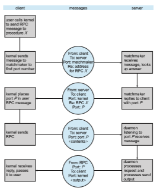

**Figure 3.29** Execution of a remote procedure call (RPC).

tion component is a **service**, which has no user interface but instead runs in the background while executing long-running operations or performing work for remote processes. Examples of services include playing music in the back- ground and retrieving data over a network connection on behalf of another process, thereby preventing the other process from blocking as the data are being downloaded. When a client app invokes the bindService() method of a service, that service is “bound” and available to provide client-server communication using either message passing or RPCs.

A bound service must extend the Android class Service and must imple- ment the method onBind(), which is invoked when a client calls bindSer- vice(). In the case of message passing, the onBind() method returns a Mes- senger service, which is used for sending messages from the client to the service. The Messenger service is only one-way; if the servicemust send a reply back to the client, the client must also provide a Messenger service, which is contained in the replyTo field of the Message object sent to the service. The service can then send messages back to the client.

To provide RPCs, the onBind() method must return an interface repre- senting the methods in the remote object that clients use to interact with the service. This interface is written in regular Java syntax and uses the Android Interface Definition Language—AIDL—to create stub files, which serve as the client interface to remote services.

Here, we briefly outline the process required to provide a generic remote service named remoteMethod() using AIDL and the binder service. The inter- face for the remote service appears as follows:
```
/\* RemoteService.aidl \*/ interface RemoteService _{_

boolean remoteMethod(int x, double y); _{_
```
This file is written as RemoteService.aidl. The Android development kit will use it to generate a .java interface from the .aidl file, as well as a stub that serves as the RPC interface for this service. The server must implement the interface generated by the .aidl file, and the implementation of this interface will be called when the client invokes remoteMethod().

When a client calls bindService(), the onBind() method is invoked on the server, and it returns the stub for the RemoteService object to the client. The client can then invoke the remote method as follows:
```
RemoteService service; . . .

service.remoteMethod(3, 0.14);
```
Internally, the Android binder framework handles parameter marshaling, transferring marshaled parameters between processes, and invoking the nec- essary implementation of the service, as well as sending any return values back to the client process.

## Summary

• Aprocess is a program in execution, and the status of the current activity of a process is represented by the program counter, as well as other registers.

• The layout of a process inmemory is represented by four different sections: (1) text, (2) data, (3) heap, and (4) stack.

• As a process executes, it changes state. There are four general states of a process: (1) ready, (2) running, (3) waiting, and (4) terminated.

• A process control block (PCB) is the kernel data structure that represents a process in an operating system.

• The role of the process scheduler is to select an available process to run on a CPU.

• An operating system performs a context switch when it switches from running one process to running another.  

• The fork() and CreateProcess() system calls are used to create pro- cesses on UNIX and Windows systems, respectively.

• When shared memory is used for communication between processes, two (or more) processes share the same region of memory. POSIX provides an API for shared memory.

• Two processes may communicate by exchanging messages with one another using message passing. The Mach operating system uses message passing as its primary form of interprocess communication. Windows provides a form of message passing as well.

• A pipe provides a conduit for two processes to communicate. There are two forms of pipes, ordinary and named. Ordinary pipes are designed for communication between processes that have a parent–child relationship. Named pipes are more general and allow several processes to communi- cate.

• UNIX systems provide ordinary pipes through the pipe() system call. Ordinary pipes have a read end and a write end. A parent process can, for example, send data to the pipe using its write end, and the child process can read it from its read end. Named pipes in UNIX are termed FIFOs.

• Windows systems also provide two forms of pipes—anonymous and named pipes. Anonymous pipes are similar to UNIX ordinary pipes. They are unidirectional and employ parent–child relationships between the communicating processes. Named pipes offer a richer form of interprocess communication than the UNIX counterpart, FIFOs.

• Two common forms of client–server communication are sockets and remote procedure calls (RPCs). Sockets allow two processes on different machines to communicate over a network. RPCs abstract the concept of function (procedure) calls in such a way that a function can be invoked on another process that may reside on a separate computer.

• The Android operating system uses RPCs as a form of interprocess com- munication using its binder framework.

**Practice Exercises**

**3.1** Using the program shown in Figure 3.30, explain what the output will be at LINE A.

**3.2** Including the initial parent process, how many processes are created by the program shown in Figure 3.31?

**3.3** Original versions of Apple’s mobile iOS operating system provided no means of concurrent processing. Discuss three major complications that concurrent processing adds to an operating system.

**3.4** Some computer systems provide multiple register sets. Describe what happens when a context switch occurs if the new context is already  

**Practice Exercises 155**

**Figure 3.30** What output will be at Line A?

loaded into one of the register sets. What happens if the new context is in memory rather than in a register set and all the register sets are in use?

**3.5** When a process creates a newprocess using the fork() operation,which of the following states is shared between the parent process and the child process?

a. Stack

b. Heap

c. Shared memory segments

**3.6** Consider the “exactly once”semanticwith respect to the RPCmechanism. Does the algorithm for implementing this semantic execute correctly even if the ACK message sent back to the client is lost due to a net- work problem?Describe the sequence of messages, and discuss whether “exactly once” is still preserved.

**3.7** Assume that a distributed system is susceptible to server failure. What mechanismswould be required to guarantee the “exactly once” semantic for execution of RPCs?  


**Figure 3.31** How many processes are created?

**Further Reading**

Process creation, management, and IPC in UNIX and Windows systems, respectively, are discussed in \[Robbins and Robbins (2003)\] and \[Russinovich et al. (2017)\]. \[Love (2010)\] covers support for processes in the Linux kernel, and \[Hart (2005)\] covers Windows systems programming in detail. Coverage of the multiprocess model used in Google’s Chrome can be found at http://blog.chromium.org/2008/09/multi-process-architecture.html.

Message passing formulticore systems is discussed in \[Holland and Seltzer (2011)\]. \[Levin (2013)\] describes message passing in the Mach system, particu- larly with respect to macOS and iOS.

\[Harold (2005)\] provides coverage of socket programming in Java. Details onAndroid RPCs can be found at https://developer.android.com/guide/compo nents/aidl.html. \[Hart (2005)\] and \[Robbins and Robbins (2003)\] cover pipes in Windows and UNIX systems, respectively.

Guidelines forAndroiddevelopment can be found at https://developer.and roid.com/guide/.

**Bibliography**

**\[Harold (2005)\]** E. R. Harold, _Java Network Programming,_ Third Edition, O’Reilly & Associates (2005).

**\[Hart (2005)\]** J. M. Hart,_Windows System Programming,_ Third Edition, Addison- Wesley (2005).  

**\[Holland and Seltzer (2011)\]** D.Holland andM. Seltzer, “MulticoreOSes: Look- ing Forward from 1991, er, 2011”,_Proceedings of the 13th USENIX conference onHot topics in operating systems_ (2011), pages 33–33.

**\[Levin (2013)\]** J. Levin, _Mac OS X and iOS Internals to the Apple’s Core_, Wiley (2013).

**\[Love (2010)\]** R. Love, _Linux Kernel Development,_ Third Edition, Developer’s Library (2010).

**\[Robbins and Robbins (2003)\]** K. Robbins and S. Robbins, _Unix Systems Pro- gramming: Communication, Concurrency and Threads,_ Second Edition, Prentice Hall (2003).

**\[Russinovich et al. (2017)\]** M.Russinovich,D.A. Solomon, andA. Ionescu,_Win- dows Internals–Part 1,_ Seventh Edition, Microsoft Press (2017).  

**Exercises**

**Chapter 3 Exercises**

**3.8** Describe the actions taken by a kernel to context-switch between pro- cesses.

**3.9** Construct a process tree similar to Figure 3.7. To obtain process infor- mation for the UNIX or Linux system, use the command ps -ael. Use the command man ps to get more information about the ps com- mand. The task manager on Windows systems does not provide the parent process ID, but the **_process monitor_** tool, available from tech- net.microsoft.com, provides a process-tree tool.

**3.10** Explain the role of the init (or systemd) process on UNIX and Linux systems in regard to process termination.

**3.11** Including the initial parent process, how many processes are created by the program shown in Figure 3.32?

**3.12** Explain the circumstances under which the line of code marked printf("LINE J") in Figure 3.33 will be reached.

**3.13** Using the program in Figure 3.34, identify the values of pid at lines A, B, C, and D. (Assume that the actual pids of the parent and child are 2600 and 2603, respectively.)

**3.14** Give an example of a situation inwhich ordinary pipes aremore suitable than named pipes and an example of a situation in which named pipes are more suitable than ordinary pipes.

**3.15** Consider the RPC mechanism. Describe the undesirable consequences that could arise from not enforcing either the “at most once” or “exactly once” semantic. Describe possible uses for a mechanism that has neither of these guarantees.

**3.16** Using the program shown in Figure 3.35, explain what the output will be at lines X and Y.
```
#include _<_stdio.h_\>_ #include _<_unistd.h_\>_

int main() _{_

int i;

for (i = 0; i < 4; i++) fork();

return 0; _}_
```
**Figure 3.21** How many processes are created?

**EX-4**  

**3.17** What are the benefits and the disadvantages of each of the following? Consider both the system level and the programmer level.

a. Synchronous and asynchronous communication

b. Automatic and explicit buffering

c. Send by copy and send by reference

d. Fixed-sized and variable-sized messages
```
#include _<_sys/types.h_\>_ #include _<_stdio.h_\>_ #include _<_unistd.h_\>_

int main() _{_ pid t pid;

/\* fork a child process \*/ pid = fork();

if (pid < 0) _{_ /\* error occurred \*/ fprintf(stderr, "Fork Failed"); return 1;

_}_ else if (pid == 0) _{_ /\* child process \*/

execlp("/bin/ls","ls",NULL); printf("LINE J");

_}_ else _{_ /\* parent process \*/

/\* parent will wait for the child to complete \*/ wait(NULL); printf("Child Complete");

_}_

return 0; _}_
```
**Figure 3.22** When will LINE J be reached?

**EX-5**  

**Exercises**
```
#include _<_sys/types.h_\>_ #include _<_stdio.h_\>_ #include _<_unistd.h_\>_

int main() _{_ pid t pid, pid1;

/\* fork a child process \*/ pid = fork();

if (pid < 0) _{_ /\* error occurred \*/ fprintf(stderr, "Fork Failed"); return 1;

_}_ else if (pid == 0) _{_ /\* child process \*/

pid1 = getpid(); printf("child: pid = %d",pid); /\* A \*/ printf("child: pid1 = %d",pid1); /\* B \*/

_}_ else _{_ /\* parent process \*/

pid1 = getpid(); printf("parent: pid = %d",pid); /\* C \*/ printf("parent: pid1 = %d",pid1); /\* D \*/ wait(NULL);

_}_

return 0; _}_
```
**Figure 3.23** What are the pid values?

**EX-6**  
```
#include _<_sys/types.h_\>_ #include _<_stdio.h_\>_ #include _<_unistd.h_\>_

#define SIZE 5

int nums\[SIZE\] = _{_0,1,2,3,4_}_;

int main() _{_ int i; pid t pid;

pid = fork();

if (pid == 0) _{_ for (i = 0; i < SIZE; i++) _{_

nums\[i\] \*= -i; printf("CHILD: %d ",nums\[i\]); /\* LINE X \*/

_} }_ else if (pid > 0) _{_

wait(NULL); for (i = 0; i < SIZE; i++)

printf("PARENT: %d ",nums\[i\]); /\* LINE Y \*/ _}_

return 0; _}_
```
**Figure 3.24** What output will be at Line X and Line Y?

**EX-7**  

**Programming Problems**

**Programming Problems**

**3.18** Using either a UNIX or a Linux system, write a C program that forks a child process that ultimately becomes a zombie process. This zombie process must remain in the system for at least 10 seconds. Process states can be obtained from the command

ps -l

The process states are shown below the S column; processes with a state of Z are zombies. The process identifier (pid) of the child process is listed in the PID column, and that of the parent is listed in the PPID column.

Perhaps the easiest way to determine that the child process is indeed a zombie is to run the program that you have written in the background (using the &) and then run the command ps -l to determine whether the child is a zombie process. Because you do not want toomany zombie processes existing in the system, you will need to remove the one that you have created. The easiest way to do that is to terminate the parent process using the kill command. For example, if the pid of the parent is 4884, you would enter

kill -9 4884

**3.19** Write a C program called time.c that determines the amount of time necessary to run a command from the command line. This programwill be run as "./time <command>" and will report the amount of elapsed time to run the specified command. This will involve using fork() and exec() functions, as well as the gettimeofday() function to deter- mine the elapsed time. It will also require the use of two different IPC mechanisms.

The general strategy is to fork a child process that will execute the specified command. However, before the child executes the command, it will record a timestamp of the current time (which we term “starting time”). The parent process will wait for the child process to terminate. Once the child terminates, the parent will record the current timestamp for the ending time. The difference between the starting and ending times represents the elapsed time to execute the command. The example output below reports the amount of time to run the command ls :

./time ls time.c time

Elapsed time: 0.25422

As the parent and child are separate processes, they will need to arrange how the starting time will be shared between them. You will write two versions of this program, each representing a differentmethod of IPC.

**P-8**  

**Chapter 3 Processes**

The first version will have the child process write the starting time to a region of sharedmemory before it calls exec(). After the child process terminates, the parent will read the starting time from shared memory. Refer to Section 3.7.1 for details using POSIX shared memory. In that section, there are separate programs for the producer and consumer. As the solution to this problem requires only a single program, the region of shared memory can be established before the child process is forked, allowing both the parent and child processes access to the region of shared memory.

The second version will use a pipe. The child will write the starting time to the pipe, and the parent will read from it following the termina- tion of the child process.

You will use the gettimeofday() function to record the current timestamp. This function is passed a pointer to a struct timeval object, which contains two members: tv sec and t usec. These repre- sent the number of elapsed seconds and microseconds since January 1, 1970 (known as the UNIX EPOCH). The following code sample illustrates how this function can be used:

struct timeval current;

gettimeofday(&current,NULL);

// current.tv sec represents seconds // current.tv usec represents microseconds

For IPC between the child and parent processes, the contents of the shared memory pointer can be assigned the struct timeval repre- senting the starting time. When pipes are used, a pointer to a struct timeval can be written to—and read from—the pipe.

**3.20** An operating system’s **pid manager** is responsible formanaging process identifiers. When a process is first created, it is assigned a unique pid by the pid manager. The pid is returned to the pid manager when the process completes execution, and the manager may later reassign this pid. Process identifiers are discussed more fully in Section 3.3.1. What is most important here is to recognize that process identifiers must be unique; no two active processes can have the same pid.

Use the following constants to identify the range of possible pid values:
```
#define MIN PID 300 #define MAX PID 5000
```
You may use any data structure of your choice to represent the avail- ability of process identifiers. One strategy is to adopt what Linux has done and use a bitmap in which a value of 0 at position _i_ indicates that

**P-9**  

**Programming Problems**

a process id of value _i_ is available and a value of 1 indicates that the process id is currently in use.

Implement the following API for obtaining and releasing a pid:

• int allocate map(void)—Creates and initializes a data struc- ture for representing pids; returns −1 if unsuccessful, 1 if successful

• int allocate pid(void)—Allocates and returns a pid; returns −1 if unable to allocate a pid (all pids are in use)

• void release pid(int pid)—Releases a pid

This programming problem will be modified later on in Chapter 4 and in Chapter 6.

**3.21** The Collatz conjecture concerns what happens when we take any posi- tive integer _n_ and apply the following algorithm:

_n_ \= {

_n_∕2, if n is even 3 × _n_ \+ 1, if n is odd

The conjecture states that when this algorithm is continually applied, all positive integers will eventually reach 1. For example, if _n_ \= 35, the sequence is

35, 106, 53, 160, 80, 40, 20, 10, 5, 16, 8, 4, 2, 1

Write a C program using the fork() system call that generates this sequence in the child process. The starting number will be provided from the command line. For example, if 8 is passed as a parameter on the command line, the child process will output 8, 4, 2, 1. Because the parent and child processes have their own copies of the data, it will be necessary for the child to output the sequence. Have the parent invoke the wait() call to wait for the child process to complete before exiting the program. Perform necessary error checking to ensure that a positive integer is passed on the command line.

**3.22** In Exercise 3.21, the child process must output the sequence of num- bers generated from the algorithm specified by the Collatz conjecture because the parent and child have their own copies of the data. Another approach to designing this program is to establish a shared-memory object between the parent and child processes. This technique allows the child to write the contents of the sequence to the shared-memory object. The parent can then output the sequence when the child com- pletes. Because the memory is shared, any changes the child makes will be reflected in the parent process as well.

This program will be structured using POSIX shared memory as described in Section 3.7.1. The parent process will progress through the following steps:

a. Establish the shared-memory object (shm open(), ftruncate(), and mmap()).

**P-10**  

**Chapter 3 Processes**

b. Create the child process and wait for it to terminate.

c. Output the contents of shared memory.

d. Remove the shared-memory object.

One area of concern with cooperating processes involves synchro- nization issues. In this exercise, the parent and child processes must be coordinated so that the parent does not output the sequence until the child finishes execution. These two processeswill be synchronized using the wait() system call: the parent process will invoke wait(), which will suspend it until the child process exits.

**3.23** Section 3.8.1 describes certain port numbers as being well known—that is, they provide standard services. Port 17 is known as the _quote-of-the- day_ service. When a client connects to port 17 on a server, the server responds with a quote for that day.

Modify the date server shown in Figure 3.27 so that it delivers a quote of the day rather than the current date. The quotes should be printable ASCII characters and should contain fewer than 512 characters, although multiple lines are allowed. Since these well-known ports are reserved and therefore unavailable, have your server listen to port 6017. The date client shown in Figure 3.28 can be used to read the quotes returned by your server.

**3.24** A**haiku** is a three-line poem inwhich the first line contains five syllables, the second line contains seven syllables, and the third line contains five syllables. Write a haiku server that listens to port 5575. When a client connects to this port, the server responds with a haiku. The date client shown in Figure 3.28 can be used to read the quotes returned by your haiku server.

**3.25** An echo server echoes back whatever it receives from a client. For exam- ple, if a client sends the server the string Hello there!, the server will respond with Hello there!

Write an echo server using the Java networking API described in Section 3.8.1. This server will wait for a client connection using the accept()method. When a client connection is received, the server will loop, performing the following steps:

• Read data from the socket into a buffer.

• Write the contents of the buffer back to the client.

The server will break out of the loop only when it has determined that the client has closed the connection.

The date server of Figure 3.27 uses the java.io.BufferedReader class. BufferedReader extends the java.io.Reader class, which is used for reading character streams. However, the echo server cannot guarantee that it will read characters from clients; it may receive binary data aswell. The class java.io.InputStreamdealswithdata at the byte level rather than the character level. Thus, your echo server must use an object that extends java.io.InputStream. The read() method in the

**P-11**  

**Programming Problems**

java.io.InputStream class returns −1 when the client has closed its end of the socket connection.

**3.26** Design a program using ordinary pipes in which one process sends a string message to a second process, and the second process reverses the case of each character in the message and sends it back to the first process. For example, if the first process sends the message Hi There, the second process will return hI tHERE. This will require using two pipes, one for sending the original message from the first to the second process and the other for sending themodifiedmessage from the second to the first process. You can write this program using either UNIX or Windows pipes.

**3.27** Design a file-copying program named filecopy.c using ordinary pipes. This program will be passed two parameters: the name of the file to be copied and the name of the destination file. The program will then create an ordinary pipe and write the contents of the file to be copied to the pipe. The child process will read this file from the pipe and write it to the destination file. For example, if we invoke the program as follows:

./filecopy input.txt copy.txt

the file input.txtwill bewritten to the pipe. The child processwill read the contents of this file and write it to the destination file copy.txt. You may write this program using either UNIX or Windows pipes.

**Programming Projects**

**Project 1—UNIX Shell** This project consists of designing a C program to serve as a shell interface that accepts user commands and then executes each command in a separate process. Your implementation will support input and output redirection, as well as pipes as a form of IPC between a pair of commands. Completing this project will involve using the UNIX fork(), exec(), wait(), dup2(), and pipe() system calls and can be completed on any Linux, UNIX, or macOS system.

**I. Overview**

A shell interface gives the user a prompt, after which the next command is entered. The example below illustrates the prompt osh> and the user’s next command: cat prog.c. (This command displays the file prog.c on the terminal using the UNIX cat command.)

osh>cat prog.c

**P-12**  

**Chapter 3 Processes**

One technique for implementing a shell interface is to have the parent process first read what the user enters on the command line (in this case, cat prog.c) and then create a separate child process that performs the command. Unless otherwise specified, the parent process waits for the child to exit before contin- uing. This is similar in functionality to the new process creation illustrated in Figure 3.9. However, UNIX shells typically also allow the child process to run in the background, or concurrently. To accomplish this, we add an ampersand (&) at the end of the command. Thus, if we rewrite the above command as

osh>cat prog.c &

the parent and child processes will run concurrently. The separate child process is created using the fork() system call, and the

user’s command is executed using one of the system calls in the exec() family (as described in Section 3.3.1).

AC program that provides the general operations of a command-line shell is supplied in Figure 3.36. The main() function presents the prompt osh-> and outlines the steps to be taken after input from the user has been read. The main() function continually loops as long as should run equals 1; when the user enters exit at the prompt, your program will set should run to 0 and terminate.
```
#include _<_stdio.h_\>_ #include _<_unistd.h_\>_

#define MAX LINE 80 /\* The maximum length command \*/

int main(void) _{_ char \*args\[MAX LINE/2 + 1\]; /\* command line arguments \*/ int should run = 1; /\* flag to determine when to exit program \*/

while (should run) _{_ printf("osh>"); fflush(stdout);

/\*\* \* After reading user input, the steps are: \* (1) fork a child process using fork() \* (2) the child process will invoke execvp() \* (3) parent will invoke wait() unless command included & \*/

_}_

return 0; _}_
```
**Figure 3.36** Outline of simple shell.

**P-13**  

**Programming Projects**

This project is organized into several parts:

**1\.** Creating the child process and executing the command in the child

**2\.** Providing a history feature

**3\.** Adding support of input and output redirection

**4\.** Allowing the parent and child processes to communicate via a pipe

**II. Executing Command in a Child Process**

The first task is to modify the main() function in Figure 3.36 so that a child process is forked and executes the command specified by the user. This will require parsing what the user has entered into separate tokens and storing the tokens in an array of character strings (args in Figure 3.36). For example, if the user enters the command ps -ael at the osh> prompt, the values stored in the args array are:

args\[0\] = "ps" args\[1\] = "-ael" args\[2\] = NULL

This args array will be passed to the execvp() function, which has the follow- ing prototype:

execvp(char \*command, char \*params\[\])

Here, command represents the command to be performed and params stores the parameters to this command. For this project, the execvp() function should be invoked as execvp(args\[0\], args). Be sure to check whether the user included & to determine whether or not the parent process is to wait for the child to exit.

**III. Creating a History Feature**

The next task is to modify the shell interface program so that it provides a **_history_** feature to allow a user to execute themost recent command by entering !!. For example, if a user enters the command ls -l, she can then execute that command again by entering !! at the prompt. Any command executed in this fashion should be echoed on the user’s screen, and the command should also be placed in the history buffer as the next command.

Your program should alsomanage basic error handling. If there is no recent command in the history, entering !! should result in a message “No commands in history.”

**IV. Redirecting Input and Output**

Your shell should then be modified to support the ‘>’ and ‘<’ redirection

**P-14**  

**Chapter 3 Processes**

operators, where ‘>’ redirects the output of a command to a file and ‘<’ redirects the input to a command from a file. For example, if a user enters

osh>ls > out.txt

the output from the ls command will be redirected to the file out.txt. Simi- larly, input can be redirected as well. For example, if the user enters

osh>sort < in.txt

the file in.txtwill serve as input to the sort command. Managing the redirection of both input and output will involve using the

dup2() function, which duplicates an existing file descriptor to another file descriptor. For example, if fd is a file descriptor to the file out.txt, the call

dup2(fd, STDOUT FILENO);

duplicates fd to standard output (the terminal). This means that any writes to standard output will in fact be sent to the out.txt file.

You can assume that commandswill contain either one input or one output redirection and will not contain both. In other words, you do not have to be concerned with command sequences such as sort < in.txt > out.txt.

**V. Communication via a Pipe**

The final modification to your shell is to allow the output of one command to serve as input to another using a pipe. For example, the following command sequence

osh>ls -l | less

has the output of the command ls -l serve as the input to the less com- mand. Both the ls and less commands will run as separate processes and will communicate using the UNIX pipe() function described in Section 3.7.4. Perhaps the easiest way to create these separate processes is to have the parent process create the child process (which will execute ls -l). This child will also create another child process (which will execute less) andwill establish a pipe between itself and the child process it creates. Implementing pipe functionality will also require using the dup2() function as described in the previous section. Finally, although several commands can be chained together using multiple pipes, you can assume that commands will contain only one pipe character and will not be combined with any redirection operators.

**Project 2 —Linux Kernel Module for Task Information** In this project, you will write a Linux kernel module that uses the /proc file system for displaying a task’s information based on its process identifier value pid. Before beginning this project, be sure youhave completed the Linux kernel module programming project in Chapter 2, which involves creating an entry in the /proc file system. This project will involve writing a process identifier to

**P-15**  

**Programming Projects**

the file /proc/pid. Once a pid has been written to the /proc file, subsequent reads from /proc/pidwill report (1) the command the task is running, (2) the value of the task’s pid, and (3) the current state of the task. An example of how your kernel module will be accessed once loaded into the system is as follows:

echo "1395" > /proc/pid cat /proc/pid command = \[bash\] pid = \[1395\] state = \[1\]

The echo command writes the characters "1395" to the /proc/pid file. Your kernel module will read this value and store its integer equivalent as it rep- resents a process identifier. The cat command reads from /proc/pid, where your kernel module will retrieve the three fields from the task struct associ- ated with the task whose pid value is 1395.

ssize t proc write(struct file \*file, char user \*usr buf, size t count, loff t \*pos)

_{_ int rv = 0; char \*k mem;

/\* allocate kernel memory \*/ k mem = **kmalloc**(count, GFP KERNEL);

/\* copies user space usr buf to kernel memory \*/ **copy from user**(k mem, usr buf, count);

printk(KERN INFO "%s∖n", k mem);

/\* return kernel memory \*/ **kfree**(k mem);

return count; _}_

**Figure 3.37** The proc write() function.

**I. Writing to the** /proc **File System**

In the kernel module project in Chapter 2, you learned how to read from the /proc file system. We now cover how to write to /proc. Setting the field .write in struct file operations to

.write = proc write

causes the proc write() function of Figure 3.37 to be called when a write operation is made to /proc/pid

**P-16**  

**Chapter 3 Processes**

The kmalloc() function is the kernel equivalent of the user-level mal- loc() function for allocating memory, except that kernel memory is being allocated. The GFP KERNEL flag indicates routine kernel memory allocation. The copy from user() function copies the contents of usr buf (which con- tains what has been written to /proc/pid) to the recently allocated kernel memory. Your kernel module will have to obtain the integer equivalent of this value using the kernel function kstrtol(), which has the signature

int kstrtol(const char \*str, unsigned int base, long \*res)

This stores the character equivalent of str, which is expressed as a base into res.

Finally, note that we return memory that was previously allocated with kmalloc() back to the kernel with the call to kfree(). Careful memory man- agement—which includes releasing memory to prevent **_memory leaks_**—is crucial when developing kernel-level code.

**II. Reading from the** /proc **File System**

Once the process identifier has been stored, any reads from /proc/pid will return the name of the command, its process identifier, and its state. As illustrated in Section 3.1, the PCB in Linux is represented by the structure task struct, which is found in the <linux/sched.h> include file. Given a process identifier, the function pid task() returns the associated task struct. The signature of this function appears as follows:

struct task struct pid task(struct pid \*pid, enum pid type type)

The kernel function find vpid(int pid) can be used to obtain the struct pid, and PIDTYPE PID can be used as the pid type.

For a valid pid in the system, pid task will return its task struct. You can then display the values of the command, pid, and state. (You will probably have to read through the task struct structure in <linux/sched.h> to obtain the names of these fields.)

If pid task() is not passed a valid pid, it returns NULL. Be sure to perform appropriate error checking to check for this condition. If this situation occurs, the kernel module function associated with reading from /proc/pid should return 0.

In the source code download, we give the C program pid.c, which pro- vides some of the basic building blocks for beginning this project.

**Project 3—Linux Kernel Module for Listing Tasks** In this project, you will write a kernel module that lists all current tasks in a Linux system. You will iterate through the tasks both linearly and depth first.

**Part I—Iterating over Tasks Linearly**

In the Linux kernel, the for each process() macro easily allows iteration over all current tasks in the system:

**P-17**  

**Programming Projects**
```
#include <linux/sched.h>

struct task struct \*task;

for each process(task) _{_ /\* on each iteration task points to the next task \*/

_}_
```
The various fields in task struct can then be displayed as the program loops through the for each process()macro.

**Assignment**

Design a kernel module that iterates through all tasks in the system using the for each process() macro. In particular, output the task command, state, and process id of each task. (You will probably have to read through the task struct structure in <linux/sched.h> to obtain the names of these fields.)Write this code in themodule entry point so that its contents will appear in the kernel log buffer, which can be viewed using the dmesg command. To verify that your code is working correctly, compare the contents of the kernel log buffer with the output of the following command, which lists all tasks in the system:

ps -el

The two values should be very similar. Because tasks are dynamic, however, it is possible that a few tasks may appear in one listing but not the other.

**Part II—Iterating over Tasks with a Depth-First Search Tree**

The second portion of this project involves iterating over all tasks in the system using a depth-first search (DFS) tree. (As an example: the DFS iteration of the processes in Figure 3.7 is 1, 8415, 8416, 9298, 9204, 2808, 3028, 3610, 4005.)

Linux maintains its process tree as a series of lists. Examining the task struct in <linux/sched.h>, we see two struct list head objects:

children

and

sibling

These objects are pointers to a list of the task’s children, as well as its siblings. Linux also maintains a reference to the initial task in the system — init task — which is of type task struct. Using this information as well as macro operations on lists, we can iterate over the children of init task as follows:

struct task struct \*task; struct list head \*list;

**P-18**  

**Chapter 3 Processes**

list for each(list, &init task->children) _{_ task = list entry(list, struct task struct, sibling); /\* task points to the next child in the list \*/

_}_

The list for each() macro is passed two parameters, both of type struct list head:

• A pointer to the head of the list to be traversed

• Apointer to the head node of the list to be traversed

At each iteration of list for each(), the first parameter is set to the list structure of the next child. We then use this value to obtain each structure in the list using the list entry()macro.

**Assignment**

Beginning from init task task, design a kernel module that iterates over all tasks in the systemusing aDFS tree. Just as in the first part of this project, output the name, state, and pid of each task. Perform this iteration in the kernel entry module so that its output appears in the kernel log buffer.

If you output all tasks in the system, you may see many more tasks than appear with the ps -ael command. This is because some threads appear as children but do not show up as ordinary processes. Therefore, to check the output of the DFS tree, use the command

ps -eLf

This command lists all tasks—including threads—in the system. To verify that you have indeed performed an appropriate DFS iteration, you will have to examine the relationships among the various tasks output by the ps command.

**Project 4—Kernel Data Structures**

In Section 1.9, we covered various data structures that are common in oper- ating systems. The Linux kernel provides several of these structures. Here, we explore using the circular, doubly linked list that is available to kernel developers. Much of what we discuss is available in the Linux source code— in this instance, the include file <linux/list.h>—and we recommend that you examine this file as you proceed through the following steps.

Initially, you must define a struct containing the elements that are to be inserted in the linked list. The following C struct defines a color as a mixture of red, blue, and green:

struct color _{_ int red; int blue; int green;

**P-19**  

**Programming Projects**

struct list head list; _}_;

Notice the member struct list head list. The list head structure is defined in the include file <linux/types.h>, and its intention is to embed the linked list within the nodes that comprise the list. This list head structure is quite simple—it merely holds two members, next and prev, that point to the next and previous entries in the list. By embedding the linked list within the structure, Linux makes it possible to manage the data structure with a series of **_macro_** functions.

**I. Inserting Elements into the Linked List**

We can declare a list head object, which we use as a reference to the head of the list by using the LIST HEAD()macro:

static LIST HEAD(color list);

This macro defines and initializes the variable color list, which is of type struct list head.

We create and initialize instances of struct color as follows:

struct color \*violet;

violet = kmalloc(sizeof(\*violet), GFP KERNEL); violet->red = 138; violet->blue = 43; violet->green = 226; INIT LIST HEAD(&violet->list);

The kmalloc() function is the kernel equivalent of the user-level malloc() function for allocating memory, except that kernel memory is being allocated. The GFP KERNEL flag indicates routine kernel memory allocation. The macro INIT LIST HEAD() initializes the listmember in struct color.We can then add this instance to the end of the linked list using the list add tail()macro:

list add tail(&violet->list, &color list);

**II. Traversing the Linked List**

Traversing the list involves using the list for each entry() macro, which accepts three parameters:

• A pointer to the structure being iterated over

• Apointer to the head of the list being iterated over

• The name of the variable containing the list head structure

The following code illustrates this macro:

**P-20**  

**Chapter 3 Processes**
```
struct color \*ptr;

list for each entry(ptr, &color list, list) _{_ /\* on each iteration ptr points \*/ /\* to the next struct color \*/

_}_
```
**III. Removing Elements from the Linked List**

Removing elements from the list involves using the list del()macro, which is passed a pointer to struct list head:

list del(struct list head \*element);

This removes element from the list while maintaining the structure of the remainder of the list.

Perhaps the simplest approach for removing all elements from a linked list is to remove each element as you traverse the list. The macro list for each entry safe() behaves much like list for each entry() except that it is passed an additional argument that maintains the value of the next pointer of the item being deleted. (This is necessary for preserving the structure of the list.) The following code example illustrates this macro:
```
struct color \*ptr, \*next;

list for each entry safe(ptr,next,&color list,list) _{_ /\* on each iteration ptr points \*/ /\* to the next struct color \*/ list del(&ptr->list); kfree(ptr);

_}_
```
Notice that after deleting each element, we returnmemory that was previously allocated with kmalloc() back to the kernel with the call to kfree().

**Part I—Assignment**

In the module entry point, create a linked list containing four struct color elements. Traverse the linked list and output its contents to the kernel log buffer. Invoke the dmesg command to ensure that the list is properly con- structed once the kernel module has been loaded.

In themodule exit point, delete the elements from the linked list and return the freememory back to the kernel.Again, invoke the dmesg command to check that the list has been removed once the kernel module has been unloaded.

**Part II—Parameter Passing**

This portion of the project will involve passing a parameter to a kernel module. The module will use this parameter as an initial value and generate the Collatz sequence as described in Exercise 3.21.

**P-21**  

**Programming Projects**

**Passing a Parameter to a Kernel Module**

Parameters may be passed to kernel modules when they are loaded. For exam- ple, if the name of the kernel module is collatz, we can pass the initial value of 15 to the kernel parameter start as follows:

sudo insmod collatz.ko start=15

Within the kernelmodule,we declare start as a parameter using the following code:
```
#include<linux/moduleparam.h>

static int start = 25;

module param(start, int, 0);
```
The module param() macro is used to establish variables as parameters to kernel modules. module param() is provided three arguments: (1) the name of the parameter, (2) its type, and (3) file permissions. Since we are not using a file system for accessing the parameter, we are not concerned with permissions and use a default value of 0. Note that the name of the parameter used with the insmod commandmustmatch the name of the associated kernel parameter. Finally, if we do not provide a value to the module parameter during loading with insmod, the default value (which in this case is 25) is used.

**Part II—Assignment**

Design a kernel module named collatz that is passed an initial value as a module parameter. Your module will then generate and store the sequence in a kernel linked list when the module is loaded. Once the sequence has been stored, your module will traverse the list and output its contents to the kernel log buffer. Use the dmesg command to ensure that the sequence is properly generated once the module has been loaded.

In the module exit point, delete the contents of the list and return the free memory back to the kernel. Again, use dmesg to check that the list has been removed once the kernel module has been unloaded.