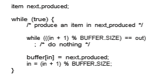

# IPC in Shared-Memory Systems

Interprocess communication using shared memory requires communicating processes to establish a region of shared memory. Typically, a shared-memory region resides in the address space of the process creating the shared-memory segment. Other processes that wish to communicate using this shared-memory segment must attach it to their address space. Recall that, normally, the oper- ating system tries to prevent one process from accessing another process’s memory. Shared memory requires that two or more processes agree to remove this restriction. They can then exchange information by reading and writing data in the shared areas. The form of the data and the location are determined by these processes and are not under the operating system’s control. The pro- cesses are also responsible for ensuring that they are not writing to the same location simultaneously.  


To illustrate the concept of cooperating processes, let’s consider the pro- ducer–consumer problem, which is a common paradigm for cooperating pro- cesses. A **producer** process produces information that is consumed by a **con- sumer** process. For example, a compiler may produce assembly code that is consumed by an assembler. The assembler, in turn, may produce object mod- ules that are consumed by the loader. The producer–consumer problem also provides a usefulmetaphor for the client–server paradigm.We generally think of a server as a producer and a client as a consumer. For example, a web server produces (that is, provides) web content such as HTML files and images, which are consumed (that is, read) by the client web browser requesting the resource.

One solution to the producer–consumer problem uses shared memory. To allow producer and consumer processes to run concurrently, we must have available a buffer of items that can be filled by the producer and emptied by the consumer. This buffer will reside in a region of memory that is shared by the producer and consumer processes. Aproducer can produce one itemwhile the consumer is consuming another item. The producer and consumer must be synchronized, so that the consumer does not try to consume an item that has not yet been produced.

Two types of buffers can be used. The **unbounded buffer** places no prac- tical limit on the size of the buffer. The consumer may have to wait for new items, but the producer can always produce new items. The **bounded buffer** assumes a fixed buffer size. In this case, the consumer must wait if the buffer is empty, and the producer must wait if the buffer is full.

Let’s look more closely at how the bounded buffer illustrates interprocess communication using shared memory. The following variables reside in a region of memory shared by the producer and consumer processes:
```
#define BUFFER SIZE 10

typedef struct _{_ . . .

_}_ item;

item buffer\[BUFFER SIZE\];
 int in = 0; int out = 0;
```
The shared buffer is implemented as a circular arraywith two logical pointers: in and out. The variable in points to the next free position in the buffer; out points to the first full position in the buffer. The buffer is empty when in == out; the buffer is full when ((in + 1) % BUFFER SIZE) == out.

The code for the producer process is shown in Figure 3.12, and the code for the consumer process is shown in Figure 3.13. The producer process has a local variable next produced in which the new item to be produced is stored. The consumer process has a local variable next consumed in which the item to be consumed is stored.

This scheme allows at most BUFFER SIZE − 1 items in the buffer at the same time. We leave it as an exercise for you to provide a solution in which BUFFER SIZE items can be in the buffer at the same time. In Section 3.7.1, we illustrate the POSIX API for shared memory.  



**Figure 3.12** The producer process using shared memory.

One issue this illustration does not address concerns the situation in which both the producer process and the consumer process attempt to access the shared buffer concurrently. In Chapter 6 and Chapter 7, we discuss how syn- chronization among cooperating processes can be implemented effectively in a shared-memory environment.