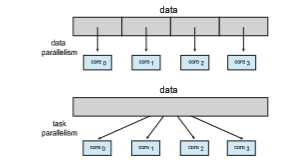
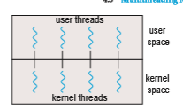
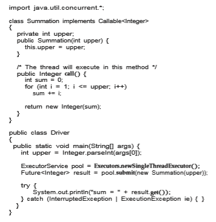
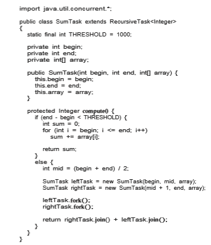
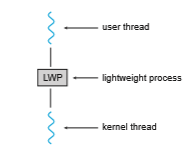
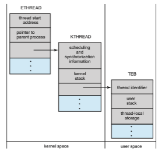
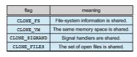

# Threads & Concurrency

The process model introduced in Chapter 3 assumed that a process was an executing programwith a single thread of control. Virtually all modern operat- ing systems, however, provide features enabling a process to contain multiple threads of control. Identifying opportunities for parallelism through the use of threads is becoming increasingly important for modernmulticore systems that provide multiple CPUs.

In this chapter, we introduce many concepts, as well as challenges, associ- ated with multithreaded computer systems, including a discussion of the APIs for the Pthreads, Windows, and Java thread libraries. Additionally, we explore several new features that abstract the concept of creating threads, allowing developers to focus on identifying opportunities for parallelism and letting language features and API frameworks manage the details of thread creation and management. We look at a number of issues related to multithreaded pro- gramming and its effect on the design of operating systems. Finally, we explore how the Windows and Linux operating systems support threads at the kernel level.

**CHAPTER OBJECTIVES**

• Identify the basic components of a thread, and contrast threads and processes.

• Describe the major benefits and significant challenges of designing multi- threaded processes.

• Illustrate different approaches to implicit threading, including thread pools, fork-join, and Grand Central Dispatch.

• Describe how the Windows and Linux operating systems represent threads.

• Design multithreaded applications using the Pthreads, Java, and Windows threading APIs.

## Overview

A thread is a basic unit of CPU utilization; it comprises a thread ID, a program counter (PC), a register set, and a stack. It shares with other threads belonging to the same process its code section, data section, and other operating-system resources, such as open files and signals. A traditional process has a single thread of control. If a process has multiple threads of control, it can perform more than one task at a time. Figure 4.1 illustrates the difference between a traditional **single-threaded** process and a **multithreaded** process.

### Motivation

Most software applications that run on modern computers and mobile devices are multithreaded. An application typically is implemented as a separate pro- cess with several threads of control. Below we highlight a few examples of multithreaded applications:

• An application that creates photo thumbnails from a collection of images may use a separate thread to generate a thumbnail from each separate image.

• Awebbrowsermight have one thread display images or textwhile another thread retrieves data from the network.

• A word processor may have a thread for displaying graphics, another thread for responding to keystrokes from the user, and a third thread for performing spelling and grammar checking in the background.

**Figure 4.1** Single-threaded and multithreaded processes.  

Applications can also be designed to leverage processing capabilities on mul- ticore systems. Such applications can perform several CPU-intensive tasks in parallel across the multiple computing cores.

In certain situations, a single application may be required to perform sev- eral similar tasks. For example, a web server accepts client requests for web pages, images, sound, and so forth. A busy web server may have several (per- haps thousands of) clients concurrently accessing it. If the web server ran as a traditional single-threaded process, it would be able to service only one client at a time, and a client might have to wait a very long time for its request to be serviced.

One solution is to have the server run as a single process that accepts requests. When the server receives a request, it creates a separate process to service that request. In fact, this process-creation method was in common use before threads became popular. Process creation is time consuming and resource intensive, however. If the new process will perform the same tasks as the existing process, why incur all that overhead? It is generally more efficient to use one process that contains multiple threads. If the web-server process is multithreaded, the server will create a separate thread that listens for client requests. When a request is made, rather than creating another process, the server creates a new thread to service the request and resumes listening for additional requests. This is illustrated in Figure 4.2.

Most operating system kernels are also typically multithreaded. As an example, during system boot time on Linux systems, several kernel threads are created. Each thread performs a specific task, such as managing devices, memory management, or interrupt handling. The command ps -ef can be used to display the kernel threads on a running Linux system. Examining the output of this command will show the kernel thread kthreadd (with pid = 2), which serves as the parent of all other kernel threads.

Many applications can also take advantage of multiple threads, including basic sorting, trees, and graph algorithms. In addition, programmerswhomust solve contemporary CPU-intensive problems in data mining, graphics, and artificial intelligence can leverage the power of modern multicore systems by designing solutions that run in parallel.


**Figure 4.2** Multithreaded server architecture.  

### Benefits

The benefits of multithreaded programming can be broken down into four major categories:

**1\. Responsiveness**. Multithreading an interactive application may allow a program to continue running even if part of it is blocked or is perform- ing a lengthy operation, thereby increasing responsiveness to the user. This quality is especially useful in designing user interfaces. For instance, consider what happens when a user clicks a button that results in the performance of a time-consuming operation. A single-threaded appli- cation would be unresponsive to the user until the operation had been completed. In contrast, if the time-consuming operation is performed in a separate, asynchronous thread, the application remains responsive to the user.

**2\. Resource sharing**. Processes can share resources only through techniques such as shared memory and message passing. Such techniques must be explicitly arranged by the programmer. However, threads share the memory and the resources of the process towhich they belong by default. The benefit of sharing code and data is that it allows an application to have several different threads of activity within the same address space.

**3\. Economy**. Allocating memory and resources for process creation is costly. Because threads share the resources of the process to which they belong, it is more economical to create and context-switch threads. Empirically gauging the difference in overhead can be difficult, but in general thread creation consumes less time and memory than process creation. Additionally, context switching is typically faster between threads than between processes.

**4\. Scalability.** The benefits of multithreading can be even greater in a mul- tiprocessor architecture, where threads may be running in parallel on different processing cores. A single-threaded process can run on only one processor, regardless how many are available. We explore this issue further in the following section.

## Multicore Programming

Earlier in the history of computer design, in response to the need for more computing performance, single-CPU systems evolved into multi-CPU systems. A later, yet similar, trend in system design is to place multiple computing cores on a single processing chip where each core appears as a separate CPU to the operating system (Section 1.3.2). We refer to such systems as **multicore**, and multithreaded programming provides a mechanism for more efficient use of these multiple computing cores and improved concurrency. Consider an application with four threads. On a system with a single computing core, concurrency merelymeans that the execution of the threads will be interleaved over time (Figure 4.3), because the processing core is capable of executing only one thread at a time. On a system with multiple cores, however, concurrency  

**Figure 4.3** Concurrent execution on a single-core system.

means that some threads can run in parallel, because the system can assign a separate thread to each core (Figure 4.4).

Notice the distinction between **_concurrency_** and **_parallelism_** in this discus- sion. Aconcurrent system supportsmore than one task by allowing all the tasks tomake progress. In contrast, a parallel system can performmore than one task simultaneously. Thus, it is possible to have concurrency without parallelism. Before the advent of multiprocessor and multicore architectures, most com- puter systems had only a single processor, and CPU schedulers were designed to provide the illusion of parallelism by rapidly switching between processes, thereby allowing each process to make progress. Such processes were running concurrently, but not in parallel.

### Programming Challenges

The trend toward multicore systems continues to place pressure on system designers and application programmers to make better use of the multiple computing cores. Designers of operating systems must write scheduling algo- rithms that usemultiple processing cores to allow the parallel execution shown in Figure 4.4. For application programmers, the challenge is to modify existing programs as well as design new programs that are multithreaded.

In general, five areas present challenges in programming for multicore systems:

**1\. Identifying tasks**. This involves examining applications to find areas that can be divided into separate, concurrent tasks. Ideally, tasks are independent of one another and thus can run in parallel on individual cores.

**2\. Balance**. While identifying tasks that can run in parallel, programmers must also ensure that the tasks perform equal work of equal value. In some instances, a certain task may not contribute as much value to the overall process as other tasks. Using a separate execution core to run that task may not be worth the cost.

**Figure 4.4** Parallel execution on a multicore system.  

**_AMDAHL’S LAW_**

Amdahl’s Law is a formula that identifies potential performance gains from adding additional computing cores to an application that has both serial (nonparallel) and parallel components. If _S_ is the portion of the application that must be performed serially on a system with _N_ processing cores, the formula appears as follows:

_speedup_ ≤ 1

_S_ \+ (1−_S_) _N_

As an example, assume we have an application that is 75 percent parallel and 25 percent serial. If we run this application on a system with two processing cores, we can get a speedup of 1.6 times. If we add two additional cores (for a total of four), the speedup is 2.28 times. Below is a graph illustrating Amdahl’s Law in several different scenarios.

One interesting fact about Amdahl’s Law is that as _N_ approaches infinity, the speedup converges to 1∕_S_. For example, if 50 percent of an application is performed serially, the maximum speedup is 2.0 times, regardless of the number of processing coreswe add. This is the fundamental principle behind Amdahl’s Law: the serial portion of an application can have a dispropor- tionate effect on the performance we gain by adding additional computing cores.

**3\. Data splitting**. Just as applications are divided into separate tasks, the data accessed and manipulated by the tasks must be divided to run on separate cores.

**4\. Data dependency**. The data accessed by the tasks must be examined for dependencies between two or more tasks. When one task depends on data from another, programmers must ensure that the execution of the tasks is synchronized to accommodate the data dependency. We examine such strategies in Chapter 6.  

**Figure 4.5** Data and task parallelism.

**5\. Testing and debugging**. When a program is running in parallel on multi- ple cores,many different execution paths are possible. Testing and debug- ging such concurrent programs is inherently more difficult than testing and debugging single-threaded applications.

Because of these challenges,many software developers argue that the advent of multicore systems will require an entirely new approach to designing software systems in the future. (Similarly,many computer science educators believe that software development must be taught with increased emphasis on parallel programming.)

### Types of Parallelism

In general, there are two types of parallelism: data parallelism and task par- allelism. **Data parallelism** focuses on distributing subsets of the same data across multiple computing cores and performing the same operation on each core. Consider, for example, summing the contents of an array of size _N_. On a single-core system, one thread would simply sum the elements [0] . . . [_N_ − 1]. On a dual-core system, however, thread _A_, running on core 0, could sum the elements [0] . . . [_N_ ∕2 − 1] while thread _B_, running on core 1, could sum the elements [_N_ ∕2] . . . [_N_ − 1]. The two threads would be running in parallel on separate computing cores.

**Task parallelism** involves distributing not data but tasks (threads) across multiple computing cores. Each thread is performing a unique operation. Dif- ferent threads may be operating on the same data, or theymay be operating on different data. Consider again our example above. In contrast to that situation, an example of task parallelism might involve two threads, each performing a unique statistical operation on the array of elements. The threads again are operating in parallel on separate computing cores, but each is performing a unique operation.

Fundamentally, then, data parallelism involves the distribution of data across multiple cores, and task parallelism involves the distribution of tasks across multiple cores, as shown in Figure 4.5. However, data and task paral-  


**Figure 4.6** User and kernel threads.

lelism are not mutually exclusive, and an application may in fact use a hybrid of these two strategies.

## Multithreading Models

Our discussion so far has treated threads in a generic sense. However, support for threads may be provided either at the user level, for **user threads**, or by the kernel, for **kernel threads**. User threads are supported above the kernel and are managed without kernel support, whereas kernel threads are supported and managed directly by the operating system. Virtually all contemporary operating systems—including Windows, Linux, and macOS— support kernel threads.

Ultimately, a relationship must exist between user threads and kernel threads, as illustrated in Figure 4.6. In this section, we look at three common ways of establishing such a relationship: the many-to-one model, the one-to- one model, and the many-to-many model.

### Many-to-One Model

The many-to-one model (Figure 4.7) maps many user-level threads to one kernel thread. Thread management is done by the thread library in user space, so it is efficient (we discuss thread libraries in Section 4.4). However, the entire process will block if a thread makes a blocking system call. Also, because only

**Figure 4.7** Many-to-one model.  

**Figure 4.8** One-to-one model.

one thread can access the kernel at a time, multiple threads are unable to run in parallel on multicore systems. **Green threads**—a thread library available for Solaris systems and adopted in early versions of Java—used the many-to- one model. However, very few systems continue to use the model because of its inability to take advantage of multiple processing cores, which have now become standard on most computer systems.

### One-to-One Model

The one-to-one model (Figure 4.8) maps each user thread to a kernel thread. It provides more concurrency than the many-to-one model by allowing another thread to run when a thread makes a blocking system call. It also allows mul- tiple threads to run in parallel on multiprocessors. The only drawback to this model is that creating a user thread requires creating the corresponding kernel thread, and a large number of kernel threads may burden the performance of a system. Linux, along with the family of Windows operating systems, imple- ment the one-to-one model.

### Many-to-Many Model

The many-to-many model (Figure 4.9) multiplexes many user-level threads to a smaller or equal number of kernel threads. The number of kernel threads may be specific to either a particular application or a particular machine (an application may be allocated more kernel threads on a system with eight processing cores than a system with four cores).

**Figure 4.9** Many-to-many model.  

**Figure 4.10** Two-level model.

Let’s consider the effect of this design on concurrency. Whereas the many- to-one model allows the developer to create as many user threads as she wishes, it does not result in parallelism, because the kernel can schedule only one kernel thread at a time. The one-to-one model allows greater concurrency, but the developer has to be careful not to create too many threads within an application. (In fact, on some systems, she may be limited in the number of threads she can create.) The many-to-many model suffers from neither of these shortcomings: developers can create as many user threads as necessary, and the corresponding kernel threads can run in parallel on a multiprocessor. Also, when a thread performs a blocking system call, the kernel can schedule another thread for execution.

One variation on the many-to-many model still multiplexes many user- level threads to a smaller or equal number of kernel threads but also allows a user-level thread to be bound to a kernel thread. This variation is sometimes referred to as the **two-level model** (Figure 4.10).

Although the many-to-many model appears to be the most flexible of the models discussed, in practice it is difficult to implement. In addition, with an increasing number of processing cores appearing on most systems, limiting the number of kernel threads has become less important. As a result, most operating systems now use the one-to-one model. However, as we shall see in Section 4.5, some contemporary concurrency libraries have developers identify tasks that are then mapped to threads using the many-to-many model.

## Thread Libraries

A **thread library** provides the programmer with an API for creating and man- aging threads. There are two primary ways of implementing a thread library. The first approach is to provide a library entirely in user space with no kernel support. All code and data structures for the library exist in user space. This means that invoking a function in the library results in a local function call in user space and not a system call.

The second approach is to implement a kernel-level library supported directly by the operating system. In this case, code and data structures for the library exist in kernel space. Invoking a function in the API for the library typically results in a system call to the kernel.  

Three main thread libraries are in use today: POSIX Pthreads,Windows, and Java. Pthreads, the threads extension of the POSIX standard, may be provided as either a user-level or a kernel-level library. The Windows thread library is a kernel-level library available on Windows systems. The Java thread API allows threads to be created andmanaged directly in Java programs. However, because inmost instances the JVM is running on top of a host operating system, the Java thread API is generally implemented using a thread library available on the host system. Thismeans that onWindows systems, Java threads are typ- ically implemented using the Windows API; UNIX, Linux, and macOS systems typically use Pthreads.

For POSIX and Windows threading, any data declared globally—that is, declared outside of any function—are shared among all threads belonging to the same process. Because Java has no equivalent notion of global data, access to shared data must be explicitly arranged between threads.

In the remainder of this section, we describe basic thread creation using these three thread libraries. As an illustrative example, we design a multi- threaded program that performs the summation of a non-negative integer in a separate thread using the well-known summation function:

          N
    sum = ∑i
         i=1 

For example, if _N_ were 5, this function would represent the summation of integers from 1 to 5, which is 15. Each of the three programs will be run with the upper bounds of the summation entered on the command line. Thus, if the user enters 8, the summation of the integer values from 1 to 8 will be output.

Before we proceed with our examples of thread creation, we introduce two general strategies for creating multiple threads: **asynchronous threading** and **synchronous threading**. With asynchronous threading, once the parent creates a child thread, the parent resumes its execution, so that the parent and child execute concurrently and independently of one another. Because the threads are independent, there is typically little data sharing between them.Asynchronous threading is the strategy used in themultithreaded server illustrated in Figure 4.2 and is also commonly used for designing responsive user interfaces.

Synchronous threading occurs when the parent thread creates one or more children and thenmustwait for all of its children to terminate before it resumes. Here, the threads created by the parent perform work concurrently, but the parent cannot continue until this work has been completed. Once each thread has finished itswork, it terminates and joinswith its parent. Only after all of the children have joined can the parent resume execution. Typically, synchronous threading involves significant data sharing among threads. For example, the parent thread may combine the results calculated by its various children. All of the following examples use synchronous threading.

### Pthreads

**Pthreads** refers to the POSIX standard (IEEE 1003.1c) defining an API for thread creation and synchronization. This is a **_specification_** for thread behavior, not an **_implementation_**. Operating-systemdesignersmay implement the specification  


**Figure 4.11** Multithreaded C program using the Pthreads API.

in any way they wish. Numerous systems implement the Pthreads specifica- tion; most are UNIX-type systems, including Linux and macOS. AlthoughWin- dows doesn’t support Pthreads natively, some third-party implementations for Windows are available.

The C program shown in Figure 4.11 demonstrates the basic Pthreads API for constructing a multithreaded program that calculates the summation of a non-negative integer in a separate thread. In a Pthreads program, separate threads begin execution in a specified function. In Figure 4.11, this is the run- ner() function. When this program begins, a single thread of control begins in  

**Figure 4.12** Pthread code for joining ten threads.

main(). After some initialization, main() creates a second thread that begins control in the runner() function. Both threads share the global data sum.

Let’s look more closely at this program. All Pthreads programs must include the pthread.h header file. The statement pthread t tid declares the identifier for the thread we will create. Each thread has a set of attributes, including stack size and scheduling information. The pthread attr t attr declaration represents the attributes for the thread. We set the attributes in the function call pthread attr init(&attr). Because we did not explicitly set any attributes, we use the default attributes provided. (In Chapter 5, we discuss some of the scheduling attributes provided by the Pthreads API.) A separate thread is created with the pthread create() function call. In addi- tion to passing the thread identifier and the attributes for the thread, we also pass the name of the function where the new thread will begin execution—in this case, the runner() function. Last, we pass the integer parameter that was provided on the command line, argv[1].

At this point, the program has two threads: the initial (or parent) thread in main() and the summation (or child) thread performing the summation oper- ation in the runner() function. This program follows the thread create/join strategy, whereby after creating the summation thread, the parent thread will wait for it to terminate by calling the pthread join() function. The summa- tion threadwill terminatewhen it calls the function pthread exit(). Once the summation thread has returned, the parent thread will output the value of the shared data sum.

This example program creates only a single thread. With the growing dominance of multicore systems, writing programs containing several threads has become increasingly common. A simple method for waiting on several threads using the pthread join() function is to enclose the operation within a simple for loop. For example, you can join on ten threads using the Pthread code shown in Figure 4.12.

### Windows Threads

The technique for creating threads using theWindows thread library is similar to the Pthreads technique in several ways. We illustrate the Windows thread API in the C program shown in Figure 4.13. Notice that we must include the windows.h header file when using the Windows API.  


**Figure 4.13** Multithreaded C program using the Windows API.

Just as in the Pthreads version shown in Figure 4.11, data shared by the separate threads—in this case, Sum—are declared globally (the DWORD data type is an unsigned 32-bit integer). We also define the Summation() function that is to be performed in a separate thread. This function is passed a pointer to a void, which Windows defines as LPVOID. The thread performing this function sets the global data Sum to the value of the summation from 0 to the parameter passed to Summation().  

Threads are created in the Windows API using the CreateThread() func- tion, and—just as in Pthreads—a set of attributes for the thread is passed to this function. These attributes include security information, the size of the stack, and a flag that can be set to indicate if the thread is to start in a suspended state. In this program, we use the default values for these attributes. (The default values do not initially set the thread to a suspended state and instead make it eligible to be run by the CPU scheduler.) Once the summation thread is created, the parent must wait for it to complete before outputting the value of Sum, as the value is set by the summation thread. Recall that the Pthread program (Figure 4.11) had the parent thread wait for the summation thread using the pthread join() statement. We perform the equivalent of this in the Windows API using the WaitForSingleObject() function, which causes the creating thread to block until the summation thread has exited.

In situations that require waiting for multiple threads to complete, the WaitForMultipleObjects() function is used. This function is passed four parameters:

**1\.** The number of objects to wait for

**2\.** Apointer to the array of objects

**3\.** Aflag indicating whether all objects have been signaled

**4\.** A timeout duration (or INFINITE)

For example, if THandles is an array of thread HANDLE objects of size N, the parent thread can wait for all its child threads to complete with this statement:

WaitForMultipleObjects(N, THandles, TRUE, INFINITE);

### Java Threads

Threads are the fundamental model of program execution in a Java program, and the Java language and its API provide a rich set of features for the creation and management of threads. All Java programs comprise at least a single thread of control—even a simple Java program consisting of only a main() method runs as a single thread in the JVM. Java threads are available on any system that provides a JVM including Windows, Linux, and macOS. The Java thread API is available for Android applications as well.

There are two techniques for explicitly creating threads in a Java program. One approach is to create a new class that is derived from the Thread class and to override its run()method. An alternative—and more commonly used —technique is to define a class that implements the Runnable interface. This interface defines a single abstract method with the signature public void run(). The code in the run() method of a class that implements Runnable is what executes in a separate thread. An example is shown below:
```
class Task implements Runnable {

public void **run**() { System.out.println("I am a thread.");

} }  
```
**_LAMBDAEXPRESSIONS IN JAVA_**

Beginning with Version 1.8 of the language, Java introduced Lambda expres- sions, which allow a much cleaner syntax for creating threads. Rather than defining a separate class that implements Runnable, a Lambda expression can be used instead:
```
Runnable task = () -> { System.out.println("I am a thread.");

};

Thread worker = new Thread(task); worker.start();
```
Lambda expressions—as well as similar functions known as **closures**—are a prominent feature of functional programming languages and have been available in several nonfunctional languages as well including Python, C++, and C#. As we shall see in later examples in this chapter, Lamdba expressions often provide a simple syntax for developing parallel applications.

Thread creation in Java involves creating a Thread object and passing it an instance of a class that implements Runnable, followed by invoking the start()method on the Thread object. This appears in the following example:

Thread worker = new Thread(new Task()); worker.**start**();

Invoking the start()method for the new Thread object does two things:

**1\.** It allocates memory and initializes a new thread in the JVM.

**2\.** It calls the run()method,making the thread eligible to be run by the JVM. (Note again that we never call the run()method directly. Rather, we call the start()method, and it calls the run()method on our behalf.)

Recall that the parent threads in the Pthreads and Windows libraries use pthread join() and WaitForSingleObject() (respectively) to wait for the summation threads to finish before proceeding. The join() method in Java provides similar functionality. (Notice that join() can throw an Interrupt- edException, which we choose to ignore.)
```
try { worker.**join**();

} catch (InterruptedException ie) { }
```
If the parent must wait for several threads to finish, the join()method can be enclosed in a for loop similar to that shown for Pthreads in Figure 4.12.  


#### Java Executor Framework

Java has supported thread creation using the approachwe have described thus far since its origins. However, beginning with Version 1.5 and its API, Java introduced several new concurrency features that provide developers with much greater control over thread creation and communication. These tools are available in the java.util.concurrent package.

Rather than explicitly creating Thread objects, thread creation is instead organized around the Executor interface:
```
public interface Executor {

void execute(Runnable command); }
```
Classes implementing this interfacemust define the execute()method,which is passed a Runnable object. For Java developers, this means using the Execu- tor rather than creating a separate Thread object and invoking its start() method. The Executor is used as follows:
```
Executor service = new _Executor_; 
service.execute(new Task());
```
The Executor framework is based on the producer-consumermodel; tasks implementing the Runnable interface are produced, and the threads that exe- cute these tasks consume them. The advantage of this approach is that it not only divides thread creation from execution but also provides a mechanism for communication between concurrent tasks.

Data sharing between threads belonging to the same process occurs easily in Windows and Pthreads, since shared data are simply declared globally. As a pure object-oriented language, Java has no such notion of global data. We can pass parameters to a class that implements Runnable, but Java threads cannot return results. To address this need, the java.util.concurrent pack- age additionally defines the Callable interface, which behaves similarly to Runnable except that a result can be returned. Results returned from Callable tasks are known as Future objects. A result can be retrieved from the get() method defined in the Future interface. The program shown in Figure 4.14 illustrates the summation program using these Java features.

The Summation class implements the Callable interface, which specifies the method V call()—it is the code in this call() method that is executed in a separate thread. To execute this code, we create a newSingleThreadEx- ecutor object (provided as a static method in the Executors class), which is of type ExecutorService, and pass it a Callable task using its submit() method. (The primary difference between the execute() and submit()meth- ods is that the former returns no result, whereas the latter returns a result as a Future.) Once we submit the callable task to the thread, we wait for its result by calling the get()method of the Future object it returns.

It is quite easy to notice at first that this model of thread creation appears more complicated than simply creating a thread and joining on its termination. However, incurring this modest degree of complication confers benefits. Aswe have seen, using Callable and Future allows for threads to return results.  

**Figure 4.14** Illustration of Java Executor framework API.

Additionally, this approach separates the creation of threads from the results they produce: rather than waiting for a thread to terminate before retrieving results, the parent instead onlywaits for the results to become available. Finally, as we shall see in Section 4.5.1, this framework can be combined with other features to create robust tools for managing a large number of threads.

## Implicit Threading

With the continued growth of multicore processing, applications contain- ing hundreds—or even thousands—of threads are looming on the horizon. Designing such applications is not a trivial undertaking: programmers must  

**_THE JVM AND THE HOST OPERATING SYSTEM_**

The JVM is typically implemented on top of a host operating system (see Figure 18.10). This setup allows the JVM to hide the implementation details of the underlying operating system and to provide a consistent, abstract environment that allows Java programs to operate on any platform that supports a JVM. The specification for the JVM does not indicate how Java threads are to bemapped to the underlying operating system, instead leaving that decision to the particular implementation of the JVM. For example, the Windows operating system uses the one-to-one model; therefore, each Java thread for a JVM running on Windows maps to a kernel thread. In addition, there may be a relationship between the Java thread library and the thread library on the host operating system. For example, implementations of a JVM for the Windows family of operating systems might use the Windows API when creating Java threads; Linux andmacOS systemsmight use the Pthreads API.

address not only the challenges outlined in Section 4.2 but additional difficul- ties as well. These difficulties, which relate to program correctness, are covered in Chapter 6 and Chapter 8.

One way to address these difficulties and better support the design of con- current and parallel applications is to transfer the creation and management of threading from application developers to compilers and run-time libraries. This strategy, termed **implicit threading**, is an increasingly popular trend. In this section, we explore four alternative approaches to designing applications that can take advantage of multicore processors through implicit threading. As we shall see, these strategies generally require application developers to identify **_tasks_**—not threads—that can run in parallel. A task is usually writ- ten as a function, which the run-time library then maps to a separate thread, typically using the many-to-many model (Section 4.3.3). The advantage of this approach is that developers only need to identify parallel tasks, and the libraries determine the specific details of thread creation and management.

### Thread Pools

In Section 4.1, we described a multithreaded web server. In this situation, whenever the server receives a request, it creates a separate thread to service the request.Whereas creating a separate thread is certainly superior to creating a separate process, a multithreaded server nonetheless has potential problems. The first issue concerns the amount of time required to create the thread, together with the fact that the thread will be discarded once it has completed its work. The second issue is more troublesome. If we allow each concurrent request to be serviced in a new thread, we have not placed a bound on the number of threads concurrently active in the system. Unlimited threads could exhaust system resources, such as CPU time or memory. One solution to this problem is to use a **thread pool**.  

**_ANDROID THREAD POOLS_**

In Section 3.8.2.1, we covered RPCs in the Android operating system. You may recall from that section that Android uses the Android Interface Defi- nition Language (AIDL), a tool that specifies the remote interface that clients interactwith on the server. AIDLalso provides a thread pool. Aremote service using the thread pool can handlemultiple concurrent requests, servicing each request using a separate thread from the pool.

The general idea behind a thread pool is to create a number of threads at start-up and place them into a pool, where they sit and wait for work. When a server receives a request, rather than creating a thread, it instead submits the request to the thread pool and resumes waiting for additional requests. If there is an available thread in the pool, it is awakened, and the request is serviced immediately. If the pool contains no available thread, the task is queued until one becomes free. Once a thread completes its service, it returns to the pool and awaits more work. Thread pools work well when the tasks submitted to the pool can be executed asynchronously.

Thread pools offer these benefits:

**1\.** Servicing a request with an existing thread is often faster than waiting to create a thread.

**2\.** Athreadpool limits the number of threads that exist at any one point. This is particularly important on systems that cannot support a large number of concurrent threads.

**3\.** Separating the task to be performed from the mechanics of creating the task allows us to use different strategies for running the task. For example, the task could be scheduled to execute after a time delay or to execute periodically.

The number of threads in the pool can be set heuristically based on factors such as the number of CPUs in the system, the amount of physical memory, and the expected number of concurrent client requests. More sophisticated thread- pool architectures can dynamically adjust the number of threads in the pool according to usage patterns. Such architectures provide the further benefit of having a smaller pool—thereby consuming less memory—when the load on the system is low. We discuss one such architecture, Apple’s Grand Central Dispatch, later in this section.

TheWindows API provides several functions related to thread pools. Using the thread pool API is similar to creating a thread with the Thread Create() function, as described in Section 4.4.2. Here, a function that is to run as a separate thread is defined. Such a function may appear as follows:
```
DWORD WINAPI PoolFunction(PVOID Param) { \* this function runs as a separate thread. */

}  
```

A pointer to PoolFunction() is passed to one of the functions in the thread pool API, and a thread from the pool executes this function. One such member in the thread pool API is the QueueUserWorkItem() function, which is passed three parameters:

• LPTHREAD START ROUTINE Function—a pointer to the function that is to run as a separate thread

• PVOID Param—the parameter passed to Function

• ULONG Flags—flags indicating how the thread pool is to create and man- age execution of the thread

An example of invoking a function is the following:

QueueUserWorkItem(&PoolFunction, NULL, 0);

This causes a thread from the thread pool to invoke PoolFunction() on behalf of the programmer. In this instance, we pass no parameters to PoolFunc- tion(). Because we specify 0 as a flag, we provide the thread pool with no special instructions for thread creation.

Other members in the Windows thread pool API include utilities that invoke functions at periodic intervals or when an asynchronous I/O request completes.

#### Java Thread Pools

The java.util.concurrent package includes an API for several varieties of thread-pool architectures. Here, we focus on the following three models:

**1\.** Single thread executor—newSingleThreadExecutor()—creates a pool of size 1.

**2\.** Fixed thread executor—newFixedThreadPool(int size)—creates a thread pool with a specified number of threads.

**3\.** Cached thread executor—newCachedThreadPool()—creates an unbounded thread pool, reusing threads in many instances.

We have, in fact, already seen the use of a Java thread pool in Section 4.4.3, wherewe created a newSingleThreadExecutor in the program example shown in Figure 4.14. In that section, we noted that the Java executor frame- work can be used to construct more robust threading tools. We now describe how it can be used to create thread pools.

A thread pool is created using one of the factorymethods in the Executors class:

• static ExecutorService newSingleThreadExecutor()

• static ExecutorService newFixedThreadPool(int size)

• static ExecutorService newCachedThreadPool()

Each of these factorymethods creates and returns an object instance that imple- ments the ExecutorService interface. ExecutorService extends the Execu-  


**Figure 4.15** Creating a thread pool in Java.

tor interface, allowing us to invoke the execute() method on this object. In addition, ExecutorService provides methods for managing termination of the thread pool.

The example shown in Figure 4.15 creates a cached threadpool and submits tasks to be executedby a thread in the pool using the execute()method.When the shutdown()method is invoked, the thread pool rejects additional tasks and shuts down once all existing tasks have completed execution.

### Fork Join

The strategy for thread creation covered in Section 4.4 is often known as the **fork-join** model. Recall that with this method, the main parent thread creates (**_forks_**) one or more child threads and then waits for the children to terminate and **_join_** with it, at which point it can retrieve and combine their results. This synchronous model is often characterized as explicit thread creation, but it is also an excellent candidate for implicit threading. In the latter situation, threads are not constructed directly during the fork stage; rather, parallel tasks are designated. This model is illustrated in Figure 4.16. A library manages the number of threads that are created and is also responsible for assigning tasks to threads. In some ways, this fork-join model is a synchronous version of thread pools in which a library determines the actual number of threads to create— for example, by using the heuristics described in Section 4.5.1.

#### Fork Join in Java

Java introduced a fork-join library in Version 1.7 of the API that is designed to be used with recursive divide-and-conquer algorithms such as Quicksort andMergesort.When implementingdivide-and-conquer algorithms using this  

**Figure 4.16** Fork-join parallelism.

library, separate tasks are forked during the divide step and assigned smaller subsets of the original problem. Algorithms must be designed so that these separate tasks can execute concurrently. At some point, the size of the problem assigned to a task is small enough that it can be solved directly and requires creating no additional tasks. The general recursive algorithm behind Java’s fork-join model is shown below:
```
Task(problem) 
 if problem is small enough
    solve the problem directly 
 else

    subtask1 = fork(new Task(subset of problem) 
    subtask2 = fork(new Task(subset of problem)

    result1 = join(subtask1) 
    result2 = join(subtask2)

    return combined results
```
Figure 4.17 depicts the model graphically. We now illustrate Java’s fork-join strategy by designing a divide-and-

conquer algorithm that sums all elements in an array of integers. In Version 1.7 of the API Java introduced a new thread pool—the ForkJoinPool—that can be assigned tasks that inherit the abstract base class ForkJoinTask (which for now we will assume is the SumTask class). The following creates a ForkJoin- Pool object and submits the initial task via its invoke()method:
```
ForkJoinPool pool = new ForkJoinPool(); // array contains the integers to be summed int[] array = new int[SIZE];

SumTask task = new SumTask(0, SIZE - 1, array); int sum = pool.invoke(task);
```
Upon completion, the initial call to invoke() returns the summation of array. The class SumTask—shown in Figure 4.18—implements a divide-and-

conquer algorithm that sums the contents of the array using fork-join. New tasks are created using the fork()method, and the compute()method speci- fies the computation that is performed by each task. The method compute() is invoked until it can directly calculate the sum of the subset it is assigned. The  

**Figure 4.17** Fork-join in Java.

call to join() blocks until the task completes, upon which join() returns the results calculated in compute().

Notice that SumTask in Figure 4.18 extends RecursiveTask. The Java fork- join strategy is organized around the abstract base class ForkJoinTask, and the RecursiveTask and RecursiveAction classes extend this class. The fun- damental difference between these two classes is that RecursiveTask returns a result (via the return value specified in compute()), and RecursiveAction does not return a result. The relationship between the three classes is illustrated in the UML class diagram in Figure 4.19.

An important issue to consider is determining when the problem is “small enough” to be solved directly and no longer requires creating additional tasks. In SumTask, this occurs when the number of elements being summed is less than the value THRESHOLD, which in Figure 4.18we have arbitrarily set to 1,000. In practice, determiningwhen a problem can be solved directly requires careful timing trials, as the value can vary according to implementation.

What is interesting in Java’s fork-join model is the management of tasks wherein the library constructs a pool of worker threads and balances the load of tasks among the available workers. In some situations, there are thousands of tasks, yet only a handful of threads performing the work (for example, a separate thread for each CPU). Additionally, each thread in a ForkJoinPool maintains a queue of tasks that it has forked, and if a thread’s queue is empty, it can steal a task from another thread’s queue using a**_work stealing_** algorithm, thus balancing the workload of tasks among all threads.  

**Figure 4.18** Fork-join calculation using the Java API.

### OpenMP

OpenMP is a set of compiler directives as well as an API for programswritten in C, C++, or FORTRAN that provides support for parallel programming in shared- memory environments. OpenMP identifies **parallel regions** as blocks of code that may run in parallel. Application developers insert compiler directives into their code at parallel regions, and these directives instruct the OpenMP run-  

**Figure 4.19** UML class diagram for Java’s fork-join.

time library to execute the region in parallel. The following C program illus- trates a compiler directive above the parallel region containing the printf() statement:
```
#include _<_omp.h_\>_ #include _<_stdio.h_\>_

int main(int argc, char \*argv\[\]) _{_

/\* sequential code \*/

#pragma omp parallel _{_

printf("I am a parallel region."); _}_

/\* sequential code \*/

return 0; _}_
```
When OpenMP encounters the directive
```
#pragma omp parallel
```
it creates as many threads as there are processing cores in the system. Thus, for a dual-core system, two threads are created; for a quad-core system, four are created; and so forth. All the threads then simultaneously execute the parallel region. As each thread exits the parallel region, it is terminated.

OpenMP provides several additional directives for running code regions in parallel, including parallelizing loops. For example, assume we have two arrays, a and b, of size N. We wish to sum their contents and place the results  

in array c. We can have this task run in parallel by using the following code segment, which contains the compiler directive for parallelizing for loops:
```
pragma omp parallel for for (i = 0; i < N; i++) _{_
c[i] = a[i] + b[i]; _}_
```
OpenMP divides the work contained in the for loop among the threads it has created in response to the directive 
```
#pragma omp parallel for
```
In addition to providing directives for parallelization, OpenMP allows developers to choose among several levels of parallelism. For example, they can set the number of threads manually. It also allows developers to identify whether data are shared between threads or are private to a thread. OpenMP is available on several open-source and commercial compilers for Linux, Win- dows, and macOS systems. We encourage readers interested in learning more about OpenMP to consult the bibliography at the end of the chapter.

### Grand Central Dispatch

Grand Central Dispatch (GCD) is a technology developed by Apple for its macOS and iOS operating systems. It is a combination of a run-time library, an API, and language extensions that allow developers to identify sections of code (**_tasks_**) to run in parallel. Like OpenMP, GCD manages most of the details of threading.

GCD schedules tasks for run-time execution by placing them on a **dispatch queue**. When it removes a task from a queue, it assigns the task to an available thread from a pool of threads that it manages. GCD identifies two types of dispatch queues: **_serial_** and **_concurrent_**.

Tasks placed on a serial queue are removed in FIFO order. Once a task has been removed from the queue, it must complete execution before another task is removed. Each process has its own serial queue (known as its **main queue**), and developers can create additional serial queues that are local to a particular process. (This is why serial queues are also known as **_private dispatch queues_**.) Serial queues are useful for ensuring the sequential execution of several tasks.

Tasks placed on a concurrent queue are also removed in FIFO order, but several tasksmay be removed at a time, thus allowingmultiple tasks to execute in parallel. There are several system-wide concurrent queues (also known as **_global dispatch queues_**), which are divided into four primary quality-of-service classes:

• QOS CLASS USER INTERACTIVE—The **user-interactive** class represents tasks that interact with the user, such as the user interface and event handling, to ensure a responsive user interface. Completing a task belonging to this class should require only a small amount of work.

• QOS CLASS USER INITIATED—The **user-initiated** class is similar to the user-interactive class in that tasks are associated with a responsive user interface; however, user-initiated tasks may require longer processing times. Opening a file or a URL is a user-initiated task, for example. Tasks belonging to this class must be completed for the user to continue inter- acting with the system, but they do not need to be serviced as quickly as tasks in the user-interactive queue.

• QOS CLASS UTILITY —The **utility** class represents tasks that require a longer time to complete but do not demand immediate results. This class includes work such as importing data.

• QOS CLASS BACKGROUND —Tasks belonging to the **background** class are not visible to the user and are not time sensitive. Examples include index- ing a mailbox system and performing backups.

Tasks submitted to dispatch queues may be expressed in one of two different ways:

**1\.** For the C, C++, and Objective-C languages, GCD identifies a language extension known as a **block**, which is simply a self-contained unit of work. A block is specified by a caret ˆ inserted in front of a pair of braces _{ }_. Code within the braces identifies the unit of work to be performed. A simple example of a block is shown below:

^_{_ printf("I am a block"); _}_

**2\.** For the Swift programming language, a task is defined using a **_closure_**, which is similar to a block in that it expresses a self-contained unit of functionality. Syntactically, a Swift closure is written in the same way as a block, minus the leading caret.

The following Swift code segment illustrates obtaining a concurrent queue for the user-initiated class and submitting a task to the queue using the dispatch async() function:
```
let queue = dispatch get global queue (QOS CLASS USER INITIATED, 0)

dispatch async(queue,_{_ print("I am a closure.") _}_)
```
Internally, GCD’s thread pool is composed of POSIX threads. GCD actively manages the pool, allowing the number of threads to grow and shrink accord- ing to application demand and system capacity. GCD is implemented by the libdispatch library, which Apple has released under the Apache Commons license. It has since been ported to the FreeBSD operating system.

### Intel Thread Building Blocks

Intel threading building blocks (TBB) is a template library that supports design- ing parallel applications in C++. As this is a library, it requires no special compiler or language support. Developers specify tasks that can run in parallel, and the TBB task scheduler maps these tasks onto underlying threads. Furthermore, the task scheduler provides load balancing and is cache aware, meaning that it will give precedence to tasks that likely have their data stored in cache memory and thus will execute more quickly. TBB provides a rich set of features, including templates for parallel loop structures, atomic operations, and mutual exclusion locking. In addition, it provides concurrent data struc- tures, including a hash map, queue, and vector, which can serve as equivalent thread-safe versions of the C++ standard template library data structures.

Let’s use parallel for loops as an example. Initially, assume there is a func- tion named apply(float value) that performs an operation on the parameter value. If we had an array v of size n containing float values, we could use the following serial for loop to pass each value in v to the apply() function:
```
for (int i = 0; i < n; i++) { apply(v[i]);
}
```
A developer could manually apply data parallelism (Section 4.2.2) on a multicore system by assigning different regions of the array v to each pro- cessing core; however, this ties the technique for achieving parallelism closely to the physical hardware, and the algorithm would have to be modified and recompiled for the number of processing cores on each specific architecture.

Alternatively, a developer could use TBB, which provides a parallel for template that expects two values:

parallel for (**_range body_** )

where **_range_** refers to the range of elements that will be iterated (known as the **iteration space**) and **_body_** specifies an operation that will be performed on a subrange of elements.

We can now rewrite the above serial for loop using the TBB parallel for template as follows:
```
parallel for (size t(0), n, \[=\](size t i) _{_apply(v\[i\]);_}_);
```
The first two parameters specify that the iteration space is from 0 to _n_−1 (which corresponds to the number of elements in the array v). The second parameter is a C++ lambda function that requires a bit of explanation. The expression \[=\](size t i) is the parameter i, which assumes each of the values over the iteration space (in this case from 0 to �� − 1). Each value of i is used to identify which array element in v is to be passed as a parameter to the apply(v[i]) function.

The TBB library will divide the loop iterations into separate “chunks” and create a number of tasks that operate on those chunks. (The parallel for function allows developers to manually specify the size of the chunks if they wish to.) TBB will also create a number of threads and assign tasks to available threads. This is quite similar to the fork-join library in Java. The advantage of this approach is that it requires only that developers identify what operations can run in parallel (by specifying a parallel for loop), and the library manages the details involved in dividing the work into separate tasks that run in parallel. Intel TBB has both commercial and open-source versions that run on Windows, Linux, and macOS. Refer to the bibliography for further details on how to develop parallel applications using TBB.

## Threading Issues

In this section, we discuss some of the issues to consider in designing multi- threaded programs.

### The fork() and exec() System Calls

In Chapter 3, we described how the fork() system call is used to create a separate, duplicate process. The semantics of the fork() and exec() system calls change in a multithreaded program.

If one thread in a program calls fork(), does the new process duplicate all threads, or is the new process single-threaded? Some UNIX systems have chosen to have two versions of fork(), one that duplicates all threads and another that duplicates only the thread that invoked the fork() system call.

The exec() system call typically works in the same way as described in Chapter 3. That is, if a thread invokes the exec() system call, the program specified in the parameter to exec()will replace the entire process—including all threads.

Which of the two versions of fork() to use depends on the application. If exec() is called immediately after forking, then duplicating all threads is unnecessary, as the program specified in the parameters to exec()will replace the process. In this instance, duplicating only the calling thread is appropri- ate. If, however, the separate process does not call exec() after forking, the separate process should duplicate all threads.

### Signal Handling

A **signal** is used in UNIX systems to notify a process that a particular event has occurred. A signal may be received either synchronously or asynchronously, depending on the source of and the reason for the event being signaled. All signals, whether synchronous or asynchronous, follow the same pattern:

**1\.** A signal is generated by the occurrence of a particular event.

**2\.** The signal is delivered to a process.

**3\.** Once delivered, the signal must be handled.

Examples of synchronous signals include illegal memory access and divi- sion by 0. If a running program performs either of these actions, a signal is gen- erated. Synchronous signals are delivered to the same process that performed the operation that caused the signal (that is the reason they are considered synchronous).

When a signal is generated by an event external to a running process, that process receives the signal asynchronously. Examples of such signals include terminating a process with specific keystrokes (such as _<_control_\><_C_\>_) and  
having a timer expire. Typically, an asynchronous signal is sent to another process.

A signal may be **_handled_** by one of two possible handlers:

**1\.** Adefault signal handler

**2\.** Auser-defined signal handler

Every signal has a **default signal handler** that the kernel runs when han- dling that signal. This default action can be overridden by a **user-define signal handler** that is called to handle the signal. Signals are handled in differ- ent ways. Some signals may be ignored, while others (for example, an illegal memory access) are handled by terminating the program.

Handling signals in single-threaded programs is straightforward: signals are always delivered to a process. However, delivering signals is more compli- cated in multithreaded programs, where a process may have several threads. Where, then, should a signal be delivered?

In general, the following options exist:

**1\.** Deliver the signal to the thread to which the signal applies.

**2\.** Deliver the signal to every thread in the process.

**3\.** Deliver the signal to certain threads in the process.

**4\.** Assign a specific thread to receive all signals for the process.

Themethod for delivering a signal depends on the type of signal generated. For example, synchronous signals need to be delivered to the thread causing the signal and not to other threads in the process. However, the situation with asynchronous signals is not as clear. Some asynchronous signals—such as a signal that terminates a process (_<_control_\><_C_\>_, for example)—should be sent to all threads.

The standard UNIX function for delivering a signal is

kill(pid t pid, int signal)

This function specifies the process (pid) towhich a particular signal (signal) is to be delivered.Most multithreaded versions of UNIX allow a thread to specify which signals it will accept and which it will block. Therefore, in some cases, an asynchronous signal may be delivered only to those threads that are not blocking it. However, because signals need to be handled only once, a signal is typically delivered only to the first thread found that is not blocking it. POSIX Pthreads provides the following function, which allows a signal to be delivered to a specified thread (tid):

pthread kill(pthread t tid, int signal)

Although Windows does not explicitly provide support for signals, it allows us to emulate them using **asynchronous procedure calls** (**APCs**). The APC facility enables a user thread to specify a function that is to be called when the user thread receives notification of a particular event. As indicated 
by its name, an APC is roughly equivalent to an asynchronous signal in UNIX. However, whereas UNIX must contend with how to deal with signals in a mul- tithreaded environment, the APC facility is more straightforward, since an APC is delivered to a particular thread rather than a process.

### Thread Cancellation

**Thread cancellation** involves terminating a thread before it has completed. For example, if multiple threads are concurrently searching through a database and one thread returns the result, the remaining threads might be canceled. Another situation might occur when a user presses a button on a web browser that stops a web page from loading any further. Often, a web page loads using several threads—each image is loaded in a separate thread. When a user presses the stop button on the browser, all threads loading the page are canceled.

A thread that is to be canceled is often referred to as the **target thread**. Cancellation of a target thread may occur in two different scenarios:

**1\. Asynchronous cancellation**. One thread immediately terminates the tar- get thread.

**2\. Deferred cancellation**. The target thread periodically checks whether it should terminate, allowing it an opportunity to terminate itself in an orderly fashion.

The difficulty with cancellation occurs in situations where resources have been allocated to a canceled thread or where a thread is canceled while in the midst of updating data it is sharing with other threads. This becomes especially troublesome with asynchronous cancellation. Often, the operating system will reclaim system resources from a canceled thread but will not reclaim all resources. Therefore, canceling a thread asynchronously may not free a necessary system-wide resource.

With deferred cancellation, in contrast, one thread indicates that a target thread is to be canceled, but cancellation occurs only after the target thread has checked a flag to determine whether or not it should be canceled. The thread can perform this check at a point at which it can be canceled safely.

In Pthreads, thread cancellation is initiated using the pthread cancel() function. The identifier of the target thread is passed as a parameter to the func- tion. The following code illustrates creating—and then canceling—a thread:
```
pthread t tid;

/\* create the thread \*/ pthread create(&tid, 0, worker, NULL);

. . .

/\* cancel the thread \*/ **pthread cancel**(tid);

/\* wait for the thread to terminate \*/ pthread join(tid,NULL);  
```
Invoking pthread cancel()indicates only a request to cancel the target thread, however; actual cancellation depends on how the target thread is set up to handle the request. When the target thread is finally canceled, the call to pthread join() in the canceling thread returns. Pthreads supports three cancellation modes. Each mode is defined as a state and a type, as illustrated in the table below. A threadmay set its cancellation state and type using an API.


As the table illustrates, Pthreads allows threads to disable or enable can- cellation. Obviously, a thread cannot be canceled if cancellation is disabled. However, cancellation requests remain pending, so the thread can later enable cancellation and respond to the request.

The default cancellation type is deferred cancellation. However, cancella- tion occurs only when a thread reaches a **cancellation point**. Most of the block- ing system calls in the POSIX and standard C library are defined as cancellation points, and these are listed when invoking the command man pthreads on a Linux system. For example, the read() system call is a cancellation point that allows cancelling a thread that is blocked while awaiting input from read().

One technique for establishing a cancellation point is to invoke the pthread testcancel() function. If a cancellation request is found to be pending, the call to pthread testcancel() will not return, and the thread will terminate; otherwise, the call to the function will return, and the thread will continue to run. Additionally, Pthreads allows a function known as a **cleanup handler** to be invoked if a thread is canceled. This function allows any resources a thread may have acquired to be released before the thread is terminated.

The following code illustrates how a thread may respond to a cancellation request using deferred cancellation:
```
while (1) { /\* do some work for awhile \*/

. . .

/\* check if there is a cancellation request \*/ **pthread testcancel**();

}
```
Because of the issues described earlier, asynchronous cancellation is not recommended in Pthreads documentation. Thus, we do not cover it here. An interesting note is that on Linux systems, thread cancellation using the Pthreads API is handled through signals (Section 4.6.2).

Thread cancellation in Java uses a policy similar to deferred cancellation in Pthreads. To cancel a Java thread, you invoke the interrupt()method, which sets the interruption status of the target thread to true:  
```
Thread worker;

. . .

/\* set the interruption status of the thread \*/ worker.**interrupt**()

A thread can check its interruption status by invoking the isInter- rupted() method, which returns a boolean value of a thread’s interruption status:

while (!Thread.currentThread().**isInterrupted**()) _{_ . . .

_}_
```
### Thread-Local Storage

Threads belonging to a process share the data of the process. Indeed, this data sharing provides one of the benefits of multithreaded programming. However, in some circumstances, each thread might need its own copy of certain data. We will call such data **thread-local storage** (or **TLS**). For example, in a transaction-processing system, we might service each transaction in a separate thread. Furthermore, each transaction might be assigned a unique identifier. To associate each thread with its unique transaction identifier, we could use thread-local storage.

It is easy to confuse TLS with local variables. However, local variables are visible only during a single function invocation, whereas TLS data are visible across function invocations. Additionally, when the developer has no control over the thread creation process—for example, when using an implicit technique such as a thread pool—then an alternative approach is necessary.

In some ways, TLS is similar to static data; the difference is that TLS data are unique to each thread. (In fact, TLS is usually declared as static.) Most thread libraries and compilers provide support for TLS. For example, Java provides a ThreadLocal<T> class with set() and get() methods for ThreadLocal<T> objects. Pthreads includes the type pthread key t, which provides a key that is specific to each thread. This key can then be used to access TLS data. Microsoft’s C# language simply requires adding the storage attribute \[ThreadStatic\] to declare thread-local data. The gcc compiler provides the storage class keyword thread for declaring TLS data. For example, if we wished to assign a unique identifier for each thread, we would declare it as follows:

static thread int threadID;

### Scheduler Activations

Afinal issue to be considered with multithreaded programs concerns commu- nication between the kernel and the thread library, which may be required by the many-to-many and two-level models discussed in Section 4.3.3. Such coordination allows the number of kernel threads to be dynamically adjusted to help ensure the best performance.

Many systems implementing either the many-to-many or the two-level model place an intermediate data structure between the user and kernel threads. This data structure—typically known as a **lightweight process**, or **LWP**—is shown in Figure 4.20. To the user-thread library, the LWP appears to be a virtual processor on which the application can schedule a user thread to run. Each LWP is attached to a kernel thread, and it is kernel threads that the operating system schedules to run on physical processors. If a kernel thread blocks (such as while waiting for an I/O operation to complete), the LWP blocks as well. Up the chain, the user-level thread attached to the LWP also blocks.

An applicationmay require any number of LWPs to run efficiently. Consider a CPU-bound application running on a single processor. In this scenario, only one thread can run at a time, so one LWP is sufficient. An application that is I/O- intensive may require multiple LWPs to execute, however. Typically, an LWP is required for each concurrent blocking system call. Suppose, for example, that five different file-read requests occur simultaneously. Five LWPs are needed, because all could be waiting for I/O completion in the kernel. If a process has only four LWPs, then the fifth request must wait for one of the LWPs to return from the kernel.

One scheme for communication between the user-thread library and the kernel is known as **scheduler activation**. It works as follows: The kernel pro- vides an applicationwith a set of virtual processors (LWPs), and the application can schedule user threads onto an available virtual processor. Furthermore, the kernel must inform an application about certain events. This procedure is known as an **upcall**. Upcalls are handled by the thread library with an **upcall handler**, and upcall handlers must run on a virtual processor.

One event that triggers an upcall occurs when an application thread is about to block. In this scenario, the kernel makes an upcall to the application informing it that a thread is about to block and identifying the specific thread. The kernel then allocates a new virtual processor to the application. The appli- cation runs an upcall handler on this new virtual processor, which saves the

**Figure 4.20** Lightweight process (LWP).  

state of the blocking thread and relinquishes the virtual processor onwhich the blocking thread is running. The upcall handler then schedules another thread that is eligible to run on the new virtual processor. When the event that the blocking thread was waiting for occurs, the kernel makes another upcall to the thread library informing it that the previously blocked thread is now eligible to run. The upcall handler for this event also requires a virtual processor, and the kernel may allocate a new virtual processor or preempt one of the user threads and run the upcall handler on its virtual processor. After marking the unblocked thread as eligible to run, the application schedules an eligible thread to run on an available virtual processor.

## Operating-System Examples

At this point, we have examined a number of concepts and issues related to threads. We conclude the chapter by exploring how threads are implemented in Windows and Linux systems.

### Windows Threads

A Windows application runs as a separate process, and each process may contain one or more threads. The Windows API for creating threads is covered in Section 4.4.2. Additionally,Windows uses the one-to-onemapping described in Section 4.3.2, where each user-level thread maps to an associated kernel thread.

The general components of a thread include:

• A thread ID uniquely identifying the thread

• A register set representing the status of the processor

• Aprogram counter

• A user stack, employed when the thread is running in user mode, and a kernel stack, employed when the thread is running in kernel mode

• Aprivate storage area used by various run-time libraries and dynamic link libraries (DLLs)

The register set, stacks, and private storage area are known as the **context** of the thread.

The primary data structures of a thread include:

• ETHREAD—executive thread block

• KTHREAD—kernel thread block

• TEB—thread environment block

The key components of the ETHREAD include a pointer to the process to which the thread belongs and the address of the routine in which the thread starts control. The ETHREAD also contains a pointer to the corresponding KTHREAD.  

**Figure 4.21** Data structures of a Windows thread.

The KTHREAD includes scheduling and synchronization information for the thread. In addition, the KTHREAD includes the kernel stack (used when the thread is running in kernel mode) and a pointer to the TEB.

The ETHREAD and the KTHREAD exist entirely in kernel space; this means that only the kernel can access them. The TEB is a user-space data structure that is accessed when the thread is running in user mode. Among other fields, the TEB contains the thread identifier, a user-mode stack, and an array for thread-local storage. The structure of a Windows thread is illustrated in Figure 4.21.

### Linux Threads

Linux provides the fork() system call with the traditional functionality of duplicating a process, as described in Chapter 3. Linux also provides the ability to create threads using the clone() system call. However, Linux does not distinguish between processes and threads. In fact, Linux uses the term **_task_** —rather than **_process_** or **_thread_**— when referring to a flow of control within a program.

When clone() is invoked, it is passed a set of flags that determine how much sharing is to take place between the parent and child tasks. Some of these flags are listed in Figure 4.22. For example, suppose that clone() is passed the flags CLONE FS, CLONE VM, CLONE SIGHAND, and CLONE FILES. The parent and child tasks will then share the same file-system information (such as the current working directory), the same memory space, the same signal handlers,  

**Figure 4.22** Some of the flags passed when clone() is invoked.

and the same set of open files. Using clone() in this fashion is equivalent to creating a thread as described in this chapter, since the parent task shares most of its resources with its child task. However, if none of these flags is set when clone() is invoked, no sharing takes place, resulting in functionality similar to that provided by the fork() system call.

The varying level of sharing is possible because of the way a task is repre- sented in the Linux kernel. Aunique kernel data structure (specifically, struct task struct) exists for each task in the system. This data structure, instead of storing data for the task, contains pointers to other data structures where these data are stored—for example, data structures that represent the list of open files, signal-handling information, and virtual memory. When fork() is invoked, a new task is created, along with a **_copy_** of all the associated data structures of the parent process. A new task is also created when the clone() system call is made. However, rather than copying all data structures, the new task **_points_** to the data structures of the parent task, depending on the set of flags passed to clone().

Finally, the flexibility of the clone() system call can be extended to the concept of containers, a virtualization topic which was introduced in Chapter 1. Recall from that chapter that a container is a virtualization technique pro- vided by the operating system that allows creating multiple Linux systems (containers) under a single Linux kernel that run in isolation to one another. Just as certain flags passed to clone() can distinguish between creating a task that behaves more like a process or a thread based upon the amount of sharing between the parent and child tasks, there are other flags that can be passed to clone() that allow a Linux container to be created. Containers will be covered more fully in Chapter 18.

## Summary

• A thread represents a basic unit of CPU utilization, and threads belonging to the same process share many of the process resources, including code and data.

• There are four primary benefits to multithreaded applications: (1) respon- siveness, (2) resource sharing, (3) economy, and (4) scalability.

• Concurrency exists when multiple threads are making progress, whereas parallelism exists when multiple threads are making progress simulta-  

**Practice Exercises 197**

neously. On a system with a single CPU, only concurrency is possible; parallelism requires a multicore system that provides multiple CPUs.

• There are several challenges in designing multithreaded applications. They include dividing and balancing the work, dividing the data between the different threads, and identifying any data dependencies. Finally, mul- tithreaded programs are especially challenging to test and debug.

• Data parallelism distributes subsets of the same data across different com- puting cores and performs the same operation on each core. Task paral- lelism distributes not data but tasks across multiple cores. Each task is running a unique operation.

• User applications create user-level threads, which must ultimately be mapped to kernel threads to execute on a CPU. The many-to-one model maps many user-level threads to one kernel thread. Other approaches include the one-to-one and many-to-many models.

• A thread library provides an API for creating andmanaging threads. Three common thread libraries include Windows, Pthreads, and Java threading. Windows is for the Windows system only, while Pthreads is available for POSIX-compatible systems such as UNIX, Linux, and macOS. Java threads will run on any system that supports a Java virtual machine.

• Implicit threading involves identifying tasks—not threads—and allowing languages or API frameworks to create and manage threads. There are several approaches to implicit threading, including thread pools, fork-join frameworks, and Grand Central Dispatch. Implicit threading is becoming an increasingly common technique for programmers to use in developing concurrent and parallel applications.

• Threads may be terminated using either asynchronous or deferred cancel- lation. Asynchronous cancellation stops a thread immediately, even if it is in the middle of performing an update. Deferred cancellation informs a thread that it should terminate but allows the thread to terminate in an orderly fashion. In most circumstances, deferred cancellation is preferred to asynchronous termination.

• Unlikemany other operating systems, Linux does not distinguish between processes and threads; instead, it refers to each as a task. The Linux clone() system call can be used to create tasks that behave either more like processes or more like threads.

**Practice Exercises**

**4.1** Provide three programming examples inwhichmultithreadingprovides better performance than a single-threaded solution.

**4.2** Using Amdahl’s Law, calculate the speedup gain of an application that has a 60 percent parallel component for (a) two processing cores and (b) four processing cores.  

**4.3** Does the multithreaded web server described in Section 4.1 exhibit task or data parallelism?

**4.4** What are two differences between user-level threads and kernel-level threads? Under what circumstances is one type better than the other?

**4.5** Describe the actions taken by a kernel to context-switch between kernel- level threads.

**4.6** What resources are used when a thread is created? How do they differ from those used when a process is created?

**4.7** Assume that an operating system maps user-level threads to the kernel using the many-to-many model and that the mapping is done through LWPs. Furthermore, the system allows developers to create real-time threads for use in real-time systems. Is it necessary to bind a real-time thread to an LWP? Explain.

**Further Reading**

\[Vahalia (1996)\] covers threading in several versions of UNIX. \[McDougall and Mauro (2007)\] describes developments in threading the Solaris kernel. \[Russi- novich et al. (2017)\] discuss threading in theWindows operating system family. \[Mauerer (2008)\] and \[Love (2010)\] explain how Linux handles threading, and \[Levin (2013)\] covers threads in macOS and iOS. \[Herlihy and Shavit (2012)\] covers parallelism issues on multicore systems. \[Aubanel (2017)\] covers paral- lelism of several different algorithms.

**Bibliography**

**\[Aubanel (2017)\]** E. Aubanel, _Elements of Parallel Computing_, CRC Press (2017).

**\[Herlihy and Shavit (2012)\]** M. Herlihy and N. Shavit, _The Art of Multiprocessor Programming,_ Revised First Edition, Morgan Kaufmann Publishers Inc. (2012).

**\[Levin (2013)\]** J. Levin, _Mac OS X and iOS Internals to the Apple’s Core_, Wiley (2013).

**\[Love (2010)\]** R. Love, _Linux Kernel Development,_ Third Edition, Developer’s Library (2010).

**\[Mauerer (2008)\]** W. Mauerer, _Professional Linux Kernel Architecture_, John Wiley and Sons (2008).

**\[McDougall and Mauro (2007)\]** R. McDougall and J. Mauro, _Solaris Internals,_ Second Edition, Prentice Hall (2007).

**\[Russinovich et al. (2017)\]** M.Russinovich,D.A. Solomon, andA. Ionescu,_Win- dows Internals–Part 1,_ Seventh Edition, Microsoft Press (2017).

**\[Vahalia (1996)\]** U. Vahalia, _Unix Internals: The New Frontiers_, Prentice Hall (1996).  

**Exercises**

**Chapter 4 Exercises**

**4.8** Provide two programming examples in which multithreading does **_not_** provide better performance than a single-threaded solution.

**4.9** Under what circumstances does a multithreaded solution using multi- ple kernel threads provide better performance than a single-threaded solution on a single-processor system?

**4.10** Which of the following components of program state are shared across threads in a multithreaded process?

a. Register values

b. Heap memory

c. Global variables

d. Stack memory

**4.11** Can a multithreaded solution using multiple user-level threads achieve better performance on a multiprocessor system than on a single-processor system? Explain.

**4.12** In Chapter 3, we discussed Google’s Chrome browser and its practice of opening each new tab in a separate process. Would the same benefits have been achieved if, instead, Chrome had been designed to open each new tab in a separate thread? Explain.

**4.13** Is it possible to have concurrency but not parallelism? Explain.

**4.14** UsingAmdahl’s Law, calculate the speedup gain for the following appli- cations:

• 40 percent parallel with (a) eight processing cores and (b) sixteen processing cores

• 67 percent parallel with (a) two processing cores and (b) four pro- cessing cores

• 90 percent parallel with (a) four processing cores and (b) eight pro- cessing cores

**4.15** Determine if the following problems exhibit task or data parallelism:

• Using a separate thread to generate a thumbnail for each photo in a collection

• Transposing a matrix in parallel

• A networked application where one thread reads from the network and another writes to the network

• The fork-join array summation application described in Section 4.5.2

• The Grand Central Dispatch system

**4.16** A system with two dual-core processors has four processors available for scheduling. A CPU-intensive application is running on this system. All input is performed at program start-up, when a single file must be

**EX-8**  

opened. Similarly, all output is performed just before the program termi- nates, when the program resultsmust bewritten to a single file. Between start-up and termination, the program is entirely CPU-bound. Your task is to improve the performance of this application by multithreading it. The application runs on a system that uses the one-to-one threading model (each user thread maps to a kernel thread).

• Howmany threadswill you create to perform the input and output? Explain.

• How many threads will you create for the CPU-intensive portion of the application? Explain.

**4.17** Consider the following code segment:
```
pid t pid;

pid = fork(); if (pid == 0) _{_ /\* child process \*/

fork(); thread create( . . .);

_}_ fork();
```
a. How many unique processes are created?

b. How many unique threads are created?

**4.18** As described in Section 4.7.2, Linux does not distinguish between pro- cesses and threads. Instead, Linux treats both in the sameway, allowing a task to bemore akin to a process or a thread depending on the set of flags passed to the clone() system call. However, other operating systems, such asWindows, treat processes and threads differently. Typically, such systems use a notation in which the data structure for a process contains pointers to the separate threads belonging to the process. Contrast these two approaches for modeling processes and threads within the kernel.

**4.19** The program shown in Figure 4.23 uses the Pthreads API. What would be the output from the program at LINE C and LINE P?

**4.20** Consider a multicore system and a multithreaded program written using the many-to-many threading model. Let the number of user-level threads in the program be greater than the number of processing cores in the system. Discuss the performance implications of the following scenarios.

a. The number of kernel threads allocated to the program is less than the number of processing cores.

b. The number of kernel threads allocated to the program is equal to the number of processing cores.

c. The number of kernel threads allocated to the program is greater than the number of processing cores but less than the number of user-level threads.

**EX-9**  

**Exercises**
```
#include _<_pthread.h_\>_ #include _<_stdio.h_\>_

int value = 0; void \*runner(void \*param); /\* the thread \*/

int main(int argc, char \*argv\[\]) _{_ pid t pid; pthread t tid; pthread attr t attr;

pid = fork();

if (pid == 0) _{_ /\* child process \*/ pthread attr init(&attr); pthread create(&tid,&attr,runner,NULL); pthread join(tid,NULL); printf("CHILD: value = %d",value); /\* LINE C \*/

_}_ else if (pid > 0) _{_ /\* parent process \*/

wait(NULL); printf("PARENT: value = %d",value); /\* LINE P \*/

_} }_

void \*runner(void \*param) _{_ value = 5; pthread exit(0);

_}_
```

**Figure 4.22** C program for Exercise 4.19.

**4.21** Pthreads provides an API for managing thread cancellation. The pthread setcancelstate() function is used to set the cancellation state. Its prototype appears as follows:

pthread setcancelstate(int state, int \*oldstate)

The two possible values for the state are PTHREAD CANCEL ENABLE and PTHREAD CANCEL DISABLE.

Using the code segment shown in Figure 4.24, provide examples of two operations that would be suitable to perform between the calls to disable and enable thread cancellation.

**EX-10**  
```
int oldstate;

pthread setcancelstate(PTHREAD CANCEL DISABLE, &oldstate);

/\* What operations would be performed here? \*/

pthread setcancelstate(PTHREAD CANCEL ENABLE, &oldstate);
```
**Figure 4.23** C program for Exercise 4.21.

**EX-11**  

**Programming Problems**

**Programming Problems**

**4.22** Write a multithreaded program that calculates various statistical values for a list of numbers. This program will be passed a series of numbers on the command line andwill then create three separate worker threads. One thread will determine the average of the numbers, the second will determine the maximum value, and the third will determine the mini- mum value. For example, suppose your program is passed the integers

90 81 78 95 79 72 85

The program will report

The average value is 82 The minimum value is 72 The maximum value is 95

The variables representing the average,minimum, andmaximumvalues will be stored globally. The worker threads will set these values, and the parent thread will output the values once the workers have exited. (We could obviously expand this programby creating additional threads that determine other statistical values, such as median and standard deviation.)

**4.23** Write a multithreaded program that outputs prime numbers. This pro- gram should work as follows: The user will run the program and will enter a number on the command line. The program will then create a separate thread that outputs all the prime numbers less than or equal to the number entered by the user.

**4.24** An interestingway of calculating π is to use a technique known as**_Monte Carlo,_**which involves randomization. This technique works as follows:

Suppose you have a circle inscribed within a square, as shown in Figure 4.25. (Assume that the radius of this circle is 1.)

• First, generate a series of random points as simple (_x_, _y_) coordinates. These points must fall within the Cartesian coordinates that bound the square. Of the total number of randompoints that are generated, some will occur within the circle.

• Next, estimate π by performing the following calculation:

π = 4× _(number of points in circle)_ / _(total number of points)_

Write a multithreaded version of this algorithm that creates a separate thread to generate a number of random points. The thread will count the number of points that occur within the circle and store that result in a global variable. When this thread has exited, the parent thread will calculate and output the estimated value of π. It is worth experimenting with the number of random points generated. As a general rule, the greater the number of points, the closer the approximation to π.

**P-23**  

**Figure 4.25** Monte Carlo technique for calculating π.

In the source-code download for this text, you will find a sample program that provides a technique for generating random numbers, as well as determining if the random (_x_, _y_) point occurs within the circle.

Readers interested in the details of the Monte Carlo method for estimating π should consult the bibliography at the end of this chapter. In Chapter 6, we modify this exercise using relevant material from that chapter.

**4.25** Repeat Exercise 4.24, but instead of using a separate thread to generate random points, use OpenMP to parallelize the generation of points. Be careful not to place the calculation of π in the parallel region, since you want to calculate π only once.

**4.26** Modify the socket-based date server (Figure 3.27) in Chapter 3 so that the server services each client request in a separate thread.

**4.27** The Fibonacci sequence is the series of numbers 0, 1, 1, 2, 3, 5, 8, _..._. For- mally, it can be expressed as:

_fib0_ \= 0 _fib1_ \= 1 _fibn_ \= _fibn−1_ \+ _fibn−2_

Write a multithreaded program that generates the Fibonacci sequence. This program should work as follows: On the command line, the user will enter the number of Fibonacci numbers that the program is to gen- erate. The program will then create a separate thread that will generate the Fibonacci numbers, placing the sequence in data that can be shared by the threads (an array is probably the most convenient data struc- ture). When the thread finishes execution, the parent thread will output the sequence generated by the child thread. Because the parent thread cannot begin outputting the Fibonacci sequence until the child thread finishes, the parent threadwill have to wait for the child thread to finish. Use the techniques described in Section 4.4 to meet this requirement.

**4.28** Modify programming problem Exercise 3.20 fromChapter 3, which asks you to design a pid manager. This modification will consist of writing a

**P-24**  

**Programming Problems**

multithreaded program that tests your solution to Exercise 3.20. Youwill create a number of threads—for example, 100—and each thread will request a pid, sleep for a random period of time, and then release the pid. (Sleeping for a random period of time approximates the typical pid usage in which a pid is assigned to a new process, the process executes and then terminates, and the pid is released on the process’s termina- tion.) On UNIX and Linux systems, sleeping is accomplished through the sleep() function, which is passed an integer value representing the number of seconds to sleep. This problemwill be modified in Chapter 7.

**4.29** Exercise 3.25 in Chapter 3 involves designing an echo server using the Java threading API. This server is single-threaded, meaning that the server cannot respond to concurrent echo clients until the current client exits.Modify the solution to Exercise 3.25 so that the echo server services each client in a separate request.

**Figure 4.26** Solution to a 9 × 9 Sudoku puzzle.

**Programming Projects**

**Project 1—Sudoku Solution Validator**

A **_Sudoku_** puzzle uses a 9 × 9 grid in which each column and row, as well as each of the nine 3 × 3 subgrids, must contain all of the digits 1 ⋅ ⋅ ⋅ 9. Figure 4.26 presents an example of a valid Sudoku puzzle. This project consists of designing a multithreaded application that determines whether the solution to a Sudoku puzzle is valid.

There are several different ways of multithreading this application. One suggested strategy is to create threads that check the following criteria:

• A thread to check that each column contains the digits 1 through 9

• A thread to check that each row contains the digits 1 through 9

**P-25**  

• Nine threads to check that each of the 3 × 3 subgrids contains the digits 1 through 9

This would result in a total of eleven separate threads for validating a Sudoku puzzle. However, you are welcome to create even more threads for this project. For example, rather than creating one thread that checks all nine columns, you could create nine separate threads and have each of them check one column.

**I. Passing Parameters to Each Thread**

The parent thread will create the worker threads, passing each worker the location that it must check in the Sudoku grid. This step will require passing several parameters to each thread. The easiest approach is to create a data structure using a struct. For example, a structure to pass the row and column where a thread must begin validating would appear as follows:

/\* structure for passing data to threads \*/ typedef struct _{_

int row; int column;

_}_ parameters;

Both Pthreads and Windows programs will create worker threads using a strategy similar to that shown below:

parameters \*data = (parameters \*) malloc(sizeof(parameters)); data->row = 1; data->column = 1; /\* Now create the thread passing it data as a parameter \*/

The data pointer will be passed to either the pthread create() (Pthreads) function or the CreateThread() (Windows) function, which in turn will pass it as a parameter to the function that is to run as a separate thread.

**II. Returning Results to the Parent Thread**

Each worker thread is assigned the task of determining the validity of a partic- ular region of the Sudoku puzzle. Once a worker has performed this check, it must pass its results back to the parent. One goodway to handle this is to create an array of integer values that is visible to each thread. The _ith_ index in this array corresponds to the _ith_ worker thread. If a worker sets its corresponding value to 1, it is indicating that its region of the Sudoku puzzle is valid. A value of 0 indicates otherwise. When all worker threads have completed, the parent thread checks each entry in the result array to determine if the Sudoku puzzle is valid.

**Project 2—Multithreaded Sorting Application** Write a multithreaded sorting program that works as follows: A list of integers is divided into two smaller lists of equal size. Two separate threads (which we

**P-26**  

**Programming Projects**

will term **_sorting threads_**) sort each sublist using a sorting algorithm of your choice. The two sublists are then merged by a third thread—a **_merging thread_** —which merges the two sublists into a single sorted list.

Because global data are shared across all threads, perhaps the easiest way to set up the data is to create a global array. Each sorting thread will work on one half of this array. A second global array of the same size as the unsorted integer array will also be established. The merging thread will then merge the two sublists into this second array. Graphically, this program is structured as in Figure 4.27.

This programming project will require passing parameters to each of the sorting threads. In particular, it will be necessary to identify the starting index from which each thread is to begin sorting. Refer to the instructions in Project 1 for details on passing parameters to a thread.

The parent threadwill output the sorted array once all sorting threads have exited.


**Figure 4.27** Multithreaded sorting.

**Project 3—Fork-Join Sorting Application** Implement the preceding project (Multithreaded Sorting Application) using Java’s fork-join parallelism API. This project will be developed in two different versions. Each version will implement a different divide-and-conquer sorting algorithm:

**1\.** Quicksort

**2\.** Mergesort

The Quicksort implementation will use the Quicksort algorithm for dividing the list of elements to be sorted into a _left half_ and a _right half_ based on the position of the pivot value. The Mergesort algorithm will divide the list into two evenly sized halves. For both the Quicksort and Mergesort algorithms, when the list to be sorted falls within some threshold value (for example, the list is size 100 or fewer), directly apply a simple algorithm such as the Selection or Insertion sort. Most data structures texts describe these two well-known, divide-and-conquer sorting algorithms.

The class SumTask shown in Section 4.5.2.1 extends RecursiveTask, which is a result-bearing ForkJoinTask. As this assignment will involve sorting the array that is passed to the task, but not returning any values, you will instead create a class that extends RecursiveAction, a non result-bearing ForkJoinTask (see Figure 4.19).

The objects passed to each sorting algorithm are required to implement Java’s Comparable interface, and this will need to be reflected in the class definition for each sorting algorithm. The source code download for this text includes Java code that provides the foundations for beginning this project.