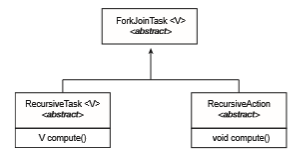

# Implicit Threading

With the continued growth of multicore processing, applications contain- ing hundreds—or even thousands—of threads are looming on the horizon. Designing such applications is not a trivial undertaking: programmers must  

**_THE JVM AND THE HOST OPERATING SYSTEM_**

The JVM is typically implemented on top of a host operating system (see Figure 18.10). This setup allows the JVM to hide the implementation details of the underlying operating system and to provide a consistent, abstract environment that allows Java programs to operate on any platform that supports a JVM. The specification for the JVM does not indicate how Java threads are to bemapped to the underlying operating system, instead leaving that decision to the particular implementation of the JVM. For example, the Windows operating system uses the one-to-one model; therefore, each Java thread for a JVM running on Windows maps to a kernel thread. In addition, there may be a relationship between the Java thread library and the thread library on the host operating system. For example, implementations of a JVM for the Windows family of operating systems might use the Windows API when creating Java threads; Linux andmacOS systemsmight use the Pthreads API.

address not only the challenges outlined in Section 4.2 but additional difficul- ties as well. These difficulties, which relate to program correctness, are covered in Chapter 6 and Chapter 8.

One way to address these difficulties and better support the design of con- current and parallel applications is to transfer the creation and management of threading from application developers to compilers and run-time libraries. This strategy, termed **implicit threading**, is an increasingly popular trend. In this section, we explore four alternative approaches to designing applications that can take advantage of multicore processors through implicit threading. As we shall see, these strategies generally require application developers to identify **_tasks_**—not threads—that can run in parallel. A task is usually writ- ten as a function, which the run-time library then maps to a separate thread, typically using the many-to-many model (Section 4.3.3). The advantage of this approach is that developers only need to identify parallel tasks, and the libraries determine the specific details of thread creation and management.

## Thread Pools

In Section 4.1, we described a multithreaded web server. In this situation, whenever the server receives a request, it creates a separate thread to service the request.Whereas creating a separate thread is certainly superior to creating a separate process, a multithreaded server nonetheless has potential problems. The first issue concerns the amount of time required to create the thread, together with the fact that the thread will be discarded once it has completed its work. The second issue is more troublesome. If we allow each concurrent request to be serviced in a new thread, we have not placed a bound on the number of threads concurrently active in the system. Unlimited threads could exhaust system resources, such as CPU time or memory. One solution to this problem is to use a **thread pool**.  

**_ANDROID THREAD POOLS_**

In Section 3.8.2.1, we covered RPCs in the Android operating system. You may recall from that section that Android uses the Android Interface Defi- nition Language (AIDL), a tool that specifies the remote interface that clients interactwith on the server. AIDLalso provides a thread pool. Aremote service using the thread pool can handlemultiple concurrent requests, servicing each request using a separate thread from the pool.

The general idea behind a thread pool is to create a number of threads at start-up and place them into a pool, where they sit and wait for work. When a server receives a request, rather than creating a thread, it instead submits the request to the thread pool and resumes waiting for additional requests. If there is an available thread in the pool, it is awakened, and the request is serviced immediately. If the pool contains no available thread, the task is queued until one becomes free. Once a thread completes its service, it returns to the pool and awaits more work. Thread pools work well when the tasks submitted to the pool can be executed asynchronously.

Thread pools offer these benefits:

**1\.** Servicing a request with an existing thread is often faster than waiting to create a thread.

**2\.** Athreadpool limits the number of threads that exist at any one point. This is particularly important on systems that cannot support a large number of concurrent threads.

**3\.** Separating the task to be performed from the mechanics of creating the task allows us to use different strategies for running the task. For example, the task could be scheduled to execute after a time delay or to execute periodically.

The number of threads in the pool can be set heuristically based on factors such as the number of CPUs in the system, the amount of physical memory, and the expected number of concurrent client requests. More sophisticated thread- pool architectures can dynamically adjust the number of threads in the pool according to usage patterns. Such architectures provide the further benefit of having a smaller pool—thereby consuming less memory—when the load on the system is low. We discuss one such architecture, Apple’s Grand Central Dispatch, later in this section.

TheWindows API provides several functions related to thread pools. Using the thread pool API is similar to creating a thread with the Thread Create() function, as described in Section 4.4.2. Here, a function that is to run as a separate thread is defined. Such a function may appear as follows:
```
DWORD WINAPI PoolFunction(PVOID Param) { \* this function runs as a separate thread. */

}  
```

A pointer to PoolFunction() is passed to one of the functions in the thread pool API, and a thread from the pool executes this function. One such member in the thread pool API is the QueueUserWorkItem() function, which is passed three parameters:

• LPTHREAD START ROUTINE Function—a pointer to the function that is to run as a separate thread

• PVOID Param—the parameter passed to Function

• ULONG Flags—flags indicating how the thread pool is to create and man- age execution of the thread

An example of invoking a function is the following:

QueueUserWorkItem(&PoolFunction, NULL, 0);

This causes a thread from the thread pool to invoke PoolFunction() on behalf of the programmer. In this instance, we pass no parameters to PoolFunc- tion(). Because we specify 0 as a flag, we provide the thread pool with no special instructions for thread creation.

Other members in the Windows thread pool API include utilities that invoke functions at periodic intervals or when an asynchronous I/O request completes.

### Java Thread Pools

The java.util.concurrent package includes an API for several varieties of thread-pool architectures. Here, we focus on the following three models:

**1\.** Single thread executor—newSingleThreadExecutor()—creates a pool of size 1.

**2\.** Fixed thread executor—newFixedThreadPool(int size)—creates a thread pool with a specified number of threads.

**3\.** Cached thread executor—newCachedThreadPool()—creates an unbounded thread pool, reusing threads in many instances.

We have, in fact, already seen the use of a Java thread pool in Section 4.4.3, wherewe created a newSingleThreadExecutor in the program example shown in Figure 4.14. In that section, we noted that the Java executor frame- work can be used to construct more robust threading tools. We now describe how it can be used to create thread pools.

A thread pool is created using one of the factorymethods in the Executors class:

• static ExecutorService newSingleThreadExecutor()

• static ExecutorService newFixedThreadPool(int size)

• static ExecutorService newCachedThreadPool()

Each of these factorymethods creates and returns an object instance that imple- ments the ExecutorService interface. ExecutorService extends the Execu-  


**Figure 4.15** Creating a thread pool in Java.

tor interface, allowing us to invoke the execute() method on this object. In addition, ExecutorService provides methods for managing termination of the thread pool.

The example shown in Figure 4.15 creates a cached threadpool and submits tasks to be executedby a thread in the pool using the execute()method.When the shutdown()method is invoked, the thread pool rejects additional tasks and shuts down once all existing tasks have completed execution.

## Fork Join

The strategy for thread creation covered in Section 4.4 is often known as the **fork-join** model. Recall that with this method, the main parent thread creates (**_forks_**) one or more child threads and then waits for the children to terminate and **_join_** with it, at which point it can retrieve and combine their results. This synchronous model is often characterized as explicit thread creation, but it is also an excellent candidate for implicit threading. In the latter situation, threads are not constructed directly during the fork stage; rather, parallel tasks are designated. This model is illustrated in Figure 4.16. A library manages the number of threads that are created and is also responsible for assigning tasks to threads. In some ways, this fork-join model is a synchronous version of thread pools in which a library determines the actual number of threads to create— for example, by using the heuristics described in Section 4.5.1.

### Fork Join in Java

Java introduced a fork-join library in Version 1.7 of the API that is designed to be used with recursive divide-and-conquer algorithms such as Quicksort andMergesort.When implementingdivide-and-conquer algorithms using this  

**Figure 4.16** Fork-join parallelism.

library, separate tasks are forked during the divide step and assigned smaller subsets of the original problem. Algorithms must be designed so that these separate tasks can execute concurrently. At some point, the size of the problem assigned to a task is small enough that it can be solved directly and requires creating no additional tasks. The general recursive algorithm behind Java’s fork-join model is shown below:
```
Task(problem) 
 if problem is small enough
    solve the problem directly 
 else

    subtask1 = fork(new Task(subset of problem) 
    subtask2 = fork(new Task(subset of problem)

    result1 = join(subtask1) 
    result2 = join(subtask2)

    return combined results
```
Figure 4.17 depicts the model graphically. We now illustrate Java’s fork-join strategy by designing a divide-and-

conquer algorithm that sums all elements in an array of integers. In Version 1.7 of the API Java introduced a new thread pool—the ForkJoinPool—that can be assigned tasks that inherit the abstract base class ForkJoinTask (which for now we will assume is the SumTask class). The following creates a ForkJoin- Pool object and submits the initial task via its invoke()method:
```
ForkJoinPool pool = new ForkJoinPool(); // array contains the integers to be summed int[] array = new int[SIZE];

SumTask task = new SumTask(0, SIZE - 1, array); int sum = pool.invoke(task);
```
Upon completion, the initial call to invoke() returns the summation of array. The class SumTask—shown in Figure 4.18—implements a divide-and-

conquer algorithm that sums the contents of the array using fork-join. New tasks are created using the fork()method, and the compute()method speci- fies the computation that is performed by each task. The method compute() is invoked until it can directly calculate the sum of the subset it is assigned. The  

**Figure 4.17** Fork-join in Java.

call to join() blocks until the task completes, upon which join() returns the results calculated in compute().

Notice that SumTask in Figure 4.18 extends RecursiveTask. The Java fork- join strategy is organized around the abstract base class ForkJoinTask, and the RecursiveTask and RecursiveAction classes extend this class. The fun- damental difference between these two classes is that RecursiveTask returns a result (via the return value specified in compute()), and RecursiveAction does not return a result. The relationship between the three classes is illustrated in the UML class diagram in Figure 4.19.

An important issue to consider is determining when the problem is “small enough” to be solved directly and no longer requires creating additional tasks. In SumTask, this occurs when the number of elements being summed is less than the value THRESHOLD, which in Figure 4.18we have arbitrarily set to 1,000. In practice, determiningwhen a problem can be solved directly requires careful timing trials, as the value can vary according to implementation.

What is interesting in Java’s fork-join model is the management of tasks wherein the library constructs a pool of worker threads and balances the load of tasks among the available workers. In some situations, there are thousands of tasks, yet only a handful of threads performing the work (for example, a separate thread for each CPU). Additionally, each thread in a ForkJoinPool maintains a queue of tasks that it has forked, and if a thread’s queue is empty, it can steal a task from another thread’s queue using a**_work stealing_** algorithm, thus balancing the workload of tasks among all threads.  

**Figure 4.18** Fork-join calculation using the Java API.

## OpenMP

OpenMP is a set of compiler directives as well as an API for programswritten in C, C++, or FORTRAN that provides support for parallel programming in shared- memory environments. OpenMP identifies **parallel regions** as blocks of code that may run in parallel. Application developers insert compiler directives into their code at parallel regions, and these directives instruct the OpenMP run-  

**Figure 4.19** UML class diagram for Java’s fork-join.

time library to execute the region in parallel. The following C program illus- trates a compiler directive above the parallel region containing the printf() statement:
```
#include _<_omp.h_\>_ #include _<_stdio.h_\>_

int main(int argc, char \*argv\[\]) _{_

/\* sequential code \*/

#pragma omp parallel _{_

printf("I am a parallel region."); _}_

/\* sequential code \*/

return 0; _}_
```
When OpenMP encounters the directive
```
#pragma omp parallel
```
it creates as many threads as there are processing cores in the system. Thus, for a dual-core system, two threads are created; for a quad-core system, four are created; and so forth. All the threads then simultaneously execute the parallel region. As each thread exits the parallel region, it is terminated.

OpenMP provides several additional directives for running code regions in parallel, including parallelizing loops. For example, assume we have two arrays, a and b, of size N. We wish to sum their contents and place the results  

in array c. We can have this task run in parallel by using the following code segment, which contains the compiler directive for parallelizing for loops:
```
pragma omp parallel for for (i = 0; i < N; i++) _{_
c[i] = a[i] + b[i]; _}_
```
OpenMP divides the work contained in the for loop among the threads it has created in response to the directive 
```
#pragma omp parallel for
```
In addition to providing directives for parallelization, OpenMP allows developers to choose among several levels of parallelism. For example, they can set the number of threads manually. It also allows developers to identify whether data are shared between threads or are private to a thread. OpenMP is available on several open-source and commercial compilers for Linux, Win- dows, and macOS systems. We encourage readers interested in learning more about OpenMP to consult the bibliography at the end of the chapter.

## Grand Central Dispatch

Grand Central Dispatch (GCD) is a technology developed by Apple for its macOS and iOS operating systems. It is a combination of a run-time library, an API, and language extensions that allow developers to identify sections of code (**_tasks_**) to run in parallel. Like OpenMP, GCD manages most of the details of threading.

GCD schedules tasks for run-time execution by placing them on a **dispatch queue**. When it removes a task from a queue, it assigns the task to an available thread from a pool of threads that it manages. GCD identifies two types of dispatch queues: **_serial_** and **_concurrent_**.

Tasks placed on a serial queue are removed in FIFO order. Once a task has been removed from the queue, it must complete execution before another task is removed. Each process has its own serial queue (known as its **main queue**), and developers can create additional serial queues that are local to a particular process. (This is why serial queues are also known as **_private dispatch queues_**.) Serial queues are useful for ensuring the sequential execution of several tasks.

Tasks placed on a concurrent queue are also removed in FIFO order, but several tasksmay be removed at a time, thus allowingmultiple tasks to execute in parallel. There are several system-wide concurrent queues (also known as **_global dispatch queues_**), which are divided into four primary quality-of-service classes:

• QOS CLASS USER INTERACTIVE—The **user-interactive** class represents tasks that interact with the user, such as the user interface and event handling, to ensure a responsive user interface. Completing a task belonging to this class should require only a small amount of work.

• QOS CLASS USER INITIATED—The **user-initiated** class is similar to the user-interactive class in that tasks are associated with a responsive user interface; however, user-initiated tasks may require longer processing times. Opening a file or a URL is a user-initiated task, for example. Tasks belonging to this class must be completed for the user to continue inter- acting with the system, but they do not need to be serviced as quickly as tasks in the user-interactive queue.

• QOS CLASS UTILITY —The **utility** class represents tasks that require a longer time to complete but do not demand immediate results. This class includes work such as importing data.

• QOS CLASS BACKGROUND —Tasks belonging to the **background** class are not visible to the user and are not time sensitive. Examples include index- ing a mailbox system and performing backups.

Tasks submitted to dispatch queues may be expressed in one of two different ways:

**1\.** For the C, C++, and Objective-C languages, GCD identifies a language extension known as a **block**, which is simply a self-contained unit of work. A block is specified by a caret ˆ inserted in front of a pair of braces _{ }_. Code within the braces identifies the unit of work to be performed. A simple example of a block is shown below:

^_{_ printf("I am a block"); _}_

**2\.** For the Swift programming language, a task is defined using a **_closure_**, which is similar to a block in that it expresses a self-contained unit of functionality. Syntactically, a Swift closure is written in the same way as a block, minus the leading caret.

The following Swift code segment illustrates obtaining a concurrent queue for the user-initiated class and submitting a task to the queue using the dispatch async() function:
```
let queue = dispatch get global queue (QOS CLASS USER INITIATED, 0)

dispatch async(queue,_{_ print("I am a closure.") _}_)
```
Internally, GCD’s thread pool is composed of POSIX threads. GCD actively manages the pool, allowing the number of threads to grow and shrink accord- ing to application demand and system capacity. GCD is implemented by the libdispatch library, which Apple has released under the Apache Commons license. It has since been ported to the FreeBSD operating system.

## Intel Thread Building Blocks

Intel threading building blocks (TBB) is a template library that supports design- ing parallel applications in C++. As this is a library, it requires no special compiler or language support. Developers specify tasks that can run in parallel, and the TBB task scheduler maps these tasks onto underlying threads. Furthermore, the task scheduler provides load balancing and is cache aware, meaning that it will give precedence to tasks that likely have their data stored in cache memory and thus will execute more quickly. TBB provides a rich set of features, including templates for parallel loop structures, atomic operations, and mutual exclusion locking. In addition, it provides concurrent data struc- tures, including a hash map, queue, and vector, which can serve as equivalent thread-safe versions of the C++ standard template library data structures.

Let’s use parallel for loops as an example. Initially, assume there is a func- tion named apply(float value) that performs an operation on the parameter value. If we had an array v of size n containing float values, we could use the following serial for loop to pass each value in v to the apply() function:
```
for (int i = 0; i < n; i++) { apply(v[i]);
}
```
A developer could manually apply data parallelism (Section 4.2.2) on a multicore system by assigning different regions of the array v to each pro- cessing core; however, this ties the technique for achieving parallelism closely to the physical hardware, and the algorithm would have to be modified and recompiled for the number of processing cores on each specific architecture.

Alternatively, a developer could use TBB, which provides a parallel for template that expects two values:

parallel for (**_range body_** )

where **_range_** refers to the range of elements that will be iterated (known as the **iteration space**) and **_body_** specifies an operation that will be performed on a subrange of elements.

We can now rewrite the above serial for loop using the TBB parallel for template as follows:
```
parallel for (size t(0), n, \[=\](size t i) _{_apply(v\[i\]);_}_);
```
The first two parameters specify that the iteration space is from 0 to _n_−1 (which corresponds to the number of elements in the array v). The second parameter is a C++ lambda function that requires a bit of explanation. The expression \[=\](size t i) is the parameter i, which assumes each of the values over the iteration space (in this case from 0 to �� − 1). Each value of i is used to identify which array element in v is to be passed as a parameter to the apply(v[i]) function.

The TBB library will divide the loop iterations into separate “chunks” and create a number of tasks that operate on those chunks. (The parallel for function allows developers to manually specify the size of the chunks if they wish to.) TBB will also create a number of threads and assign tasks to available threads. This is quite similar to the fork-join library in Java. The advantage of this approach is that it requires only that developers identify what operations can run in parallel (by specifying a parallel for loop), and the library manages the details involved in dividing the work into separate tasks that run in parallel. Intel TBB has both commercial and open-source versions that run on Windows, Linux, and macOS. Refer to the bibliography for further details on how to develop parallel applications using TBB.