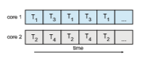
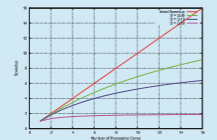
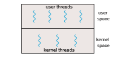

# Multicore Programming

Earlier in the history of computer design, in response to the need for more computing performance, single-CPU systems evolved into multi-CPU systems. A later, yet similar, trend in system design is to place multiple computing cores on a single processing chip where each core appears as a separate CPU to the operating system (Section 1.3.2). We refer to such systems as **multicore**, and multithreaded programming provides a mechanism for more efficient use of these multiple computing cores and improved concurrency. Consider an application with four threads. On a system with a single computing core, concurrency merelymeans that the execution of the threads will be interleaved over time (Figure 4.3), because the processing core is capable of executing only one thread at a time. On a system with multiple cores, however, concurrency  

**Figure 4.3** Concurrent execution on a single-core system.

means that some threads can run in parallel, because the system can assign a separate thread to each core (Figure 4.4).

Notice the distinction between **_concurrency_** and **_parallelism_** in this discus- sion. Aconcurrent system supportsmore than one task by allowing all the tasks tomake progress. In contrast, a parallel system can performmore than one task simultaneously. Thus, it is possible to have concurrency without parallelism. Before the advent of multiprocessor and multicore architectures, most com- puter systems had only a single processor, and CPU schedulers were designed to provide the illusion of parallelism by rapidly switching between processes, thereby allowing each process to make progress. Such processes were running concurrently, but not in parallel.

## Programming Challenges

The trend toward multicore systems continues to place pressure on system designers and application programmers to make better use of the multiple computing cores. Designers of operating systems must write scheduling algo- rithms that usemultiple processing cores to allow the parallel execution shown in Figure 4.4. For application programmers, the challenge is to modify existing programs as well as design new programs that are multithreaded.

In general, five areas present challenges in programming for multicore systems:

**1\. Identifying tasks**. This involves examining applications to find areas that can be divided into separate, concurrent tasks. Ideally, tasks are independent of one another and thus can run in parallel on individual cores.

**2\. Balance**. While identifying tasks that can run in parallel, programmers must also ensure that the tasks perform equal work of equal value. In some instances, a certain task may not contribute as much value to the overall process as other tasks. Using a separate execution core to run that task may not be worth the cost.

**Figure 4.4** Parallel execution on a multicore system.  

**_AMDAHL’S LAW_**

Amdahl’s Law is a formula that identifies potential performance gains from adding additional computing cores to an application that has both serial (nonparallel) and parallel components. If _S_ is the portion of the application that must be performed serially on a system with _N_ processing cores, the formula appears as follows:

_speedup_ ≤ 1

_S_ \+ (1−_S_) _N_

As an example, assume we have an application that is 75 percent parallel and 25 percent serial. If we run this application on a system with two processing cores, we can get a speedup of 1.6 times. If we add two additional cores (for a total of four), the speedup is 2.28 times. Below is a graph illustrating Amdahl’s Law in several different scenarios.

One interesting fact about Amdahl’s Law is that as _N_ approaches infinity, the speedup converges to 1∕_S_. For example, if 50 percent of an application is performed serially, the maximum speedup is 2.0 times, regardless of the number of processing coreswe add. This is the fundamental principle behind Amdahl’s Law: the serial portion of an application can have a dispropor- tionate effect on the performance we gain by adding additional computing cores.

**3\. Data splitting**. Just as applications are divided into separate tasks, the data accessed and manipulated by the tasks must be divided to run on separate cores.

**4\. Data dependency**. The data accessed by the tasks must be examined for dependencies between two or more tasks. When one task depends on data from another, programmers must ensure that the execution of the tasks is synchronized to accommodate the data dependency. We examine such strategies in Chapter 6.  

**Figure 4.5** Data and task parallelism.

**5\. Testing and debugging**. When a program is running in parallel on multi- ple cores,many different execution paths are possible. Testing and debug- ging such concurrent programs is inherently more difficult than testing and debugging single-threaded applications.

Because of these challenges,many software developers argue that the advent of multicore systems will require an entirely new approach to designing software systems in the future. (Similarly,many computer science educators believe that software development must be taught with increased emphasis on parallel programming.)

## Types of Parallelism

In general, there are two types of parallelism: data parallelism and task par- allelism. **Data parallelism** focuses on distributing subsets of the same data across multiple computing cores and performing the same operation on each core. Consider, for example, summing the contents of an array of size _N_. On a single-core system, one thread would simply sum the elements [0] . . . [_N_ − 1]. On a dual-core system, however, thread _A_, running on core 0, could sum the elements [0] . . . [_N_ ∕2 − 1] while thread _B_, running on core 1, could sum the elements [_N_ ∕2] . . . [_N_ − 1]. The two threads would be running in parallel on separate computing cores.

**Task parallelism** involves distributing not data but tasks (threads) across multiple computing cores. Each thread is performing a unique operation. Dif- ferent threads may be operating on the same data, or theymay be operating on different data. Consider again our example above. In contrast to that situation, an example of task parallelism might involve two threads, each performing a unique statistical operation on the array of elements. The threads again are operating in parallel on separate computing cores, but each is performing a unique operation.

Fundamentally, then, data parallelism involves the distribution of data across multiple cores, and task parallelism involves the distribution of tasks across multiple cores, as shown in Figure 4.5. However, data and task paral-  

**Figure 4.6** User and kernel threads.

lelism are not mutually exclusive, and an application may in fact use a hybrid of these two strategies.