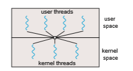

# Multithreading Models

Our discussion so far has treated threads in a generic sense. However, support for threads may be provided either at the user level, for **user threads**, or by the kernel, for **kernel threads**. User threads are supported above the kernel and are managed without kernel support, whereas kernel threads are supported and managed directly by the operating system. Virtually all contemporary operating systems—including Windows, Linux, and macOS— support kernel threads.

Ultimately, a relationship must exist between user threads and kernel threads, as illustrated in Figure 4.6. In this section, we look at three common ways of establishing such a relationship: the many-to-one model, the one-to- one model, and the many-to-many model.

### Many-to-One Model

The many-to-one model (Figure 4.7) maps many user-level threads to one kernel thread. Thread management is done by the thread library in user space, so it is efficient (we discuss thread libraries in Section 4.4). However, the entire process will block if a thread makes a blocking system call. Also, because only

**Figure 4.7** Many-to-one model.  

**Figure 4.8** One-to-one model.

one thread can access the kernel at a time, multiple threads are unable to run in parallel on multicore systems. **Green threads**—a thread library available for Solaris systems and adopted in early versions of Java—used the many-to- one model. However, very few systems continue to use the model because of its inability to take advantage of multiple processing cores, which have now become standard on most computer systems.

### One-to-One Model

The one-to-one model (Figure 4.8) maps each user thread to a kernel thread. It provides more concurrency than the many-to-one model by allowing another thread to run when a thread makes a blocking system call. It also allows mul- tiple threads to run in parallel on multiprocessors. The only drawback to this model is that creating a user thread requires creating the corresponding kernel thread, and a large number of kernel threads may burden the performance of a system. Linux, along with the family of Windows operating systems, imple- ment the one-to-one model.

### Many-to-Many Model

The many-to-many model (Figure 4.9) multiplexes many user-level threads to a smaller or equal number of kernel threads. The number of kernel threads may be specific to either a particular application or a particular machine (an application may be allocated more kernel threads on a system with eight processing cores than a system with four cores).

**Figure 4.9** Many-to-many model.  

**Figure 4.10** Two-level model.

Let’s consider the effect of this design on concurrency. Whereas the many- to-one model allows the developer to create as many user threads as she wishes, it does not result in parallelism, because the kernel can schedule only one kernel thread at a time. The one-to-one model allows greater concurrency, but the developer has to be careful not to create too many threads within an application. (In fact, on some systems, she may be limited in the number of threads she can create.) The many-to-many model suffers from neither of these shortcomings: developers can create as many user threads as necessary, and the corresponding kernel threads can run in parallel on a multiprocessor. Also, when a thread performs a blocking system call, the kernel can schedule another thread for execution.

One variation on the many-to-many model still multiplexes many user- level threads to a smaller or equal number of kernel threads but also allows a user-level thread to be bound to a kernel thread. This variation is sometimes referred to as the **two-level model** (Figure 4.10).

Although the many-to-many model appears to be the most flexible of the models discussed, in practice it is difficult to implement. In addition, with an increasing number of processing cores appearing on most systems, limiting the number of kernel threads has become less important. As a result, most operating systems now use the one-to-one model. However, as we shall see in Section 4.5, some contemporary concurrency libraries have developers identify tasks that are then mapped to threads using the many-to-many model.