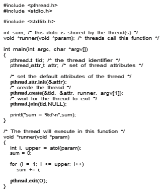
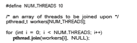

# Thread Libraries

A **thread library** provides the programmer with an API for creating and man- aging threads. There are two primary ways of implementing a thread library. The first approach is to provide a library entirely in user space with no kernel support. All code and data structures for the library exist in user space. This means that invoking a function in the library results in a local function call in user space and not a system call.

The second approach is to implement a kernel-level library supported directly by the operating system. In this case, code and data structures for the library exist in kernel space. Invoking a function in the API for the library typically results in a system call to the kernel.  

Three main thread libraries are in use today: POSIX Pthreads,Windows, and Java. Pthreads, the threads extension of the POSIX standard, may be provided as either a user-level or a kernel-level library. The Windows thread library is a kernel-level library available on Windows systems. The Java thread API allows threads to be created andmanaged directly in Java programs. However, because inmost instances the JVM is running on top of a host operating system, the Java thread API is generally implemented using a thread library available on the host system. Thismeans that onWindows systems, Java threads are typ- ically implemented using the Windows API; UNIX, Linux, and macOS systems typically use Pthreads.

For POSIX and Windows threading, any data declared globally—that is, declared outside of any function—are shared among all threads belonging to the same process. Because Java has no equivalent notion of global data, access to shared data must be explicitly arranged between threads.

In the remainder of this section, we describe basic thread creation using these three thread libraries. As an illustrative example, we design a multi- threaded program that performs the summation of a non-negative integer in a separate thread using the well-known summation function:

          N
    sum = ∑i
         i=1 

For example, if _N_ were 5, this function would represent the summation of integers from 1 to 5, which is 15. Each of the three programs will be run with the upper bounds of the summation entered on the command line. Thus, if the user enters 8, the summation of the integer values from 1 to 8 will be output.

Before we proceed with our examples of thread creation, we introduce two general strategies for creating multiple threads: **asynchronous threading** and **synchronous threading**. With asynchronous threading, once the parent creates a child thread, the parent resumes its execution, so that the parent and child execute concurrently and independently of one another. Because the threads are independent, there is typically little data sharing between them.Asynchronous threading is the strategy used in themultithreaded server illustrated in Figure 4.2 and is also commonly used for designing responsive user interfaces.

Synchronous threading occurs when the parent thread creates one or more children and thenmustwait for all of its children to terminate before it resumes. Here, the threads created by the parent perform work concurrently, but the parent cannot continue until this work has been completed. Once each thread has finished itswork, it terminates and joinswith its parent. Only after all of the children have joined can the parent resume execution. Typically, synchronous threading involves significant data sharing among threads. For example, the parent thread may combine the results calculated by its various children. All of the following examples use synchronous threading.

## Pthreads

**Pthreads** refers to the POSIX standard (IEEE 1003.1c) defining an API for thread creation and synchronization. This is a **_specification_** for thread behavior, not an **_implementation_**. Operating-systemdesignersmay implement the specification  


**Figure 4.11** Multithreaded C program using the Pthreads API.

in any way they wish. Numerous systems implement the Pthreads specifica- tion; most are UNIX-type systems, including Linux and macOS. AlthoughWin- dows doesn’t support Pthreads natively, some third-party implementations for Windows are available.

The C program shown in Figure 4.11 demonstrates the basic Pthreads API for constructing a multithreaded program that calculates the summation of a non-negative integer in a separate thread. In a Pthreads program, separate threads begin execution in a specified function. In Figure 4.11, this is the run- ner() function. When this program begins, a single thread of control begins in  

**Figure 4.12** Pthread code for joining ten threads.

main(). After some initialization, main() creates a second thread that begins control in the runner() function. Both threads share the global data sum.

Let’s look more closely at this program. All Pthreads programs must include the pthread.h header file. The statement pthread t tid declares the identifier for the thread we will create. Each thread has a set of attributes, including stack size and scheduling information. The pthread attr t attr declaration represents the attributes for the thread. We set the attributes in the function call pthread attr init(&attr). Because we did not explicitly set any attributes, we use the default attributes provided. (In Chapter 5, we discuss some of the scheduling attributes provided by the Pthreads API.) A separate thread is created with the pthread create() function call. In addi- tion to passing the thread identifier and the attributes for the thread, we also pass the name of the function where the new thread will begin execution—in this case, the runner() function. Last, we pass the integer parameter that was provided on the command line, argv[1].

At this point, the program has two threads: the initial (or parent) thread in main() and the summation (or child) thread performing the summation oper- ation in the runner() function. This program follows the thread create/join strategy, whereby after creating the summation thread, the parent thread will wait for it to terminate by calling the pthread join() function. The summa- tion threadwill terminatewhen it calls the function pthread exit(). Once the summation thread has returned, the parent thread will output the value of the shared data sum.

This example program creates only a single thread. With the growing dominance of multicore systems, writing programs containing several threads has become increasingly common. A simple method for waiting on several threads using the pthread join() function is to enclose the operation within a simple for loop. For example, you can join on ten threads using the Pthread code shown in Figure 4.12.

## Windows Threads

The technique for creating threads using theWindows thread library is similar to the Pthreads technique in several ways. We illustrate the Windows thread API in the C program shown in Figure 4.13. Notice that we must include the windows.h header file when using the Windows API.  


**Figure 4.13** Multithreaded C program using the Windows API.

Just as in the Pthreads version shown in Figure 4.11, data shared by the separate threads—in this case, Sum—are declared globally (the DWORD data type is an unsigned 32-bit integer). We also define the Summation() function that is to be performed in a separate thread. This function is passed a pointer to a void, which Windows defines as LPVOID. The thread performing this function sets the global data Sum to the value of the summation from 0 to the parameter passed to Summation().  

Threads are created in the Windows API using the CreateThread() func- tion, and—just as in Pthreads—a set of attributes for the thread is passed to this function. These attributes include security information, the size of the stack, and a flag that can be set to indicate if the thread is to start in a suspended state. In this program, we use the default values for these attributes. (The default values do not initially set the thread to a suspended state and instead make it eligible to be run by the CPU scheduler.) Once the summation thread is created, the parent must wait for it to complete before outputting the value of Sum, as the value is set by the summation thread. Recall that the Pthread program (Figure 4.11) had the parent thread wait for the summation thread using the pthread join() statement. We perform the equivalent of this in the Windows API using the WaitForSingleObject() function, which causes the creating thread to block until the summation thread has exited.

In situations that require waiting for multiple threads to complete, the WaitForMultipleObjects() function is used. This function is passed four parameters:

**1\.** The number of objects to wait for

**2\.** Apointer to the array of objects

**3\.** Aflag indicating whether all objects have been signaled

**4\.** A timeout duration (or INFINITE)

For example, if THandles is an array of thread HANDLE objects of size N, the parent thread can wait for all its child threads to complete with this statement:

WaitForMultipleObjects(N, THandles, TRUE, INFINITE);

## Java Threads

Threads are the fundamental model of program execution in a Java program, and the Java language and its API provide a rich set of features for the creation and management of threads. All Java programs comprise at least a single thread of control—even a simple Java program consisting of only a main() method runs as a single thread in the JVM. Java threads are available on any system that provides a JVM including Windows, Linux, and macOS. The Java thread API is available for Android applications as well.

There are two techniques for explicitly creating threads in a Java program. One approach is to create a new class that is derived from the Thread class and to override its run()method. An alternative—and more commonly used —technique is to define a class that implements the Runnable interface. This interface defines a single abstract method with the signature public void run(). The code in the run() method of a class that implements Runnable is what executes in a separate thread. An example is shown below:
```
class Task implements Runnable {

public void **run**() { System.out.println("I am a thread.");

} }  
```
**_LAMBDAEXPRESSIONS IN JAVA_**

Beginning with Version 1.8 of the language, Java introduced Lambda expres- sions, which allow a much cleaner syntax for creating threads. Rather than defining a separate class that implements Runnable, a Lambda expression can be used instead:
```
Runnable task = () -> { System.out.println("I am a thread.");

};

Thread worker = new Thread(task); worker.start();
```
Lambda expressions—as well as similar functions known as **closures**—are a prominent feature of functional programming languages and have been available in several nonfunctional languages as well including Python, C++, and C#. As we shall see in later examples in this chapter, Lamdba expressions often provide a simple syntax for developing parallel applications.

Thread creation in Java involves creating a Thread object and passing it an instance of a class that implements Runnable, followed by invoking the start()method on the Thread object. This appears in the following example:

Thread worker = new Thread(new Task()); worker.**start**();

Invoking the start()method for the new Thread object does two things:

**1\.** It allocates memory and initializes a new thread in the JVM.

**2\.** It calls the run()method,making the thread eligible to be run by the JVM. (Note again that we never call the run()method directly. Rather, we call the start()method, and it calls the run()method on our behalf.)

Recall that the parent threads in the Pthreads and Windows libraries use pthread join() and WaitForSingleObject() (respectively) to wait for the summation threads to finish before proceeding. The join() method in Java provides similar functionality. (Notice that join() can throw an Interrupt- edException, which we choose to ignore.)
```
try { worker.**join**();

} catch (InterruptedException ie) { }
```
If the parent must wait for several threads to finish, the join()method can be enclosed in a for loop similar to that shown for Pthreads in Figure 4.12.  


### Java Executor Framework

Java has supported thread creation using the approachwe have described thus far since its origins. However, beginning with Version 1.5 and its API, Java introduced several new concurrency features that provide developers with much greater control over thread creation and communication. These tools are available in the java.util.concurrent package.

Rather than explicitly creating Thread objects, thread creation is instead organized around the Executor interface:
```
public interface Executor {

void execute(Runnable command); }
```
Classes implementing this interfacemust define the execute()method,which is passed a Runnable object. For Java developers, this means using the Execu- tor rather than creating a separate Thread object and invoking its start() method. The Executor is used as follows:
```
Executor service = new _Executor_; 
service.execute(new Task());
```
The Executor framework is based on the producer-consumermodel; tasks implementing the Runnable interface are produced, and the threads that exe- cute these tasks consume them. The advantage of this approach is that it not only divides thread creation from execution but also provides a mechanism for communication between concurrent tasks.

Data sharing between threads belonging to the same process occurs easily in Windows and Pthreads, since shared data are simply declared globally. As a pure object-oriented language, Java has no such notion of global data. We can pass parameters to a class that implements Runnable, but Java threads cannot return results. To address this need, the java.util.concurrent pack- age additionally defines the Callable interface, which behaves similarly to Runnable except that a result can be returned. Results returned from Callable tasks are known as Future objects. A result can be retrieved from the get() method defined in the Future interface. The program shown in Figure 4.14 illustrates the summation program using these Java features.

The Summation class implements the Callable interface, which specifies the method V call()—it is the code in this call() method that is executed in a separate thread. To execute this code, we create a newSingleThreadEx- ecutor object (provided as a static method in the Executors class), which is of type ExecutorService, and pass it a Callable task using its submit() method. (The primary difference between the execute() and submit()meth- ods is that the former returns no result, whereas the latter returns a result as a Future.) Once we submit the callable task to the thread, we wait for its result by calling the get()method of the Future object it returns.

It is quite easy to notice at first that this model of thread creation appears more complicated than simply creating a thread and joining on its termination. However, incurring this modest degree of complication confers benefits. Aswe have seen, using Callable and Future allows for threads to return results.  

**Figure 4.14** Illustration of Java Executor framework API.

Additionally, this approach separates the creation of threads from the results they produce: rather than waiting for a thread to terminate before retrieving results, the parent instead onlywaits for the results to become available. Finally, as we shall see in Section 4.5.1, this framework can be combined with other features to create robust tools for managing a large number of threads.