  

Part Two

_Process Management_

A _process_ is a program in execution. A process will need certain resources—such as CPU time, memory, files, and I/O devices—to accomplish its task. These resources are typically allocated to the process while it is executing.

A process is the unit of work in most systems. Systems consist of a collection of processes: operating-system processes execute system code, and user processes execute user code. All these processes may execute concurrently.

Modern operating systems support processes having multiple _threads_ of control. On systems with multiple hardware processing cores, these threads can run in parallel.

One of the most important aspects of an operating system is how it schedules threads onto available processing cores. Several choices for designing CPU schedulers are available to programmers.  

_3_**CHAPTER**
# Processes

Early computers allowed only one program to be executed at a time. This pro- gram had complete control of the system and had access to all the system’s resources. In contrast, contemporary computer systems allow multiple pro- grams to be loaded into memory and executed concurrently. This evolution required firmer control and more compartmentalization of the various pro- grams; and these needs resulted in the notion of a **process**, which is a program in execution. A process is the unit of work in a modern computing system.

The more complex the operating system is, the more it is expected to do on behalf of its users. Although itsmain concern is the execution of user programs, it also needs to take care of various system tasks that are best done in user space, rather than within the kernel. A system therefore consists of a collection of processes, some executing user code, others executing operating system code. Potentially, all these processes can execute concurrently, with the CPU (or CPUs) multiplexed among them. In this chapter, you will read about what processes are, how they are represented in an operating system, and how they work.

**CHAPTER OBJECTIVES**

• Identify the separate components of a process and illustrate how they are represented and scheduled in an operating system.

• Describe how processes are created and terminated in an operating sys- tem, including developing programs using the appropriate system calls that perform these operations.

• Describe and contrast interprocess communication using shared memory and message passing.

• Design programs that use pipes and POSIX shared memory to perform interprocess communication.

• Describe client–server communication using sockets and remote proce- dure calls.

• Design kernel modules that interact with the Linux operating system.

## Process Concept

A question that arises in discussing operating systems involves what to call all the CPU activities. Early computers were batch systems that executed **jobs**, followed by the emergence of time-shared systems that ran **user programs**, or **tasks**. Even on a single-user system, a usermay be able to run several programs at one time: a word processor, a web browser, and an e-mail package. And even if a computer can execute only one program at a time, such as on an embedded device that does not support multitasking, the operating system may need to support its own internal programmed activities, such asmemorymanagement. Inmany respects, all these activities are similar, sowe call all of them**processes**.

Although we personally prefer the more contemporary term **_process_**, the term **_job_** has historical significance, as much of operating system theory and terminologywas developedduring a timewhen themajor activity of operating systems was job processing. Therefore, in some appropriate instances we use **_job_**when describing the role of the operating system. As an example, it would be misleading to avoid the use of commonly accepted terms that include the word **_job_** (such as **_job scheduling_**) simply because **_process_** has superseded **_job._**

### The Process

Informally, asmentioned earlier, a process is a program in execution. The status of the current activity of a process is represented by the value of the **program counter** and the contents of the processor’s registers. The memory layout of a process is typically divided into multiple sections, and is shown in Figure 3.1. These sections include:

• **Text section**—the executable code

• **Data section**—global variables

**Figure 3.1** Layout of a process in memory.  

• **Heap section**—memory that is dynamically allocated during program run time

• **Stack section**—temporary data storage when invoking functions (such as function parameters, return addresses, and local variables)

Notice that the sizes of the text and data sections are fixed, as their sizes do not change during program run time.However, the stack and heap sections can shrink and grow dynamically during program execution. Each time a function is called, an **activation record** containing function parameters, local variables, and the return address is pushed onto the stack; when control is returned from the function, the activation record is popped from the stack. Similarly, the heap will grow as memory is dynamically allocated, and will shrink when memory is returned to the system. Although the stack and heap sections grow **_toward_** one another, the operating systemmust ensure theydonot**_overlap_** one another.

We emphasize that a program by itself is not a process. A program is a **_passive_** entity, such as a file containing a list of instructions stored on disk (often called an **executable fil** ). In contrast, a process is an **_active_** entity, with a program counter specifying the next instruction to execute and a set of associated resources. A program becomes a process when an executable file is loaded into memory. Two common techniques for loading executable files are double-clicking an icon representing the executable file and entering the name of the executable file on the command line (as in prog.exe or a.out).

Although two processes may be associated with the same program, they are nevertheless considered two separate execution sequences. For instance, several users may be running different copies of the mail program, or the same user may invoke many copies of the web browser program. Each of these is a separate process; and although the text sections are equivalent, the data, heap, and stack sections vary. It is also common to have a process that spawns many processes as it runs. We discuss such matters in Section 3.4.

Note that a process can itself be an execution environment for other code. The Java programming environment provides a good example. In most cir- cumstances, an executable Java program is executed within the Java virtual machine (JVM). The JVM executes as a process that interprets the loaded Java code and takes actions (via native machine instructions) on behalf of that code. For example, to run the compiled Java program Program.class, we would enter

**java Program**

The command java runs the JVM as an ordinary process, which in turns executes the Java program Program in the virtual machine. The concept is the same as simulation, except that the code, instead of beingwritten for a different instruction set, is written in the Java language.

### Process State

As a process executes, it changes **state**. The state of a process is defined in part by the current activity of that process. Aprocess may be in one of the following states:  

**_MEMORY LAYOUT OF AC PROGRAM_**

The figure shown below illustrates the layout of a C program in memory, highlighting how the different sections of a process relate to an actual C program. This figure is similar to the general concept of a process in memory as shown in Figure 3.1, with a few differences:

• The global data section is divided into different sections for (a) initialized data and (b) uninitialized data.

• Aseparate section is provided for the argc and argv parameters passed to the main() function.
```
#include <stdio.h> #include <stdlib.h>

int x; int y = 15;

int main(int argc, char \*argv\[\]) { int \*values; int i;

values = (int \*)malloc(sizeof(int)\*5);

for(i = 0; i < 5; i++) values\[i\] = i;

return 0; }
```

The GNU size command can be used to determine the size (in bytes) of some of these sections. Assuming the name of the executable file of the above C program is memory, the following is the output generated by entering the command size memory:

text data bss dec hex filename 1158 284 8 1450 5aa memory

The data field refers to uninitialized data, and bss refers to initialized data. (bss is a historical term referring to **_block started by symbol_**.) The dec and hex values are the sum of the three sections represented in decimal and hexadecimal, respectively.

• **New**. The process is being created.

• **Running**. Instructions are being executed.

• **Waiting**. The process is waiting for some event to occur (such as an I/O completion or reception of a signal).

• **Ready**. The process is waiting to be assigned to a processor.  
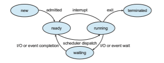

**Figure 3.2** Diagram of process state.

• **Terminated**. The process has finished execution.

These names are arbitrary, and they vary across operating systems. The states that they represent are found on all systems, however. Certain operating sys- tems also more finely delineate process states. It is important to realize that only one process can be _running_ on any processor core at any instant. Many processesmay be _ready_ and_waiting,_ however. The state diagram corresponding to these states is presented in Figure 3.2.

### Process Control Block

Each process is represented in the operating system by a **process control block** (**PCB**)—also called a **task control block**. A PCB is shown in Figure 3.3. It contains many pieces of information associated with a specific process, including these:

• **Process state**. The state may be new, ready, running, waiting, halted, and so on.

• **Program counter**. The counter indicates the address of the next instruction to be executed for this process.


**Figure 3.3** Process control block (PCB).  

• **CPU registers**. The registers vary in number and type, depending on the computer architecture. They include accumulators, index registers, stack pointers, and general-purpose registers, plus any condition-code informa- tion. Alongwith the program counter, this state informationmust be saved when an interrupt occurs, to allow the process to be continued correctly afterward when it is rescheduled to run.

• **CPU-scheduling information**. This information includes a process prior- ity, pointers to scheduling queues, and any other scheduling parameters. (Chapter 5 describes process scheduling.)

• **Memory-management information**. This information may include such items as the value of the base and limit registers and the page tables, or the segment tables, depending on the memory system used by the operating system (Chapter 9).

• **Accounting information**. This information includes the amount of CPU and real time used, time limits, account numbers, job or process numbers, and so on.

• **I/O status information**. This information includes the list of I/O devices allocated to the process, a list of open files, and so on.

In brief, the PCB simply serves as the repository for all the data needed to start, or restart, a process, along with some accounting data.

### Threads

The processmodel discussed so far has implied that a process is a program that performs a single **thread** of execution. For example, when a process is running a word-processor program, a single thread of instructions is being executed. This single thread of control allows the process to perform only one task at a time. Thus, the user cannot simultaneously type in characters and run the spell checker. Most modern operating systems have extended the process concept to allow a process to have multiple threads of execution and thus to perform more than one task at a time. This feature is especially beneficial on multicore systems, where multiple threads can run in parallel. A multithreaded word processor could, for example, assign one thread to manage user input while another thread runs the spell checker. On systems that support threads, the PCB is expanded to include information for each thread. Other changes throughout the system are also needed to support threads. Chapter 4 explores threads in detail.

## Process Scheduling

The objective ofmultiprogramming is to have someprocess running at all times so as to maximize CPU utilization. The objective of time sharing is to switch a CPU core among processes so frequently that users can interact with each program while it is running. To meet these objectives, the **process scheduler** selects an available process (possibly from a set of several available processes) for program execution on a core. Each CPU core can run one process at a time.  

**_PROCESS REPRESENTATION IN LINUX_**

The process control block in the Linux operating system is rep- resented by the C structure task struct, which is found in the <include/linux/sched.h> include file in the kernel source-code directory. This structure contains all the necessary information for representing a process, including the state of the process, scheduling and memory-management information, list of open files, and pointers to the process’s parent and a list of its children and siblings. (A process’s **parent** is the process that created it; its **children** are any processes that it creates. Its **siblings** are children with the same parent process.) Some of these fields include:

long state; /\* state of the process \*/ struct sched entity se; /\* scheduling information \*/ struct task struct \*parent; /\* this process’s parent \*/ struct list head children; /\* this process’s children \*/ struct files struct \*files; /\* list of open files \*/ struct mm struct \*mm; /\* address space \*/

For example, the state of a process is represented by the field long state in this structure. Within the Linux kernel, all active processes are represented using a doubly linked list of task struct. The kernel maintains a pointer– current–to the process currently executing on the system, as shown below:


As an illustration of how the kernel might manipulate one of the fields in the task struct for a specified process, let’s assume the system would like to change the state of the process currently running to the value new state. If current is a pointer to the process currently executing, its state is changed with the following:

current->state = new state;

For a system with a single CPU core, there will never be more than one process running at a time, whereas a multicore system can run multiple processes at one time. If there are more processes than cores, excess processes will have  

**Figure 3.4** The ready queue and wait queues.

to wait until a core is free and can be rescheduled. The number of processes currently in memory is known as the **degree of multiprogramming**.

Balancing the objectives of multiprogramming and time sharing also requires taking the general behavior of a process into account. In general, most processes can be described as either I/O bound or CPU bound. An **I/O-bound process** is one that spends more of its time doing I/O than it spends doing computations. A **CPU-bound process**, in contrast, generates I/O requests infrequently, using more of its time doing computations.

### Scheduling Queues

As processes enter the system, they are put into a **ready queue**, where they are ready and waiting to execute on a CPU’s core This queue is generally stored as a linked list; a ready-queue header contains pointers to the first PCB in the list, and each PCB includes a pointer field that points to the next PCB in the ready queue.

The system also includes other queues. When a process is allocated a CPU core, it executes for a while and eventually terminates, is interrupted, or waits for the occurrence of a particular event, such as the completion of an I/O request. Suppose the process makes an I/O request to a device such as a disk. Since devices run significantly slower than processors, the process will have to wait for the I/O to become available. Processes that are waiting for a certain event to occur — such as completion of I/O — are placed in a **wait queue** (Figure 3.4).

A common representation of process scheduling is a **queueing diagram**, such as that in Figure 3.5. Two types of queues are present: the ready queue and a set of wait queues. The circles represent the resources that serve the queues, and the arrows indicate the flow of processes in the system.

A new process is initially put in the ready queue. It waits there until it is selected for execution, or **dispatched**. Once the process is allocated a CPU core and is executing, one of several events could occur:  

**Figure 3.5** Queueing-diagram representation of process scheduling.

• The process could issue an I/O request and then be placed in an I/O wait queue.

• The process could create a new child process and then be placed in a wait queue while it awaits the child’s termination.

• The process could be removed forcibly from the core, as a result of an interrupt or having its time slice expire, and be put back in the readyqueue.

In the first two cases, the process eventually switches from thewaiting state to the ready state and is then put back in the ready queue. Aprocess continues this cycle until it terminates, at which time it is removed from all queues and has its PCB and resources deallocated.

### CPU Scheduling

Aprocess migrates among the ready queue and various wait queues through- out its lifetime. The role of the **CPU scheduler** is to select from among the processes that are in the ready queue and allocate a CPU core to one of them. The CPU scheduler must select a new process for the CPU frequently. An I/O-bound process may execute for only a few milliseconds before waiting for an I/O request.Although a CPU-bound processwill require a CPU core for longer dura- tions, the scheduler is unlikely to grant the core to a process for an extended period. Instead, it is likely designed to forcibly remove the CPU from a process and schedule another process to run. Therefore, the CPU scheduler executes at least once every 100 milliseconds, although typically much more frequently.

Some operating systems have an intermediate form of scheduling, known as **swapping**, whose key idea is that sometimes it can be advantageous to remove a process from memory (and from active contention for the CPU) and thus reduce the degree of multiprogramming. Later, the process can be reintroduced into memory, and its execution can be continued where it left off. This scheme is known as **_swapping_** because a process can be “swapped out”  

from memory to disk, where its current status is saved, and later “swapped in” from disk back to memory, where its status is restored. Swapping is typically only necessary when memory has been overcommitted and must be freed up. Swapping is discussed in Chapter 9.

### Context Switch

Asmentioned in Section 1.2.1, interrupts cause the operating system to change a CPU core from its current task and to run a kernel routine. Such operations happen frequently on general-purpose systems. When an interrupt occurs, the system needs to save the current **context** of the process running on the CPU core so that it can restore that context when its processing is done, essentially suspending the process and then resuming it. The context is represented in the PCB of the process. It includes the value of the CPU registers, the process state (see Figure 3.2), and memory-management information. Generically, we perform a **state save** of the current state of the CPU core, be it in kernel or user mode, and then a **state restore** to resume operations.

Switching the CPU core to another process requires performing a state save of the current process and a state restore of a different process. This task is known as a **context switch** and is illustrated in Figure 3.6. When a context switch occurs, the kernel saves the context of the old process in its PCB and loads the saved context of the new process scheduled to run. Context- switch time is pure overhead, because the system does no useful work while switching. Switching speed varies frommachine tomachine, depending on the

**Figure 3.6** Diagram showing context switch from process to process.  

**_MULTITASKING IN MOBILE SYSTEMS_**

Because of the constraints imposed on mobile devices, early versions of iOS did not provide user-application multitasking; only one application ran in the foregroundwhile all other user applications were suspended. Operating- system tasks were multitasked because they were written by Apple and well behaved. However, beginning with iOS 4, Apple provided a limited form of multitasking for user applications, thus allowing a single foreground appli- cation to run concurrently with multiple background applications. (On a mobile device, the **foreground** application is the application currently open and appearing on the display. The **background** application remains in mem- ory, but does not occupy the display screen.) The iOS 4 programming API provided support formultitasking, thus allowing a process to run in the back- groundwithout being suspended.However, it was limited and only available for a few application types. As hardware for mobile devices began to offer larger memory capacities, multiple processing cores, and greater battery life, subsequent versions of iOS began to support richer functionality for multi- tasking with fewer restrictions. For example, the larger screen on iPad tablets allowed running two foreground apps at the same time, a technique known as **split-screen**.

Since its origins, Android has supported multitasking and does not place constraints on the types of applications that can run in the background. If an application requires processing while in the background, the application must use a **service**, a separate application component that runs on behalf of the background process. Consider a streaming audio application: if the application moves to the background, the service continues to send audio data to the audio device driver on behalf of the background application. In fact, the service will continue to run even if the background application is suspended. Services do not have a user interface and have a small memory footprint, thus providing an efficient technique for multitasking in a mobile environment.

memory speed, the number of registers that must be copied, and the existence of special instructions (such as a single instruction to load or store all registers). A typical speed is a several microseconds.

Context-switch times are highly dependent on hardware support. For instance, some processors provide multiple sets of registers. A context switch here simply requires changing the pointer to the current register set. Of course, if there are more active processes than there are register sets, the system resorts to copying register data to and frommemory, as before. Also, themore complex the operating system, the greater the amount of work that must be done during a context switch. As we will see in Chapter 9, advanced memory-management techniques may require that extra data be switched with each context. For instance, the address space of the current process must be preserved as the space of the next task is prepared for use. How the address space is preserved, and what amount of work is needed to preserve it, depend on the memory- management method of the operating system.  


## Operations on Processes

The processes in most systems can execute concurrently, and they may be cre- ated and deleted dynamically. Thus, these systems must provide a mechanism for process creation and termination. In this section, we explore the mecha- nisms involved in creating processes and illustrate process creation on UNIX and Windows systems.

### Process Creation

During the course of execution, a processmay create several new processes. As mentioned earlier, the creating process is called a parent process, and the new processes are called the children of that process. Each of these new processes may in turn create other processes, forming a **tree** of processes.

Most operating systems (including UNIX, Linux, and Windows) identify processes according to a unique **process identifie** (or **pid**), which is typically an integer number. The pid provides a unique value for each process in the system, and it can be used as an index to access various attributes of a process within the kernel.

Figure 3.7 illustrates a typical process tree for the Linux operating system, showing the name of each process and its pid. (We use the term **_process_** rather loosely in this situation, as Linux prefers the term **_task_** instead.) The systemd process (which always has a pid of 1) serves as the root parent process for all user processes, and is the first user process created when the system boots. Once the system has booted, the systemd process creates processes which provide additional services such as a web or print server, an ssh server, and the like. In Figure 3.7, we see two children of systemd—logind and sshd. The logind process is responsible for managing clients that directly log onto the system. In this example, a client has logged on and is using the bash shell, which has been assigned pid 8416. Using the bash command-line interface, this user has created the process ps as well as the vim editor. The sshd process is responsible for managing clients that connect to the system by using ssh (which is short for **_secure shell_**).

**Figure 3.7** A tree of processes on a typical Linux system.  

**_THE init AND systemd PROCESSES_**

Traditional UNIX systems identify the process init as the root of all child processes. init (also known as **System V** init) is assigned a pid of 1, and is the first process created when the system is booted. On a process tree similar to what is shown in Figure 3.7, init is at the root.

Linux systems initially adopted the System V init approach, but recent distributions have replaced it with systemd. As described in Section 3.3.1, systemd serves as the system’s initial process, much the same as System V init; however it is much more flexible, and can provide more services, than init.

On UNIX and Linux systems, we can obtain a listing of processes by using the ps command. For example, the command

ps -el

will list complete information for all processes currently active in the system. A process tree similar to the one shown in Figure 3.7 can be constructed by recursively tracing parent processes all the way to the systemd process. (In addition, Linux systems provide the pstree command, which displays a tree of all processes in the system.)

In general, when a process creates a child process, that child process will need certain resources (CPU time, memory, files, I/O devices) to accomplish its task. A child process may be able to obtain its resources directly from the operating system, or it may be constrained to a subset of the resources of the parent process. The parent may have to partition its resources among its children, or it may be able to share some resources (such as memory or files) among several of its children. Restricting a child process to a subset of the parent’s resources prevents any process from overloading the system by creating too many child processes.

In addition to supplying various physical and logical resources, the parent process may pass along initialization data (input) to the child process. For example, consider a processwhose function is to display the contents of a file— say, hw1.c—on the screen of a terminal.When the process is created, it will get, as an input from its parent process, the name of the file hw1.c. Using that file name, it will open the file and write the contents out. It may also get the name of the output device. Alternatively, some operating systems pass resources to child processes. On such a system, the new process may get two open files, hw1.c and the terminal device, and may simply transfer the datum between the two.

When a process creates a new process, two possibilities for execution exist:

**1\.** The parent continues to execute concurrently with its children.

**2\.** The parent waits until some or all of its children have terminated.

There are also two address-space possibilities for the new process:  


**1\.** The child process is a duplicate of the parent process (it has the same program and data as the parent).

**2\.** The child process has a new program loaded into it.

To illustrate these differences, let’s first consider the UNIX operating system. In UNIX, as we’ve seen, each process is identified by its process identifier, which is a unique integer. A new process is created by the fork() system call. The new process consists of a copy of the address space of the original process. This mechanism allows the parent process to communicate easilywith its child process. Both processes (the parent and the child) continue execution at the instruction after the fork(), with one difference: the return code for the fork() is zero for the new (child) process, whereas the (nonzero) process identifier of the child is returned to the parent.

After a fork() system call, one of the two processes typically uses the exec() system call to replace the process’s memory space with a new pro- gram. The exec() system call loads a binary file into memory (destroying the memory image of the program containing the exec() system call) and starts


**Figure 3.8** Creating a separate process using the UNIX fork() system call.  

its execution. In this manner, the two processes are able to communicate and then go their separate ways. The parent can then create more children; or, if it has nothing else to do while the child runs, it can issue a wait() system call to move itself off the ready queue until the termination of the child. Because the call to exec() overlays the process’s address space with a new program, exec() does not return control unless an error occurs.

The C program shown in Figure 3.8 illustrates the UNIX system calls pre- viously described. We now have two different processes running copies of the same program. The only difference is that the value of the variable pid for the child process is zero, while that for the parent is an integer value greater than zero (in fact, it is the actual pid of the child process). The child process inherits privileges and scheduling attributes from the parent, as well certain resources, such as open files. The child process then overlays its address space with the UNIX command /bin/ls (used to get a directory listing) using the execlp() system call (execlp() is a version of the exec() system call). The parent waits for the child process to complete with the wait() system call. When the child process completes (by either implicitly or explicitly invoking exit()), the par- ent process resumes from the call to wait(), where it completes using the exit() system call. This is also illustrated in Figure 3.9.

Of course, there is nothing to prevent the child from **_not_** invoking exec() and instead continuing to execute as a copy of the parent process. In this scenario, the parent and child are concurrent processes running the same code instructions. Because the child is a copy of the parent, each process has its own copy of any data.

As an alternative example, we next consider process creation in Windows. Processes are created in the Windows API using the CreateProcess() func- tion, which is similar to fork() in that a parent creates a new child process. However, whereas fork() has the child process inheriting the address space of its parent, CreateProcess() requires loading a specified program into the address space of the child process at process creation. Furthermore, whereas fork() is passed no parameters, CreateProcess() expects no fewer than ten parameters.

The C program shown in Figure 3.10 illustrates the CreateProcess() function, which creates a child process that loads the application mspaint.exe. We opt for many of the default values of the ten parameters passed to Cre- ateProcess(). Readers interested in pursuing the details of process creation and management in the Windows API are encouraged to consult the biblio- graphical notes at the end of this chapter.

The two parameters passed to the CreateProcess() function are instances of the STARTUPINFO and PROCESS INFORMATION structures. STARTUPINFO specifies many properties of the new process, such as window

**Figure 3.9** Process creation using the fork() system call.  


**Figure 3.10** Creating a separate process using the Windows API.

size and appearance and handles to standard input and output files. The PROCESS INFORMATION structure contains a handle and the identifiers to the newly created process and its thread. We invoke the ZeroMemory() function to allocate memory for each of these structures before proceeding with CreateProcess().

The first two parameters passed to CreateProcess() are the application name and command-line parameters. If the application name is NULL (as it is in this case), the command-line parameter specifies the application to load.  

In this instance, we are loading the Microsoft Windows mspaint.exe appli- cation. Beyond these two initial parameters, we use the default parameters for inheriting process and thread handles aswell as specifying that therewill be no creation flags.We also use the parent’s existing environment block and starting directory. Last, we provide two pointers to the STARTUPINFO and PROCESS - INFORMATION structures created at the beginning of the program. In Figure 3.8, the parent process waits for the child to complete by invoking the wait() system call. The equivalent of this in Windows is WaitForSingleObject(), which is passed a handle of the child process—pi.hProcess—and waits for this process to complete. Once the child process exits, control returns from the WaitForSingleObject() function in the parent process.

### Process Termination

A process terminates when it finishes executing its final statement and asks the operating system to delete it by using the exit() system call. At that point, the process may return a status value (typically an integer) to its waiting parent process (via the wait() system call). All the resources of the process —including physical and virtual memory, open files, and I/O buffers—are deallocated and reclaimed by the operating system.

Termination can occur in other circumstances as well. A process can cause the termination of another process via an appropriate system call (for example, TerminateProcess() inWindows). Usually, such a system call can be invoked only by the parent of the process that is to be terminated. Otherwise, a user— or a misbehaving application—could arbitrarily kill another user’s processes. Note that a parent needs to know the identities of its children if it is to terminate them. Thus, when one process creates a new process, the identity of the newly created process is passed to the parent.

A parent may terminate the execution of one of its children for a variety of reasons, such as these:

• The child has exceeded its usage of some of the resources that it has been allocated. (To determine whether this has occurred, the parent must have a mechanism to inspect the state of its children.)

• The task assigned to the child is no longer required.

• The parent is exiting, and the operating system does not allow a child to continue if its parent terminates.

Some systems do not allow a child to exist if its parent has terminated. In such systems, if a process terminates (either normally or abnormally), then all its children must also be terminated. This phenomenon, referred to as **cascading termination**, is normally initiated by the operating system.

To illustrate process execution and termination, consider that, in Linux and UNIX systems, we can terminate a process by using the exit() system call, providing an exit status as a parameter:

/\* exit with status 1 \*/ exit(1);  

In fact, under normal termination, exit() will be called either directly (as shown above) or indirectly, as the C run-time library (which is added to UNIX executable files) will include a call to exit() by default.

A parent process may wait for the termination of a child process by using the wait() system call. The wait() system call is passed a parameter that allows the parent to obtain the exit status of the child. This system call also returns the process identifier of the terminated child so that the parent can tell which of its children has terminated:

pid t pid; int status;

pid = wait(&status);

When a process terminates, its resources are deallocated by the operating system. However, its entry in the process table must remain there until the parent calls wait(), because the process table contains the process’s exit status. A process that has terminated, but whose parent has not yet called wait(), is known as a **zombie** process. All processes transition to this state when they terminate, but generally they exist as zombies only briefly. Once the parent calls wait(), the process identifier of the zombie process and its entry in the process table are released.

Now consider what would happen if a parent did not invoke wait() and instead terminated, thereby leaving its child processes as **orphans**. Traditional UNIX systems addressed this scenario by assigning the init process as the new parent to orphan processes. (Recall from Section 3.3.1 that init serves as the root of the process hierarchy in UNIX systems.) The init process periodically invokes wait(), thereby allowing the exit status of any orphaned process to be collected and releasing the orphan’s process identifier and process-table entry.

Althoughmost Linux systems have replaced initwith systemd, the latter process can still serve the same role, although Linux also allows processes other than systemd to inherit orphan processes and manage their termination.

#### Android Process Hierarchy

Because of resource constraints such as limited memory, mobile operating systems may have to terminate existing processes to reclaim limited system resources. Rather than terminating an arbitrary process, Android has identified an **_importance hierarchy_** of processes, and when the system must terminate a process to make resources available for a new, or more important, process, it terminates processes in order of increasing importance. From most to least important, the hierarchy of process classifications is as follows:

• **Foreground process**—The current process visible on the screen, represent- ing the application the user is currently interacting with

• **Visible process**—A process that is not directly visible on the foreground but that is performing an activity that the foreground process is referring to (that is, a process performing an activity whose status is displayed on the foreground process)  

• **Service process**—A process that is similar to a background process but is performing an activity that is apparent to the user (such as streaming music)

• **Background process**—A process that may be performing an activity but is not apparent to the user.

• **Empty process**—A process that holds no active components associated with any application

If system resources must be reclaimed, Android will first terminate empty processes, followed by background processes, and so forth. Processes are assigned an importance ranking, and Android attempts to assign a process as high a ranking as possible. For example, if a process is providing a service and is also visible, it will be assigned the more-important visible classification.

Furthermore, Android development practices suggest following the guide- lines of the process life cycle. When these guidelines are followed, the state of a process will be saved prior to termination and resumed at its saved state if the user navigates back to the application.

## Interprocess Communication

Processes executing concurrently in the operating system may be either inde- pendent processes or cooperating processes. Aprocess is **_independent_** if it does not share data with any other processes executing in the system. A process is **_cooperating_** if it can affect or be affected by the other processes executing in the system. Clearly, any process that shares data with other processes is a cooperating process.

There are several reasons for providing an environment that allows process cooperation:

• **Information sharing**. Since several applications may be interested in the same piece of information (for instance, copying and pasting), we must provide an environment to allow concurrent access to such information.

• **Computation speedup**. If we want a particular task to run faster, we must break it into subtasks, each of which will be executing in parallel with the others. Notice that such a speedup can be achieved only if the computer has multiple processing cores.

• **Modularity**. We may want to construct the system in a modular fashion, dividing the system functions into separate processes or threads, as we discussed in Chapter 2.

Cooperating processes require an **interprocess communication** (**IPC**) mechanism that will allow them to exchange data— that is, send data to and receive data from each other. There are two fundamental models of interprocess communication: **shared memory** and **message passing**. In the shared-memory model, a region of memory that is shared by the cooperating processes is established. Processes can then exchange information by reading and writing data to the shared region. In the message-passing model,  

**_MULTIPROCESS ARCHITECTURE—CHROME BROWSER_**

Many websites contain active content, such as JavaScript, Flash, and HTML5 to provide a rich and dynamic web-browsing experience. Unfortunately, these web applications may also contain software bugs, which can result in sluggish response times and can even cause the web browser to crash. This isn’t a big problem in aweb browser that displays content from only oneweb- site. But most contemporary web browsers provide tabbed browsing, which allows a single instance of aweb browser application to open severalwebsites at the same time, with each site in a separate tab. To switch between the dif- ferent sites, a user need only click on the appropriate tab. This arrangement is illustrated below:

A problemwith this approach is that if aweb application in any tab crashes, the entire process—including all other tabs displaying additional websites— crashes as well.

Google’s Chrome web browser was designed to address this issue by using a multiprocess architecture. Chrome identifies three different types of processes: browser, renderers, and plug-ins.

• The **browser** process is responsible for managing the user interface as well as disk and network I/O. A new browser process is created when Chrome is started. Only one browser process is created.

• **Renderer** processes contain logic for rendering web pages. Thus, they contain the logic for handling HTML, Javascript, images, and so forth. As a general rule, a new renderer process is created for each website opened in a new tab, and so several renderer processes may be active at the same time.

• A **plug-in** process is created for each type of plug-in (such as Flash or QuickTime) in use. Plug-in processes contain the code for the plug-in as well as additional code that enables the plug-in to communicate with associated renderer processes and the browser process.

The advantage of the multiprocess approach is that websites run in iso- lation from one another. If one website crashes, only its renderer process is affected; all other processes remain unharmed. Furthermore, renderer pro- cesses run in a **sandbox**, which means that access to disk and network I/O is restricted, minimizing the effects of any security exploits.

communication takes place by means of messages exchanged between the cooperating processes. The two communications models are contrasted in Figure 3.11.  

**Figure 3.11** Communications models. (a) Shared memory. (b) Message passing.

Both of the models just mentioned are common in operating systems, and many systems implement both. Message passing is useful for exchanging smaller amounts of data, because no conflicts need be avoided. Message pass- ing is also easier to implement in a distributed system than shared memory. (Although there are systems that provide distributed shared memory, we do not consider them in this text.) Sharedmemory can be faster thanmessagepass- ing, since message-passing systems are typically implemented using system calls and thus require the more time-consuming task of kernel intervention. In shared-memory systems, system calls are required only to establish shared- memory regions. Once shared memory is established, all accesses are treated as routine memory accesses, and no assistance from the kernel is required.

In Section 3.5 and Section 3.6 we explore shared-memory and message- passing systems in more detail.

## IPC in Shared-Memory Systems

Interprocess communication using shared memory requires communicating processes to establish a region of shared memory. Typically, a shared-memory region resides in the address space of the process creating the shared-memory segment. Other processes that wish to communicate using this shared-memory segment must attach it to their address space. Recall that, normally, the oper- ating system tries to prevent one process from accessing another process’s memory. Shared memory requires that two or more processes agree to remove this restriction. They can then exchange information by reading and writing data in the shared areas. The form of the data and the location are determined by these processes and are not under the operating system’s control. The pro- cesses are also responsible for ensuring that they are not writing to the same location simultaneously.  


To illustrate the concept of cooperating processes, let’s consider the pro- ducer–consumer problem, which is a common paradigm for cooperating pro- cesses. A **producer** process produces information that is consumed by a **con- sumer** process. For example, a compiler may produce assembly code that is consumed by an assembler. The assembler, in turn, may produce object mod- ules that are consumed by the loader. The producer–consumer problem also provides a usefulmetaphor for the client–server paradigm.We generally think of a server as a producer and a client as a consumer. For example, a web server produces (that is, provides) web content such as HTML files and images, which are consumed (that is, read) by the client web browser requesting the resource.

One solution to the producer–consumer problem uses shared memory. To allow producer and consumer processes to run concurrently, we must have available a buffer of items that can be filled by the producer and emptied by the consumer. This buffer will reside in a region of memory that is shared by the producer and consumer processes. Aproducer can produce one itemwhile the consumer is consuming another item. The producer and consumer must be synchronized, so that the consumer does not try to consume an item that has not yet been produced.

Two types of buffers can be used. The **unbounded buffer** places no prac- tical limit on the size of the buffer. The consumer may have to wait for new items, but the producer can always produce new items. The **bounded buffer** assumes a fixed buffer size. In this case, the consumer must wait if the buffer is empty, and the producer must wait if the buffer is full.

Let’s look more closely at how the bounded buffer illustrates interprocess communication using shared memory. The following variables reside in a region of memory shared by the producer and consumer processes:

define BUFFER SIZE 10

typedef struct _{_ . . .

_}_ item;

item buffer\[BUFFER SIZE\];
 int in = 0; int out = 0;

The shared buffer is implemented as a circular arraywith two logical pointers: in and out. The variable in points to the next free position in the buffer; out points to the first full position in the buffer. The buffer is empty when in == out; the buffer is full when ((in + 1) % BUFFER SIZE) == out.

The code for the producer process is shown in Figure 3.12, and the code for the consumer process is shown in Figure 3.13. The producer process has a local variable next produced in which the new item to be produced is stored. The consumer process has a local variable next consumed in which the item to be consumed is stored.

This scheme allows at most BUFFER SIZE − 1 items in the buffer at the same time. We leave it as an exercise for you to provide a solution in which BUFFER SIZE items can be in the buffer at the same time. In Section 3.7.1, we illustrate the POSIX API for shared memory.  


**Figure 3.12** The producer process using shared memory.

One issue this illustration does not address concerns the situation in which both the producer process and the consumer process attempt to access the shared buffer concurrently. In Chapter 6 and Chapter 7, we discuss how syn- chronization among cooperating processes can be implemented effectively in a shared-memory environment.

## IPC in Message-Passing Systems

In Section 3.5, we showed how cooperating processes can communicate in a shared-memory environment. The scheme requires that these processes share a region of memory and that the code for accessing andmanipulating the shared memory be written explicitly by the application programmer. Another way to achieve the same effect is for the operating system to provide the means for cooperating processes to communicate with each other via a message-passing facility.

**Figure 3.13** The consumer process using shared memory.  

Message passingprovides amechanism to allowprocesses to communicate and to synchronize their actions without sharing the same address space. It is particularly useful in a distributed environment, where the communicating processes may reside on different computers connected by a network. For example, an Internet chat program could be designed so that chat participants communicate with one another by exchanging messages.

Amessage-passing facility provides at least two operations:

send(message) and

receive(message)

Messages sent by a process can be either fixed or variable in size. If only fixed-sized messages can be sent, the system-level implementation is straight- forward. This restriction, however, makes the task of programming more diffi- cult. Conversely, variable-sizedmessages require amore complex system-level implementation, but the programming task becomes simpler. This is a common kind of tradeoff seen throughout operating-system design.

If processes_P_ and_Q_want to communicate, theymust sendmessages to and receive messages from each other: a **_communication link_** must exist between them. This link can be implemented in a variety ofways.We are concerned here notwith the link’s physical implementation (such as sharedmemory, hardware bus, or network, which are covered in Chapter 19) but rather with its logical implementation. Here are several methods for logically implementing a link and the send()/receive() operations:

• Direct or indirect communication

• Synchronous or asynchronous communication

• Automatic or explicit buffering

We look at issues related to each of these features next.

### Naming

Processes that want to communicate must have a way to refer to each other. They can use either direct or indirect communication.

Under **direct communication**, each process that wants to communicate must explicitly name the recipient or sender of the communication. In this scheme, the send() and receive() primitives are defined as:

• send(P, message)—Send a message to process P.

• receive(Q, message)—Receive a message from process Q.

A communication link in this scheme has the following properties:

• A link is established automatically between every pair of processes that want to communicate. The processes need to know only each other’s identity to communicate.  

• A link is associated with exactly two processes.

• Between each pair of processes, there exists exactly one link.

This scheme exhibits **_symmetry_** in addressing; that is, both the sender pro- cess and the receiver process must name the other to communicate. A variant of this scheme employs **_asymmetry_** in addressing. Here, only the sender names the recipient; the recipient is not required to name the sender. In this scheme, the send() and receive() primitives are defined as follows:

• send(P, message)—Send a message to process P.

• receive(id, message)—Receive a message from any process. The vari- able id is set to the name of the process with which communication has taken place.

The disadvantage in both of these schemes (symmetric and asymmetric) is the limited modularity of the resulting process definitions. Changing the identifier of a process may necessitate examining all other process definitions. All references to the old identifier must be found, so that they can be modified to the new identifier. In general, any such **_hard-coding_** techniques, where iden- tifiers must be explicitly stated, are less desirable than techniques involving indirection, as described next.

With **_indirect communication_**, the messages are sent to and received from **_mailboxes_**, or **_ports_**. A mailbox can be viewed abstractly as an object into which messages can be placed by processes and from which messages can be removed. Each mailbox has a unique identification. For example, POSIX message queues use an integer value to identify a mailbox. Aprocess can com- municate with another process via a number of different mailboxes, but two processes can communicate only if they have a shared mailbox. The send() and receive() primitives are defined as follows:

• send(A, message)—Send a message to mailbox A.

• receive(A, message)—Receive a message from mailbox A.

In this scheme, a communication link has the following properties:

• A link is established between a pair of processes only if both members of the pair have a shared mailbox.

• A link may be associated with more than two processes.

• Between each pair of communicating processes, a number of different links may exist, with each link corresponding to one mailbox.

Now suppose that processes _P_1, _P_2, and _P_3 all share mailbox _A_. Process _P_1 sends amessage to_A_, while both _P_2 and_P_3 execute a receive() from_A_.Which process will receive the message sent by _P_1? The answer depends on which of the following methods we choose:

• Allow a link to be associated with two processes at most.  


• Allow at most one process at a time to execute a receive() operation.

• Allow the system to select arbitrarily which process will receive the mes- sage (that is, either _P_2 or _P_3, but not both, will receive the message). The system may define an algorithm for selecting which process will receive the message (for example, **_round robin,_**where processes take turns receiv- ing messages). The system may identify the receiver to the sender.

A mailbox may be owned either by a process or by the operating system. If the mailbox is owned by a process (that is, the mailbox is part of the address space of the process), then we distinguish between the owner (which can only receive messages through this mailbox) and the user (which can only send messages to the mailbox). Since each mailbox has a unique owner, there can be no confusion about which process should receive a message sent to this mailbox. When a process that owns a mailbox terminates, the mailbox disappears. Any process that subsequently sends a message to this mailbox must be notified that the mailbox no longer exists.

In contrast, a mailbox that is owned by the operating system has an exis- tence of its own. It is independent and is not attached to any particular process. The operating system then must provide a mechanism that allows a process to do the following:

• Create a new mailbox.

• Send and receive messages through the mailbox.

• Delete a mailbox.

The process that creates a new mailbox is that mailbox’s owner by default. Initially, the owner is the only process that can receive messages through this mailbox. However, the ownership and receiving privilege may be passed to other processes through appropriate system calls. Of course, this provision could result in multiple receivers for each mailbox.

### Synchronization

Communication between processes takes place through calls to send() and receive() primitives. There are different design options for implementing each primitive. Message passing may be either **blocking** or **nonblocking**— also known as **synchronous** and **asynchronous**. (Throughout this text, youwill encounter the concepts of synchronous and asynchronous behavior in relation to various operating-system algorithms.)

• **Blocking send**. The sending process is blocked until the message is received by the receiving process or by the mailbox.

• **Nonblocking send**. The sending process sends the message and resumes operation.

• **Blocking receive**. The receiver blocks until a message is available.

• **Nonblocking receive**. The receiver retrieves either a valid message or a null.  

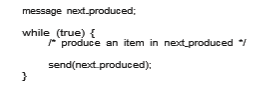
**Figure 3.14** The producer process using message passing.

Different combinations of send() and receive() are possible. When both send() and receive() are blocking, we have a **rendezvous** between the sender and the receiver. The solution to the producer–consumer problem becomes trivial when we use blocking send() and receive() statements. The producer merely invokes the blocking send() call and waits until the message is delivered to either the receiver or the mailbox. Likewise, when the consumer invokes receive(), it blocks until a message is available. This is illustrated in Figures 3.14 and 3.15.

### Buffering

Whether communication is direct or indirect, messages exchanged by commu- nicating processes reside in a temporary queue. Basically, such queues can be implemented in three ways:

• **Zero capacity**. The queue has a maximum length of zero; thus, the link cannot have any messages waiting in it. In this case, the sender must block until the recipient receives the message.

• **Bounded capacity**. The queue has finite length _n;_ thus, at most _n_messages can reside in it. If the queue is not full when a new message is sent, the message is placed in the queue (either the message is copied or a pointer to the message is kept), and the sender can continue execution without

**Figure 3.15** The consumer process using message passing.  

waiting. The link’s capacity is finite, however. If the link is full, the sender must block until space is available in the queue.

• **Unbounded capacity**. The queue’s length is potentially infinite; thus, any number of messages can wait in it. The sender never blocks.

The zero-capacity case is sometimes referred to as a message system with no buffering. The other cases are referred to as systems with automatic buffering.

## Examples of IPC Systems

In this section, we explore four different IPC systems. We first cover the POSIX API for shared memory and then discuss message passing in the Mach oper- ating system. Next, we present Windows IPC, which interestingly uses shared memory as a mechanism for providing certain types of message passing. We conclude with pipes, one of the earliest IPC mechanisms on UNIX systems.

### POSIX Shared Memory

Several IPC mechanisms are available for POSIX systems, including shared memory and message passing. Here, we explore the POSIX API for shared memory.

POSIX shared memory is organized using memory-mapped files, which associate the region of shared memory with a file. A process must first create a shared-memory object using the shm open() system call, as follows:

fd = shm open(name, O CREAT | O RDWR, 0666);

The first parameter specifies the name of the shared-memory object. Processes that wish to access this shared memory must refer to the object by this name. The subsequent parameters specify that the shared-memory object is to be cre- ated if it does not yet exist (O CREAT) and that the object is open for reading and writing (O RDWR). The last parameter establishes the file-access permissions of the shared-memory object. A successful call to shm open() returns an integer file descriptor for the shared-memory object.

Once the object is established, the ftruncate() function is used to configure the size of the object in bytes. The call

ftruncate(fd, 4096);

sets the size of the object to 4,096 bytes. Finally, the mmap() function establishes a memory-mapped file containing

the shared-memory object. It also returns a pointer to the memory-mapped file that is used for accessing the shared-memory object.

The programs shown in Figure 3.16 and Figure 3.17 use the producer– consumer model in implementing shared memory. The producer establishes a shared-memory object and writes to shared memory, and the consumer reads from shared memory.  

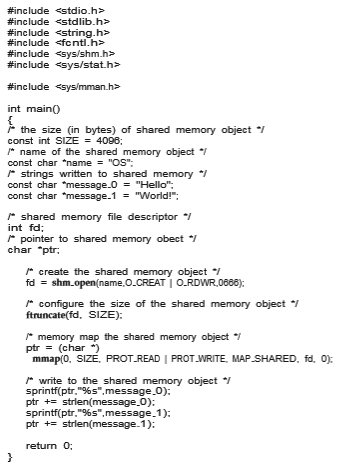
**Figure 3.16** Producer process illustrating POSIX shared-memory API.  

The producer, shown in Figure 3.16, creates a shared-memory object named OS and writes the infamous string "Hello World!" to shared memory. The program memory-maps a shared-memory object of the specified size and allows writing to the object. The flag MAP SHARED specifies that changes to the shared-memory object will be visible to all processes sharing the object. Notice that we write to the shared-memory object by calling the sprintf() function and writing the formatted string to the pointer ptr. After each write, we must increment the pointer by the number of bytes written.

**Figure 3.17** Consumer process illustrating POSIX shared-memory API.  

The consumer process, shown in Figure 3.17, reads and outputs the con- tents of the shared memory. The consumer also invokes the shm unlink() function, which removes the shared-memory segment after the consumer has accessed it.We provide further exercises using the POSIX shared-memoryAPI in the programming exercises at the end of this chapter. Additionally, we provide more detailed coverage of memory mapping in Section 13.5.

### Mach Message Passing

As an example of message passing, we next consider the Mach operating system.Mach was especially designed for distributed systems, but was shown to be suitable for desktop and mobile systems as well, as evidenced by its inclusion in the macOS and iOS operating systems, as discussed in Chapter 2.

The Mach kernel supports the creation and destruction of multiple **_tasks_**, which are similar to processes but have multiple threads of control and fewer associated resources.Most communication inMach—including all inter- task communication—is carried out by **messages**. Messages are sent to, and received from,mailboxes,which are called**ports** inMach. Ports are finite in size and unidirectional; for two-way communication, a message is sent to one port, and a response is sent to a separate **_reply_** port. Each port may have multiple senders, but only one receiver. Mach uses ports to represent resources such as tasks, threads, memory, and processors, while message passing provides an object-oriented approach for interacting with these system resources and services. Message passing may occur between any two ports on the same host or on separate hosts on a distributed system.

Associated with each port is a collection of **port rights** that identify the capabilities necessary for a task to interact with the port. For example, for a task to receive a message from a port, it must have the capability MACH PORT RIGHT RECEIVE for that port. The task that creates a port is that port’s owner, and the owner is the only task that is allowed to receivemessages from that port. A port’s owner may also manipulate the capabilities for a port. This is most commonly done in establishing a reply port. For example, assume that task _T_1 owns port _P_1, and it sends a message to port _P_2, which is owned by task _T_2\. If _T_1 expects to receive a reply from _T_2, it must grant _T_2 the right MACH PORT RIGHT SEND for port _P_1\. Ownership of port rights is at the task level, which means that all threads belonging to the same task share the same port rights. Thus, two threads belonging to the same task can easily communicate by exchanging messages through the per-thread port associated with each thread.

When a task is created, two special ports—the **_Task Self_** port and the **_Notify_** port—are also created. The kernel has receive rights to the Task Self port, which allows a task to send messages to the kernel. The kernel can send notification of event occurrences to a task’s Notify port (to which, of course, the task has receive rights).

The mach port allocate() function call creates a new port and allocates space for its queue of messages. It also identifies the rights for the port. Each port right represents a **_name_** for that port, and a port can only be accessed via a right. Port names are simple integer values and behave much like UNIX file descriptors. The following example illustrates creating a port using this API:

mach port t port; // the name of the port right

**mach port allocate**( mach task self(), // a task referring to itself MACH PORT RIGHT RECEIVE, // the right for this port &port); // the name of the port right

Each task also has access to a **bootstrap port**, which allows a task to register a port it has createdwith a system-wide **bootstrap server**. Once a port has been registered with the bootstrap server, other tasks can look up the port in this registry and obtain rights for sending messages to the port.

The queue associated with each port is finite in size and is initially empty. As messages are sent to the port, the messages are copied into the queue. All messages are delivered reliably and have the same priority. Mach guarantees that multiple messages from the same sender are queued in first-in, first- out (FIFO) order but does not guarantee an absolute ordering. For instance, messages from two senders may be queued in any order.

Mach messages contain the following two fields:

• A fixed-size message header containing metadata about the message, including the size of the message as well as source and destination ports. Commonly, the sending thread expects a reply, so the port name of the source is passed on to the receiving task, which can use it as a “return address” in sending a reply.

• A variable-sized body containing data.

Messages may be either **_simple_** or **_complex_**. A simple message contains ordinary, unstructured user data that are not interpreted by the kernel. A complex message may contain pointers to memory locations containing data (known as “out-of-line” data) or may also be used for transferring port rights to another task. Out-of-line data pointers are especially useful when amessage must pass large chunks of data. A simple message would require copying and packaging the data in the message; out-of-line data transmission requires only a pointer that refers to the memory location where the data are stored.

The function mach msg() is the standard API for both sending and receiving messages. The value of one of the function’s parameters—either MACH SEND MSG or MACH RCV MSG—indicates if it is a send or receive operation. We now illustrate how it is used when a client task sends a simple message to a server task. Assume there are two ports—client and server—associated with the client and server tasks, respectively. The code in Figure 3.18 shows the client task constructing a header and sending a message to the server, as well as the server task receiving the message sent from the client.

The mach msg() function call is invoked by user programs for performing message passing. mach msg() then invokes the function mach msg trap(), which is a system call to the Mach kernel. Within the kernel, mach msg trap() next calls the function mach msg overwrite trap(), which then handles the actual passing of the message.  

**Figure 3.18** Example program illustrating message passing in Mach.

The send and receive operations themselves are flexible. For instance,when a message is sent to a port, its queue may be full. If the queue is not full, the message is copied to the queue, and the sending task continues. If the  

port’s queue is full, the sender has several options (specified via parameters to mach msg():

**1\.** Wait indefinitely until there is room in the queue.

**2\.** Wait at most _n_milliseconds.

**3\.** Do not wait at all but rather return immediately.

**4\.** Temporarily cache a message. Here, a message is given to the operating system to keep, even though the queue to which that message is being sent is full. When the message can be put in the queue, a notification message is sent back to the sender. Only one message to a full queue can be pending at any time for a given sending thread.

The final option is meant for server tasks. After finishing a request, a server task may need to send a one-time reply to the task that requested the service, but it must also continue with other service requests, even if the reply port for a client is full.

The major problem with message systems has generally been poor perfor- mance caused by copying of messages from the sender’s port to the receiver’s port. The Mach message system attempts to avoid copy operations by using virtual-memory-management techniques (Chapter 10). Essentially,Machmaps the address space containing the sender’s message into the receiver’s address space. Therefore, the message itself is never actually copied, as both the sender and receiver access the same memory. This message-management technique provides a large performance boost but works only for intrasystem messages.

### Windows

The Windows operating system is an example of modern design that employs modularity to increase functionality and decrease the time needed to imple- ment new features. Windows provides support for multiple operating envi- ronments, or **_subsystems._** Application programs communicate with these sub- systems via a message-passingmechanism. Thus, application programs can be considered clients of a subsystem server.

The message-passing facility in Windows is called the **advanced local pro- cedure call** (**ALPC**) facility. It is used for communication between two processes on the same machine. It is similar to the standard remote procedure call (RPC) mechanism that is widely used, but it is optimized for and specific toWindows. (Remote procedure calls are covered in detail in Section 3.8.2.) LikeMach,Win- dows uses a port object to establish and maintain a connection between two processes. Windows uses two types of ports: **connection ports** and **communi- cation ports**.

Server processes publish connection-port objects that are visible to all pro- cesses. When a client wants services from a subsystem, it opens a handle to the server’s connection-port object and sends a connection request to that port. The server then creates a channel and returns a handle to the client. The chan- nel consists of a pair of private communication ports: one for client–server messages, the other for server–client messages. Additionally, communication channels support a callback mechanism that allows the client and server to accept requests when they would normally be expecting a reply.  


**Figure 3.19** Advanced local procedure calls in Windows.

When an ALPC channel is created, one of threemessage-passing techniques is chosen:

**1\.** For small messages (up to 256 bytes), the port’s message queue is used as intermediate storage, and the messages are copied from one process to the other.

**2\.** Larger messages must be passed through a **section object**, which is a region of shared memory associated with the channel.

**3\.** When the amount of data is too large to fit into a section object, an API is available that allows server processes to read and write directly into the address space of a client.

The client has to decide when it sets up the channel whether it will need to send a large message. If the client determines that it does want to send large messages, it asks for a section object to be created. Similarly, if the server decides that replies will be large, it creates a section object. So that the section object can be used, a small message is sent that contains a pointer and size information about the section object. Thismethod ismore complicated than the firstmethod listed above, but it avoids data copying. The structure of advanced local procedure calls in Windows is shown in Figure 3.19.

It is important to note that the ALPC facility in Windows is not part of the Windows API and hence is not visible to the application programmer. Rather, applications using the Windows API invoke standard remote procedure calls. When the RPC is being invoked on a process on the same system, the RPC is handled indirectly through an ALPC procedure call. Additionally, many kernel services use ALPC to communicate with client processes.

### Pipes

A **pipe** acts as a conduit allowing two processes to communicate. Pipes were one of the first IPC mechanisms in early UNIX systems. They typically pro- vide one of the simpler ways for processes to communicate with one another, although they also have some limitations. In implementing a pipe, four issues must be considered:  

**1\.** Does the pipe allow bidirectional communication, or is communication unidirectional?

**2\.** If two-way communication is allowed, is it half duplex (data can travel only one way at a time) or full duplex (data can travel in both directions at the same time)?

**3\.** Must a relationship (such as **_parent–child_**) exist between the communi- cating processes?

**4\.** Can the pipes communicate over a network, or must the communicating processes reside on the same machine?

In the following sections, we explore two common types of pipes used on both UNIX and Windows systems: ordinary pipes and named pipes.

#### Ordinary Pipes

Ordinary pipes allow two processes to communicate in standard producer– consumer fashion: the producer writes to one end of the pipe (the **write end**) and the consumer reads from the other end (the **read end**). As a result, ordinary pipes are unidirectional, allowing only one-way communication. If two-way communication is required, two pipes must be used, with each pipe sending data in a different direction. We next illustrate constructing ordinary pipes on both UNIX and Windows systems. In both program examples, one process writes the message Greetings to the pipe, while the other process reads this message from the pipe.

On UNIX systems, ordinary pipes are constructed using the function

pipe(int fd\[\])

This function creates a pipe that is accessed through the int fd\[\] file descrip- tors: fd\[0\] is the read end of the pipe, and fd\[1\] is the write end. UNIX treats a pipe as a special type of file. Thus, pipes can be accessed using ordinary read() and write() system calls.

An ordinary pipe cannot be accessed from outside the process that created it. Typically, a parent process creates a pipe and uses it to communicate with a child process that it creates via fork(). Recall from Section 3.3.1 that a child process inherits open files from its parent. Since a pipe is a special type of file, the child inherits the pipe from its parent process. Figure 3.20 illustrates

**Figure 3.20** File descriptors for an ordinary pipe.  

**Figure 3.21** Ordinary pipe in UNIX.

the relationship of the file descriptors in the fd array to the parent and child processes. As this illustrates, any writes by the parent to its write end of the pipe—fd\[1\]—can be read by the child from its read end—fd\[0\]—of the pipe.

In the UNIX program shown in Figure 3.21, the parent process creates a pipe and then sends a fork() call creating the child process. What occurs after the fork() call depends on how the data are to flow through the pipe. In this instance, the parent writes to the pipe, and the child reads from it. It is important to notice that both the parent process and the child process initially close their unused ends of the pipe. Although the program shown in Figure 3.21 does not require this action, it is an important step to ensure that a process reading from the pipe can detect end-of-file (read() returns 0) when thewriter has closed its end of the pipe.

Ordinary pipes on Windows systems are termed **anonymous pipes**, and they behave similarly to their UNIX counterparts: they are unidirectional and employ parent–child relationships between the communicating processes. In addition, reading and writing to the pipe can be accomplished with the ordi- nary ReadFile() and WriteFile() functions. The Windows API for creating pipes is the CreatePipe() function, which is passed four parameters. The parameters provide separate handles for (1) reading and (2) writing to the pipe, as well as (3) an instance of the STARTUPINFO structure, which is used to specify that the child process is to inherit the handles of the pipe. Furthermore, (4) the size of the pipe (in bytes) may be specified.

Figure 3.23 illustrates a parent process creating an anonymous pipe for communicating with its child. Unlike UNIX systems, in which a child pro- cess automatically inherits a pipe created by its parent, Windows requires the programmer to specify which attributes the child process will inherit. This is  

**Figure 3.22** Figure 3.21, continued.

accomplished by first initializing the SECURITY ATTRIBUTES structure to allow handles to be inherited and then redirecting the child process’s handles for standard input or standard output to the read or write handle of the pipe. Since the child will be reading from the pipe, the parent must redirect the child’s standard input to the read handle of the pipe. Furthermore, as the pipes are half duplex, it is necessary to prohibit the child from inheriting the write end of the  
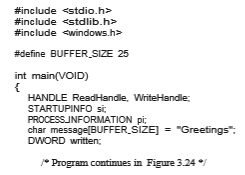
**Figure 3.23** Windows anonymous pipe—parent process.

pipe. The program to create the child process is similar to the program in Figure 3.10, except that the fifth parameter is set to TRUE, indicating that the child process is to inherit designated handles from its parent. Before writing to the pipe, the parent first closes its unused read end of the pipe. The child process that reads from the pipe is shown in Figure 3.25. Before reading from the pipe, this programobtains the readhandle to the pipe by invoking GetStdHandle().

Note that ordinary pipes require a parent–child relationship between the communicating processes on both UNIX and Windows systems. This means that these pipes can be used only for communication between processes on the same machine.

#### Named Pipes

Ordinary pipes provide a simple mechanism for allowing a pair of processes to communicate. However, ordinary pipes exist only while the processes are communicating with one another. On both UNIX and Windows systems, once the processes have finished communicating and have terminated, the ordinary pipe ceases to exist.

Named pipes provide a much more powerful communication tool. Com- munication can be bidirectional, and no parent–child relationship is required. Once a named pipe is established, several processes can use it for communi- cation. In fact, in a typical scenario, a named pipe has several writers. Addi- tionally, named pipes continue to exist after communicating processes have finished. Both UNIX andWindows systems support named pipes, although the details of implementation differ greatly. Next, we explore named pipes in each of these systems.

Named pipes are referred to as FIFOs in UNIX systems. Once created, they appear as typical files in the file system. A FIFO is created with the mkfifo() system call and manipulated with the ordinary open(), read(), write(), and close() system calls. It will continue to exist until it is explicitly deleted  

**Figure 3.24** Figure 3.23, continued.  
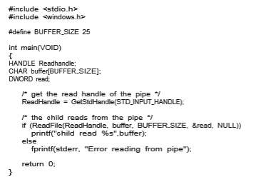
**Figure 3.25** Windows anonymous pipes—child process.

from the file system. Although FIFOs allow bidirectional communication, only half-duplex transmission is permitted. If data must travel in both directions, two FIFOs are typically used. Additionally, the communicating processes must reside on the same machine. If intermachine communication is required, sock- ets (Section 3.8.1) must be used.

Named pipes onWindows systems provide a richer communicationmech- anism than their UNIX counterparts. Full-duplex communication is allowed, and the communicating processes may reside on either the same or different machines. Additionally, only byte-oriented data may be transmitted across a UNIX FIFO, whereas Windows systems allow either byte- or message-oriented data. Named pipes are created with the CreateNamedPipe() function, and a client can connect to a named pipe using ConnectNamedPipe(). Communi- cation over the named pipe can be accomplished using the ReadFile() and WriteFile() functions.

## Communication in Client–Server Systems

In Section 3.4, we described how processes can communicate using shared memory and message passing. These techniques can be used for communica- tion in client–server systems (Section 1.10.3) as well. In this section, we explore two other strategies for communication in client–server systems: sockets and  

**_PIPES IN PRACTICE_**

Pipes are used quite often in the UNIX command-line environment for situ- ations in which the output of one command serves as input to another. For example, the UNIX ls command produces a directory listing. For especially long directory listings, the output may scroll through several screens. The command less manages output by displaying only one screen of output at a time where the user may use certain keys to move forward or backward in the file. Setting up a pipe between the ls and less commands (which are running as individual processes) allows the output of ls to be delivered as the input to less, enabling the user to display a large directory listing a screen at a time. A pipe can be constructed on the command line using the | character. The complete command is

ls | less

In this scenario, the ls command serves as the producer, and its output is consumed by the less command.

Windows systems provide a more command for the DOS shell with func- tionality similar to that of its UNIX counterpart less. (UNIX systems also provide a more command, but in the tongue-in-cheek style common in UNIX, the less command in fact provides _more_ functionality than more!) The DOS shell also uses the | character for establishing a pipe. The only difference is that to get a directory listing, DOS uses the dir command rather than ls, as shown below:

dir | more

remote procedure calls (RPCs). As we shall see in our coverage of RPCs, not only are they useful for client–server computing, but Android also uses remote procedures as a form of IPC between processes running on the same system.

### Sockets

A**socket** is defined as an endpoint for communication. Apair of processes com- municating over a network employs a pair of sockets—one for each process. A socket is identified by an IP address concatenated with a port number. In general, sockets use a client–server architecture. The serverwaits for incoming client requests by listening to a specified port. Once a request is received, the server accepts a connection from the client socket to complete the connection. Servers implementing specific services (such as SSH, FTP, and HTTP) listen to **_well-known_** ports (an SSH server listens to port 22; an FTP server listens to port 21; and a web, or HTTP, server listens to port 80). All ports below 1024 are considered**_well known_** and are used to implement standard services.

When a client process initiates a request for a connection, it is assigned a port by its host computer. This port has some arbitrary number greater than 1024. For example, if a client on host X with IP address 146.86.5.20 wishes to establish a connection with a web server (which is listening on port 80) at  
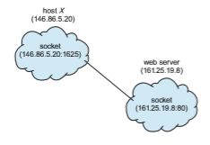
**Figure 3.26** Communication using sockets.

address 161.25.19.8, host X may be assigned port 1625. The connection will consist of a pair of sockets: (146.86.5.20:1625) on host X and (161.25.19.8:80) on the web server. This situation is illustrated in Figure 3.26. The packets traveling between the hosts are delivered to the appropriate process based on the destination port number.

All connections must be unique. Therefore, if another process also on host Xwished to establish another connection with the sameweb server, it would be assigned a port number greater than 1024 and not equal to 1625. This ensures that all connections consist of a unique pair of sockets.

Although most program examples in this text use C, we will illustrate sockets using Java, as it provides a much easier interface to sockets and has a rich library for networking utilities. Those interested in socket programming in C or C++ should consult the bibliographical notes at the end of the chapter.

Java provides three different types of sockets. **Connection-oriented** (**TCP**) sockets are implemented with the Socket class. **Connectionless** (**UDP**) sockets use the DatagramSocket class. Finally, the MulticastSocket class is a sub- class of the DatagramSocket class. Amulticast socket allows data to be sent to multiple recipients.

Our example describes a date server that uses connection-oriented TCP sockets. The operation allows clients to request the current date and time from the server. The server listens to port 6013, although the port could have any arbitrary, unused number greater than 1024. When a connection is received, the server returns the date and time to the client.

The date server is shown in Figure 3.27. The server creates a ServerSocket that specifies that it will listen to port 6013. The server then begins listening to the port with the accept() method. The server blocks on the accept() methodwaiting for a client to request a connection. When a connection request is received, accept() returns a socket that the server can use to communicate with the client.

The details of how the server communicates with the socket are as follows. The server first establishes a PrintWriter object that it will use to communi- cate with the client. A PrintWriter object allows the server to write to the socket using the routine print() and println() methods for output. The  
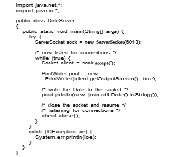

**Figure 3.27** Date server.

server process sends the date to the client, calling themethod println(). Once it has written the date to the socket, the server closes the socket to the client and resumes listening for more requests.

A client communicates with the server by creating a socket and connecting to the port on which the server is listening. We implement such a client in the Java program shown in Figure 3.28. The client creates a Socket and requests a connection with the server at IP address 127.0.0.1 on port 6013. Once the connection is made, the client can read from the socket using normal stream I/O statements. After it has received the date from the server, the client closes the socket and exits. The IP address 127.0.0.1 is a special IP address known as the **loopback**.When a computer refers to IP address 127.0.0.1, it is referring to itself. This mechanism allows a client and server on the same host to communicate using the TCP/IP protocol. The IP address 127.0.0.1 could be replaced with the IP address of another host running the date server. In addition to an IP address, an actual host name, such as www.westminstercollege.edu, can be used as well.  
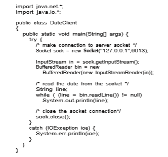

**Figure 3.28** Date client.

Communication using sockets—although common and efficient—is con- sidered a low-level form of communication between distributed processes. One reason is that sockets allow only an unstructured stream of bytes to be exchanged between the communicating threads. It is the responsibility of the client or server application to impose a structure on the data. In the next sub- section, we look a higher-level method of communication: remote procedure calls (RPCs).

### Remote Procedure Calls

One of the most common forms of remote service is the RPC paradigm, which was designed as a way to abstract the procedure-call mechanism for use between systemswith network connections. It is similar inmany respects to the IPC mechanism described in Section 3.4, and it is usually built on top of such a system. Here, however, because we are dealing with an environment in which the processes are executing on separate systems, wemust use a message-based communication scheme to provide remote service.  

In contrast to IPC messages, the messages exchanged in RPC communi- cation are well structured and are thus no longer just packets of data. Each message is addressed to an RPC daemon listening to a port on the remote sys- tem, and each contains an identifier specifying the function to execute and the parameters to pass to that function. The function is then executed as requested, and any output is sent back to the requester in a separate message.

A**port** in this context is simply a number included at the start of a message packet. Whereas a system normally has one network address, it can have many ports within that address to differentiate the many network services it supports. If a remote process needs a service, it addresses a message to the proper port. For instance, if a system wished to allow other systems to be able to list its current users, it would have a daemon supporting such an RPC attached to a port—say, port 3027. Any remote system could obtain the needed information (that is, the list of current users) by sending an RPCmessage to port 3027 on the server. The data would be received in a reply message.

The semantics of RPCs allows a client to invoke a procedure on a remote host as it would invoke a procedure locally. The RPC system hides the details that allow communication to take place by providing a **stub** on the client side. Typically, a separate stub exists for each separate remote procedure. When the client invokes a remote procedure, the RPC system calls the appropriate stub, passing it the parameters provided to the remote procedure. This stub locates the port on the server and **marshals** the parameters. The stub then transmits a message to the server using message passing. A similar stub on the server side receives this message and invokes the procedure on the server. If necessary, return values are passed back to the client using the same technique. OnWindows systems, stub code is compiled from a specification written in the **Microsoft Interface Definitio Language** (**MIDL**), which is used for defining the interfaces between client and server programs.

Parameter marshaling addresses the issue concerning differences in data representation on the client and server machines. Consider the representa- tion of 32-bit integers. Some systems (known as **big-endian**) store the most significant byte first, while other systems (known as **little-endian**) store the least significant byte first. Neither order is “better” per se; rather, the choice is arbitrary within a computer architecture. To resolve differences like this, many RPC systems define a machine-independent representation of data. One such representation is known as **external data representation** (**XDR**). On the client side, parameter marshaling involves converting the machine-dependent data into XDR before they are sent to the server. On the server side, the XDR data are unmarshaled and converted to the machine-dependent representation for the server.

Another important issue involves the semantics of a call. Whereas local procedure calls fail only under extreme circumstances, RPCs can fail, or be duplicated and executed more than once, as a result of common network errors. One way to address this problem is for the operating system to ensure that messages are acted on **_exactly once,_** rather than **_at most once._** Most local procedure calls have the “exactly once” functionality, but it is more difficult to implement.

First, consider “atmost once.”This semantic can be implemented by attach- ing a timestamp to each message. The server must keep a history of all the timestamps of messages it has already processed or a history large enough to ensure that repeated messages are detected. Incoming messages that have a timestamp already in the history are ignored. The client can then send a message one or more times and be assured that it only executes once.

For “exactly once,” we need to remove the risk that the server will never receive the request. To accomplish this, the servermust implement the “at most once” protocol described above but must also acknowledge to the client that the RPC call was received and executed. These ACK messages are common throughout networking. The client must resend each RPC call periodically until it receives the ACK for that call.

Yet another important issue concerns the communication between a server and a client. With standard procedure calls, some form of binding takes place during link, load, or execution time (Chapter 9) so that a procedure call’s name is replaced by the memory address of the procedure call. The RPC scheme requires a similar binding of the client and the server port, but howdoes a client know the port numbers on the server? Neither system has full information about the other, because they do not share memory.

Two approaches are common. First, the binding informationmay be prede- termined, in the form of fixed port addresses. At compile time, an RPC call has a fixed port number associated with it. Once a program is compiled, the server cannot change the port number of the requested service. Second, binding can be done dynamically by a rendezvousmechanism. Typically, an operating system provides a rendezvous (also called a **matchmaker**) daemon on a fixed RPC port. Aclient then sends amessage containing the name of the RPC to the rendezvous daemon requesting the port address of the RPC it needs to execute. The port number is returned, and the RPC calls can be sent to that port until the process terminates (or the server crashes). This method requires the extra overhead of the initial request but ismore flexible than the first approach. Figure 3.29 shows a sample interaction.

The RPC scheme is useful in implementing a distributed file system (Chap- ter 19). Such a system can be implemented as a set of RPC daemons and clients. The messages are addressed to the distributed file system port on a server on which a file operation is to take place. The message contains the disk operation to be performed. The disk operation might be read(), write(), rename(), delete(), or status(), corresponding to the usual file-related system calls. The return message contains any data resulting from that call, which is exe- cuted by the DFS daemon on behalf of the client. For instance, a message might contain a request to transfer a whole file to a client or be limited to a simple block request. In the latter case, several requests may be needed if a whole file is to be transferred.

#### Android RPC

Although RPCs are typically associated with client-server computing in a dis- tributed system, they can also be used as a form of IPC between processes running on the same system. The Android operating system has a rich set of IPC mechanisms contained in its **binder** framework, including RPCs that allow one process to request services from another process.

Android defines an **application component** as a basic building block that provides utility to an Android application, and an app may combine multiple application components to provide functionality to an app. One such applica-  


**Figure 3.29** Execution of a remote procedure call (RPC).

tion component is a **service**, which has no user interface but instead runs in the background while executing long-running operations or performing work for remote processes. Examples of services include playing music in the back- ground and retrieving data over a network connection on behalf of another process, thereby preventing the other process from blocking as the data are being downloaded. When a client app invokes the bindService() method of a service, that service is “bound” and available to provide client-server communication using either message passing or RPCs.

A bound service must extend the Android class Service and must imple- ment the method onBind(), which is invoked when a client calls bindSer- vice(). In the case of message passing, the onBind() method returns a Mes- senger service, which is used for sending messages from the client to the service. The Messenger service is only one-way; if the servicemust send a reply back to the client, the client must also provide a Messenger service, which is contained in the replyTo field of the Message object sent to the service. The service can then send messages back to the client.

To provide RPCs, the onBind() method must return an interface repre- senting the methods in the remote object that clients use to interact with the service. This interface is written in regular Java syntax and uses the Android Interface Definition Language—AIDL—to create stub files, which serve as the client interface to remote services.

Here, we briefly outline the process required to provide a generic remote service named remoteMethod() using AIDL and the binder service. The inter- face for the remote service appears as follows:

/\* RemoteService.aidl \*/ interface RemoteService _{_

boolean remoteMethod(int x, double y); _{_

This file is written as RemoteService.aidl. The Android development kit will use it to generate a .java interface from the .aidl file, as well as a stub that serves as the RPC interface for this service. The server must implement the interface generated by the .aidl file, and the implementation of this interface will be called when the client invokes remoteMethod().

When a client calls bindService(), the onBind() method is invoked on the server, and it returns the stub for the RemoteService object to the client. The client can then invoke the remote method as follows:

RemoteService service; . . .

service.remoteMethod(3, 0.14);

Internally, the Android binder framework handles parameter marshaling, transferring marshaled parameters between processes, and invoking the nec- essary implementation of the service, as well as sending any return values back to the client process.

## Summary

• Aprocess is a program in execution, and the status of the current activity of a process is represented by the program counter, as well as other registers.

• The layout of a process inmemory is represented by four different sections: (1) text, (2) data, (3) heap, and (4) stack.

• As a process executes, it changes state. There are four general states of a process: (1) ready, (2) running, (3) waiting, and (4) terminated.

• A process control block (PCB) is the kernel data structure that represents a process in an operating system.

• The role of the process scheduler is to select an available process to run on a CPU.

• An operating system performs a context switch when it switches from running one process to running another.  

• The fork() and CreateProcess() system calls are used to create pro- cesses on UNIX and Windows systems, respectively.

• When shared memory is used for communication between processes, two (or more) processes share the same region of memory. POSIX provides an API for shared memory.

• Two processes may communicate by exchanging messages with one another using message passing. The Mach operating system uses message passing as its primary form of interprocess communication. Windows provides a form of message passing as well.

• A pipe provides a conduit for two processes to communicate. There are two forms of pipes, ordinary and named. Ordinary pipes are designed for communication between processes that have a parent–child relationship. Named pipes are more general and allow several processes to communi- cate.

• UNIX systems provide ordinary pipes through the pipe() system call. Ordinary pipes have a read end and a write end. A parent process can, for example, send data to the pipe using its write end, and the child process can read it from its read end. Named pipes in UNIX are termed FIFOs.

• Windows systems also provide two forms of pipes—anonymous and named pipes. Anonymous pipes are similar to UNIX ordinary pipes. They are unidirectional and employ parent–child relationships between the communicating processes. Named pipes offer a richer form of interprocess communication than the UNIX counterpart, FIFOs.

• Two common forms of client–server communication are sockets and remote procedure calls (RPCs). Sockets allow two processes on different machines to communicate over a network. RPCs abstract the concept of function (procedure) calls in such a way that a function can be invoked on another process that may reside on a separate computer.

• The Android operating system uses RPCs as a form of interprocess com- munication using its binder framework.

**Practice Exercises**

**3.1** Using the program shown in Figure 3.30, explain what the output will be at LINE A.

**3.2** Including the initial parent process, how many processes are created by the program shown in Figure 3.31?

**3.3** Original versions of Apple’s mobile iOS operating system provided no means of concurrent processing. Discuss three major complications that concurrent processing adds to an operating system.

**3.4** Some computer systems provide multiple register sets. Describe what happens when a context switch occurs if the new context is already  

**Practice Exercises 155**
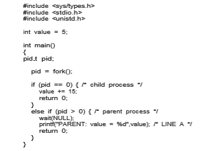
**Figure 3.30** What output will be at Line A?

loaded into one of the register sets. What happens if the new context is in memory rather than in a register set and all the register sets are in use?

**3.5** When a process creates a newprocess using the fork() operation,which of the following states is shared between the parent process and the child process?

a. Stack

b. Heap

c. Shared memory segments

**3.6** Consider the “exactly once”semanticwith respect to the RPCmechanism. Does the algorithm for implementing this semantic execute correctly even if the ACK message sent back to the client is lost due to a net- work problem?Describe the sequence of messages, and discuss whether “exactly once” is still preserved.

**3.7** Assume that a distributed system is susceptible to server failure. What mechanismswould be required to guarantee the “exactly once” semantic for execution of RPCs?  

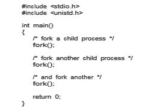
**Figure 3.31** How many processes are created?

**Further Reading**

Process creation, management, and IPC in UNIX and Windows systems, respectively, are discussed in \[Robbins and Robbins (2003)\] and \[Russinovich et al. (2017)\]. \[Love (2010)\] covers support for processes in the Linux kernel, and \[Hart (2005)\] covers Windows systems programming in detail. Coverage of the multiprocess model used in Google’s Chrome can be found at http://blog.chromium.org/2008/09/multi-process-architecture.html.

Message passing formulticore systems is discussed in \[Holland and Seltzer (2011)\]. \[Levin (2013)\] describes message passing in the Mach system, particu- larly with respect to macOS and iOS.

\[Harold (2005)\] provides coverage of socket programming in Java. Details onAndroid RPCs can be found at https://developer.android.com/guide/compo nents/aidl.html. \[Hart (2005)\] and \[Robbins and Robbins (2003)\] cover pipes in Windows and UNIX systems, respectively.

Guidelines forAndroiddevelopment can be found at https://developer.and roid.com/guide/.

**Bibliography**

**\[Harold (2005)\]** E. R. Harold, _Java Network Programming,_ Third Edition, O’Reilly & Associates (2005).

**\[Hart (2005)\]** J. M. Hart,_Windows System Programming,_ Third Edition, Addison- Wesley (2005).  

**\[Holland and Seltzer (2011)\]** D.Holland andM. Seltzer, “MulticoreOSes: Look- ing Forward from 1991, er, 2011”,_Proceedings of the 13th USENIX conference onHot topics in operating systems_ (2011), pages 33–33.

**\[Levin (2013)\]** J. Levin, _Mac OS X and iOS Internals to the Apple’s Core_, Wiley (2013).

**\[Love (2010)\]** R. Love, _Linux Kernel Development,_ Third Edition, Developer’s Library (2010).

**\[Robbins and Robbins (2003)\]** K. Robbins and S. Robbins, _Unix Systems Pro- gramming: Communication, Concurrency and Threads,_ Second Edition, Prentice Hall (2003).

**\[Russinovich et al. (2017)\]** M.Russinovich,D.A. Solomon, andA. Ionescu,_Win- dows Internals–Part 1,_ Seventh Edition, Microsoft Press (2017).  

**Exercises**

**Chapter 3 Exercises**

**3.8** Describe the actions taken by a kernel to context-switch between pro- cesses.

**3.9** Construct a process tree similar to Figure 3.7. To obtain process infor- mation for the UNIX or Linux system, use the command ps -ael. Use the command man ps to get more information about the ps com- mand. The task manager on Windows systems does not provide the parent process ID, but the **_process monitor_** tool, available from tech- net.microsoft.com, provides a process-tree tool.

**3.10** Explain the role of the init (or systemd) process on UNIX and Linux systems in regard to process termination.

**3.11** Including the initial parent process, how many processes are created by the program shown in Figure 3.32?

**3.12** Explain the circumstances under which the line of code marked printf("LINE J") in Figure 3.33 will be reached.

**3.13** Using the program in Figure 3.34, identify the values of pid at lines A, B, C, and D. (Assume that the actual pids of the parent and child are 2600 and 2603, respectively.)

**3.14** Give an example of a situation inwhich ordinary pipes aremore suitable than named pipes and an example of a situation in which named pipes are more suitable than ordinary pipes.

**3.15** Consider the RPC mechanism. Describe the undesirable consequences that could arise from not enforcing either the “at most once” or “exactly once” semantic. Describe possible uses for a mechanism that has neither of these guarantees.

**3.16** Using the program shown in Figure 3.35, explain what the output will be at lines X and Y.
```
#include _<_stdio.h_\>_ #include _<_unistd.h_\>_

int main() _{_

int i;

for (i = 0; i < 4; i++) fork();

return 0; _}_
```
**Figure 3.21** How many processes are created?

**EX-4**  

**3.17** What are the benefits and the disadvantages of each of the following? Consider both the system level and the programmer level.

a. Synchronous and asynchronous communication

b. Automatic and explicit buffering

c. Send by copy and send by reference

d. Fixed-sized and variable-sized messages
```
#include _<_sys/types.h_\>_ #include _<_stdio.h_\>_ #include _<_unistd.h_\>_

int main() _{_ pid t pid;

/\* fork a child process \*/ pid = fork();

if (pid < 0) _{_ /\* error occurred \*/ fprintf(stderr, "Fork Failed"); return 1;

_}_ else if (pid == 0) _{_ /\* child process \*/

execlp("/bin/ls","ls",NULL); printf("LINE J");

_}_ else _{_ /\* parent process \*/

/\* parent will wait for the child to complete \*/ wait(NULL); printf("Child Complete");

_}_

return 0; _}_
```
**Figure 3.22** When will LINE J be reached?

**EX-5**  

**Exercises**
```
#include _<_sys/types.h_\>_ #include _<_stdio.h_\>_ #include _<_unistd.h_\>_

int main() _{_ pid t pid, pid1;

/\* fork a child process \*/ pid = fork();

if (pid < 0) _{_ /\* error occurred \*/ fprintf(stderr, "Fork Failed"); return 1;

_}_ else if (pid == 0) _{_ /\* child process \*/

pid1 = getpid(); printf("child: pid = %d",pid); /\* A \*/ printf("child: pid1 = %d",pid1); /\* B \*/

_}_ else _{_ /\* parent process \*/

pid1 = getpid(); printf("parent: pid = %d",pid); /\* C \*/ printf("parent: pid1 = %d",pid1); /\* D \*/ wait(NULL);

_}_

return 0; _}_
```
**Figure 3.23** What are the pid values?

**EX-6**  
```
#include _<_sys/types.h_\>_ #include _<_stdio.h_\>_ #include _<_unistd.h_\>_

#define SIZE 5

int nums\[SIZE\] = _{_0,1,2,3,4_}_;

int main() _{_ int i; pid t pid;

pid = fork();

if (pid == 0) _{_ for (i = 0; i < SIZE; i++) _{_

nums\[i\] \*= -i; printf("CHILD: %d ",nums\[i\]); /\* LINE X \*/

_} }_ else if (pid > 0) _{_

wait(NULL); for (i = 0; i < SIZE; i++)

printf("PARENT: %d ",nums\[i\]); /\* LINE Y \*/ _}_

return 0; _}_
```
**Figure 3.24** What output will be at Line X and Line Y?

**EX-7**  

**Programming Problems**

**Programming Problems**

**3.18** Using either a UNIX or a Linux system, write a C program that forks a child process that ultimately becomes a zombie process. This zombie process must remain in the system for at least 10 seconds. Process states can be obtained from the command

ps -l

The process states are shown below the S column; processes with a state of Z are zombies. The process identifier (pid) of the child process is listed in the PID column, and that of the parent is listed in the PPID column.

Perhaps the easiest way to determine that the child process is indeed a zombie is to run the program that you have written in the background (using the &) and then run the command ps -l to determine whether the child is a zombie process. Because you do not want toomany zombie processes existing in the system, you will need to remove the one that you have created. The easiest way to do that is to terminate the parent process using the kill command. For example, if the pid of the parent is 4884, you would enter

kill -9 4884

**3.19** Write a C program called time.c that determines the amount of time necessary to run a command from the command line. This programwill be run as "./time <command>" and will report the amount of elapsed time to run the specified command. This will involve using fork() and exec() functions, as well as the gettimeofday() function to deter- mine the elapsed time. It will also require the use of two different IPC mechanisms.

The general strategy is to fork a child process that will execute the specified command. However, before the child executes the command, it will record a timestamp of the current time (which we term “starting time”). The parent process will wait for the child process to terminate. Once the child terminates, the parent will record the current timestamp for the ending time. The difference between the starting and ending times represents the elapsed time to execute the command. The example output below reports the amount of time to run the command ls :

./time ls time.c time

Elapsed time: 0.25422

As the parent and child are separate processes, they will need to arrange how the starting time will be shared between them. You will write two versions of this program, each representing a differentmethod of IPC.

**P-8**  

**Chapter 3 Processes**

The first version will have the child process write the starting time to a region of sharedmemory before it calls exec(). After the child process terminates, the parent will read the starting time from shared memory. Refer to Section 3.7.1 for details using POSIX shared memory. In that section, there are separate programs for the producer and consumer. As the solution to this problem requires only a single program, the region of shared memory can be established before the child process is forked, allowing both the parent and child processes access to the region of shared memory.

The second version will use a pipe. The child will write the starting time to the pipe, and the parent will read from it following the termina- tion of the child process.

You will use the gettimeofday() function to record the current timestamp. This function is passed a pointer to a struct timeval object, which contains two members: tv sec and t usec. These repre- sent the number of elapsed seconds and microseconds since January 1, 1970 (known as the UNIX EPOCH). The following code sample illustrates how this function can be used:

struct timeval current;

gettimeofday(&current,NULL);

// current.tv sec represents seconds // current.tv usec represents microseconds

For IPC between the child and parent processes, the contents of the shared memory pointer can be assigned the struct timeval repre- senting the starting time. When pipes are used, a pointer to a struct timeval can be written to—and read from—the pipe.

**3.20** An operating system’s **pid manager** is responsible formanaging process identifiers. When a process is first created, it is assigned a unique pid by the pid manager. The pid is returned to the pid manager when the process completes execution, and the manager may later reassign this pid. Process identifiers are discussed more fully in Section 3.3.1. What is most important here is to recognize that process identifiers must be unique; no two active processes can have the same pid.

Use the following constants to identify the range of possible pid values:
```
#define MIN PID 300 #define MAX PID 5000
```
You may use any data structure of your choice to represent the avail- ability of process identifiers. One strategy is to adopt what Linux has done and use a bitmap in which a value of 0 at position _i_ indicates that

**P-9**  

**Programming Problems**

a process id of value _i_ is available and a value of 1 indicates that the process id is currently in use.

Implement the following API for obtaining and releasing a pid:

• int allocate map(void)—Creates and initializes a data struc- ture for representing pids; returns −1 if unsuccessful, 1 if successful

• int allocate pid(void)—Allocates and returns a pid; returns −1 if unable to allocate a pid (all pids are in use)

• void release pid(int pid)—Releases a pid

This programming problem will be modified later on in Chapter 4 and in Chapter 6.

**3.21** The Collatz conjecture concerns what happens when we take any posi- tive integer _n_ and apply the following algorithm:

_n_ \= {

_n_∕2, if n is even 3 × _n_ \+ 1, if n is odd

The conjecture states that when this algorithm is continually applied, all positive integers will eventually reach 1. For example, if _n_ \= 35, the sequence is

35, 106, 53, 160, 80, 40, 20, 10, 5, 16, 8, 4, 2, 1

Write a C program using the fork() system call that generates this sequence in the child process. The starting number will be provided from the command line. For example, if 8 is passed as a parameter on the command line, the child process will output 8, 4, 2, 1. Because the parent and child processes have their own copies of the data, it will be necessary for the child to output the sequence. Have the parent invoke the wait() call to wait for the child process to complete before exiting the program. Perform necessary error checking to ensure that a positive integer is passed on the command line.

**3.22** In Exercise 3.21, the child process must output the sequence of num- bers generated from the algorithm specified by the Collatz conjecture because the parent and child have their own copies of the data. Another approach to designing this program is to establish a shared-memory object between the parent and child processes. This technique allows the child to write the contents of the sequence to the shared-memory object. The parent can then output the sequence when the child com- pletes. Because the memory is shared, any changes the child makes will be reflected in the parent process as well.

This program will be structured using POSIX shared memory as described in Section 3.7.1. The parent process will progress through the following steps:

a. Establish the shared-memory object (shm open(), ftruncate(), and mmap()).

**P-10**  

**Chapter 3 Processes**

b. Create the child process and wait for it to terminate.

c. Output the contents of shared memory.

d. Remove the shared-memory object.

One area of concern with cooperating processes involves synchro- nization issues. In this exercise, the parent and child processes must be coordinated so that the parent does not output the sequence until the child finishes execution. These two processeswill be synchronized using the wait() system call: the parent process will invoke wait(), which will suspend it until the child process exits.

**3.23** Section 3.8.1 describes certain port numbers as being well known—that is, they provide standard services. Port 17 is known as the _quote-of-the- day_ service. When a client connects to port 17 on a server, the server responds with a quote for that day.

Modify the date server shown in Figure 3.27 so that it delivers a quote of the day rather than the current date. The quotes should be printable ASCII characters and should contain fewer than 512 characters, although multiple lines are allowed. Since these well-known ports are reserved and therefore unavailable, have your server listen to port 6017. The date client shown in Figure 3.28 can be used to read the quotes returned by your server.

**3.24** A**haiku** is a three-line poem inwhich the first line contains five syllables, the second line contains seven syllables, and the third line contains five syllables. Write a haiku server that listens to port 5575. When a client connects to this port, the server responds with a haiku. The date client shown in Figure 3.28 can be used to read the quotes returned by your haiku server.

**3.25** An echo server echoes back whatever it receives from a client. For exam- ple, if a client sends the server the string Hello there!, the server will respond with Hello there!

Write an echo server using the Java networking API described in Section 3.8.1. This server will wait for a client connection using the accept()method. When a client connection is received, the server will loop, performing the following steps:

• Read data from the socket into a buffer.

• Write the contents of the buffer back to the client.

The server will break out of the loop only when it has determined that the client has closed the connection.

The date server of Figure 3.27 uses the java.io.BufferedReader class. BufferedReader extends the java.io.Reader class, which is used for reading character streams. However, the echo server cannot guarantee that it will read characters from clients; it may receive binary data aswell. The class java.io.InputStreamdealswithdata at the byte level rather than the character level. Thus, your echo server must use an object that extends java.io.InputStream. The read() method in the

**P-11**  

**Programming Problems**

java.io.InputStream class returns −1 when the client has closed its end of the socket connection.

**3.26** Design a program using ordinary pipes in which one process sends a string message to a second process, and the second process reverses the case of each character in the message and sends it back to the first process. For example, if the first process sends the message Hi There, the second process will return hI tHERE. This will require using two pipes, one for sending the original message from the first to the second process and the other for sending themodifiedmessage from the second to the first process. You can write this program using either UNIX or Windows pipes.

**3.27** Design a file-copying program named filecopy.c using ordinary pipes. This program will be passed two parameters: the name of the file to be copied and the name of the destination file. The program will then create an ordinary pipe and write the contents of the file to be copied to the pipe. The child process will read this file from the pipe and write it to the destination file. For example, if we invoke the program as follows:

./filecopy input.txt copy.txt

the file input.txtwill bewritten to the pipe. The child processwill read the contents of this file and write it to the destination file copy.txt. You may write this program using either UNIX or Windows pipes.

**Programming Projects**

**Project 1—UNIX Shell** This project consists of designing a C program to serve as a shell interface that accepts user commands and then executes each command in a separate process. Your implementation will support input and output redirection, as well as pipes as a form of IPC between a pair of commands. Completing this project will involve using the UNIX fork(), exec(), wait(), dup2(), and pipe() system calls and can be completed on any Linux, UNIX, or macOS system.

**I. Overview**

A shell interface gives the user a prompt, after which the next command is entered. The example below illustrates the prompt osh> and the user’s next command: cat prog.c. (This command displays the file prog.c on the terminal using the UNIX cat command.)

osh>cat prog.c

**P-12**  

**Chapter 3 Processes**

One technique for implementing a shell interface is to have the parent process first read what the user enters on the command line (in this case, cat prog.c) and then create a separate child process that performs the command. Unless otherwise specified, the parent process waits for the child to exit before contin- uing. This is similar in functionality to the new process creation illustrated in Figure 3.9. However, UNIX shells typically also allow the child process to run in the background, or concurrently. To accomplish this, we add an ampersand (&) at the end of the command. Thus, if we rewrite the above command as

osh>cat prog.c &

the parent and child processes will run concurrently. The separate child process is created using the fork() system call, and the

user’s command is executed using one of the system calls in the exec() family (as described in Section 3.3.1).

AC program that provides the general operations of a command-line shell is supplied in Figure 3.36. The main() function presents the prompt osh-> and outlines the steps to be taken after input from the user has been read. The main() function continually loops as long as should run equals 1; when the user enters exit at the prompt, your program will set should run to 0 and terminate.
```
#include _<_stdio.h_\>_ #include _<_unistd.h_\>_

#define MAX LINE 80 /\* The maximum length command \*/

int main(void) _{_ char \*args\[MAX LINE/2 + 1\]; /\* command line arguments \*/ int should run = 1; /\* flag to determine when to exit program \*/

while (should run) _{_ printf("osh>"); fflush(stdout);

/\*\* \* After reading user input, the steps are: \* (1) fork a child process using fork() \* (2) the child process will invoke execvp() \* (3) parent will invoke wait() unless command included & \*/

_}_

return 0; _}_
```
**Figure 3.36** Outline of simple shell.

**P-13**  

**Programming Projects**

This project is organized into several parts:

**1\.** Creating the child process and executing the command in the child

**2\.** Providing a history feature

**3\.** Adding support of input and output redirection

**4\.** Allowing the parent and child processes to communicate via a pipe

**II. Executing Command in a Child Process**

The first task is to modify the main() function in Figure 3.36 so that a child process is forked and executes the command specified by the user. This will require parsing what the user has entered into separate tokens and storing the tokens in an array of character strings (args in Figure 3.36). For example, if the user enters the command ps -ael at the osh> prompt, the values stored in the args array are:

args\[0\] = "ps" args\[1\] = "-ael" args\[2\] = NULL

This args array will be passed to the execvp() function, which has the follow- ing prototype:

execvp(char \*command, char \*params\[\])

Here, command represents the command to be performed and params stores the parameters to this command. For this project, the execvp() function should be invoked as execvp(args\[0\], args). Be sure to check whether the user included & to determine whether or not the parent process is to wait for the child to exit.

**III. Creating a History Feature**

The next task is to modify the shell interface program so that it provides a **_history_** feature to allow a user to execute themost recent command by entering !!. For example, if a user enters the command ls -l, she can then execute that command again by entering !! at the prompt. Any command executed in this fashion should be echoed on the user’s screen, and the command should also be placed in the history buffer as the next command.

Your program should alsomanage basic error handling. If there is no recent command in the history, entering !! should result in a message “No commands in history.”

**IV. Redirecting Input and Output**

Your shell should then be modified to support the ‘>’ and ‘<’ redirection

**P-14**  

**Chapter 3 Processes**

operators, where ‘>’ redirects the output of a command to a file and ‘<’ redirects the input to a command from a file. For example, if a user enters

osh>ls > out.txt

the output from the ls command will be redirected to the file out.txt. Simi- larly, input can be redirected as well. For example, if the user enters

osh>sort < in.txt

the file in.txtwill serve as input to the sort command. Managing the redirection of both input and output will involve using the

dup2() function, which duplicates an existing file descriptor to another file descriptor. For example, if fd is a file descriptor to the file out.txt, the call

dup2(fd, STDOUT FILENO);

duplicates fd to standard output (the terminal). This means that any writes to standard output will in fact be sent to the out.txt file.

You can assume that commandswill contain either one input or one output redirection and will not contain both. In other words, you do not have to be concerned with command sequences such as sort < in.txt > out.txt.

**V. Communication via a Pipe**

The final modification to your shell is to allow the output of one command to serve as input to another using a pipe. For example, the following command sequence

osh>ls -l | less

has the output of the command ls -l serve as the input to the less com- mand. Both the ls and less commands will run as separate processes and will communicate using the UNIX pipe() function described in Section 3.7.4. Perhaps the easiest way to create these separate processes is to have the parent process create the child process (which will execute ls -l). This child will also create another child process (which will execute less) andwill establish a pipe between itself and the child process it creates. Implementing pipe functionality will also require using the dup2() function as described in the previous section. Finally, although several commands can be chained together using multiple pipes, you can assume that commands will contain only one pipe character and will not be combined with any redirection operators.

**Project 2 —Linux Kernel Module for Task Information** In this project, you will write a Linux kernel module that uses the /proc file system for displaying a task’s information based on its process identifier value pid. Before beginning this project, be sure youhave completed the Linux kernel module programming project in Chapter 2, which involves creating an entry in the /proc file system. This project will involve writing a process identifier to

**P-15**  

**Programming Projects**

the file /proc/pid. Once a pid has been written to the /proc file, subsequent reads from /proc/pidwill report (1) the command the task is running, (2) the value of the task’s pid, and (3) the current state of the task. An example of how your kernel module will be accessed once loaded into the system is as follows:

echo "1395" > /proc/pid cat /proc/pid command = \[bash\] pid = \[1395\] state = \[1\]

The echo command writes the characters "1395" to the /proc/pid file. Your kernel module will read this value and store its integer equivalent as it rep- resents a process identifier. The cat command reads from /proc/pid, where your kernel module will retrieve the three fields from the task struct associ- ated with the task whose pid value is 1395.

ssize t proc write(struct file \*file, char user \*usr buf, size t count, loff t \*pos)

_{_ int rv = 0; char \*k mem;

/\* allocate kernel memory \*/ k mem = **kmalloc**(count, GFP KERNEL);

/\* copies user space usr buf to kernel memory \*/ **copy from user**(k mem, usr buf, count);

printk(KERN INFO "%s∖n", k mem);

/\* return kernel memory \*/ **kfree**(k mem);

return count; _}_

**Figure 3.37** The proc write() function.

**I. Writing to the** /proc **File System**

In the kernel module project in Chapter 2, you learned how to read from the /proc file system. We now cover how to write to /proc. Setting the field .write in struct file operations to

.write = proc write

causes the proc write() function of Figure 3.37 to be called when a write operation is made to /proc/pid

**P-16**  

**Chapter 3 Processes**

The kmalloc() function is the kernel equivalent of the user-level mal- loc() function for allocating memory, except that kernel memory is being allocated. The GFP KERNEL flag indicates routine kernel memory allocation. The copy from user() function copies the contents of usr buf (which con- tains what has been written to /proc/pid) to the recently allocated kernel memory. Your kernel module will have to obtain the integer equivalent of this value using the kernel function kstrtol(), which has the signature

int kstrtol(const char \*str, unsigned int base, long \*res)

This stores the character equivalent of str, which is expressed as a base into res.

Finally, note that we return memory that was previously allocated with kmalloc() back to the kernel with the call to kfree(). Careful memory man- agement—which includes releasing memory to prevent **_memory leaks_**—is crucial when developing kernel-level code.

**II. Reading from the** /proc **File System**

Once the process identifier has been stored, any reads from /proc/pid will return the name of the command, its process identifier, and its state. As illustrated in Section 3.1, the PCB in Linux is represented by the structure task struct, which is found in the <linux/sched.h> include file. Given a process identifier, the function pid task() returns the associated task struct. The signature of this function appears as follows:

struct task struct pid task(struct pid \*pid, enum pid type type)

The kernel function find vpid(int pid) can be used to obtain the struct pid, and PIDTYPE PID can be used as the pid type.

For a valid pid in the system, pid task will return its task struct. You can then display the values of the command, pid, and state. (You will probably have to read through the task struct structure in <linux/sched.h> to obtain the names of these fields.)

If pid task() is not passed a valid pid, it returns NULL. Be sure to perform appropriate error checking to check for this condition. If this situation occurs, the kernel module function associated with reading from /proc/pid should return 0.

In the source code download, we give the C program pid.c, which pro- vides some of the basic building blocks for beginning this project.

**Project 3—Linux Kernel Module for Listing Tasks** In this project, you will write a kernel module that lists all current tasks in a Linux system. You will iterate through the tasks both linearly and depth first.

**Part I—Iterating over Tasks Linearly**

In the Linux kernel, the for each process() macro easily allows iteration over all current tasks in the system:

**P-17**  

**Programming Projects**
```
#include <linux/sched.h>

struct task struct \*task;

for each process(task) _{_ /\* on each iteration task points to the next task \*/

_}_
```
The various fields in task struct can then be displayed as the program loops through the for each process()macro.

**Assignment**

Design a kernel module that iterates through all tasks in the system using the for each process() macro. In particular, output the task command, state, and process id of each task. (You will probably have to read through the task struct structure in <linux/sched.h> to obtain the names of these fields.)Write this code in themodule entry point so that its contents will appear in the kernel log buffer, which can be viewed using the dmesg command. To verify that your code is working correctly, compare the contents of the kernel log buffer with the output of the following command, which lists all tasks in the system:

ps -el

The two values should be very similar. Because tasks are dynamic, however, it is possible that a few tasks may appear in one listing but not the other.

**Part II—Iterating over Tasks with a Depth-First Search Tree**

The second portion of this project involves iterating over all tasks in the system using a depth-first search (DFS) tree. (As an example: the DFS iteration of the processes in Figure 3.7 is 1, 8415, 8416, 9298, 9204, 2808, 3028, 3610, 4005.)

Linux maintains its process tree as a series of lists. Examining the task struct in <linux/sched.h>, we see two struct list head objects:

children

and

sibling

These objects are pointers to a list of the task’s children, as well as its siblings. Linux also maintains a reference to the initial task in the system — init task — which is of type task struct. Using this information as well as macro operations on lists, we can iterate over the children of init task as follows:

struct task struct \*task; struct list head \*list;

**P-18**  

**Chapter 3 Processes**

list for each(list, &init task->children) _{_ task = list entry(list, struct task struct, sibling); /\* task points to the next child in the list \*/

_}_

The list for each() macro is passed two parameters, both of type struct list head:

• A pointer to the head of the list to be traversed

• Apointer to the head node of the list to be traversed

At each iteration of list for each(), the first parameter is set to the list structure of the next child. We then use this value to obtain each structure in the list using the list entry()macro.

**Assignment**

Beginning from init task task, design a kernel module that iterates over all tasks in the systemusing aDFS tree. Just as in the first part of this project, output the name, state, and pid of each task. Perform this iteration in the kernel entry module so that its output appears in the kernel log buffer.

If you output all tasks in the system, you may see many more tasks than appear with the ps -ael command. This is because some threads appear as children but do not show up as ordinary processes. Therefore, to check the output of the DFS tree, use the command

ps -eLf

This command lists all tasks—including threads—in the system. To verify that you have indeed performed an appropriate DFS iteration, you will have to examine the relationships among the various tasks output by the ps command.

**Project 4—Kernel Data Structures**

In Section 1.9, we covered various data structures that are common in oper- ating systems. The Linux kernel provides several of these structures. Here, we explore using the circular, doubly linked list that is available to kernel developers. Much of what we discuss is available in the Linux source code— in this instance, the include file <linux/list.h>—and we recommend that you examine this file as you proceed through the following steps.

Initially, you must define a struct containing the elements that are to be inserted in the linked list. The following C struct defines a color as a mixture of red, blue, and green:

struct color _{_ int red; int blue; int green;

**P-19**  

**Programming Projects**

struct list head list; _}_;

Notice the member struct list head list. The list head structure is defined in the include file <linux/types.h>, and its intention is to embed the linked list within the nodes that comprise the list. This list head structure is quite simple—it merely holds two members, next and prev, that point to the next and previous entries in the list. By embedding the linked list within the structure, Linux makes it possible to manage the data structure with a series of **_macro_** functions.

**I. Inserting Elements into the Linked List**

We can declare a list head object, which we use as a reference to the head of the list by using the LIST HEAD()macro:

static LIST HEAD(color list);

This macro defines and initializes the variable color list, which is of type struct list head.

We create and initialize instances of struct color as follows:

struct color \*violet;

violet = kmalloc(sizeof(\*violet), GFP KERNEL); violet->red = 138; violet->blue = 43; violet->green = 226; INIT LIST HEAD(&violet->list);

The kmalloc() function is the kernel equivalent of the user-level malloc() function for allocating memory, except that kernel memory is being allocated. The GFP KERNEL flag indicates routine kernel memory allocation. The macro INIT LIST HEAD() initializes the listmember in struct color.We can then add this instance to the end of the linked list using the list add tail()macro:

list add tail(&violet->list, &color list);

**II. Traversing the Linked List**

Traversing the list involves using the list for each entry() macro, which accepts three parameters:

• A pointer to the structure being iterated over

• Apointer to the head of the list being iterated over

• The name of the variable containing the list head structure

The following code illustrates this macro:

**P-20**  

**Chapter 3 Processes**

struct color \*ptr;

list for each entry(ptr, &color list, list) _{_ /\* on each iteration ptr points \*/ /\* to the next struct color \*/

_}_

**III. Removing Elements from the Linked List**

Removing elements from the list involves using the list del()macro, which is passed a pointer to struct list head:

list del(struct list head \*element);

This removes element from the list while maintaining the structure of the remainder of the list.

Perhaps the simplest approach for removing all elements from a linked list is to remove each element as you traverse the list. The macro list for each entry safe() behaves much like list for each entry() except that it is passed an additional argument that maintains the value of the next pointer of the item being deleted. (This is necessary for preserving the structure of the list.) The following code example illustrates this macro:

struct color \*ptr, \*next;

list for each entry safe(ptr,next,&color list,list) _{_ /\* on each iteration ptr points \*/ /\* to the next struct color \*/ list del(&ptr->list); kfree(ptr);

_}_

Notice that after deleting each element, we returnmemory that was previously allocated with kmalloc() back to the kernel with the call to kfree().

**Part I—Assignment**

In the module entry point, create a linked list containing four struct color elements. Traverse the linked list and output its contents to the kernel log buffer. Invoke the dmesg command to ensure that the list is properly con- structed once the kernel module has been loaded.

In themodule exit point, delete the elements from the linked list and return the freememory back to the kernel.Again, invoke the dmesg command to check that the list has been removed once the kernel module has been unloaded.

**Part II—Parameter Passing**

This portion of the project will involve passing a parameter to a kernel module. The module will use this parameter as an initial value and generate the Collatz sequence as described in Exercise 3.21.

**P-21**  

**Programming Projects**

**Passing a Parameter to a Kernel Module**

Parameters may be passed to kernel modules when they are loaded. For exam- ple, if the name of the kernel module is collatz, we can pass the initial value of 15 to the kernel parameter start as follows:

sudo insmod collatz.ko start=15

Within the kernelmodule,we declare start as a parameter using the following code:
```
#include<linux/moduleparam.h>

static int start = 25;

module param(start, int, 0);
```
The module param() macro is used to establish variables as parameters to kernel modules. module param() is provided three arguments: (1) the name of the parameter, (2) its type, and (3) file permissions. Since we are not using a file system for accessing the parameter, we are not concerned with permissions and use a default value of 0. Note that the name of the parameter used with the insmod commandmustmatch the name of the associated kernel parameter. Finally, if we do not provide a value to the module parameter during loading with insmod, the default value (which in this case is 25) is used.

**Part II—Assignment**

Design a kernel module named collatz that is passed an initial value as a module parameter. Your module will then generate and store the sequence in a kernel linked list when the module is loaded. Once the sequence has been stored, your module will traverse the list and output its contents to the kernel log buffer. Use the dmesg command to ensure that the sequence is properly generated once the module has been loaded.

In the module exit point, delete the contents of the list and return the free memory back to the kernel. Again, use dmesg to check that the list has been removed once the kernel module has been unloaded.

**P-22**  

_4_**CHAPTER**

# Threads & Concurrency

The process model introduced in Chapter 3 assumed that a process was an executing programwith a single thread of control. Virtually all modern operat- ing systems, however, provide features enabling a process to contain multiple threads of control. Identifying opportunities for parallelism through the use of threads is becoming increasingly important for modernmulticore systems that provide multiple CPUs.

In this chapter, we introduce many concepts, as well as challenges, associ- ated with multithreaded computer systems, including a discussion of the APIs for the Pthreads, Windows, and Java thread libraries. Additionally, we explore several new features that abstract the concept of creating threads, allowing developers to focus on identifying opportunities for parallelism and letting language features and API frameworks manage the details of thread creation and management. We look at a number of issues related to multithreaded pro- gramming and its effect on the design of operating systems. Finally, we explore how the Windows and Linux operating systems support threads at the kernel level.

**CHAPTER OBJECTIVES**

• Identify the basic components of a thread, and contrast threads and processes.

• Describe the major benefits and significant challenges of designing multi- threaded processes.

• Illustrate different approaches to implicit threading, including thread pools, fork-join, and Grand Central Dispatch.

• Describe how the Windows and Linux operating systems represent threads.

• Design multithreaded applications using the Pthreads, Java, and Windows threading APIs.

## Overview

A thread is a basic unit of CPU utilization; it comprises a thread ID, a program counter (PC), a register set, and a stack. It shares with other threads belonging to the same process its code section, data section, and other operating-system resources, such as open files and signals. A traditional process has a single thread of control. If a process has multiple threads of control, it can perform more than one task at a time. Figure 4.1 illustrates the difference between a traditional **single-threaded** process and a **multithreaded** process.

### Motivation

Most software applications that run on modern computers and mobile devices are multithreaded. An application typically is implemented as a separate pro- cess with several threads of control. Below we highlight a few examples of multithreaded applications:

• An application that creates photo thumbnails from a collection of images may use a separate thread to generate a thumbnail from each separate image.

• Awebbrowsermight have one thread display images or textwhile another thread retrieves data from the network.

• A word processor may have a thread for displaying graphics, another thread for responding to keystrokes from the user, and a third thread for performing spelling and grammar checking in the background.
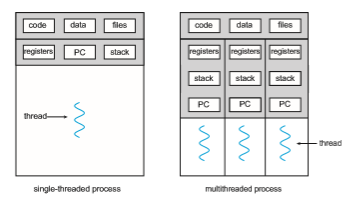
**Figure 4.1** Single-threaded and multithreaded processes.  

Applications can also be designed to leverage processing capabilities on mul- ticore systems. Such applications can perform several CPU-intensive tasks in parallel across the multiple computing cores.

In certain situations, a single application may be required to perform sev- eral similar tasks. For example, a web server accepts client requests for web pages, images, sound, and so forth. A busy web server may have several (per- haps thousands of) clients concurrently accessing it. If the web server ran as a traditional single-threaded process, it would be able to service only one client at a time, and a client might have to wait a very long time for its request to be serviced.

One solution is to have the server run as a single process that accepts requests. When the server receives a request, it creates a separate process to service that request. In fact, this process-creation method was in common use before threads became popular. Process creation is time consuming and resource intensive, however. If the new process will perform the same tasks as the existing process, why incur all that overhead? It is generally more efficient to use one process that contains multiple threads. If the web-server process is multithreaded, the server will create a separate thread that listens for client requests. When a request is made, rather than creating another process, the server creates a new thread to service the request and resumes listening for additional requests. This is illustrated in Figure 4.2.

Most operating system kernels are also typically multithreaded. As an example, during system boot time on Linux systems, several kernel threads are created. Each thread performs a specific task, such as managing devices, memory management, or interrupt handling. The command ps -ef can be used to display the kernel threads on a running Linux system. Examining the output of this command will show the kernel thread kthreadd (with pid = 2), which serves as the parent of all other kernel threads.

Many applications can also take advantage of multiple threads, including basic sorting, trees, and graph algorithms. In addition, programmerswhomust solve contemporary CPU-intensive problems in data mining, graphics, and artificial intelligence can leverage the power of modern multicore systems by designing solutions that run in parallel.


**Figure 4.2** Multithreaded server architecture.  

### Benefits

The benefits of multithreaded programming can be broken down into four major categories:

**1\. Responsiveness**. Multithreading an interactive application may allow a program to continue running even if part of it is blocked or is perform- ing a lengthy operation, thereby increasing responsiveness to the user. This quality is especially useful in designing user interfaces. For instance, consider what happens when a user clicks a button that results in the performance of a time-consuming operation. A single-threaded appli- cation would be unresponsive to the user until the operation had been completed. In contrast, if the time-consuming operation is performed in a separate, asynchronous thread, the application remains responsive to the user.

**2\. Resource sharing**. Processes can share resources only through techniques such as shared memory and message passing. Such techniques must be explicitly arranged by the programmer. However, threads share the memory and the resources of the process towhich they belong by default. The benefit of sharing code and data is that it allows an application to have several different threads of activity within the same address space.

**3\. Economy**. Allocating memory and resources for process creation is costly. Because threads share the resources of the process to which they belong, it is more economical to create and context-switch threads. Empirically gauging the difference in overhead can be difficult, but in general thread creation consumes less time and memory than process creation. Additionally, context switching is typically faster between threads than between processes.

**4\. Scalability.** The benefits of multithreading can be even greater in a mul- tiprocessor architecture, where threads may be running in parallel on different processing cores. A single-threaded process can run on only one processor, regardless how many are available. We explore this issue further in the following section.

## Multicore Programming

Earlier in the history of computer design, in response to the need for more computing performance, single-CPU systems evolved into multi-CPU systems. A later, yet similar, trend in system design is to place multiple computing cores on a single processing chip where each core appears as a separate CPU to the operating system (Section 1.3.2). We refer to such systems as **multicore**, and multithreaded programming provides a mechanism for more efficient use of these multiple computing cores and improved concurrency. Consider an application with four threads. On a system with a single computing core, concurrency merelymeans that the execution of the threads will be interleaved over time (Figure 4.3), because the processing core is capable of executing only one thread at a time. On a system with multiple cores, however, concurrency  

**Figure 4.3** Concurrent execution on a single-core system.

means that some threads can run in parallel, because the system can assign a separate thread to each core (Figure 4.4).

Notice the distinction between **_concurrency_** and **_parallelism_** in this discus- sion. Aconcurrent system supportsmore than one task by allowing all the tasks tomake progress. In contrast, a parallel system can performmore than one task simultaneously. Thus, it is possible to have concurrency without parallelism. Before the advent of multiprocessor and multicore architectures, most com- puter systems had only a single processor, and CPU schedulers were designed to provide the illusion of parallelism by rapidly switching between processes, thereby allowing each process to make progress. Such processes were running concurrently, but not in parallel.

### Programming Challenges

The trend toward multicore systems continues to place pressure on system designers and application programmers to make better use of the multiple computing cores. Designers of operating systems must write scheduling algo- rithms that usemultiple processing cores to allow the parallel execution shown in Figure 4.4. For application programmers, the challenge is to modify existing programs as well as design new programs that are multithreaded.

In general, five areas present challenges in programming for multicore systems:

**1\. Identifying tasks**. This involves examining applications to find areas that can be divided into separate, concurrent tasks. Ideally, tasks are independent of one another and thus can run in parallel on individual cores.

**2\. Balance**. While identifying tasks that can run in parallel, programmers must also ensure that the tasks perform equal work of equal value. In some instances, a certain task may not contribute as much value to the overall process as other tasks. Using a separate execution core to run that task may not be worth the cost.

**Figure 4.4** Parallel execution on a multicore system.  

**_AMDAHL’S LAW_**

Amdahl’s Law is a formula that identifies potential performance gains from adding additional computing cores to an application that has both serial (nonparallel) and parallel components. If _S_ is the portion of the application that must be performed serially on a system with _N_ processing cores, the formula appears as follows:

_speedup_ ≤ 1

_S_ \+ (1−_S_) _N_

As an example, assume we have an application that is 75 percent parallel and 25 percent serial. If we run this application on a system with two processing cores, we can get a speedup of 1.6 times. If we add two additional cores (for a total of four), the speedup is 2.28 times. Below is a graph illustrating Amdahl’s Law in several different scenarios.

One interesting fact about Amdahl’s Law is that as _N_ approaches infinity, the speedup converges to 1∕_S_. For example, if 50 percent of an application is performed serially, the maximum speedup is 2.0 times, regardless of the number of processing coreswe add. This is the fundamental principle behind Amdahl’s Law: the serial portion of an application can have a dispropor- tionate effect on the performance we gain by adding additional computing cores.

**3\. Data splitting**. Just as applications are divided into separate tasks, the data accessed and manipulated by the tasks must be divided to run on separate cores.

**4\. Data dependency**. The data accessed by the tasks must be examined for dependencies between two or more tasks. When one task depends on data from another, programmers must ensure that the execution of the tasks is synchronized to accommodate the data dependency. We examine such strategies in Chapter 6.  

**Figure 4.5** Data and task parallelism.

**5\. Testing and debugging**. When a program is running in parallel on multi- ple cores,many different execution paths are possible. Testing and debug- ging such concurrent programs is inherently more difficult than testing and debugging single-threaded applications.

Because of these challenges,many software developers argue that the advent of multicore systems will require an entirely new approach to designing software systems in the future. (Similarly,many computer science educators believe that software development must be taught with increased emphasis on parallel programming.)

### Types of Parallelism

In general, there are two types of parallelism: data parallelism and task par- allelism. **Data parallelism** focuses on distributing subsets of the same data across multiple computing cores and performing the same operation on each core. Consider, for example, summing the contents of an array of size _N_. On a single-core system, one thread would simply sum the elements \[0\] . . . \[_N_ − 1\]. On a dual-core system, however, thread _A_, running on core 0, could sum the elements \[0\] . . . \[_N_∕2 − 1\] while thread _B_, running on core 1, could sum the elements \[_N_∕2\] . . . \[_N_ − 1\]. The two threads would be running in parallel on separate computing cores.

**Task parallelism** involves distributing not data but tasks (threads) across multiple computing cores. Each thread is performing a unique operation. Dif- ferent threads may be operating on the same data, or theymay be operating on different data. Consider again our example above. In contrast to that situation, an example of task parallelism might involve two threads, each performing a unique statistical operation on the array of elements. The threads again are operating in parallel on separate computing cores, but each is performing a unique operation.

Fundamentally, then, data parallelism involves the distribution of data across multiple cores, and task parallelism involves the distribution of tasks across multiple cores, as shown in Figure 4.5. However, data and task paral-  


**Figure 4.6** User and kernel threads.

lelism are not mutually exclusive, and an application may in fact use a hybrid of these two strategies.

## Multithreading Models

Our discussion so far has treated threads in a generic sense. However, support for threads may be provided either at the user level, for **user threads**, or by the kernel, for **kernel threads**. User threads are supported above the kernel and are managed without kernel support, whereas kernel threads are supported and managed directly by the operating system. Virtually all contemporary operating systems—including Windows, Linux, and macOS— support kernel threads.

Ultimately, a relationship must exist between user threads and kernel threads, as illustrated in Figure 4.6. In this section, we look at three common ways of establishing such a relationship: the many-to-one model, the one-to- one model, and the many-to-many model.

### Many-to-One Model

The many-to-one model (Figure 4.7) maps many user-level threads to one kernel thread. Thread management is done by the thread library in user space, so it is efficient (we discuss thread libraries in Section 4.4). However, the entire process will block if a thread makes a blocking system call. Also, because only
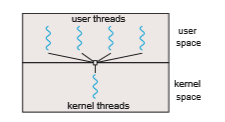
**Figure 4.7** Many-to-one model.  

**Figure 4.8** One-to-one model.

one thread can access the kernel at a time, multiple threads are unable to run in parallel on multicore systems. **Green threads**—a thread library available for Solaris systems and adopted in early versions of Java—used the many-to- one model. However, very few systems continue to use the model because of its inability to take advantage of multiple processing cores, which have now become standard on most computer systems.

### One-to-One Model

The one-to-one model (Figure 4.8) maps each user thread to a kernel thread. It provides more concurrency than the many-to-one model by allowing another thread to run when a thread makes a blocking system call. It also allows mul- tiple threads to run in parallel on multiprocessors. The only drawback to this model is that creating a user thread requires creating the corresponding kernel thread, and a large number of kernel threads may burden the performance of a system. Linux, along with the family of Windows operating systems, imple- ment the one-to-one model.

### Many-to-Many Model

The many-to-many model (Figure 4.9) multiplexes many user-level threads to a smaller or equal number of kernel threads. The number of kernel threads may be specific to either a particular application or a particular machine (an application may be allocated more kernel threads on a system with eight processing cores than a system with four cores).

**Figure 4.9** Many-to-many model.  
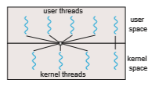
**Figure 4.10** Two-level model.

Let’s consider the effect of this design on concurrency. Whereas the many- to-one model allows the developer to create as many user threads as she wishes, it does not result in parallelism, because the kernel can schedule only one kernel thread at a time. The one-to-one model allows greater concurrency, but the developer has to be careful not to create too many threads within an application. (In fact, on some systems, she may be limited in the number of threads she can create.) The many-to-many model suffers from neither of these shortcomings: developers can create as many user threads as necessary, and the corresponding kernel threads can run in parallel on a multiprocessor. Also, when a thread performs a blocking system call, the kernel can schedule another thread for execution.

One variation on the many-to-many model still multiplexes many user- level threads to a smaller or equal number of kernel threads but also allows a user-level thread to be bound to a kernel thread. This variation is sometimes referred to as the **two-level model** (Figure 4.10).

Although the many-to-many model appears to be the most flexible of the models discussed, in practice it is difficult to implement. In addition, with an increasing number of processing cores appearing on most systems, limiting the number of kernel threads has become less important. As a result, most operating systems now use the one-to-one model. However, as we shall see in Section 4.5, some contemporary concurrency libraries have developers identify tasks that are then mapped to threads using the many-to-many model.

## Thread Libraries

A **thread library** provides the programmer with an API for creating and man- aging threads. There are two primary ways of implementing a thread library. The first approach is to provide a library entirely in user space with no kernel support. All code and data structures for the library exist in user space. This means that invoking a function in the library results in a local function call in user space and not a system call.

The second approach is to implement a kernel-level library supported directly by the operating system. In this case, code and data structures for the library exist in kernel space. Invoking a function in the API for the library typically results in a system call to the kernel.  

Three main thread libraries are in use today: POSIX Pthreads,Windows, and Java. Pthreads, the threads extension of the POSIX standard, may be provided as either a user-level or a kernel-level library. The Windows thread library is a kernel-level library available on Windows systems. The Java thread API allows threads to be created andmanaged directly in Java programs. However, because inmost instances the JVM is running on top of a host operating system, the Java thread API is generally implemented using a thread library available on the host system. Thismeans that onWindows systems, Java threads are typ- ically implemented using the Windows API; UNIX, Linux, and macOS systems typically use Pthreads.

For POSIX and Windows threading, any data declared globally—that is, declared outside of any function—are shared among all threads belonging to the same process. Because Java has no equivalent notion of global data, access to shared data must be explicitly arranged between threads.

In the remainder of this section, we describe basic thread creation using these three thread libraries. As an illustrative example, we design a multi- threaded program that performs the summation of a non-negative integer in a separate thread using the well-known summation function:

_sum_ \= _N_∑

_i_\=1 _i_

For example, if _N_ were 5, this function would represent the summation of integers from 1 to 5, which is 15. Each of the three programs will be run with the upper bounds of the summation entered on the command line. Thus, if the user enters 8, the summation of the integer values from 1 to 8 will be output.

Before we proceed with our examples of thread creation, we introduce two general strategies for creating multiple threads: **asynchronous threading** and **synchronous threading**. With asynchronous threading, once the parent creates a child thread, the parent resumes its execution, so that the parent and child execute concurrently and independently of one another. Because the threads are independent, there is typically little data sharing between them.Asynchronous threading is the strategy used in themultithreaded server illustrated in Figure 4.2 and is also commonly used for designing responsive user interfaces.

Synchronous threading occurs when the parent thread creates one or more children and thenmustwait for all of its children to terminate before it resumes. Here, the threads created by the parent perform work concurrently, but the parent cannot continue until this work has been completed. Once each thread has finished itswork, it terminates and joinswith its parent. Only after all of the children have joined can the parent resume execution. Typically, synchronous threading involves significant data sharing among threads. For example, the parent thread may combine the results calculated by its various children. All of the following examples use synchronous threading.

### Pthreads

**Pthreads** refers to the POSIX standard (IEEE 1003.1c) defining an API for thread creation and synchronization. This is a **_specification_** for thread behavior, not an **_implementation_**. Operating-systemdesignersmay implement the specification  


**Figure 4.11** Multithreaded C program using the Pthreads API.

in any way they wish. Numerous systems implement the Pthreads specifica- tion; most are UNIX-type systems, including Linux and macOS. AlthoughWin- dows doesn’t support Pthreads natively, some third-party implementations for Windows are available.

The C program shown in Figure 4.11 demonstrates the basic Pthreads API for constructing a multithreaded program that calculates the summation of a non-negative integer in a separate thread. In a Pthreads program, separate threads begin execution in a specified function. In Figure 4.11, this is the run- ner() function. When this program begins, a single thread of control begins in  

**Figure 4.12** Pthread code for joining ten threads.

main(). After some initialization, main() creates a second thread that begins control in the runner() function. Both threads share the global data sum.

Let’s look more closely at this program. All Pthreads programs must include the pthread.h header file. The statement pthread t tid declares the identifier for the thread we will create. Each thread has a set of attributes, including stack size and scheduling information. The pthread attr t attr declaration represents the attributes for the thread. We set the attributes in the function call pthread attr init(&attr). Because we did not explicitly set any attributes, we use the default attributes provided. (In Chapter 5, we discuss some of the scheduling attributes provided by the Pthreads API.) A separate thread is created with the pthread create() function call. In addi- tion to passing the thread identifier and the attributes for the thread, we also pass the name of the function where the new thread will begin execution—in this case, the runner() function. Last, we pass the integer parameter that was provided on the command line, argv\[1\].

At this point, the program has two threads: the initial (or parent) thread in main() and the summation (or child) thread performing the summation oper- ation in the runner() function. This program follows the thread create/join strategy, whereby after creating the summation thread, the parent thread will wait for it to terminate by calling the pthread join() function. The summa- tion threadwill terminatewhen it calls the function pthread exit(). Once the summation thread has returned, the parent thread will output the value of the shared data sum.

This example program creates only a single thread. With the growing dominance of multicore systems, writing programs containing several threads has become increasingly common. A simple method for waiting on several threads using the pthread join() function is to enclose the operation within a simple for loop. For example, you can join on ten threads using the Pthread code shown in Figure 4.12.

### Windows Threads

The technique for creating threads using theWindows thread library is similar to the Pthreads technique in several ways. We illustrate the Windows thread API in the C program shown in Figure 4.13. Notice that we must include the windows.h header file when using the Windows API.  


**Figure 4.13** Multithreaded C program using the Windows API.

Just as in the Pthreads version shown in Figure 4.11, data shared by the separate threads—in this case, Sum—are declared globally (the DWORD data type is an unsigned 32-bit integer). We also define the Summation() function that is to be performed in a separate thread. This function is passed a pointer to a void, which Windows defines as LPVOID. The thread performing this function sets the global data Sum to the value of the summation from 0 to the parameter passed to Summation().  

Threads are created in the Windows API using the CreateThread() func- tion, and—just as in Pthreads—a set of attributes for the thread is passed to this function. These attributes include security information, the size of the stack, and a flag that can be set to indicate if the thread is to start in a suspended state. In this program, we use the default values for these attributes. (The default values do not initially set the thread to a suspended state and instead make it eligible to be run by the CPU scheduler.) Once the summation thread is created, the parent must wait for it to complete before outputting the value of Sum, as the value is set by the summation thread. Recall that the Pthread program (Figure 4.11) had the parent thread wait for the summation thread using the pthread join() statement. We perform the equivalent of this in the Windows API using the WaitForSingleObject() function, which causes the creating thread to block until the summation thread has exited.

In situations that require waiting for multiple threads to complete, the WaitForMultipleObjects() function is used. This function is passed four parameters:

**1\.** The number of objects to wait for

**2\.** Apointer to the array of objects

**3\.** Aflag indicating whether all objects have been signaled

**4\.** A timeout duration (or INFINITE)

For example, if THandles is an array of thread HANDLE objects of size N, the parent thread can wait for all its child threads to complete with this statement:

WaitForMultipleObjects(N, THandles, TRUE, INFINITE);

### Java Threads

Threads are the fundamental model of program execution in a Java program, and the Java language and its API provide a rich set of features for the creation and management of threads. All Java programs comprise at least a single thread of control—even a simple Java program consisting of only a main() method runs as a single thread in the JVM. Java threads are available on any system that provides a JVM including Windows, Linux, and macOS. The Java thread API is available for Android applications as well.

There are two techniques for explicitly creating threads in a Java program. One approach is to create a new class that is derived from the Thread class and to override its run()method. An alternative—and more commonly used —technique is to define a class that implements the Runnable interface. This interface defines a single abstract method with the signature public void run(). The code in the run() method of a class that implements Runnable is what executes in a separate thread. An example is shown below:

class Task implements Runnable _{_

public void **run**() _{_ System.out.println("I am a thread.");

_} }_  

**_LAMBDAEXPRESSIONS IN JAVA_**

Beginning with Version 1.8 of the language, Java introduced Lambda expres- sions, which allow a much cleaner syntax for creating threads. Rather than defining a separate class that implements Runnable, a Lambda expression can be used instead:

Runnable task = () -> _{_ System.out.println("I am a thread.");

_}_;

Thread worker = new Thread(task); worker.start();

Lambda expressions—as well as similar functions known as **closures**—are a prominent feature of functional programming languages and have been available in several nonfunctional languages as well including Python, C++, and C#. As we shall see in later examples in this chapter, Lamdba expressions often provide a simple syntax for developing parallel applications.

Thread creation in Java involves creating a Thread object and passing it an instance of a class that implements Runnable, followed by invoking the start()method on the Thread object. This appears in the following example:

Thread worker = new Thread(new Task()); worker.**start**();

Invoking the start()method for the new Thread object does two things:

**1\.** It allocates memory and initializes a new thread in the JVM.

**2\.** It calls the run()method,making the thread eligible to be run by the JVM. (Note again that we never call the run()method directly. Rather, we call the start()method, and it calls the run()method on our behalf.)

Recall that the parent threads in the Pthreads and Windows libraries use pthread join() and WaitForSingleObject() (respectively) to wait for the summation threads to finish before proceeding. The join() method in Java provides similar functionality. (Notice that join() can throw an Interrupt- edException, which we choose to ignore.)

try _{_ worker.**join**();

_}_ catch (InterruptedException ie) _{ }_

If the parent must wait for several threads to finish, the join()method can be enclosed in a for loop similar to that shown for Pthreads in Figure 4.12.  


#### Java Executor Framework

Java has supported thread creation using the approachwe have described thus far since its origins. However, beginning with Version 1.5 and its API, Java introduced several new concurrency features that provide developers with much greater control over thread creation and communication. These tools are available in the java.util.concurrent package.

Rather than explicitly creating Thread objects, thread creation is instead organized around the Executor interface:

public interface Executor _{_

void execute(Runnable command); _}_

Classes implementing this interfacemust define the execute()method,which is passed a Runnable object. For Java developers, this means using the Execu- tor rather than creating a separate Thread object and invoking its start() method. The Executor is used as follows:

Executor service = new _Executor_; service.**execute**(new Task());

The Executor framework is based on the producer-consumermodel; tasks implementing the Runnable interface are produced, and the threads that exe- cute these tasks consume them. The advantage of this approach is that it not only divides thread creation from execution but also provides a mechanism for communication between concurrent tasks.

Data sharing between threads belonging to the same process occurs easily in Windows and Pthreads, since shared data are simply declared globally. As a pure object-oriented language, Java has no such notion of global data. We can pass parameters to a class that implements Runnable, but Java threads cannot return results. To address this need, the java.util.concurrent pack- age additionally defines the Callable interface, which behaves similarly to Runnable except that a result can be returned. Results returned from Callable tasks are known as Future objects. A result can be retrieved from the get() method defined in the Future interface. The program shown in Figure 4.14 illustrates the summation program using these Java features.

The Summation class implements the Callable interface, which specifies the method V call()—it is the code in this call() method that is executed in a separate thread. To execute this code, we create a newSingleThreadEx- ecutor object (provided as a static method in the Executors class), which is of type ExecutorService, and pass it a Callable task using its submit() method. (The primary difference between the execute() and submit()meth- ods is that the former returns no result, whereas the latter returns a result as a Future.) Once we submit the callable task to the thread, we wait for its result by calling the get()method of the Future object it returns.

It is quite easy to notice at first that this model of thread creation appears more complicated than simply creating a thread and joining on its termination. However, incurring this modest degree of complication confers benefits. Aswe have seen, using Callable and Future allows for threads to return results.  

**Figure 4.14** Illustration of Java Executor framework API.

Additionally, this approach separates the creation of threads from the results they produce: rather than waiting for a thread to terminate before retrieving results, the parent instead onlywaits for the results to become available. Finally, as we shall see in Section 4.5.1, this framework can be combined with other features to create robust tools for managing a large number of threads.

## Implicit Threading

With the continued growth of multicore processing, applications contain- ing hundreds—or even thousands—of threads are looming on the horizon. Designing such applications is not a trivial undertaking: programmers must  

**_THE JVM AND THE HOST OPERATING SYSTEM_**

The JVM is typically implemented on top of a host operating system (see Figure 18.10). This setup allows the JVM to hide the implementation details of the underlying operating system and to provide a consistent, abstract environment that allows Java programs to operate on any platform that supports a JVM. The specification for the JVM does not indicate how Java threads are to bemapped to the underlying operating system, instead leaving that decision to the particular implementation of the JVM. For example, the Windows operating system uses the one-to-one model; therefore, each Java thread for a JVM running on Windows maps to a kernel thread. In addition, there may be a relationship between the Java thread library and the thread library on the host operating system. For example, implementations of a JVM for the Windows family of operating systems might use the Windows API when creating Java threads; Linux andmacOS systemsmight use the Pthreads API.

address not only the challenges outlined in Section 4.2 but additional difficul- ties as well. These difficulties, which relate to program correctness, are covered in Chapter 6 and Chapter 8.

One way to address these difficulties and better support the design of con- current and parallel applications is to transfer the creation and management of threading from application developers to compilers and run-time libraries. This strategy, termed **implicit threading**, is an increasingly popular trend. In this section, we explore four alternative approaches to designing applications that can take advantage of multicore processors through implicit threading. As we shall see, these strategies generally require application developers to identify **_tasks_**—not threads—that can run in parallel. A task is usually writ- ten as a function, which the run-time library then maps to a separate thread, typically using the many-to-many model (Section 4.3.3). The advantage of this approach is that developers only need to identify parallel tasks, and the libraries determine the specific details of thread creation and management.

### Thread Pools

In Section 4.1, we described a multithreaded web server. In this situation, whenever the server receives a request, it creates a separate thread to service the request.Whereas creating a separate thread is certainly superior to creating a separate process, a multithreaded server nonetheless has potential problems. The first issue concerns the amount of time required to create the thread, together with the fact that the thread will be discarded once it has completed its work. The second issue is more troublesome. If we allow each concurrent request to be serviced in a new thread, we have not placed a bound on the number of threads concurrently active in the system. Unlimited threads could exhaust system resources, such as CPU time or memory. One solution to this problem is to use a **thread pool**.  

**_ANDROID THREAD POOLS_**

In Section 3.8.2.1, we covered RPCs in the Android operating system. You may recall from that section that Android uses the Android Interface Defi- nition Language (AIDL), a tool that specifies the remote interface that clients interactwith on the server. AIDLalso provides a thread pool. Aremote service using the thread pool can handlemultiple concurrent requests, servicing each request using a separate thread from the pool.

The general idea behind a thread pool is to create a number of threads at start-up and place them into a pool, where they sit and wait for work. When a server receives a request, rather than creating a thread, it instead submits the request to the thread pool and resumes waiting for additional requests. If there is an available thread in the pool, it is awakened, and the request is serviced immediately. If the pool contains no available thread, the task is queued until one becomes free. Once a thread completes its service, it returns to the pool and awaits more work. Thread pools work well when the tasks submitted to the pool can be executed asynchronously.

Thread pools offer these benefits:

**1\.** Servicing a request with an existing thread is often faster than waiting to create a thread.

**2\.** Athreadpool limits the number of threads that exist at any one point. This is particularly important on systems that cannot support a large number of concurrent threads.

**3\.** Separating the task to be performed from the mechanics of creating the task allows us to use different strategies for running the task. For example, the task could be scheduled to execute after a time delay or to execute periodically.

The number of threads in the pool can be set heuristically based on factors such as the number of CPUs in the system, the amount of physical memory, and the expected number of concurrent client requests. More sophisticated thread- pool architectures can dynamically adjust the number of threads in the pool according to usage patterns. Such architectures provide the further benefit of having a smaller pool—thereby consuming less memory—when the load on the system is low. We discuss one such architecture, Apple’s Grand Central Dispatch, later in this section.

TheWindows API provides several functions related to thread pools. Using the thread pool API is similar to creating a thread with the Thread Create() function, as described in Section 4.4.2. Here, a function that is to run as a separate thread is defined. Such a function may appear as follows:

DWORD WINAPI PoolFunction(PVOID Param) _{_ /\* this function runs as a separate thread. \*/

_}_  


A pointer to PoolFunction() is passed to one of the functions in the thread pool API, and a thread from the pool executes this function. One such member in the thread pool API is the QueueUserWorkItem() function, which is passed three parameters:

• LPTHREAD START ROUTINE Function—a pointer to the function that is to run as a separate thread

• PVOID Param—the parameter passed to Function

• ULONG Flags—flags indicating how the thread pool is to create and man- age execution of the thread

An example of invoking a function is the following:

QueueUserWorkItem(&PoolFunction, NULL, 0);

This causes a thread from the thread pool to invoke PoolFunction() on behalf of the programmer. In this instance, we pass no parameters to PoolFunc- tion(). Because we specify 0 as a flag, we provide the thread pool with no special instructions for thread creation.

Other members in the Windows thread pool API include utilities that invoke functions at periodic intervals or when an asynchronous I/O request completes.

#### Java Thread Pools

The java.util.concurrent package includes an API for several varieties of thread-pool architectures. Here, we focus on the following three models:

**1\.** Single thread executor—newSingleThreadExecutor()—creates a pool of size 1.

**2\.** Fixed thread executor—newFixedThreadPool(int size)—creates a thread pool with a specified number of threads.

**3\.** Cached thread executor—newCachedThreadPool()—creates an unbounded thread pool, reusing threads in many instances.

We have, in fact, already seen the use of a Java thread pool in Section 4.4.3, wherewe created a newSingleThreadExecutor in the program example shown in Figure 4.14. In that section, we noted that the Java executor frame- work can be used to construct more robust threading tools. We now describe how it can be used to create thread pools.

A thread pool is created using one of the factorymethods in the Executors class:

• static ExecutorService newSingleThreadExecutor()

• static ExecutorService newFixedThreadPool(int size)

• static ExecutorService newCachedThreadPool()

Each of these factorymethods creates and returns an object instance that imple- ments the ExecutorService interface. ExecutorService extends the Execu-  
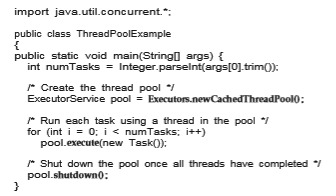
**Figure 4.15** Creating a thread pool in Java.

tor interface, allowing us to invoke the execute() method on this object. In addition, ExecutorService provides methods for managing termination of the thread pool.

The example shown in Figure 4.15 creates a cached threadpool and submits tasks to be executedby a thread in the pool using the execute()method.When the shutdown()method is invoked, the thread pool rejects additional tasks and shuts down once all existing tasks have completed execution.

### Fork Join

The strategy for thread creation covered in Section 4.4 is often known as the **fork-join** model. Recall that with this method, the main parent thread creates (**_forks_**) one or more child threads and then waits for the children to terminate and **_join_** with it, at which point it can retrieve and combine their results. This synchronous model is often characterized as explicit thread creation, but it is also an excellent candidate for implicit threading. In the latter situation, threads are not constructed directly during the fork stage; rather, parallel tasks are designated. This model is illustrated in Figure 4.16. A library manages the number of threads that are created and is also responsible for assigning tasks to threads. In some ways, this fork-join model is a synchronous version of thread pools in which a library determines the actual number of threads to create— for example, by using the heuristics described in Section 4.5.1.

#### Fork Join in Java

Java introduced a fork-join library in Version 1.7 of the API that is designed to be used with recursive divide-and-conquer algorithms such as Quicksort andMergesort.When implementingdivide-and-conquer algorithms using this  
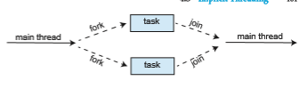
**Figure 4.16** Fork-join parallelism.

library, separate tasks are forked during the divide step and assigned smaller subsets of the original problem. Algorithms must be designed so that these separate tasks can execute concurrently. At some point, the size of the problem assigned to a task is small enough that it can be solved directly and requires creating no additional tasks. The general recursive algorithm behind Java’s fork-join model is shown below:

Task(problem) if problem is small enough

solve the problem directly else

subtask1 = fork(new Task(subset of problem) subtask2 = fork(new Task(subset of problem)

result1 = join(subtask1) result2 = join(subtask2)

return combined results

Figure 4.17 depicts the model graphically. We now illustrate Java’s fork-join strategy by designing a divide-and-

conquer algorithm that sums all elements in an array of integers. In Version 1.7 of the API Java introduced a new thread pool—the ForkJoinPool—that can be assigned tasks that inherit the abstract base class ForkJoinTask (which for now we will assume is the SumTask class). The following creates a ForkJoin- Pool object and submits the initial task via its invoke()method:

ForkJoinPool pool = new ForkJoinPool(); // array contains the integers to be summed int\[\] array = new int\[SIZE\];

SumTask task = new SumTask(0, SIZE - 1, array); int sum = pool.invoke(task);

Upon completion, the initial call to invoke() returns the summation of array. The class SumTask—shown in Figure 4.18—implements a divide-and-

conquer algorithm that sums the contents of the array using fork-join. New tasks are created using the fork()method, and the compute()method speci- fies the computation that is performed by each task. The method compute() is invoked until it can directly calculate the sum of the subset it is assigned. The  
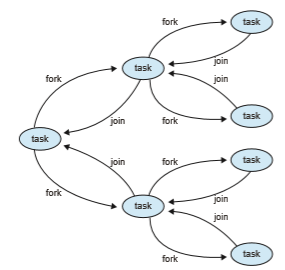
**Figure 4.17** Fork-join in Java.

call to join() blocks until the task completes, upon which join() returns the results calculated in compute().

Notice that SumTask in Figure 4.18 extends RecursiveTask. The Java fork- join strategy is organized around the abstract base class ForkJoinTask, and the RecursiveTask and RecursiveAction classes extend this class. The fun- damental difference between these two classes is that RecursiveTask returns a result (via the return value specified in compute()), and RecursiveAction does not return a result. The relationship between the three classes is illustrated in the UML class diagram in Figure 4.19.

An important issue to consider is determining when the problem is “small enough” to be solved directly and no longer requires creating additional tasks. In SumTask, this occurs when the number of elements being summed is less than the value THRESHOLD, which in Figure 4.18we have arbitrarily set to 1,000. In practice, determiningwhen a problem can be solved directly requires careful timing trials, as the value can vary according to implementation.

What is interesting in Java’s fork-join model is the management of tasks wherein the library constructs a pool of worker threads and balances the load of tasks among the available workers. In some situations, there are thousands of tasks, yet only a handful of threads performing the work (for example, a separate thread for each CPU). Additionally, each thread in a ForkJoinPool maintains a queue of tasks that it has forked, and if a thread’s queue is empty, it can steal a task from another thread’s queue using a**_work stealing_** algorithm, thus balancing the workload of tasks among all threads.  

**Figure 4.18** Fork-join calculation using the Java API.

### OpenMP

OpenMP is a set of compiler directives as well as an API for programswritten in C, C++, or FORTRAN that provides support for parallel programming in shared- memory environments. OpenMP identifies **parallel regions** as blocks of code that may run in parallel. Application developers insert compiler directives into their code at parallel regions, and these directives instruct the OpenMP run-  

**Figure 4.19** UML class diagram for Java’s fork-join.

time library to execute the region in parallel. The following C program illus- trates a compiler directive above the parallel region containing the printf() statement:
```
#include _<_omp.h_\>_ #include _<_stdio.h_\>_

int main(int argc, char \*argv\[\]) _{_

/\* sequential code \*/

#pragma omp parallel _{_

printf("I am a parallel region."); _}_

/\* sequential code \*/

return 0; _}_
```
When OpenMP encounters the directive
```
#pragma omp parallel
```
it creates as many threads as there are processing cores in the system. Thus, for a dual-core system, two threads are created; for a quad-core system, four are created; and so forth. All the threads then simultaneously execute the parallel region. As each thread exits the parallel region, it is terminated.

OpenMP provides several additional directives for running code regions in parallel, including parallelizing loops. For example, assume we have two arrays, a and b, of size N. We wish to sum their contents and place the results  

in array c. We can have this task run in parallel by using the following code segment, which contains the compiler directive for parallelizing for loops:

pragma omp parallel for for (i = 0; i < N; i++) _{_
c[i] = a[i] + b[i]; _}_

OpenMP divides the work contained in the for loop among the threads it has created in response to the directive pragma omp parallel for

In addition to providing directives for parallelization, OpenMP allows developers to choose among several levels of parallelism. For example, they can set the number of threads manually. It also allows developers to identify whether data are shared between threads or are private to a thread. OpenMP is available on several open-source and commercial compilers for Linux, Win- dows, and macOS systems. We encourage readers interested in learning more about OpenMP to consult the bibliography at the end of the chapter.

### Grand Central Dispatch

Grand Central Dispatch (GCD) is a technology developed by Apple for its macOS and iOS operating systems. It is a combination of a run-time library, an API, and language extensions that allow developers to identify sections of code (**_tasks_**) to run in parallel. Like OpenMP, GCD manages most of the details of threading.

GCD schedules tasks for run-time execution by placing them on a **dispatch queue**. When it removes a task from a queue, it assigns the task to an available thread from a pool of threads that it manages. GCD identifies two types of dispatch queues: **_serial_** and **_concurrent_**.

Tasks placed on a serial queue are removed in FIFO order. Once a task has been removed from the queue, it must complete execution before another task is removed. Each process has its own serial queue (known as its **main queue**), and developers can create additional serial queues that are local to a particular process. (This is why serial queues are also known as **_private dispatch queues_**.) Serial queues are useful for ensuring the sequential execution of several tasks.

Tasks placed on a concurrent queue are also removed in FIFO order, but several tasksmay be removed at a time, thus allowingmultiple tasks to execute in parallel. There are several system-wide concurrent queues (also known as **_global dispatch queues_**), which are divided into four primary quality-of-service classes:

• QOS CLASS USER INTERACTIVE—The **user-interactive** class represents tasks that interact with the user, such as the user interface and event handling, to ensure a responsive user interface. Completing a task belonging to this class should require only a small amount of work.

• QOS CLASS USER INITIATED—The **user-initiated** class is similar to the user-interactive class in that tasks are associated with a responsive user interface; however, user-initiated tasks may require longer processing times. Opening a file or a URL is a user-initiated task, for example. Tasks belonging to this class must be completed for the user to continue inter- acting with the system, but they do not need to be serviced as quickly as tasks in the user-interactive queue.

• QOS CLASS UTILITY —The **utility** class represents tasks that require a longer time to complete but do not demand immediate results. This class includes work such as importing data.

• QOS CLASS BACKGROUND —Tasks belonging to the **background** class are not visible to the user and are not time sensitive. Examples include index- ing a mailbox system and performing backups.

Tasks submitted to dispatch queues may be expressed in one of two different ways:

**1\.** For the C, C++, and Objective-C languages, GCD identifies a language extension known as a **block**, which is simply a self-contained unit of work. A block is specified by a caret ˆ inserted in front of a pair of braces _{ }_. Code within the braces identifies the unit of work to be performed. A simple example of a block is shown below:

^_{_ printf("I am a block"); _}_

**2\.** For the Swift programming language, a task is defined using a **_closure_**, which is similar to a block in that it expresses a self-contained unit of functionality. Syntactically, a Swift closure is written in the same way as a block, minus the leading caret.

The following Swift code segment illustrates obtaining a concurrent queue for the user-initiated class and submitting a task to the queue using the dispatch async() function:

let queue = dispatch get global queue (QOS CLASS USER INITIATED, 0)

dispatch async(queue,_{_ print("I am a closure.") _}_)

Internally, GCD’s thread pool is composed of POSIX threads. GCD actively manages the pool, allowing the number of threads to grow and shrink accord- ing to application demand and system capacity. GCD is implemented by the libdispatch library, which Apple has released under the Apache Commons license. It has since been ported to the FreeBSD operating system.

### Intel Thread Building Blocks

Intel threading building blocks (TBB) is a template library that supports design- ing parallel applications in C++. As this is a library, it requires no special compiler or language support. Developers specify tasks that can run in parallel, and the TBB task scheduler maps these tasks onto underlying threads. Furthermore, the task scheduler provides load balancing and is cache aware, meaning that it will give precedence to tasks that likely have their data stored in cache memory and thus will execute more quickly. TBB provides a rich set of features, including templates for parallel loop structures, atomic operations, and mutual exclusion locking. In addition, it provides concurrent data struc- tures, including a hash map, queue, and vector, which can serve as equivalent thread-safe versions of the C++ standard template library data structures.

Let’s use parallel for loops as an example. Initially, assume there is a func- tion named apply(float value) that performs an operation on the parameter value. If we had an array v of size n containing float values, we could use the following serial for loop to pass each value in v to the apply() function:

for (int i = 0; i < n; i++) _{_ apply(v\[i\]);

_}_

A developer could manually apply data parallelism (Section 4.2.2) on a multicore system by assigning different regions of the array v to each pro- cessing core; however, this ties the technique for achieving parallelism closely to the physical hardware, and the algorithm would have to be modified and recompiled for the number of processing cores on each specific architecture.

Alternatively, a developer could use TBB, which provides a parallel for template that expects two values:

parallel for (**_range body_** )

where **_range_** refers to the range of elements that will be iterated (known as the **iteration space**) and **_body_** specifies an operation that will be performed on a subrange of elements.

We can now rewrite the above serial for loop using the TBB parallel for template as follows:

parallel for (size t(0), n, \[=\](size t i) _{_apply(v\[i\]);_}_);

The first two parameters specify that the iteration space is from 0 to _n_−1 (which corresponds to the number of elements in the array v). The second parameter is a C++ lambda function that requires a bit of explanation. The expression \[=\](size t i) is the parameter i, which assumes each of the values over the iteration space (in this case from 0 to �� − 1). Each value of i is used to identify which array element in v is to be passed as a parameter to the apply(v\[i\]) function.

The TBB library will divide the loop iterations into separate “chunks” and create a number of tasks that operate on those chunks. (The parallel for function allows developers to manually specify the size of the chunks if they wish to.) TBB will also create a number of threads and assign tasks to available threads. This is quite similar to the fork-join library in Java. The advantage of this approach is that it requires only that developers identify what operations can run in parallel (by specifying a parallel for loop), and the library manages the details involved in dividing the work into separate tasks that run in parallel. Intel TBB has both commercial and open-source versions that run on Windows, Linux, and macOS. Refer to the bibliography for further details on how to develop parallel applications using TBB.

## Threading Issues

In this section, we discuss some of the issues to consider in designing multi- threaded programs.

### The fork() and exec() System Calls

In Chapter 3, we described how the fork() system call is used to create a separate, duplicate process. The semantics of the fork() and exec() system calls change in a multithreaded program.

If one thread in a program calls fork(), does the new process duplicate all threads, or is the new process single-threaded? Some UNIX systems have chosen to have two versions of fork(), one that duplicates all threads and another that duplicates only the thread that invoked the fork() system call.

The exec() system call typically works in the same way as described in Chapter 3. That is, if a thread invokes the exec() system call, the program specified in the parameter to exec()will replace the entire process—including all threads.

Which of the two versions of fork() to use depends on the application. If exec() is called immediately after forking, then duplicating all threads is unnecessary, as the program specified in the parameters to exec()will replace the process. In this instance, duplicating only the calling thread is appropri- ate. If, however, the separate process does not call exec() after forking, the separate process should duplicate all threads.

### Signal Handling

A **signal** is used in UNIX systems to notify a process that a particular event has occurred. A signal may be received either synchronously or asynchronously, depending on the source of and the reason for the event being signaled. All signals, whether synchronous or asynchronous, follow the same pattern:

**1\.** A signal is generated by the occurrence of a particular event.

**2\.** The signal is delivered to a process.

**3\.** Once delivered, the signal must be handled.

Examples of synchronous signals include illegal memory access and divi- sion by 0. If a running program performs either of these actions, a signal is gen- erated. Synchronous signals are delivered to the same process that performed the operation that caused the signal (that is the reason they are considered synchronous).

When a signal is generated by an event external to a running process, that process receives the signal asynchronously. Examples of such signals include terminating a process with specific keystrokes (such as _<_control_\><_C_\>_) and  
having a timer expire. Typically, an asynchronous signal is sent to another process.

A signal may be **_handled_** by one of two possible handlers:

**1\.** Adefault signal handler

**2\.** Auser-defined signal handler

Every signal has a **default signal handler** that the kernel runs when han- dling that signal. This default action can be overridden by a **user-define signal handler** that is called to handle the signal. Signals are handled in differ- ent ways. Some signals may be ignored, while others (for example, an illegal memory access) are handled by terminating the program.

Handling signals in single-threaded programs is straightforward: signals are always delivered to a process. However, delivering signals is more compli- cated in multithreaded programs, where a process may have several threads. Where, then, should a signal be delivered?

In general, the following options exist:

**1\.** Deliver the signal to the thread to which the signal applies.

**2\.** Deliver the signal to every thread in the process.

**3\.** Deliver the signal to certain threads in the process.

**4\.** Assign a specific thread to receive all signals for the process.

Themethod for delivering a signal depends on the type of signal generated. For example, synchronous signals need to be delivered to the thread causing the signal and not to other threads in the process. However, the situation with asynchronous signals is not as clear. Some asynchronous signals—such as a signal that terminates a process (_<_control_\><_C_\>_, for example)—should be sent to all threads.

The standard UNIX function for delivering a signal is

kill(pid t pid, int signal)

This function specifies the process (pid) towhich a particular signal (signal) is to be delivered.Most multithreaded versions of UNIX allow a thread to specify which signals it will accept and which it will block. Therefore, in some cases, an asynchronous signal may be delivered only to those threads that are not blocking it. However, because signals need to be handled only once, a signal is typically delivered only to the first thread found that is not blocking it. POSIX Pthreads provides the following function, which allows a signal to be delivered to a specified thread (tid):

pthread kill(pthread t tid, int signal)

Although Windows does not explicitly provide support for signals, it allows us to emulate them using **asynchronous procedure calls** (**APCs**). The APC facility enables a user thread to specify a function that is to be called when the user thread receives notification of a particular event. As indicated 
by its name, an APC is roughly equivalent to an asynchronous signal in UNIX. However, whereas UNIX must contend with how to deal with signals in a mul- tithreaded environment, the APC facility is more straightforward, since an APC is delivered to a particular thread rather than a process.

### Thread Cancellation

**Thread cancellation** involves terminating a thread before it has completed. For example, if multiple threads are concurrently searching through a database and one thread returns the result, the remaining threads might be canceled. Another situation might occur when a user presses a button on a web browser that stops a web page from loading any further. Often, a web page loads using several threads—each image is loaded in a separate thread. When a user presses the stop button on the browser, all threads loading the page are canceled.

A thread that is to be canceled is often referred to as the **target thread**. Cancellation of a target thread may occur in two different scenarios:

**1\. Asynchronous cancellation**. One thread immediately terminates the tar- get thread.

**2\. Deferred cancellation**. The target thread periodically checks whether it should terminate, allowing it an opportunity to terminate itself in an orderly fashion.

The difficulty with cancellation occurs in situations where resources have been allocated to a canceled thread or where a thread is canceled while in the midst of updating data it is sharing with other threads. This becomes especially troublesome with asynchronous cancellation. Often, the operating system will reclaim system resources from a canceled thread but will not reclaim all resources. Therefore, canceling a thread asynchronously may not free a necessary system-wide resource.

With deferred cancellation, in contrast, one thread indicates that a target thread is to be canceled, but cancellation occurs only after the target thread has checked a flag to determine whether or not it should be canceled. The thread can perform this check at a point at which it can be canceled safely.

In Pthreads, thread cancellation is initiated using the pthread cancel() function. The identifier of the target thread is passed as a parameter to the func- tion. The following code illustrates creating—and then canceling—a thread:

pthread t tid;

/\* create the thread \*/ pthread create(&tid, 0, worker, NULL);

. . .

/\* cancel the thread \*/ **pthread cancel**(tid);

/\* wait for the thread to terminate \*/ pthread join(tid,NULL);  

Invoking pthread cancel()indicates only a request to cancel the target thread, however; actual cancellation depends on how the target thread is set up to handle the request. When the target thread is finally canceled, the call to pthread join() in the canceling thread returns. Pthreads supports three cancellation modes. Each mode is defined as a state and a type, as illustrated in the table below. A threadmay set its cancellation state and type using an API.

Mode State Type

Off Disabled –

Deferred Enabled Deferred

Asynchronous Enabled Asynchronous

As the table illustrates, Pthreads allows threads to disable or enable can- cellation. Obviously, a thread cannot be canceled if cancellation is disabled. However, cancellation requests remain pending, so the thread can later enable cancellation and respond to the request.

The default cancellation type is deferred cancellation. However, cancella- tion occurs only when a thread reaches a **cancellation point**. Most of the block- ing system calls in the POSIX and standard C library are defined as cancellation points, and these are listed when invoking the command man pthreads on a Linux system. For example, the read() system call is a cancellation point that allows cancelling a thread that is blocked while awaiting input from read().

One technique for establishing a cancellation point is to invoke the pthread testcancel() function. If a cancellation request is found to be pending, the call to pthread testcancel() will not return, and the thread will terminate; otherwise, the call to the function will return, and the thread will continue to run. Additionally, Pthreads allows a function known as a **cleanup handler** to be invoked if a thread is canceled. This function allows any resources a thread may have acquired to be released before the thread is terminated.

The following code illustrates how a thread may respond to a cancellation request using deferred cancellation:

while (1) _{_ /\* do some work for awhile \*/

. . .

/\* check if there is a cancellation request \*/ **pthread testcancel**();

_}_

Because of the issues described earlier, asynchronous cancellation is not recommended in Pthreads documentation. Thus, we do not cover it here. An interesting note is that on Linux systems, thread cancellation using the Pthreads API is handled through signals (Section 4.6.2).

Thread cancellation in Java uses a policy similar to deferred cancellation in Pthreads. To cancel a Java thread, you invoke the interrupt()method, which sets the interruption status of the target thread to true:  

Thread worker;

. . .

/\* set the interruption status of the thread \*/ worker.**interrupt**()

A thread can check its interruption status by invoking the isInter- rupted() method, which returns a boolean value of a thread’s interruption status:

while (!Thread.currentThread().**isInterrupted**()) _{_ . . .

_}_

### Thread-Local Storage

Threads belonging to a process share the data of the process. Indeed, this data sharing provides one of the benefits of multithreaded programming. However, in some circumstances, each thread might need its own copy of certain data. We will call such data **thread-local storage** (or **TLS**). For example, in a transaction-processing system, we might service each transaction in a separate thread. Furthermore, each transaction might be assigned a unique identifier. To associate each thread with its unique transaction identifier, we could use thread-local storage.

It is easy to confuse TLS with local variables. However, local variables are visible only during a single function invocation, whereas TLS data are visible across function invocations. Additionally, when the developer has no control over the thread creation process—for example, when using an implicit technique such as a thread pool—then an alternative approach is necessary.

In some ways, TLS is similar to static data; the difference is that TLS data are unique to each thread. (In fact, TLS is usually declared as static.) Most thread libraries and compilers provide support for TLS. For example, Java provides a ThreadLocal<T> class with set() and get() methods for ThreadLocal<T> objects. Pthreads includes the type pthread key t, which provides a key that is specific to each thread. This key can then be used to access TLS data. Microsoft’s C# language simply requires adding the storage attribute \[ThreadStatic\] to declare thread-local data. The gcc compiler provides the storage class keyword thread for declaring TLS data. For example, if we wished to assign a unique identifier for each thread, we would declare it as follows:

static thread int threadID;

### Scheduler Activations

Afinal issue to be considered with multithreaded programs concerns commu- nication between the kernel and the thread library, which may be required by the many-to-many and two-level models discussed in Section 4.3.3. Such coordination allows the number of kernel threads to be dynamically adjusted to help ensure the best performance.

Many systems implementing either the many-to-many or the two-level model place an intermediate data structure between the user and kernel threads. This data structure—typically known as a **lightweight process**, or **LWP**—is shown in Figure 4.20. To the user-thread library, the LWP appears to be a virtual processor on which the application can schedule a user thread to run. Each LWP is attached to a kernel thread, and it is kernel threads that the operating system schedules to run on physical processors. If a kernel thread blocks (such as while waiting for an I/O operation to complete), the LWP blocks as well. Up the chain, the user-level thread attached to the LWP also blocks.

An applicationmay require any number of LWPs to run efficiently. Consider a CPU-bound application running on a single processor. In this scenario, only one thread can run at a time, so one LWP is sufficient. An application that is I/O- intensive may require multiple LWPs to execute, however. Typically, an LWP is required for each concurrent blocking system call. Suppose, for example, that five different file-read requests occur simultaneously. Five LWPs are needed, because all could be waiting for I/O completion in the kernel. If a process has only four LWPs, then the fifth request must wait for one of the LWPs to return from the kernel.

One scheme for communication between the user-thread library and the kernel is known as **scheduler activation**. It works as follows: The kernel pro- vides an applicationwith a set of virtual processors (LWPs), and the application can schedule user threads onto an available virtual processor. Furthermore, the kernel must inform an application about certain events. This procedure is known as an **upcall**. Upcalls are handled by the thread library with an **upcall handler**, and upcall handlers must run on a virtual processor.

One event that triggers an upcall occurs when an application thread is about to block. In this scenario, the kernel makes an upcall to the application informing it that a thread is about to block and identifying the specific thread. The kernel then allocates a new virtual processor to the application. The appli- cation runs an upcall handler on this new virtual processor, which saves the

**Figure 4.20** Lightweight process (LWP).  

state of the blocking thread and relinquishes the virtual processor onwhich the blocking thread is running. The upcall handler then schedules another thread that is eligible to run on the new virtual processor. When the event that the blocking thread was waiting for occurs, the kernel makes another upcall to the thread library informing it that the previously blocked thread is now eligible to run. The upcall handler for this event also requires a virtual processor, and the kernel may allocate a new virtual processor or preempt one of the user threads and run the upcall handler on its virtual processor. After marking the unblocked thread as eligible to run, the application schedules an eligible thread to run on an available virtual processor.

## Operating-System Examples

At this point, we have examined a number of concepts and issues related to threads. We conclude the chapter by exploring how threads are implemented in Windows and Linux systems.

### Windows Threads

A Windows application runs as a separate process, and each process may contain one or more threads. The Windows API for creating threads is covered in Section 4.4.2. Additionally,Windows uses the one-to-onemapping described in Section 4.3.2, where each user-level thread maps to an associated kernel thread.

The general components of a thread include:

• A thread ID uniquely identifying the thread

• A register set representing the status of the processor

• Aprogram counter

• A user stack, employed when the thread is running in user mode, and a kernel stack, employed when the thread is running in kernel mode

• Aprivate storage area used by various run-time libraries and dynamic link libraries (DLLs)

The register set, stacks, and private storage area are known as the **context** of the thread.

The primary data structures of a thread include:

• ETHREAD—executive thread block

• KTHREAD—kernel thread block

• TEB—thread environment block

The key components of the ETHREAD include a pointer to the process to which the thread belongs and the address of the routine in which the thread starts control. The ETHREAD also contains a pointer to the corresponding KTHREAD.  

**Figure 4.21** Data structures of a Windows thread.

The KTHREAD includes scheduling and synchronization information for the thread. In addition, the KTHREAD includes the kernel stack (used when the thread is running in kernel mode) and a pointer to the TEB.

The ETHREAD and the KTHREAD exist entirely in kernel space; this means that only the kernel can access them. The TEB is a user-space data structure that is accessed when the thread is running in user mode. Among other fields, the TEB contains the thread identifier, a user-mode stack, and an array for thread-local storage. The structure of a Windows thread is illustrated in Figure 4.21.

### Linux Threads

Linux provides the fork() system call with the traditional functionality of duplicating a process, as described in Chapter 3. Linux also provides the ability to create threads using the clone() system call. However, Linux does not distinguish between processes and threads. In fact, Linux uses the term **_task_** —rather than **_process_** or **_thread_**— when referring to a flow of control within a program.

When clone() is invoked, it is passed a set of flags that determine how much sharing is to take place between the parent and child tasks. Some of these flags are listed in Figure 4.22. For example, suppose that clone() is passed the flags CLONE FS, CLONE VM, CLONE SIGHAND, and CLONE FILES. The parent and child tasks will then share the same file-system information (such as the current working directory), the same memory space, the same signal handlers,  

**Figure 4.22** Some of the flags passed when clone() is invoked.

and the same set of open files. Using clone() in this fashion is equivalent to creating a thread as described in this chapter, since the parent task shares most of its resources with its child task. However, if none of these flags is set when clone() is invoked, no sharing takes place, resulting in functionality similar to that provided by the fork() system call.

The varying level of sharing is possible because of the way a task is repre- sented in the Linux kernel. Aunique kernel data structure (specifically, struct task struct) exists for each task in the system. This data structure, instead of storing data for the task, contains pointers to other data structures where these data are stored—for example, data structures that represent the list of open files, signal-handling information, and virtual memory. When fork() is invoked, a new task is created, along with a **_copy_** of all the associated data structures of the parent process. A new task is also created when the clone() system call is made. However, rather than copying all data structures, the new task **_points_** to the data structures of the parent task, depending on the set of flags passed to clone().

Finally, the flexibility of the clone() system call can be extended to the concept of containers, a virtualization topic which was introduced in Chapter 1. Recall from that chapter that a container is a virtualization technique pro- vided by the operating system that allows creating multiple Linux systems (containers) under a single Linux kernel that run in isolation to one another. Just as certain flags passed to clone() can distinguish between creating a task that behaves more like a process or a thread based upon the amount of sharing between the parent and child tasks, there are other flags that can be passed to clone() that allow a Linux container to be created. Containers will be covered more fully in Chapter 18.

## Summary

• A thread represents a basic unit of CPU utilization, and threads belonging to the same process share many of the process resources, including code and data.

• There are four primary benefits to multithreaded applications: (1) respon- siveness, (2) resource sharing, (3) economy, and (4) scalability.

• Concurrency exists when multiple threads are making progress, whereas parallelism exists when multiple threads are making progress simulta-  

**Practice Exercises 197**

neously. On a system with a single CPU, only concurrency is possible; parallelism requires a multicore system that provides multiple CPUs.

• There are several challenges in designing multithreaded applications. They include dividing and balancing the work, dividing the data between the different threads, and identifying any data dependencies. Finally, mul- tithreaded programs are especially challenging to test and debug.

• Data parallelism distributes subsets of the same data across different com- puting cores and performs the same operation on each core. Task paral- lelism distributes not data but tasks across multiple cores. Each task is running a unique operation.

• User applications create user-level threads, which must ultimately be mapped to kernel threads to execute on a CPU. The many-to-one model maps many user-level threads to one kernel thread. Other approaches include the one-to-one and many-to-many models.

• A thread library provides an API for creating andmanaging threads. Three common thread libraries include Windows, Pthreads, and Java threading. Windows is for the Windows system only, while Pthreads is available for POSIX-compatible systems such as UNIX, Linux, and macOS. Java threads will run on any system that supports a Java virtual machine.

• Implicit threading involves identifying tasks—not threads—and allowing languages or API frameworks to create and manage threads. There are several approaches to implicit threading, including thread pools, fork-join frameworks, and Grand Central Dispatch. Implicit threading is becoming an increasingly common technique for programmers to use in developing concurrent and parallel applications.

• Threads may be terminated using either asynchronous or deferred cancel- lation. Asynchronous cancellation stops a thread immediately, even if it is in the middle of performing an update. Deferred cancellation informs a thread that it should terminate but allows the thread to terminate in an orderly fashion. In most circumstances, deferred cancellation is preferred to asynchronous termination.

• Unlikemany other operating systems, Linux does not distinguish between processes and threads; instead, it refers to each as a task. The Linux clone() system call can be used to create tasks that behave either more like processes or more like threads.

**Practice Exercises**

**4.1** Provide three programming examples inwhichmultithreadingprovides better performance than a single-threaded solution.

**4.2** Using Amdahl’s Law, calculate the speedup gain of an application that has a 60 percent parallel component for (a) two processing cores and (b) four processing cores.  

**4.3** Does the multithreaded web server described in Section 4.1 exhibit task or data parallelism?

**4.4** What are two differences between user-level threads and kernel-level threads? Under what circumstances is one type better than the other?

**4.5** Describe the actions taken by a kernel to context-switch between kernel- level threads.

**4.6** What resources are used when a thread is created? How do they differ from those used when a process is created?

**4.7** Assume that an operating system maps user-level threads to the kernel using the many-to-many model and that the mapping is done through LWPs. Furthermore, the system allows developers to create real-time threads for use in real-time systems. Is it necessary to bind a real-time thread to an LWP? Explain.

**Further Reading**

\[Vahalia (1996)\] covers threading in several versions of UNIX. \[McDougall and Mauro (2007)\] describes developments in threading the Solaris kernel. \[Russi- novich et al. (2017)\] discuss threading in theWindows operating system family. \[Mauerer (2008)\] and \[Love (2010)\] explain how Linux handles threading, and \[Levin (2013)\] covers threads in macOS and iOS. \[Herlihy and Shavit (2012)\] covers parallelism issues on multicore systems. \[Aubanel (2017)\] covers paral- lelism of several different algorithms.

**Bibliography**

**\[Aubanel (2017)\]** E. Aubanel, _Elements of Parallel Computing_, CRC Press (2017).

**\[Herlihy and Shavit (2012)\]** M. Herlihy and N. Shavit, _The Art of Multiprocessor Programming,_ Revised First Edition, Morgan Kaufmann Publishers Inc. (2012).

**\[Levin (2013)\]** J. Levin, _Mac OS X and iOS Internals to the Apple’s Core_, Wiley (2013).

**\[Love (2010)\]** R. Love, _Linux Kernel Development,_ Third Edition, Developer’s Library (2010).

**\[Mauerer (2008)\]** W. Mauerer, _Professional Linux Kernel Architecture_, John Wiley and Sons (2008).

**\[McDougall and Mauro (2007)\]** R. McDougall and J. Mauro, _Solaris Internals,_ Second Edition, Prentice Hall (2007).

**\[Russinovich et al. (2017)\]** M.Russinovich,D.A. Solomon, andA. Ionescu,_Win- dows Internals–Part 1,_ Seventh Edition, Microsoft Press (2017).

**\[Vahalia (1996)\]** U. Vahalia, _Unix Internals: The New Frontiers_, Prentice Hall (1996).  

**Exercises**

**Chapter 4 Exercises**

**4.8** Provide two programming examples in which multithreading does **_not_** provide better performance than a single-threaded solution.

**4.9** Under what circumstances does a multithreaded solution using multi- ple kernel threads provide better performance than a single-threaded solution on a single-processor system?

**4.10** Which of the following components of program state are shared across threads in a multithreaded process?

a. Register values

b. Heap memory

c. Global variables

d. Stack memory

**4.11** Can a multithreaded solution using multiple user-level threads achieve better performance on a multiprocessor system than on a single-processor system? Explain.

**4.12** In Chapter 3, we discussed Google’s Chrome browser and its practice of opening each new tab in a separate process. Would the same benefits have been achieved if, instead, Chrome had been designed to open each new tab in a separate thread? Explain.

**4.13** Is it possible to have concurrency but not parallelism? Explain.

**4.14** UsingAmdahl’s Law, calculate the speedup gain for the following appli- cations:

• 40 percent parallel with (a) eight processing cores and (b) sixteen processing cores

• 67 percent parallel with (a) two processing cores and (b) four pro- cessing cores

• 90 percent parallel with (a) four processing cores and (b) eight pro- cessing cores

**4.15** Determine if the following problems exhibit task or data parallelism:

• Using a separate thread to generate a thumbnail for each photo in a collection

• Transposing a matrix in parallel

• A networked application where one thread reads from the network and another writes to the network

• The fork-join array summation application described in Section 4.5.2

• The Grand Central Dispatch system

**4.16** A system with two dual-core processors has four processors available for scheduling. A CPU-intensive application is running on this system. All input is performed at program start-up, when a single file must be

**EX-8**  

opened. Similarly, all output is performed just before the program termi- nates, when the program resultsmust bewritten to a single file. Between start-up and termination, the program is entirely CPU-bound. Your task is to improve the performance of this application by multithreading it. The application runs on a system that uses the one-to-one threading model (each user thread maps to a kernel thread).

• Howmany threadswill you create to perform the input and output? Explain.

• How many threads will you create for the CPU-intensive portion of the application? Explain.

**4.17** Consider the following code segment:

pid t pid;

pid = fork(); if (pid == 0) _{_ /\* child process \*/

fork(); thread create( . . .);

_}_ fork();

a. How many unique processes are created?

b. How many unique threads are created?

**4.18** As described in Section 4.7.2, Linux does not distinguish between pro- cesses and threads. Instead, Linux treats both in the sameway, allowing a task to bemore akin to a process or a thread depending on the set of flags passed to the clone() system call. However, other operating systems, such asWindows, treat processes and threads differently. Typically, such systems use a notation in which the data structure for a process contains pointers to the separate threads belonging to the process. Contrast these two approaches for modeling processes and threads within the kernel.

**4.19** The program shown in Figure 4.23 uses the Pthreads API. What would be the output from the program at LINE C and LINE P?

**4.20** Consider a multicore system and a multithreaded program written using the many-to-many threading model. Let the number of user-level threads in the program be greater than the number of processing cores in the system. Discuss the performance implications of the following scenarios.

a. The number of kernel threads allocated to the program is less than the number of processing cores.

b. The number of kernel threads allocated to the program is equal to the number of processing cores.

c. The number of kernel threads allocated to the program is greater than the number of processing cores but less than the number of user-level threads.

**EX-9**  

**Exercises**
```
#include _<_pthread.h_\>_ #include _<_stdio.h_\>_

int value = 0; void \*runner(void \*param); /\* the thread \*/

int main(int argc, char \*argv\[\]) _{_ pid t pid; pthread t tid; pthread attr t attr;

pid = fork();

if (pid == 0) _{_ /\* child process \*/ pthread attr init(&attr); pthread create(&tid,&attr,runner,NULL); pthread join(tid,NULL); printf("CHILD: value = %d",value); /\* LINE C \*/

_}_ else if (pid > 0) _{_ /\* parent process \*/

wait(NULL); printf("PARENT: value = %d",value); /\* LINE P \*/

_} }_

void \*runner(void \*param) _{_ value = 5; pthread exit(0);

_}_
```

**Figure 4.22** C program for Exercise 4.19.

**4.21** Pthreads provides an API for managing thread cancellation. The pthread setcancelstate() function is used to set the cancellation state. Its prototype appears as follows:

pthread setcancelstate(int state, int \*oldstate)

The two possible values for the state are PTHREAD CANCEL ENABLE and PTHREAD CANCEL DISABLE.

Using the code segment shown in Figure 4.24, provide examples of two operations that would be suitable to perform between the calls to disable and enable thread cancellation.

**EX-10**  
```
int oldstate;

pthread setcancelstate(PTHREAD CANCEL DISABLE, &oldstate);

/\* What operations would be performed here? \*/

pthread setcancelstate(PTHREAD CANCEL ENABLE, &oldstate);
```
**Figure 4.23** C program for Exercise 4.21.

**EX-11**  

**Programming Problems**

**Programming Problems**

**4.22** Write a multithreaded program that calculates various statistical values for a list of numbers. This program will be passed a series of numbers on the command line andwill then create three separate worker threads. One thread will determine the average of the numbers, the second will determine the maximum value, and the third will determine the mini- mum value. For example, suppose your program is passed the integers

90 81 78 95 79 72 85

The program will report

The average value is 82 The minimum value is 72 The maximum value is 95

The variables representing the average,minimum, andmaximumvalues will be stored globally. The worker threads will set these values, and the parent thread will output the values once the workers have exited. (We could obviously expand this programby creating additional threads that determine other statistical values, such as median and standard deviation.)

**4.23** Write a multithreaded program that outputs prime numbers. This pro- gram should work as follows: The user will run the program and will enter a number on the command line. The program will then create a separate thread that outputs all the prime numbers less than or equal to the number entered by the user.

**4.24** An interestingway of calculating π is to use a technique known as**_Monte Carlo,_**which involves randomization. This technique works as follows:

Suppose you have a circle inscribed within a square, as shown in Figure 4.25. (Assume that the radius of this circle is 1.)

• First, generate a series of random points as simple (_x_, _y_) coordinates. These points must fall within the Cartesian coordinates that bound the square. Of the total number of randompoints that are generated, some will occur within the circle.

• Next, estimate π by performing the following calculation:

π = 4× _(number of points in circle)_ / _(total number of points)_

Write a multithreaded version of this algorithm that creates a separate thread to generate a number of random points. The thread will count the number of points that occur within the circle and store that result in a global variable. When this thread has exited, the parent thread will calculate and output the estimated value of π. It is worth experimenting with the number of random points generated. As a general rule, the greater the number of points, the closer the approximation to π.

**P-23**  

**Figure 4.25** Monte Carlo technique for calculating π.

In the source-code download for this text, you will find a sample program that provides a technique for generating random numbers, as well as determining if the random (_x_, _y_) point occurs within the circle.

Readers interested in the details of the Monte Carlo method for estimating π should consult the bibliography at the end of this chapter. In Chapter 6, we modify this exercise using relevant material from that chapter.

**4.25** Repeat Exercise 4.24, but instead of using a separate thread to generate random points, use OpenMP to parallelize the generation of points. Be careful not to place the calculation of π in the parallel region, since you want to calculate π only once.

**4.26** Modify the socket-based date server (Figure 3.27) in Chapter 3 so that the server services each client request in a separate thread.

**4.27** The Fibonacci sequence is the series of numbers 0, 1, 1, 2, 3, 5, 8, _..._. For- mally, it can be expressed as:

_fib0_ \= 0 _fib1_ \= 1 _fibn_ \= _fibn−1_ \+ _fibn−2_

Write a multithreaded program that generates the Fibonacci sequence. This program should work as follows: On the command line, the user will enter the number of Fibonacci numbers that the program is to gen- erate. The program will then create a separate thread that will generate the Fibonacci numbers, placing the sequence in data that can be shared by the threads (an array is probably the most convenient data struc- ture). When the thread finishes execution, the parent thread will output the sequence generated by the child thread. Because the parent thread cannot begin outputting the Fibonacci sequence until the child thread finishes, the parent threadwill have to wait for the child thread to finish. Use the techniques described in Section 4.4 to meet this requirement.

**4.28** Modify programming problem Exercise 3.20 fromChapter 3, which asks you to design a pid manager. This modification will consist of writing a

**P-24**  

**Programming Problems**

multithreaded program that tests your solution to Exercise 3.20. Youwill create a number of threads—for example, 100—and each thread will request a pid, sleep for a random period of time, and then release the pid. (Sleeping for a random period of time approximates the typical pid usage in which a pid is assigned to a new process, the process executes and then terminates, and the pid is released on the process’s termina- tion.) On UNIX and Linux systems, sleeping is accomplished through the sleep() function, which is passed an integer value representing the number of seconds to sleep. This problemwill be modified in Chapter 7.

**4.29** Exercise 3.25 in Chapter 3 involves designing an echo server using the Java threading API. This server is single-threaded, meaning that the server cannot respond to concurrent echo clients until the current client exits.Modify the solution to Exercise 3.25 so that the echo server services each client in a separate request.
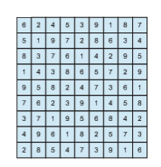
**Figure 4.26** Solution to a 9 × 9 Sudoku puzzle.

**Programming Projects**

**Project 1—Sudoku Solution Validator**

A **_Sudoku_** puzzle uses a 9 × 9 grid in which each column and row, as well as each of the nine 3 × 3 subgrids, must contain all of the digits 1 ⋅ ⋅ ⋅ 9. Figure 4.26 presents an example of a valid Sudoku puzzle. This project consists of designing a multithreaded application that determines whether the solution to a Sudoku puzzle is valid.

There are several different ways of multithreading this application. One suggested strategy is to create threads that check the following criteria:

• A thread to check that each column contains the digits 1 through 9

• A thread to check that each row contains the digits 1 through 9

**P-25**  

• Nine threads to check that each of the 3 × 3 subgrids contains the digits 1 through 9

This would result in a total of eleven separate threads for validating a Sudoku puzzle. However, you are welcome to create even more threads for this project. For example, rather than creating one thread that checks all nine columns, you could create nine separate threads and have each of them check one column.

**I. Passing Parameters to Each Thread**

The parent thread will create the worker threads, passing each worker the location that it must check in the Sudoku grid. This step will require passing several parameters to each thread. The easiest approach is to create a data structure using a struct. For example, a structure to pass the row and column where a thread must begin validating would appear as follows:

/\* structure for passing data to threads \*/ typedef struct _{_

int row; int column;

_}_ parameters;

Both Pthreads and Windows programs will create worker threads using a strategy similar to that shown below:

parameters \*data = (parameters \*) malloc(sizeof(parameters)); data->row = 1; data->column = 1; /\* Now create the thread passing it data as a parameter \*/

The data pointer will be passed to either the pthread create() (Pthreads) function or the CreateThread() (Windows) function, which in turn will pass it as a parameter to the function that is to run as a separate thread.

**II. Returning Results to the Parent Thread**

Each worker thread is assigned the task of determining the validity of a partic- ular region of the Sudoku puzzle. Once a worker has performed this check, it must pass its results back to the parent. One goodway to handle this is to create an array of integer values that is visible to each thread. The _ith_ index in this array corresponds to the _ith_ worker thread. If a worker sets its corresponding value to 1, it is indicating that its region of the Sudoku puzzle is valid. A value of 0 indicates otherwise. When all worker threads have completed, the parent thread checks each entry in the result array to determine if the Sudoku puzzle is valid.

**Project 2—Multithreaded Sorting Application** Write a multithreaded sorting program that works as follows: A list of integers is divided into two smaller lists of equal size. Two separate threads (which we

**P-26**  

**Programming Projects**

will term **_sorting threads_**) sort each sublist using a sorting algorithm of your choice. The two sublists are then merged by a third thread—a **_merging thread_** —which merges the two sublists into a single sorted list.

Because global data are shared across all threads, perhaps the easiest way to set up the data is to create a global array. Each sorting thread will work on one half of this array. A second global array of the same size as the unsorted integer array will also be established. The merging thread will then merge the two sublists into this second array. Graphically, this program is structured as in Figure 4.27.

This programming project will require passing parameters to each of the sorting threads. In particular, it will be necessary to identify the starting index from which each thread is to begin sorting. Refer to the instructions in Project 1 for details on passing parameters to a thread.

The parent threadwill output the sorted array once all sorting threads have exited.

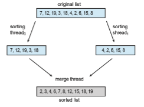
**Figure 4.27** Multithreaded sorting.

**Project 3—Fork-Join Sorting Application** Implement the preceding project (Multithreaded Sorting Application) using Java’s fork-join parallelism API. This project will be developed in two different versions. Each version will implement a different divide-and-conquer sorting algorithm:

**1\.** Quicksort

**2\.** Mergesort

The Quicksort implementation will use the Quicksort algorithm for dividing the list of elements to be sorted into a _left half_ and a _right half_ based on the position of the pivot value. The Mergesort algorithm will divide the list into two evenly sized halves. For both the Quicksort and Mergesort algorithms, when the list to be sorted falls within some threshold value (for example, the list is size 100 or fewer), directly apply a simple algorithm such as the Selection or Insertion sort. Most data structures texts describe these two well-known, divide-and-conquer sorting algorithms.

The class SumTask shown in Section 4.5.2.1 extends RecursiveTask, which is a result-bearing ForkJoinTask. As this assignment will involve sorting the array that is passed to the task, but not returning any values, you will instead create a class that extends RecursiveAction, a non result-bearing ForkJoinTask (see Figure 4.19).

The objects passed to each sorting algorithm are required to implement Java’s Comparable interface, and this will need to be reflected in the class definition for each sorting algorithm. The source code download for this text includes Java code that provides the foundations for beginning this project.

**P-28**  

_5_**CHAPTER**

# CPU Scheduling

CPU scheduling is the basis ofmultiprogrammedoperating systems. By switch- ing the CPU among processes, the operating system can make the computer more productive. In this chapter, we introduce basic CPU-scheduling concepts and present several CPU-scheduling algorithms, including real-time systems. We also consider the problem of selecting an algorithm for a particular system.

InChapter 4,we introduced threads to the processmodel.Onmodern oper- ating systems it is kernel-level threads—not processes—that are in fact being scheduled by the operating system. However, the terms "process scheduling" and "thread scheduling" are often used interchangeably. In this chapter, we use **_process scheduling_** when discussing general scheduling concepts and **_thread scheduling_** to refer to thread-specific ideas.

Similarly, in Chapter 1 we describe how a **_core_** is the basic computational unit of a CPU, and that a process executes on a CPU’s core. However, in many instances in this chapter, when we use the general terminology of scheduling a process to "run on a CPU", we are implying that the process is running on a CPU’s core.

**CHAPTER OBJECTIVES**

• Describe various CPU scheduling algorithms.

• Assess CPU scheduling algorithms based on scheduling criteria.

• Explain the issues related to multiprocessor and multicore scheduling.

• Describe various real-time scheduling algorithms.

• Describe the scheduling algorithms used in the Windows, Linux, and Solaris operating systems.

• Apply modeling and simulations to evaluate CPU scheduling algorithms.

• Design a program that implements several different CPU scheduling algo- rithms.

## Basic Concepts

In a system with a single CPU core, only one process can run at a time. Others must wait until the CPU’s core is free and can be rescheduled. The objective of multiprogramming is to have some process running at all times, to maximize CPU utilization. The idea is relatively simple. Aprocess is executed until it must wait, typically for the completion of some I/O request. In a simple computer system, the CPU then just sits idle. All this waiting time is wasted; no useful work is accomplished.Withmultiprogramming,we try to use this timeproduc- tively. Several processes are kept inmemory at one time.When one process has to wait, the operating system takes the CPU away from that process and gives the CPU to another process. This pattern continues. Every time one process has to wait, another process can take over use of the CPU. On a multicore system, this concept of keeping the CPU busy is extended to all processing cores on the system.

Scheduling of this kind is a fundamental operating-system function. Almost all computer resources are scheduled before use. The CPU is, of course, one of the primary computer resources. Thus, its scheduling is central to operating-system design.
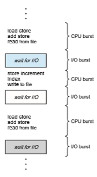
**Figure 5.1** Alternating sequence of CPU and I/O bursts.  

### CPU–I/O Burst Cycle

The success of CPU scheduling depends on an observed property of processes: process execution consists of a **cycle** of CPU execution and I/O wait. Processes alternate between these two states. Process execution begins with a **CPU burst**. That is followed by an **I/O burst**, which is followed by another CPU burst, then another I/O burst, and so on. Eventually, the final CPU burst endswith a system request to terminate execution (Figure 5.1).

The durations of CPU bursts have been measured extensively. Although they vary greatly from process to process and from computer to computer, they tend to have a frequency curve similar to that shown in Figure 5.2. The curve is generally characterized as exponential or hyperexponential, with a large number of short CPU bursts and a small number of long CPU bursts. An I/O-bound program typically has many short CPU bursts. A CPU-bound programmight have a few long CPU bursts. This distribution can be important when implementing a CPU-scheduling algorithm.

### CPU Scheduler

Whenever the CPU becomes idle, the operating system must select one of the processes in the ready queue to be executed. The selection process is carried out by the **CPU scheduler**, which selects a process from the processes in memory that are ready to execute and allocates the CPU to that process.

Note that the ready queue is not necessarily a first-in, first-out (FIFO) queue. As we shall see when we consider the various scheduling algorithms, a ready queue can be implemented as a FIFO queue, a priority queue, a tree, or simply an unordered linked list. Conceptually, however, all the processes in the ready queue are lined up waiting for a chance to run on the CPU. The records in the queues are generally process control blocks (PCBs) of the processes.

**Figure 5.2** Histogram of CPU-burst durations.  

### Preemptive and Nonpreemptive Scheduling

CPU-scheduling decisions may take place under the following four circum- stances:

**1\.** When a process switches from the running state to the waiting state (for example, as the result of an I/O request or an invocation of wait() for the termination of a child process)

**2\.** When a process switches from the running state to the ready state (for example, when an interrupt occurs)

**3\.** When a process switches from the waiting state to the ready state (for example, at completion of I/O)

**4\.** When a process terminates

For situations 1 and 4, there is no choice in terms of scheduling. Anew process (if one exists in the ready queue) must be selected for execution. There is a choice, however, for situations 2 and 3.

When scheduling takes place only under circumstances 1 and 4,we say that the scheduling scheme is **nonpreemptive** or **cooperative**. Otherwise, it is **pre- emptive**. Under nonpreemptive scheduling, once the CPU has been allocated to a process, the process keeps the CPU until it releases it either by terminating or by switching to the waiting state. Virtually all modern operating systems includingWindows, macOS, Linux, and UNIX use preemptive scheduling algo- rithms.

Unfortunately, preemptive scheduling can result in race conditions when data are shared among several processes. Consider the case of two processes that share data. While one process is updating the data, it is preempted so that the second process can run. The second process then tries to read the data, which are in an inconsistent state. This issue will be explored in detail in Chapter 6.

Preemption also affects the design of the operating-system kernel. During the processing of a system call, the kernel may be busy with an activity on behalf of a process. Such activities may involve changing important kernel data (for instance, I/O queues). What happens if the process is preempted in the middle of these changes and the kernel (or the device driver) needs to read or modify the same structure? Chaos ensues. As will be discussed in Section 6.2, operating-system kernels can be designed as either nonpreemptive or preemptive. A nonpreemptive kernel will wait for a system call to complete or for a process to block while waiting for I/O to complete to take place before doing a context switch. This scheme ensures that the kernel structure is simple, since the kernel will not preempt a process while the kernel data structures are in an inconsistent state. Unfortunately, this kernel-execution model is a poor one for supporting real-time computing, where tasks must complete execution within a given time frame. In Section 5.6, we explore scheduling demands of real-time systems. A preemptive kernel requires mechanisms such as mutex locks to prevent race conditions when accessing shared kernel data structures. Most modern operating systems are now fully preemptive when running in kernel mode.  

**Figure 5.3** The role of the dispatcher.

Because interrupts can, by definition, occur at any time, and because they cannot always be ignored by the kernel, the sections of code affected by inter- rupts must be guarded from simultaneous use. The operating system needs to accept interrupts at almost all times. Otherwise, input might be lost or output overwritten. So that these sections of code are not accessed concurrently by several processes, they disable interrupts at entry and reenable interrupts at exit. It is important to note that sections of code that disable interrupts do not occur very often and typically contain few instructions.

### Dispatcher

Another component involved in the CPU-scheduling function is the**dispatcher**. The dispatcher is the module that gives control of the CPU’s core to the process selected by the CPU scheduler. This function involves the following:

• Switching context from one process to another

• Switching to user mode

• Jumping to the proper location in the user program to resume that program

Thedispatcher should be as fast as possible, since it is invokedduring every context switch. The time it takes for the dispatcher to stop one process and start another running is known as the **dispatch latency** and is illustrated in Figure 5.3.

An interesting question to consider is, how often do context switches occur? On a system-wide level, the number of context switches can be obtained by using the vmstat command that is available on Linux systems. Below is the output (which has been trimmed) from the command

vmstat 1 3  

This command provides 3 lines of output over a 1-second delay:

\------cpu----- 24 225 339

The first line gives the average number of context switches over 1 second since the system booted, and the next two lines give the number of context switches over two 1-second intervals. Since this machine booted, it has aver- aged 24 context switches per second. And in the past second, 225 context switches were made, with 339 context switches in the second prior to that.

We can also use the /proc file system to determine the number of context switches for a given process. For example, the contents of the file /proc/2166/status will list various statistics for the process with pid = 2166. The command

cat /proc/2166/status

provides the following trimmed output:

voluntary ctxt switches 150 nonvoluntary ctxt switches 8

This output shows the number of context switches over the lifetime of the process. Notice the distinction between **_voluntary_** and **_nonvoluntary_** context switches. A voluntary context switch occurs when a process has given up control of the CPU because it requires a resource that is currently unavailable (such as blocking for I/O.) Anonvoluntary context switch occurs when the CPU has been taken away from a process, such as when its time slice has expired or it has been preempted by a higher-priority process.

## Scheduling Criteria

Different CPU-scheduling algorithms have different properties, and the choice of a particular algorithm may favor one class of processes over another. In choosing which algorithm to use in a particular situation, we must consider the properties of the various algorithms.

Many criteria have been suggested for comparing CPU-scheduling algo- rithms. Which characteristics are used for comparison can make a substantial difference in which algorithm is judged to be best. The criteria include the following:

• **CPU utilization**. We want to keep the CPU as busy as possible. Concep- tually, CPU utilization can range from 0 to 100 percent. In a real system, it should range from 40 percent (for a lightly loaded system) to 90 percent (for a heavily loaded system). (CPU utilization can be obtained by using the top command on Linux, macOS, and UNIX systems.)

• **Throughput**. If the CPU is busy executing processes, then work is being done. One measure of work is the number of processes that are completed  per time unit, called **throughput**. For long processes, this rate may be one process over several seconds; for short transactions, it may be tens of processes per second.

• **Turnaround time**. From the point of view of a particular process, the important criterion is how long it takes to execute that process. The interval from the time of submission of a process to the time of completion is the turnaround time. Turnaround time is the sum of the periods spent waiting in the ready queue, executing on the CPU, and doing I/O.

• **Waiting time**. The CPU-scheduling algorithm does not affect the amount of time during which a process executes or does I/O. It affects only the amount of time that a process spends waiting in the ready queue. Waiting time is the sum of the periods spent waiting in the ready queue.

• **Response time**. In an interactive system, turnaround time may not be the best criterion. Often, a process can produce some output fairly early and can continue computing new results while previous results are being output to the user. Thus, another measure is the time from the submission of a request until the first response is produced. This measure, called response time, is the time it takes to start responding, not the time it takes to output the response.

It is desirable tomaximize CPU utilization and throughput and tominimize turnaround time, waiting time, and response time. In most cases, we optimize the average measure. However, under some circumstances, we prefer to opti- mize the minimum or maximum values rather than the average. For example, to guarantee that all users get good service, we may want to minimize the maximum response time.

Investigators have suggested that, for interactive systems (such as a PC desktop or laptop system), it is more important to minimize the variance in the response time than to minimize the average response time. A system with reasonable and predictable response time may be considered more desirable than a system that is faster on the average but is highly variable. However, little work has been done on CPU-scheduling algorithms that minimize variance.

As we discuss various CPU-scheduling algorithms in the following section, we illustrate their operation. An accurate illustration should involve many processes, each a sequence of several hundred CPU bursts and I/O bursts. For simplicity, though, we consider only one CPU burst (in milliseconds) per process in our examples. Our measure of comparison is the average waiting time. More elaborate evaluation mechanisms are discussed in Section 5.8.

## Scheduling Algorithms

CPU scheduling deals with the problem of deciding which of the processes in the ready queue is to be allocated the CPU’s core. There aremany different CPU- scheduling algorithms. In this section, we describe several of them. Although most modern CPU architectures have multiple processing cores, we describe these scheduling algorithms in the context of only one processing core avail- able. That is, a single CPU that has a single processing core, thus the system is  

capable of only running one process at a time. In Section 5.5 we discuss CPU scheduling in the context of multiprocessor systems.

### First-Come, First-Served Scheduling

By far the simplest CPU-scheduling algorithm is the **first-come first-serve** (**FCFS**) scheduling algorithm. With this scheme, the process that requests the CPU first is allocated the CPU first. The implementation of the FCFS policy is easily managed with a FIFO queue. When a process enters the ready queue, its PCB is linked onto the tail of the queue. When the CPU is free, it is allocated to the process at the head of the queue. The running process is then removed from the queue. The code for FCFS scheduling is simple to write and understand.

On the negative side, the average waiting time under the FCFS policy is often quite long. Consider the following set of processes that arrive at time 0, with the length of the CPU burst given in milliseconds:
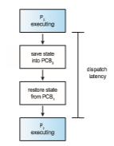
If the processes arrive in the order _P_1, _P_2, _P_3, and are served in FCFS order, we get the result shown in the following **Gantt chart**, which is a bar chart that illustrates a particular schedule, including the start and finish times of each of the participating processes:

The waiting time is 0 milliseconds for process _P_1, 24 milliseconds for process _P_2, and 27 milliseconds for process _P_3\. Thus, the average waiting time is (0 + 24 + 27)/3 = 17 milliseconds. If the processes arrive in the order _P_2, _P_3, _P_1, however, the results will be as shown in the following Gantt chart:

The average waiting time is now (6 + 0 + 3)/3 = 3 milliseconds. This reduction is substantial. Thus, the average waiting time under an FCFS policy is generally not minimal and may vary substantially if the processes’ CPU burst times vary greatly.

In addition, consider the performance of FCFS scheduling in a dynamic situation. Assume we have one CPU-bound process and many I/O-bound pro- cesses. As the processes flow around the system, the following scenario may result. The CPU-bound process will get and hold the CPU. During this time, all the other processes will finish their I/O and will move into the ready queue, waiting for the CPU. While the processes wait in the ready queue, the I/O  
devices are idle. Eventually, the CPU-bound process finishes its CPU burst and moves to an I/O device. All the I/O-bound processes, which have short CPU bursts, execute quickly and move back to the I/O queues. At this point, the CPU sits idle. The CPU-bound process will then move back to the ready queue and be allocated the CPU. Again, all the I/O processes end up waiting in the ready queue until the CPU-bound process is done. There is a **convoy effect** as all the other processes wait for the one big process to get off the CPU. This effect results in lower CPU and device utilization thanmight be possible if the shorter processes were allowed to go first.

Note also that the FCFS scheduling algorithm is nonpreemptive. Once the CPU has been allocated to a process, that process keeps the CPU until it releases the CPU, either by terminating or by requesting I/O. The FCFS algorithm is thus particularly troublesome for interactive systems, where it is important that each process get a share of the CPU at regular intervals. It would be disastrous to allow one process to keep the CPU for an extended period.

### Shortest-Job-First Scheduling

A different approach to CPU scheduling is the **shortest-job-firs** (**SJF**) schedul- ing algorithm. This algorithm associates with each process the length of the process’s next CPU burst.When the CPU is available, it is assigned to the process that has the smallest next CPU burst. If the next CPU bursts of two processes are the same, FCFS scheduling is used to break the tie. Note that a more appro- priate term for this scheduling method would be the **_shortest-next-CPU-burst_** algorithm, because scheduling depends on the length of the next CPU burst of a process, rather than its total length. We use the term SJF because most people and textbooks use this term to refer to this type of scheduling.

As an example of SJF scheduling, consider the following set of processes, with the length of the CPU burst given in milliseconds:
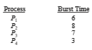
Using SJF scheduling, we would schedule these processes according to the following Gantt chart:

The waiting time is 3 milliseconds for process _P_1, 16 milliseconds for process _P_2, 9 milliseconds for process _P_3, and 0 milliseconds for process _P_4\. Thus, the average waiting time is (3 + 16 + 9 + 0)/4 = 7 milliseconds. By comparison, if we were using the FCFS scheduling scheme, the average waiting time would be 10.25 milliseconds.

The SJF scheduling algorithm is provably optimal, in that it gives the mini- mum average waiting time for a given set of processes. Moving a short process before a long one decreases the waiting time of the short process more than it increases the waiting time of the long process. Consequently, the average waiting time decreases.

Although the SJF algorithm is optimal, it cannot be implemented at the level of CPU scheduling, as there is no way to know the length of the next CPU burst. One approach to this problem is to try to approximate SJF scheduling. We may not know the length of the next CPU burst, but we may be able to predict its value.We expect that the next CPU burstwill be similar in length to the previous ones. By computing an approximation of the length of the next CPU burst, we can pick the process with the shortest predicted CPU burst.

The next CPU burst is generally predicted as an **exponential average** of the measured lengths of previous CPU bursts. We can define the exponential average with the following formula. Let _tn_ be the length of the _n_th CPU burst, and let τ_n_+1 be our predicted value for the next CPU burst. Then, for α, 0 ≤ α ≤

1, define

τ_n_+1 = α _tn_ \+ (1 − α)τ_n_.

The value of _tn_ contains our most recent information, while τ_n_ stores the past history. The parameter α controls the relative weight of recent and past history in our prediction. If α = 0, then τ_n_+1 = τ_n_, and recent history has no effect (current conditions are assumed to be transient). If α = 1, then τ_n_+1 = _tn_, and only the most recent CPU burst matters (history is assumed to be old and irrelevant). More commonly, α = 1/2, so recent history and past history are equally weighted. The initial τ0 can be defined as a constant or as an overall system average. Figure 5.4 shows an exponential average with α = 1/2 and τ0 = 10.

**Figure 5.4** Prediction of the length of the next CPU burst.  
To understand the behavior of the exponential average, we can expand the formula for τ_n_+1 by substituting for τ_n_ to find

τ_n_+1 = α_tn_ \+ (1 − α)α_tn_−1 + · · · + (1 − α)_j_α_tn_−_j_ \+ · · · + (1 − α)_n_+1τ0_._

Typically, α is less than 1. As a result, (1 − α) is also less than 1, and each successive term has less weight than its predecessor.

The SJF algorithm can be either preemptive or nonpreemptive. The choice arises when a new process arrives at the ready queue while a previous pro- cess is still executing. The next CPU burst of the newly arrived process may be shorter than what is left of the currently executing process. A preemptive SJF algorithm will preempt the currently executing process, whereas a non- preemptive SJF algorithm will allow the currently running process to finish its CPU burst. Preemptive SJF scheduling is sometimes called **shortest-remaining- time-firs** scheduling.

As an example, consider the following four processes, with the length of the CPU burst given in milliseconds:
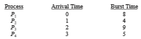
If the processes arrive at the ready queue at the times shown and need the indicated burst times, then the resulting preemptive SJF schedule is as depicted in the following Gantt chart:

Process _P_1 is started at time 0, since it is the only process in the queue. Process _P_2 arrives at time 1. The remaining time for process _P_1 (7 milliseconds) is larger than the time required by process _P_2 (4 milliseconds), so process _P_1 is preempted, and process _P_2 is scheduled. The average waiting time for this example is \[(10 − 1) + (1 − 1) + (17 − 2) + (5 − 3)\]/4 = 26/4 = 6.5 milliseconds. Nonpreemptive SJF scheduling would result in an average waiting time of 7.75 milliseconds.

### Round-Robin Scheduling

The **round-robin** (**RR**) scheduling algorithm is similar to FCFS scheduling, but preemption is added to enable the system to switch between processes. Asmall unit of time, called a **time quantum** or **time slice**, is defined. A time quantum is generally from 10 to 100milliseconds in length. The ready queue is treated as a circular queue. The CPU scheduler goes around the ready queue, allocating the CPU to each process for a time interval of up to 1 time quantum.

To implement RR scheduling, we again treat the ready queue as a FIFO queue of processes. New processes are added to the tail of the ready queue.  

The CPU scheduler picks the first process from the ready queue, sets a timer to interrupt after 1 time quantum, and dispatches the process.

One of two things will then happen. The process may have a CPU burst of less than 1 time quantum. In this case, the process itself will release the CPU voluntarily. The scheduler will then proceed to the next process in the ready queue. If the CPU burst of the currently running process is longer than 1 time quantum, the timer will go off and will cause an interrupt to the operating system. A context switch will be executed, and the process will be put at the tail of the ready queue. The CPU scheduler will then select the next process in the ready queue.

The average waiting time under the RR policy is often long. Consider the following set of processes that arrive at time 0, with the length of the CPU burst given in milliseconds:


If we use a time quantum of 4 milliseconds, then process _P_1 gets the first 4 milliseconds. Since it requires another 20 milliseconds, it is preempted after the first time quantum, and the CPU is given to the next process in the queue, process _P_2\. Process _P_2 does not need 4 milliseconds, so it quits before its time quantum expires. The CPU is then given to the next process, process _P_3\. Once each process has received 1 time quantum, the CPU is returned to process _P_1 for an additional time quantum. The resulting RR schedule is as follows:
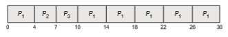
Let’s calculate the average waiting time for this schedule. _P_1 waits for 6 mil- liseconds (10 − 4), _P_2 waits for 4 milliseconds, and _P_3 waits for 7 milliseconds. Thus, the average waiting time is 17/3 = 5.66 milliseconds.

In the RR scheduling algorithm, no process is allocated the CPU for more than 1 time quantum in a row (unless it is the only runnable process). If a process’s CPU burst exceeds 1 time quantum, that process is preempted and is put back in the ready queue. The RR scheduling algorithm is thus preemptive.

If there are _n_ processes in the ready queue and the time quantum is _q_, then each process gets 1/_n_ of the CPU time in chunks of at most _q_ time units. Each process must wait no longer than (_n_− 1)× _q_ time units until its next time quan- tum. For example, with five processes and a time quantum of 20 milliseconds, each process will get up to 20 milliseconds every 100 milliseconds.

The performance of the RR algorithm depends heavily on the size of the time quantum. At one extreme, if the time quantum is extremely large, the RR policy is the same as the FCFS policy. In contrast, if the time quantum is extremely small (say, 1 millisecond), the RR approach can result in a large  
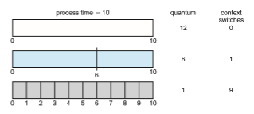
**Figure 5.5** How a smaller time quantum increases context switches.

number of context switches. Assume, for example, that we have only one process of 10 time units. If the quantum is 12 time units, the process finishes in less than 1 time quantum, with no overhead. If the quantum is 6 time units, however, the process requires 2 quanta, resulting in a context switch. If the time quantum is 1 time unit, then nine context switches will occur, slowing the execution of the process accordingly (Figure 5.5).

Thus, we want the time quantum to be large with respect to the context- switch time. If the context-switch time is approximately 10 percent of the time quantum, then about 10 percent of the CPU time will be spent in context switching. In practice, most modern systems have time quanta ranging from 10 to 100 milliseconds. The time required for a context switch is typically less than 10 microseconds; thus, the context-switch time is a small fraction of the time quantum.

Turnaround time also depends on the size of the time quantum. As we can see from Figure 5.6, the average turnaround time of a set of processes does not necessarily improve as the time-quantum size increases. In general, the average turnaround time can be improved if most processes finish their next CPU burst in a single time quantum. For example, given three processes of 10 time units each and a quantum of 1 time unit, the average turnaround time is 29. If the time quantum is 10, however, the average turnaround time drops to 20. If context-switch time is added in, the average turnaround time increases even more for a smaller time quantum, since more context switches are required.

Although the time quantum should be large compared with the context- switch time, it should not be too large. As we pointed out earlier, if the time quantum is too large, RR scheduling degenerates to an FCFS policy. A rule of thumb is that 80 percent of the CPU bursts should be shorter than the time quantum.

### Priority Scheduling

The SJF algorithm is a special case of the general**priority-scheduling** algorithm. A priority is associated with each process, and the CPU is allocated to the  

**Figure 5.6** How turnaround time varies with the time quantum.

process with the highest priority. Equal-priority processes are scheduled in FCFS order. An SJF algorithm is simply a priority algorithm where the priority (_p_) is the inverse of the (predicted) next CPU burst. The larger the CPU burst, the lower the priority, and vice versa.

Note that we discuss scheduling in terms of **_high_** priority and **_low_** priority. Priorities are generally indicated by some fixed range of numbers, such as 0 to 7 or 0 to 4,095. However, there is no general agreement on whether 0 is the highest or lowest priority. Some systems use low numbers to represent low priority; others use low numbers for high priority. This difference can lead to confusion. In this text, we assume that low numbers represent high priority.

As an example, consider the following set of processes, assumed to have arrived at time 0 in the order _P_1, _P_2, · · ·, _P_5, with the length of the CPU burst given in milliseconds:
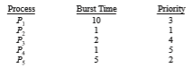
Using priority scheduling, wewould schedule these processes according to the following Gantt chart:  

The average waiting time is 8.2 milliseconds. Priorities can be defined either internally or externally. Internally defined

priorities use some measurable quantity or quantities to compute the priority of a process. For example, time limits, memory requirements, the number of open files, and the ratio of average I/O burst to average CPU burst have been used in computing priorities. External priorities are set by criteria outside the operating system, such as the importance of the process, the type and amount of funds being paid for computer use, the department sponsoring the work, and other, often political, factors.

Priority scheduling can be either preemptive or nonpreemptive. When a process arrives at the ready queue, its priority is compared with the priority of the currently running process. Apreemptivepriority scheduling algorithmwill preempt the CPU if the priority of the newly arrived process is higher than the priority of the currently running process. Anonpreemptive priority scheduling algorithm will simply put the new process at the head of the ready queue.

Amajor problem with priority scheduling algorithms is **indefinit block- ing**, or **starvation**. A process that is ready to run but waiting for the CPU can be considered blocked. A priority scheduling algorithm can leave some low- priority processes waiting indefinitely. In a heavily loaded computer system, a steady stream of higher-priority processes can prevent a low-priority process from ever getting the CPU. Generally, one of two things will happen. Either the process will eventually be run (at 2 A.M. Sunday, when the system is finally lightly loaded), or the computer systemwill eventually crash and lose all unfin- ished low-priority processes. (Rumor has it that when they shut down the IBM 7094 at MIT in 1973, they found a low-priority process that had been submitted in 1967 and had not yet been run.)

Asolution to the problemof indefinite blockage of low-priority processes is **aging**. Aging involves gradually increasing the priority of processes that wait in the system for a long time. For example, if priorities range from 127 (low) to 0 (high), we could periodically (say, every second) increase the priority of a waiting process by 1. Eventually, even a process with an initial priority of 127 would have the highest priority in the system and would be executed. In fact, it would take a little over 2 minutes for a priority-127 process to age to a priority-0 process.

Another option is to combine round-robin and priority scheduling in such a way that the system executes the highest-priority process and runs processes with the same priority using round-robin scheduling. Let’s illustrate with an example using the following set of processes, with the burst time in millisec- onds:

Using priority scheduling with round-robin for processes with equal priority, we would schedule these processes according to the following Gantt chart using a time quantum of 2 milliseconds:

In this example, process _P_4 has the highest priority, so it will run to comple- tion. Processes_P_2 and_P_3 have the next-highest priority, and theywill execute in a round-robin fashion. Notice that when process _P_2 finishes at time 16, process _P_3 is the highest-priority process, so it will run until it completes execution. Now, only processes _P_1 and _P_5 remain, and as they have equal priority, they will execute in round-robin order until they complete.

### Multilevel Queue Scheduling

With both priority and round-robin scheduling, all processes may be placed in a single queue, and the scheduler then selects the process with the highest priority to run. Depending on how the queues are managed, an _O_(_n_) search may be necessary to determine the highest-priority process. In practice, it is often easier to have separate queues for each distinct priority, and priority scheduling simply schedules the process in the highest-priority queue. This is illustrated in Figure 5.7. This approach—known as **multilevel queue**— also works well when priority scheduling is combined with round-robin: if there are multiple processes in the highest-priority queue, they are executed in round-robin order. In the most generalized form of this approach, a priority is assigned statically to each process, and a process remains in the same queue for the duration of its runtime.
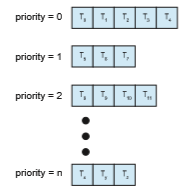
**Figure 5.7** Separate queues for each priority.  

**Figure 5.8** Multilevel queue scheduling.

A multilevel queue scheduling algorithm can also be used to partition processes into several separate queues based on the process type (Figure 5.8). For example, a common division is made between **foreground** (interac- tive) processes and **background** (batch) processes. These two types of pro- cesses have different response-time requirements and so may have different scheduling needs. In addition, foreground processes may have priority (exter- nally defined) over background processes. Separate queues might be used for foreground and background processes, and each queue might have its own scheduling algorithm. The foreground queue might be scheduled by an RR algorithm, for example, while the background queue is scheduled by an FCFS algorithm.

In addition, there must be scheduling among the queues, which is com- monly implemented as fixed-priority preemptive scheduling. For example, the real-time queue may have absolute priority over the interactive queue.

Let’s look at an example of a multilevel queue scheduling algorithm with four queues, listed below in order of priority:

**1\.** Real-time processes

**2\.** System processes

**3\.** Interactive processes

**4\.** Batch processes

Each queue has absolute priority over lower-priority queues. No process in the batch queue, for example, could run unless the queues for real-time processes, system processes, and interactive processes were all empty. If an interactive process entered the ready queue while a batch process was running, the batch process would be preempted.

Another possibility is to time-slice among the queues. Here, each queue gets a certain portion of the CPU time,which it can then schedule among its var- ious processes. For instance, in the foreground–background queue example, the foreground queue can be given 80 percent of the CPU time for RR scheduling  

among its processes, while the background queue receives 20 percent of the CPU to give to its processes on an FCFS basis.

### Multilevel Feedback Queue Scheduling

Normally, when the multilevel queue scheduling algorithm is used, processes are permanently assigned to a queue when they enter the system. If there are separate queues for foreground and background processes, for example, processes do not move from one queue to the other, since processes do not change their foreground or background nature. This setup has the advantage of low scheduling overhead, but it is inflexible.

The **multilevel feedback queue** scheduling algorithm, in contrast, allows a process to move between queues. The idea is to separate processes according to the characteristics of their CPU bursts. If a process uses too much CPU time, it will be moved to a lower-priority queue. This scheme leaves I/O-bound and interactive processes—which are typically characterized by short CPU bursts —in the higher-priority queues. In addition, a process that waits too long in a lower-priority queue may be moved to a higher-priority queue. This form of aging prevents starvation.

For example, consider a multilevel feedback queue scheduler with three queues, numbered from 0 to 2 (Figure 5.9). The scheduler first executes all processes in queue 0. Only when queue 0 is empty will it execute processes in queue 1. Similarly, processes in queue 2 will be executed only if queues 0 and 1 are empty. A process that arrives for queue 1 will preempt a process in queue 2. A process in queue 1 will in turn be preempted by a process arriving for queue 0.

An entering process is put in queue 0. A process in queue 0 is given a time quantum of 8 milliseconds. If it does not finish within this time, it is moved to the tail of queue 1. If queue 0 is empty, the process at the head of queue 1 is given a quantum of 16milliseconds. If it does not complete, it is preempted and is put into queue 2. Processes in queue 2 are run on an FCFS basis but are run onlywhen queues 0 and 1 are empty. To prevent starvation, a process that waits too long in a lower-priority queuemay gradually bemoved to a higher-priority queue.
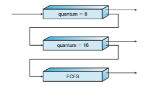
**Figure 5.9** Multilevel feedback queues.  

This scheduling algorithm gives highest priority to any process with a CPU burst of 8 milliseconds or less. Such a process will quickly get the CPU, finish its CPU burst, and go off to its next I/O burst. Processes that need more than 8 but less than 24 milliseconds are also served quickly, although with lower priority than shorter processes. Long processes automatically sink to queue 2 and are served in FCFS order with any CPU cycles left over from queues 0 and 1.

In general, a multilevel feedback queue scheduler is defined by the follow- ing parameters:

• The number of queues

• The scheduling algorithm for each queue

• The method used to determine when to upgrade a process to a higher- priority queue

• The method used to determine when to demote a process to a lower- priority queue

• Themethod used to determinewhich queue a process will enter when that process needs service

The definition of a multilevel feedback queue scheduler makes it the most general CPU-scheduling algorithm. It can be configured to match a specific system under design. Unfortunately, it is also the most complex algorithm, since defining the best scheduler requires somemeans bywhich to select values for all the parameters.

## Thread Scheduling

In Chapter 4, we introduced threads to the process model, distinguishing between **_user-level_** and **_kernel-level_** threads. On most modern operating sys- tems it is kernel-level threads—not processes—that are being scheduled by the operating system. User-level threads are managed by a thread library, and the kernel is unaware of them. To run on a CPU, user-level threads must ulti- mately be mapped to an associated kernel-level thread, although this mapping may be indirect and may use a lightweight process (LWP). In this section, we explore scheduling issues involving user-level and kernel-level threads and offer specific examples of scheduling for Pthreads.

### Contention Scope

One distinction between user-level and kernel-level threads lies in how they are scheduled. On systems implementing the many-to-one (Section 4.3.1) and many-to-many (Section 4.3.3) models, the thread library schedules user- level threads to run on an available LWP. This scheme is known as **process- contention scope** (**PCS**), since competition for the CPU takes place among threads belonging to the same process. (When we say the thread library _sched- ules_ user threads onto available LWPs, we do not mean that the threads are actually _running_ on a CPU as that further requires the operating system to schedule the LWP’s kernel thread onto a physical CPU core.) To decide which kernel-level thread to schedule onto a CPU, the kernel uses **system-contention scope** (**SCS**). Competition for the CPU with SCS scheduling takes place among all threads in the system. Systems using the one-to-one model (Section 4.3.2), such as Windows and Linux schedule threads using only SCS.

Typically, PCS is done according to priority—the scheduler selects the runnable thread with the highest priority to run. User-level thread priorities are set by the programmer and are not adjusted by the thread library, although some thread libraries may allow the programmer to change the priority of a thread. It is important to note that PCS will typically preempt the thread currently running in favor of a higher-priority thread; however, there is no guarantee of time slicing (Section 5.3.3) among threads of equal priority.

### Pthread Scheduling

We provided a sample POSIX Pthread program in Section 4.4.1, along with an introduction to thread creation with Pthreads. Now, we highlight the POSIX Pthread API that allows specifying PCS or SCS during thread creation. Pthreads identifies the following contention scope values:

• PTHREAD SCOPE PROCESS schedules threads using PCS scheduling.

• PTHREAD SCOPE SYSTEM schedules threads using SCS scheduling.

On systems implementing the many-to-many model, the PTHREAD SCOPE PROCESS policy schedules user-level threads onto available LWPs. The number of LWPs is maintained by the thread library, perhaps using scheduler activations (Section 4.6.5). The PTHREAD SCOPE SYSTEM scheduling policy will create and bind an LWP for each user-level thread onmany-to-many systems, effectively mapping threads using the one-to-one policy.

The Pthread IPC (Interprocess Communication) provides two functions for setting—and getting—the contention scope policy:

• pthread attr setscope(pthread attr t \*attr, int scope)

• pthread attr getscope(pthread attr t \*attr, int \*scope)

The first parameter for both functions contains a pointer to the attribute set for the thread. The second parameter for the pthread attr setscope() function is passed either the PTHREAD SCOPE SYSTEM or the PTHREAD SCOPE PROCESS value, indicating how the contention scope is to be set. In the case of pthread attr getscope(), this second parameter contains a pointer to an int value that is set to the current value of the contention scope. If an error occurs, each of these functions returns a nonzero value.

In Figure 5.10, we illustrate a Pthread scheduling API. The pro- gram first determines the existing contention scope and sets it to PTHREAD SCOPE SYSTEM. It then creates five separate threads that will run using the SCS scheduling policy. Note that on some systems, only certain contention scope values are allowed. For example, Linux and macOS systems allow only PTHREAD SCOPE SYSTEM.  

```
#include _<_pthread.h_\>_ #include _<_stdio.h_\>_ #define NUM THREADS 5

int main(int argc, char \*argv\[\]) _{_

int i, scope; pthread t tid\[NUM THREADS\]; pthread attr t attr;

/\* get the default attributes \*/ pthread attr init(&attr);

/\* first inquire on the current scope \*/ if (**pthread attr getscope**(&attr, &scope) != 0)

fprintf(stderr, "Unable to get scheduling scope∖n"); else _{_

if (scope == PTHREAD SCOPE PROCESS) printf("PTHREAD SCOPE PROCESS");

else if (scope == PTHREAD SCOPE SYSTEM) printf("PTHREAD SCOPE SYSTEM");

else fprintf(stderr, "Illegal scope value.∖n");

_}_

/\* set the scheduling algorithm to PCS or SCS \*/ **pthread attr setscope**(&attr, PTHREAD SCOPE SYSTEM);

/\* create the threads \*/ for (i = 0; i < NUM THREADS; i++)

pthread create(&tid\[i\],&attr,runner,NULL);

/\* now join on each thread \*/ for (i = 0; i < NUM THREADS; i++)

pthread join(tid\[i\], NULL); _}_

/\* Each thread will begin control in this function \*/ void \*runner(void \*param) _{_

/\* do some work ... \*/

pthread exit(0); _}_
```
**Figure 5.10** Pthread scheduling API.  


## Multi-Processor Scheduling

Our discussion thus far has focused on the problems of scheduling the CPU in a system with a single processing core. If multiple CPUs are available, **load shar- ing**, where multiple threads may run in parallel, becomes possible, however scheduling issues become correspondingly more complex. Many possibilities have been tried; and as we saw with CPU scheduling with a single-core CPU, there is no one best solution.

Traditionally, the term **multiprocessor** referred to systems that provided multiple physical processors, where each processor contained one single-core CPU. However, the definition of multiprocessor has evolved significantly, and on modern computing systems, **_multiprocessor_** now applies to the following system architectures:

• Multicore CPUs

• Multithreaded cores

• NUMA systems

• Heterogeneous multiprocessing

Here, we discuss several concerns inmultiprocessor scheduling in the con- text of these different architectures. In the first three examples we concentrate on systems in which the processors are identical—homogeneous—in terms of their functionality. We can then use any available CPU to run any process in the queue. In the last example we explore a system where the processors are not identical in their capabilities.

### Approaches to Multiple-Processor Scheduling

One approach to CPU scheduling in amultiprocessor system has all scheduling decisions, I/O processing, and other system activities handled by a single processor — the master server. The other processors execute only user code. This **asymmetric multiprocessing** is simple because only one core accesses the system data structures, reducing the need for data sharing. The downfall of this approach is themaster server becomes a potential bottleneckwhere overall system performance may be reduced.

The standard approach for supporting multiprocessors is **symmetric mul- tiprocessing** (**SMP**), where each processor is self-scheduling. Scheduling pro- ceeds by having the scheduler for each processor examine the ready queue and select a thread to run. Note that this provides two possible strategies for organizing the threads eligible to be scheduled:

**1\.** All threads may be in a common ready queue.

**2\.** Each processor may have its own private queue of threads.

These two strategies are contrasted in Figure 5.11. If we select the first option, we have a possible race condition on the shared ready queue and therefore must ensure that two separate processors do not choose to schedule the same thread and that threads are not lost from the queue. As discussed in  

**Figure 5.11** Organization of ready queues.

Chapter 6, we could use some form of locking to protect the common ready queue from this race condition. Locking would be highly contended, however, as all accesses to the queue would require lock ownership, and accessing the shared queue would likely be a performance bottleneck. The second option permits each processor to schedule threads from its private run queue and therefore does not suffer from the possible performance problems associated with a shared run queue. Thus, it is the most common approach on systems supporting SMP. Additionally, as described in Section 5.5.4, having private, per- processor run queues in fact may lead to more efficient use of cache memory. There are issues with per-processor run queues—most notably, workloads of varying sizes. However, as we shall see, balancing algorithms can be used to equalize workloads among all processors.

Virtually all modern operating systems support SMP, including Windows, Linux, and macOS as well as mobile systems including Android and iOS. In the remainder of this section, we discuss issues concerning SMP systems when designing CPU scheduling algorithms.

### Multicore Processors

Traditionally, SMP systems have allowed several processes to run in parallel by providing multiple physical processors. However, most contemporary com- puter hardware now places multiple computing cores on the same physical chip, resulting in a **multicore processor**. Each core maintains its architectural state and thus appears to the operating system to be a separate logical CPU. SMP systems that use multicore processors are faster and consume less power than systems in which each CPU has its own physical chip.

Multicore processors may complicate scheduling issues. Let’s consider how this can happen. Researchers have discovered that when a processor accesses memory, it spends a significant amount of time waiting for the data to become available. This situation, known as a **memory stall**, occurs primarily because modern processors operate at much faster speeds thanmemory. How- ever, a memory stall can also occur because of a cache miss (accessing data that are not in cache memory). Figure 5.12 illustrates a memory stall. In this scenario, the processor can spend up to 50 percent of its time waiting for data to become available from memory.  
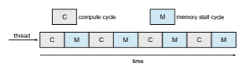
**Figure 5.12** Memory stall.

To remedy this situation, many recent hardware designs have imple- mented multithreaded processing cores in which two (or more) **hardware threads** are assigned to each core. That way, if one hardware thread stalls while waiting for memory, the core can switch to another thread. Figure 5.13 illus- trates a dual-threaded processing core on which the execution of thread 0 and the execution of thread 1 are interleaved. From an operating system perspec- tive, each hardware thread maintains its architectural state, such as instruction pointer and register set, and thus appears as a logical CPU that is available to run a software thread. This technique—known as **chip multithreading** (CMT) —is illustrated in Figure 5.14. Here, the processor contains four computing cores, with each core containing two hardware threads. From the perspective of the operating system, there are eight logical CPUs.

Intel processors use the term **hyper-threading** (also known as **simultane- ous multithreading**or SMT) to describe assigningmultiple hardware threads to a single processing core. Contemporary Intel processors—such as the i7—sup- port two threads per core, while the Oracle Sparc M7 processor supports eight threads per core, with eight cores per processor, thus providing the operating system with 64 logical CPUs.

In general, there are two ways to multithread a processing core: **coarse- grained** and **fine-graine** multithreading. With coarse-grained multithread- ing, a thread executes on a core until a long-latency event such as a memory stall occurs. Because of the delay caused by the long-latency event, the core must switch to another thread to begin execution. However, the cost of switch- ing between threads is high, since the instruction pipeline must be flushed before the other thread can begin execution on the processor core. Once this new thread begins execution, it begins filling the pipeline with its instructions. Fine-grained (or interleaved) multithreading switches between threads at a much finer level of granularity—typically at the boundary of an instruction

**Figure 5.13** Multithreaded multicore system.  
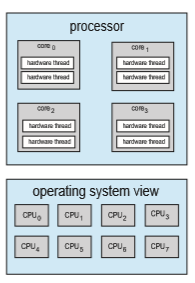
**Figure 5.14** Chip multithreading.

cycle. However, the architectural design of fine-grained systems includes logic for thread switching. As a result, the cost of switching between threads is small.

It is important to note that the resources of the physical core (such as caches and pipelines) must be shared among its hardware threads, and therefore a processing core can only execute one hardware thread at a time. Consequently, a multithreaded, multicore processor actually requires two different levels of scheduling, as shown in Figure 5.15, which illustrates a dual-threaded process- ing core.

On one level are the scheduling decisions that must be made by the oper- ating system as it chooses which software thread to run on each hardware thread (logical CPU). For all practical purposes, such decisions have been the primary focus of this chapter. Therefore, for this level of scheduling, the oper- ating systemmay choose any scheduling algorithm, including those described in Section 5.3.

A second level of scheduling specifies how each core decides which hard- ware thread to run. There are several strategies to adopt in this situation. One approach is to use a simple round-robin algorithm to schedule a hardware thread to the processing core. This is the approach adopted by the UltraSPARC T3. Another approach is used by the Intel Itanium, a dual-core processor with two hardware-managed threads per core. Assigned to each hardware thread is a dynamic **_urgency_** value ranging from 0 to 7, with 0 representing the lowest urgency and 7 the highest. The Itanium identifies five different events that may  

**Figure 5.15** Two levels of scheduling.

trigger a thread switch. When one of these events occurs, the thread-switching logic compares the urgency of the two threads and selects the thread with the highest urgency value to execute on the processor core.

Note that the two different levels of scheduling shown in Figure 5.15 are not necessarily mutually exclusive. In fact, if the operating system scheduler (the first level) is made aware of the sharing of processor resources, it canmake more effective scheduling decisions. As an example, assume that a CPU has two processing cores, and each core has two hardware threads. If two software threads are running on this system, they can be running either on the same core or on separate cores. If they are both scheduled to run on the same core, they have to share processor resources and thus are likely to proceed more slowly than if they were scheduled on separate cores. If the operating system is aware of the level of processor resource sharing, it can schedule software threads onto logical processors that do not share resources.

### Load Balancing

On SMP systems, it is important to keep the workload balanced among all processors to fully utilize the benefits of having more than one processor. Oth- erwise, one or more processors may sit idle while other processors have high workloads, alongwith ready queues of threads awaiting the CPU. **Load balanc- ing** attempts to keep the workload evenly distributed across all processors in an SMP system. It is important to note that load balancing is typically necessary only on systemswhere each processor has its own private ready queue of eligi- ble threads to execute. On systems with a common run queue, load balancing is unnecessary, because once a processor becomes idle, it immediately extracts a runnable thread from the common ready queue.

There are two general approaches to load balancing: push migration and pull migration. With **push migration**, a specific task periodically checks the load on each processor and—if it finds an imbalance—evenly distributes the load by moving (or pushing) threads from overloaded to idle or less-busy processors. **Pull migration** occurs when an idle processor pulls a waiting task from a busy processor. Push and pullmigration need not bemutually exclusive and are, in fact, often implemented in parallel on load-balancing systems. For example, the Linux CFS scheduler (described in Section 5.7.1) and the ULE scheduler available for FreeBSD systems implement both techniques.

The concept of a “balanced load” may have different meanings. One view of a balanced load may require simply that all queues have approximately the same number of threads. Alternatively, balance may require an equal distri- bution of thread priorities across all queues. In addition, in certain situations, neither of these strategiesmay be sufficient. Indeed, theymaywork against the goals of the scheduling algorithm. (We leave further consideration of this as an exercise.)

### Processor Affinity

Considerwhat happens to cachememorywhen a thread has been running on a specific processor. The data most recently accessed by the thread populate the cache for the processor. As a result, successive memory accesses by the thread are often satisfied in cache memory (known as a “warm cache”). Now consider what happens if the thread migrates to another processor—say, due to load balancing. The contents of cache memory must be invalidated for the first pro- cessor, and the cache for the second processor must be repopulated. Because of the high cost of invalidating and repopulating caches, most operating systems with SMP support try to avoidmigrating a thread fromone processor to another and instead attempt to keep a thread running on the same processor and take advantage of a warm cache. This is known as **processor affinit** —that is, a process has an affinity for the processor on which it is currently running.

The two strategies described in Section 5.5.1 for organizing the queue of threads available for scheduling have implications for processor affinity. If we adopt the approach of a common ready queue, a thread may be selected for execution by any processor. Thus, if a thread is scheduled on a new processor, that processor’s cache must be repopulated. With private, per-processor ready queues, a thread is always scheduled on the same processor and can therefore benefit from the contents of a warm cache. Essentially, per-processor ready queues provide processor affinity for free!

Processor affinity takes several forms. When an operating system has a policy of attempting to keep a process running on the same processor—but not guaranteeing that it will do so—we have a situation known as **soft affinit** . Here, the operating systemwill attempt to keep a process on a single processor, but it is possible for a process to migrate between processors during load balancing. In contrast, some systems provide system calls that support **hard affinit** , thereby allowing a process to specify a subset of processors onwhich it can run. Many systems provide both soft and hard affinity. For example, Linux implements soft affinity, but it also provides the sched setaffinity() system call, which supports hard affinity by allowing a thread to specify the set of CPUs on which it is eligible to run.

The main-memory architecture of a system can affect processor affinity issues as well. Figure 5.16 illustrates an architecture featuring non-uniform memory access (NUMA)where there are two physical processor chips eachwith their own CPU and local memory. Although a system interconnect allows all CPUs in a NUMA system to share one physical address space, a CPU has faster access to its localmemory than tomemory local to another CPU. If the operating system’s CPU scheduler and memory-placement algorithms are **_NUMA-aware_**  

**Figure 5.16** NUMA and CPU scheduling.

andwork together, then a thread that has been scheduled onto a particular CPU can be allocated memory closest to where the CPU resides, thus providing the thread the fastest possible memory access.

Interestingly, load balancing often counteracts the benefits of processor affinity. That is, the benefit of keeping a thread running on the same processor is that the thread can take advantage of its data being in that processor’s cache memory. Balancing loads by moving a thread from one processor to another removes this benefit. Similarly, migrating a thread between processors may incur a penalty on NUMAsystems, where a threadmay bemoved to a processor that requires longer memory access times. In other words, there is a natural tension between load balancing and minimizing memory access times. Thus, scheduling algorithms formodernmulticoreNUMAsystems have become quite complex. In Section 5.7.1, we examine the Linux CFS scheduling algorithm and explore how it balances these competing goals.

### Heterogeneous Multiprocessing

In the examples we have discussed so far, all processors are identical in terms of their capabilities, thus allowing any thread to run on any processing core. The only difference being that memory access timesmay vary based upon load balancing and processor affinity policies, as well as on NUMA systems.

Although mobile systems now include multicore architectures, some sys- tems are now designed using cores that run the same instruction set, yet vary in terms of their clock speed and power management, including the ability to adjust the power consumption of a core to the point of idling the core. Such systems are known as **heterogeneous multiprocessing** (HMP). Note this is not a form of asymmetric multiprocessing as described in Section 5.5.1 as both system and user tasks can run on any core. Rather, the intention behind HMP is to better manage power consumption by assigning tasks to certain cores based upon the specific demands of the task.

For ARM processors that support it, this type of architecture is known as **big.LITTLE** where higher-peformance **_big_** cores are combined with energy efficient **_LITTLE_** cores. **_Big_** cores consume greater energy and therefore should only be used for short periods of time. Likewise, **_little_** cores use less energy and can therefore be used for longer periods.

There are several advantages to this approach. By combining a number of slower c
ores with faster ones, a CPU scheduler can assign tasks that do not require high performance, but may need to run for longer periods, (such as background tasks) to little cores, thereby helping to preserve a battery charge. Similarly, interactive applications which require more processing power, but may run for shorter durations, can be assigned to big cores. Additionally, if the mobile device is in a power-saving mode, energy-intensive big cores can be disabled and the system can rely solely on energy-efficient little cores. Win- dows 10 supports HMP scheduling by allowing a thread to select a scheduling policy that best supports its power management demands.

## Real-Time CPU Scheduling

CPU scheduling for real-time operating systems involves special issues. In general, we can distinguish between soft real-time systems and hard real-time systems. **Soft real-time systems** provide no guarantee as to when a critical real-time process will be scheduled. They guarantee only that the process will be given preference over noncritical processes. **Hard real-time systems** have stricter requirements. A task must be serviced by its deadline; service after the deadline has expired is the same as no service at all. In this section, we explore several issues related to process scheduling in both soft and hard real-time operating systems.

### Minimizing Latency

Consider the event-driven nature of a real-time system. The system is typically waiting for an event in real time to occur. Events may arise either in software —as when a timer expires—or in hardware—as when a remote-controlled vehicle detects that it is approaching an obstruction. When an event occurs, the system must respond to and service it as quickly as possible. We refer to **event latency** as the amount of time that elapses fromwhen an event occurs to when it is serviced (Figure 5.17).
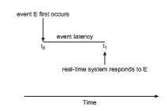
**Figure 5.17** Event latency.  
Usually, different events have different latency requirements. For example, the latency requirement for an antilock brake system might be 3 to 5 millisec- onds. That is, from the time a wheel first detects that it is sliding, the system controlling the antilock brakes has 3 to 5milliseconds to respond to and control the situation. Any response that takes longer might result in the automobile’s veering out of control. In contrast, an embedded system controlling radar in an airliner might tolerate a latency period of several seconds.

Two types of latencies affect the performance of real-time systems:

**1\.** Interrupt latency

**2\.** Dispatch latency

**Interrupt latency** refers to the period of time from the arrival of an interrupt at the CPU to the start of the routine that services the interrupt. When an interrupt occurs, the operating system must first complete the instruction it is executing and determine the type of interrupt that occurred. It must then save the state of the current process before servicing the interrupt using the specific interrupt service routine (ISR). The total time required to perform these tasks is the interrupt latency (Figure 5.18).

Obviously, it is crucial for real-time operating systems to minimize inter- rupt latency to ensure that real-time tasks receive immediate attention. Indeed, for hard real-time systems, interrupt latency must not simply be minimized, it must be bounded to meet the strict requirements of these systems.

One important factor contributing to interrupt latency is the amount of time interrupts may be disabled while kernel data structures are being updated. Real-time operating systems require that interrupts be disabled for only very short periods of time.

The amount of time required for the scheduling dispatcher to stop one process and start another is known as **dispatch latency**. Providing real-time
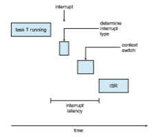
**Figure 5.18** Interrupt latency.  
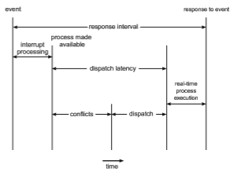
**Figure 5.19** Dispatch latency.

tasks with immediate access to the CPU mandates that real-time operating systemsminimize this latency aswell. Themost effective technique for keeping dispatch latency low is to provide preemptive kernels. For hard real-time systems, dispatch latency is typically measured in several microseconds.

In Figure 5.19, we diagram the makeup of dispatch latency. The **conflic phase** of dispatch latency has two components:

**1\.** Preemption of any process running in the kernel

**2\.** Release by low-priority processes of resources needed by a high-priority process

Following the conflict phase, the dispatch phase schedules the high-priority process onto an available CPU.

### Priority-Based Scheduling

Themost important feature of a real-time operating system is to respond imme- diately to a real-time process as soon as that process requires the CPU. As a result, the scheduler for a real-time operating system must support a priority- based algorithm with preemption. Recall that priority-based scheduling algo- rithms assign each process a priority based on its importance; more important tasks are assigned higher priorities than those deemed less important. If the scheduler also supports preemption, a process currently running on the CPU will be preempted if a higher-priority process becomes available to run.

Preemptive, priority-based scheduling algorithms are discussed in detail in Section 5.3.4, and Section 5.7 presents examples of the soft real-time schedul- ing features of the Linux, Windows, and Solaris operating systems. Each of these systems assigns real-time processes the highest scheduling priority. For  


**Figure 5.20** Periodic task.

example,Windows has 32 different priority levels. The highest levels—priority values 16 to 31—are reserved for real-time processes. Solaris and Linux have similar prioritization schemes.

Note that providing a preemptive, priority-based scheduler only guaran- tees soft real-time functionality. Hard real-time systemsmust further guarantee that real-time taskswill be serviced in accordwith their deadline requirements, and making such guarantees requires additional scheduling features. In the remainder of this section, we cover scheduling algorithms appropriate for hard real-time systems.

Before we proceed with the details of the individual schedulers, however, wemust define certain characteristics of the processes that are to be scheduled. First, the processes are considered **periodic**. That is, they require the CPU at constant intervals (periods). Once a periodic process has acquired the CPU, it has a fixed processing time _t_, a deadline _d_ by which it must be serviced by the CPU, and a period _p_. The relationship of the processing time, the deadline, and the period can be expressed as 0 ≤ _t_ ≤ _d_ ≤ _p_. The **rate** of a periodic task is 1∕_p_. Figure 5.20 illustrates the execution of a periodic process over time. Schedulers can take advantage of these characteristics and assign priorities according to a process’s deadline or rate requirements.

What is unusual about this form of scheduling is that a processmay have to announce its deadline requirements to the scheduler. Then, using a technique known as an **admission-control** algorithm, the scheduler does one of two things. It either admits the process, guaranteeing that the processwill complete on time, or rejects the request as impossible if it cannot guarantee that the task will be serviced by its deadline.

### Rate-Monotonic Scheduling

The **rate-monotonic** scheduling algorithm schedules periodic tasks using a static priority policy with preemption. If a lower-priority process is run- ning and a higher-priority process becomes available to run, it will preempt the lower-priority process. Upon entering the system, each periodic task is assigned a priority inversely based on its period. The shorter the period, the higher the priority; the longer the period, the lower the priority. The rationale behind this policy is to assign a higher priority to tasks that require the CPU more often. Furthermore, rate-monotonic scheduling assumes that the process-  


**Figure 5.21** Scheduling of tasks when _P_2 has a higher priority than _P_1.

ing time of a periodic process is the same for each CPU burst. That is, every time a process acquires the CPU, the duration of its CPU burst is the same.

Let’s consider an example. We have two processes, _P_1 and _P_2\. The periods for _P_1 and _P_2 are 50 and 100, respectively—that is, _p_1 = 50 and _p_2 = 100. The processing times are _t_1 = 20 for _P_1 and _t_2 = 35 for _P_2\. The deadline for each process requires that it complete its CPU burst by the start of its next period.

We must first ask ourselves whether it is possible to schedule these tasks so that each meets its deadlines. If we measure the CPU utilization of a process _Pi_ as the ratio of its burst to its period—_ti_∕_pi_—the CPU utilization of _P_1 is 20∕50 = 0_._40 and that of _P_2 is 35∕100 = 0_._35, for a total CPU utilization of 75 percent. Therefore, it seems we can schedule these tasks in such a way that both meet their deadlines and still leave the CPU with available cycles.

Suppose we assign _P_2 a higher priority than _P_1\. The execution of _P_1 and _P_2 in this situation is shown in Figure 5.21. As we can see, _P_2 starts execution first and completes at time 35. At this point, _P_1 starts; it completes its CPU burst at time 55. However, the first deadline for _P_1 was at time 50, so the scheduler has caused _P_1 to miss its deadline.

Now suppose we use rate-monotonic scheduling, in which we assign _P_1 a higher priority than _P_2 because the period of _P_1 is shorter than that of _P_2\. The execution of these processes in this situation is shown in Figure 5.22. _P_1 starts first and completes its CPU burst at time 20, thereby meeting its first deadline._P_2 starts running at this point and runs until time 50. At this time, it is preempted by _P_1, although it still has 5milliseconds remaining in its CPU burst. _P_1 completes its CPU burst at time 70, at which point the scheduler resumes _P_2\. _P_2 completes its CPU burst at time 75, alsomeeting its first deadline. The system is idle until time 100, when _P_1 is scheduled again.

Rate-monotonic scheduling is considered optimal in that if a set of pro- cesses cannot be scheduled by this algorithm, it cannot be scheduled by any other algorithm that assigns static priorities. Let’s next examine a set of pro- cesses that cannot be scheduled using the rate-monotonic algorithm.

Assume that process _P_1 has a period of _p_1 = 50 and a CPU burst of _t_1 = 25. For _P_2, the corresponding values are _p_2 = 80 and _t_2 = 35. Rate-monotonic

**Figure 5.22** Rate-monotonic scheduling.  

**Figure 5.23** Missing deadlines with rate-monotonic scheduling.

scheduling would assign process _P_1 a higher priority, as it has the shorter period. The total CPU utilization of the two processes is (25∕50) + (35∕80) = 0_._94, and it therefore seems logical that the two processes could be scheduled and still leave the CPU with 6 percent available time. Figure 5.23 shows the scheduling of processes _P_1 and _P_2\. Initially, _P_1 runs until it completes its CPU burst at time 25. Process _P_2 then begins running and runs until time 50, when it is preempted by _P_1\. At this point, _P_2 still has 10 milliseconds remaining in its CPU burst. Process _P_1 runs until time 75; consequently, P2 finishes its burst at time 85, after the deadline for completion of its CPU burst at time 80.

Despite being optimal, then, rate-monotonic scheduling has a limitation: CPU utilization is bounded, and it is not always possible to maximize CPU resources fully. The worst-case CPU utilization for scheduling _N_ processes is

_N_(21∕_N_ − 1)_._

With one process in the system, CPU utilization is 100 percent, but it falls to approximately 69 percent as the number of processes approaches infinity. With two processes, CPU utilization is bounded at about 83 percent. Combined CPU utilization for the two processes scheduled in Figure 5.21 and Figure 5.22 is 75 percent; therefore, the rate-monotonic scheduling algorithm is guaranteed to schedule them so that they can meet their deadlines. For the two processes scheduled in Figure 5.23, combined CPU utilization is approximately 94 per- cent; therefore, rate-monotonic scheduling cannot guarantee that they can be scheduled so that they meet their deadlines.

### Earliest-Deadline-First Scheduling

**Earliest-deadline-firs** (**EDF**) scheduling assigns priorities dynamically accord- ing to deadline. The earlier the deadline, the higher the priority; the later the deadline, the lower the priority. Under the EDF policy, when a process becomes runnable, it must announce its deadline requirements to the system. Priorities may have to be adjusted to reflect the deadline of the newly runnable process. Note how this differs from rate-monotonic scheduling, where priorities are fixed.

To illustrate EDF scheduling, we again schedule the processes shown in Figure 5.23, which failed to meet deadline requirements under rate-monotonic scheduling. Recall that _P_1 has values of _p_1 = 50 and _t_1 = 25 and that _P_2 has values of _p_2 = 80 and _t_2 = 35. The EDF scheduling of these processes is shown in Figure 5.24. Process_P_1 has the earliest deadline, so its initial priority is higher than that of process _P_2\. Process _P_2 begins running at the end of the CPU burst for _P_1\. However, whereas rate-monotonic scheduling allows _P_1 to preempt _P_2  


**Figure 5.24** Earliest-deadline-first scheduling.

at the beginning of its next period at time 50, EDF scheduling allows process _P_2 to continue running. _P_2 now has a higher priority than _P_1 because its next deadline (at time 80) is earlier than that of _P_1 (at time 100). Thus, both _P_1 and _P_2 meet their first deadlines. Process _P_1 again begins running at time 60 and completes its second CPU burst at time 85, also meeting its second deadline at time 100. _P_2 begins running at this point, only to be preempted by _P_1 at the start of its next period at time 100. _P_2 is preempted because _P_1 has an earlier deadline (time 150) than _P_2 (time 160). At time 125, _P_1 completes its CPU burst and _P_2 resumes execution, finishing at time 145 and meeting its deadline as well. The system is idle until time 150, when _P_1 is scheduled to run once again.

Unlike the rate-monotonic algorithm, EDF scheduling does not require that processes be periodic, nor must a process require a constant amount of CPU time per burst. The only requirement is that a process announce its deadline to the scheduler when it becomes runnable. The appeal of EDF scheduling is that it is theoretically optimal—theoretically, it can schedule processes so that each process can meet its deadline requirements and CPU utilization will be 100 percent. In practice, however, it is impossible to achieve this level of CPU utilization due to the cost of context switching between processes and interrupt handling.

### Proportional Share Scheduling

**Proportional share** schedulers operate by allocating _T_ shares among all appli- cations. An application can receive _N_ shares of time, thus ensuring that the application will have _N_∕_T_ of the total processor time. As an example, assume that a total of _T_ \= 100 shares is to be divided among three processes, _A_, _B_, and _C_. _A_ is assigned 50 shares, _B_ is assigned 15 shares, and _C_ is assigned 20 shares. This scheme ensures that _A_will have 50 percent of total processor time, _B_will have 15 percent, and _C_ will have 20 percent.

Proportional share schedulers must work in conjunction with an admission-control policy to guarantee that an application receives its allocated shares of time. An admission-control policy will admit a client requesting a particular number of shares only if sufficient shares are available. In our current example, we have allocated 50 + 15 + 20 = 85 shares of the total of 100 shares. If a new process _D_ requested 30 shares, the admission controller would deny _D_ entry into the system.

### POSIX Real-Time Scheduling

The POSIX standard also provides extensions for real-time computing— POSIX.1b. Here, we cover some of the POSIX API related to scheduling real-time threads. POSIX defines two scheduling classes for real-time threads:  

• SCHED FIFO

• SCHED RR

SCHED FIFO schedules threads according to a first-come, first-served policy using a FIFO queue as outlined in Section 5.3.1. However, there is no time slic- ing among threads of equal priority. Therefore, the highest-priority real-time thread at the front of the FIFO queue will be granted the CPU until it termi- nates or blocks. SCHED RR uses a round-robin policy. It is similar to SCHED FIFO except that it provides time slicing among threads of equal priority. POSIX provides an additional scheduling class—SCHED OTHER—but its implemen- tation is undefined and system specific; it may behave differently on different systems.

The POSIX API specifies the following two functions for getting and setting the scheduling policy:

• pthread attr getschedpolicy(pthread attr t \*attr, int \*policy)

• pthread attr setschedpolicy(pthread attr t \*attr, int policy)

The first parameter to both functions is a pointer to the set of attributes for the thread. The second parameter is either (1) a pointer to an integer that is set to the current scheduling policy (for pthread attr getsched policy()) or (2) an integer value (SCHED FIFO, SCHED RR, or SCHED OTHER) for the pthread attr setsched policy() function. Both functions return nonzero values if an error occurs.

In Figure 5.25, we illustrate a POSIX Pthread program using this API. This program first determines the current scheduling policy and then sets the scheduling algorithm to SCHED FIFO.

## Operating-System Examples

We turn next to a description of the scheduling policies of the Linux, Win- dows, and Solaris operating systems. It is important to note that we use the term **_process scheduling_** in a general sense here. In fact, we are describing the scheduling of **_kernel threads_** with Solaris and Windows systems and of **_tasks_** with the Linux scheduler.

### Example: Linux Scheduling

Process scheduling in Linux has had an interesting history. Prior to Version 2.5, the Linux kernel ran a variation of the traditional UNIX scheduling algorithm. However, as this algorithm was not designed with SMP systems in mind, it did not adequately support systems with multiple processors. In addition, it resulted in poor performance for systemswith a large number of runnable pro- cesses. With Version 2.5 of the kernel, the scheduler was overhauled to include a scheduling algorithm—known as _O_(1)—that ran in constant time regard- less of the number of tasks in the system. The _O_(1) scheduler also provided  

```
#include _<_pthread.h_\>_ #include _<_stdio.h_\>_ #define NUM THREADS 5

int main(int argc, char \*argv\[\]) _{_

int i, policy; pthread t tid\[NUM THREADS\]; pthread attr t attr;

/\* get the default attributes \*/ pthread attr init(&attr);

/\* get the current scheduling policy \*/ if (**pthread attr getschedpolicy**(&attr, &policy) != 0)

fprintf(stderr, "Unable to get policy.∖n"); else _{_

if (policy == SCHED OTHER) printf("SCHED OTHER∖n");

else if (policy == SCHED RR) printf("SCHED RR∖n");

else if (policy == SCHED FIFO) printf("SCHED FIFO∖n");

_}_

/\* set the scheduling policy - FIFO, RR, or OTHER \*/ if (**pthread attr setschedpolicy**(&attr, SCHED FIFO) != 0)

fprintf(stderr, "Unable to set policy.∖n");

/\* create the threads \*/ for (i = 0; i < NUM THREADS; i++)

pthread create(&tid\[i\],&attr,runner,NULL);

/\* now join on each thread \*/ for (i = 0; i < NUM THREADS; i++)

pthread join(tid\[i\], NULL); _}_

/\* Each thread will begin control in this function \*/ void \*runner(void \*param) _{_

/\* do some work ... \*/

pthread exit(0); _}_
```
**Figure 5.25** POSIX real-time scheduling API.  

increased support for SMP systems, including processor affinity and load bal- ancing between processors. However, in practice, although the _O_(1) scheduler delivered excellent performance on SMP systems, it led to poor response times for the interactive processes that are common on many desktop computer sys- tems. During development of the 2.6 kernel, the scheduler was again revised; and in release 2.6.23 of the kernel, the **_Completely Fair Scheduler_** (CFS) became the default Linux scheduling algorithm.

Scheduling in the Linux system is based on **scheduling classes**. Each class is assigned a specific priority. By using different scheduling classes, the kernel can accommodate different scheduling algorithms based on the needs of the system and its processes. The scheduling criteria for a Linux server, for exam- ple, may be different from those for a mobile device running Linux. To decide which task to run next, the scheduler selects the highest-priority task belong- ing to the highest-priority scheduling class. Standard Linux kernels implement two scheduling classes: (1) a default scheduling class using the CFS scheduling algorithm and (2) a real-time scheduling class. We discuss each of these classes here. New scheduling classes can, of course, be added.

Rather than using strict rules that associate a relative priority value with the length of a time quantum, the CFS scheduler assigns a proportion of CPU processing time to each task. This proportion is calculated based on the **nice value** assigned to each task. Nice values range from −20 to +19, where a numerically lower nice value indicates a higher relative priority. Tasks with lower nice values receive a higher proportion of CPU processing time than tasks with higher nice values. The default nice value is 0. (The term **_nice_** comes from the idea that if a task increases its nice value from, say, 0 to +10, it is being nice to other tasks in the systemby lowering its relative priority. In otherwords, nice processes finish last!) CFS doesn’t use discrete values of time slices and instead identifies a **targeted latency**, which is an interval of time during which every runnable task should run at least once. Proportions of CPU time are allocated from the value of targeted latency. In addition to having default and minimum values, targeted latency can increase if the number of active tasks in the system grows beyond a certain threshold.

The CFS scheduler doesn’t directly assign priorities. Rather, it records how long each task has run by maintaining the **virtual run time** of each task using the per-task variable vruntime. The virtual run time is associated with a decay factor based on the priority of a task: lower-priority tasks have higher rates of decay than higher-priority tasks. For tasks at normal priority (nice values of 0), virtual run time is identical to actual physical run time. Thus, if a task with default priority runs for 200 milliseconds, its vruntime will also be 200 milliseconds. However, if a lower-priority task runs for 200 milliseconds, its vruntime will be higher than 200 milliseconds. Similarly, if a higher-priority task runs for 200 milliseconds, its vruntimewill be less than 200 milliseconds. To decide which task to run next, the scheduler simply selects the task that has the smallest vruntime value. In addition, a higher-priority task that becomes available to run can preempt a lower-priority task.

Let’s examine the CFS scheduler in action: Assume that two tasks have the same nice values. One task is I/O-bound, and the other is CPU-bound. Typically, the I/O-bound taskwill run only for short periods before blocking for additional I/O, and the CPU-bound taskwill exhaust its timeperiodwhenever it has an opportunity to run on a processor. Therefore, the value of vruntimewill  

**_CFS PERFORMANCE_**

The Linux CFS scheduler provides an efficient algorithm for selecting which task to run next. Rather than using a standard queue data structure, each runnable task is placed in a red-black tree—a balanced binary search tree whose key is based on the value of vruntime. This tree is shown below.

When a task becomes runnable, it is added to the tree. If a task on the tree is not runnable (for example, if it is blocked while waiting for I/O), it is removed.Generally speaking, tasks that have been given less processing time (smaller values of vruntime) are toward the left side of the tree, and tasks that have been given more processing time are on the right side. According to the properties of a binary search tree, the leftmost node has the smallest key value, which for the sake of the CFS scheduler means that it is the task with the highest priority. Because the red-black tree is balanced, navigating it to discover the leftmost node will require _O_(_log N_) operations (where _N_ is the number of nodes in the tree). However, for efficiency reasons, the Linux scheduler caches this value in the variable rb leftmost, and thus determiningwhich task to run next requires only retrieving the cached value.

eventually be lower for the I/O-bound task than for the CPU-bound task, giving the I/O-bound task higher priority than the CPU-bound task. At that point, if the CPU-bound task is executing when the I/O-bound task becomes eligible to run (for example, when I/O the task is waiting for becomes available), the I/O-bound task will preempt the CPU-bound task.

Linux also implements real-time scheduling using the POSIX standard as described in Section 5.6.6. Any task scheduled using either the SCHED FIFO or the SCHED RR real-time policy runs at a higher priority than normal (non-real- time) tasks. Linux uses two separate priority ranges, one for real-time tasks and a second for normal tasks. Real-time tasks are assigned static priorities within the range of 0 to 99, and normal tasks are assigned priorities from 100 to 139. These two rangesmap into a global priority schemewherein numerically lower values indicate higher relative priorities. Normal tasks are assigned a priority  

**Figure 5.26** Scheduling priorities on a Linux system.

based on their nice values, where a value of−20maps to priority 100 and a nice value of +19 maps to 139. This scheme is shown in Figure 5.26.

The CFS scheduler also supports load balancing, using a sophisticated technique that equalizes the load among processing cores yet is also NUMA- aware and minimizes the migration of threads. CFS defines the load of each thread as a combination of the thread’s priority and its average rate of CPU utilization. Therefore, a thread that has a high priority, yet is mostly I/O-bound and requires little CPU usage, has a generally low load, similar to the load of a low-priority thread that has high CPU utilization. Using this metric, the load of a queue is the sum of the loads of all threads in the queue, and balancing is simply ensuring that all queues have approximately the same load.

As highlighted in Section 5.5.4, however, migrating a thread may result in a memory access penalty due to either having to invalidate cache con- tents or, on NUMA systems, incurring longer memory access times. To address this problem, Linux identifies a hierarchical system of scheduling domains. A **scheduling domain** is a set of CPU cores that can be balanced against one another. This idea is illustrated in Figure 5.27. The cores in each scheduling domain are grouped according to how they share the resources of the system. For example, although each core shown in Figure 5.27 may have its own level 1 (L1) cache, pairs of cores share a level 2 (L2) cache and are thus organized into separate _domain_0 and _domain_1\. Likewise, these two domains may share a level 3 (L3) cache, and are therefore organized into a processor-level domain (also known as a **NUMA node**). Taking this one-step further, on a NUMAsystem,

**Figure 5.27** NUMA-aware load balancing with Linux CFS scheduler.  
a larger system-level domain would combine separate processor-level NUMA nodes.

The general strategy behind CFS is to balance loads within domains, begin- ning at the lowest level of the hierarchy. Using Figure 5.27 as an example, initially a thread would only migrate between cores on the same domain (i.e. within _domain_0 or _domain_1.) Load balancing at the next level would occur between _domain_0 and _domain_1\. CFS is reluctant to migrate threads between sep- arate NUMA nodes if a thread would be moved farther from its local memory, and such migration would only occur under severe load imbalances. As a general rule, if the overall system is busy, CFS will not load-balance beyond the domain local to each core to avoid the memory latency penalties of NUMA systems.

### Example: Windows Scheduling

Windows schedules threads using a priority-based, preemptive scheduling algorithm. The Windows scheduler ensures that the highest-priority thread will always run. The portion of the Windows kernel that handles scheduling is called the **dispatcher**. A thread selected to run by the dispatcher will run until it is preempted by a higher-priority thread, until it terminates, until its time quantum ends, or until it calls a blocking system call, such as for I/O. If a higher-priority real-time thread becomes ready while a lower-priority thread is running, the lower-priority threadwill be preempted. This preemption gives a real-time thread preferential access to the CPU when the thread needs such access.

The dispatcher uses a 32-level priority scheme to determine the order of thread execution. Priorities are divided into two classes. The **variable class** contains threads having priorities from 1 to 15, and the **real-time class** contains threads with priorities ranging from 16 to 31. (There is also a thread running at priority 0 that is used for memory management.) The dispatcher uses a queue for each scheduling priority and traverses the set of queues from highest to lowest until it finds a thread that is ready to run. If no ready thread is found, the dispatcher will execute a special thread called the **idle thread**.

There is a relationship between the numeric priorities of the Windows kernel and the Windows API. The Windows API identifies the following six priority classes to which a process can belong:

• IDLE PRIORITY CLASS

• BELOW NORMAL PRIORITY CLASS

• NORMAL PRIORITY CLASS

• ABOVE NORMAL PRIORITY CLASS

• HIGH PRIORITY CLASS

• REALTIME PRIORITY CLASS

Processes are typically members of the NORMAL PRIORITY CLASS. A process belongs to this class unless the parent of the process was a member of the IDLE PRIORITY CLASS or unless another class was specified when the process was created. Additionally, the priority class of a process can be altered with the SetPriorityClass() function in theWindows API. Priorities in all classes except the REALTIME PRIORITY CLASS are variable, meaning that the priority of a thread belonging to one of these classes can change.

Athreadwithin a given priority class also has a relative priority. The values for relative priorities include:

• IDLE

• LOWEST

• BELOW NORMAL

• NORMAL

• ABOVE NORMAL

• HIGHEST

• TIME CRITICAL

The priority of each thread is based on both the priority class it belongs to and its relative priority within that class. This relationship is shown in Figure 5.28. The values of the priority classes appear in the top row. The left column contains the values for the relative priorities. For example, if the relative priority of a thread in the ABOVE NORMAL PRIORITY CLASS is NORMAL, the numeric priority of that thread is 10.

Furthermore, each thread has a base priority representing a value in the priority range for the class to which the thread belongs. By default, the base priority is the value of the NORMAL relative priority for that class. The base priorities for each priority class are as follows:

• REALTIME PRIORITY CLASS—24

• HIGH PRIORITY CLASS—13

• ABOVE NORMAL PRIORITY CLASS—10

• NORMAL PRIORITY CLASS—8

**Figure 5.28** Windows thread priorities.  

• BELOW NORMAL PRIORITY CLASS—6

• IDLE PRIORITY CLASS—4

The initial priority of a thread is typically the base priority of the process the thread belongs to, although the SetThreadPriority() function in the Windows API can also be used to modify a thread’s base priority.

When a thread’s time quantum runs out, that thread is interrupted. If the thread is in the variable-priority class, its priority is lowered. The priority is never lowered below the base priority, however. Lowering the priority tends to limit the CPU consumption of compute-bound threads. When a variable- priority thread is released from a wait operation, the dispatcher boosts the priority. The amount of the boost depends on what the thread was waiting for. For example, a thread waiting for keyboard I/O would get a large increase, whereas a thread waiting for a disk operation would get a moderate one. This strategy tends to give good response times to interactive threads that are using the mouse and windows. It also enables I/O-bound threads to keep the I/O devices busy while permitting compute-bound threads to use spare CPU cycles in the background. This strategy is used by several operating systems, including UNIX. In addition, the window with which the user is currently interacting receives a priority boost to enhance its response time.

When a user is running an interactive program, the system needs to pro- vide especially good performance. For this reason, Windows has a special scheduling rule for processes in theNORMAL PRIORITY CLASS.Windows distin- guishes between the **foreground process** that is currently selected on the screen and the **background processes** that are not currently selected. When a process moves into the foreground, Windows increases the scheduling quantum by some factor—typically by 3. This increase gives the foreground process three times longer to run before a time-sharing preemption occurs.

Windows 7 introduced **user-mode scheduling** (**UMS**), which allows appli- cations to create and manage threads independently of the kernel. Thus, an application can create and schedule multiple threads without involving the Windows kernel scheduler. For applications that create a large number of threads, scheduling threads in user mode is much more efficient than kernel- mode thread scheduling, as no kernel intervention is necessary.

Earlier versions of Windows provided a similar feature known as **fiber** , which allowed several user-mode threads (fibers) to be mapped to a single kernel thread. However, fibers were of limited practical use. Afiber was unable to make calls to the Windows API because all fibers had to share the thread environment block (TEB) of the thread on which they were running. This pre- sented a problem if a Windows API function placed state information into the TEB for one fiber, only to have the information overwritten by a different fiber. UMS overcomes this obstacle by providing each user-mode threadwith its own thread context.

In addition, unlike fibers, UMS is not intended to be used directly by the programmer. The details of writing user-mode schedulers can be very chal- lenging, and UMS does not include such a scheduler. Rather, the schedulers come from programming language libraries that build on top of UMS. For example, Microsoft provides **Concurrency Runtime** (ConcRT), a concurrent programming framework for C++ that is designed for task-based parallelism  

(Section 4.2) on multicore processors. ConcRT provides a user-mode scheduler together with facilities for decomposing programs into tasks, which can then be scheduled on the available processing cores.

Windows also supports scheduling on multiprocessor systems as described in Section 5.5 by attempting to schedule a thread on the most optimal processing core for that thread, which includes maintaining a thread’s preferred as well as most recent processor. One technique used by Windows is to create sets of logical processors (known as **SMT sets**). On a hyper-threaded SMT system, hardware threads belonging to the same CPU core would also belong to the same SMT set. Logical processors are numbered, beginning from 0. As an example, a dual-threaded/quad-core system would contain eight logical processors, consisting of the four SMT sets: _{_0, 1_}_, _{_2, 3_}_, _{_4, 5_}_, and _{_6, 7_}_. To avoid cache memory access penalites highlighted in Section 5.5.4, the scheduler attempts to maintain a thread running on logical processors within the same SMT set.

To distribute loads across different logical processors, each thread is assigned an **ideal processor**, which is a number representing a thread’s preferred processor. Each process has an initial seed value identifying the ideal CPU for a thread belonging to that process. This seed is incremented for each new thread created by that process, thereby distributing the load across different logical processors. On SMT systems, the increment for the next ideal processor is in the next SMT set. For example, on a dual-threaded/quad-core system, the ideal processors for threads in a specific process would be assigned 0, 2, 4, 6, 0, 2, .... To avoid the situation wherby the first thread for each process is assigned processor 0, processes are assigned different seed values, thereby distributing the load of threads across all physical processing cores in the system. Continuing our example from above, if the seed for a second process were 1, the ideal processors would be assigned in the order 1, 3, 5, 7, 1, 3, and so forth.

### Example: Solaris Scheduling

Solaris uses priority-based thread scheduling. Each thread belongs to one of six classes:

**1\.** Time sharing (TS)

**2\.** Interactive (IA)

**3\.** Real time (RT)

**4\.** System (SYS)

**5\.** Fair share (FSS)

**6\.** Fixed priority (FP)

Within each class there are different priorities and different scheduling algo- rithms.

The default scheduling class for a process is time sharing. The scheduling policy for the time-sharing class dynamically alters priorities and assigns time slices of different lengths using a multilevel feedback queue. By default, there is an inverse relationship between priorities and time slices. The higher the  
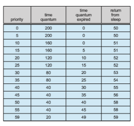
**Figure 5.29** Solaris dispatch table for time-sharing and interactive threads.

priority, the smaller the time slice; and the lower the priority, the larger the time slice. Interactive processes typically have a higher priority; CPU-bound processes, a lower priority. This scheduling policy gives good response time for interactive processes and good throughput for CPU-bound processes. The interactive class uses the same scheduling policy as the time-sharing class, but it gives windowing applications—such as those created by the KDE or GNOME window managers—a higher priority for better performance.

Figure 5.29 shows the simplifieddispatch table for scheduling time-sharing and interactive threads. These two scheduling classes include 60 priority levels, but for brevity, we display only a handful. (To see the full dispatch table on a Solaris system or VM, run dispadmin -c TS -g.) The dispatch table shown in Figure 5.29 contains the following fields:

• **Priority**. The class-dependent priority for the time-sharing and interactive classes. A higher number indicates a higher priority.

• **Time quantum**. The time quantum for the associated priority. This illus- trates the inverse relationship between priorities and time quanta: the lowest priority (priority 0) has the highest time quantum (200 millisec- onds), and the highest priority (priority 59) has the lowest time quantum (20 milliseconds).

• **Time quantum expired**. The new priority of a thread that has used its entire time quantum without blocking. Such threads are considered CPU- intensive. As shown in the table, these threads have their priorities low- ered.  

• **Return from sleep**. The priority of a thread that is returning from sleeping (such as fromwaiting for I/O). As the table illustrates,when I/O is available for a waiting thread, its priority is boosted to between 50 and 59, support- ing the scheduling policy of providing good response time for interactive processes.

Threads in the real-time class are given the highest priority. A real-time process will run before a process in any other class. This assignment allows a real-time process to have a guaranteed response from the system within a bounded period of time. In general, however, few processes belong to the real-time class.

Solaris uses the system class to run kernel threads, such as the scheduler and paging daemon. Once the priority of a system thread is established, it does not change. The system class is reserved for kernel use (user processes running in kernel mode are not in the system class).

The fixed-priority and fair-share classes were introduced with Solaris 9. Threads in the fixed-priority class have the same priority range as those in the time-sharing class; however, their priorities are not dynamically adjusted. The fair-share class uses CPU **shares** instead of priorities to make scheduling decisions. CPU shares indicate entitlement to available CPU resources and are allocated to a set of processes (known as a **project**).

Each scheduling class includes a set of priorities. However, the scheduler converts the class-specific priorities into global priorities and selects the thread with the highest global priority to run. The selected thread runs on the CPU until it (1) blocks, (2) uses its time slice, or (3) is preempted by a higher-priority thread. If there are multiple threads with the same priority, the scheduler uses a round-robin queue. Figure 5.30 illustrates how the six scheduling classes relate to one another and how they map to global priorities. Notice that the kernel maintains ten threads for servicing interrupts. These threads do not belong to any scheduling class and execute at the highest priority (160–169). Asmentioned, Solaris has traditionally used themany-to-manymodel (Section 4.3.3) but switched to the one-to-one model (Section 4.3.2) beginning with Solaris 9.

## Algorithm Evaluation

How do we select a CPU-scheduling algorithm for a particular system? As we saw in Section 5.3, there are many scheduling algorithms, each with its own parameters. As a result, selecting an algorithm can be difficult.

The first problem is defining the criteria to be used in selecting an algo- rithm. As we saw in Section 5.2, criteria are often defined in terms of CPU utilization, response time, or throughput. To select an algorithm, we must first define the relative importance of these elements. Our criteria may include several measures, such as these:

• Maximizing CPU utilization under the constraint that the maximum response time is 300 milliseconds  

**Figure 5.30** Solaris scheduling.

• Maximizing throughput such that turnaround time is (on average) linearly proportional to total execution time

Once the selection criteria have been defined,wewant to evaluate the algo- rithms under consideration. We next describe the various evaluation methods we can use.

### Deterministic Modeling

One major class of evaluation methods is **analytic evaluation**. Analytic evalu- ation uses the given algorithm and the system workload to produce a formula or number to evaluate the performance of the algorithm for that workload.

**Deterministic modeling** is one type of analytic evaluation. This method takes a particular predetermined workload and defines the performance of each algorithm for that workload. For example, assume that we have the workload shown below. All five processes arrive at time 0, in the order given, with the length of the CPU burst given in milliseconds:  

Consider the FCFS, SJF, and RR (quantum = 10 milliseconds) scheduling algo- rithms for this set of processes. Which algorithm would give the minimum average waiting time?

For the FCFS algorithm, we would execute the processes as


The waiting time is 0 milliseconds for process _P_1, 10 milliseconds for process _P_2, 39 milliseconds for process _P_3, 42 milliseconds for process _P_4, and 49 milliseconds for process _P_5\. Thus, the average waiting time is (0 + 10 + 39 + 42 + 49)/5 = 28 milliseconds.

With nonpreemptive SJF scheduling, we execute the processes as

The waiting time is 10 milliseconds for process _P_1, 32 milliseconds for process _P_2, 0 milliseconds for process _P_3, 3 milliseconds for process _P_4, and 20 millisec- onds for process _P_5\. Thus, the average waiting time is (10 + 32 + 0 + 3 + 20)/5 = 13 milliseconds.

With the RR algorithm, we execute the processes as

The waiting time is 0 milliseconds for process _P_1, 32 milliseconds for process _P_2, 20 milliseconds for process _P_3, 23 milliseconds for process _P_4, and 40 milliseconds for process _P_5\. Thus, the average waiting time is (0 + 32 + 20 + 23 + 40)/5 = 23 milliseconds.

We can see that, in this case, the average waiting time obtained with the SJF policy is less than half that obtained with FCFS scheduling; the RR algorithm gives us an intermediate value.

Deterministicmodeling is simple and fast. It gives us exact numbers, allow- ing us to compare the algorithms.However, it requires exact numbers for input, and its answers apply only to those cases. The main uses of deterministic modeling are in describing scheduling algorithms and providing examples. In cases where we are running the same program over and over again and can  

measure the program’s processing requirements exactly, wemay be able to use deterministic modeling to select a scheduling algorithm. Furthermore, over a set of examples, deterministic modeling may indicate trends that can then be analyzed and proved separately. For example, it can be shown that, for the environment described (all processes and their times available at time 0), the SJF policy will always result in the minimum waiting time.

### Queueing Models

On many systems, the processes that are run vary from day to day, so there is no static set of processes (or times) to use for deterministicmodeling.What can be determined, however, is the distribution of CPU and I/O bursts. These dis- tributions can be measured and then approximated or simply estimated. The result is a mathematical formula describing the probability of a particular CPU burst. Commonly, this distribution is exponential and is described by its mean. Similarly, we can describe the distribution of times when processes arrive in the system (the arrival-time distribution). From these two distributions, it is possible to compute the average throughput, utilization, waiting time, and so on for most algorithms.

The computer system is described as a network of servers. Each server has a queue of waiting processes. The CPU is a server with its ready queue, as is the I/O system with its device queues. Knowing arrival rates and service rates, we can compute utilization, average queue length, average wait time, and so on. This area of study is called **queueing-network analysis**.

As an example, let _n_ be the average long-term queue length (excluding the process being serviced), let _W_ be the average waiting time in the queue, and let λ be the average arrival rate for new processes in the queue (such as three processes per second). We expect that during the time _W_ that a process waits, λ ×_W_ new processes will arrive in the queue. If the system is in a steady state, then the number of processes leaving the queue must be equal to the number of processes that arrive. Thus,

_n_ \= λ ×_W_.

This equation, known as **Little’s formula**, is particularly useful because it is valid for any scheduling algorithm and arrival distribution. For example _n_ could be the number of customers in a store.

We can use Little’s formula to compute one of the three variables if we know the other two. For example, if we know that 7 processes arrive every second (on average) and that there are normally 14 processes in the queue, then we can compute the average waiting time per process as 2 seconds.

Queueing analysis can be useful in comparing scheduling algorithms, but it also has limitations. At the moment, the classes of algorithms and distribu- tions that can be handled are fairly limited. The mathematics of complicated algorithms and distributions can be difficult to work with. Thus, arrival and service distributions are often defined in mathematically tractable—but unre- alistic—ways. It is also generally necessary to make a number of indepen- dent assumptions, which may not be accurate. As a result of these difficulties, queueing models are often only approximations of real systems, and the accu- racy of the computed results may be questionable.  

### Simulations

To get a more accurate evaluation of scheduling algorithms, we can use simu- lations. Running simulations involves programming a model of the computer system. Software data structures represent the major components of the sys- tem. The simulator has a variable representing a clock. As this variable’s value is increased, the simulator modifies the system state to reflect the activities of the devices, the processes, and the scheduler. As the simulation executes, statistics that indicate algorithm performance are gathered and printed.

The data to drive the simulation can be generated in severalways. Themost common method uses a random-number generator that is programmed to generate processes, CPU burst times, arrivals, departures, and so on, according to probability distributions. The distributions can be defined mathematically (uniform, exponential, Poisson) or empirically. If a distribution is to be defined empirically, measurements of the actual system under study are taken. The results define the distribution of events in the real system; this distribution can then be used to drive the simulation.

A distribution-driven simulation may be inaccurate, however, because of relationships between successive events in the real system. The frequency distribution indicates only howmany instances of each event occur; it does not indicate anything about the order of their occurrence. To correct this problem, we can use **trace files.** We create a trace by monitoring the real system and recording the sequence of actual events (Figure 5.31).We then use this sequence to drive the simulation. Trace files provide an excellent way to compare two algorithms on exactly the same set of real inputs. This method can produce accurate results for its inputs.

Simulations can be expensive, often requiring many hours of computer time. A more detailed simulation provides more accurate results, but it also

**Figure 5.31** Evaluation of CPU schedulers by simulation.  
takes more computer time. In addition, trace files can require large amounts of storage space. Finally, the design, coding, and debugging of the simulator can be a major task.

### Implementation

Even a simulation is of limited accuracy. The only completely accurate way to evaluate a scheduling algorithm is to code it up, put it in the operating system, and see how it works. This approach puts the actual algorithm in the real system for evaluation under real operating conditions.

This method is not without expense. The expense is incurred in coding the algorithm and modifying the operating system to support it (along with its required data structures). There is also cost in testing the changes, usually in virtual machines rather than on dedicated hardware. **Regression testing** con- firms that the changes haven’t made anything worse, and haven’t caused new bugs or caused old bugs to be recreated (for example because the algorithm being replaced solved some bug and changing it caused that bug to reoccur).

Another difficulty is that the environment in which the algorithm is used will change. The environment will change not only in the usual way, as new programs are written and the types of problems change, but also as a result of the performance of the scheduler. If short processes are given priority, then users may break larger processes into sets of smaller processes. If interactive processes are given priority over noninteractive processes, then users may switch to interactive use. This problem is usually addressed by using tools or scripts that encapsulate complete sets of actions, repeatedly using those tools, and using those tools while measuring the results (and detecting any problems they cause in the new environment).

Of course human or program behavior can attempt to circumvent schedul- ing algorithms. For example, researchers designed one system that classi- fied interactive and noninteractive processes automatically by looking at the amount of terminal I/O. If a process did not input or output to the terminal in a 1-second interval, the process was classified as noninteractive and was moved to a lower-priority queue. In response to this policy, one programmer modified his programs to write an arbitrary character to the terminal at regular intervals of less than 1 second. The system gave his programs a high priority, even though the terminal output was completely meaningless.

In general, most flexible scheduling algorithms are those that can be altered by the system managers or by the users so that they can be tuned for a spe- cific application or set of applications. A workstation that performs high-end graphical applications, for instance, may have scheduling needs different from those of a web server or file server. Some operating systems—particularly sev- eral versions of UNIX—allow the system manager to fine-tune the scheduling parameters for a particular system configuration. For example, Solaris pro- vides the dispadmin command to allow the system administrator to modify the parameters of the scheduling classes described in Section 5.7.3.

Another approach is to use APIs that can modify the priority of a process or thread. The Java, POSIX, and Windows APIs provide such functions. The downfall of this approach is that performance-tuning a system or application most often does not result in improvedperformance inmore general situations.  

## Summary

• CPU scheduling is the task of selecting a waiting process from the ready queue and allocating the CPU to it. The CPU is allocated to the selected process by the dispatcher.

• Scheduling algorithms may be either preemptive (where the CPU can be taken away from a process) or nonpreemptive (where a process must voluntarily relinquish control of the CPU). Almost all modern operating systems are preemptive.

• Scheduling algorithms can be evaluated according to the following five criteria: (1) CPUutilization, (2) throughput, (3) turnaround time, (4)waiting time, and (5) response time.

• First-come, first-served (FCFS) scheduling is the simplest scheduling algo- rithm, but it can cause short processes to wait for very long processes.

• Shortest-job-first (SJF) scheduling is provably optimal, providing the short- est average waiting time. Implementing SJF scheduling is difficult, how- ever, because predicting the length of the next CPU burst is difficult.

• Round-robin (RR) scheduling allocates the CPU to each process for a time quantum. If the process does not relinquish the CPU before its time quan- tum expires, the process is preempted, and another process is scheduled to run for a time quantum.

• Priority scheduling assigns each process a priority, and the CPU is allocated to the process with the highest priority. Processes with the same priority can be scheduled in FCFS order or using RR scheduling.

• Multilevel queue scheduling partitions processes into several separate queues arranged by priority, and the scheduler executes the processes in the highest-priority queue. Different scheduling algorithms may be used in each queue.

• Multilevel feedback queues are similar to multilevel queues, except that a process may migrate between different queues.

• Multicore processors place one or more CPUs on the same physical chip, and each CPU may have more than one hardware thread. From the per- spective of the operating system, each hardware thread appears to be a logical CPU.

• Load balancing on multicore systems equalizes loads between CPU cores, althoughmigrating threads between cores to balance loadsmay invalidate cache contents and therefore may increase memory access times.

• Soft real-time scheduling gives priority to real-time tasks over non-real- time tasks. Hard real-time scheduling provides timing guarantees for real- time tasks,

• Rate-monotonic real-time scheduling schedules periodic tasks using a static priority policy with preemption.  

• Earliest-deadline-first (EDF) scheduling assigns priorities according to deadline. The earlier the deadline, the higher the priority; the later the deadline, the lower the priority.

• Proportional share scheduling allocates _T_ shares among all applications. If an application is allocated _N_ shares of time, it is ensured of having _N_∕_T_ of the total processor time.

• Linux uses the completely fair scheduler (CFS), which assigns a proportion of CPU processing time to each task. The proportion is based on the virtual runtime (vruntime) value associated with each task.

• Windows scheduling uses a preemptive, 32-level priority scheme to deter- mine the order of thread scheduling.

• Solaris identifies six unique scheduling classes that are mapped to a global priority. CPU-intensive threads are generally assigned lower priorities (and longer time quantums), and I/O-bound threads are usually assigned higher priorities (with shorter time quantums.)

• Modeling and simulations can be used to evaluate a CPU scheduling algo- rithm.

**Practice Exercises**

**5.1** ACPU-scheduling algorithm determines an order for the execution of its scheduled processes. Given _n_ processes to be scheduled on one proces- sor, howmany different schedules are possible? Give a formula in terms of _n._

**5.2** Explain the difference betweenpreemptive and nonpreemptive schedul- ing.

**5.3** Suppose that the following processes arrive for execution at the times indicated. Each processwill run for the amount of time listed. In answer- ing the questions, use nonpreemptive scheduling, and base all decisions on the information you have at the time the decision must be made.

a. What is the average turnaround time for these processes with the FCFS scheduling algorithm?

b. What is the average turnaround time for these processes with the SJF scheduling algorithm?

c. The SJF algorithm is supposed to improve performance, but notice that we chose to run process _P_1 at time 0 because we did not know that two shorter processes would arrive soon. Compute what the average turnaround time will be if the CPU is left idle for the first 1 unit and then SJF scheduling is used. Remember that processes _P_1 and _P_2 are waiting during this idle time, so their waiting time may increase. This algorithm could be known as **_future-knowledge scheduling_**.

**5.4** Consider the following set of processes, with the length of the CPU burst time given in milliseconds:


a. Draw four Gantt charts that illustrate the execution of these pro- cesses using the following scheduling algorithms: FCFS, SJF, non- preemptive priority (a larger priority number implies a higher priority), and RR (quantum = 2).

b. What is the turnaround time of each process for each of the scheduling algorithms in part a?

c. What is the waiting time of each process for each of these schedul- ing algorithms?

d. Which of the algorithms results in the minimum average waiting time (over all processes)?

**5.5** The following processes are being scheduled using a preemptive, round- robin scheduling algorithm.
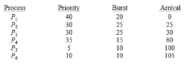
Each process is assigned a numerical priority,with a higher number indi- cating a higher relative priority. In addition to the processes listed below, the system also has an **idle task** (which consumes no CPU resources and is identified as _Pidle_). This task has priority 0 and is scheduled when- ever the system has no other available processes to run. The length of a time quantum is 10 units. If a process is preempted by a higher-priority process, the preempted process is placed at the end of the queue.

a. Show the scheduling order of the processes using a Gantt chart.

b. What is the turnaround time for each process?

c. What is the waiting time for each process?

d. What is the CPU utilization rate?

**5.6** What advantage is there in having different time-quantum sizes at dif- ferent levels of a multilevel queueing system?

**5.7** Many CPU-scheduling algorithms are parameterized. For example, the RR algorithm requires a parameter to indicate the time slice. Multilevel feedback queues require parameters to define the number of queues, the scheduling algorithms for each queue, the criteria used to move processes between queues, and so on. These algorithms are thus really sets of algorithms (for example, the set

of RR algorithms for all time slices, and so on). One set of algorithmsmay include another (for example, the FCFS algorithm is the RR algorithm with an infinite time quantum). What (if any) relation holds between the following pairs of algorithm sets?

a. Priority and SJF

b. Multilevel feedback queues and FCFS

c. Priority and FCFS

d. RR and SJF

**5.8** Suppose that a CPU scheduling algorithm favors those processes that have used the least processor time in the recent past. Why will this algorithm favor I/O-bound programs and yet not permanently starve CPU-bound programs?

**5.9** Distinguish between PCS and SCS scheduling.

**5.10** The traditional UNIX scheduler enforces an inverse relationship between priority numbers and priorities: the higher the number, the lower the priority. The scheduler recalculates process priorities once per second using the following function:

Priority = (recent CPU usage / 2) + base

where base = 60 and _recent CPU usage_ refers to a value indicating how often a process has used the CPU since priorities were last recalculated.

Assume that recent CPU usage for process _P_1 is 40, for process _P_2 is 18, and for process _P_3 is 10. What will be the new priorities for these three processes when priorities are recalculated? Based on this information, does the traditional UNIX scheduler raise or lower the relative priority of a CPU-bound process?  

**Further Reading**

Scheduling policies used in the UNIX FreeBSD 5.2 are presented by \[McKusick et al. (2015)\]; The Linux CFS scheduler is further described in https://www.ibm.com/developerworks/library/l-completely-fair-scheduler/. Solaris scheduling is described by \[Mauro and McDougall (2007)\]. \[Russi- novich et al. (2017)\] discusses scheduling in Windows internals. \[Butenhof (1997)\] and \[Lewis and Berg (1998)\] describe scheduling in Pthreads systems. Multicore scheduling is examined in \[McNairy and Bhatia (2005)\], \[Kongetira et al. (2005)\], and \[Siddha et al. (2007)\] .

**Bibliography**

**\[Butenhof (1997)\]** D. Butenhof, _Programming with POSIX Threads_, Addison- Wesley (1997).

**\[Kongetira et al. (2005)\]** P. Kongetira, K. Aingaran, and K. Olukotun, “Niagara: A 32-Way Multithreaded SPARC Processor”, _IEEE Micro Magazine_, Volume 25, Number 2 (2005), pages 21–29.

**\[Lewis and Berg (1998)\]** B. Lewis and D. Berg, _Multithreaded Programming with Pthreads_, Sun Microsystems Press (1998).

**\[Mauro and McDougall (2007)\]** J. Mauro and R. McDougall, _Solaris Internals: Core Kernel Architecture_, Prentice Hall (2007).

**\[McKusick et al. (2015)\]** M. K. McKusick, G. V. Neville-Neil, and R. N. M. Wat- son,_The Design and Implementation of the FreeBSDUNIXOperating System–Second Edition_, Pearson (2015).

**\[McNairy and Bhatia (2005)\]** C. McNairy and R. Bhatia, “Montecito: A Dual– Core, Dual-Threaded Itanium Processor”, _IEEE Micro Magazine_, Volume 25, Number 2 (2005), pages 10–20.

**\[Russinovich et al. (2017)\]** M.Russinovich,D.A. Solomon, andA. Ionescu,_Win- dows Internals–Part 1,_ Seventh Edition, Microsoft Press (2017).

**\[Siddha et al. (2007)\]** S. Siddha, V. Pallipadi, and A. Mallick, “Process Schedul- ing Challenges in the Era of Multi-Core Processors”, _Intel Technology Journal_, Volume 11, Number 4 (2007).  

**Exercises**

**Chapter 5 Exercises**

**5.11** Of these two types of programs:

a. I/O-bound

b. CPU-bound

which is more likely to have voluntary context switches, and which is more likely to have nonvoluntary context switches? Explain your answer.

**5.12** Discuss how the following pairs of scheduling criteria conflict in certain settings.

a. CPU utilization and response time

b. Average turnaround time and maximum waiting time

c. I/O device utilization and CPU utilization

**5.13** One technique for implementing **lottery scheduling** works by assigning processes lottery tickets, which are used for allocating CPU time. When- ever a scheduling decision has to be made, a lottery ticket is chosen at random, and the process holding that ticket gets the CPU. The BTV oper- ating system implements lottery scheduling by holding a lottery 50 times each second, with each lottery winner getting 20 milliseconds of CPU time (20 milliseconds × 50 = 1 second). Describe how the BTV scheduler can ensure that higher-priority threads receive more attention from the CPU than lower-priority threads.

**5.14** Most scheduling algorithmsmaintain a **run queue**, which lists processes eligible to run on a processor. On multicore systems, there are two general options: (1) each processing core has its own run queue, or (2) a single run queue is shared by all processing cores. What are the advantages and disadvantages of each of these approaches?

**5.15** Consider the exponential average formula used to predict the length of the next CPU burst. What are the implications of assigning the following values to the parameters used by the algorithm?

a. α = 0 and τ0 = 100 milliseconds

b. α = 0_._99 and τ0 = 10 milliseconds

**5.16** A variation of the round-robin scheduler is the **regressive round-robin** scheduler. This scheduler assigns each process a time quantum and a priority. The initial value of a time quantum is 50milliseconds.However, every time a process has been allocated the CPU and uses its entire time quantum (does not block for I/O), 10 milliseconds is added to its time quantum, and its priority level is boosted. (The time quantum for a process can be increased to a maximum of 100 milliseconds.) When a process blocks before using its entire time quantum, its time quantum is reduced by 5 milliseconds, but its priority remains the same. What type of process (CPU-bound or I/O-bound) does the regressive round-robin scheduler favor? Explain.

**EX-12**  

**5.17** Consider the following set of processes, with the length of the CPU burst given in milliseconds:

The processes are assumed to have arrived in the order _P_1, _P_2, _P_3, _P_4, _P_5, all at time 0.

a. Draw four Gantt charts that illustrate the execution of these pro- cesses using the following scheduling algorithms: FCFS, SJF, non- preemptive priority (a larger priority number implies a higher priority), and RR (quantum = 2).

b. What is the turnaround time of each process for each of the scheduling algorithms in part a?

c. What is the waiting time of each process for each of these schedul- ing algorithms?

d. Which of the algorithms results in the minimum average waiting time (over all processes)?

**5.18** The following processes are being scheduled using a preemptive, priority-based, round-robin scheduling algorithm.

Each process is assigned a numerical priority,with a higher number indi- cating a higher relative priority. The scheduler will execute the highest- priority process. For processes with the same priority, a round-robin scheduler will be used with a time quantum of 10 units. If a process is preempted by a higher-priority process, the preempted process is placed at the end of the queue.

a. Show the scheduling order of the processes using a Gantt chart.

b. What is the turnaround time for each process?

c. What is the waiting time for each process?

**5.19** The nice command is used to set the nice value of a process on Linux, as well as on other UNIX systems. Explain why some systemsmay allow any user to assign a process a nice value _\>_\= 0 yet allow only the root (or administrator) user to assign nice values _<_ 0.

**EX-13**  

**Exercises**

**5.20** Which of the following scheduling algorithms could result in starvation?

a. First-come, first-served

b. Shortest job first

c. Round robin

d. Priority

**5.21** Consider a variant of the RR scheduling algorithm in which the entries in the ready queue are pointers to the PCBs.

a. What would be the effect of putting two pointers to the same process in the ready queue?

b. What would be two major advantages and two disadvantages of this scheme?

c. Howwould youmodify the basic RR algorithm to achieve the same effect without the duplicate pointers?

**5.22** Consider a system running ten I/O-bound tasks and one CPU-bound task. Assume that the I/O-bound tasks issue an I/O operation once for every millisecond of CPU computing and that each I/O operation takes 10 milliseconds to complete. Also assume that the context-switching overhead is 0.1millisecond and that all processes are long-running tasks. Describe the CPU utilization for a round-robin scheduler when:

a. The time quantum is 1 millisecond

b. The time quantum is 10 milliseconds

**5.23** Consider a system implementing multilevel queue scheduling. What strategy can a computer user employ to maximize the amount of CPU time allocated to the user’s process?

**5.24** Consider a preemptive priority scheduling algorithm based on dynami- cally changing priorities. Larger priority numbers imply higher priority. When a process is waiting for the CPU (in the ready queue, but not run- ning), its priority changes at a rate α. When it is running, its priority changes at a rate β. All processes are given a priority of 0 when they enter the ready queue. The parameters α and β can be set to give many different scheduling algorithms.

a. What is the algorithm that results from β _\>_ α _\>_ 0?

b. What is the algorithm that results from α _<_ β _<_ 0?

**5.25** Explain the how the following scheduling algorithmsdiscriminate either in favor of or against short processes:

a. FCFS

b. RR

c. Multilevel feedback queues

**EX-14**  

**5.26** Describe why a shared ready queue might suffer from performance problems in an SMP environment.

**5.27** Consider a load-balancing algorithm that ensures that each queue has approximately the same number of threads, independent of priority. How effectively would a priority-based scheduling algorithm handle this situation if one run queue had all high-priority threads and a second queue had all low-priority threads?

**5.28** Assume that an SMP system has private, per-processor run queues. When a new process is created, it can be placed in either the same queue as the parent process or a separate queue.

a. What are the benefits of placing the new process in the same queue as its parent?

b. What are the benefits of placing the new process in a different queue?

**5.29** Assume that a thread has blocked for network I/O and is eligible to run again. Describe why a NUMA-aware scheduling algorithm should reschedule the thread on the same CPU on which it previously ran.

**5.30** Using the Windows scheduling algorithm, determine the numeric pri- ority of each of the following threads.

a. A thread in the REALTIME PRIORITY CLASS with a relative priority of NORMAL

b. A thread in the ABOVE NORMAL PRIORITY CLASS with a relative priority of HIGHEST

c. A thread in the BELOW NORMAL PRIORITY CLASS with a relative priority of ABOVE NORMAL

**5.31** Assuming that no threads belong to the REALTIME PRIORITY CLASS and that none may be assigned a TIME CRITICAL priority, what combination of priority class and priority corresponds to the highest possible relative priority in Windows scheduling?

**5.32** Consider the scheduling algorithm in the Solaris operating system for time-sharing threads.

a. What is the time quantum (in milliseconds) for a thread with pri- ority 15? With priority 40?

b. Assume that a thread with priority 50 has used its entire time quantum without blocking. What new priority will the scheduler assign this thread?

c. Assume that a thread with priority 20 blocks for I/O before its time quantum has expired. What new priority will the scheduler assign this thread?

**EX-15**  

**Exercises**

**5.33** Assume that two tasks,_A_ and _B_, are running on a Linux system. The nice values of_A_ and _B_ are−5 and+5, respectively. Using the CFS scheduler as a guide, describe how the respective values of vruntime vary between the two processes given each of the following scenarios:

• Both _A_ and _B_ are CPU-bound.

• _A_ is I/O-bound, and _B_ is CPU-bound.

• _A_ is CPU-bound, and _B_ is I/O-bound.

**5.34** Provide a specific circumstance that illustrates where rate-monotonic scheduling is inferior to earliest-deadline-first scheduling in meeting real-time process deadlines?

**5.35** Consider two processes, _P_1 and _P_2, where _p_1 = 50, _t_1 = 25, _p_2 = 75, and _t_2 = 30.

a. Can these two processes be scheduled using rate-monotonic scheduling? Illustrate your answer using a Gantt chart such as the ones in Figure 5.21–Figure 5.24.

b. Illustrate the scheduling of these two processes using earliest- deadline-first (EDF) scheduling.

**5.36** Explain why interrupt and dispatch latency times must be bounded in a hard real-time system.

**5.37** Describe the advantages of using heterogeneous multiprocessing in a mobile system.

**EX-16**  

**Chapter 5 CPU Scheduling**

**Programming Projects**

**Scheduling Algorithms**

This project involves implementing several different process scheduling algo- rithms. The scheduler will be assigned a predefined set of tasks and will schedule the tasks based on the selected scheduling algorithm. Each task is assigned a priority and CPU burst. The following scheduling algorithms will be implemented:

• First-come, first-served (FCFS), which schedules tasks in the order inwhich they request the CPU.

• Shortest-job-first (SJF), which schedules tasks in order of the length of the tasks’ next CPU burst.

• Priority scheduling, which schedules tasks based on priority.

• Round-robin (RR) scheduling, where each task is run for a time quantum (or for the remainder of its CPU burst).

• Priority with round-robin, which schedules tasks in order of priority and uses round-robin scheduling for tasks with equal priority.

Priorities range from 1 to 10, where a higher numeric value indicates a higher relative priority. For round-robin scheduling, the length of a time quantum is 10 milliseconds.

**I. Implementation**

The implementation of this project may be completed in either C or Java, and program files supporting both of these languages are provided in the source code download for the text. These supporting files read in the schedule of tasks, insert the tasks into a list, and invoke the scheduler.

The schedule of tasks has the form \[**_task name_**\] \[**_priority_**\] \[**_CPU burst_**\], with the following example format:

T1, 4, 20 T2, 2, 25 T3, 3, 25 T4, 3, 15 T5, 10, 10

Thus, task T1 has priority 4 and a CPU burst of 20 milliseconds, and so forth. It is assumed that all tasks arrive at the same time, so your scheduler algorithms do not have to support higher-priority processes preempting processes with lower priorities. In addition, tasks do not have to be placed into a queue or list in any particular order.

There are a few different strategies for organizing the list of tasks, as first presented in Section 5.1.2. One approach is to place all tasks in a single unordered list, where the strategy for task selection depends on the scheduling

**P-29**  

**Programming Projects**

algorithm. For example, SJF scheduling would search the list to find the task with the shortest next CPU burst. Alternatively, a list could be ordered accord- ing to scheduling criteria (that is, by priority). One other strategy involves having a separate queue for each unique priority, as shown in Figure 5.7. These approaches are briefly discussed in Section 5.3.6. It is also worth highlight- ing that we are using the terms **_list_** and **_queue_** somewhat interchangeably. However, a queue has very specific FIFO functionality, whereas a list does not have such strict insertion and deletion requirements. You are likely to find the functionality of a general list to be more suitable when completing this project.

**II. C Implementation Details**

The file driver.c reads in the schedule of tasks, inserts each task into a linked list, and invokes the process scheduler by calling the schedule() function. The schedule() function executes each task according to the specified scheduling algorithm. Tasks selected for execution on the CPU are determinedby the pick- NextTask() function and are executed by invoking the run() function defined in the CPU.c file. AMakefile is used to determine the specific scheduling algo- rithm that will be invoked by driver. For example, to build the FCFS scheduler, we would enter

make fcfs

and would execute the scheduler (using the schedule of tasks schedule.txt) as follows:

./fcfs schedule.txt

Refer to the README file in the source code download for further details. Before proceeding, be sure to familiarize yourself with the source code provided as well as the Makefile.

**III. Java Implementation Details**

The file Driver.java reads in the schedule of tasks, inserts each task into a Java ArrayList, and invokes the process scheduler by calling the schedule() method. The following interface identifies a generic scheduling algorithm, which the five different scheduling algorithms will implement:

public interface Algorithm _{_

// Implementation of scheduling algorithm public void schedule();

// Selects the next task to be scheduled public Task pickNetTask();

_}_ The schedule()method obtains the next task to be run on the CPU by invok- ing the pickNextTask() method and then executes this Task by calling the static run()method in the CPU.java class.

The program is run as follows:

java Driver fcfs schedule.txt

**P-30**  

**Chapter 5 CPU Scheduling**

Refer to the README file in the source code download for further details. Before proceeding, be sure to familiarize yourself with all Java source files provided in the source code download.

**IV. Further Challenges**

Two additional challenges are presented for this project:

**1\.** Each task provided to the scheduler is assigned a unique task (tid). If a scheduler is running in an SMP environment where each CPU is separately running its own scheduler, there is a possible race condition on the variable that is used to assign task identifiers. Fix this race condition using an atomic integer.

On Linux and macOS systems, the sync fetch and add() function can be used to atomically increment an integer value. As an example, the following code sample atomically increments value by 1:

int value = 0; sync fetch and add(&value,1);

Refer to the Java API for details on how to use the AtomicInteger class for Java programs.

**2\.** Calculate the average turnaround time, waiting time, and response time for each of the scheduling algorithms.

**P-31**