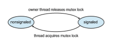
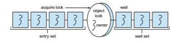
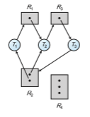
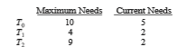
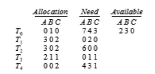
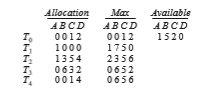
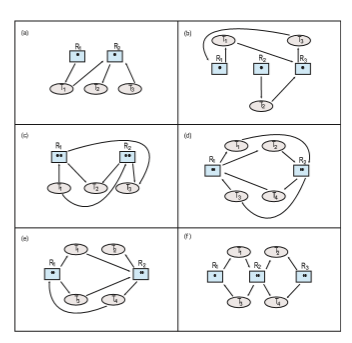

  

Part Three

_Process Synchronization_

A system typically consists of several (perhaps hundreds or even thou- sands) of threads running either concurrently or in parallel. Threads often share user data. Meanwhile, the operating system continuously updates various data structures to support multiple threads. A _race condition_ exists when access to shared data is not controlled, possibly resulting in corrupt data values.

_Process synchronization_ involves using tools that control access to shared data to avoid race conditions. These tools must be used carefully, as their incorrect use can result in poor system performance, including deadlock.  

_6_ **CHAPTER**

# Synchronization Tools

A **cooperating process** is one that can affect or be affected by other processes executing in the system. Cooperating processes can either directly share a logical address space (that is, both code and data) or be allowed to share data only through sharedmemory or message passing. Concurrent access to shared data may result in data inconsistency, however. In this chapter, we discuss various mechanisms to ensure the orderly execution of cooperating processes that share a logical address space, so that data consistency is maintained.

**CHAPTER OBJECTIVES**

• Describe the critical-section problem and illustrate a race condition.

• Illustrate hardware solutions to the critical-section problem using memory barriers, compare-and-swap operations, and atomic variables.

• Demonstrate how mutex locks, semaphores, monitors, and condition vari- ables can be used to solve the critical-section problem.

• Evaluate tools that solve the critical-section problem in low-, moderate-, and high-contention scenarios.

## Background

We’ve already seen that processes can execute concurrently or in parallel. Sec- tion 3.2.2 introduced the role of process scheduling and described how the CPU scheduler switches rapidly between processes to provide concurrent exe- cution. This means that one process may only partially complete execution before another process is scheduled. In fact, a process may be interrupted at any point in its instruction stream, and the processing core may be assigned to execute instructions of another process. Additionally, Section 4.2 introduced parallel execution, in which two instruction streams (representing different processes) execute simultaneously on separate processing cores. In this chap- ter, we explain how concurrent or parallel execution can contribute to issues involving the integrity of data shared by several processes.

Let’s consider an example of how this can happen. In Chapter 3, we devel- oped a model of a system consisting of cooperating sequential processes or threads, all running asynchronously and possibly sharing data. We illustrated this model with the producer–consumer problem, which is a representative paradigm of many operating system functions. Specifically, in Section 3.5, we described how a bounded buffer could be used to enable processes to share memory.

We now return to our consideration of the bounded buffer. As we pointed out, our original solution allowed at most BUFFER SIZE − 1 items in the buffer at the same time. Suppose we want to modify the algorithm to remedy this deficiency. One possibility is to add an integer variable, count, initialized to 0. count is incremented every time we add a new item to the buffer and is decremented every time we remove one item from the buffer. The code for the producer process can be modified as follows:
```
while (true) {*/ *produce an item in next produced */

while (count == BUFFER SIZE) ;*/ *do nothing */

buffer[in] = next produced; in = (in + 1) % BUFFER SIZE; count++;

}
```
The code for the consumer process can be modified as follows:
```
while (true) { while (count == 0)

;*/ *do nothing */

next consumed = buffer[out]; out = (out + 1) % BUFFER SIZE; count--;

/* consume the item in next consumed */ }
```
Although the producer and consumer routines shown above are correct separately, they may not function correctly when executed concurrently. As an illustration, suppose that the value of the variable count is currently 5 and that the producer and consumer processes concurrently execute the statements “count++” and “count--”. Following the execution of these two statements, the value of the variable countmay be 4, 5, or 6! The only correct result, though, is count == 5, which is generated correctly if the producer and consumer execute separately.  

We can show that the value of count may be incorrect as follows. Note that the statement “count++” may be implemented in machine language (on a typical machine) as follows:

_register_1 = count _register_1 = _register_1 + 1 count = _register_1

where _register_1 is one of the local CPU registers. Similarly, the statement “count- -” is implemented as follows:

_register_2 = count _register_2 = _register_2 − 1 count = _register_2

where again _register_2 is one of the local CPU registers. Even though _register_1 and _register_2 may be the same physical register, remember that the contents of this register will be saved and restored by the interrupt handler (Section 1.2.3).

The concurrent execution of “count++” and “count--” is equivalent to a sequential execution in which the lower-level statements presented previously are interleaved in some arbitrary order (but the order within each high-level statement is preserved). One such interleaving is the following:
```
_T_0: _producer_ execute _register_1 = count {_register_1 = 5} _T_1: _producer_ execute _register_1 = _register_1 + 1 {_register_1 = 6} _T_2: _consumer_ execute _register_2 = count {_register_2 = 5} _T_3: _consumer_ execute _register_2 = _register_2 − 1 {_register_2 = 4} _T_4: _producer_ execute count = _register_1 {_count_ = 6} _T_5: _consumer_ execute count = _register_2 {_count_ = 4}
```
Notice that we have arrived at the incorrect state “count == 4”, indicating that four buffers are full, when, in fact, five buffers are full. If we reversed the order of the statements at _T_4 and _T_5, we would arrive at the incorrect state “count == 6”.

We would arrive at this incorrect state because we allowed both processes to manipulate the variable count concurrently. A situation like this, where several processes access and manipulate the same data concurrently and the outcome of the execution depends on the particular order in which the access takes place, is called a **race condition**. To guard against the race condition above, we need to ensure that only one process at a time can be manipulating the variable count. To make such a guarantee, we require that the processes be synchronized in some way.

Situations such as the one just described occur frequently in operating systems as different parts of the system manipulate resources. Furthermore, as we have emphasized in earlier chapters, the prominence of multicore sys- tems has brought an increased emphasis on developing multithreaded appli- cations. In such applications, several threads—which are quite possibly shar- ing data—are running in parallel on different processing cores. Clearly, we want any changes that result from such activities not to interfere with one another. Because of the importance of this issue, we devote a major portion of this chapter to **process synchronization** and **coordination** among cooperating processes.

## The Critical-Section Problem

We begin our consideration of process synchronization by discussing the so- called critical-section problem. Consider a system consisting of _n_ processes {_P_0,_P_1, _..._,_Pn_−1}. Each process has a segment of code, called a **critical section**, in which the process may be accessing — and updating — data that is shared with at least one other process. The important feature of the system is that, when one process is executing in its critical section, no other process is allowed to execute in its critical section. That is, no two processes are executing in their critical sections at the same time. The **_critical-section problem_** is to design a protocol that the processes can use to synchronize their activity so as to cooperatively share data. Each process must request permission to enter its critical section. The section of code implementing this request is the **entry section**. The critical section may be followed by an **exit section**. The remaining code is the **remainder section**. The general structure of a typical process is shown in Figure 6.1. The entry section and exit section are enclosed in boxes to highlight these important segments of code.

A solution to the critical-section problem must satisfy the following three requirements:

**1. Mutual exclusion**. If process _Pi_ is executing in its critical section, then no other processes can be executing in their critical sections.

**2. Progress**. If no process is executing in its critical section and some pro- cesses wish to enter their critical sections, then only those processes that are not executing in their remainder sections can participate in decid- ing which will enter its critical section next, and this selection cannot be postponed indefinitely.
```
while (true) {

_entry section_

critical section

_exit section_

remainder section

}
```
**Figure 6.1** General structure of a typical process.  

**3. Bounded waiting**. There exists a bound, or limit, on the number of times that other processes are allowed to enter their critical sections after a process has made a request to enter its critical section and before that request is granted.

We assume that each process is executing at a nonzero speed. However, we can make no assumption concerning the relative speed of the _n_ processes.

At a given point in time, many kernel-mode processes may be active in the operating system. As a result, the code implementing an operating system (**_kernel code_**) is subject to several possible race conditions. Consider as an example a kernel data structure that maintains a list of all open files in the system. This list must be modifiedwhen a new file is opened or closed (adding the file to the list or removing it from the list). If two processeswere to open files simultaneously, the separate updates to this list could result in a race condition.

Another example is illustrated in Figure 6.2. In this situation, two pro- cesses, _P_0 and _P_1, are creating child processes using the fork() system call. Recall from Section 3.3.1 that fork() returns the process identifier of the newly created process to the parent process. In this example, there is a race condi- tion on the variable kernel variable next available pid which represents the value of the next available process identifier. Unless mutual exclusion is provided, it is possible the same process identifier number could be assigned to two separate processes.

Other kernel data structures that are prone to possible race conditions include structures for maintaining memory allocation, for maintaining process lists, and for interrupt handling. It is up to kernel developers to ensure that the operating system is free from such race conditions.

The critical-section problem could be solved simply in a single-core envi- ronment if we could prevent interrupts from occurring while a shared variable was being modified. In this way, we could be sure that the current sequence
```
next_available_pid = 2615

pid_t child = fork ();

child = 2615

return 2615

request pid

request pid

return 2615

child = 2615

0

pid_t child = fork ();

P 1P

tim e
```
**Figure 6.2** Race condition when assigning a pid.  of instructions would be allowed to execute in order without preemption. No other instructions would be run, so no unexpected modifications could be made to the shared variable.

Unfortunately, this solution is not as feasible in a multiprocessor environ- ment. Disabling interrupts on a multiprocessor can be time consuming, since the message is passed to all the processors. This message passing delays entry into each critical section, and system efficiency decreases. Also consider the effect on a system’s clock if the clock is kept updated by interrupts.

Two general approaches are used to handle critical sections in operating systems: **preemptive kernels** and **nonpreemptive kernels**. A preemptive ker- nel allows a process to be preempted while it is running in kernel mode. A nonpreemptive kernel does not allow a process running in kernel mode to be preempted; a kernel-mode process will run until it exits kernel mode, blocks, or voluntarily yields control of the CPU.

Obviously, a nonpreemptive kernel is essentially free from race conditions on kernel data structures, as only one process is active in the kernel at a time. We cannot say the same about preemptive kernels, so they must be carefully designed to ensure that shared kernel data are free from race conditions. Pre- emptive kernels are especially difficult to design for SMP architectures, since in these environments it is possible for two kernel-mode processes to run simultaneously on different CPU cores.

Why, then, would anyone favor a preemptive kernel over a nonpreemp- tive one? A preemptive kernel may be more responsive, since there is less risk that a kernel-mode process will run for an arbitrarily long period before relin- quishing the processor to waiting processes. (Of course, this risk can also be minimized by designing kernel code that does not behave in this way.) Fur- thermore, a preemptive kernel is more suitable for real-time programming, as it will allow a real-time process to preempt a process currently running in the kernel.

## Peterson’s Solution

Next, we illustrate a classic software-based solution to the critical-section prob- lem known as **Peterson’s solution**. Because of the way modern computer architectures perform basic machine-language instructions, such as load and store, there are no guarantees that Peterson’s solution will work correctly on such architectures. However, we present the solution because it provides a good algorithmic description of solving the critical-section problem and illus- trates some of the complexities involved in designing software that addresses the requirements of mutual exclusion, progress, and bounded waiting.

Peterson’s solution is restricted to two processes that alternate execution between their critical sections and remainder sections. The processes are num- bered _P_0 and _P_1. For convenience, when presenting _Pi_, we use _Pj_ to denote the other process; that is, j equals 1 − i.

Peterson’s solution requires the two processes to share two data items:

int turn; boolean flag[2];  
```
while (true) { flag[i] = true; turn = j; while (flag[j] && turn == j)

;

/* critical section */

flag[i] = false;

/*remainder section */ }
```
**Figure 6.3** The structure of process _Pi_ in Peterson’s solution.

The variable turn indicates whose turn it is to enter its critical section. That is, if turn == i, then process _Pi_ is allowed to execute in its critical section. The flag array is used to indicate if a process is ready to enter its critical section. For example, if flag[i] is true, _Pi_ is ready to enter its critical section. With an explanation of these data structures complete, we are now ready to describe the algorithm shown in Figure 6.3.

To enter the critical section, process _Pi_ first sets flag[i] to be true and then sets turn to the value j, thereby asserting that if the other process wishes to enter the critical section, it can do so. If both processes try to enter at the same time, turn will be set to both i and j at roughly the same time. Only one of these assignments will last; the other will occur but will be overwritten imme- diately. The eventual value of turn determines which of the two processes is allowed to enter its critical section first.

We now prove that this solution is correct. We need to show that:

**1.** Mutual exclusion is preserved.

**2.** The progress requirement is satisfied.

**3.** The bounded-waiting requirement is met.

To prove property 1, we note that each _Pi_ enters its critical section only if either flag[j] == false or turn == i. Also note that, if both processes can be executing in their critical sections at the same time, then flag[0] == flag[1] == true. These two observations imply that _P_0 and _P_1 could not have successfully executed their while statements at about the same time, since the value of turn can be either 0 or 1 but cannot be both. Hence, one of the processes—say, _Pj_—must have successfully executed the while statement, whereas _Pi_ had to execute at least one additional statement (“turn == j”). However, at that time, flag[j] == true and turn == j, and this condition will persist as long as _Pj_ is in its critical section; as a result, mutual exclusion is preserved.  

Toprove properties 2 and 3,we note that a process_Pi_ can be prevented from entering the critical section only if it is stuck in the while loopwith the condition flag[j] == true and turn == j; this loop is the only one possible. If _Pj_ is not ready to enter the critical section, then flag[j] == false, and _Pi_ can enter its critical section. If _Pj_ has set flag[j] to true and is also executing in its while statement, then either turn == i or turn == j. If turn == i, then _Pi_ will enter the critical section. If turn == j, then _Pj_ will enter the critical section. However, once _Pj_ exits its critical section, it will reset flag[j] to false, allowing _Pi_ to enter its critical section. If _Pj_ resets flag[j] to true, it must also set turn to i. Thus, since _Pi_ does not change the value of the variable turn while executing the while statement, _Pi_ will enter the critical section (progress) after at most one entry by _Pj_ (bounded waiting).

As mentioned at the beginning of this section, Peterson’s solution is not guaranteed to work on modern computer architectures for the primary rea- son that, to improve system performance, processors and/or compilers may reorder read and write operations that have no dependencies. For a single- threaded application, this reordering is immaterial as far as program correct- ness is concerned, as the final values are consistent withwhat is expected. (This is similar to balancing a checkbook—the actual order in which credit and debit operations are performed is unimportant, because the final balance will still be the same.) But for amultithreaded applicationwith shared data, the reordering of instructions may render inconsistent or unexpected results.

As an example, consider the following data that are shared between two threads:
```
boolean flag = false; int x = 0;

where Thread 1 performs the statements

while (!flag) ;

print x;

and Thread 2 performs

x = 100; flag = true;
```
The expected behavior is, of course, that Thread 1 outputs the value 100 for variable x. However, as there are no data dependencies between the variables flag and x, it is possible that a processor may reorder the instructions for Thread 2 so that flag is assigned true before assignment of x = 100. In this situation, it is possible that Thread 1 would output 0 for variable x. Less obvious is that the processor may also reorder the statements issued by Thread 1 and load the variable x before loading the value of flag. If this were to occur, Thread 1would output 0 for variable x even if the instructions issuedbyThread 2 were not reordered.  

**Figure 6.4** The effects of instruction reordering in Peterson’s solution.

How does this affect Peterson’s solution? Consider what happens if the assignments of the first two statements that appear in the entry section of Peterson’s solution in Figure 6.3 are reordered; it is possible that both threads may be active in their critical sections at the same time, as shown in Figure 6.4.

As you will see in the following sections, the only way to preserve mutual exclusion is by using proper synchronization tools. Our discussion of these tools begins with primitive support in hardware and proceeds through abstract, high-level, software-based APIs available to both kernel developers and application programmers.

## Hardware Support for Synchronization

Wehave just described one software-based solution to the critical-section prob- lem. (We refer to it as a **_software-based_** solution because the algorithm involves no special support from the operating system or specific hardware instructions to ensure mutual exclusion.) However, as discussed, software-based solutions are not guaranteed to work on modern computer architectures. In this section, we present three hardware instructions that provide support for solving the critical-section problem. These primitive operations can be used directly as synchronization tools, or they can be used to form the foundation of more abstract synchronization mechanisms.

### Memory Barriers

In Section 6.3, we saw that a systemmay reorder instructions, a policy that can lead to unreliable data states. How a computer architecture determines what memory guarantees it will provide to an application program is known as its **memory model**. In general, a memory model falls into one of two categories:

**1. Strongly ordered**, where a memory modification on one processor is immediately visible to all other processors.

**2. Weakly ordered**, where modifications to memory on one processor may not be immediately visible to other processors.

Memorymodels vary by processor type, so kernel developers cannot make any assumptions regarding the visibility of modifications to memory on a shared-memory multiprocessor. To address this issue, computer architectures provide instructions that can _force_ any changes in memory to be propagated to all other processors, thereby ensuring that memorymodifications are visible to threads running on other processors. Such instructions are known as **memory barriers** or **memory fences**. When a memory barrier instruction is performed, the system ensures that all loads and stores are completed before any subse- quent load or store operations are performed. Therefore, even if instructions were reordered, the memory barrier ensures that the store operations are com- pleted in memory and visible to other processors before future load or store operations are performed.

Let’s return to ourmost recent example, inwhich reordering of instructions could have resulted in the wrong output, and use a memory barrier to ensure that we obtain the expected output.

If we add a memory barrier operation to Thread 1
```
while (!flag) memory barrier();

print x;
```
we guarantee that the value of flag is loaded before the value of x. Similarly, if we place a memory barrier between the assignments per-

formed by Thread 2
```
x = 100; memory barrier(); flag = true;
```
we ensure that the assignment to x occurs before the assignment to flag. With respect to Peterson’s solution, we could place a memory barrier

between the first two assignment statements in the entry section to avoid the reordering of operations shown in Figure 6.4. Note that memory barriers are considered very low-level operations and are typically only used by kernel developers when writing specialized code that ensures mutual exclusion.

### Hardware Instructions

Many modern computer systems provide special hardware instructions that allow us either to test andmodify the content of a word or to swap the contents of two words **atomically**—that is, as one uninterruptible unit. We can use these special instructions to solve the critical-section problem in a relatively simple manner. Rather than discussing one specific instruction for one specific machine, we abstract the main concepts behind these types of instructions by describing the test and set() and compare and swap() instructions.
```
boolean test and set(boolean *target) { boolean rv = *target; *target = true;

return rv; }
```
**Figure 6.5** The definition of the atomic test and set() instruction.  
```
do { while (test and set(&lock))

;*/ *do nothing */

/* critical section */

lock = false;

/* remainder section */ } while (true);
```
**Figure 6.6** Mutual-exclusion implementation with test and set().

The test and set() instruction can be defined as shown in Figure 6.5. The important characteristic of this instruction is that it is executed atomi- cally. Thus, if two test and set() instructions are executed simultaneously (each on a different core), they will be executed sequentially in some arbitrary order. If the machine supports the test and set() instruction, then we can implement mutual exclusion by declaring a boolean variable lock, initialized to false. The structure of process _Pi_ is shown in Figure 6.6.

The compare and swap() instruction (CAS), just like the test and set() instruction, operates on two words atomically, but uses a different mechanism that is based on swapping the content of two words.

The CAS instruction operates on three operands and is defined in Figure 6.7. The operand value is set to new value only if the expression (*value == expected) is true. Regardless, CAS always returns the original value of the variable value. The important characteristic of this instruction is that it is executed atomically. Thus, if two CAS instructions are executed simultaneously (each on a different core), they will be executed sequentially in some arbitrary order.

Mutual exclusion using CAS can be provided as follows: A global vari- able (lock) is declared and is initialized to 0. The first process that invokes compare and swap() will set lock to 1. It will then enter its critical section,
```
int compare and swap(int *value, int expected, int new value) { int temp = *value;

if (*value == expected) *value = new value;

return temp; }
```
**Figure 6.7** The definition of the atomic compare and swap() instruction.  
```
while (true) { while (compare and swap(&lock, 0, 1) != 0)

;*/ *do nothing */

/* critical section */

lock = 0;

/* remainder section */ }
```
**Figure 6.8** Mutual exclusion with the compare and swap() instruction.

because the original value of lockwas equal to the expected value of 0. Subse- quent calls to compare and swap()will not succeed, because lock now is not equal to the expected value of 0. When a process exits its critical section, it sets lock back to 0, which allows another process to enter its critical section. The structure of process _Pi_ is shown in Figure 6.8.

Although this algorithm satisfies the mutual-exclusion requirement, it does not satisfy the bounded-waiting requirement. In Figure 6.9, we present
```
while (true) { waiting[i] = true; key = 1; while (waiting[i] && key == 1)

key = compare and swap(&lock,0,1); waiting[i] = false;

/* critical section */

j = (i + 1) % n; while ((j != i) && !waiting[j])

j = (j + 1) % n;

if (j == i) lock = 0;

else waiting[j] = false;

/* remainder section */ }
```
**Figure 6.9** Bounded-waiting mutual exclusion with compare and swap().  

**_MAKING COMPARE-AND-SWAPATOMIC_**

On Intel x86 architectures, the assembly language statement cmpxchg is used to implement the compare and swap() instruction. To enforce atomic execution, the lock prefix is used to lock the bus while the destination operand is being updated. The general form of this instruction appears as:

lock cmpxchg <destination operand>, <source operand>

another algorithm using the compare and swap() instruction that satisfies all the critical-section requirements. The common data structures are
```
boolean waiting[n]; int lock;
```
The elements in the waiting array are initialized to false, and lock is initial- ized to 0. To prove that the mutual-exclusion requirement is met, we note that process _Pi_ can enter its critical section only if either waiting[i] == false or key == 0. The value of key can become 0 only if the compare and swap() is executed. The first process to execute the compare and swap() will find key == 0; all others must wait. The variable waiting[i] can become false only if another process leaves its critical section; only one waiting[i] is set to false, maintaining the mutual-exclusion requirement.

To prove that the progress requirement is met, we note that the arguments presented for mutual exclusion also apply here, since a process exiting the critical section either sets lock to 0 or sets waiting[j] to false. Both allow a process that is waiting to enter its critical section to proceed.

To prove that the bounded-waiting requirement is met, we note that, when a process leaves its critical section, it scans the array waiting in the cyclic ordering (_i_ + 1, _i_ + 2, ..., _n_ − 1, 0, ..., _i_ − 1). It designates the first process in this ordering that is in the entry section (waiting[j] == true) as the next one to enter the critical section. Any process waiting to enter its critical section will thus do so within _n_ − 1 turns.

Details describing the implementation of the atomic test and set() and compare and swap() instructions are discussed more fully in books on com- puter architecture.

### Atomic Variables

Typically, the compare and swap() instruction is not used directly to provide mutual exclusion. Rather, it is used as a basic building block for constructing other tools that solve the critical-section problem. One such tool is an **atomic variable**, which provides atomic operations on basic data types such as integers and booleans.We know from Section 6.1 that incrementing or decrementing an integer value may produce a race condition. Atomic variables can be used in to ensure mutual exclusion in situations where there may be a data race on a single variable while it is being updated, as when a counter is incremented.

Most systems that support atomic variables provide special atomic data types as well as functions for accessing and manipulating atomic variables.  

These functions are often implemented using compare and swap() opera- tions. As an example, the following increments the atomic integer sequence:

increment(&sequence);

where the increment() function is implemented using the CAS instruction:
```
void increment(atomic int *v) {

int temp;

do { temp = *v;

} while (temp != compare and swap(v, temp, temp+1));

}
```
It is important to note that although atomic variables provide atomic updates, they do not entirely solve race conditions in all circumstances. For example, in the bounded-buffer problemdescribed in Section 6.1, we could use an atomic integer for count. This would ensure that the updates to countwere atomic. However, the producer and consumer processes also have while loops whose condition depends on the value of count. Consider a situation in which the buffer is currently empty and two consumers are looping while waiting for count _>_ 0. If a producer entered one item in the buffer, both consumers could exit their while loops (as countwould no longer be equal to 0) and proceed to consume, even though the value of countwas only set to 1.

Atomic variables are commonly used in operating systems as well as con- current applications, although their use is often limited to single updates of shared data such as counters and sequence generators. In the following sec- tions, we explore more robust tools that address race conditions in more gen- eralized situations.

## Mutex Locks

The hardware-based solutions to the critical-section problem presented in Sec- tion 6.4 are complicated as well as generally inaccessible to application pro- grammers. Instead, operating-system designers build higher-level software tools to solve the critical-section problem. The simplest of these tools is the **mutex lock**. (In fact, the term**_mutex_** is short for **_mut_**ual **_ex_**clusion.) We use the mutex lock to protect critical sections and thus prevent race conditions. That is, a process must acquire the lock before entering a critical section; it releases the lock when it exits the critical section. The acquire()function acquires the lock, and the release() function releases the lock, as illustrated in Figure 6.10.

A mutex lock has a boolean variable available whose value indicates if the lock is available or not. If the lock is available, a call to acquire() succeeds, and the lock is then considered unavailable. Aprocess that attempts to acquire an unavailable lock is blocked until the lock is released.  
```
while (true) {

_acquire lock_

critical section

_release lock_

remainder section

}
```
**Figure 6.10** Solution to the critical-section problem using mutex locks.

The definition of acquire() is as follows:
```
acquire() { while (!available)

;*/ *busy wait */ available = false;

}

The definition of release() is as follows:

release() { available = true;

}
```
Calls to either acquire() or release() must be performed atomically. Thus, mutex locks can be implemented using the CAS operation described in Section 6.4, and we leave the description of this technique as an exercise.

**_LOCK CONTENTION_**

Locks are either contended or uncontended. A lock is considered **contended** if a thread blocks while trying to acquire the lock. If a lock is available when a thread attempts to acquire it, the lock is considered **uncontended**. Con- tended locks can experience either **_high contention_** (a relatively large number of threads attempting to acquire the lock) or **_low contention_** (a relatively small number of threads attempting to acquire the lock.) Unsurprisingly, highly contended locks tend to decrease overall performance of concurrent applications.  

**_WHAT IS MEANT BY_** _“**SHORT DURATION**”**?**_

Spinlocks are often identified as the locking mechanism of choice on multi- processor systems when the lock is to be held for a short duration. But what exactly constitutes a _short duration_? Given that waiting on a lock requires two context switches—a context switch to move the thread to the waiting state and a second context switch to restore the waiting thread once the lock becomes available—the general rule is to use a spinlock if the lock will be held for a duration of less than two context switches.

The main disadvantage of the implementation given here is that it requires **busy waiting**. While a process is in its critical section, any other process that tries to enter its critical sectionmust loop continuously in the call to acquire(). This continual looping is clearly a problem in a realmultiprogramming system, where a single CPU core is shared among many processes. Busy waiting also wastes CPU cycles that some other process might be able to use productively. (In Section 6.6, we examine a strategy that avoids busy waiting by temporarily putting the waiting process to sleep and then awakening it once the lock becomes available.)

The type of mutex lock we have been describing is also called a **spin- lock** because the process “spins” while waiting for the lock to become avail- able. (We see the same issue with the code examples illustrating the com- pare and swap() instruction.) Spinlocks do have an advantage, however, in that no context switch is required when a process must wait on a lock, and a context switch may take considerable time. In certain circumstances on multi- core systems, spinlocks are in fact the preferable choice for locking. If a lock is to be held for a short duration, one thread can “spin” on one processing core while another thread performs its critical section on another core. On modern multicore computing systems, spinlocks are widely used in many operating systems.

In Chapter 7 we examine how mutex locks can be used to solve classical synchronization problems. We also discuss howmutex locks and spinlocks are used in several operating systems, as well as in Pthreads.

## Semaphores

Mutex locks, as we mentioned earlier, are generally considered the simplest of synchronization tools. In this section, we examine a more robust tool that can behave similarly to a mutex lock but can also providemore sophisticated ways for processes to synchronize their activities.

A **semaphore** S is an integer variable that, apart from initialization, is accessed only through two standard atomic operations: wait() and signal(). Semaphores were introduced by the Dutch computer scientist Edsger Dijk- stra, and such, the wait() operation was originally termed P (from the Dutch  

**_proberen,_** “to test”); signal()was originally called V (from **_verhogen,_** “to incre- ment”). The definition of wait() is as follows:
```
wait(S) { while (S <= 0)

;*/  busy wait S--;

}
```
The definition of signal() is as follows:

signal(S) { S++;

} All modifications to the integer value of the semaphore in the wait() and

signal() operations must be executed atomically. That is, when one process modifies the semaphore value, no other process can simultaneously modify that same semaphore value. In addition, in the case of wait(S), the testing of the integer value of S (S ≤ 0), as well as its possible modification (S--), must be executed without interruption. We shall see how these operations can be implemented in Section 6.6.2. First, let’s see how semaphores can be used.

### Semaphore Usage

Operating systems often distinguish between counting and binary semaphores. The value of a **counting semaphore** can range over an unrestricted domain. The value of a **binary semaphore** can range only between 0 and 1. Thus, binary semaphores behave similarly to mutex locks. In fact, on systems that do not provide mutex locks, binary semaphores can be used instead for providing mutual exclusion.

Counting semaphores can be used to control access to a given resource consisting of a finite number of instances. The semaphore is initialized to the number of resources available. Each process that wishes to use a resource performs a wait() operation on the semaphore (thereby decrementing the count). When a process releases a resource, it performs a signal() operation (incrementing the count). When the count for the semaphore goes to 0, all resources are being used. After that, processes that wish to use a resource will block until the count becomes greater than 0.

We can also use semaphores to solve various synchronization problems. For example, consider two concurrently running processes:_P_1 with a statement _S_1 and_P_2 with a statement _S_2. Supposewe require that _S_2 be executed only after _S_1 has completed. We can implement this scheme readily by letting _P_1 and _P_2 share a common semaphore synch, initialized to 0. In process _P_1, we insert the statements

_S_1; signal(synch);  


In process _P_2, we insert the statements

wait(synch); _S_2;

Because synch is initialized to 0, _P_2 will execute _S_2 only after _P_1 has invoked signal(synch), which is after statement _S_1 has been executed.

### Semaphore Implementation

Recall that the implementation of mutex locks discussed in Section 6.5 suffers from busy waiting. The definitions of the wait() and signal() semaphore operations just described present the same problem. To overcome this prob- lem, we can modify the definition of the wait() and signal() operations as follows: When a process executes the wait() operation and finds that the semaphore value is not positive, it must wait. However, rather than engaging in busy waiting, the process can suspend itself. The suspend operation places a process into a waiting queue associated with the semaphore, and the state of the process is switched to the waiting state. Then control is transferred to the CPU scheduler, which selects another process to execute.

Aprocess that is suspended,waiting on a semaphore S, should be restarted when some other process executes a signal() operation. The process is restarted by a wakeup() operation,which changes the process from thewaiting state to the ready state. The process is then placed in the ready queue. (The CPU may or may not be switched from the running process to the newly ready process, depending on the CPU-scheduling algorithm.)

To implement semaphores under this definition, we define a semaphore as follows:

typedef struct { int value; struct process *list;

} semaphore;

Each semaphore has an integer value and a list of processes list. When a process must wait on a semaphore, it is added to the list of processes. A signal() operation removes one process from the list of waiting processes and awakens that process.
```
Now, the wait() semaphore operation can be defined as

wait(semaphore *S) { S->value--; if (S->value < 0) {

add this process to S->list; sleep();

_} }_  


and the signal() semaphore operation can be defined as

signal(semaphore *S) { S->value++; if (S->value <= 0) {

remove a process _P_ from S->list; wakeup(P);

_} }_
```
The sleep() operation suspends the process that invokes it. The wakeup(P) operation resumes the execution of a suspended process P. These two opera- tions are provided by the operating system as basic system calls.

Note that in this implementation, semaphore values may be negative, whereas semaphore values are never negative under the classical definition of semaphoreswith busywaiting. If a semaphore value is negative, its magnitude is the number of processes waiting on that semaphore. This fact results from switching the order of the decrement and the test in the implementation of the wait() operation.

The list of waiting processes can be easily implemented by a link field in each process control block (PCB). Each semaphore contains an integer value and a pointer to a list of PCBs. One way to add and remove processes from the list so as to ensure bounded waiting is to use a FIFO queue, where the semaphore contains both head and tail pointers to the queue. In general, however, the list can use any queuing strategy. Correct usage of semaphores does not depend on a particular queuing strategy for the semaphore lists.

As mentioned, it is critical that semaphore operations be executed atomi- cally. We must guarantee that no two processes can execute wait() and sig- nal() operations on the same semaphore at the same time. This is a critical- section problem, and in a single-processor environment, we can solve it by sim- ply inhibiting interrupts during the time the wait() and signal() operations are executing. This scheme works in a single-processor environment because, once interrupts are inhibited, instructions from different processes cannot be interleaved. Only the currently running process executes until interrupts are reenabled and the scheduler can regain control.

In a multicore environment, interrupts must be disabled on every pro- cessing core. Otherwise, instructions from different processes (running on dif- ferent cores) may be interleaved in some arbitrary way. Disabling interrupts on every core can be a difficult task and can seriously diminish performance. Therefore, SMP systems must provide alternative techniques—such as com- pare and swap() or spinlocks—to ensure that wait() and signal() are per- formed atomically.

It is important to admit that we have not completely eliminated busy waiting with this definition of the wait() and signal() operations. Rather, we have moved busy waiting from the entry section to the critical sections of application programs. Furthermore, we have limited busy waiting to the critical sections of the wait() and signal() operations, and these sections are short (if properly coded, they should be no more than about ten instructions). Thus, the critical section is almost never occupied, and busy waiting occurs  


rarely, and then for only a short time. An entirely different situation exists with application programs whose critical sections may be long (minutes or even hours) or may almost always be occupied. In such cases, busy waiting is extremely inefficient.

## Monitors

Although semaphores provide a convenient and effective mechanism for pro- cess synchronization, using them incorrectly can result in timing errors that are difficult to detect, since these errors happen only if particular execution sequences take place, and these sequences do not always occur.

We have seen an example of such errors in the use of a count in our solution to the producer–consumer problem (Section 6.1). In that example, the timing problem happened only rarely, and even then the count value appeared to be reasonable—off by only 1. Nevertheless, the solution is obviously not an acceptable one. It is for this reason that mutex locks and semaphores were introduced in the first place.

Unfortunately, such timing errors can still occur when either mutex locks or semaphores are used. To illustrate how, we review the semaphore solution to the critical-section problem. All processes share a binary semaphore variable mutex, which is initialized to 1. Each processmust execute wait(mutex) before entering the critical section and signal(mutex) afterward. If this sequence is not observed, two processes may be in their critical sections simultaneously. Next, we list several difficulties that may result. Note that these difficulties will arise even if a **_single_** process is not well behaved. This situation may be caused by an honest programming error or an uncooperative programmer.

• Suppose that a program interchanges the order in which the wait() and signal() operations on the semaphore mutex are executed, resulting in the following execution:

signal(mutex); ...

critical section ...

wait(mutex);

In this situation, several processes may be executing in their critical sec- tions simultaneously, violating the mutual-exclusion requirement. This errormay be discovered only if several processes are simultaneously active in their critical sections. Note that this situation may not always be repro- ducible.

• Suppose that a program replaces signal(mutex)with wait(mutex). That is, it executes

wait(mutex); ...

critical section ...

wait(mutex);  


In this case, the process will permanently block on the second call to wait(), as the semaphore is now unavailable.

• Suppose that a process omits the wait(mutex), or the signal(mutex), or both. In this case, either mutual exclusion is violated or the process will permanently block.

These examples illustrate that various types of errors can be generated easily when programmers use semaphores or mutex locks incorrectly to solve the critical-section problem. One strategy for dealing with such errors is to incor- porate simple synchronization tools as high-level language constructs. In this section, we describe one fundamental high-level synchronization construct— the **monitor** type.

### Monitor Usage

An **abstract data type**—or **ADT**—encapsulates data with a set of functions to operate on that data that are independent of any specific implementation of the ADT. A**_monitor type_** is an ADT that includes a set of programmer-defined operations that are provided with mutual exclusion within the monitor. The monitor type also declares the variables whose values define the state of an
```
monitor _monitor name {_

/* shared variable declarations */

function P1 ( . . . ) { . . .

}

function P2 ( . . . ) { . . .

}

.

.

. function Pn ( . . . ) {

. . . }

initialization code ( . . . ) { . . .

_} }_
```
**Figure 6.11** Pseudocode syntax of a monitor.  


instance of that type, along with the bodies of functions that operate on those variables. The syntax of a monitor type is shown in Figure 6.11. The repre- sentation of a monitor type cannot be used directly by the various processes. Thus, a function defined within a monitor can access only those variables declared locally within the monitor and its formal parameters. Similarly, the local variables of a monitor can be accessed by only the local functions.

The monitor construct ensures that only one process at a time is active within the monitor. Consequently, the programmer does not need to code this synchronization constraint explicitly (Figure 6.12). However, the monitor construct, as defined so far, is not sufficiently powerful for modeling some synchronization schemes. For this purpose, we need to define additional syn- chronization mechanisms. These mechanisms are provided by the condition construct. A programmer who needs to write a tailor-made synchronization scheme can define one or more variables of type _condition_:

**Figure 6.12** Schematic view of a monitor.  
The x.signal() operation resumes exactly one suspended process. If no process is suspended, then the signal() operation has no effect; that is, the state of x is the same as if the operation had never been executed (Figure 6.13). Contrast this operation with the signal() operation associated with semaphores, which always affects the state of the semaphore.

Now suppose that, when the x.signal() operation is invoked by a pro- cess _P_, there exists a suspended process_Q_ associated with condition x. Clearly, if the suspended process _Q_ is allowed to resume its execution, the signaling process _P_ must wait. Otherwise, both _P_ and _Q_ would be active simultane- ously within the monitor. Note, however, that conceptually both processes can continue with their execution. Two possibilities exist:

**1. Signal and wait**. _P_ either waits until _Q_ leaves the monitor or waits for another condition.

**2. Signal and continue**. _Q_ either waits until _P_ leaves the monitor or waits for another condition.

There are reasonable arguments in favor of adopting either option. On the one hand, since _P_ was already executing in the monitor, the **_signal-and- continue_**method seems more reasonable. On the other, if we allow thread _P_ to continue, then by the time_Q_ is resumed, the logical condition for which_Q_was waiting may no longer hold. A compromise between these two choices exists as well: when thread _P_ executes the signal operation, it immediately leaves the monitor. Hence, _Q_ is immediately resumed.

**Figure 6.13** Monitor with condition variables.  


Many programming languages have incorporated the idea of the monitor as described in this section, including Java and C#. Other languages—such as Erlang—provide concurrency support using a similar mechanism.

### Implementing a Monitor Using Semaphores

We now consider a possible implementation of the monitor mechanism using semaphores. For each monitor, a binary semaphore mutex (initialized to 1) is provided to ensure mutual exclusion. A process must execute wait(mutex) before entering the monitor and must execute signal(mutex) after leaving the monitor.

We will use the signal-and-wait scheme in our implementation. Since a signaling process must wait until the resumed process either leaves or waits, an additional binary semaphore, next, is introduced, initialized to 0. The signaling processes can use next to suspend themselves. An integer variable next count is also provided to count the number of processes suspended on next. Thus, each external function F is replaced by

wait(mutex); ...

body of F ...

if (next count > 0) signal(next);

else signal(mutex);

Mutual exclusion within a monitor is ensured. We can now describe how condition variables are implemented as well.

For each condition x, we introduce a binary semaphore x sem and an integer variable x count, both initialized to 0. The operation x.wait() can now be implemented as

x count++; if (next count > 0)

signal(next); else

signal(mutex); wait(x sem); x count--;

The operation x.signal() can be implemented as

if (x count > 0) { next count++; signal(x sem); wait(next); next count--;

} This implementation is applicable to the definitions of monitors given by

both Hoare and Brinch-Hansen (see the bibliographical notes at the end of the chapter). In some cases, however, the generality of the implementation is  
```


monitor ResourceAllocator {

boolean busy; condition x;

void acquire(int time) { if (busy)

x.wait(time); busy = true;

}

void release() { busy = false; x.signal();

}

initialization code() { busy = false;

_} }_
```
**Figure 6.14** A monitor to allocate a single resource.

unnecessary, and a significant improvement in efficiency is possible. We leave this problem to you in Exercise 6.27.

### Resuming Processes within a Monitor

We turn now to the subject of process-resumption order within a monitor. If several processes are suspended on condition x, and an x.signal() opera- tion is executed by some process, then how do we determine which of the suspended processes should be resumed next? One simple solution is to use a first-come, first-served (FCFS) ordering, so that the process that has been wait- ing the longest is resumedfirst. Inmany circumstances, however, such a simple scheduling scheme is not adequate. In these circumstances, the **conditional- wait** construct can be used. This construct has the form

x.wait(c);

where c is an integer expression that is evaluated when the wait() operation is executed. The value of c, which is called a **priority number**, is then stored with the name of the process that is suspended.When x.signal() is executed, the process with the smallest priority number is resumed next.

To illustrate this new mechanism, consider the ResourceAllocatormon- itor shown in Figure 6.14, which controls the allocation of a single resource among competing processes. Each process, when requesting an allocation of this resource, specifies themaximum time it plans to use the resource. Themon- itor allocates the resource to the process that has the shortest time-allocation  


request. A process that needs to access the resource in question must observe the following sequence:

R.acquire(t); ...

access the resource; ...

R.release();

where R is an instance of type ResourceAllocator. Unfortunately, the monitor concept cannot guarantee that the preceding

access sequence will be observed. In particular, the following problems can occur:

• A process might access a resource without first gaining access permission to the resource.

• A process might never release a resource once it has been granted access to the resource.

• A process might attempt to release a resource that it never requested.

• A process might request the same resource twice (without first releasing the resource).

The same difficulties are encountered with the use of semaphores, and these difficulties are similar in nature to those that encouraged us to develop the monitor constructs in the first place. Previously, we had to worry about the correct use of semaphores. Now, we have to worry about the correct use of higher-level programmer-defined operations, with which the compiler can no longer assist us.

One possible solution to the current problem is to include the resource- access operations within the ResourceAllocator monitor. However, using this solution will mean that scheduling is done according to the built-in monitor-scheduling algorithm rather than the one we have coded.

To ensure that the processes observe the appropriate sequences, we must inspect all the programs thatmake use of the ResourceAllocatormonitor and its managed resource. We must check two conditions to establish the correct- ness of this system. First, user processes must always make their calls on the monitor in a correct sequence. Second, we must be sure that an uncooperative process does not simply ignore the mutual-exclusion gateway provided by the monitor and try to access the shared resource directly, without using the access protocols. Only if these two conditions can be ensured can we guarantee that no time-dependent errorswill occur and that the scheduling algorithmwill not be defeated.

Although this inspection may be possible for a small, static system, it is not reasonable for a large system or a dynamic system. This access-control problem can be solved only through the use of the additional mechanisms that are described in Chapter 17.  


## Liveness

One consequence of using synchronization tools to coordinate access to critical sections is the possibility that a process attempting to enter its critical section will wait indefinitely. Recall that in Section 6.2, we outlined three criteria that solutions to the critical-sectionproblemmust satisfy. Indefinitewaiting violates two of these—the progress and bounded-waiting criteria.

**Liveness** refers to a set of properties that a system must satisfy to ensure that processes make progress during their execution life cycle. A process wait- ing indefinitely under the circumstances just described is an example of a “liveness failure.”

There are many different forms of liveness failure; however, all are gen- erally characterized by poor performance and responsiveness. A very simple example of a liveness failure is an infinite loop. A busy wait loop presents the _possibility_ of a liveness failure, especially if a process may loop an arbitrarily long period of time. Efforts at providing mutual exclusion using tools such as mutex locks and semaphores can often lead to such failures in concurrent pro- gramming. In this section, we explore two situations that can lead to liveness failures.

### Deadlock

The implementation of a semaphore with a waiting queue may result in a situation where two or more processes are waiting indefinitely for an event that can be caused only by one of the waiting processes. The event in question is the execution of a signal() operation. When such a state is reached, these processes are said to be **deadlocked**.

To illustrate this, consider a system consisting of two processes, _P_0 and _P_1, each accessing two semaphores, S and Q, set to the value 1:

_P_0 _P_1

wait(S); wait(Q); wait(Q); wait(S);

. .

. .

. . signal(S); signal(Q); signal(Q); signal(S);

Suppose that _P_0 executes wait(S) and then _P_1 executes wait(Q). When _P_0 executes wait(Q), it must wait until _P_1 executes signal(Q). Similarly, when _P_1 executes wait(S), it must wait until _P_0 executes signal(S). Since these signal() operations cannot be executed, _P_0 and _P_1 are deadlocked.

We say that a set of processes is in a deadlocked state when _every process in the set is waiting for an event that can be caused only by another process in the set_. The “events” with which we are mainly concerned here are the acquisition and release of resources such as mutex locks and semaphores. Other types of events may result in deadlocks, as we show in more detail in Chapter 8. In  


that chapter, we describe various mechanisms for dealing with the deadlock problem, as well as other forms of liveness failures.

### Priority Inversion

A scheduling challenge arises when a higher-priority process needs to read or modify kernel data that are currently being accessed by a lower-priority process—or a chain of lower-priority processes. Since kernel data are typi- cally protected with a lock, the higher-priority process will have to wait for a lower-priority one to finish with the resource. The situation becomes more complicated if the lower-priority process is preempted in favor of another process with a higher priority.

As an example, assume we have three processes—_L_, _M_, and _H_—whose priorities follow the order _L < M < H_. Assume that process _H_ requires a semaphore _S_, which is currently being accessed by process _L_. Ordinarily, process _H_ would wait for _L_ to finish using resource _S_. However, now suppose that process _M_ becomes runnable, thereby preempting process _L_. Indirectly, a process with a lower priority—process _M_—has affected how long process _H_ must wait for _L_ to relinquish resource _S_.

This liveness problem is known as **priority inversion**, and it can occur only in systems with more than two priorities. Typically, priority inversion is avoided by implementing a **priority-inheritance protocol**. According to this protocol, all processes that are accessing resources needed by a higher-priority process inherit the higher priority until they are finished with the resources in question.When they are finished, their priorities revert to their original values. In the example above, a priority-inheritance protocol would allow process _L_ to temporarily inherit the priority of process _H_, thereby preventing process_M_ frompreempting its execution.Whenprocess _Lhadfinished_ using resource _S_, it would relinquish its inherited priority from_H_ and assume its original priority. Because resource _S_ would now be available, process _H_—not _M_—would run next.

## Evaluation

We have described several different synchronization tools that can be used to solve the critical-section problem. Given correct implementation and usage, these tools can be used effectively to ensuremutual exclusion aswell as address liveness issues. With the growth of concurrent programs that leverage the power of modern multicore computer systems, increasing attention is being paid to the performance of synchronization tools. Trying to identify when to use which tool, however, can be a daunting challenge. In this section, we present some simple strategies for determining when to use specific synchro- nization tools.

The hardware solutions outlined in Section 6.4 are considered very low level and are typically used as the foundations for constructing other synchro- nization tools, such as mutex locks. However, there has been a recent focus on using the CAS instruction to construct **lock-free** algorithms that provide protection from race conditions without requiring the overhead of locking. Although these lock-free solutions are gaining popularity due to low overhead  


**_PRIORITY INVERSION AND THE MARS PATHFINDER_**

Priority inversion can be more than a scheduling inconvenience. On systems with tight time constraints—such as real-time systems—priority inversion can cause a process to take longer than it should to accomplish a task. When that happens, other failures can cascade, resulting in system failure.

Consider theMars Pathfinder, a NASA space probe that landed a robot, the Sojourner rover, on Mars in 1997 to conduct experiments. Shortly after the Sojourner began operating, it started to experience frequent computer resets. Each reset reinitialized all hardware and software, including communica- tions. If the problem had not been solved, the Sojourner would have failed in its mission.

The problem was caused by the fact that one high-priority task, “bc dist,” was taking longer than expected to complete its work. This task was being forced to wait for a shared resource that was held by the lower-priority “ASI/MET” task, which in turn was preempted by multiple medium-priority tasks. The “bc dist” task would stall waiting for the shared resource, and ultimately the “bc sched” task would discover the problem and perform the reset. The Sojourner was suffering from a typical case of priority inversion.

The operating system on the Sojourner was the VxWorks real-time operat- ing system, which had a global variable to enable priority inheritance on all semaphores. After testing, the variable was set on the Sojourner (on Mars!), and the problem was solved.

A full description of the problem, its detection, and its solu- tion was written by the software team lead and is available at http://research.microsoft.com/en-us/um/people/mbj/mars pathfinder/ authoritative account.html.

and ability to scale, the algorithms themselves are often difficult to develop and test. (In the exercises at the end of this chapter, we ask you to evaluate the correctness of a lock-free stack.)

CAS-based approaches are considered an _optimistic_ approach—you opti- mistically first update a variable and then use collision detection to see if another thread is updating the variable concurrently. If so, you repeatedly retry the operation until it is successfully updated without conflict. Mutual- exclusion locking, in contrast, is considered a _pessimistic_ strategy; you assume another thread is concurrently updating the variable, so you pessimistically acquire the lock before making any updates.

The following guidelines identify general rules concerning performance differences between CAS-based synchronization and traditional synchroniza- tion (such as mutex locks and semaphores) under varying contention loads:

• **Uncontended**. Although both options are generally fast, CAS protection will be somewhat faster than traditional synchronization.

• **Moderate contention**. CAS protectionwill be faster—possiblymuch faster —than traditional synchronization.  


• **High contention**. Under very highly contended loads, traditional synchro- nization will ultimately be faster than CAS-based synchronization.

Moderate contention is particularly interesting to examine. In this scenario, the CAS operation succeeds most of the time, and when it fails, it will iterate through the loop shown in Figure 6.8 only a few times before ultimately suc- ceeding. By comparison,withmutual-exclusion locking, _any_ attempt to acquire a contended lockwill result in amore complicated—and time-intensive—code path that suspends a thread and places it on a wait queue, requiring a context switch to another thread.

The choice of a mechanism that addresses race conditions can also greatly affect system performance. For example, atomic integers are much lighter weight than traditional locks, and are generally more appropriate than mutex locks or semaphores for single updates to shared variables such as counters. We also see this in the design of operating systems where spinlocks are used on multiprocessor systems when locks are held for short durations. In general, mutex locks are simpler and require less overhead than semaphores and are preferable to binary semaphores for protecting access to a critical section. However, for some uses—such as controlling access to a finite number of resources—a counting semaphore is generally more appropriate than a mutex lock. Similarly, in some instances, a reader–writer lock may be preferred over a mutex lock, as it allows a higher degree of concurrency (that is, multiple readers).

The appeal of higher-level tools such as monitors and condition variables is based on their simplicity and ease of use. However, such tools may have significant overhead and, depending on their implementation, may be less likely to scale in highly contended situations.

Fortunately, there is much ongoing research toward developing scalable, efficient tools that address the demands of concurrent programming. Some examples include:

• Designing compilers that generate more efficient code.

• Developing languages that provide support for concurrent programming.

• Improving the performance of existing libraries and APIs.

In the next chapter, we examine how various operating systems and APIs available to developers implement the synchronization tools presented in this chapter.

## Summary

• A race condition occurs when processes have concurrent access to shared data and the final result depends on the particular order in which con- current accesses occur. Race conditions can result in corrupted values of shared data.

• A critical section is a section of code where shared data may be manipu- lated and a possible race conditionmay occur. The critical-section problem  

**Practice Exercises 287**

is to design a protocol whereby processes can synchronize their activity to cooperatively share data.

• A solution to the critical-section problem must satisfy the following three requirements: (1) mutual exclusion, (2) progress, and (3) boundedwaiting. Mutual exclusion ensures that only one process at a time is active in its crit- ical section. Progress ensures that programs will cooperatively determine what process will next enter its critical section. Bounded waiting limits how much time a program will wait before it can enter its critical section.

• Software solutions to the critical-section problem, such as Peterson’s solu- tion, do not work well on modern computer architectures.

• Hardware support for the critical-section problem includes memory barri- ers; hardware instructions, such as the compare-and-swap instruction; and atomic variables.

• A mutex lock provides mutual exclusion by requiring that a process acquire a lock before entering a critical section and release the lock on exiting the critical section.

• Semaphores, like mutex locks, can be used to provide mutual exclusion. However, whereas amutex lock has a binary value that indicates if the lock is available or not, a semaphore has an integer value and can therefore be used to solve a variety of synchronization problems.

• A monitor is an abstract data type that provides a high-level form of process synchronization. A monitor uses condition variables that allow processes to wait for certain conditions to become true and to signal one another when conditions have been set to true.

• Solutions to the critical-section problem may suffer from liveness prob- lems, including deadlock.

• The various tools that can be used to solve the critical-section problem as well as to synchronize the activity of processes can be evaluated under varying levels of contention. Some tools work better under certain con- tention loads than others.

**Practice Exercises**

**6.1** In Section 6.4, we mentioned that disabling interrupts frequently can affect the system’s clock. Explain why this can occur and how such effects can be minimized.

**6.2** What is the meaning of the term **_busy waiting_**? What other kinds of waiting are there in an operating system? Can busy waiting be avoided altogether? Explain your answer.

**6.3** Explain why spinlocks are not appropriate for single-processor systems yet are often used in multiprocessor systems.

**6.4** Show that, if the wait() and signal() semaphore operations are not executed atomically, then mutual exclusion may be violated.  


**6.5** Illustrate how a binary semaphore can be used to implement mutual exclusion among _n_ processes.

**6.6** Race conditions are possible in many computer systems. Consider a banking system that maintains an account balance with two functions: deposit(amount) and withdraw(amount). These two functions are passed the amount that is to be deposited or withdrawn from the bank account balance. Assume that a husband and wife share a bank account. Concurrently, the husband calls the withdraw() function, and the wife calls deposit(). Describe how a race condition is possible and what might be done to prevent the race condition from occurring.

**Further Reading**

The mutual-exclusion problem was first discussed in a classic paper by [Dijk- stra (1965)]. The semaphore concept was suggested by [Dijkstra (1965)]. The monitor concept was developed by [Brinch-Hansen (1973)]. [Hoare (1974)] gave a complete description of the monitor.

Formore on theMars Pathfinder problem see http://research.microsoft.co m/en-us/um/people/mbj/mars pathfinder/authoritative account.html

Athorough discussion of memory barriers and cache memory is presented in [Mckenney (2010)]. [Herlihy and Shavit (2012)] presents details on several issues related to multiprocessor programming, including memorymodels and compare-and-swap instructions. [Bahra (2013)] examines nonblocking algo- rithms on modern multicore systems.

**Bibliography**

**[Bahra (2013)]** S. A. Bahra, “Nonblocking Algorithms and Scalable Multicore Programming”, _ACM queue_, Volume 11, Number 5 (2013).

**[Brinch-Hansen (1973)]** P. Brinch-Hansen, _Operating System Principles_, Prentice Hall (1973).

**[Dijkstra (1965)]** E. W. Dijkstra, “Cooperating Sequential Processes”, Technical report, Technological University, Eindhoven, the Netherlands (1965).

**[Herlihy and Shavit (2012)]** M. Herlihy and N. Shavit, _The Art of Multiprocessor Programming,_ Revised First Edition, Morgan Kaufmann Publishers Inc. (2012).

**[Hoare (1974)]** C. A. R. Hoare, “Monitors: An Operating System Structuring Concept”, _Communications of the ACM_, Volume 17, Number 10 (1974), pages 549–557.

**[Mckenney (2010)]** P. E. Mckenney, “Memory Barriers: a Hardware View for Software Hackers” (2010).  

**Chapter 6 Exercises**

**6.7** The pseudocode of Figure 6.15 illustrates the basic push() and pop() operations of an array-based stack. Assuming that this algorithm could be used in a concurrent environment, answer the following questions:

a. What data have a race condition?

b. How could the race condition be fixed?

**6.8** Race conditions are possible in many computer systems. Consider an online auction system where the current highest bid for each item must be maintained. A person who wishes to bid on an item calls the bid(amount) function, which compares the amount being bid to the current highest bid. If the amount exceeds the current highest bid, the highest bid is set to the new amount. This is illustrated below:
```
void bid(double amount) { if (amount > highestBid)

highestBid = amount; }

push(item) { if (top < SIZE) {

stack[top] = item; top++;

} else

ERROR }

pop() { if (!is empty()) {

top--; return stack[top];

} else

ERROR }

is empty() { if (top == 0)

return true; else

return false; }
```
**Figure 6.16** Array-based stack for Exercise 6.12.

**EX-17**  

**Exercises**

**Figure 6.17** Summing an array as a series of partial sums for Exercise 6.14.

Describe how a race condition is possible in this situation and what might be done to prevent the race condition from occurring.

**6.9** The following program example can be used to sum the array values of size_N_ elements in parallel on a system containing_N_ computing cores (there is a separate processor for each array element):
```
for j = 1 to log 2(N) { for k = 1 to N {

if ((k + 1) % pow(2,j) == 0) { values[k] += values[k - pow(2,(j-1))]

_} }_

}
```
 This has the effect of summing the elements in the array as a series of partial sums, as shown in Figure 6.16. After the code has executed, the sum of all elements in the array is stored in the last array location. Are there any race conditions in the above code example? If so, identify where they occur and illustrate with an example. If not, demonstrate why this algorithm is free from race conditions.

**6.10** The compare and swap() instruction can be used to design lock-free data structures such as stacks, queues, and lists. The program example shown in Figure 6.17 presents a possible solution to a lock-free stack using CAS instructions, where the stack is represented as a linked list of Node elements with top representing the top of the stack. Is this implementation free from race conditions?

**EX-18**  
```
typedef struct node { value t data; struct node *next;

} Node;

Node *top;*/  top of stack

void push(value t item) { Node *old node; Node *new node;

new node = malloc(sizeof(Node)); new node->data = item;

do { old node = top; new node->next = old node;

} while (compare and swap(top,old node,new node) != old node);

}

value t pop() { Node *old node; Node *new node;

do { old node = top; if (old node == NULL)

return NULL; new node = old node->next;

} while (compare and swap(top,old node,new node) != old node);

return old node->data; }
```
**Figure 6.18** Lock-free stack for Exercise 6.15.

**6.11** One approach for using compare and swap() for implementing a spin- lock is as follows:

void lock spinlock(int *lock) { while (compare and swap(lock, 0, 1) != 0)

;*/ *spin */ }

A suggested alternative approach is to use the “compare and compare- and-swap” idiom,which checks the status of the lock before invoking the

**EX-19**  

**Exercises**

compare and swap() operation. (The rationale behind this approach is to invoke compare and swap()only if the lock is currently available.) This strategy is shown below:
```
void lock spinlock(int *lock) _{ {_

while (true) { if (*lock == 0) {

/* lock appears to be available */

if (!compare and swap(lock, 0, 1)) break;

_} }_

}
``` 
Does this “compare and compare-and-swap” idiom work appropriately for implementing spinlocks? If so, explain. If not, illustrate how the integrity of the lock is compromised.

**6.12** Some semaphore implementations provide a function getValue() that returns the current value of a semaphore. This functionmay, for instance, be invoked prior to calling wait() so that a processwill only call wait() if the value of the semaphore is _>_ 0, thereby preventing blocking while waiting for the semaphore. For example:

if (getValue(&sem) > 0) wait(&sem);

Many developers argue against such a function and discourage its use. Describe a potential problem that could occur when using the function getValue() in this scenario.

**6.13** The first known correct software solution to the critical-section problem for two processes was developed by Dekker. The two processes, _P_0 and _P_1, share the following variables:

boolean flag[2];*/ *initially false */ int turn;

The structure of process _Pi_ (i == 0 or 1) is shown in Figure 6.18. The other process is _Pj_ (j == 1 or 0). Prove that the algorithm satisfies all three requirements for the critical-section problem.

**6.14** The first known correct software solution to the critical-section problem for _n_ processes with a lower bound on waiting of _n_ − 1 turns was presented by Eisenberg andMcGuire. The processes share the following variables:

enum pstate {idle, want in, in cs}; pstate flag[n]; int turn;

**EX-20**  
```
while (true) { flag[i] = true;

while (flag[j]) { if (turn == j) {

flag[i] = false; while (turn == j)

;*/ *do nothing */ flag[i] = true;

_} }_

/* critical section */

turn = j; flag[i] = false;

/* remainder section */ }
```
**Figure 6.19** The structure of process _Pi_ in Dekker’s algorithm.

All the elements of flag are initially idle. The initial value of turn is immaterial (between 0 and n-1). The structure of process _Pi_ is shown in Figure 6.19. Prove that the algorithm satisfies all three requirements for the critical-section problem.

**6.15** Explain why implementing synchronization primitives by disabling interrupts is not appropriate in a single-processor system if the synchro- nization primitives are to be used in user-level programs.

**6.16** Consider how to implement a mutex lock using the com- pare and swap() instruction. Assume that the following structure defining the mutex lock is available:
```
typedef struct { int available;

} lock;
```
The value (available == 0) indicates that the lock is available, and a value of 1 indicates that the lock is unavailable. Using this struct, illustrate how the following functions can be implemented using the compare and swap() instruction:

• void acquire(lock *mutex)

• void release(lock *mutex)

Be sure to include any initialization that may be necessary.

**EX-21**  

**Exercises**
```
while (true) { while (true) {

flag[i] = want in; j = turn;

while (j != i) { if (flag[j] != idle) {

j = turn; else

j = (j + 1) % n; }

flag[i] = in cs; j = 0;

while ( (j < n) && (j == i || flag[j] != in cs)) j++;

if ( (j >= n) && (turn == i || flag[turn] == idle)) break;

}

/* critical section */

j = (turn + 1) % n;

while (flag[j] == idle) j = (j + 1) % n;

turn = j; flag[i] = idle;

/* remainder section */ }
```
**Figure 6.20** The structure of process _Pi_ in Eisenberg and McGuire’s algorithm.

**6.17** Explain why interrupts are not appropriate for implementing synchro- nization primitives in multiprocessor systems.

**6.18** The implementation of mutex locks provided in Section 6.5 suffers from busy waiting. Describe what changes would be necessary so that a process waiting to acquire a mutex lock would be blocked and placed into a waiting queue until the lock became available.

**6.19** Assume that a system has multiple processing cores. For each of the following scenarios, describe which is a better locking mechanism—a

**EX-22**  

spinlock or a mutex lock where waiting processes sleep while waiting for the lock to become available:

• The lock is to be held for a short duration.

• The lock is to be held for a long duration.

• A thread may be put to sleep while holding the lock.

**6.20** Assume that a context switch takes _T_ time. Suggest an upper bound (in terms of _T_) for holding a spinlock. If the spinlock is held for any longer, a mutex lock (where waiting threads are put to sleep) is a better alternative.

**6.21** A multithreaded web server wishes to keep track of the number of requests it services (known as **_hits_**). Consider the two following strate- gies to prevent a race condition on the variable hits. The first strategy is to use a basic mutex lock when updating hits:

int hits; mutex lock hit lock;

hit lock.acquire(); hits++; hit lock.release();

A second strategy is to use an atomic integer:

atomic t hits; atomic inc(&hits);

Explain which of these two strategies is more efficient.

**6.22** Consider the code example for allocating and releasing processes shown in Figure 6.20.

a. Identify the race condition(s).

b. Assume you have a mutex lock named mutex with the operations acquire() and release(). Indicate where the locking needs to be placed to prevent the race condition(s).

c. Could we replace the integer variable

int number of processes = 0

with the atomic integer

atomic t number of processes = 0

to prevent the race condition(s)?

**6.23** Servers can be designed to limit the number of open connections. For example, a server may wish to have only _N_ socket connections at any point in time. As soon as _N_ connections are made, the server will not accept another incoming connection until an existing connection is

**EX-23**  

**Exercises**
```c
#define MAX PROCESSES 255
int number of processes = 0;

/* the implementation of fork() calls this function */ int allocate process() { int new pid;

if (number of processes == MAX PROCESSES) return -1;

else {*/ *allocate necessary process resources */ ++number of processes;

return new pid; }

}

/* the implementation of exit() calls this function */ void release process() {

/* release process resources */ --number of processes;

}
```
**Figure 6.21** Allocating and releasing processes for Exercise 6.27.

released. Illustrate how semaphores can be used by a server to limit the number of concurrent connections.

**6.24** In Section 6.7, we use the following illustration as an incorrect use of semaphores to solve the critical-section problem:

wait(mutex); ...

critical section ...

wait(mutex);

Explain why this is an example of a liveness failure.

**6.25** Demonstrate that monitors and semaphores are equivalent to the degree that they can be used to implement solutions to the same types of syn- chronization problems.

**6.26** Describe how the signal() operation associated with monitors differs from the corresponding operation defined for semaphores.

**6.27** Suppose the signal() statement can appear only as the last statement in a monitor function. Suggest how the implementation described in Section 6.7 can be simplified in this situation.

**EX-24**  

**6.28** Consider a system consisting of processes_P_1,_P_2, ...,_Pn_, each ofwhich has a unique priority number. Write a monitor that allocates three identical printers to these processes, using the priority numbers for deciding the order of allocation.

**6.29** A file is to be shared among different processes, each of which has a unique number. The file can be accessed simultaneously by several processes, subject to the following constraint: the sum of all unique numbers associated with all the processes currently accessing the file must be less than _n_. Write a monitor to coordinate access to the file.

**6.30** When a signal is performedon a condition inside amonitor, the signaling process can either continue its execution or transfer control to the process that is signaled. Howwould the solution to the preceding exercise differ with these two different ways in which signaling can be performed?

**6.31** Design an algorithm for a monitor that implements an alarm clock that enables a calling program to delay itself for a specified number of time units (_ticks_). You may assume the existence of a real hardware clock that invokes a function tick() in your monitor at regular intervals.

**6.32** Discuss ways in which the priority inversion problem could be addressed in a real-time system. Also discuss whether the solutions could be implemented within the context of a proportional share scheduler.

**EX-25**  

**Chapter 6 Synchronization Tools**

**Programming Problems**

**6.33** Assume that a finite number of resources of a single resource type must bemanaged. Processes may ask for a number of these resources andwill return them once finished. As an example, many commercial software packages provide a given number of **_licenses_**, indicating the number of applications that may run concurrently. When the application is started, the license count is decremented. When the application is terminated, the license count is incremented. If all licenses are in use, requests to start the application are denied. Such a request will be granted only when an existing license holder terminates the application and a license is returned.

The following program segment is used tomanage a finite number of instances of an available resource. The maximum number of resources and the number of available resources are declared as follows:
```
#define MAX RESOURCES 5 int available resources = MAX RESOURCES;

When a process wishes to obtain a number of resources, it invokes the decrease count() function:

/* decrease available resources by count resources /*/ *return 0 if sufficient resources available, /*/ *otherwise return -1 */ int decrease count(int count) {

if (available resources < count) return -1;

else { available resources -= count;

return 0; }

}
```
When a process wants to return a number of resources, it calls the increase count() function:
```
/* increase available resources by count */ int increase count(int count) {

available resources += count;

return 0; }
```
The preceding program segment produces a race condition. Do the fol- lowing:

a. Identify the data involved in the race condition.

**P-32**  

**Programming Problems**

b. Identify the location (or locations) in the code where the race con- dition occurs.

c. Using a semaphore or mutex lock, fix the race condition. It is permissible to modify the decrease count() function so that the calling process is blocked until sufficient resources are available.

**6.34** The decrease count() function in the previous exercise currently returns 0 if sufficient resources are available and −1 otherwise. This leads to awkward programming for a process that wishes to obtain a number of resources:

while (decrease count(count) == -1) ;

Rewrite the resource-manager code segment using a monitor and con- dition variables so that the decrease count() function suspends the process until sufficient resources are available. This will allow a process to invoke decrease count() by simply calling

decrease count(count);

The process will return from this function call only when sufficient resources are available.

**P-33**  

_7_ **CHAPTER**

# Synchronization Examples_

In Chapter 6, we presented the critical-section problem and focused on how race conditions can occur when multiple concurrent processes share data. We went on to examine several tools that address the critical-section problem by preventing race conditions from occurring. These tools ranged from low-level hardware solutions (such asmemory barriers and the compare-and-swap oper- ation) to increasingly higher-level tools (from mutex locks to semaphores to monitors). We also discussed various challenges in designing applications that are free from race conditions, including liveness hazards such as deadlocks. In this chapter, we apply the tools presented in Chapter 6 to several classic synchronization problems. We also explore the synchronization mechanisms used by the Linux, UNIX, and Windows operating systems, and we describe API details for both Java and POSIX systems.

**CHAPTER OBJECTIVES**

• Explain the bounded-buffer, readers–writers, and dining–philosophers synchronization problems.

• Describe specific tools used by Linux and Windows to solve process synchronization problems.

• Illustrate how POSIX and Java can be used to solve process synchroniza- tion problems.

• Design and develop solutions to process synchronization problems using POSIX and Java APIs.

## Classic Problems of Synchronization

In this section, we present a number of synchronization problems as examples of a large class of concurrency-control problems. These problems are used for testing nearly every newly proposed synchronization scheme. In our solutions to the problems, we use semaphores for synchronization, since that is the

```
while (true) { . . .

/* produce an item in next produced */ . . .

wait(empty); wait(mutex);

. . .*/ *add next produced to the buffer */

. . . signal(mutex); signal(full);

}
```
**Figure 7.1** The structure of the producer process.

traditional way to present such solutions. However, actual implementations of these solutions could use mutex locks in place of binary semaphores.

### The Bounded-Buffer Problem

The **_bounded-buffer problem_**was introduced in Section 6.1; it is commonly used to illustrate the power of synchronization primitives. Here, we present a gen- eral structure of this scheme without committing ourselves to any particular implementation. We provide a related programming project in the exercises at the end of the chapter.

In our problem, the producer and consumer processes share the following data structures:

int n; semaphore mutex = 1; semaphore empty = n; semaphore full = 0

We assume that the pool consists of n buffers, each capable of holding one item. The mutex binary semaphore provides mutual exclusion for accesses to the buffer pool and is initialized to the value 1. The empty and full semaphores count the number of empty and full buffers. The semaphore empty is initialized to the value n; the semaphore full is initialized to the value 0.

The code for the producer process is shown in Figure 7.1, and the code for the consumer process is shown in Figure 7.2. Note the symmetry between the producer and the consumer. We can interpret this code as the producer producing full buffers for the consumer or as the consumer producing empty buffers for the producer.

### The Readers–Writers Problem

Suppose that a database is to be shared among several concurrent processes. Some of these processes may want only to read the database, whereas others may want to update (that is, read and write) the database. We distinguish  


```
while (true) { wait(full); wait(mutex);

. . .*/ *remove an item from buffer to next consumed */

. . . signal(mutex); signal(empty);

. . .*/ *consume the item in next consumed */

. . . }
```
**Figure 7.2** The structure of the consumer process.

between these two types of processes by referring to the former as **_readers_** and to the latter as **_writers_**. Obviously, if two readers access the shared data simultaneously, no adverse effects will result. However, if a writer and some other process (either a reader or a writer) access the database simultaneously, chaos may ensue.

To ensure that these difficulties do not arise, we require that the writers have exclusive access to the shared databasewhilewriting to the database. This synchronization problem is referred to as the **readers–writers problem**. Since it was originally stated, it has been used to test nearly every new synchronization primitive.

The readers–writers problem has several variations, all involving priori- ties. The simplest one, referred to as the **_first_** readers–writers problem, requires that no reader be kept waiting unless a writer has already obtained permission to use the shared object. In other words, no reader should wait for other read- ers to finish simply because a writer is waiting. The **_second_** readers–writers problem requires that, once a writer is ready, that writer perform its write as soon as possible. In other words, if a writer is waiting to access the object, no new readers may start reading.

A solution to either problem may result in starvation. In the first case, writers may starve; in the second case, readers may starve. For this reason, other variants of the problem have been proposed. Next, we present a solution to the first readers–writers problem. See the bibliographical notes at the end of the chapter for references describing starvation-free solutions to the second readers–writers problem.

In the solution to the first readers–writers problem, the reader processes share the following data structures:

semaphore rw mutex = 1; semaphore mutex = 1; int read count = 0;

The binary semaphores mutex and rw mutex are initialized to 1; read count is a counting semaphore initialized to 0. The semaphore rw mutex  


```
while (true) { wait(rw mutex);

. . .*/ *writing is performed */

. . . signal(rw mutex);

}
```
**Figure 7.3** The structure of a writer process.

is common to both reader and writer processes. The mutex semaphore is used to ensure mutual exclusion when the variable read count is updated. The read count variable keeps track of how many processes are currently reading the object. The semaphore rw mutex functions as a mutual exclusion semaphore for the writers. It is also used by the first or last reader that enters or exits the critical section. It is not used by readers that enter or exit while other readers are in their critical sections.

The code for a writer process is shown in Figure 7.3; the code for a reader process is shown in Figure 7.4. Note that, if a writer is in the critical section and _n_ readers are waiting, then one reader is queued on rw mutex, and _n_ − 1 readers are queued on mutex. Also observe that, when a writer executes sig- nal(rw mutex), we may resume the execution of either the waiting readers or a single waiting writer. The selection is made by the scheduler.

The readers–writers problem and its solutions have been generalized to provide **reader–writer** locks on some systems. Acquiring a reader–writer lock requires specifying the mode of the lock: either _read_ or _write_ access. When a
```
while (true) { wait(mutex); read count++; if (read count == 1)

wait(rw mutex); signal(mutex);

. . .*/ *reading is performed */

. . . wait(mutex); read count--; if (read count == 0)

signal(rw mutex); signal(mutex);

}
```
**Figure 7.4** The structure of a reader process.  
process wishes only to read shared data, it requests the reader–writer lock in read mode. A process wishing to modify the shared data must request the lock in write mode. Multiple processes are permitted to concurrently acquire a reader–writer lock in read mode, but only one process may acquire the lock for writing, as exclusive access is required for writers.

Reader–writer locks are most useful in the following situations:

• In applications where it is easy to identify which processes only read shared data and which processes only write shared data.

• In applications that have more readers than writers. This is because reader–writer locks generally require more overhead to establish than semaphores or mutual-exclusion locks. The increased concurrency of allowing multiple readers compensates for the overhead involved in setting up the reader–writer lock.

### The Dining-Philosophers Problem

Consider five philosophers who spend their lives thinking and eating. The philosophers share a circular table surrounded by five chairs, each belonging to one philosopher. In the center of the table is a bowl of rice, and the table is laid with five single chopsticks (Figure 7.5). When a philosopher thinks, she does not interact with her colleagues. From time to time, a philosopher gets hungry and tries to pick up the two chopsticks that are closest to her (the chopsticks that are between her and her left and right neighbors). Aphilosopher may pick up only one chopstick at a time. Obviously, she cannot pick up a chopstick that is already in the hand of a neighbor. When a hungry philosopher has both her chopsticks at the same time, she eats without releasing the chopsticks. When she is finished eating, she puts down both chopsticks and starts thinking again.

The **dining-philosophers problem** is considered a classic synchronization problem neither because of its practical importance nor because computer scientists dislike philosophers but because it is an example of a large class of concurrency-control problems. It is a simple representation of the need


**Figure 7.5** The situation of the dining philosophers.  
```
while (true) { wait(chopstick[i]); wait(chopstick[(i+1) % 5]);

. . .*/ *eat for a while */

. . . signal(chopstick[i]); signal(chopstick[(i+1) % 5]);

. . .*/ *think for awhile */

. . . }
```
**Figure 7.6** The structure of philosopher _i_.

to allocate several resources among several processes in a deadlock-free and starvation-free manner.

#### Semaphore Solution

One simple solution is to represent each chopstick with a semaphore. A philosopher tries to grab a chopstick by executing a wait() operation on that semaphore. She releases her chopsticks by executing the signal() operation on the appropriate semaphores. Thus, the shared data are

semaphore chopstick[5];

where all the elements of chopstick are initialized to 1. The structure of philosopher _i_ is shown in Figure 7.6.

Although this solution guarantees that no two neighbors are eating simul- taneously, it nevertheless must be rejected because it could create a deadlock. Suppose that all five philosophers become hungry at the same time and each grabs her left chopstick. All the elements of chopstick will now be equal to 0. When each philosopher tries to grab her right chopstick, she will be delayed forever.

Several possible remedies to the deadlock problem are the following:

• Allow at most four philosophers to be sitting simultaneously at the table.

• Allow a philosopher to pick up her chopsticks only if both chopsticks are available (to do this, she must pick them up in a critical section).

• Use an asymmetric solution—that is, an odd-numbered philosopher picks up first her left chopstick and then her right chopstick, whereas an even- numbered philosopher picks up her right chopstick and then her left chopstick.

In Section 6.7, we present a solution to the dining-philosophers problem that ensures freedom from deadlocks. Note, however, that any satisfactory solution to the dining-philosophers problemmust guard against the possibility that one of the philosophers will starve to death. Adeadlock-free solution does not necessarily eliminate the possibility of starvation.

#### Monitor Solution

Next, we illustrate monitor concepts by presenting a deadlock-free solution to the dining-philosophers problem. This solution imposes the restriction that a philosopher may pick up her chopsticks only if both of them are available. To code this solution, we need to distinguish among three states in which wemay find a philosopher. For this purpose,we introduce the following data structure:
```
enum {THINKING, HUNGRY, EATING} state[5];

Philosopher _i_ can set the variable state[i] = EATING only if her two neigh- bors are not eating: (state[(i+4) % 5] != EATING) and (state[(i+1) % 5] != EATING).

We also need to declare

condition self[5];
```
This allows philosopher _i_ to delay herself when she is hungry but is unable to obtain the chopsticks she needs.

We are now in a position to describe our solution to the dining- philosophers problem. The distribution of the chopsticks is controlled by the monitor DiningPhilosophers, whose definition is shown in Figure 7.7. Each philosopher, before starting to eat, must invoke the operation pickup(). This act may result in the suspension of the philosopher process. After the successful completion of the operation, the philosopher may eat. Following this, the philosopher invokes the putdown() operation. Thus, philosopher _i_ must invoke the operations pickup() and putdown() in the following sequence:

DiningPhilosophers.pickup(i); ... eat ...

DiningPhilosophers.putdown(i);

It is easy to show that this solution ensures that no two neighbors are eating simultaneously and that no deadlocks will occur. As we already noted, however, it is possible for a philosopher to starve to death. We do not present a solution to this problem but rather leave it as an exercise for you.

## Synchronization within the Kernel

We next describe the synchronization mechanisms provided by the Windows and Linux operating systems. These two operating systems provide good examples of different approaches to synchronizing the kernel, and as you will  


```
monitor DiningPhilosophers {

enum {THINKING, HUNGRY, EATING} state[5]; condition self[5];

void pickup(int i) { state[i] = HUNGRY; test(i); if (state[i] != EATING)

self[i].wait(); }

void putdown(int i) { state[i] = THINKING; test((i + 4) % 5); test((i + 1) % 5);

}

void test(int i) { if ((state[(i + 4) % 5] != EATING) && (state[i] == HUNGRY) && (state[(i + 1) % 5] != EATING)) {

state[i] = EATING; self[i].signal();

_} }_

initialization code() { for (int i = 0; i < 5; i++)

state[i] = THINKING; }

}
```
**Figure 7.7** A monitor solution to the dining-philosophers problem.

see, the synchronizationmechanisms available in these systems differ in subtle yet significant ways.

### Synchronization in Windows

The Windows operating system is a multithreaded kernel that provides sup- port for real-time applications and multiple processors. When the Windows kernel accesses a global resource on a single-processor system, it temporar- ily masks interrupts for all interrupt handlers that may also access the global resource. On a multiprocessor system, Windows protects access to global resources using spinlocks, although the kernel uses spinlocks only to protect short code segments. Furthermore, for reasons of efficiency, the kernel ensures that a thread will never be preempted while holding a spinlock.  

For thread synchronization outside the kernel, Windows provides **dis- patcher objects**. Using a dispatcher object, threads synchronize according to several different mechanisms, including mutex locks, semaphores, events, and timers. The system protects shared data by requiring a thread to gain owner- ship of a mutex to access the data and to release ownership when it is finished. Semaphores behave as described in Section 6.6. **Events** are similar to condition variables; that is, they may notify a waiting thread when a desired condition occurs. Finally, timers are used to notify one (or more than one) thread that a specified amount of time has expired.

Dispatcher objects may be in either a signaled state or a nonsignaled state. An object in a **signaled state** is available, and a thread will not block when acquiring the object. An object in a **nonsignaled state** is not available, and a thread will block when attempting to acquire the object. We illustrate the state transitions of a mutex lock dispatcher object in Figure 7.8.

A relationship exists between the state of a dispatcher object and the state of a thread. When a thread blocks on a nonsignaled dispatcher object, its state changes from ready to waiting, and the thread is placed in a waiting queue for that object. When the state for the dispatcher object moves to signaled, the kernel checks whether any threads are waiting on the object. If so, the kernel moves one thread—or possibly more—from the waiting state to the ready state, where they can resume executing. The number of threads the kernel selects from the waiting queue depends on the type of dispatcher object for which each thread is waiting. The kernel will select only one thread from the waiting queue for a mutex, since a mutex object may be “owned” by only a single thread. For an event object, the kernel will select all threads that are waiting for the event.

We can use a mutex lock as an illustration of dispatcher objects and thread states. If a thread tries to acquire a mutex dispatcher object that is in a nonsignaled state, that threadwill be suspended and placed in awaiting queue for the mutex object. When the mutex moves to the signaled state (because another thread has released the lock on the mutex), the thread waiting at the front of the queue will be moved from the waiting state to the ready state and will acquire the mutex lock.

A **critical-section object** is a user-mode mutex that can often be acquired and released without kernel intervention. On a multiprocessor system, a critical-section object first uses a spinlock while waiting for the other thread to release the object. If it spins too long, the acquiring thread will then allocate a kernelmutex and yield its CPU. Critical-section objects are particularly efficient because the kernel mutex is allocated only when there is contention for the object. In practice, there is very little contention, so the savings are significant.

**Figure 7.8** Mutex dispatcher object.  
We provide a programming project at the end of this chapter that uses mutex locks and semaphores in the Windows API.

### Synchronization in Linux

Prior to Version 2.6, Linuxwas a nonpreemptive kernel, meaning that a process running in kernel mode could not be preempted—even if a higher-priority process became available to run. Now, however, the Linux kernel is fully preemptive, so a task can be preempted when it is running in the kernel.

Linux provides several different mechanisms for synchronization in the kernel. As most computer architectures provide instructions for atomic versions of simple math operations, the simplest synchronization technique within the Linux kernel is an atomic integer, which is represented using the opaque data type atomic t. As the name implies, all math operations using atomic integers are performed without interruption. To illustrate, consider a program that consists of an atomic integer counter and an integer value.

atomic t counter; int value;

The following code illustrates the effect of performing various atomic opera- tions:

Atomic integers are particularly efficient in situations where an integer variable—such as a counter—needs to be updated, since atomic operations do not require the overhead of locking mechanisms. However, their use is limited to these sorts of scenarios. In situations where there are several variables contributing to a possible race condition,more sophisticated locking toolsmust be used.

Mutex locks are available in Linux for protecting critical sectionswithin the kernel. Here, a task must invoke the mutex lock() function prior to entering a critical section and the mutex unlock() function after exiting the critical section. If themutex lock is unavailable, a task calling mutex lock() is put into a sleep state and is awakenedwhen the lock’s owner invokes mutex unlock().

Linux also provides spinlocks and semaphores (as well as reader–writer versions of these two locks) for locking in the kernel. On SMPmachines, the fun- damental locking mechanism is a spinlock, and the kernel is designed so that the spinlock is held only for short durations. On single-processor machines, such as embedded systems with only a single processing core, spinlocks are inappropriate for use and are replaced by enabling and disabling kernel pre- emption. That is, on systems with a single processing core, rather than holding a spinlock, the kernel disables kernel preemption; and rather than releasing the spinlock, it enables kernel preemption. This is summarized below:  

In the Linux kernel, both spinlocks and mutex locks are **_nonrecursive_**, which means that if a thread has acquired one of these locks, it cannot acquire the same lock a second time without first releasing the lock. Otherwise, the second attempt at acquiring the lock will block.

Linux uses an interesting approach to disable and enable kernel preemp- tion. It provides two simple system calls—preempt disable() and pre- empt enable()—for disabling and enabling kernel preemption. The kernel is not preemptible, however, if a task running in the kernel is holding a lock. To enforce this rule, each task in the system has a thread-info structure contain- ing a counter, preempt count, to indicate the number of locks being held by the task. When a lock is acquired, preempt count is incremented. It is decre- mented when a lock is released. If the value of preempt count for the task currently running in the kernel is greater than 0, it is not safe to preempt the ker- nel, as this task currently holds a lock. If the count is 0, the kernel can safely be interrupted (assuming there are no outstanding calls to preempt disable()).

Spinlocks—along with enabling and disabling kernel preemption—are used in the kernel only when a lock (or disabling kernel preemption) is held for a short duration.When a lockmust be held for a longer period, semaphores or mutex locks are appropriate for use.

## POSIX Synchronization

The synchronization methods discussed in the preceding section pertain to synchronization within the kernel and are therefore available only to kernel developers. In contrast, the POSIX API is available for programmers at the user level and is not part of any particular operating-system kernel. (Of course, it must ultimately be implemented using tools provided by the host operating system.)

In this section, we cover mutex locks, semaphores, and condition variables that are available in the Pthreads and POSIX APIs. These APIs are widely used for thread creation and synchronization by developers on UNIX, Linux, and macOS systems.

### POSIX Mutex Locks

Mutex locks represent the fundamental synchronization technique used with Pthreads. A mutex lock is used to protect critical sections of code—that is, a thread acquires the lock before entering a critical section and releases it upon exiting the critical section. Pthreads uses the pthread mutex t data type for mutex locks. A mutex is created with the pthread mutex init() function. The first parameter is a pointer to the mutex. By passing NULL as a second parameter, we initialize the mutex to its default attributes. This is illustrated below:  


```
#include <pthread.h_>_

pthread mutex t mutex;

/* create and initialize the mutex lock */ **pthread mutex init**(&mutex,NULL);
```
The mutex is acquired and released with the pthread mutex lock() and pthread mutex unlock() functions. If the mutex lock is unavailable when pthread mutex lock() is invoked, the calling thread is blocked until the owner invokes pthread mutex unlock(). The following code illustrates pro- tecting a critical section with mutex locks:

/* acquire the mutex lock */ **pthread mutex lock**(&mutex);

/* critical section */

/* release the mutex lock */ **pthread mutex unlock**(&mutex);

Allmutex functions return a value of 0with correct operation; if an error occurs, these functions return a nonzero error code.

### POSIX Semaphores

Many systems that implement Pthreads also provide semaphores, although semaphores are not part of the POSIX standard and instead belong to the POSIX SEM extension. POSIX specifies two types of semaphores—**named** and **unnamed**. Fundamentally, the two are quite similar, but they differ in terms of how they are created and shared between processes. Because both techniques are common, we discuss both here. Beginning with Version 2.6 of the kernel, Linux systems provide support for both named and unnamed semaphores.

#### POSIX Named Semaphores

The function sem open() is used to create and open a POSIX named sempahore:
```
#include <semaphore.h_>_ sem t *sem;

/* Create the semaphore and initialize it to 1 */ sem = **sem open**("SEM", O CREAT, 0666, 1);
```
In this instance, we are naming the semaphore SEM. The O CREAT flag indicates that the semaphore will be created if it does not already exist. Additionally, the semaphore has read and write access for other processes (via the parameter 0666) and is initialized to 1.

The advantage of named semaphores is that multiple unrelated processes can easily use a common semaphore as a synchronization mechanism by simply referring to the semaphore’s name. In the example above, once the semaphore SEM has been created, subsequent calls to sem open() (with the same parameters) by other processes return a descriptor to the existing semaphore.

In Section 6.6, we described the classic wait() and signal() semaphore operations. POSIX declares these operations sem wait() and sem post(), respectively. The following code sample illustrates protecting a critical section using the named semaphore created above:

/* acquire the semaphore */ **sem wait**(sem);

/* critical section */

/* release the semaphore */ **sem post**(sem);

Both Linux and macOS systems provide POSIX named semaphores.

#### POSIX Unnamed Semaphores

An unnamed semaphore is created and initialized using the sem init() func- tion, which is passed three parameters:

**1.** Apointer to the semaphore

**2.** Aflag indicating the level of sharing

**3.** The semaphore’s initial value

and is illusrated in the following programming example:
```
#include <semaphore.h_>_ sem t sem;

/* Create the semaphore and initialize it to 1 */ **sem init**(&sem, 0, 1);
```
In this example, by passing the flag 0, we are indicating that this semaphore can be shared only by threads belonging to the process that created the semaphore. (If we supplied a nonzero value, we could allow the semaphore to be shared between separate processes by placing it in a region of shared memory.) In addition, we initialize the semaphore to the value 1.

POSIX unnamed semaphores use the same sem wait() and sem post() operations as named semaphores. The following code sample illustrates pro- tecting a critical section using the unnamed semaphore created above:  


/* acquire the semaphore */ sem wait(&sem);

/* critical section */

/* release the semaphore */ sem post(&sem);

Just like mutex locks, all semaphore functions return 0 when successful and nonzero when an error condition occurs.

### POSIX Condition Variables

Condition variables in Pthreads behave similarly to those described in Section 6.7. However, in that section, condition variables are used within the context of a monitor, which provides a locking mechanism to ensure data integrity. Since Pthreads is typically used in C programs—and since C does not have a monitor— we accomplish locking by associating a condition variable with a mutex lock.

Condition variables in Pthreads use the pthread cond t data type and are initialized using the pthread cond init() function. The following code creates and initializes a condition variable as well as its associated mutex lock:

pthread mutex t mutex; pthread cond t cond var;

pthread mutex init(&mutex,NULL); **pthread cond init**(&cond var,NULL);

The pthread cond wait() function is used for waiting on a condition variable. The following code illustrates how a thread canwait for the condition a == b to become true using a Pthread condition variable:

pthread mutex lock(&mutex); while (a != b)

**pthread cond wait**(&cond var, &mutex);

pthread mutex unlock(&mutex);

The mutex lock associated with the condition variable must be locked before the pthread cond wait() function is called, since it is used to protect the data in the conditional clause from a possible race condition. Once this lock is acquired, the thread can check the condition. If the condition is not true, the thread then invokes pthread cond wait(), passing the mutex lock and the condition variable as parameters. Calling pthread cond wait() releases the mutex lock, thereby allowing another thread to access the shared data and possibly update its value so that the condition clause evaluates to true. (To protect against program errors, it is important to place the conditional clause within a loop so that the condition is rechecked after being signaled.)  

Athread thatmodifies the shareddata can invoke the pthread cond signal() function, thereby signaling one thread waiting on the condition variable. This is illustrated below:

pthread mutex lock(&mutex); a = b; **pthread cond signal**(&cond var); pthread mutex unlock(&mutex);

It is important to note that the call to pthread cond signal() does not release the mutex lock. It is the subsequent call to pthread mutex unlock() that releases the mutex. Once the mutex lock is released, the signaled thread becomes the owner of the mutex lock and returns control from the call to pthread cond wait().

We provide several programming problems and projects at the end of this chapter that use Pthreadsmutex locks and condition variables, as well as POSIX semaphores.

## Synchronization in Java

The Java language and its API have provided rich support for thread syn- chronization since the origins of the language. In this section, we first cover Javamonitors, Java’s original synchronizationmechanism.We then cover three additional mechanisms that were introduced in Release 1.5: reentrant locks, semaphores, and condition variables. We include these because they represent the most common locking and synchronization mechanisms. However, the Java API provides many features that we do not cover in this text—for exam- ple, support for atomic variables and the CAS instruction—and we encourage interested readers to consult the bibliography for more information.

### Java Monitors

Java provides a monitor-like concurrency mechanism for thread synchroniza- tion. We illustrate this mechanism with the BoundedBuffer class (Figure 7.9), which implements a solution to the bounded-buffer problem wherein the pro- ducer and consumer invoke the insert() and remove() methods, respec- tively.

Every object in Java has associated with it a single lock. When a method is declared to be synchronized, calling the method requires owning the lock for the object. We declare a synchronizedmethod by placing the synchronized keyword in the method definition, such as with the insert() and remove() methods in the BoundedBuffer class.

Invoking a synchronized method requires owning the lock on an object instance of BoundedBuffer. If the lock is already owned by another thread, the thread calling the synchronizedmethod blocks and is placed in the **entry set** for the object’s lock. The entry set represents the set of threads waiting for the lock to become available. If the lock is available when a synchronized method is called, the calling thread becomes the owner of the object’s lock and can enter the method. The lock is released when the thread exits the method. If the entry set for the lock is not empty when the lock is released, the JVM  


```
public class BoundedBuffer<E_> {_

private static final int BUFFER SIZE = 5;

private int count, in, out; private E[] buffer;

public BoundedBuffer() { count = 0; in = 0; out = 0; buffer = (E[]) new Object[BUFFER SIZE];

}

/* Producers call this method */ public **synchronized** void insert(E item) {

/* See Figure 7.11 */ }

/* Consumers call this method */ public **synchronized** E remove() {

/* See Figure 7.11 */ }

}
```
**Figure 7.9** Bounded buffer using Java synchronization.

arbitrarily selects a thread from this set to be the owner of the lock. (When we say “arbitrarily,”wemean that the specification does not require that threads in this set be organized in any particular order. However, in practice, most virtual machines order threads in the entry set according to a FIFO policy.) Figure 7.10 illustrates how the entry set operates.

In addition to having a lock, every object also has associated with it a **wait set** consisting of a set of threads. This wait set is initially empty. When a thread enters a synchronizedmethod, it owns the lock for the object. However, this thread may determine that it is unable to continue because a certain condition

**Figure 7.10** Entry set for a lock.  


**_BLOCK SYNCHRONIZATION_**

The amount of time between when a lock is acquired and when it is released is defined as the **scope** of the lock. A synchronized method that has only a small percentage of its code manipulating shared data may yield a scope that is too large. In such an instance, it may be better to synchronize only the block of code that manipulates shared data than to synchronize the entire method. Such a design results in a smaller lock scope. Thus, in addition to declaring synchronized methods, Java also allows block synchronization, as illustrated below. Only the access to the critical-section code requires ownership of the object lock for the this object.
```
public void someMethod() {*/ *non-critical section */

synchronized(this) {*/ *critical section */

}

/* remainder section */ }
```
has not been met. That will happen, for example, if the producer calls the insert() method and the buffer is full. The thread then will release the lock and wait until the condition that will allow it to continue is met.

When a thread calls the wait()method, the following happens:

**1.** The thread releases the lock for the object.

**2.** The state of the thread is set to blocked.

**3.** The thread is placed in the wait set for the object.

Consider the example in Figure 7.11. If the producer calls the insert() method and sees that the buffer is full, it calls the wait() method. This call releases the lock, blocks the producer, and puts the producer in the wait set for the object. Because the producer has released the lock, the consumer ultimately enters the remove()method,where it frees space in the buffer for the producer. Figure 7.12 illustrates the entry and wait sets for a lock. (Note that although wait() can throw an InterruptedException, we choose to ignore it for code clarity and simplicity.)

Howdoes the consumer thread signal that the producermay nowproceed? Ordinarily, when a thread exits a synchronizedmethod, the departing thread releases only the lock associated with the object, possibly removing a thread from the entry set and giving it ownership of the lock. However, at the end of the insert() and remove()methods, we have a call to the method notify(). The call to notify():

**1.** Picks an arbitrary thread T from the list of threads in the wait set  

```

/* Producers call this method */ public **synchronized** void insert(E item) {

while (count == BUFFER SIZE) { try {

**wait();** } catch (InterruptedException ie) _{ }_

}

buffer[in] = item; in = (in + 1) % BUFFER SIZE; count++;

**notify();** }

/* Consumers call this method */ public **synchronized** E remove() {

E item;

while (count == 0) { try {

**wait();** } catch (InterruptedException ie) _{ }_

}

item = buffer[out]; out = (out + 1) % BUFFER SIZE; count--;

**notify();**

return item; }
```
**Figure 7.11** insert() and remove() methods using wait() and notify().

**2.** Moves T from the wait set to the entry set

**3.** Sets the state of T from blocked to runnable

T is now eligible to compete for the lock with the other threads. Once T has regained control of the lock, it returns from calling wait(), where it may check the value of count again. (Again, the selection of an _arbitrary_ thread is according to the Java specification; in practice, most Java virtual machines order threads in the wait set according to a FIFO policy.)  



**Figure 7.12** Entry and wait sets.

Next, we describe the wait() and notify() methods in terms of the methods shown in Figure 7.11. We assume that the buffer is full and the lock for the object is available.

• The producer calls the insert() method, sees that the lock is available, and enters the method. Once in the method, the producer determines that the buffer is full and calls wait(). The call to wait() releases the lock for the object, sets the state of the producer to blocked, and puts the producer in the wait set for the object.

• The consumer ultimately calls and enters the remove() method, as the lock for the object is now available. The consumer removes an item from the buffer and calls notify(). Note that the consumer still owns the lock for the object.

• The call to notify() removes the producer from the wait set for the object, moves the producer to the entry set, and sets the producer’s state to runnable.

• The consumer exits the remove()method. Exiting thismethod releases the lock for the object.

• The producer tries to reacquire the lock and is successful. It resumes execu- tion from the call to wait(). The producer tests the while loop, determines that room is available in the buffer, and proceedswith the remainder of the insert() method. If no thread is in the wait set for the object, the call to notify() is ignored. When the producer exits the method, it releases the lock for the object.

The synchronized, wait(), and notify()mechanisms have been part of Java since its origins. However, later revisions of the Java API introducedmuch more flexible and robust locking mechanisms, some of which we examine in the following sections.

### Reentrant Locks

Perhaps the simplest lockingmechanism available in the API is the Reentrant- Lock. In many ways, a ReentrantLock acts like the synchronized statement described in Section 7.4.1: a ReentrantLock is owned by a single thread and is used to provide mutually exclusive access to a shared resource. However, the ReentrantLock provides several additional features, such as setting a _fairness_ parameter,which favors granting the lock to the longest-waiting thread. (Recall  
that the specification for the JVM does not indicate that threads in the wait set for an object lock are to be ordered in any specific fashion.)

A thread acquires a ReentrantLock lock by invoking its lock() method. If the lock is available—or if the thread invoking lock() already owns it, which is why it is termed **_reentrant_**—lock() assigns the invoking thread lock ownership and returns control. If the lock is unavailable, the invoking thread blocks until it is ultimately assigned the lock when its owner invokes unlock().ReentrantLock implements the Lock interface; it is used as follows:
```
Lock key = new ReentrantLock();

key.**lock**(); try {

/* critical section */ } finally {

key.**unlock**(); }
```
The programming idiom of using try and finally requires a bit of expla- nation. If the lock is acquired via the lock() method, it is important that the lock be similarly released. By enclosing unlock() in a finally clause, we ensure that the lock is released once the critical section completes or if an excep- tion occurs within the try block. Notice that we do not place the call to lock() within the try clause, as lock() does not throw any checked exceptions. Con- siderwhat happens ifwe place lock()within the try clause and an unchecked exception occurs when lock() is invoked (such as OutofMemoryError): The finally clause triggers the call tounlock(), which then throws the unchecked IllegalMonitorStateException, as the lockwas never acquired. This Ille- galMonitorStateException replaces the unchecked exception that occurred when lock() was invoked, thereby obscuring the reason why the program initially failed.

Whereas a ReentrantLock provides mutual exclusion, it may be too con- servative a strategy if multiple threads only read, but do not write, shared data. (We described this scenario in Section 7.1.2.) To address this need, the Java API also provides a ReentrantReadWriteLock, which is a lock that allows multiple concurrent readers but only one writer.

### Semaphores

The Java API also provides a counting semaphore, as described in Section 6.6. The constructor for the semaphore appears as

Semaphore(int value);

where value specifies the initial value of the semaphore (a negative value is allowed). The acquire() method throws an InterruptedException if the acquiring thread is interrupted. The following example illustrates using a semaphore for mutual exclusion:  


```
Semaphore sem = new Semaphore(1);

try { sem.**acquire**();*/ *critical section */

} catch (InterruptedException ie) _{ }_ finally {

sem.**release**(); }
```
Notice that we place the call to release() in the finally clause to ensure that the semaphore is released.

### Condition Variables

The last utility we cover in the Java API is the condition variable. Just as the ReentrantLock is similar to Java’s synchronized statement, condition variables provide functionality similar to the wait() and notify()methods. Therefore, to providemutual exclusion, a condition variablemust be associated with a reentrant lock.

We create a condition variable by first creating a ReentrantLock and invoking its newCondition()method, which returns a Condition object rep- resenting the condition variable for the associated ReentrantLock. This is illustrated in the following statements:

Lock key = new ReentrantLock(); Condition condVar = key.newCondition();

Once the condition variable has been obtained, we can invoke its await() and signal() methods, which function in the same way as the wait() and signal() commands described in Section 6.7.

Recall that with monitors as described in Section 6.7, the wait() and signal() operations can be applied to **_named_** condition variables, allowing a thread towait for a specific condition or to be notifiedwhen a specific condition has been met. At the language level, Java does not provide support for named condition variables. Each Java monitor is associated with just one unnamed condition variable, and the wait() and notify() operations described in Section 7.4.1 apply only to this single condition variable. When a Java thread is awakened via notify(), it receives no information as towhy it was awakened; it is up to the reactivated thread to check for itself whether the condition for which it was waiting has been met. Condition variables remedy this by allowing a specific thread to be notified.

We illustrate with the following example: Suppose we have five threads, numbered 0 through 4, and a shared variable turn indicating which thread’s turn it is. When a thread wishes to do work, it calls the doWork() method in Figure 7.13, passing its thread number. Only the thread whose value of threadNumbermatches the value of turn can proceed; other threadsmustwait their turn.  


```
/* threadNumber is the thread that wishes to do some work */ public void doWork(int threadNumber) {

lock.lock();

try {*/ ** * If it’s not my turn, then wait * until I’m signaled. */

if (threadNumber != turn) condVars[threadNumber].**await();**

/** * Do some work for awhile ... */

/** * Now signal to the next thread. */

turn = (turn + 1) % 5; condVars[turn].**signal();**

} catch (InterruptedException ie) _{ }_ finally {

lock.unlock(); }

}
```
**Figure 7.13** Example using Java condition variables.

We also must create a ReentrantLock and five condition variables (repre- senting the conditions the threads are waiting for) to signal the thread whose turn is next. This is shown below:

Lock lock = new ReentrantLock(); Condition[] condVars = new Condition[5];

for (int i = 0; i < 5; i++) condVars[i] = lock.newCondition();

When a thread enters doWork(), it invokes the await() method on its associated condition variable if its threadNumber is not equal to turn, only to resume when it is signaled by another thread. After a thread has completed itswork, it signals the condition variable associatedwith the threadwhose turn follows.

It is important to note that doWork() does not need to be declared syn- chronized, as the ReentrantLock provides mutual exclusion. When a thread  


invokes await() on the condition variable, it releases the associated Reen- trantLock, allowing another thread to acquire the mutual exclusion lock. Similarly, when signal() is invoked, only the condition variable is signaled; the lock is released by invoking unlock().

## Alternative Approaches

With the emergence of multicore systems has come increased pressure to develop concurrent applications that take advantage of multiple processing cores. However, concurrent applications present an increased risk of race con- ditions and liveness hazards such as deadlock. Traditionally, techniques such as mutex locks, semaphores, and monitors have been used to address these issues, but as the number of processing cores increases, it becomes increasingly difficult to designmultithreaded applications that are free from race conditions and deadlock. In this section, we explore various features provided in both programming languages and hardware that support the design of thread-safe concurrent applications.

### Transactional Memory

Quite often in computer science, ideas from one area of study can be used to solve problems in other areas. The concept of **transactional memory** orig- inated in database theory, for example, yet it provides a strategy for process synchronization. A **memory transaction** is a sequence of memory read–write operations that are atomic. If all operations in a transaction are completed, the memory transaction is committed. Otherwise, the operations must be aborted and rolled back. The benefits of transactional memory can be obtained through features added to a programming language.

Consider an example. Supposewe have a function update() that modifies shared data. Traditionally, this functionwould bewritten usingmutex locks (or semaphores) such as the following:
```
void update () {

acquire();

/* modify shared data */

release(); }
```
However, using synchronization mechanisms such as mutex locks and semaphores involves many potential problems, including deadlock. Additionally, as the number of threads increases, traditional locking doesn’t scale as well, because the level of contention among threads for lock ownership becomes very high.

As an alternative to traditional locking methods, new features that take advantage of transactional memory can be added to a programming language. In our example, suppose we add the construct atomic{S}, which ensures that  


the operations in S execute as a transaction. This allows us to rewrite the update() function as follows:
```
void update () {

atomic {*/ *modify shared data */

_} }_
```
The advantage of using such a mechanism rather than locks is that the transactional memory system—not the developer—is responsible for guar- anteeing atomicity. Additionally, because no locks are involved, deadlock is not possible. Furthermore, a transactional memory system can identify which statements in atomic blocks can be executed concurrently, such as concurrent read access to a shared variable. It is, of course, possible for a programmer to identify these situations and use reader–writer locks, but the task becomes increasingly difficult as the number of threads within an application grows.

Transactional memory can be implemented in either software or hardware. **Software transactional memory** (**STM**), as the name suggests, implements transactionalmemory exclusively in software—no special hardware is needed. STM works by inserting instrumentation code inside transaction blocks. The code is inserted by a compiler and manages each transaction by examining where statementsmay run concurrently andwhere specific low-level locking is required. **Hardware transactional memory** (**HTM**) uses hardware cache hierar- chies and cache coherency protocols to manage and resolve conflicts involving shared data residing in separate processors’ caches. HTM requires no special code instrumentation and thus has less overhead than STM. However, HTM does require that existing cache hierarchies and cache coherency protocols be modified to support transactional memory.

Transactional memory has existed for several years without widespread implementation. However, the growth of multicore systems and the associ- ated emphasis on concurrent and parallel programming have prompted a significant amount of research in this area on the part of both academics and commercial software and hardware vendors.

### OpenMP

In Section 4.5.2,weprovidedan overviewofOpenMPand its support of parallel programming in a shared-memory environment. Recall that OpenMP includes a set of compiler directives and an API. Any code following the compiler direc- tive #pragma omp parallel is identified as a parallel region and is performed by a number of threads equal to the number of processing cores in the system. The advantage of OpenMP (and similar tools) is that thread creation and man- agement are handled by the OpenMP library and are not the responsibility of application developers.

Along with its #pragma omp parallel compiler directive, OpenMP pro- vides the compiler directive #pragma omp critical, which specifies the code region following the directive as a critical section inwhich only one threadmay be active at a time. In this way, OpenMP provides support for ensuring that threads do not generate race conditions.  


As an example of the use of the critical-section compiler directive, first assume that the shared variable counter can be modified in the update() function as follows:
```
void update(int value) {

counter += value; }
```
If the update() function can be part of—or invoked from—a parallel region, a race condition is possible on the variable counter.

The critical-section compiler directive can be used to remedy this race condition and is coded as follows:
```
void update(int value) {

#**pragma omp critical** {

counter += value; }

} 
```
The critical-section compiler directive behaves much like a binary semaphore or mutex lock, ensuring that only one thread at a time is active in the critical section. If a thread attempts to enter a critical section when another thread is currently active in that section (that is, **_owns_** the section), the calling thread is blocked until the owner thread exits. If multiple critical sections must be used, each critical section can be assigned a separate name, and a rule can specify that no more than one thread may be active in a critical section of the same name simultaneously.

An advantage of using the critical-section compiler directive in OpenMP is that it is generally considered easier to use than standard mutex locks. However, a disadvantage is that application developers must still identify possible race conditions and adequately protect shared data using the compiler directive. Additionally, because the critical-section compiler directive behaves much like a mutex lock, deadlock is still possible when two or more critical sections are identified.

### Functional Programming Languages

Most well-known programming languages—such as C, C++, Java, and C#— are known as **imperative** (or **procedural**) languages. Imperative languages are used for implementing algorithms that are state-based. In these languages, the flow of the algorithm is crucial to its correct operation, and state is represented with variables and other data structures. Of course, program state is mutable, as variables may be assigned different values over time.

With the current emphasis on concurrent and parallel programming for multicore systems, there has been greater focus on **functional** programming languages, which follow a programming paradigm much different from that offered by imperative languages. The fundamental difference between imper- ative and functional languages is that functional languages do not maintain state. That is, once a variable has been defined and assigned a value, its value is immutable—it cannot change. Because functional languages disallowmuta- ble state, they need not be concerned with issues such as race conditions and deadlocks. Essentially, most of the problems addressed in this chapter are nonexistent in functional languages.

Several functional languages are presently in use, and we briefly mention two of them here: Erlang and Scala. The Erlang language has gained significant attention because of its support for concurrency and the ease with which it can be used to develop applications that run on parallel systems. Scala is a func- tional language that is also object-oriented. In fact, much of the syntax of Scala is similar to the popular object-oriented languages Java and C#. Readers inter- ested in Erlang and Scala, and in further details about functional languages in general, are encouraged to consult the bibliography at the end of this chapter for additional references.

## Summary

• Classic problems of process synchronization include the bounded-buffer, readers–writers, and dining-philosophers problems. Solutions to these problems can be developed using the tools presented in Chapter 6, includ- ing mutex locks, semaphores, monitors, and condition variables.

• Windows uses dispatcher objects as well as events to implement process synchronization tools.

• Linux uses a variety of approaches to protect against race conditions, including atomic variables, spinlocks, and mutex locks.

• The POSIX API providesmutex locks, semaphores, and condition variables. POSIX provides two forms of semaphores: named and unnamed. Several unrelated processes can easily access the same named semaphore by sim- ply referring to its name. Unnamed semaphores cannot be shared as easily, and require placing the semaphore in a region of shared memory.

• Java has a rich library and API for synchronization. Available tools include monitors (which are provided at the language level) as well as reentrant locks, semaphores, and condition variables (which are supported by the API).

• Alternative approaches to solving the critical-section problem include transactional memory, OpenMP, and functional languages. Functional lan- guages are particularly intriguing, as they offer a different programming paradigm from procedural languages. Unlike procedural languages, func- tional languages do notmaintain state and therefore are generally immune from race conditions and critical sections.

**Practice Exercises**

**7.1** Explain why Windows and Linux implement multiple locking mech- anisms. Describe the circumstances under which they use spinlocks, mutex locks, semaphores, and condition variables. In each case, explain why the mechanism is needed.  

**7.2** Windows provides a lightweight synchronization tool called **slim reader –writer** locks. Whereas most implementations of reader–writer locks favor either readers or writers, or perhaps order waiting threads using a FIFO policy, slim reader–writer locks favor neither readers nor writers, nor are waiting threads ordered in a FIFO queue. Explain the benefits of providing such a synchronization tool.

**7.3** Describe what changes would be necessary to the producer and con- sumer processes in Figure 7.1 and Figure 7.2 so that a mutex lock could be used instead of a binary semaphore.

**7.4** Describe how deadlock is possible with the dining-philosophers prob- lem.

**7.5** Explain the difference between signaled and non-signaled states with Windows dispatcher objects.

**7.6** Assume val is an atomic integer in a Linux system. What is the value of val after the following operations have been completed?

atomic set(&val,10); atomic sub(8,&val); atomic inc(&val); atomic inc(&val); atomic add(6,&val); atomic sub(3,&val);

**Further Reading**

Details of Windows synchronization can be found in [Solomon and Russi- novich (2000)]. [Love (2010)] describes synchronization in the Linux kernel. [Hart (2005)] describes thread synchronization using Windows. [Breshears (2009)] and [Pacheco (2011)] provide detailed coverage of synchronization issues in relation to parallel programming. Details on using OpenMP can be found at http://openmp.org. Both [Oaks (2014)] and [Goetz et al. (2006)] con- trast traditional synchronization and CAS-based strategies in Java.

**Bibliography**

**[Breshears (2009)]** C. Breshears, _The Art of Concurrency_, O’Reilly & Associates (2009).

**[Goetz et al. (2006)]** B. Goetz, T. Peirls, J. Bloch, J. Bowbeer, D. Holmes, and D. Lea, _Java Concurrency in Practice_, Addison-Wesley (2006).

**[Hart (2005)]** J. M. Hart,_Windows System Programming,_ Third Edition, Addison- Wesley (2005).

**[Love (2010)]** R. Love, _Linux Kernel Development,_ Third Edition, Developer’s Library (2010).  


**[Oaks (2014)]** S. Oaks, _Java Performance—The Definitive Guide_, O’Reilly & Asso- ciates (2014).

**[Pacheco (2011)]** P. S. Pacheco, _An Introduction to Parallel Programming_, Morgan Kaufmann (2011).

**[Solomon and Russinovich (2000)]** D. A. Solomon and M. E. Russinovich, _Inside Microsoft Windows 2000,_ Third Edition, Microsoft Press (2000).  

**Exercises**

**Chapter 7 Exercises**

**7.7** Describe two kernel data structures in which race conditions are possi- ble. Be sure to include a description of how a race condition can occur.

**7.8** The Linux kernel has a policy that a process cannot hold a spinlockwhile attempting to acquire a semaphore. Explain why this policy is in place.

**7.9** Design an algorithm for a bounded-buffer monitor in which the buffers (portions) are embedded within the monitor itself.

**7.10** The strict mutual exclusion within a monitor makes the bounded-buffer monitor of Exercise 7.14 mainly suitable for small portions.

a. Explain why this is true.

b. Design a new scheme that is suitable for larger portions.

**7.11** Discuss the tradeoff between fairness and throughput of operations in the readers–writers problem. Propose a method for solving the readers–writers problem without causing starvation.

**7.12** Explain why the call to the lock()method in a Java ReentrantLock is not placed in the try clause for exception handling, yet the call to the unlock()method is placed in a finally clause.

**7.13** Explain the difference between software and hardware transactional memory.

**EX-26**  

**Programming Problems**

**7.14** Exercise 3.20 required you to design a PID manager that allocated a unique process identifier to each process. Exercise 4.28 required you to modify your solution to Exercise 3.20 bywriting a program that created a number of threads that requested and released process identifiers. Using mutex locks, modify your solution to Exercise 4.28 by ensuring that the data structure used to represent the availability of process identifiers is safe from race conditions.

**7.15** In Exercise 4.27, you wrote a program to generate the Fibonacci sequence. The program required the parent thread to wait for the child thread to finish its execution before printing out the computed values. If we let the parent thread access the Fibonacci numbers as soon as they were computed by the child thread—rather than waiting for the child thread to terminate—what changes would be necessary to the solution for this exercise? Implement your modified solution.

**7.16** The C program stack-ptr.c (available in the source-code download) contains an implementation of a stack using a linked list. An example of its use is as follows:

StackNode *top = NULL; push(5, &top); push(10, &top); push(15, &top);

int value = pop(&top); value = pop(&top); value = pop(&top);

This program currently has a race condition and is not appropriate for a concurrent environment. Using Pthreads mutex locks (described in Section 7.3.1), fix the race condition.

**7.17** Exercise 4.24 asked you to design a multithreaded program that esti- mated π using the Monte Carlo technique. In that exercise, you were asked to create a single thread that generated random points, storing the result in a global variable. Once that thread exited, the parent thread performed the calculation that estimated the value of π. Modify that pro- gram so that you create several threads, each ofwhich generates random points and determines if the points fall within the circle. Each threadwill have to update the global count of all points that fall within the circle. Protect against race conditions on updates to the shared global variable by using mutex locks.

**7.18** Exercise 4.25 asked you to design a program using OpenMP that esti- mated π using theMonte Carlo technique. Examine your solution to that program looking for any possible race conditions. If you identify a race condition, protect against it using the strategy outlined in Section 7.5.2.

**7.19** A **barrier** is a tool for synchronizing the activity of a number of threads. When a thread reaches a **barrier point**, it cannot proceed until all other

**Chapter 7 Synchronization ExamplesP-34**  

**Programming Projects**

threads have reached this point as well. When the last thread reaches the barrier point, all threads are released and can resume concurrent execution.

Assume that the barrier is initialized to _N_—the number of threads that must wait at the barrier point:

init(N);

Each thread then performs some work until it reaches the barrier point:

/* do some work for awhile */

barrier point();

/* do some work for awhile */

Using either the POSIX or Java synchronization tools described in this chapter, construct a barrier that implements the following API:

• int init(int n)—Initializes the barrier to the specified size.

• int barrier point(void)—Identifies the barrier point. All threads are released from the barrier when the last thread reaches this point.

The return value of each function is used to identify error conditions. Each function will return 0 under normal operation and will return −1 if an error occurs. A testing harness is provided in the source-code download to test your implementation of the barrier.

**Programming Projects**

**Project 1—Designing a Thread Pool**

Thread pools were introduced in Section 4.5.1. When thread pools are used, a task is submitted to the pool and executed by a thread from the pool. Work is submitted to the pool using a queue, and an available thread removes work from the queue. If there are no available threads, the work remains queued until one becomes available. If there is nowork, threads await notification until a task becomes available.

This project involves creating and managing a thread pool, and it may be completed using either Pthreds and POSIX synchronization or Java. Below we provide the details relevant to each specific technology.

**I. POSIX**

The POSIX version of this project will involve creating a number of threads using the Pthreads API as well as using POSIX mutex locks and semaphores for synchronization.

**P-35**  

**Chapter 7 Synchronization Examples**

**The Client**

Users of the thread pool will utilize the following API:

• void pool init()—Initializes the thread pool.

• int pool submit(void (*somefunction)(void *p), void *p)— where somefunction is a pointer to the function that will be executed by a thread from the pool and p is a parameter passed to the function.

• void pool shutdown(void)—Shuts down the thread pool once all tasks have completed.

We provide an example program client.c in the source code download that illustrates how to use the thread pool using these functions.

**Implementation of the Thread Pool**

In the source code download we provide the C source file threadpool.c as a partial implementation of the thread pool. You will need to implement the functions that are called by client users, as well as several additional functions that support the internals of the thread pool. Implementation will involve the following activities:

**1.** The pool init() function will create the threads at startup as well as initialize mutual-exclusion locks and semaphores.

**2.** The pool submit() function is partially implemented and currently places the function to be executed—as well as its data— into a task struct. The task struct representswork that will be completed by a thread in the pool. pool submit() will add these tasks to the queue by invok- ing the enqueue() function, and worker threads will call dequeue() to retrieve work from the queue. The queue may be implemented statically (using arrays) or dynamically (using a linked list).

The pool init() function has an int return value that is used to indicate if the task was successfully submitted to the pool (0 indicates success, 1 indicates failure). If the queue is implemented using arrays, pool init() will return 1 if there is an attempt to submit work and the queue is full. If the queue is implemented as a linked list, pool init() should always return 0 unless a memory allocation error occurs.

**3.** The worker() function is executed by each thread in the pool, where each thread will wait for available work. Once work becomes available, the thread will remove it from the queue and invoke execute() to run the specified function.

A semaphore can be used for notifying a waiting thread when work is submitted to the thread pool. Either named or unnamed semaphores may be used. Refer to Section 7.3.2 for further details on using POSIX semaphores.

**P-36**  

**Programming Projects**

**4.** A mutex lock is necessary to avoid race conditions when accessing or modifying the queue. (Section 7.3.1 provides details on Pthreads mutex locks.)

**5.** The pool shutdown() function will cancel each worker thread and then wait for each thread to terminate by calling pthread join(). Refer to Section 4.6.3 for details on POSIX thread cancellation. (The semaphore operation sem wait() is a cancellation point that allows a thread waiting on a semaphore to be cancelled.)

Refer to the source-code download for additional details on this project. In particular, the README file describes the source and header files, as well as the Makefile for building the project.

**II. Java**

The Java version of this project may be completed using Java synchroniza- tion tools as described in Section 7.4. Synchronization may depend on either (a) monitors using synchronized/wait()/notify() (Section 7.4.1) or (b) semaphores and reentrant locks (Section 7.4.2 and Section 7.4.3). Java threads are described in Section 4.4.3.

**Implementation of the Thread Pool**

Your thread pool will implement the following API:

• ThreadPool()—Create a default-sized thread pool.

• ThreadPool(int size)—Create a thread pool of size size.

• void add(Runnable task)—Add a task to be performed by a thread in the pool.

• void shutdown()—Stop all threads in the pool.

We provide the Java source file ThreadPool.java as a partial implemen- tation of the thread pool in the source code download. You will need to imple- ment the methods that are called by client users, as well as several additional methods that support the internals of the thread pool. Implementation will involve the following activities:

**1.** The constructor will first create a number of idle threads that await work.

**2.** Work will be submitted to the pool via the add() method, which adds a task implementing the Runnable interface. The add()method will place the Runnable task into a queue (you may use an available structure from the Java API such as java.util.List).

**3.** Once a thread in the pool becomes available for work, it will check the queue for any Runnable tasks. If there is such a task, the idle thread will remove the task from the queue and invoke its run() method. If the queue is empty, the idle thread will wait to be notified when work

**P-37**  

**Chapter 7 Synchronization Examples**

becomes available. (The add()methodmay implement notification using either notify() or semaphore operationswhen it places a Runnable task into the queue to possibly awaken an idle thread awaiting work.)

**4.** The shutdown() method will stop all threads in the pool by invoking their interrupt()method. This, of course, requires that Runnable tasks being executed by the thread pool check their interruption status (Section 4.6.3).

Refer to the source-code download for additional details on this project. In particular, the README file describes the Java source files, as well as further details on Java thread interruption.

**Project 2—The Sleeping Teaching Assistant**

A university computer science department has a teaching assistant (TA) who helps undergraduate students with their programming assignments during regular office hours. The TA’s office is rather small and has room for only one desk with a chair and computer. There are three chairs in the hallway outside the office where students can sit and wait if the TA is currently helping another student. When there are no students who need help during office hours, the TA sits at the desk and takes a nap. If a student arrives during office hours and finds the TA sleeping, the student must awaken the TA to ask for help. If a student arrives and finds the TA currently helping another student, the student sits on one of the chairs in the hallway and waits. If no chairs are available, the student will come back at a later time.

Using POSIX threads, mutex locks, and semaphores, implement a solu- tion that coordinates the activities of the TA and the students. Details for this assignment are provided below.

**The Students and the TA**

Using Pthreads (Section 4.4.1), begin by creating _n_ studentswhere each student will run as a separate thread. The TA will run as a separate thread as well. Student threads will alternate between programming for a period of time and seeking help from the TA. If the TAis available, theywill obtain help. Otherwise, they will either sit in a chair in the hallway or, if no chairs are available, will resume programming and will seek help at a later time. If a student arrives and notices that the TA is sleeping, the student must notify the TA using a semaphore. When the TA finishes helping a student, the TA must check to see if there are students waiting for help in the hallway. If so, the TA must help each of these students in turn. If no students are present, the TAmay return to napping.

Perhaps the best option for simulating students programming—as well as the TA providing help to a student—is to have the appropriate threads sleep for a random period of time.

Coverage of POSIX mutex locks and semaphores is provided in Section 7.3. Consult that section for details.

**P-38**  

**Programming Projects**

**Project 3—The Dining-Philosophers Problem**

In Section 7.1.3, we provide an outline of a solution to the dining-philosophers problem using monitors. This project involves implementing a solution to this problem using either POSIX mutex locks and condition variables or Java condition variables. Solutions will be based on the algorithm illustrated in Figure 7.7.

Both implementations will require creating five philosophers, each identi- fied by a number 0 . . 4. Each philosopherwill run as a separate thread. Philoso- phers alternate between thinking and eating. To simulate both activities, have each thread sleep for a random period between one and three seconds.

**I. POSIX**

Thread creation using Pthreads is covered in Section 4.4.1. When a philosopher wishes to eat, she invokes the function

pickup forks(int philosopher number)

where philosopher number identifies the number of the philosopher wishing to eat. When a philosopher finishes eating, she invokes

return forks(int philosopher number)

Your implementation will require the use of POSIX condition variables, which are covered in Section 7.3.

**II. Java**

When a philosopher wishes to eat, she invokes the method take- Forks(philosopherNumber), where philosopherNumber identifies the number of the philosopher wishing to eat. When a philosopher finishes eating, she invokes returnForks(philosopherNumber).

Your solution will implement the following interface:

```
public interface DiningServer {

/* Called by a philosopher when it wishes to eat */ public void takeForks(int philosopherNumber);

/* Called by a philosopher when it is finished eating */ public void returnForks(int philosopherNumber);

}
```
It will require the use of Java condition variables, which are covered in Section 7.4.4.

**P-39**  

**Chapter 7 Synchronization Examples**

**Project 4—The Producer–Consumer Problem**

In Section 7.1.1, we presented a semaphore-based solution to the producer– consumer problem using a bounded buffer. In this project, you will design a programming solution to the bounded-buffer problem using the producer and consumer processes shown in Figures 5.9 and 5.10. The solution presented in Section 7.1.1 uses three semaphores: empty and full, which count the number of empty and full slots in the buffer, and mutex, which is a binary (or mutual- exclusion) semaphore that protects the actual insertion or removal of items in the buffer. For this project, you will use standard counting semaphores for empty and full and a mutex lock, rather than a binary semaphore, to represent mutex. The producer and consumer—running as separate threads —will move items to and from a buffer that is synchronized with the empty, full, and mutex structures. You can solve this problem using either Pthreads or the Windows API.

**The Buffer**

Internally, the buffer will consist of a fixed-size array of type buffer item (which will be defined using a typedef). The array of buffer item objects will be manipulated as a circular queue. The definition of buffer item, along with the size of the buffer, can be stored in a header file such as the following:

/* buffer.h */ typedef int buffer item; #define BUFFER SIZE 5

The buffer will be manipulated with two functions, insert item() and remove item(), which are called by the producer and consumer threads, respectively. A skeleton outlining these functions appears in Figure 7.14.

The insert item() and remove item() functions will synchronize the producer and consumer using the algorithms outlined in Figure 7.1 and Figure 7.2. The buffer will also require an initialization function that initializes the mutual-exclusion object mutex along with the empty and full semaphores.

The main() function will initialize the buffer and create the separate pro- ducer and consumer threads. Once it has created the producer and consumer threads, the main() function will sleep for a period of time and, upon awaken- ing, will terminate the application. The main() function will be passed three parameters on the command line:

**1.** How long to sleep before terminating

**2.** The number of producer threads

**3.** The number of consumer threads

A skeleton for this function appears in Figure 7.15.

**P-40**  

**Programming Projects**
```
#include "buffer.h"

/* the buffer */ buffer item buffer[BUFFER SIZE];

int insert item(buffer item item) {*/ *insert item into buffer return 0 if successful, otherwise return -1 indicating an error condition */

}

int remove item(buffer item *item) {*/ *remove an object from buffer placing it in item return 0 if successful, otherwise return -1 indicating an error condition */

}
```
**Figure 7.14** Outline of buffer operations.

**The Producer and Consumer Threads**

The producer thread will alternate between sleeping for a random period of time and inserting a random integer into the buffer. Random numbers will be produced using the rand() function, which produces random integers between 0 and RAND MAX. The consumer will also sleep for a random period of time and, upon awakening, will attempt to remove an item from the buffer. An outline of the producer and consumer threads appears in Figure 7.16.
```
#include "buffer.h"

int main(int argc, char *argv[]) {*/ *1. Get command line arguments argv[1],argv[2],argv[3] /*/ *2. Initialize buffer /*/ *3. Create producer thread(s) /*/ *4. Create consumer thread(s) /*/ *5. Sleep /*/ *6. Exit */

}
```
**Figure 7.15** Outline of skeleton program.

**P-41**  

**Chapter 7 Synchronization Examples**
```
#include <stdlib.h_>_*/ *required for rand() */ #include "buffer.h"

void *producer(void *param) { buffer item item;

while (true) {*/ *sleep for a random period of time */ sleep(...);*/ *generate a random number */ item = rand(); if (insert item(item))

fprintf("report error condition"); else

printf("producer produced %d∖n",item); }

void *consumer(void *param) { buffer item item;

while (true) {*/ *sleep for a random period of time */ sleep(...); if (remove item(&item))

fprintf("report error condition"); else

printf("consumer consumed %d∖n",item); }
```
**Figure 7.16** An outline of the producer and consumer threads.

As noted earlier, you can solve this problem using either Pthreads or the Windows API. In the following sections, we supply more information on each of these choices.

**Pthreads Thread Creation and Synchronization**

Creating threads using the Pthreads API is discussed in Section 4.4.1. Coverage of mutex locks and semaphores using Pthreads is provided in Section 7.3. Refer to those sections for specific instructions on Pthreads thread creation and synchronization.

**Windows Threads**

Section 4.4.2 discusses thread creation using the Windows API. Refer to that section for specific instructions on creating threads.

**P-42**  

**Programming Projects**

**Windows Mutex Locks**

Mutex locks are a type of dispatcher object, as described in Section 7.2.1. The following illustrates how to create a mutex lock using the CreateMutex() function:
```
#include <windows.h_>_

HANDLE Mutex; Mutex = CreateMutex(NULL, FALSE, NULL);
```
The first parameter refers to a security attribute for the mutex lock. By setting this attribute to NULL, we prevent any children of the process from creating this mutex lock to inherit the handle of the lock. The second parameter indicates whether the creator of themutex lock is the lock’s initial owner. Passing a value of FALSE indicates that the thread creating the mutex is not the initial owner. (We shall soon see how mutex locks are acquired.) The third parameter allows us to name themutex.However, becausewe provide a value of NULL, we do not name the mutex. If successful, CreateMutex() returns a HANDLE to the mutex lock; otherwise, it returns NULL.

In Section 7.2.1, we identified dispatcher objects as being either **_signaled_** or **_nonsignaled_**. A signaled dispatcher object (such as a mutex lock) is available for ownership. Once it is acquired, it moves to the nonsignaled state. When it is released, it returns to signaled.

Mutex locks are acquired by invoking the WaitForSingleObject() func- tion. The function is passed the HANDLE to the lock along with a flag indicating how long towait. The following code demonstrates how themutex lock created above can be acquired:

WaitForSingleObject(Mutex, INFINITE);

The parameter value INFINITE indicates that we will wait an infinite amount of time for the lock to become available. Other values could be used that would allow the calling thread to time out if the lock did not become available within a specified time. If the lock is in a signaled state, WaitForSingleObject() returns immediately, and the lock becomes nonsignaled. A lock is released (moves to the signaled state) by invoking ReleaseMutex()—for example, as follows:

ReleaseMutex(Mutex);

**Windows Semaphores**

Semaphores in the Windows API are dispatcher objects and thus use the same signaling mechanism as mutex locks. Semaphores are created as follows:
```
#include <windows.h_>_

HANDLE Sem; Sem = CreateSemaphore(NULL, 1, 5, NULL);
```
**P-43**  

**Chapter 7 Synchronization Examples**

The first and last parameters identify a security attribute and a name for the semaphore, similar towhatwe described formutex locks. The second and third parameters indicate the initial value and maximum value of the semaphore. In this instance, the initial value of the semaphore is 1, and its maximum value is 5. If successful, CreateSemaphore() returns a HANDLE to the mutex lock; otherwise, it returns NULL.

Semaphores are acquired with the same WaitForSingleObject() func- tion as mutex locks. We acquire the semaphore Sem created in this example by using the following statement:

WaitForSingleObject(Sem, INFINITE);

If the value of the semaphore is _>_ 0, the semaphore is in the signaled state and thus is acquired by the calling thread. Otherwise, the calling thread blocks indefinitely—as we are specifying INFINITE—until the semaphore returns to the signaled state.

The equivalent of the signal() operation for Windows semaphores is the ReleaseSemaphore() function. This function is passed three parameters:

**1.** The HANDLE of the semaphore

**2.** How much to increase the value of the semaphore

**3.** Apointer to the previous value of the semaphore

We can use the following statement to increase Sem by 1:

ReleaseSemaphore(Sem, 1, NULL);

Both ReleaseSemaphore() and ReleaseMutex() return a nonzero value if successful and 0 otherwise.

**P-44**  

_8_ **CHAPTER**

# Deadlocks

In a multiprogramming environment, several threads may compete for a finite number of resources. A thread requests resources; if the resources are not available at that time, the thread enters a waiting state. Sometimes, a waiting thread can never again change state, because the resources it has requested are held by otherwaiting threads. This situation is called a **deadlock**.We discussed this issue briefly in Chapter 6 as a form of liveness failure. There, we defined deadlock as a situation in which _every process in a set of processes is waiting for an event that can be caused only by another process in the set_.

Perhaps the best illustration of a deadlock can be drawn from a law passed by the Kansas legislature early in the 20th century. It said, in part: “When two trains approach each other at a crossing, both shall come to a full stop and neither shall start up again until the other has gone.”

In this chapter, we describe methods that application developers as well as operating-system programmers can use to prevent or deal with dead- locks. Although some applications can identify programs that may dead- lock, operating systems typically do not provide deadlock-prevention facil- ities, and it remains the responsibility of programmers to ensure that they design deadlock-free programs. Deadlock problems—aswell as other liveness failures—are becoming more challenging as demand continues for increased concurrency and parallelism on multicore systems.

**CHAPTER OBJECTIVES**

• Illustrate how deadlock can occur when mutex locks are used.

• Define the four necessary conditions that characterize deadlock.

• Identify a deadlock situation in a resource allocation graph.

• Evaluate the four different approaches for preventing deadlocks.

• Apply the banker’s algorithm for deadlock avoidance.

• Apply the deadlock detection algorithm.

• Evaluate approaches for recovering from deadlock.


## System Model

A system consists of a finite number of resources to be distributed among a number of competing threads. The resources may be partitioned into several types (or classes), each consisting of some number of identical instances. CPU cycles, files, and I/O devices (such as network interfaces and DVD drives) are examples of resource types. If a system has four CPUs, then the resource type _CPU_ has four instances. Similarly, the resource type _network_ may have two instances. If a thread requests an instance of a resource type, the allocation of **_any_** instance of the type should satisfy the request. If it does not, then the instances are not identical, and the resource type classes have not been defined properly.

The various synchronization tools discussed in Chapter 6, such as mutex locks and semaphores, are also system resources; and on contemporary com- puter systems, they are the most common sources of deadlock. However, def- inition is not a problem here. A lock is typically associated with a specific data structure—that is, one lock may be used to protect access to a queue, another to protect access to a linked list, and so forth. For that reason, each instance of a lock is typically assigned its own resource class.

Note that throughout this chapter we discuss kernel resources, but threads may use resources from other processes (for example, via interprocess commu- nication), and those resource uses can also result in deadlock. Such deadlocks are not the concern of the kernel and thus not described here.

A thread must request a resource before using it and must release the resource after using it. A thread may request as many resources as it requires to carry out its designated task. Obviously, the number of resources requested may not exceed the total number of resources available in the system. In other words, a thread cannot request two network interfaces if the system has only one.

Under the normal mode of operation, a thread may utilize a resource in only the following sequence:

**1. Request**. The thread requests the resource. If the request cannot be granted immediately (for example, if a mutex lock is currently held by another thread), then the requesting thread must wait until it can acquire the resource.

**2. Use**. The thread can operate on the resource (for example, if the resource is a mutex lock, the thread can access its critical section).

**3. Release**. The thread releases the resource.

The request and release of resources may be system calls, as explained in Chapter 2. Examples are the request() and release() of a device, open() and close() of a file, and allocate() and free() memory system calls. Similarly, as we saw in Chapter 6, request and release can be accomplished through the wait() and signal() operations on semaphores and through acquire() and release() of a mutex lock. For each use of a kernel-managed resource by a thread, the operating system checks to make sure that the thread has requested and has been allocated the resource. A system table records whether each resource is free or allocated. For each resource that is allocated, the table also records the thread to which it is allocated. If a thread requests a resource that is currently allocated to another thread, it can be added to a queue of threads waiting for this resource.

Aset of threads is in a deadlocked statewhen every thread in the set iswait- ing for an event that can be caused only by another thread in the set. The events with which we are mainly concerned here are resource acquisition and release. The resources are typically logical (for example, mutex locks, semaphores, and files); however, other types of events may result in deadlocks, including read- ing from a network interface or the IPC (interprocess communication) facilities discussed in Chapter 3.

To illustrate a deadlocked state, we refer back to the dining-philosophers problem from Section 7.1.3. In this situation, resources are represented by chopsticks. If all the philosophers get hungry at the same time, and each philosopher grabs the chopstick on her left, there are no longer any available chopsticks. Each philosopher is then blocked waiting for her right chopstick to become available.

Developers of multithreaded applications must remain aware of the pos- sibility of deadlocks. The locking tools presented in Chapter 6 are designed to avoid race conditions. However, in using these tools, developers must pay careful attention to how locks are acquired and released. Otherwise, deadlock can occur, as described next.

## Deadlock in Multithreaded Applications

Prior to examining how deadlock issues can be identified and man- aged, we first illustrate how deadlock can occur in a multithreaded Pthread program using POSIX mutex locks. The pthread mutex init() function initializes an unlocked mutex. Mutex locks are acquired and released using pthread mutex lock() and pthread mutex unlock(), respectively. If a thread attempts to acquire a locked mutex, the call to pthread mutex lock() blocks the thread until the owner of the mutex lock invokes pthread mutex unlock().

Twomutex locks are created and initialized in the following code example:

pthread mutex t first mutex; pthread mutex t second mutex;

pthread mutex init(&first mutex,NULL); pthread mutex init(&second mutex,NULL);

Next, two threads—thread one and thread two—are created, and both these threads have access to both mutex locks. thread one and thread two run in the functions do work one() and do work two(), respectively, as shown in Figure 8.1.

In this example, thread one attempts to acquire the mutex locks in the order (1) first mutex, (2) second mutex. At the same time, thread two attempts to acquire the mutex locks in the order (1) second mutex, (2) first mutex. Deadlock is possible if thread one acquires first mutex while thread two acquires second mutex.  


```
/* thread one runs in this function */ void *do work one(void *param) {

pthread mutex lock(&first mutex); pthread mutex lock(&second mutex);*/ ** * Do some work */

pthread mutex unlock(&second mutex); pthread mutex unlock(&first mutex);

pthread exit(0); }

/* thread two runs in this function */ void *do work two(void *param) {

pthread mutex lock(&second mutex); pthread mutex lock(&first mutex);*/ ** * Do some work */

pthread mutex unlock(&first mutex); pthread mutex unlock(&second mutex);

pthread exit(0); }
```
**Figure 8.1** Deadlock example.

Note that, even though deadlock is possible, it will not occur if thread one can acquire and release the mutex locks for first mutex and second mutex before thread two attempts to acquire the locks. And, of course, the order in which the threads run depends on how they are scheduled by the CPU scheduler. This example illustrates a problem with handling deadlocks: it is difficult to identify and test for deadlocks that may occur only under certain scheduling circumstances.

### Livelock

**Livelock** is another form of liveness failure. It is similar to deadlock; both prevent two or more threads from proceeding, but the threads are unable to proceed for different reasons. Whereas deadlock occurs when every thread in a set is blocked waiting for an event that can be caused only by another thread in the set, livelock occurswhen a thread continuously attempts an action that fails. Livelock is similar to what sometimes happens when two people attempt to pass in a hallway: One moves to his right, the other to her left, still obstructing each other’s progress. Then he moves to his left, and she moves to her right, and so forth. They aren’t blocked, but they aren’t making any progress.

Livelock can be illustrated with the Pthreads pthread mutex trylock() function, which attempts to acquire a mutex lock without blocking. The code example in Figure 8.2 rewrites the example from Figure 8.1 so that it now uses pthread mutex trylock(). This situation can lead to livelock if thread one acquires first mutex, followed by thread two acquiring second mutex. Each thread then invokes pthread mutex trylock(), which fails, releases their respective locks, and repeats the same actions indefinitely.

Livelock typically occurs when threads retry failing operations at the same time. It thus can generally be avoided by having each thread retry the failing operation at random times. This is precisely the approach taken by Ethernet networks when a network collision occurs. Rather than trying to retransmit a packet immediately after a collision occurs, a host involved in a collision will **_backoff_** a random period of time before attempting to transmit again.

Livelock is less common than deadlock but nonetheless is a challenging issue indesigning concurrent applications, and like deadlock, itmay only occur under specific scheduling circumstances.

## Deadlock Characterization

In the previous section we illustrated how deadlock could occur in multi- threaded programming using mutex locks. We now look more closely at con- ditions that characterize deadlock.

### Necessary Conditions

Adeadlock situation can arise if the following four conditions hold simultane- ously in a system:

**1. Mutual exclusion**. At least one resource must be held in a nonsharable mode; that is, only one thread at a time can use the resource. If another thread requests that resource, the requesting threadmust be delayeduntil the resource has been released.

**2. Hold and wait**. A thread must be holding at least one resource and waiting to acquire additional resources that are currently being held by other threads.

**3. No preemption**. Resources cannot be preempted; that is, a resource can be released only voluntarily by the thread holding it, after that thread has completed its task.

**4. Circular wait**. A set _{T_0, _T_1, ..., _Tn}_ of waiting threadsmust exist such that _T_0 is waiting for a resource held by _T_1, _T_1 is waiting for a resource held by _T_2, ..., _Tn_−1 is waiting for a resource held by _Tn_, and _Tn_ is waiting for a resource held by _T_0.

We emphasize that all four conditions must hold for a deadlock to occur. The circular-wait condition implies the hold-and-wait condition, so the four  


```
/* thread one runs in this function */ void *do work one(void *param) {

int done = 0;

while (!done) { pthread mutex lock(&first mutex); if (**pthread mutex trylock**(&second mutex)) {

/** * Do some work */

pthread mutex unlock(&second mutex); pthread mutex unlock(&first mutex); done = 1;

} else

pthread mutex unlock(&first mutex); }

pthread exit(0); }

/* thread two runs in this function */ void *do work two(void *param) {

int done = 0;

while (!done) { pthread mutex lock(&second mutex); if (**pthread mutex trylock**(&first mutex)) {

/** * Do some work */

pthread mutex unlock(&first mutex); pthread mutex unlock(&second mutex); done = 1;

} else

pthread mutex unlock(&second mutex); }

pthread exit(0); }
```
**Figure 8.2** Livelock example.  


**Figure 8.3** Resource-allocation graph for program in Figure 8.1.

conditions are not completely independent. We shall see in Section 8.5, how- ever, that it is useful to consider each condition separately.

### Resource-Allocation Graph

Deadlocks can be described more precisely in terms of a directed graph called a **system resource-allocation graph**. This graph consists of a set of vertices _V_ and a set of edges _E_. The set of vertices_V_ is partitioned into two different types of nodes: _T_ = _{T_1, _T_2, ..., _Tn}_, the set consisting of all the active threads in the system, and _R_ = _{R_1, _R_2, ..., _Rm}_, the set consisting of all resource types in the system.

A directed edge from thread _Ti_ to resource type _Rj_ is denoted by _Ti_ → _Rj_; it signifies that thread _Ti_ has requested an instance of resource type _Rj_ and is currently waiting for that resource. A directed edge from resource type _Rj_ to thread _Ti_ is denoted by _Rj_ → _Ti_; it signifies that an instance of resource type _Rj_ has been allocated to thread _Ti_. A directed edge _Ti_ → _Rj_ is called a **request edge**; a directed edge _Rj_ → _Ti_ is called an **assignment edge**.

Pictorially, we represent each thread _Ti_ as a circle and each resource type _Rj_ as a rectangle. As a simple example, the resource allocation graph shown in Figure 8.3 illustrates the deadlock situation from the program in Figure 8.1. Since resource type _Rj_ may have more than one instance, we represent each such instance as a dot within the rectangle. Note that a request edge points only to the rectangle _Rj_, whereas an assignment edge must also designate one of the dots in the rectangle.

When thread _Ti_ requests an instance of resource type _Rj_, a request edge is inserted in the resource-allocation graph. When this request can be fulfilled, the request edge is **_instantaneously_** transformed to an assignment edge.When the thread no longer needs access to the resource, it releases the resource. As a result, the assignment edge is deleted.

The resource-allocation graph shown in Figure 8.4 depicts the following situation.

• The sets _T, R,_ and _E_:

◦ _T_ = _{T_1, _T_2, _T_3} ◦ _R_ = _{R_1, _R_2, _R_3, _R_4}  


**Figure 8.4** Resource-allocation graph.

◦ _E_ = _{T_1 → _R_1, _T_2 → _R_3, _R_1 → _T_2, _R_2 → _T_2, _R_2 → _T_1, _R_3 → _T_3} • Resource instances:

◦ One instance of resource type _R_1

◦ Two instances of resource type _R_2

◦ One instance of resource type _R_3

◦ Three instances of resource type _R_4

• Thread states:

◦ Thread _T_1 is holding an instance of resource type _R_2 and is waiting for an instance of resource type _R_1.

◦ Thread _T_2 is holding an instance of _R_1 and an instance of _R_2 and is waiting for an instance of _R_3.

◦ Thread _T_3 is holding an instance of _R_3.

Given the definition of a resource-allocation graph, it can be shown that, if the graph contains no cycles, then no thread in the system is deadlocked. If the graph does contain a cycle, then a deadlock may exist.

If each resource type has exactly one instance, then a cycle implies that a deadlock has occurred. If the cycle involves only a set of resource types, each of which has only a single instance, then a deadlock has occurred. Each thread involved in the cycle is deadlocked. In this case, a cycle in the graph is both a necessary and a sufficient condition for the existence of deadlock.

If each resource type has several instances, then a cycle does not necessarily imply that a deadlock has occurred. In this case, a cycle in the graph is a necessary but not a sufficient condition for the existence of deadlock.

To illustrate this concept, we return to the resource-allocation graph depicted in Figure 8.4. Suppose that thread _T_3 requests an instance of resource type _R_2. Since no resource instance is currently available, we add a request  



**Figure 8.5** Resource-allocation graph with a deadlock.

edge _T_3 → _R_2 to the graph (Figure 8.5). At this point, two minimal cycles exist in the system:

_T_1 → _R_1 → _T_2 → _R_3 → _T_3 → _R_2 → _T_1 _T_2 → _R_3 → _T_3 → _R_2 → _T_2

Threads _T_1, _T_2, and _T_3 are deadlocked. Thread _T_2 is waiting for the resource _R_3, which is held by thread _T_3. Thread _T_3 is waiting for either thread _T_1 or thread _T_2 to release resource _R_2. In addition, thread _T_1 is waiting for thread _T_2 to release resource _R_1.

Now consider the resource-allocation graph in Figure 8.6. In this example, we also have a cycle:

**Figure 8.6** Resource-allocation graph with a cycle but no deadlock.  


However, there is no deadlock. Observe that thread _T_4 may release its instance of resource type _R_2. That resource can then be allocated to _T_3, breaking the cycle.

In summary, if a resource-allocation graph does not have a cycle, then the system is **_not_** in a deadlocked state. If there is a cycle, then the system **_may_** or **_may not_** be in a deadlocked state. This observation is important when we deal with the deadlock problem.

## Methods for Handling Deadlocks

Generally speaking, we can deal with the deadlock problem in one of three ways:

• We can ignore the problem altogether and pretend that deadlocks never occur in the system.

• We can use a protocol to prevent or avoid deadlocks, ensuring that the system will **_never_** enter a deadlocked state.

• We can allow the system to enter a deadlocked state, detect it, and recover.

The first solution is the one used by most operating systems, including Linux and Windows. It is then up to kernel and application developers to write programs that handle deadlocks, typically using approaches outlined in the second solution. Some systems—such as databases—adopt the third solution, allowing deadlocks to occur and then managing the recovery.

Next, we elaborate briefly on the three methods for handling deadlocks. Then, in Section 8.5 through Section 8.8, we present detailed algorithms. Before proceeding,we shouldmention that some researchers have argued that none of the basic approaches alone is appropriate for the entire spectrum of resource- allocation problems in operating systems. The basic approaches can be com- bined, however, allowing us to select an optimal approach for each class of resources in a system.

To ensure that deadlocks never occur, the system can use either a deadlock- prevention or a deadlock-avoidance scheme. **Deadlock prevention** provides a set of methods to ensure that at least one of the necessary conditions (Section 8.3.1) cannot hold. These methods prevent deadlocks by constraining how requests for resources can be made. We discuss these methods in Section 8.5.

**Deadlock avoidance** requires that the operating system be given addi- tional information in advance concerningwhich resources a threadwill request and use during its lifetime. With this additional knowledge, the operating sys- tem can decide for each request whether or not the thread should wait. To decide whether the current request can be satisfied or must be delayed, the systemmust consider the resources currently available, the resources currently allocated to each thread, and the future requests and releases of each thread. We discuss these schemes in Section 8.6.

If a system does not employ either a deadlock-prevention or a deadlock- avoidance algorithm, then a deadlock situationmay arise. In this environment, the system can provide an algorithm that examines the state of the system to determine whether a deadlock has occurred and an algorithm to recover from  


the deadlock (if a deadlock has indeed occurred). We discuss these issues in Section 8.7 and Section 8.8.

In the absence of algorithms to detect and recover from deadlocks, wemay arrive at a situation in which the system is in a deadlocked state yet has no way of recognizing what has happened. In this case, the undetected deadlock will cause the system’s performance to deteriorate, because resources are being held by threads that cannot run and because more and more threads, as they make requests for resources, will enter a deadlocked state. Eventually, the system will stop functioning and will need to be restarted manually.

Although this method may not seem to be a viable approach to the dead- lock problem, it is nevertheless used in most operating systems, as mentioned earlier. Expense is one important consideration. Ignoring the possibility of deadlocks is cheaper than the other approaches. Since in many systems, dead- locks occur infrequently (say, once per month), the extra expense of the other methods may not seem worthwhile.

In addition, methods used to recover from other liveness conditions, such as livelock, may be used to recover from deadlock. In some circumstances, a system is suffering from a liveness failure but is not in a deadlocked state. We see this situation, for example, with a real-time thread running at the highest priority (or any thread running on a nonpreemptive scheduler) and never returning control to the operating system. The systemmust havemanual recoverymethods for such conditions andmay simply use those techniques for deadlock recovery.

## Deadlock Prevention

As we noted in Section 8.3.1, for a deadlock to occur, each of the four neces- sary conditions must hold. By ensuring that at least one of these conditions cannot hold, we can **_prevent_** the occurrence of a deadlock. We elaborate on this approach by examining each of the four necessary conditions separately.

### Mutual Exclusion

The mutual-exclusion condition must hold. That is, at least one resource must be nonsharable. Sharable resources do not require mutually exclusive access and thus cannot be involved in a deadlock. Read-only files are a good example of a sharable resource. If several threads attempt to open a read-only file at the same time, they can be granted simultaneous access to the file. A thread never needs to wait for a sharable resource. In general, however, we cannot prevent deadlocks by denying the mutual-exclusion condition, because some resources are intrinsically nonsharable. For example, a mutex lock cannot be simultaneously shared by several threads.

### Hold and Wait

To ensure that the hold-and-wait condition never occurs in the system,wemust guarantee that, whenever a thread requests a resource, it does not hold any other resources. One protocol that we can use requires each thread to request and be allocated all its resources before it begins execution. This is, of course,  


impractical for most applications due to the dynamic nature of requesting resources.

An alternative protocol allows a thread to request resources only when it has none. A thread may request some resources and use them. Before it can request any additional resources, it must release all the resources that it is currently allocated.

Both these protocols have two main disadvantages. First, resource utiliza- tionmay be low, since resourcesmay be allocated but unused for a long period. For example, a thread may be allocated a mutex lock for its entire execution, yet only require it for a short duration. Second, starvation is possible. A thread that needs several popular resources may have to wait indefinitely, because at least one of the resources that it needs is always allocated to some other thread.

### No Preemption

The third necessary condition for deadlocks is that there be no preemption of resources that have already been allocated. To ensure that this condition does not hold, we can use the following protocol. If a thread is holding some resources and requests another resource that cannot be immediately allocated to it (that is, the thread must wait), then all resources the thread is currently holding are preempted. In other words, these resources are implicitly released. The preempted resources are added to the list of resources for which the thread iswaiting. The threadwill be restarted onlywhen it can regain its old resources, as well as the new ones that it is requesting.

Alternatively, if a thread requests some resources, we first check whether they are available. If they are, we allocate them. If they are not, we check whether they are allocated to some other thread that is waiting for additional resources. If so, we preempt the desired resources from the waiting thread and allocate them to the requesting thread. If the resources are neither available nor held by a waiting thread, the requesting thread must wait. While it is waiting, some of its resources may be preempted, but only if another thread requests them. A thread can be restarted only when it is allocated the new resources it is requesting and recovers any resources that were preempted while it was waiting.

This protocol is often applied to resources whose state can be easily saved and restored later, such as CPU registers and database transactions. It can- not generally be applied to such resources as mutex locks and semaphores, precisely the type of resources where deadlock occurs most commonly.

### Circular Wait

The three options presented thus far for deadlock prevention are generally impractical in most situations. However, the fourth and final condition for deadlocks — the circular-wait condition — presents an opportunity for a practical solution by invalidating one of the necessary conditions. One way to ensure that this condition never holds is to impose a total ordering of all resource types and to require that each thread requests resources in an increasing order of enumeration.

To illustrate, we let _R_ = _{R_1, _R_2, ..., _Rm}_ be the set of resource types. We assign to each resource type a unique integer number, which allows us to  


compare two resources and to determine whether one precedes another in our ordering. Formally,we define a one-to-one function _F_:_R_→_N,_where_N_ is the set of natural numbers. We can accomplish this scheme in an application program by developing an ordering among all synchronization objects in the system. For example, the lock ordering in the Pthread program shown in Figure 8.1 could be

_F_(first mutex) = 1 _F_(second mutex) = 5

We can now consider the following protocol to prevent deadlocks: Each thread can request resources only in an increasing order of enumeration. That is, a thread can initially request an instance of a resource—say, _Ri_. After that, the thread can request an instance of resource _Rj_ if and only if _F_(_Rj_) _> F_(_Ri_). For example, using the function defined above, a thread that wants to use both first mutex and second mutex at the same time must first request first mutex and then second mutex. Alternatively, we can require that a thread requesting an instance of resource _Rj_ must have released any resources _Ri_ such that _F_(_Ri_)≥ _F_(_Rj_). Note also that if several instances of the same resource type are needed, a **_single_** request for all of them must be issued.

If these two protocols are used, then the circular-wait condition cannot hold. We can demonstrate this fact by assuming that a circular wait exists (proof by contradiction). Let the set of threads involved in the circular wait be _{T_0, _T_1, ..., _Tn}_, where _Ti_ is waiting for a resource _Ri_, which is held by thread _Ti_+1. (Modulo arithmetic is used on the indexes, so that _Tn_ is waiting for a resource _Rn_ held by _T_0.) Then, since thread _Ti_+1 is holding resource _Ri_ while requesting resource _Ri_+1, we must have _F_(_Ri_) _< F_(_Ri_+1) for all _i._ But this condi- tionmeans that _F_(_R_0)_< F_(_R_1)< ..._< F_(_Rn_)_< F_(_R_0). By transitivity, _F_(_R_0) _< F_(_R_0), which is impossible. Therefore, there can be no circular wait.

Keep in mind that developing an ordering, or hierarchy, does not in itself prevent deadlock. It is up to application developers to write programs that follow the ordering. However, establishing a lock ordering can be difficult, especially on a system with hundreds—or thousands—of locks. To address this challenge, many Java developers have adopted the strategy of using the method System.identityHashCode(Object) (which returns the default hash code value of the Object parameter it has been passed) as the function for ordering lock acquisition.

It is also important to note that imposing a lock ordering does not guar- antee deadlock prevention if locks can be acquired dynamically. For exam- ple, assume we have a function that transfers funds between two accounts. To prevent a race condition, each account has an associated mutex lock that is obtained from a get lock() function such as that shown in Figure 8.7. Deadlock is possible if two threads simultaneously invoke the transaction() function, transposing different accounts. That is, one thread might invoke

transaction(checking account, savings account, 25.0)

and another might invoke

transaction(savings account, checking account, 50.0)  


```
void transaction(Account from, Account to, double amount) {

mutex lock1, lock2; lock1 = get lock(from); lock2 = get lock(to);

acquire(lock1); acquire(lock2);

withdraw(from, amount); deposit(to, amount);

release(lock2); release(lock1);

}
```
**Figure 8.7** Deadlock example with lock ordering.

## Deadlock Avoidance

Deadlock-prevention algorithms, as discussed in Section 8.5, prevent dead- locks by limiting how requests can be made. The limits ensure that at least one of the necessary conditions for deadlock cannot occur. Possible side effects of preventing deadlocks by this method, however, are low device utilization and reduced system throughput.

An alternative method for avoiding deadlocks is to require additional information about how resources are to be requested. For example, in a system with resources _R_1 and _R_2, the system might need to know that thread _P_ will request first _R_1 and then _R_2 before releasing both resources, whereas thread _Q_ will request _R_2 and then _R_1. With this knowledge of the complete sequence of requests and releases for each thread, the system can decide for each request whether or not the thread should wait in order to avoid a possible future deadlock. Each request requires that in making this decision the system consider the resources currently available, the resources currently allocated to each thread, and the future requests and releases of each thread.

The various algorithms that use this approach differ in the amount and type of information required. The simplest andmost usefulmodel requires that each thread declare the**_maximum number_** of resources of each type that it may need. Given this a priori information, it is possible to construct an algorithm that ensures that the system will never enter a deadlocked state. A deadlock- avoidance algorithm dynamically examines the resource-allocation state to ensure that a circular-wait condition can never exist. The resource-allocation **_state_** is defined by the number of available and allocated resources and the maximum demands of the threads. In the following sections, we explore two deadlock-avoidance algorithms.  


**_LINUX LOCKDEP TOOL_**

Although ensuring that resources are acquired in the proper order is the responsibility of kernel and application developers, certain software can be used to verify that locks are acquired in the proper order. To detect possible deadlocks, Linux provides lockdep, a tool with rich functionality that can be used to verify locking order in the kernel. lockdep is designed to be enabled on a running kernel as it monitors usage patterns of lock acquisitions and releases against a set of rules for acquiring and releasing locks. Two examples follow, but note that lockdep provides significantly more functionality than what is described here:

• The order in which locks are acquired is dynamically maintained by the system. If lockdep detects locks being acquired out of order, it reports a possible deadlock condition.

• In Linux, spinlocks can be used in interrupt handlers. A possible source of deadlock occurs when the kernel acquires a spinlock that is also used in an interrupt handler. If the interrupt occurs while the lock is being held, the interrupt handler preempts the kernel code currently holding the lock and then spins while attempting to acquire the lock, resulting in deadlock. The general strategy for avoiding this situation is to disable interrupts on the current processor before acquiring a spinlock that is also used in an interrupt handler. If lockdep detects that interrupts are enabledwhile kernel code acquires a lock that is also used in an interrupt handler, it will report a possible deadlock scenario.

lockdep was developed to be used as a tool in developing or modifying code in the kernel and not to be used on production systems, as it can significantly slow down a system. Its purpose is to test whether software such as a new device driver or kernel module provides a possible source of deadlock. The designers of lockdep have reported that within a few years of its development in 2006, the number of deadlocks from system reports had been reduced by an order of magnitude.⣞ Although lockdep was originally designed only for use in the kernel, recent revisions of this tool can now be used for detecting deadlocks in user applications using Pthreads mutex locks. Further details on the lockdep tool can be found at https://www.kernel.org/doc/Documentation/locking/lockdep-design.txt.

### Safe State

A state is _safe_ if the system can allocate resources to each thread (up to its maximum) in some order and still avoid a deadlock. More formally, a system is in a safe state only if there exists a **safe sequence**. A sequence of threads _<T_1, _T_2, ..., _Tn>_ is a safe sequence for the current allocation state if, for each _Ti_, the resource requests that _Ti_ can still make can be satisfied by the currently available resources plus the resources held by all _Tj_, with _j < i._ In this situation, if the resources that _Ti_ needs are not immediately available, then _Ti_ can wait until all _Tj_ have finished. When they have finished, _Ti_ can obtain all of its  


**Figure 8.8** Safe, unsafe, and deadlocked state spaces.

needed resources, complete its designated task, return its allocated resources, and terminate. When _Ti_ terminates, _Ti_+1 can obtain its needed resources, and so on. If no such sequence exists, then the system state is said to be _unsafe._

A safe state is not a deadlocked state. Conversely, a deadlocked state is an unsafe state. Not all unsafe states are deadlocks, however (Figure 8.8). An unsafe state **_may_** lead to a deadlock. As long as the state is safe, the operating system can avoid unsafe (and deadlocked) states. In an unsafe state, the operating system cannot prevent threads from requesting resources in such away that a deadlock occurs. The behavior of the threads controls unsafe states.

To illustrate, consider a system with twelve resources and three threads: _T_0, _T_1, and _T_2. Thread _T_0 requires ten resources, thread _T_1 may need as many as four, and thread _T_2 may need up to nine resources. Suppose that, at time _t_0, thread _T_0 is holding five resources, thread _T_1 is holding two resources, and thread _T_2 is holding two resources. (Thus, there are three free resources.)

At time _t_0, the system is in a safe state. The sequence _<T_1, _T_0, _T_2_>_ satisfies the safety condition. Thread _T_1 can immediately be allocated all its resources and then return them (the systemwill then have five available resources); then thread_T_0 can get all its resources and return them (the systemwill then have ten available resources); and finally thread _T_2 can get all its resources and return them (the system will then have all twelve resources available).

Asystem can go from a safe state to an unsafe state. Suppose that, at time _t_1, thread _T_2 requests and is allocated one more resource. The system is no longer in a safe state. At this point, only thread _T_1 can be allocated all its resources. When it returns them, the system will have only four available resources. Since thread _T_0 is allocated five resources but has a maximum of ten, it may request five more resources. If it does so, it will have to wait, because they are unavailable. Similarly, thread _T_2 may request six additional resources and have to wait, resulting in a deadlock. Our mistake was in granting the request from thread_T_2 for onemore resource. If we hadmade_T_2 wait until either of the other  
threads had finished and released its resources, then we could have avoided the deadlock.

Given the concept of a safe state, we can define avoidance algorithms that ensure that the systemwill never deadlock. The idea is simply to ensure that the system will always remain in a safe state. Initially, the system is in a safe state. Whenever a thread requests a resource that is currently available, the system must decide whether the resource can be allocated immediately or the thread must wait. The request is granted only if the allocation leaves the system in a safe state.

In this scheme, if a thread requests a resource that is currently available, it may still have to wait. Thus, resource utilization may be lower than it would otherwise be.

### Resource-Allocation-Graph Algorithm

If we have a resource-allocation systemwith only one instance of each resource type, we can use a variant of the resource-allocation graph defined in Section 8.3.2 for deadlock avoidance. In addition to the request and assignment edges already described, we introduce a new type of edge, called a **claim edge**. A claim edge_Ti_→_Rj_ indicates that thread_Ti_may request resource_Rj_ at some time in the future. This edge resembles a request edge in direction but is represented in the graph by a dashed line. When thread _Ti_ requests resource _Rj_, the claim edge _Ti_ → _Rj_ is converted to a request edge. Similarly, when a resource _Rj_ is released by _Ti_, the assignment edge _Rj_ → _Ti_ is reconverted to a claim edge _Ti_ → _Rj_.

Note that the resources must be claimed a priori in the system. That is, before thread _Ti_ starts executing, all its claim edges must already appear in the resource-allocation graph.We can relax this condition by allowing a claim edge _Ti_ → _Rj_ to be added to the graph only if all the edges associated with thread _Ti_ are claim edges.

Now suppose that thread _Ti_ requests resource _Rj_. The request can be granted only if converting the request edge _Ti_ → _Rj_ to an assignment edge _Rj_ → _Ti_ does not result in the formation of a cycle in the resource-allocation graph. We check for safety by using a cycle-detection algorithm. An algorithm for detecting a cycle in this graph requires an order of _n_2 operations, where _n_ is the number of threads in the system.

If no cycle exists, then the allocation of the resource will leave the system in a safe state. If a cycle is found, then the allocation will put the system in an unsafe state. In that case, thread _Ti_ will have to wait for its requests to be satisfied.

To illustrate this algorithm, we consider the resource-allocation graph of Figure 8.9. Suppose that _T_2 requests _R_2. Although _R_2 is currently free, we cannot allocate it to _T_2, since this action will create a cycle in the graph (Figure 8.10). A cycle, as mentioned, indicates that the system is in an unsafe state. If _T_1 requests _R_2, and _T_2 requests _R_1, then a deadlock will occur.

### Banker’s Algorithm

The resource-allocation-graph algorithm is not applicable to a resource- allocation system with multiple instances of each resource type. The  


**Figure 8.9** Resource-allocation graph for deadlock avoidance.

deadlock-avoidance algorithm that we describe next is applicable to such a system but is less efficient than the resource-allocation graph scheme. This algorithm is commonly known as the **banker’s algorithm**. The name was chosen because the algorithm could be used in a banking system to ensure that the bank never allocated its available cash in such a way that it could no longer satisfy the needs of all its customers.

When a new thread enters the system, it must declare the maximum num- ber of instances of each resource type that it may need. This number may not exceed the total number of resources in the system. When a user requests a set of resources, the system must determine whether the allocation of these resources will leave the system in a safe state. If it will, the resources are allo- cated; otherwise, the threadmust wait until some other thread releases enough resources.

Several data structures must be maintained to implement the banker’s algorithm. These data structures encode the state of the resource-allocation system. We need the following data structures, where _n_ is the number of threads in the system and _m_ is the number of resource types:

• **Available**. Avector of length_m_ indicates the number of available resources of each type. If **_Available_**[_j_] equals _k,_ then _k_ instances of resource type _Rj_ are available.

**Figure 8.10** An unsafe state in a resource-allocation graph.  

• **Max**. An _n_ × _m_ matrix defines the maximum demand of each thread. If **_Max_**[_i_][_j_] equals _k,_ then thread _Ti_ may request at most _k_ instances of resource type _Rj_.

• **Allocation**. An _n_ × _m_matrix defines the number of resources of each type currently allocated to each thread. If **_Allocation_**[_i_][_j_] equals _k,_ then thread _Ti_ is currently allocated _k_ instances of resource type _Rj_.

• **Need**. An _n_ × _m_ matrix indicates the remaining resource need of each thread. If **_Need_**[_i_][_j_] equals _k,_ then thread _Ti_ may need _k_ more instances of resource type _Rj_ to complete its task. Note that **_Need_**[_i_][_j_] equals **_Max_**[_i_][_j_] − **_Allocation_**[_i_][_j_].

These data structures vary over time in both size and value. To simplify the presentation of the banker’s algorithm, we next establish

some notation. Let_X_ and_Y_ be vectors of length _n._We say that_X_ ≤_Y_ if and only if _X_[_i_] ≤ _Y_[_i_] for all _i_ = 1, 2, ..., _n._ For example, if _X_ = (1,7,3,2) and _Y_ = (0,3,2,1), then _Y_ ≤ _X._ In addition, _Y < X_ if _Y_ ≤ _X_ and _Y_ ≠ _X._

We can treat each row in the matrices **_Allocation_** and **_Need_** as vectors and refer to them as **_Allocation_**_i_ and **_Need_**_i**.**_ The vector **_Allocation_**_i_ specifies the resources currently allocated to thread _Ti_; the vector **_Need_**_i_ specifies the additional resources that thread _Ti_ may still request to complete its task.

#### Safety Algorithm

We can now present the algorithm for finding out whether or not a system is in a safe state. This algorithm can be described as follows:

**1.** Let**_Work_** and **_Finish_** be vectors of length _m_ and _n,_ respectively. Initialize **_Work_** = **_Available_** and **_Finish_**[_i_] = **_false_** for _i_ = 0, 1, ..., _n_ − 1.

**2.** Find an index _i_ such that both

a. **_Finish_**[_i_] == **_false_**

b. **_Need_**_i_ ≤**_Work_**

If no such _i_ exists, go to step 4.

**3. _Work_** =**_Work_** + **_Allocation_**_i **Finish**_[_i_] = **_true_** Go to step 2.

**4.** If **_Finish_**[_i_] == **_true_** for all _i,_ then the system is in a safe state.

This algorithmmay require an order of_m_ × _n_2 operations to determinewhether a state is safe.

#### Resource-Request Algorithm

Next, we describe the algorithm for determining whether requests can be safely granted. Let **_Request_**_i_ be the request vector for thread _Ti_. If **_Request_**_i_ [_j_] == _k_, then thread _Ti_ wants _k_ instances of resource type _Rj_. When a request for resources is made by thread _Ti_, the following actions are taken:  


**1.** If**_Request_**_i_ ≤**_Need_**_i_, go to step 2. Otherwise, raise an error condition, since the thread has exceeded its maximum claim.

**2.** If **_Request_**_i_ ≤ **_Available,_** go to step 3. Otherwise, _Ti_ must wait, since the resources are not available.

**3.** Have the system pretend to have allocated the requested resources to thread _Ti_ by modifying the state as follows:

**_Available_** = **_Available_**–**_Request_**_i **Allocation**i_ = **_Allocation_**_i_ + **_Request_**_i **Need**i_ = **_Need_**_i_–**_Request_**_i_

If the resulting resource-allocation state is safe, the transaction is com- pleted, and thread _Ti_ is allocated its resources. However, if the new state is unsafe, then _Ti_ must wait for **_Request_**_i**,**_ and the old resource-allocation state is restored.

#### An Illustrative Example

To illustrate the use of the banker’s algorithm, consider a system with five threads _T_0 through _T_4 and three resource types _A, B,_ and _C._ Resource type _A_ has ten instances, resource type _B_ has five instances, and resource type _C_ has seven instances. Suppose that the following snapshot represents the current state of the system:

The content of the matrix **_Need_** is defined to be **_Max_** − **_Allocation_** and is as follows:

We claim that the system is currently in a safe state. Indeed, the sequence _<T_1, _T_3, _T_4, _T_2, _T_0_>_ satisfies the safety criteria. Suppose now that thread _T_1 requests one additional instance of resource type _A_ and two instances of resource type _C,_ so **_Request_**1 = (1,0,2). To decide whether this request can be immediately granted, we first check that **_Request_**1 ≤ **_Available_**—that is, that  (1,0,2) ≤ (3,3,2), which is true. We then pretend that this request has been fulfilled, and we arrive at the following new state:

We must determine whether this new system state is safe. To do so, we execute our safety algorithm and find that the sequence _<T_1, _T_3, _T_4, _T_0, _T_2_>_

satisfies the safety requirement. Hence, we can immediately grant the request of thread _T_1.

You should be able to see, however, that when the system is in this state, a request for (3,3,0) by _T_4 cannot be granted, since the resources are not available. Furthermore, a request for (0,2,0) by _T_0 cannot be granted, even though the resources are available, since the resulting state is unsafe.

We leave it as a programming exercise for students to implement the banker’s algorithm.

## Deadlock Detection

If a system does not employ either a deadlock-prevention or a deadlock- avoidance algorithm, then a deadlock situationmay occur. In this environment, the system may provide:

• An algorithm that examines the state of the system to determine whether a deadlock has occurred

• An algorithm to recover from the deadlock

Next, we discuss these two requirements as they pertain to systems with only a single instance of each resource type, as well as to systems with sev- eral instances of each resource type. At this point, however, we note that a detection-and-recovery scheme requires overhead that includes not only the run-time costs of maintaining the necessary information and executing the detection algorithm but also the potential losses inherent in recovering from a deadlock.

### Single Instance of Each Resource Type

If all resources have only a single instance, then we can define a deadlock- detection algorithm that uses a variant of the resource-allocation graph, called a **wait-for** graph. We obtain this graph from the resource-allocation graph by removing the resource nodes and collapsing the appropriate edges.

More precisely, an edge from _Ti_ to _Tj_ in a wait-for graph implies that thread _Ti_ is waiting for thread _Tj_ to release a resource that _Ti_ needs. An edge _Ti_ → _Tj_  

**Figure 8.11** (a) Resource-allocation graph. (b) Corresponding wait-for graph.

exists in a wait-for graph if and only if the corresponding resource-allocation graph contains two edges _Ti_ → _Rq_ and _Rq_ → _Tj_ for some resource _Rq_. In Figure 8.11, we present a resource-allocation graph and the corresponding wait-for graph.

As before, a deadlock exists in the system if and only if the wait-for graph contains a cycle. To detect deadlocks, the system needs to **_maintain_** the wait- for graph and periodically **_invoke an algorithm_** that searches for a cycle in the graph. An algorithm to detect a cycle in a graph requires _O_(_n_2) operations, where _n_ is the number of vertices in the graph.

The BCC toolkit described in Section 2.10.4 provides a tool that can detect potential deadlocks with Pthreads mutex locks in a user process running on a Linux system. The BCC tool deadlock detector operates by inserting probes which trace calls to the pthread mutex lock() and pthread mutex unlock() functions. When the specified process makes a call to either function, deadlock detector constructs a wait-for graph of mutex locks in that process, and reports the possibility of deadlock if it detects a cycle in the graph.

### Several Instances of a Resource Type

The wait-for graph scheme is not applicable to a resource-allocation system with multiple instances of each resource type. We turn now to a deadlock- detection algorithm that is applicable to such a system. The algorithm employs several time-varying data structures that are similar to those used in the banker’s algorithm (Section 8.6.3):

• **Available**. Avector of length_m_ indicates the number of available resources of each type.  


**_DEADLOCK DETECTION USING JAVATHREAD DUMPS_**

Although Java does not provide explicit support for deadlock detection, a **thread dump** can be used to analyze a running program to determine if there is a deadlock. A thread dump is a useful debugging tool that displays a snapshot of the states of all threads in a Java application. Java thread dumps also show locking information, including which locks a blocked thread is waiting to acquire. When a thread dump is generated, the JVM searches the wait-for graph to detect cycles, reporting anydeadlocks it detects. To generate a thread dump of a running application, from the command line enter:

Ctrl-L (UNIX, Linux, or macOS) Ctrl-Break (Windows)

In the source-code download for this text, we provide a Java example of the program shown in Figure 8.1 and describe how to generate a thread dump that reports the deadlocked Java threads.

• **Allocation**. An _n_ × _m_matrix defines the number of resources of each type currently allocated to each thread.

• **Request**. An _n_ × _m_ matrix indicates the current request of each thread. If **_Request_**[_i_][_j_] equals _k,_ then thread _Ti_ is requesting _k_ more instances of resource type _Rj_.

The ≤ relation between two vectors is defined as in Section 8.6.3. To sim- plify notation, we again treat the rows in the matrices **_Allocation_** and **_Request_** as vectors; we refer to them as **_Allocation_**_i_ and **_Request_**_i**.**_ The detection algo- rithm described here simply investigates every possible allocation sequence for the threads that remain to be completed. Compare this algorithm with the banker’s algorithm of Section 8.6.3.

**1.** Let**_Work_** and **_Finish_** be vectors of length _m_ and _n,_ respectively. Initialize **_Work_** = **_Available._** For _i_ = 0, 1, ..., _n–1,_ if **_Allocation_**_i_ ≠ 0, then **_Finish_**[_i_] = **_false._** Otherwise, **_Finish_**[_i_] = **_true._**

**2.** Find an index _i_ such that both

a. **_Finish_**[_i_] == **_false_**

b. **_Request_**_i_ ≤**_Work_**

If no such _i_ exists, go to step 4.

**3. _Work_** =**_Work_** + **_Allocation_**_i **Finish**_[_i_] = **_true_** Go to step 2.

**4.** If **_Finish_**[_i_] == **_false_** for some _i,_ 0≤ _i< n,_ then the system is in a deadlocked state. Moreover, if **_Finish_**[_i_] == **_false,_** then thread _Ti_ is deadlocked.

This algorithm requires an order of _m_ × _n_2 operations to detect whether the system is in a deadlocked state.  
You may wonder why we reclaim the resources of thread _Ti_ (in step 3) as soon as we determine that **_Request_**_i_ ≤ **_Work_** (in step 2b). We know that _Ti_ is currently **_not_** involved in a deadlock (since **_Request_**_i_ ≤ **_Work_**). Thus, we take an optimistic attitude and assume that _Ti_ will require no more resources to complete its task; it will thus soon return all currently allocated resources to the system. If our assumption is incorrect, a deadlock may occur later. That deadlock will be detected the next time the deadlock-detection algorithm is invoked.

To illustrate this algorithm, we consider a system with five threads _T_0 through _T_4 and three resource types _A, B,_ and _C._ Resource type _A_ has seven instances, resource type _B_ has two instances, and resource type _C_ has six instances. The following snapshot represents the current state of the system:

We claim that the system is not in a deadlocked state. Indeed, if we execute our algorithm, we will find that the sequence _<T_0, _T_2, _T_3, _T_1, _T_4_>_ results in **_Finish_**[_i_] == _true_ for all _i._

Suppose now that thread _T_2 makes one additional request for an instance of type _C._ The **_Request_** matrix is modified as follows:

We claim that the system is now deadlocked. Although we can reclaim the resources held by thread _T_0, the number of available resources is not sufficient to fulfill the requests of the other threads. Thus, a deadlock exists, consisting of threads _T_1, _T_2, _T_3, and _T_4.

### Detection-Algorithm Usage

When should we invoke the detection algorithm? The answer depends on two factors:

**1.** How **_often_** is a deadlock likely to occur?

**2.** How **_many_** threads will be affected by deadlock when it happens?  


**_MANAGING DEADLOCK IN DATABASES_**

Database systems provide a useful illustration of how both open-source and commercial software manage deadlock. Updates to a database may be performed as **_transactions_**, and to ensure data integrity, locks are typically used. A transaction may involve several locks, so it comes as no surprise that deadlocks are possible in a database with multiple concurrent transac- tions. To manage deadlock, most transactional database systems include a deadlock detection and recovery mechanism. The database server will peri- odically search for cycles in the wait-for graph to detect deadlock among a set of transactions. When deadlock is detected, a victim is selected and the transaction is aborted and rolled back, releasing the locks held by the victim transaction and freeing the remaining transactions from deadlock. Once the remaining transactions have resumed, the aborted transaction is reissued. Choice of a victim transaction depends on the database system; for instance, MySQL attempts to select transactions that minimize the number of rows being inserted, updated, or deleted.

If deadlocks occur frequently, then the detection algorithm should be invoked frequently. Resources allocated to deadlocked threads will be idle until the deadlock can be broken. In addition, the number of threads involved in the deadlock cycle may grow.

Deadlocks occur only when some thread makes a request that cannot be granted immediately. This request may be the final request that completes a chain of waiting threads. In the extreme, then, we can invoke the deadlock- detection algorithm every time a request for allocation cannot be granted immediately. In this case,we can identify not only the deadlocked set of threads but also the specific thread that “caused” the deadlock. (In reality, each of the deadlocked threads is a link in the cycle in the resource graph, so all of them, jointly, caused the deadlock.) If there are many different resource types, one request may create many cycles in the resource graph, each cycle completed by the most recent request and “caused” by the one identifiable thread.

Of course, invoking the deadlock-detection algorithm for every resource request will incur considerable overhead in computation time. A less expen- sive alternative is simply to invoke the algorithm at defined intervals—for example, once per hour or whenever CPU utilization drops below 40 percent. (Adeadlock eventually cripples system throughput and causes CPU utilization to drop.) If the detection algorithm is invoked at arbitrary points in time, the resource graph may contain many cycles. In this case, we generally cannot tell which of the many deadlocked threads “caused” the deadlock.

## Recovery from Deadlock

When a detection algorithm determines that a deadlock exists, several alter- natives are available. One possibility is to inform the operator that a deadlock has occurred and to let the operator deal with the deadlock manually. Another possibility is to let the system **recover** from the deadlock automatically. There are two options for breaking a deadlock. One is simply to abort one or more threads to break the circular wait. The other is to preempt some resources from one or more of the deadlocked threads.

### Process and Thread Termination

To eliminate deadlocks by aborting a process or thread, we use one of two methods. In both methods, the system reclaims all resources allocated to the terminated processes.

• **Abort all deadlocked processes**. This method clearly will break the dead- lock cycle, but at great expense. The deadlocked processes may have com- puted for a long time, and the results of these partial computations must be discarded and probably will have to be recomputed later.

• **Abort one process at a time until the deadlock cycle is eliminated**. This method incurs considerable overhead, since after each process is aborted, a deadlock-detection algorithm must be invoked to determine whether any processes are still deadlocked.

Aborting a process may not be easy. If the process was in the midst of updating a file, terminating it may leave that file in an incorrect state. Similarly, if the process was in the midst of updating shared data while holding a mutex lock, the systemmust restore the status of the lock as being available, although no guarantees can be made regarding the integrity of the shared data.

If the partial termination method is used, then we must determine which deadlocked process (or processes) should be terminated. This determination is a policy decision, similar to CPU-scheduling decisions. The question is basically an economic one; we should abort those processes whose termination will incur theminimum cost. Unfortunately, the term**_minimum cost_** is not a precise one. Many factors may affect which process is chosen, including:

**1.** What the priority of the process is

**2.** How long the process has computed and how much longer the process will compute before completing its designated task

**3.** How many and what types of resources the process has used (for exam- ple, whether the resources are simple to preempt)

**4.** How many more resources the process needs in order to complete

**5.** How many processes will need to be terminated

### Resource Preemption

To eliminate deadlocks using resource preemption, we successively preempt some resources fromprocesses and give these resources to other processes until the deadlock cycle is broken.

If preemption is required to deal with deadlocks, then three issues need to be addressed:  

**1. Selecting a victim**. Which resources and which processes are to be pre- empted? As in process termination, we must determine the order of pre- emption to minimize cost. Cost factors may include such parameters as the number of resources a deadlocked process is holding and the amount of time the process has thus far consumed.

**2. Rollback**. If we preempt a resource from a process, what should be done with that process? Clearly, it cannot continue with its normal execution; it is missing some needed resource. We must roll back the process to some safe state and restart it from that state.

Since, in general, it is difficult to determine what a safe state is, the simplest solution is a total rollback: abort the process and then restart it. Although it is more effective to roll back the process only as far as necessary to break the deadlock, this method requires the system to keep more information about the state of all running processes.

**3. Starvation**. Howdowe ensure that starvationwill not occur? That is, how can we guarantee that resources will not always be preempted from the same process?

In a system where victim selection is based primarily on cost factors, it may happen that the same process is always picked as a victim. As a result, this process never completes its designated task, a starvation situation any practical systemmust address. Clearly, wemust ensure that a process can be picked as a victim only a (small) finite number of times. The most common solution is to include the number of rollbacks in the cost factor.

## Summary

• Deadlock occurs in a set of processes when every process in the set is waiting for an event that can only be caused by another process in the set.

• There are four necessary conditions for deadlock: (1) mutual exclusion, (2) hold and wait, (3) no preemption, and (4) circular wait. Deadlock is only possible when all four conditions are present.

• Deadlocks can be modeled with resource-allocation graphs, where a cycle indicates deadlock.

• Deadlocks can be prevented by ensuring that one of the four necessary conditions for deadlock cannot occur. Of the four necessary conditions, eliminating the circular wait is the only practical approach.

• Deadlock can be avoided by using the banker’s algorithm, which does not grant resources if doing so would lead the system into an unsafe state where deadlock would be possible.

• Adeadlock-detection algorithm can evaluate processes and resources on a running system to determine if a set of processes is in a deadlocked state.

• If deadlock does occur, a system can attempt to recover from the deadlock by either aborting one of the processes in the circular wait or preempting resources that have been assigned to a deadlocked process.  


**Practice Exercises**

**8.1** List three examples of deadlocks that are not related to a computer- system environment.

**8.2** Suppose that a system is in an unsafe state. Show that it is possible for the threads to complete their execution without entering a deadlocked state.

**8.3** Consider the following snapshot of a system:

Answer the following questions using the banker’s algorithm:

a. What is the content of the matrix **_Need_**?

b. Is the system in a safe state?

c. If a request from thread _T_1 arrives for (0,4,2,0), can the request be granted immediately?

**8.4** A possible method for preventing deadlocks is to have a single, higher-order resource that must be requested before any other resource. For example, if multiple threads attempt to access the synchronization objects _A_ · · · _E_, deadlock is possible. (Such synchronization objects may include mutexes, semaphores, condition variables, and the like.) We can prevent deadlock by adding a sixth object _F_. Whenever a thread wants to acquire the synchronization lock for any object _A_ · · · _E_, it must first acquire the lock for object _F_. This solution is known as **containment**: the locks for objects _A_ · · · _E_ are contained within the lock for object _F_. Compare this scheme with the circular-wait scheme of Section 8.5.4.

**8.5** Prove that the safety algorithm presented in Section 8.6.3 requires an order of _m_ × _n_2 operations.

**8.6** Consider a computer system that runs 5,000 jobs per month and has no deadlock-prevention or deadlock-avoidance scheme. Deadlocks occur about twice per month, and the operator must terminate and rerun about ten jobs per deadlock. Each job is worth about two dollars (in CPU time), and the jobs terminated tend to be about half done when they are aborted.

A systems programmer has estimated that a deadlock-avoidance algorithm (like the banker’s algorithm) could be installed in the system with an increase of about 10 percent in the average execution time per  

**Practice Exercises 345**

job. Since the machine currently has 30 percent idle time, all 5,000 jobs per month could still be run, although turnaround time would increase by about 20 percent on average.

a. What are the arguments for installing the deadlock-avoidance algorithm?

b. What are the arguments against installing the deadlock-avoidance algorithm?

**8.7** Can a system detect that some of its threads are starving? If you answer “yes,” explain how it can. If you answer “no,” explain how the system can deal with the starvation problem.

**8.8** Consider the following resource-allocation policy. Requests for and releases of resources are allowed at any time. If a request for resources cannot be satisfied because the resources are not available, thenwe check any threads that are blocked waiting for resources. If a blocked thread has the desired resources, then these resources are taken away from it and are given to the requesting thread. The vector of resources for which the blocked thread is waiting is increased to include the resources that were taken away.

For example, a system has three resource types, and the vector**_Avail- able_** is initialized to (4,2,2). If thread _T_0 asks for (2,2,1), it gets them. If _T_1 asks for (1,0,1), it gets them. Then, if _T_0 asks for (0,0,1), it is blocked (resource not available). If _T_2 now asks for (2,0,0), it gets the available one (1,0,0), as well as one that was allocated to _T_0 (since _T_0 is blocked). _T_0’s **_Allocation_** vector goes down to (1,2,1), and its **_Need_** vector goes up to (1,0,1).

a. Can deadlock occur? If you answer “yes,” give an example. If you answer “no,” specify which necessary condition cannot occur.

b. Can indefinite blocking occur? Explain your answer.

**8.9** Consider the following snapshot of a system:


Using the banker’s algorithm, determine whether or not each of the following states is unsafe. If the state is safe, illustrate the order in which the threads may complete. Otherwise, illustrate why the state is unsafe.

a. **_Available_** = (0, 3, 0, 1)

b. **_Available_** = (1, 0, 0, 2)  


**8.10** Suppose that you have coded the deadlock-avoidance safety algorithm that determines if a system is in a safe state or not, and now have been asked to implement the deadlock-detection algorithm. Can you do so by simply using the safety algorithm code and redefiningMaxi =**_Waiting_**_i_ + **_Allocation_**_i_, where **_Waiting_**_i_ is a vector specifying the resources for which thread _i_ is waiting and **_Allocation_**_i_ is as defined in Section 8.6? Explain your answer.

**8.11** Is it possible to have a deadlock involving only one single-threaded process? Explain your answer.

**Further Reading**

Most research involving deadlock was conducted many years ago. [Dijkstra (1965)] was one of the first and most influential contributors in the deadlock area.

Details of how the MySQL database manages deadlock can be found at http://dev.mysql.com/.

Details on the lockdep tool can be found at https://www.kernel.org/doc/ Documentation/locking/lockdep-design.txt.

**Bibliography**

**[Dijkstra (1965)]** E. W. Dijkstra, “Cooperating Sequential Processes”, Technical report, Technological University, Eindhoven, the Netherlands (1965).  

**Chapter 8 Exercises**

**8.12** Consider the traffic deadlock depicted in Figure 8.12.

a. Show that the four necessary conditions for deadlock hold in this example.

b. State a simple rule for avoiding deadlocks in this system.

**8.13** Draw the resource-allocation graph that illustrates deadlock from the program example shown in Figure 8.1 in Section 8.2.

**8.14** In Section 6.8.1, we described a potential deadlock scenario involv- ing processes _P_0 and _P_1 and semaphores S and Q. Draw the resource- allocation graph that illustrates deadlock under the scenario presented in that section.

**8.15** Assume that a multithreaded application uses only reader–writer locks for synchronization. Applying the four necessary conditions for dead- lock, is deadlock still possible if multiple reader–writer locks are used?

**8.16** The program example shown in Figure 8.1 doesn’t always lead to dead- lock. Describe what role the CPU scheduler plays and how it can con- tribute to deadlock in this program.

**8.17** In Section 8.5.4, we described a situation in which we prevent deadlock by ensuring that all locks are acquired in a certain order. However, we also point out that deadlock is possible in this situation if two threads simultaneously invoke the transaction() function. Fix the transac- tion() function to prevent deadlocks.

**Figure 8.11** Traffic deadlock for Exercise 8.12.

**EX-27**  

**Exercises**

**8.18** Which of the six resource-allocation graphs shown in Figure 8.12 illus- trate deadlock? For those situations that are deadlocked, provide the cycle of threads and resources. Where there is not a deadlock situation, illustrate the order in which the threads may complete execution.

**8.19** Compare the circular-wait schemewith the various deadlock-avoidance schemes (like the banker’s algorithm) with respect to the following issues:

a. Runtime overhead

b. System throughput

**8.20** In a real computer system, neither the resources available nor the demands of threads for resources are consistent over long periods (months). Resources break or are replaced, new processes and threads come and go, and new resources are bought and added to the system. If deadlock is controlled by the banker’s algorithm, which of the

**Figure 8.12** Resource-allocation graphs for Exercise 8.18.

**EX-28**  

following changes can be made safely (without introducing the possibility of deadlock), and under what circumstances?

a. Increase **_Available_** (new resources added).

b. Decrease**_Available_** (resource permanently removed from system).

c. Increase **_Max_** for one thread (the thread needs or wants more resources than allowed).

d. Decrease **_Max_** for one thread (the thread decides it does not need that many resources).

e. Increase the number of threads.

f. Decrease the number of threads.

**8.21** Consider the following snapshot of a system:

What are the contents of the **_Need_**matrix?

**8.22** Consider a system consisting of four resources of the same type that are shared by three threads, each of which needs at most two resources. Show that the system is deadlock free.

**8.23** Consider a system consisting of _m_ resources of the same type being shared by _n_ threads. A thread can request or release only one resource at a time. Show that the system is deadlock free if the following two conditions hold:

a. The maximum need of each thread is between one resource and _m_ resources.

b. The sum of all maximum needs is less than _m_ + _n._

**8.24** Consider the version of the dining-philosophers problem in which the chopsticks are placed at the center of the table and any two of them can be used by a philosopher. Assume that requests for chopsticks are made one at a time. Describe a simple rule for determining whether a particular request can be satisfied without causing deadlock given the current allocation of chopsticks to philosophers.

**8.25** Consider again the setting in the preceding exercise. Assume now that each philosopher requires three chopsticks to eat. Resource requests are still issued one at a time. Describe some simple rules for determining whether a particular request can be satisfied without causing deadlock given the current allocation of chopsticks to philosophers.

**EX-29**  

**Exercises**

**8.26** We can obtain the banker’s algorithm for a single resource type from the general banker’s algorithm simply by reducing the dimensionality of the various arrays by 1.

Show through an example that we cannot implement the multiple- resource-type banker’s scheme by applying the single-resource-type scheme to each resource type individually.

**8.27** Consider the following snapshot of a system:

Using the banker’s algorithm, determine whether or not each of the following states is unsafe. If the state is safe, illustrate the order in which the threads may complete. Otherwise, illustrate why the state is unsafe.

a. **_Available_** = (2, 2, 2, 3)

b. **_Available_** = (4, 4, 1, 1)

c. **_Available_** = (3, 0, 1, 4)

d. **_Available_** = (1, 5, 2, 2)

**8.28** Consider the following snapshot of a system:

Answer the following questions using the banker’s algorithm:

a. Illustrate that the system is in a safe state by demonstrating an order in which the threads may complete.

b. If a request from thread _T_4 arrives for (2, 2, 2, 4), can the request be granted immediately?

c. If a request from thread _T_2 arrives for (0, 1, 1, 0), can the request be granted immediately?

d. If a request from thread _T_3 arrives for (2, 2, 1, 2), can the request be granted immediately?

**EX-30**  

**8.29** What is the optimistic assumption made in the deadlock-detection algo- rithm? How can this assumption be violated?

**8.30** A single-lane bridge connects the two Vermont villages of North Tun- bridge and South Tunbridge. Farmers in the two villages use this bridge to deliver their produce to the neighboring town. The bridge can become deadlocked if a northbound and a southbound farmer get on the bridge at the same time. (Vermont farmers are stubborn and are unable to back up.) Using semaphores and/or mutex locks, design an algorithm in pseudocode that prevents deadlock. Initially, do not be concerned about starvation (the situation in which northbound farmers prevent southbound farmers from using the bridge, or vice versa).

**8.31** Modify your solution to Exercise 8.30 so that it is starvation-free.

**EX-31**  

**Chapter 8 Deadlocks**

**Programming Problems**

**8.32** Implement your solution to Exercise 8.30 using POSIX synchronization. In particular, represent northbound and southbound farmers as separate threads. Once a farmer is on the bridge, the associated thread will sleep for a random period of time, representing traveling across the bridge. Design your program so that you can create several threads representing the northbound and southbound farmers.

**8.33** In Figure 8.7, we illustrate a transaction() function that dynamically acquires locks. In the text, we describe how this function presents difficulties for acquiring locks in a way that avoids deadlock. Using the Java implementation of transaction() that is provided in the source-code download for this text, modify it using the Sys- tem.identityHashCode() method so that the locks are acquired in order.

**Programming Projects**

**Banker’s Algorithm**

For this project, you will write a program that implements the banker’s algo- rithm discussed in Section 8.6.3. Customers request and release resources from the bank. The banker will grant a request only if it leaves the system in a safe state. A request that leaves the system in an unsafe state will be denied. Although the code examples that describe this project are illustrated in C, you may also develop a solution using Java.

**The Banker**

The banker will consider requests from _n_ customers for _m_ resources types, as outlined in Section 8.6.3. The banker will keep track of the resources using the following data structures:
```
#define NUMBER OF CUSTOMERS 5 #define NUMBER OF RESOURCES 4

/* the available amount of each resource */ int available[NUMBER OF RESOURCES];

/*the maximum demand of each customer */ int maximum[NUMBER OF CUSTOMERS][NUMBER OF RESOURCES];

/* the amount currently allocated to each customer */ int allocation[NUMBER OF CUSTOMERS][NUMBER OF RESOURCES];

/* the remaining need of each customer */ int need[NUMBER OF CUSTOMERS][NUMBER OF RESOURCES];
```
**P-45**  

**Programming Projects**

The banker will grant a request if it satisfies the safety algorithm outlined in Section 8.6.3.1. If a request does not leave the system in a safe state, the banker will deny it. Function prototypes for requesting and releasing resources are as follows:

int request resources(int customer num, int request[]);

void release resources(int customer num, int release[]);

The request resources() function should return 0 if successful and –1 if unsuccessful.

**Testing Your Implementation**

Design a program that allows the user to interactively enter a request for resources, to release resources, or to output the values of the different data structures (available, maximum, allocation, and need) used with the banker’s algorithm.

You should invoke your program by passing the number of resources of each type on the command line. For example, if there were four resource types, with ten instances of the first type, five of the second type, seven of the third type, and eight of the fourth type, you would invoke your program as follows:

./a.out 10 5 7 8

The available array would be initialized to these values. Your program will initially read in a file containing the maximum number

of requests for each customer. For example, if there are five customers and four resources, the input file would appear as follows:

6,4,7,3
4,2,3,2 
2,5,3,3 
6,3,3,2 
5,6,7,5

where each line in the input file represents the maximum request of each resource type for each customer. Your programwill initialize the maximum array to these values.

Your program will then have the user enter commands responding to a request of resources, a release of resources, or the current values of the different data structures. Use the command ‘RQ’ for requesting resources, ‘RL’ for releas- ing resources, and ‘*’ to output the values of the different data structures. For example, if customer 0 were to request the resources (3, 1, 2, 1), the following command would be entered:

RQ 0 3 1 2 1

Your program would then output whether the request would be satisfied or denied using the safety algorithm outlined in Section 8.6.3.1.

**P-46**  

**Chapter 8 Deadlocks**

Similarly, if customer 4 were to release the resources (1, 2, 3, 1), the user would enter the following command:

RL 4 1 2 3 1

Finally, if the command ‘*’ is entered, your program would output the values of the available, maximum, allocation, and need arrays.

**P-47**