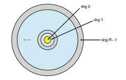
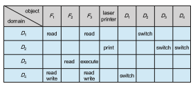
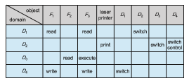
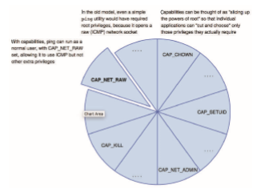
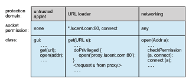

**_Security and Protection_**

Security ensures the authentication of system users to protect the integrity of the information stored in the system (both data and code), as well as the physical resources of the computer system. The security system prevents unauthorized access, malicious destruction or alteration of data, and accidental introduction of inconsistency.

Protection mechanisms control access to a system by limiting the types of file access permitted to users. In addition, protectionmust ensure that only processes that have gained proper authorization from the oper- ating system can operate on memory segments, the CPU, and other resources.

Protection is provided by a mechanism that controls the access of programs, processes, or users to the resources defined by a computer system. This mechanism must provide a means for specifying the con- trols to be imposed, together with a means of enforcing them.  

_16_ **CHAPTER**

# Protection

In Chapter 16, we addressed security, which involves guarding computer resources against unauthorized access, malicious destruction or alteration, and accidental introduction of inconsistency. In this chapter, we turn to protection, which involves controlling the access of processes and users to the resources defined by a computer system.

The processes in an operating systemmust be protected from one another’s activities. To provide this protection, we can use variousmechanisms to ensure that only processes that have gained proper authorization from the operating system can operate on the files, memory segments, CPU, networking, and other resources of a system. These mechanisms must provide a means for specifying the controls to be imposed, together with a means of enforcement.

**CHAPTER OBJECTIVES**

• Discuss the goals and principles of protection in a modern computer system.

• Explain how protection domains, combined with an access matrix, are used to specify the resources a process may access.

• Examine capability- and language-based protection systems.

• Describe how protection mechanisms can mitigate system attacks.

## Goals of Protection

As computer systems have become more sophisticated and pervasive in their applications, the need to protect their integrity has also grown. Protection was originally conceived as an adjunct to multiprogramming operating systems, so that untrustworthy users might safely share a common logical name space, such as a directory of files, or a common physical name space, such as memory. Modernprotection concepts have evolved to increase the reliability of any com- plex system that makes use of shared resources and is connected to insecure communications platforms such as the Internet.

We need to provide protection for several reasons. The most obvious is the need to prevent the mischievous, intentional violation of an access restriction by a user. Ofmore general importance, however, is the need to ensure that each process in a system uses system resources only in ways consistent with stated policies. This requirement is an absolute one for a reliable system.

Protection can improve reliability by detecting latent errors at the interfaces between component subsystems. Early detection of interface errors can often prevent contamination of a healthy subsystem by a malfunctioning subsys- tem. Also, an unprotected resource cannot defend against use (or misuse) by an unauthorized or incompetent user. A protection-oriented system provides means to distinguish between authorized and unauthorized usage.

The role of protection in a computer system is to provide a mechanism for the enforcement of the policies governing resource use. These policies can be established in a variety of ways. Some are fixed in the design of the system, while others are formulated by the management of a system. Still others are defined by individual users to protect resources they “own.” A protection system, then, must have the flexibility to enforce a variety of policies.

Policies for resource use may vary by application, and they may change over time. For these reasons, protection is no longer the concern solely of the designer of an operating system. The application programmer needs to use protection mechanisms as well, to guard resources created and supported by an application subsystem against misuse. In this chapter, we describe the protection mechanisms the operating system should provide, but application designers can use them as well in designing their own protection software.

Note that **_mechanisms_** are distinct from **_policies._** Mechanisms determine **_how_** somethingwill be done; policies decide**_what_**will be done. The separation of policy and mechanism is important for flexibility. Policies are likely to change from place to place or time to time. In the worst case, every change in policy would require a change in the underlying mechanism. Using general mechanisms enables us to avoid such a situation.

## Principles of Protection

Frequently, a guiding principle can be used throughout a project, such as the design of an operating system. Following this principle simplifies design decisions and keeps the system consistent and easy to understand. Akey, time- tested guiding principle for protection is the **principle of least privilege**. As discussed in Chapter 16, this principle dictates that programs, users, and even systems be given just enough privileges to perform their tasks.

Consider one of the tenets of UNIX—that a user should not run as root. (In UNIX, only the root user can execute privileged commands.) Most users innately respect that, fearing an accidental delete operation for which there is no corresponding undelete. Because root is virtually omnipotent, the potential for human error when a user acts as root is grave, and its consequences far reaching.

Now consider that rather than human error, damage may result from malicious attack. A virus launched by an accidental click on an attachment is one example. Another is a buffer overflow or other code-injection attack that is successfully carried out against a root-privileged process (or, in Windows, a process with administrator privileges). Either case could prove catastrophic for the system.

Observing the principle of least privilege would give the system a chance to mitigate the attack—if malicious code cannot obtain root privileges, there is a chance that adequately defined **permissions** may block all, or at least some, of the damaging operations. In this sense, permissions can act like an immune system at the operating-system level.

The principle of least privilege takes many forms, which we examine in more detail later in the chapter. Another important principle, often seen as a derivative of the principle of least privilege, is **compartmentalization**. Com- partmentalization is the process of protecting each individual system compo- nent through the use of specific permissions and access restrictions. Then, if a component is subverted, another line of defense will “kick in” and keep the attacker from compromising the system any further. Compartmentalization is implemented in many forms—from network demilitarized zones (DMZs) through virtualization.

The careful use of access restrictions can help make a system more secure and can also be beneficial in producing an **audit trail**, which tracks divergences from allowed accesses. An audit trail is a hard record in the system logs. If monitored closely, it can reveal early warnings of an attack or (if its integrity is maintained despite an attack) provide clues as to which attack vectors were used, as well as accurately assess the damage caused.

Perhaps most importantly, no single principle is a panacea for security vulnerabilities. **Defense in depth** must be used: multiple layers of protection should be applied one on top of the other (think of a castle with a garrison, a wall, and a moat to protect it). At the same time, of course, attackers use multiplemeans to bypass defense in depth, resulting in an ever-escalating arms race.

## Protection Rings

As we’ve seen, the main component of modern operating systems is the ker- nel, which manages access to system resources and hardware. The kernel, by definition, is a trusted and privileged component and therefore must run with a higher level of privileges than user processes.

To carry out this **_privilege separation,_** hardware support is required. Indeed, all modern hardware supports the notion of separate execution levels, though implementations vary somewhat. A popular model of privilege separation is that of protection rings. In this model, fashioned after Bell –LaPadula (https://www.acsac.org/2005/papers/Bell.pdf), execution is defined as a set of concentric rings, with ring _i_ providing a subset of the functionality of ring _j_ for any _j_ < _i_. The innermost ring, ring _0_, thus provides the full set of privileges. This pattern is shown in Figure 17.1.

When the system boots, it boots to the highest privilege level. Code at that level performs necessary initialization before dropping to a less privileged level. In order to return to a higher privilege level, code usually calls a special instruction, sometimes referred to as a gate, which provides a portal between rings. The syscall instruction (in Intel) is one example. Calling this instruction shifts execution fromuser to kernelmode. Aswe have seen, executing a system  

**Figure 17.1** Protection-ring structure.

call will always transfer execution to a predefined address, allowing the caller to specify only arguments (including the systemcall number), and not arbitrary kernel addresses. In this way, the integrity of the more privileged ring can generally be assured.

Another way of ending up in amore privileged ring is on the occurrence of a processor trap or an interrupt. When either occurs, execution is immediately transferred into the higher-privilege ring. Once again, however, the execution in the higher-privilege ring is predefined and restricted to a well-guarded code path.

Intel architectures follow this model, placing user mode code in ring _3_ and kernel mode code in ring _0_. The distinction is made by two bits in the special EFLAGS register. Access to this register is not allowed in ring _3_—thus prevent- ing a malicious process from escalating privileges. With the advent of virtual- ization, Intel defined an additional ring (_\-1_) to allow for **hypervisors**, or virtual machine managers, which create and run virtual machines. Hypervisors have more capabilities than the kernels of the guest operating systems.

The ARMprocessor’s architecture initially allowed only USR and SVCmode, for user and kernel (supervisor) mode, respectively. In ARMv7 processors, ARM introduced**TrustZone** (**TZ**), which provided an additional ring. Thismost priv- ileged execution environment also has exclusive access to hardware-backed cryptographic features, such as the NFC Secure Element and an on-chip cryp- tographic key, that make handling passwords and sensitive information more secure. Even the kernel itself has no access to the on-chip key, and it can only request encryption and decryption services from the TrustZone environment (by means of a specialized instruction, **Secure Monitor Call** (**SMC**)), which is only usable from kernel mode. As with system calls, the kernel has no ability to directly execute to specific addresses in the TrustZone—only to pass argu- ments via registers. Android uses TrustZone extensively as of Version 5.0, as shown in Figure 17.2.

Correctly employing a trusted execution environment means that, if the kernel is compromised, an attacker can’t simply retrieve the key from kernel memory. Moving cryptographic services to a separate, trusted environment  


**Figure 17.2** Android uses of TrustZone.

also makes brute-force attacks less likely to succeed. (As described in Chapter 16, these attacks involve trying all possible combinations of valid password characters until the password is found.) The various keys used by the system, from the user’s password to the system’s own, are stored in the on-chip key, which is only accessible in a trusted context. When a key—say, a password— is entered, it is verified via a request to the TrustZone environment. If a key is not known andmust be guessed, the TrustZone verifier can impose limitations —by capping the number of verification attempts, for example.

In the 64-bit ARMv8 architecture, ARM extended its model to support four levels, called “exception levels,” numbered EL0 through EL3. User mode runs in EL0, and kernel mode in EL1. EL2 is reserved for hypervisors, and EL3 (the most privileged) is reserved for the secure monitor (the TrustZone layer). Any one of the exception levels allows running separate operating systems side by side, as shown in Figure 17.3.

Note that the secure monitor runs at a higher execution level than general- purpose kernels,whichmakes it the perfect place to deploy code thatwill check the kernels’ integrity. This functionality is included in Samsung’s Realtime Kernel Protection (RKP) for Android and Apple’s WatchTower (also known as KPP, for Kernel Patch Protection) for iOS.

## Domain of Protection

Rings of protection separate functions into domains and order them hierar- chically. A generalization of rings is using domains without a hierarchy. A computer system can be treated as a collection of processes and objects. By  


**Figure 17.3** ARM architecture.

**_objects,_**we mean both **hardware objects** (such as the CPU, memory segments, printers, disks, and tape drives) and **software objects** (such as files, programs, and semaphores). Each object has a unique name that differentiates it from all other objects in the system, and each can be accessed only throughwell-defined and meaningful operations. Objects are essentially abstract data types.

The operations that are possible depend on the object. For example, on a CPU, we can only execute. Memory words can be read and written, whereas a DVD-ROM can only be read. Tape drives can be read, written, and rewound. Data files can be created, opened, read, written, closed, and deleted; program files can be read, written, executed, and deleted.

A process should be allowed to access only those objects for which it has authorization. Furthermore, at any time, a process should be able to access only those objects that it currently requires to complete its task. This second requirement, the **need-to-know principle**, is useful in limiting the amount of damage a faulty process or an attacker can cause in the system. For example, when process _p_ invokes procedure A(), the procedure should be allowed to access only its own variables and the formal parameters passed to it; it should not be able to access all the variables of process _p._ Similarly, consider the case in which process _p_ invokes a compiler to compile a particular file. The compiler should not be able to access files arbitrarily but should have access only to a well-defined subset of files (such as the source file, output object file, and so on) related to the file to be compiled. Conversely, the compiler may have private files used for accounting or optimization purposes that process _p_ should not be able to access.

In comparing need-to-know with least privilege, it may be easiest to think of need-to-know as the policy and least privilege as the mechanism for achiev- ing this policy. For example, in file permissions, need-to-know might dictate that a user have read access but not write or execute access to a file. The principle of least privilege would require that the operating system provide a mechanism to allow read but not write or execute access.  

### Domain Structure

To facilitate the sort of scheme just described, a process may operate within a **protection domain**, which specifies the resources that the process may access. Each domain defines a set of objects and the types of operations that may be invoked on each object. The ability to execute an operation on an object is an **access right**. A domain is a collection of access rights, each of which is an orderedpair _<_ object-name, rights-set _>_ . For example, if domain _D_ has the access right _<_ file _F_, _{_read,write_}>_, then a process executing in domain _D_ can both read and write file _F._ It cannot, however, perform any other operation on that object.

Domains may share access rights. For example, in Figure 17.4, we have three domains: _D_ 1, _D_ 2, and _D_ 3\. The access right _<O_ 4, _{ _print_ }>_ is shared by _D_ 2 and _D_ 3, implying that a process executing in either of these two domains can print object _O_ 4. Note that a process must be executing in domain _D_ 1 to read and write object _O_ 1, while only processes in domain _D_ 3 may execute object _O_ 1.

The association between a process and a domain may be either **static**, if the set of resources available to the process is fixed throughout the process’s lifetime, or **dynamic**. As might be expected, establishing dynamic protection domains is more complicated than establishing static protection domains.

If the association between processes and domains is fixed, and we want to adhere to the need-to-know principle, then a mechanism must be available to change the content of a domain. The reason stems from the fact that a process may execute in two different phases and may, for example, need read access in one phase and write access in another. If a domain is static, we must define the domain to include both read and write access. However, this arrangement provides more rights than are needed in each of the two phases, since we have read access in the phase where we need only write access, and vice versa. Thus, the need-to-knowprinciple is violated.Wemust allow the contents of a domain to be modified so that the domain always reflects the minimum necessary access rights.

If the association is dynamic, a mechanism is available to allow **domain switching**, enabling the process to switch from one domain to another.Wemay also want to allow the content of a domain to be changed. If we cannot change the content of a domain, we can provide the same effect by creating a new domain with the changed content and switching to that new domain when we want to change the domain content.


**Figure 17.4** System with three protection domains.  

Adomain can be realized in a variety of ways:

• Each **_user_** may be a domain. In this case, the set of objects that can be accessed depends on the identity of the user. Domain switching occurs when the user is changed—generally when one user logs out and another user logs in.

• Each **_process_** may be a domain. In this case, the set of objects that can be accessed depends on the identity of the process. Domain switching occurs when one process sends a message to another process and then waits for a response.

• Each **_procedure_** may be a domain. In this case, the set of objects that can be accessed corresponds to the local variables defined within the procedure. Domain switching occurs when a procedure call is made.

We discuss domain switching in greater detail in Section 17.5. Consider the standard dual-mode (kernel–usermode)model of operating system execution. When a process is in kernel mode, it can execute privileged instructions and thus gain complete control of the computer system. In con- trast, when a process executes in user mode, it can invoke only nonprivileged instructions. Consequently, it can execute only within its predefined memory space. These two modes protect the operating system (executing in kernel domain) from the user processes (executing in user domain). In a multipro- grammed operating system, two protection domains are insufficient, since users also want to be protected from one another. Therefore, a more elaborate scheme is needed. We illustrate such a scheme by examining two influential operating systems—UNIX and Android—to see how they implement these concepts.

### Example: UNIX

Asnoted earlier, in UNIX, the root user can execute privileged commands,while other users cannot. Restricting certain operations to the root user can impair other users in their everyday operations, however. Consider, for example, a user who wants to change his password. Inevitably, this requires access to the password database (commonly, /etc/shadow), which can only be accessed by root. A similar challenge is encountered when setting a scheduled job (using the at command)—doing so requires access to privileged directories that are beyond the reach of a normal user.

The solution to this problem is the setuid bit. In UNIX, an owner identi- fication and a domain bit, known as the **_setuid bit,_** are associated with each file. The setuid bit may or may not be enabled. When the bit is enabled on an executable file (through chmod +s), whoever executes the file temporarily assumes the identity of the file owner. That means if a user manages to create a file with the user ID “root” and the setuid bit enabled, anyone who gains access to execute the file becomes user “root” for the duration of the process’s lifetime.

If that strikes you as alarming, it is with good reason. Because of their potential power, setuid executable binaries are expected to be both sterile (affecting only necessary files under specific constraints) and hermetic (for example, tamperproof and impossible to subvert). Setuid programs need to be very carefully written to make these assurances. Returning to the example of changing passwords, the passwd command is setuid-root and will indeed modify the password database, but only if first presented with the user’s valid password, and it will then restrict itself to editing the password of that user and only that user.

Unfortunately, experience has repeatedly shown that few setuid binaries, if any, fulfill both criteria successfully. Time and again, setuid binaries have been subverted—some through race conditions and others through code injection —yielding instant root access to attackers. Attackers are frequently successful in achieving privilege escalation in this way.Methods of doing so are discussed in Chapter 16. Limiting damage from bugs in setuid programs is discussed in Section 17.8.

### Example: Android Application IDs

In Android, distinct user IDs are provided on a per-application basis. When an application is installed, the installd daemon assigns it a distinct user ID (UID) and group ID (GID), along with a private data directory (/data/data/<app- name>) whose ownership is granted to this UID/GID combination alone. In this way, applications on the device enjoy the same level of protection provided by UNIX systems to separate users. This is a quick and simple way to provide isolation, security, and privacy. The mechanism is extended by modifying the kernel to allow certain operations (such as networking sockets) only to mem- bers of a particular GID (for example, AID INET, 3003). A further enhancement by Android is to define certain UIDs as “isolated,” which prevents them from initiating RPC requests to any but a bare minimum of services.

## Access Matrix

The general model of protection can be viewed abstractly as a matrix, called an **access matrix**. The rows of the access matrix represent domains, and the columns represent objects. Each entry in the matrix consists of a set of access rights. Because the column defines objects explicitly, we can omit the object name from the access right. The entry access(_i,j_) defines the set of operations that a process executing in domain _Di_ can invoke on object _Oj_.

To illustrate these concepts, we consider the access matrix shown in Figure 17.5. There are four domains and four objects—three files ( _F_ 1, _F_ 2, _F_ 3) and one laser printer. A process executing in domain _D_ 1 can read files _F_ 1 and _F_ 3. A process executing in domain _D_ 4 has the same privileges as one executing in domain _D_ 1; but in addition, it can also write onto files _F_ 1 and _F_ 3. The laser printer can be accessed only by a process executing in domain _D_ 2.

The access-matrix scheme provides uswith themechanism for specifying a variety of policies. The mechanism consists of implementing the access matrix and ensuring that the semantic properties we have outlined hold. More specif- ically, we must ensure that a process executing in domain _Di_ can access only those objects specified in row _i_, and then only as allowed by the access-matrix entries.

The access matrix can implement policy decisions concerning protection. The policy decisions involvewhich rights should be included in the (_i_, _j_)_th_ entry.  

**Figure 17.5** Access matrix.

We must also decide the domain in which each process executes. This last policy is usually decided by the operating system.

The users normally decide the contents of the access-matrix entries. When a user creates a new object _Oj_ , the column _Oj_ is added to the access matrix with the appropriate initialization entries, as dictated by the creator. The user may decide to enter some rights in some entries in column _j_ and other rights in other entries, as needed.

The access matrix provides an appropriate mechanism for defining and implementing strict control for both static and dynamic association between processes anddomains.Whenwe switch a process fromone domain to another, we are executing an operation (switch) on an object (the domain). We can control domain switching by including domains among the objects of the access matrix. Similarly, when we change the content of the access matrix, we are performing an operation on an object: the access matrix. Again, we can control these changes by including the accessmatrix itself as an object. Actually, since each entry in the access matrix can be modified individually, we must consider each entry in the access matrix as an object to be protected. Now, we need to consider only the operations possible on these new objects (domains and the access matrix) and decide howwewant processes to be able to execute these operations.

Processes should be able to switch from one domain to another. Switching fromdomain _Di_ to domain _Dj_ is allowed if and only if the access right switch∈ access(_i_, _j_). Thus, in Figure 17.6, a process executing in domain _D_ 2 can switch to domain _D_ 3 or to domain _D_ 4. A process in domain _D_ 4 can switch to _D_ 1, and one in domain _D_ 1 can switch to _D_ 2.

Allowing controlled change in the contents of the access-matrix entries requires three additional operations: copy, owner, and control. We examine these operations next.

The ability to copy an access right from one domain (or row) of the access matrix to another is denoted by an asterisk (\*) appended to the access right. The copy right allows the access right to be copied only within the column (that is, for the object) for which the right is defined. For example, in Figure 17.7(a), a process executing in domain _D_ 2 can copy the read operation into any entry associated with file _F_ 2. Hence, the access matrix of Figure 17.7(a) can be modified to the access matrix shown in Figure 17.7(b).  


**Figure 17.6** Access matrix of Figure 17.5 with domains as objects.

This scheme has two additional variants:

**1\.** Aright is copied from access(_i_, _j_) to access(_k_, _j_); it is then removed from access(_i_, _j_). This action is a transfer of a right, rather than a copy.

**2\.** Propagation of the copy right may be limited. That is, when the right _R_∗ is copied from access(_i_, _j_) to access(_k_, _j_), only the right _R_ (not _R_∗) is created. A process executing in domain _Dk_ cannot further copy the right _R_.

A system may select only one of these three copy rights, or it may provide all three by identifying them as separate rights: copy, transfer, and limited copy.

**Figure 17.7** Access matrix with **_copy_** rights.  

We also need a mechanism to allow addition of new rights and removal of some rights. The owner right controls these operations. If access(_i_, _j_) includes the owner right, then a process executing in domain _Di_ can add and remove any right in any entry in column _j_. For example, in Figure 17.8(a), domain _D_ 1 is the owner of _F_ 1 and thus can add and delete any valid right in column _F_ 1. Similarly, domain _D_ 2 is the owner of _F_ 2 and _F_ 3 and thus can add and remove any valid right within these two columns. Thus, the access matrix of Figure 17.8(a) can be modified to the access matrix shown in Figure 17.8(b).

The copy and owner rights allow a process to change the entries in a column. A mechanism is also needed to change the entries in a row. The control right is applicable only to domain objects. If access(_i_, _j_) includes the control right, then a process executing in domain _Di_ can remove any access right from row _j_. For example, suppose that, in Figure 17.6, we include the control right in access(_D_ 2, _D_ 4). Then, a process executing in domain _D_ 2 could modify domain _D_ 4, as shown in Figure 17.9.

The copy and owner rights provide us with a mechanism to limit the prop- agation of access rights. However, they do not give us the appropriate tools for preventing the propagation (or disclosure) of information. The problem of guaranteeing that no information initially held in an object canmigrate outside of its execution environment is called the **confinemen problem**. This problem is in general unsolvable (see the bibliographical notes at the end of the chapter).

**Figure 17.8** Access matrix with owner rights.  


**Figure 17.9** Modified access matrix of Figure 17.6.

These operations on the domains and the access matrix are not in them- selves important, but they illustrate the ability of the access-matrixmodel to let us implement and control dynamic protection requirements. New objects and new domains can be created dynamically and included in the access-matrix model. However, we have shown only that the basic mechanism exists. System designers andusersmustmake the policy decisions concerningwhich domains are to have access to which objects in which ways.

## Implementation of the Access Matrix

How can the access matrix be implemented effectively? In general, the matrix will be sparse; that is, most of the entries will be empty. Although data- structure techniques are available for representing sparsematrices, they are not particularly useful for this application, because of the way in which the protec- tion facility is used. Here, we first describe several methods of implementing the access matrix and then compare the methods.

### Global Table

The simplest implementation of the access matrix is a global table consisting of a set of ordered triples _<_domain, object, rights-set_\>_. Whenever an operation _M_ is executed on an object _Oj_ within domain _Di_, the global table is searched for a triple _<Di_, _Oj_, _Rk>_, with _M_ ∈ _Rk_. If this triple is found, the operation is allowed to continue; otherwise, an exception (or error) condition is raised.

This implementation suffers from several drawbacks. The table is usually large and thus cannot be kept in main memory, so additional I/O is needed. Virtual memory techniques are often used for managing this table. In addition, it is difficult to take advantage of special groupings of objects or domains. For example, if everyone can read a particular object, this object must have a separate entry in every domain.

### Access Lists for Objects

Each column in the access matrix can be implemented as an access list for one object, as described in Section 13.4.2. Obviously, the empty entries can be discarded. The resulting list for each object consists of ordered pairs _<_domain, rights-set_\>_, which define all domains with a nonempty set of access rights for that object.

This approach can be extended easily to define a list plus a **_default_** set of access rights. When an operation _M_ on an object _Oj_ is attempted in domain _Di_, we search the access list for object _Oj_, looking for an entry _<Di_, _Rk>_ with _M_ ∈ _Rk_. If the entry is found, we allow the operation; if it is not, we check the default set. If _M_ is in the default set, we allow the access. Otherwise, access is denied, and an exception condition occurs. For efficiency, we may check the default set first and then search the access list.

### Capability Lists for Domains

Rather than associating the columns of the access matrix with the objects as access lists, we can associate each row with its domain. A **capability list** for a domain is a list of objects together with the operations allowed on those objects. An object is often represented by its physical name or address, called a **capability**. To execute operation _M_ on object _Oj_, the process executes the operation _M_, specifying the capability (or pointer) for object _Oj_ as a parameter. Simple **_possession_** of the capability means that access is allowed.

The capability list is associated with a domain, but it is never directly accessible to a process executing in that domain. Rather, the capability list is itself a protected object, maintained by the operating system and accessed by the user only indirectly. Capability-based protection relies on the fact that the capabilities are never allowed to migrate into any address space directly accessible by a user process (where they could be modified). If all capabilities are secure, the object they protect is also secure against unauthorized access.

Capabilities were originally proposed as a kind of secure pointer, to meet the need for resource protection that was foreseen as multiprogrammed com- puter systems came of age. The idea of an inherently protected pointer provides a foundation for protection that can be extended up to the application level.

To provide inherent protection,wemust distinguish capabilities fromother kinds of objects, and theymust be interpreted by an abstract machine onwhich higher-level programs run. Capabilities are usually distinguished from other data in one of two ways:

• Each object has a **tag** to denote whether it is a capability or accessible data. The tags themselvesmust not be directly accessible by an application program. Hardware or firmware support may be used to enforce this restriction. Although only one bit is necessary to distinguish between capabilities and other objects, more bits are often used. This extension allows all objects to be tagged with their types by the hardware. Thus, the hardware can distinguish integers, floating-point numbers, pointers, Booleans, characters, instructions, capabilities, and uninitialized values by their tags.

• Alternatively, the address space associatedwith a program can be split into twoparts. One part is accessible to the programand contains the program’s normal data and instructions. The other part, containing the capability list, is accessible only by the operating system. A segmented memory space is useful to support this approach.  

Several capability-based protection systems have been developed; we describe them briefly in Section 17.10. The Mach operating system also uses a version of capability-based protection; it is described in Appendix D.

### A Lock–Key Mechanism

The **lock–key scheme** is a compromise between access lists and capability lists. Each object has a list of unique bit patterns called **locks**. Similarly, each domain has a list of unique bit patterns called **keys**. A process executing in a domain can access an object only if that domain has a key that matches one of the locks of the object.

As with capability lists, the list of keys for a domain must be managed by the operating systemon behalf of the domain.Users are not allowed to examine or modify the list of keys (or locks) directly.

### Comparison

As you might expect, choosing a technique for implementing an access matrix involves various trade-offs. Using a global table is simple; however, the table can be quite large and often cannot take advantage of special groupings of objects or domains. Access lists correspond directly to the needs of users. When a user creates an object, he can specify which domains can access the object, as well as what operations are allowed. However, because access-right information for a particular domain is not localized, determining the set of access rights for each domain is difficult. In addition, every access to the object must be checked, requiring a search of the access list. In a large system with long access lists, this search can be time consuming.

Capability lists do not correspond directly to the needs of users, but they are useful for localizing information for a given process. The process attempt- ing accessmust present a capability for that access. Then, the protection system needs only to verify that the capability is valid. Revocation of capabilities, however, may be inefficient (Section 17.7).

The lock–key mechanism, as mentioned, is a compromise between access lists and capability lists. The mechanism can be both effective and flexible, depending on the length of the keys. The keys can be passed freely from domain to domain. In addition, access privileges can be effectively revoked by the simple technique of changing some of the locks associated with the object (Section 17.7).

Most systems use a combination of access lists and capabilities. When a process first tries to access an object, the access list is searched. If access is denied, an exception condition occurs. Otherwise, a capability is created and attached to the process. Additional references use the capability to demonstrate swiftly that access is allowed. After the last access, the capability is destroyed. This strategy was used in the MULTICS system and in the CAL system.

As an example of how such a strategy works, consider a file system in which each file has an associated access list. When a process opens a file, the directory structure is searched to find the file, access permission is checked, and buffers are allocated. All this information is recorded in a new entry in a file table associatedwith the process. The operation returns an index into this table for the newly opened file. All operations on the file are made by specification of the index into the file table. The entry in the file table then points to the file and its buffers. When the file is closed, the file-table entry is deleted. Since the file table is maintained by the operating system, the user cannot accidentally corrupt it. Thus, the user can access only those files that have been opened. Since access is checked when the file is opened, protection is ensured. This strategy is used in the UNIX system.

The right to access must still be checked on each access, and the file-table entry has a capability only for the allowed operations. If a file is opened for reading, then a capability for read access is placed in the file-table entry. If an attempt is made to write onto the file, the system identifies this protection violation by comparing the requested operation with the capability in the file- table entry.

## Revocation of Access Rights

In a dynamic protection system, we may sometimes need to revoke access rights to objects shared by different users. Various questions about revocation may arise:

• **Immediate versus delayed**. Does revocation occur immediately, or is it delayed? If revocation is delayed, can we find out when it will take place?

• **Selective versus general**. When an access right to an object is revoked, does it affect all the users who have an access right to that object, or can we specify a select group of users whose access rights should be revoked?

• **Partial versus total**. Can a subset of the rights associated with an object be revoked, or must we revoke all access rights for this object?

• **Temporary versus permanent**. Can access be revoked permanently (that is, the revoked access right will never again be available), or can access be revoked and later be obtained again?

With an access-list scheme, revocation is easy. The access list is searched for any access rights to be revoked, and they are deleted from the list. Revocation is immediate and can be general or selective, total or partial, and permanent or temporary.

Capabilities, however, present a much more difficult revocation problem, as mentioned earlier. Since the capabilities are distributed throughout the sys- tem, we must find them before we can revoke them. Schemes that implement revocation for capabilities include the following:

• **Reacquisition**. Periodically, capabilities are deleted from each domain. If a process wants to use a capability, it may find that that capability has been deleted. The process may then try to reacquire the capability. If access has been revoked, the process will not be able to reacquire the capability.

• **Back-pointers**. A list of pointers is maintained with each object, pointing to all capabilities associated with that object. When revocation is required, we can follow these pointers, changing the capabilities as necessary. This scheme was adopted in the MULTICS system. It is quite general, but its implementation is costly.  

• **Indirection**. The capabilities point indirectly, not directly, to the objects. Each capability points to a unique entry in a global table, which in turn points to the object.We implement revocation by searching the global table for the desired entry and deleting it. Then, when an access is attempted, the capability is found to point to an illegal table entry. Table entries can be reused for other capabilities without difficulty, since both the capability and the table entry contain the unique name of the object. The object for a capability and its table entry must match. This scheme was adopted in the CAL system. It does not allow selective revocation.

• **Keys**. A key is a unique bit pattern that can be associated with a capability. This key is defined when the capability is created, and it can be neither modified nor inspected by the process that owns the capability. A **master key** is associated with each object; it can be defined or replaced with the set-key operation. When a capability is created, the current value of the master key is associated with the capability. When the capability is exercised, its key is compared with the master key. If the keys match, the operation is allowed to continue; otherwise, an exception condition is raised. Revocation replaces the master key with a new value via the set-key operation, invalidating all previous capabilities for this object.

This scheme does not allow selective revocation, since only one master key is associated with each object. If we associate a list of keys with each object, then selective revocation can be implemented. Finally,we can group all keys into one global table of keys. A capability is valid only if its key matches some key in the global table. We implement revocation by removing the matching key from the table. With this scheme, a key can be associated with several objects, and several keys can be associated with each object, providing maximum flexibility.

In key-based schemes, the operations of defining keys, inserting them into lists, and deleting them from lists should not be available to all users. In particular, it would be reasonable to allow only the owner of an object to set the keys for that object. This choice, however, is a policy decision that the protection system can implement but should not define.

## Role-Based Access Control

In Section 13.4.2, we described how access controls can be used on files within a file system. Each file and directory is assigned an owner, a group, or possibly a list of users, and for each of those entities, access-control information is assigned. A similar function can be added to other aspects of a computer system. A good example of this is found in Solaris 10 and later versions.

The idea is to advance the protection available in the operating system by explicitly adding the principle of least privilege via **role-based access control** (**RBAC**). This facility revolves around privileges. A privilege is the right to execute a system call or to use an option within that system call (such as opening a file with write access). Privileges can be assigned to processes, limiting them to exactly the access they need to perform their work. Privileges and programs can also be assigned to **roles**. Users are assigned roles or can take roles based on passwords assigned to the roles. In this way, a user can take a  


**Figure 17.10** Role-based access control in Solaris 10.

role that enables a privilege, allowing the user to run a program to accomplish a specific task, as depicted in Figure 17.10. This implementation of privileges decreases the security risk associated with superusers and setuid programs.

Notice that this facility is similar to the access matrix described in Section 17.5. This relationship is further explored in the exercises at the end of the chapter.

## Mandatory Access Control (MAC)

Operating systems have traditionally used **discretionary access control** (**DAC**) as a means of restricting access to files and other system objects. With DAC, access is controlled based on the identities of individual users or groups. In UNIX-based system, DAC takes the form of file permissions (settable by chmod, chown, and chgrp), whereas Windows (and some UNIX variants) allow finer granularity by means of access-control lists (ACLs).

DACs, however, have proved insufficient over the years. A key weakness lies in their discretionary nature, which allows the owner of a resource to set or modify its permissions. Another weakness is the unlimited access allowed for the administrator or root user. As we have seen, this design can leave the system vulnerable to both accidental and malicious attacks and provides no defense when hackers obtain root privileges.

The need arose, therefore, for a stronger form of protection, which was introduced in the form of **mandatory access control** (**MAC**). MAC is enforced as a system policy that even the root user cannot modify (unless the policy explic- itly allows modifications or the system is rebooted, usually into an alternate configuration). The restrictions imposed by MAC policy rules are more pow- erful than the capabilities of the root user and can be used to make resources inaccessible to anyone but their intended owners.  

Modern operating systems all provide MAC along with DAC, although implementations differ. Solaris was among the first to introduce MAC, which was part of Trusted Solaris (2.5). FreeBSD made DAC part of its TrustedBSD implementation (FreeBSD 5.0). The FreeBSD implementation was adopted by Apple in macOS 10.5 and has served as the substrate over which most of the security features of MAC and iOS are implemented. Linux’s MAC implemen- tation is part of the SELinux project, which was devised by the NSA, and has been integrated into most distributions. Microsoft Windows joined the trend with Windows Vista’s Mandatory Integrity Control.

At the heart of MAC is the concept of **labels**. A label is an identifier (usually a string) assigned to an object (files, devices, and the like). Labels may also be applied to subjects (actors, such as processes). When a subject request to perform operations on the objects. When such requests are to be served by the operating system, it first performs checks defined in a policy, which dictates whether or not a given label holding subject is allowed toperform the operation on the labeled object.

As a brief example, consider a simple set of labels, ordered according to level of privilege: “unclassified,” “secret,” and “top secret.”Auserwith “secret” clearancewill be able to create similarly labeledprocesses,whichwill then have access to “unclassified” and “secret” files, but not to “top secret” files. Neither the user nor its processes would even be aware of the existence of “top secret” files, since the operating system would filter them out of all file operations (for example, they would not be displayed when listing directory contents). User processes would similarly be protected themselves in this way, so that an "unclassified" process would not be able to see or perform IPC requests to a “secret” (or “top secret”) process. In thisway,MAC labels are an implementation of the access matrix described earlier.

## Capability-Based Systems

The concept of **capability-based protection** was introduced in the early 1970s. Two early research systems were Hydra and CAP. Neither system was widely used, but both provided interesting proving grounds for protection theories. For more details on these systems, see Section A.14.1 and Section A.14.2. Here, we consider two more contemporary approaches to capabilities.

### Linux Capabilities

Linux uses capabilities to address the limitations of the UNIX model, which we described earlier. The POSIX standards group introduced capabilities in POSIX 1003.1e. Although POSIX.1e was eventually withdrawn, Linux was quick to adopt capabilities in Version 2.2 and has continued to add new developments.

In essence, Linux’s capabilities “slice up” the powers of root into distinct areas, each represented by a bit in a bitmask, as shown in Figure 17.11. Fine- grained control over privileged operations can be achieved by toggling bits in the bitmask.

In practice, three bitmasks are used—denoting the capabilities **_permitted, effective,_** and **_inheritable._** Bitmasks can apply on a per-process or a per-thread basis. Furthermore, once revoked, capabilities cannot be reacquired. The usual  

**Figure 17.11** Capabilities in POSIX.1e.

sequence of events is that a process or thread startswith the full set of permitted capabilities and voluntarily decreases that set during execution. For example, after opening a network port, a thread might remove that capability so that no further ports can be opened.

You can probably see that capabilities are a direct implementation of the principle of least privilege. As explained earlier, this tenet of security dictates that an application or user must be given only those rights than are required for its normal operation.

Android (which is based on Linux) also utilizes capabilities, which enable system processes (notably, “system server”), to avoid root ownership, instead selectively enabling only those operations required.

The Linux capabilities model is a great improvement over the traditional UNIX model, but it still is inflexible. For one thing, using a bitmap with a bit representing each capability makes it impossible to add capabilities dynami- cally and requires recompiling the kernel to add more. In addition, the feature applies only to kernel-enforced capabilities.

### Darwin Entitlements

Apple’s system protection takes the form of entitlements. Entitlements are declaratory permissions—XML property list stating which permissions are claimed as necessary by the program (see Figure 17.12). When the process attempts a privileged operation (in the figure, loading a kernel extension), its  

```

<!DOCTYPE plist PUBLIC "-//Apple//DTD PLIST 1.0//EN" "http://www.apple.com/DTDs/PropertyList-1.0.dtd"> <plist version="1.0"> <dict>

<key>com.apple.private.kernel.get-kext-info <true/> <key>com.apple.rootless.kext-management <true/>

</dict> </plist>
```
**Figure 17.12** Apple Darwin entitlements

entitlements are checked, and only if the needed entitlements are present is the operation allowed.

To prevent programs from arbitrarily claiming an entitlement, Apple embeds the entitlements in the code signature (explained in Section 17.11.4). Once loaded, a process has no way of accessing its code signature. Other processes (and the kernel) can easily query the signature, and in particular the entitlements. Verifying an entitlement is therefore a simple string-matching operation. In this way, only verifiable, authenticated apps may claim entitlements. All system entitlements (com.apple.\*) are further restricted to Apple’s own binaries.

## Other Protection Improvement Methods

As the battle to protect systems from accidental and malicious damage esca- lates, operating-system designers are implementing more types of protection mechanisms at more levels. This section surveys some important real-world protection improvements.

### System Integrity Protection

Apple introduced in macOS 10.11 a new protection mechanism called **System Integrity Protection** (**SIP**). Darwin-based operating systems use SIP to restrict access to system files and resources in such a way that even the root user cannot tamper with them. SIP uses extended attributes on files to mark them as restricted and further protects system binaries so that they cannot be debugged or scrutinized, much less tampered with. Most importantly, only code-signed kernel extensions are permitted, and SIP can further be configured to allowonly code-signed binaries as well.

Under SIP, although root is still the most powerful user in the system, it can do far less than before. The root user can still manage other users’ files, as well as install and remove programs, but not in anyway that would replace ormod- ify operating-system components. SIP is implemented as a global, inescapable screen on all processes, with the only exceptions allowed for system bina- ries (for example, fsck, or kextload, as shown in Figure 17.12), which are specifically entitled for operations for their designated purpose.

### System-Call Filtering

Recall from Chapter 2 that monolithic systems place all of the functionality of the kernel into a single file that runs in a single address space. Commonly, general-purpose operating-system kernels are monolithic, and they are there- fore implicitly trusted as secure. The trust boundary, therefore, rests between kernel mode and user mode—at the system layer. We can reasonably assume that any attempt to compromise the system’s integrity will be made from user mode bymeans of a system call. For example, an attacker can try to gain access by exploiting an unprotected system call.

It is therefore imperative to implement some form of **system-call filtering.** To accomplish this, we can add code to the kernel to perform an inspection at the system-call gate, restricting a caller to a subset of system calls deemed safe or required for that caller’s function. Specific system-call profiles can be constructed for individual processes. The Linuxmechanism SECCOMP-BPF does just that, harnessing the Berkeley Packet Filter language to load a custom pro- file through Linux’s proprietary prctl system call. This filtering is voluntary but can be effectively enforced if called from within a run-time library when it initializes or from within the loader itself before it transfers control to the program’s entry point.

A second form of system-call filtering goes deeper still and inspects the arguments of each system call. This form of protection is considered much stronger, as even apparently benign system calls can harbor serious vulner- abilities. This was the case with Linux’s fast mutex (futex) system call. A race condition in its implementation led to an attacker-controlled kernel memory overwrite and total system compromise. Mutexes are a fundamental compo- nent of multitasking, and thus the system call itself could not be filtered out entirely.

A challenge encountered with both approaches is keeping them as flexible as possible while at the same time avoiding the need to rebuild the kernel when changes or new filters are required—a common occurrence due to the differing needs of different processes. Flexibility is especially important given the unpredictable nature of vulnerabilities. New vulnerabilities are discovered every day and may be immediately exploitable by attackers.

One approach to meeting this challenge is to decouple the filter implemen- tation from the kernel itself. The kernel need only contain a set of callouts, which can then be implemented in a specialized driver (Windows), kernel module (Linux), or extension (Darwin). Because an external, modular com- ponent provides the filtering logic, it can be updated independently of the kernel. This component commonly makes use of a specialized profiling lan- guage by including a built-in interpreter or parser. Thus, the profile itself can be decoupled from the code, providing a human-readable, editable profile and further simplifying updates. It is also possible for the filtering component to call a trusted user-mode daemon process to assist with validation logic.  

### Sandboxing

Sandboxing involves running processes in environments that limit what they can do. In a basic system, a process runs with the credentials of the user that started it and has access to all things that the user can access. If run with system privileges such as root, the process can literally do anything on the system. It is almost always the case that a process does not need full user or system privileges. For example, does a word processor need to accept network connections? Does a network service that provides the time of day need to access files beyond a specific set?

The term **sandboxing** refers to the practice of enforcing strict limitations on a process. Rather than give that process the full set of system calls its privileges would allow, we impose an irremovable set of restrictions on the process in the early stages of its startup—well before the execution of its main() function and often as early as its creation with the fork system call. The process is then rendered unable to perform any operations outside its allowed set. In this way, it is possible to prevent the process from communicatingwith any other system component, resulting in tight compartmentalization thatmitigates any damage to the system even if the process is compromised.

There are numerous approaches to sandboxing. Java and .net, for example, impose sandbox restrictions at the level of the virtual machine. Other systems enforce sandboxing as part of their mandatory access control (MAC) policy. An example is Android,which draws on an SELinux policy enhancedwith specific labels for system properties and service endpoints.

Sandboxing may also be implemented as a combination of multiple mech- anisms. Android has found SELinux useful but lacking, because it cannot effec- tively restrict individual system calls. The latest Android versions (“Nougat” and “O”) use an underlying Linuxmechanism called SECCOMP-BPF, mentioned earlier, to apply system-call restrictions through the use of a specialized sys- tem call. The C run-time library in Android (“Bionic”) calls this system call to impose restrictions on all Android processes and third-party applications.

Among the major vendors, Apple was the first to implement sandboxing, which appeared in macOS 10.5 (“Tiger”) as “Seatbelt”. Seatbelt was “opt-in” rather than mandatory, allowing but not requiring applications to use it. The Apple sandboxwas based on dynamic profileswritten in the Scheme language, which provided the ability to control not just which operations were to be allowed or blocked but also their arguments. This capability enabled Apple to create different custom-fit profiles for each binary on the system, a practice that continues to this day. Figure 17.13 depicts a profile example.

Apple’s sandboxing has evolved considerably since its inception. It is now used in the iOS variants, where it serves (along with code signing) as the chief protection against untrusted third-party code. In iOS, and starting with macOS 10.8, the macOS sandbox is mandatory and is automatically enforced for all Mac-store downloaded apps. More recently, as mentioned earlier, Apple adopted the System Integrity Protection (SIP), used in macOS 10.11 and later. SIP is, in effect, a system-wide “platform profile.” Apple enforces it starting at system boot on all processes in the system. Only those processes that are enti- tled can perform privileged operations, and those are code-signed by Apple and therefore trusted.  


```
(version 1)
(deny default) 
(allow file-chroot) 
(allow file-read-metadata (literal "/var")) 
(allow sysctl-read) 
(allow mach-per-user-lookup) 
(allow mach-lookup)
    (global-name "com.apple.system.logger")
```
**Figure 17.13** A sandbox profile of a MacOS daemon denying most operations.

### Code Signing

At a fundamental level, how can a system “trust” a program or script? Gen- erally, if the item came as part of the operating system, it should be trusted. But what if the item is changed? If it’s changed by a system update, then again it’s trustworthy, but otherwise it should not be executable or should require special permission (from the user or administrator) before it is run. Tools from third parties, commercial or otherwise, aremore difficult to judge. How canwe be sure the tool wasn’t modified on its way from where it was created to our systems?

Currently, code signing is the best tool in the protection arsenal for solving these problems. **Code signing** is the digital signing of programs and executa- bles to confirm that they have not been changed since the author created them. It uses a cryptographic hash (Section 16.4.1.3) to test for integrity and authen- ticity. Code signing is used for operating-system distributions, patches, and third-party tools alike. Some operating systems, including iOS, Windows, and macOS, refuse to run programs that fail their code-signing check. It can also enhance system functionality in other ways. For example, Apple can disable all programs written for a now-obsolete version of iOS by stopping its signing of those programs when they are downloaded from the App Store.

## Language-Based Protection

To the degree that protection is provided in computer systems, it is usually achieved through an operating-system kernel, which acts as a security agent to inspect and validate each attempt to access a protected resource. Since comprehensive access validation may be a source of considerable overhead, either we must give it hardware support to reduce the cost of each validation, or we must allow the system designer to compromise the goals of protection. Satisfying all these goals is difficult if the flexibility to implement protection policies is restricted by the support mechanisms provided or if protection environments are made larger than necessary to secure greater operational efficiency.

As operating systems have becomemore complex, and particularly as they have attempted to provide higher-level user interfaces, the goals of protection have become much more refined. The designers of protection systems have drawn heavily on ideas that originated in programming languages and espe- cially on the concepts of abstract data types and objects. Protection systems are now concerned not only with the identity of a resource to which access is attempted but also with the functional nature of that access. In the newest protection systems, concern for the function to be invoked extends beyond a set of system-defined functions, such as standard file-access methods, to include functions that may be user-defined as well.

Policies for resource use may also vary, depending on the application, and they may be subject to change over time. For these reasons, protection can no longer be considered a matter of concern only to the designer of an operating system. It should also be available as a tool for use by the application designer, so that resources of an application subsystem can be guarded against tampering or the influence of an error.

### Compiler-Based Enforcement

At this point, programming languages enter the picture. Specifying the desired control of access to a shared resource in a system is making a declarative statement about the resource. This kind of statement can be integrated into a language by an extension of its typing facility. When protection is declared along with data typing, the designer of each subsystem can specify its require- ments for protection, as well as its need for use of other resources in a system. Such a specification should be given directly as a program is composed, and in the language in which the program itself is stated. This approach has several significant advantages:

**1\.** Protection needs are simply declared, rather than programmed as a sequence of calls on procedures of an operating system.

**2\.** Protection requirements can be stated independently of the facilities pro- vided by a particular operating system.

**3\.** The means for enforcement need not be provided by the designer of a subsystem.

**4\.** A declarative notation is natural because access privileges are closely related to the linguistic concept of data type.

A variety of techniques can be provided by a programming-language implementation to enforce protection, but any of these must depend on some degree of support from an underlying machine and its operating system. For example, suppose a language is used to generate code to run on the Cambridge CAP system (Section A.14.2). On this system, every storage reference made on the underlying hardware occurs indirectly through a capability. This restriction prevents any process from accessing a resource outside of its protection envi- ronment at any time. However, a program may impose arbitrary restrictions on how a resource can be used during execution of a particular code segment. We can implement such restrictions most readily by using the software capa- bilities provided by CAP. A language implementation might provide standard protected procedures to interpret software capabilities that would realize the protection policies that could be specified in the language. This scheme puts policy specification at the disposal of the programmers, while freeing them from implementing its enforcement.

Even if a system does not provide a protection kernel as powerful as those of Hydra (Section A.14.1) or CAP, mechanisms are still available for implementing protection specifications given in a programming language. The principal distinction is that the **_security_** of this protection will not be as great as that supported by a protection kernel, because the mechanism must rely on more assumptions about the operational state of the system. A compiler can separate references for which it can certify that no protection violation could occur from those for which a violation might be possible, and it can treat them differently. The security provided by this form of protection rests on the assumption that the code generated by the compiler will not be modified prior to or during its execution.

What, then, are the relative merits of enforcement based solely on a kernel, as opposed to enforcement provided largely by a compiler?

• **Security**. Enforcement by a kernel provides a greater degree of security of the protection system itself than does the generation of protection- checking code by a compiler. In a compiler-supported scheme, security rests on correctness of the translator, on some underlying mechanism of storage management that protects the segments from which compiled code is executed, and, ultimately, on the security of files from which a program is loaded. Some of these considerations also apply to a software- supported protection kernel, but to a lesser degree, since the kernel may reside in fixed physical storage segments and may be loaded only from a designated file. With a tagged-capability system, in which all address computation is performed either by hardware or by a fixedmicroprogram, even greater security is possible. Hardware-supported protection is also relatively immune to protection violations that might occur as a result of either hardware or system software malfunction.

• **Flexibility**. There are limits to the flexibility of a protection kernel in imple- menting a user-defined policy, although it may supply adequate facilities for the system to provide enforcement of its own policies. With a pro- gramming language, protection policy can be declared and enforcement provided as needed by an implementation. If a language does not provide sufficient flexibility, it can be extended or replaced with less disturbance than would be caused by the modification of an operating-system kernel.

• **Efficienc** . The greatest efficiency is obtainedwhen enforcement of protec- tion is supported directly by hardware (or microcode). Insofar as software support is required, language-based enforcement has the advantage that static access enforcement can be verified off-line at compile time. Also, since an intelligent compiler can tailor the enforcementmechanism tomeet the specified need, the fixed overhead of kernel calls can often be avoided.

In summary, the specification of protection in a programming language allows the high-level description of policies for the allocation and use of resources. A language implementation can provide software for protection enforcement when automatic hardware-supported checking is unavailable. In addition, it can interpret protection specifications to generate calls onwhatever protection system is provided by the hardware and the operating system.

One way of making protection available to the application program is through the use of a software capability that could be used as an object of com- putation. Inherent in this concept is the idea that certain program components might have the privilege of creating or examining these software capabilities. A capability-creating program would be able to execute a primitive operation that would seal a data structure, rendering the latter’s contents inaccessible to any program components that did not hold either the seal or the unseal privilege. Such components might copy the data structure or pass its address to other program components, but they could not gain access to its contents. The reason for introducing such software capabilities is to bring a protection mechanism into the programming language. The only problem with the con- cept as proposed is that the use of the seal and unseal operations takes a procedural approach to specifying protection. A nonprocedural or declarative notation seems a preferableway tomake protection available to the application programmer.

What is needed is a safe, dynamic access-control mechanism for distribut- ing capabilities to system resources among user processes. To contribute to the overall reliability of a system, the access-control mechanism should be safe to use. To be useful in practice, it should also be reasonably efficient. This require- ment has led to the development of a number of language constructs that allow the programmer to declare various restrictions on the use of a specific man- aged resource. (See the bibliographical notes for appropriate references.) These constructs provide mechanisms for three functions:

**1\.** Distributing capabilities safely and efficiently among customer processes. In particular,mechanisms ensure that a user processwill use themanaged resource only if it was granted a capability to that resource.

**2\.** Specifying the type of operations that a particular process may invoke on an allocated resource (for example, a reader of a file should be allowed only to read the file, whereas a writer should be able both to read and to write). It should not be necessary to grant the same set of rights to every user process, and it should be impossible for a process to enlarge its set of access rights, except with the authorization of the access-control mechanism.

**3\.** Specifying the order inwhich a particular processmay invoke the various operations of a resource (for example, a file must be opened before it can be read). It should be possible to give two processes different restrictions on the order in which they can invoke the operations of the allocated resource.

The incorporation of protection concepts into programming languages, as a practical tool for system design, is in its infancy. Protectionwill likely become a matter of greater concern to the designers of new systems with distributed architectures and increasingly stringent requirements on data security. Then the importance of suitable language notations in which to express protection requirements will be recognized more widely.  

### Run-Time-Based Enforcement—Protection in Java

Because Javawas designed to run in a distributed environment, the Java virtual machine—or JVM—has many built-in protection mechanisms. Java programs are composed of **classes**, each of which is a collection of data fields and func- tions (called **methods**) that operate on those fields. The JVM loads a class in response to a request to create instances (or objects) of that class. One of the most novel and useful features of Java is its support for dynamically load- ing untrusted classes over a network and for executing mutually distrusting classes within the same JVM.

Because of these capabilities, protection is a paramount concern. Classes running in the same JVMmay be from different sources andmay not be equally trusted. As a result, enforcing protection at the granularity of the JVM process is insufficient. Intuitively, whether a request to open a file should be allowed will generally depend on which class has requested the open. The operating system lacks this knowledge.

Thus, such protection decisions are handled within the JVM. When the JVM loads a class, it assigns the class to a protection domain that gives the per- missions of that class. The protection domain to which the class is assigned depends on the URL fromwhich the classwas loaded and any digital signatures on the class file. (Digital signatures are covered in Section 16.4.1.3.) A config- urable policy file determines the permissions granted to the domain (and its classes). For example, classes loaded from a trusted server might be placed in a protection domain that allows them to access files in the user’s home direc- tory, whereas classes loaded from an untrusted servermight have no file access permissions at all.

It can be complicated for the JVM to determine what class is responsible for a request to access a protected resource. Accesses are often performed indirectly, through system libraries or other classes. For example, consider a class that is not allowed to open network connections. It could call a system library to request the load of the contents of a URL. The JVM must decide whether or not to open a network connection for this request. But which class should be used to determine if the connection should be allowed, the application or the system library?

The philosophy adopted in Java is to require the library class to explicitly permit a network connection. More generally, in order to access a protected resource, somemethod in the calling sequence that resulted in the requestmust explicitly assert the privilege to access the resource. By doing so, this method **_takes responsibility_** for the request. Presumably, it will also performwhatever checks are necessary to ensure the safety of the request. Of course, not every method is allowed to assert a privilege; a method can assert a privilege only if its class is in a protection domain that is itself allowed to exercise the privilege.

This implementation approach is called **stack inspection**. Every thread in the JVM has an associated stack of its ongoing method invocations. When a caller may not be trusted, a method executes an access request within a doPrivileged block to perform the access to a protected resource directly or indirectly. doPrivileged() is a static method in the AccessController class that is passed a class with a run()method to invoke. When the doPrivileged block is entered, the stack frame for this method is annotated to indicate this fact. Then, the contents of the block are executed.When an access to a protected  


**Figure 17.14** Stack inspection.

resource is subsequently requested, either by this method or a method it calls, a call to checkPermissions() is used to invoke stack inspection to determine if the request should be allowed. The inspection examines stack frames on the calling thread’s stack, starting from the most recently added frame and working toward the oldest. If a stack frame is first found that has the doPriv- ileged() annotation, then checkPermissions() returns immediately and silently, allowing the access. If a stack frame is first found for which access is disallowed based on the protection domain of the method’s class, then check- Permissions() throws an AccessControlException. If the stack inspection exhausts the stack without finding either type of frame, then whether access is allowed depends on the implementation (some implementations of the JVM may allow access, while other implementations may not).

Stack inspection is illustrated in Figure 17.14. Here, the gui() method of a class in the **_untrusted applet_** protection domain performs two operations, first a get() and then an open(). The former is an invocation of the get() method of a class in the **_URL loader_** protection domain, which is permitted to open() sessions to sites in the lucent.comdomain, in particular a proxy server proxy.lucent.com for retrieving URLs. For this reason, the untrusted applet’s get() invocation will succeed: the checkPermissions() call in the network- ing library encounters the stack frame of the get()method, which performed its open() in a doPrivileged block. However, the untrusted applet’s open() invocation will result in an exception, because the checkPermissions() call finds no doPrivileged annotation before encountering the stack frame of the gui()method.

Of course, for stack inspection to work, a program must be unable to modify the annotations on its own stack frame or to otherwise manipulate stack inspection. This is one of the most important differences between Java and many other languages (including C++). A Java program cannot directly access memory; it can manipulate only an object for which it has a reference. References cannot be forged, and manipulations are made only through well- defined interfaces. Compliance is enforced through a sophisticated collection of load-time and run-time checks. As a result, an object cannot manipulate its run-time stack, because it cannot get a reference to the stack or other compo- nents of the protection system.  

More generally, Java’s load-time and run-time checks enforce **type safety** of Java classes. Type safety ensures that classes cannot treat integers as pointers, write past the end of an array, or otherwise access memory in arbitrary ways. Rather, a program can access an object only via the methods defined on that object by its class. This is the foundation of Java protection, since it enables a class to effectively **encapsulate** and protect its data and methods from other classes loaded in the same JVM. For example, a variable can be defined as private so that only the class that contains it can access it or protected so that it can be accessed only by the class that contains it, subclasses of that class, or classes in the same package. Type safety ensures that these restrictions can be enforced.

## Summary

• System protection features are guided by the principle of need-to-know and implement mechanisms to enforce the principle of least privilege.

• Computer systems contain objects that must be protected from misuse. Objects may be hardware (such as memory, CPU time, and I/O devices) or software (such as files, programs, and semaphores).

• An access right is permission to perform an operation on an object. A domain is a set of access rights. Processes execute in domains and may use any of the access rights in the domain to access and manipulate objects. During its lifetime, a process may be either bound to a protection domain or allowed to switch from one domain to another.

• A common method of securing objects is to provide a series of protection rings, each with more privileges than the last. ARM, for example, provides four protection levels. The most privileged, TrustZone, is callable only from kernel mode.

• The access matrix is a general model of protection that provides a mech- anism for protection without imposing a particular protection policy on the system or its users. The separation of policy and mechanism is an important design property.

• The access matrix is sparse. It is normally implemented either as access lists associated with each object or as capability lists associated with each domain. We can include dynamic protection in the access-matrix model by considering domains and the access matrix itself as objects. Revoca- tion of access rights in a dynamic protection model is typically easier to implement with an access-list scheme than with a capability list.

• Real systems are much more limited than the general model. Older UNIX distributions are representative, providing discretionary access controls of read, write, and execution protection separately for the owner, group, and general public for each file. More modern systems are closer to the general model, or at least provide a variety of protection features to protect the system and its users.

• Solaris 10 and beyond, among other systems, implement the principle of least privilege via role-based access control, a form of access matrix.  

Another protection extension ismandatory access control, a formof system policy enforcement.

• Capability-based systems offer finer-grained protection than oldermodels, providing specific abilities to processes by “slicing up” the powers of root into distinct areas. Other methods of improving protection include System Integrity Protection, system-call filtering, sandboxing, and code signing.

• Language-based protection provides finer-grained arbitration of requests and privileges than the operating system is able to provide. For example, a single Java JVM can run several threads, each in a different protection class. It enforces the resource requests through sophisticated stack inspection and via the type safety of the language.

**Further Reading**

The concept of a capability evolved from Iliffe’s and Jodeit’s **_codewords_**, which were implemented in the Rice University computer (\[Iliffe and Jodeit (1962)\]). The term **_capability_**was introduced by \[Dennis and Horn (1966)\].

The principle of separation of policy andmechanismwas advocated by the designer of Hydra (\[Levin et al. (1975)\]).

The use of minimal operating-system support to enforce protection was advocated by the Exokernel Project (\[Ganger et al. (2002)\], \[Kaashoek et al. (1997)\]).

The access-matrix model of protection between domains and objects was developed by \[Lampson (1969)\] and \[Lampson (1971)\]. \[Popek (1974)\] and \[Saltzer and Schroeder (1975)\] provided excellent surveys on the subject of protection.

The Posix capability standard and the way it was implemented in Linux is described in https://www.usenix.org/legacy/event/usenix03/tech/freenix03/ full papers/gruenbacher/gruenbacher html/main.html

Details on POSIX.1e and its Linux implementation are provided in https://www.usenix.org/legacy/event/usenix03/tech/freenix03/full papers/gr uenbacher/gruenbacher html/main.html.

**Bibliography**

**\[Dennis and Horn (1966)\]** J. B. Dennis andE. C. V.Horn, “Programming Seman- tics for Multiprogrammed Computations”, _Communications of the ACM_, Volume 9, Number 3 (1966), pages 143–155.

**\[Ganger et al. (2002)\]** G. R. Ganger, D. R. Engler, M. F. Kaashoek, H. M. Briceno, R. Hunt, and T. Pinckney, “Fast and Flexible Application-Level Networking on Exokernel Systems”,_ACMTransactions onComputer Systems_, Volume 20,Number 1 (2002), pages 49–83.

**\[Iliffe and Jodeit (1962)\]** J. K. Iliffe and J. G. Jodeit, “ADynamic Storage Alloca- tion System”, _Computer Journal_, Volume 5, Number 3 (1962), pages 200–209.  

**\[Kaashoek et al. (1997)\]** M. F. Kaashoek, D. R. Engler, G. R. Ganger, H. M. Briceno, R.Hunt, D.Mazieres, T. Pinckney, R.Grimm, J. Jannotti, andK.Macken- zie, “Application Performance and Flexibility on Exokernel Systems”, _Proceed- ings of the ACM Symposium on Operating Systems Principles_ (1997), pages 52–65.

**\[Lampson (1969)\]** B. W. Lampson, “Dynamic Protection Structures”, _Proceedings of the AFIPS Fall Joint Computer Conference_ (1969), pages 27–38.

**\[Lampson (1971)\]** B. W. Lampson, “Protection”, _Proceedings of the Fifth Annual Princeton Conference on Information Systems Science_ (1971), pages 437–443.

**\[Levin et al. (1975)\]** R. Levin, E. S. Cohen, W. M. Corwin, F. J. Pollack, and W. A. Wulf, “Policy/Mechanism Separation in Hydra”, _Proceedings of the ACM Symposium on Operating Systems Principles_ (1975), pages 132–140.

**\[Popek (1974)\]** G. J. Popek, “Protection Structures”, _Computer_, Volume 7, Num- ber 6 (1974), pages 22–33.

**\[Saltzer and Schroeder (1975)\]** J. H. Saltzer and M. D. Schroeder, “The Protec- tion of Information in Computer Systems”, _Proceedings of the IEEE_ (1975), pages 1278–1308.  

**Exercises**

**Chapter 17 Exercises**

**17.11** The access-control matrix can be used to determine whether a process can switch from, say, domain A to domain B and enjoy the access privileges of domain B. Is this approach equivalent to including the access privileges of domain B in those of domain A?

**17.12** Consider a computer system in which computer games can be played by students only between 10 P.M. and 6 A.M., by faculty members between 5 P.M. and 8 A.M., and by the computer center staff at all times. Suggest a scheme for implementing this policy efficiently.

**17.13** What hardware features does a computer system need for efficient capability manipulation? Can these features be used for memory pro- tection?

**17.14** Discuss the strengths and weaknesses of implementing an access matrix using access lists that are associated with objects.

**17.15** Discuss the strengths and weaknesses of implementing an access matrix using capabilities that are associated with domains.

**17.16** Explainwhy a capability-based system provides greater flexibility than a ring-protection scheme in enforcing protection policies.

**17.17** What is the need-to-know principle? Why is it important for a protec- tion system to adhere to this principle?

**17.18** Discuss which of the following systems allow module designers to enforce the need-to-know principle.

a. Ring-protection scheme

b. JVM’s stack-inspection scheme

**17.19** Describe how the Java protection model would be compromised if a Java programwere allowed to directly alter the annotations of its stack frame.

**17.20** How are the access-matrix facility and the role-based access-control facility similar? How do they differ?

**17.21** How does the principle of least privilege aid in the creation of protec- tion systems?

**17.22** How can systems that implement the principle of least privilege still have protection failures that lead to security violations?

**EX-54**