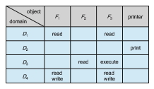
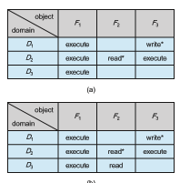
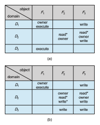

## Access Matrix

The general model of protection can be viewed abstractly as a matrix, called an **access matrix**. The rows of the access matrix represent domains, and the columns represent objects. Each entry in the matrix consists of a set of access rights. Because the column defines objects explicitly, we can omit the object name from the access right. The entry access(_i,j_) defines the set of operations that a process executing in domain _Di_ can invoke on object _Oj_.

To illustrate these concepts, we consider the access matrix shown in Figure 17.5. There are four domains and four objects—three files ( _F_ 1, _F_ 2, _F_ 3) and one laser printer. A process executing in domain _D_ 1 can read files _F_ 1 and _F_ 3. A process executing in domain _D_ 4 has the same privileges as one executing in domain _D_ 1; but in addition, it can also write onto files _F_ 1 and _F_ 3. The laser printer can be accessed only by a process executing in domain _D_ 2.

The access-matrix scheme provides uswith themechanism for specifying a variety of policies. The mechanism consists of implementing the access matrix and ensuring that the semantic properties we have outlined hold. More specif- ically, we must ensure that a process executing in domain _Di_ can access only those objects specified in row _i_, and then only as allowed by the access-matrix entries.

The access matrix can implement policy decisions concerning protection. The policy decisions involvewhich rights should be included in the (_i_, _j_)_th_ entry.  

**Figure 17.5** Access matrix.

We must also decide the domain in which each process executes. This last policy is usually decided by the operating system.

The users normally decide the contents of the access-matrix entries. When a user creates a new object _Oj_ , the column _Oj_ is added to the access matrix with the appropriate initialization entries, as dictated by the creator. The user may decide to enter some rights in some entries in column _j_ and other rights in other entries, as needed.

The access matrix provides an appropriate mechanism for defining and implementing strict control for both static and dynamic association between processes anddomains.Whenwe switch a process fromone domain to another, we are executing an operation (switch) on an object (the domain). We can control domain switching by including domains among the objects of the access matrix. Similarly, when we change the content of the access matrix, we are performing an operation on an object: the access matrix. Again, we can control these changes by including the accessmatrix itself as an object. Actually, since each entry in the access matrix can be modified individually, we must consider each entry in the access matrix as an object to be protected. Now, we need to consider only the operations possible on these new objects (domains and the access matrix) and decide howwewant processes to be able to execute these operations.

Processes should be able to switch from one domain to another. Switching fromdomain _Di_ to domain _Dj_ is allowed if and only if the access right switch∈ access(_i_, _j_). Thus, in Figure 17.6, a process executing in domain _D_ 2 can switch to domain _D_ 3 or to domain _D_ 4. A process in domain _D_ 4 can switch to _D_ 1, and one in domain _D_ 1 can switch to _D_ 2.

Allowing controlled change in the contents of the access-matrix entries requires three additional operations: copy, owner, and control. We examine these operations next.

The ability to copy an access right from one domain (or row) of the access matrix to another is denoted by an asterisk (\*) appended to the access right. The copy right allows the access right to be copied only within the column (that is, for the object) for which the right is defined. For example, in Figure 17.7(a), a process executing in domain _D_ 2 can copy the read operation into any entry associated with file _F_ 2. Hence, the access matrix of Figure 17.7(a) can be modified to the access matrix shown in Figure 17.7(b).  

**Figure 17.6** Access matrix of Figure 17.5 with domains as objects.

This scheme has two additional variants:

**1\.** Aright is copied from access(_i_, _j_) to access(_k_, _j_); it is then removed from access(_i_, _j_). This action is a transfer of a right, rather than a copy.

**2\.** Propagation of the copy right may be limited. That is, when the right _R_∗ is copied from access(_i_, _j_) to access(_k_, _j_), only the right _R_ (not _R_∗) is created. A process executing in domain _Dk_ cannot further copy the right _R_.

A system may select only one of these three copy rights, or it may provide all three by identifying them as separate rights: copy, transfer, and limited copy.

**Figure 17.7** Access matrix with **_copy_** rights.  

We also need a mechanism to allow addition of new rights and removal of some rights. The owner right controls these operations. If access(_i_, _j_) includes the owner right, then a process executing in domain _Di_ can add and remove any right in any entry in column _j_. For example, in Figure 17.8(a), domain _D_ 1 is the owner of _F_ 1 and thus can add and delete any valid right in column _F_ 1. Similarly, domain _D_ 2 is the owner of _F_ 2 and _F_ 3 and thus can add and remove any valid right within these two columns. Thus, the access matrix of Figure 17.8(a) can be modified to the access matrix shown in Figure 17.8(b).

The copy and owner rights allow a process to change the entries in a column. A mechanism is also needed to change the entries in a row. The control right is applicable only to domain objects. If access(_i_, _j_) includes the control right, then a process executing in domain _Di_ can remove any access right from row _j_. For example, suppose that, in Figure 17.6, we include the control right in access(_D_ 2, _D_ 4). Then, a process executing in domain _D_ 2 could modify domain _D_ 4, as shown in Figure 17.9.

The copy and owner rights provide us with a mechanism to limit the prop- agation of access rights. However, they do not give us the appropriate tools for preventing the propagation (or disclosure) of information. The problem of guaranteeing that no information initially held in an object canmigrate outside of its execution environment is called the **confinemen problem**. This problem is in general unsolvable (see the bibliographical notes at the end of the chapter).

**Figure 17.8** Access matrix with owner rights.  

**Figure 17.9** Modified access matrix of Figure 17.6.

These operations on the domains and the access matrix are not in them- selves important, but they illustrate the ability of the access-matrixmodel to let us implement and control dynamic protection requirements. New objects and new domains can be created dynamically and included in the access-matrix model. However, we have shown only that the basic mechanism exists. System designers andusersmustmake the policy decisions concerningwhich domains are to have access to which objects in which ways.
