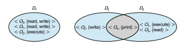

## Domain of Protection

Rings of protection separate functions into domains and order them hierar- chically. A generalization of rings is using domains without a hierarchy. A computer system can be treated as a collection of processes and objects. By  

**Figure 17.3** ARM architecture.

**_objects,_**we mean both **hardware objects** (such as the CPU, memory segments, printers, disks, and tape drives) and **software objects** (such as files, programs, and semaphores). Each object has a unique name that differentiates it from all other objects in the system, and each can be accessed only throughwell-defined and meaningful operations. Objects are essentially abstract data types.

The operations that are possible depend on the object. For example, on a CPU, we can only execute. Memory words can be read and written, whereas a DVD-ROM can only be read. Tape drives can be read, written, and rewound. Data files can be created, opened, read, written, closed, and deleted; program files can be read, written, executed, and deleted.

A process should be allowed to access only those objects for which it has authorization. Furthermore, at any time, a process should be able to access only those objects that it currently requires to complete its task. This second requirement, the **need-to-know principle**, is useful in limiting the amount of damage a faulty process or an attacker can cause in the system. For example, when process _p_ invokes procedure A(), the procedure should be allowed to access only its own variables and the formal parameters passed to it; it should not be able to access all the variables of process _p._ Similarly, consider the case in which process _p_ invokes a compiler to compile a particular file. The compiler should not be able to access files arbitrarily but should have access only to a well-defined subset of files (such as the source file, output object file, and so on) related to the file to be compiled. Conversely, the compiler may have private files used for accounting or optimization purposes that process _p_ should not be able to access.

In comparing need-to-know with least privilege, it may be easiest to think of need-to-know as the policy and least privilege as the mechanism for achiev- ing this policy. For example, in file permissions, need-to-know might dictate that a user have read access but not write or execute access to a file. The principle of least privilege would require that the operating system provide a mechanism to allow read but not write or execute access.  

### Domain Structure

To facilitate the sort of scheme just described, a process may operate within a **protection domain**, which specifies the resources that the process may access. Each domain defines a set of objects and the types of operations that may be invoked on each object. The ability to execute an operation on an object is an **access right**. A domain is a collection of access rights, each of which is an orderedpair _<_ object-name, rights-set _>_ . For example, if domain _D_ has the access right _<_ file _F_, _{_read,write_}>_, then a process executing in domain _D_ can both read and write file _F._ It cannot, however, perform any other operation on that object.

Domains may share access rights. For example, in Figure 17.4, we have three domains: _D_ 1, _D_ 2, and _D_ 3\. The access right _<O_ 4, _{ _print_ }>_ is shared by _D_ 2 and _D_ 3, implying that a process executing in either of these two domains can print object _O_ 4. Note that a process must be executing in domain _D_ 1 to read and write object _O_ 1, while only processes in domain _D_ 3 may execute object _O_ 1.

The association between a process and a domain may be either **static**, if the set of resources available to the process is fixed throughout the process’s lifetime, or **dynamic**. As might be expected, establishing dynamic protection domains is more complicated than establishing static protection domains.

If the association between processes and domains is fixed, and we want to adhere to the need-to-know principle, then a mechanism must be available to change the content of a domain. The reason stems from the fact that a process may execute in two different phases and may, for example, need read access in one phase and write access in another. If a domain is static, we must define the domain to include both read and write access. However, this arrangement provides more rights than are needed in each of the two phases, since we have read access in the phase where we need only write access, and vice versa. Thus, the need-to-knowprinciple is violated.Wemust allow the contents of a domain to be modified so that the domain always reflects the minimum necessary access rights.

If the association is dynamic, a mechanism is available to allow **domain switching**, enabling the process to switch from one domain to another.Wemay also want to allow the content of a domain to be changed. If we cannot change the content of a domain, we can provide the same effect by creating a new domain with the changed content and switching to that new domain when we want to change the domain content.

**Figure 17.4** System with three protection domains.  

Adomain can be realized in a variety of ways:

• Each **_user_** may be a domain. In this case, the set of objects that can be accessed depends on the identity of the user. Domain switching occurs when the user is changed—generally when one user logs out and another user logs in.

• Each **_process_** may be a domain. In this case, the set of objects that can be accessed depends on the identity of the process. Domain switching occurs when one process sends a message to another process and then waits for a response.

• Each **_procedure_** may be a domain. In this case, the set of objects that can be accessed corresponds to the local variables defined within the procedure. Domain switching occurs when a procedure call is made.

We discuss domain switching in greater detail in Section 17.5. Consider the standard dual-mode (kernel–usermode)model of operating system execution. When a process is in kernel mode, it can execute privileged instructions and thus gain complete control of the computer system. In con- trast, when a process executes in user mode, it can invoke only nonprivileged instructions. Consequently, it can execute only within its predefined memory space. These two modes protect the operating system (executing in kernel domain) from the user processes (executing in user domain). In a multipro- grammed operating system, two protection domains are insufficient, since users also want to be protected from one another. Therefore, a more elaborate scheme is needed. We illustrate such a scheme by examining two influential operating systems—UNIX and Android—to see how they implement these concepts.

### Example: UNIX

Asnoted earlier, in UNIX, the root user can execute privileged commands,while other users cannot. Restricting certain operations to the root user can impair other users in their everyday operations, however. Consider, for example, a user who wants to change his password. Inevitably, this requires access to the password database (commonly, /etc/shadow), which can only be accessed by root. A similar challenge is encountered when setting a scheduled job (using the at command)—doing so requires access to privileged directories that are beyond the reach of a normal user.

The solution to this problem is the setuid bit. In UNIX, an owner identi- fication and a domain bit, known as the **_setuid bit,_** are associated with each file. The setuid bit may or may not be enabled. When the bit is enabled on an executable file (through chmod +s), whoever executes the file temporarily assumes the identity of the file owner. That means if a user manages to create a file with the user ID “root” and the setuid bit enabled, anyone who gains access to execute the file becomes user “root” for the duration of the process’s lifetime.

If that strikes you as alarming, it is with good reason. Because of their potential power, setuid executable binaries are expected to be both sterile (affecting only necessary files under specific constraints) and hermetic (for example, tamperproof and impossible to subvert). Setuid programs need to be very carefully written to make these assurances. Returning to the example of changing passwords, the passwd command is setuid-root and will indeed modify the password database, but only if first presented with the user’s valid password, and it will then restrict itself to editing the password of that user and only that user.

Unfortunately, experience has repeatedly shown that few setuid binaries, if any, fulfill both criteria successfully. Time and again, setuid binaries have been subverted—some through race conditions and others through code injection —yielding instant root access to attackers. Attackers are frequently successful in achieving privilege escalation in this way.Methods of doing so are discussed in Chapter 16. Limiting damage from bugs in setuid programs is discussed in Section 17.8.

### Example: Android Application IDs

In Android, distinct user IDs are provided on a per-application basis. When an application is installed, the installd daemon assigns it a distinct user ID (UID) and group ID (GID), along with a private data directory (/data/data/<app- name>) whose ownership is granted to this UID/GID combination alone. In this way, applications on the device enjoy the same level of protection provided by UNIX systems to separate users. This is a quick and simple way to provide isolation, security, and privacy. The mechanism is extended by modifying the kernel to allow certain operations (such as networking sockets) only to mem- bers of a particular GID (for example, AID INET, 3003). A further enhancement by Android is to define certain UIDs as “isolated,” which prevents them from initiating RPC requests to any but a bare minimum of services.
