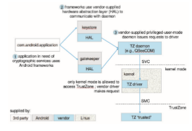

## Protection Rings

As we’ve seen, the main component of modern operating systems is the ker- nel, which manages access to system resources and hardware. The kernel, by definition, is a trusted and privileged component and therefore must run with a higher level of privileges than user processes.

To carry out this **_privilege separation,_** hardware support is required. Indeed, all modern hardware supports the notion of separate execution levels, though implementations vary somewhat. A popular model of privilege separation is that of protection rings. In this model, fashioned after Bell –LaPadula (https://www.acsac.org/2005/papers/Bell.pdf), execution is defined as a set of concentric rings, with ring _i_ providing a subset of the functionality of ring _j_ for any _j_ < _i_. The innermost ring, ring _0_, thus provides the full set of privileges. This pattern is shown in Figure 17.1.

When the system boots, it boots to the highest privilege level. Code at that level performs necessary initialization before dropping to a less privileged level. In order to return to a higher privilege level, code usually calls a special instruction, sometimes referred to as a gate, which provides a portal between rings. The syscall instruction (in Intel) is one example. Calling this instruction shifts execution fromuser to kernelmode. Aswe have seen, executing a system  

**Figure 17.1** Protection-ring structure.

call will always transfer execution to a predefined address, allowing the caller to specify only arguments (including the systemcall number), and not arbitrary kernel addresses. In this way, the integrity of the more privileged ring can generally be assured.

Another way of ending up in amore privileged ring is on the occurrence of a processor trap or an interrupt. When either occurs, execution is immediately transferred into the higher-privilege ring. Once again, however, the execution in the higher-privilege ring is predefined and restricted to a well-guarded code path.

Intel architectures follow this model, placing user mode code in ring _3_ and kernel mode code in ring _0_. The distinction is made by two bits in the special EFLAGS register. Access to this register is not allowed in ring _3_—thus prevent- ing a malicious process from escalating privileges. With the advent of virtual- ization, Intel defined an additional ring (_\-1_) to allow for **hypervisors**, or virtual machine managers, which create and run virtual machines. Hypervisors have more capabilities than the kernels of the guest operating systems.

The ARMprocessor’s architecture initially allowed only USR and SVCmode, for user and kernel (supervisor) mode, respectively. In ARMv7 processors, ARM introduced**TrustZone** (**TZ**), which provided an additional ring. Thismost priv- ileged execution environment also has exclusive access to hardware-backed cryptographic features, such as the NFC Secure Element and an on-chip cryp- tographic key, that make handling passwords and sensitive information more secure. Even the kernel itself has no access to the on-chip key, and it can only request encryption and decryption services from the TrustZone environment (by means of a specialized instruction, **Secure Monitor Call** (**SMC**)), which is only usable from kernel mode. As with system calls, the kernel has no ability to directly execute to specific addresses in the TrustZone—only to pass argu- ments via registers. Android uses TrustZone extensively as of Version 5.0, as shown in Figure 17.2.

Correctly employing a trusted execution environment means that, if the kernel is compromised, an attacker can’t simply retrieve the key from kernel memory. Moving cryptographic services to a separate, trusted environment  

**Figure 17.2** Android uses of TrustZone.

also makes brute-force attacks less likely to succeed. (As described in Chapter 16, these attacks involve trying all possible combinations of valid password characters until the password is found.) The various keys used by the system, from the user’s password to the system’s own, are stored in the on-chip key, which is only accessible in a trusted context. When a key—say, a password— is entered, it is verified via a request to the TrustZone environment. If a key is not known andmust be guessed, the TrustZone verifier can impose limitations —by capping the number of verification attempts, for example.

In the 64-bit ARMv8 architecture, ARM extended its model to support four levels, called “exception levels,” numbered EL0 through EL3. User mode runs in EL0, and kernel mode in EL1. EL2 is reserved for hypervisors, and EL3 (the most privileged) is reserved for the secure monitor (the TrustZone layer). Any one of the exception levels allows running separate operating systems side by side, as shown in Figure 17.3.

Note that the secure monitor runs at a higher execution level than general- purpose kernels,whichmakes it the perfect place to deploy code thatwill check the kernels’ integrity. This functionality is included in Samsung’s Realtime Kernel Protection (RKP) for Android and Apple’s WatchTower (also known as KPP, for Kernel Patch Protection) for iOS.
