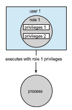

## Role-Based Access Control

In Section 13.4.2, we described how access controls can be used on files within a file system. Each file and directory is assigned an owner, a group, or possibly a list of users, and for each of those entities, access-control information is assigned. A similar function can be added to other aspects of a computer system. A good example of this is found in Solaris 10 and later versions.

The idea is to advance the protection available in the operating system by explicitly adding the principle of least privilege via **role-based access control** (**RBAC**). This facility revolves around privileges. A privilege is the right to execute a system call or to use an option within that system call (such as opening a file with write access). Privileges can be assigned to processes, limiting them to exactly the access they need to perform their work. Privileges and programs can also be assigned to **roles**. Users are assigned roles or can take roles based on passwords assigned to the roles. In this way, a user can take a  

**Figure 17.10** Role-based access control in Solaris 10.

role that enables a privilege, allowing the user to run a program to accomplish a specific task, as depicted in Figure 17.10. This implementation of privileges decreases the security risk associated with superusers and setuid programs.

Notice that this facility is similar to the access matrix described in Section 17.5. This relationship is further explored in the exercises at the end of the chapter.
