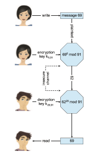
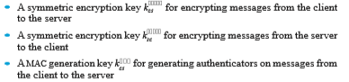

## Cryptography as a Security Tool

There are many defenses against computer attacks, running the gamut from methodology to technology. The broadest tool available to system designers and users is cryptography. In this section, we discuss cryptography and its use in computer security. Note that the cryptography discussed here has been simplified for educational purposes; readers are cautioned against using any of the schemes described here in the real world. Good cryptography libraries arewidely available andwouldmake a good basis for production applications.

In an isolated computer, the operating system can reliably determine the sender and recipient of all interprocess communication, since it controls all communication channels in the computer. In a network of computers, the situation is quite different. A networked computer receives bits “from the wire” with no immediate and reliable way of determining what machine or application sent those bits. Similarly, the computer sends bits onto the network with no way of knowing who might eventually receive them. Additionally, when either sending or receiving, the system has no way of knowing if an eavesdropper listened to the communication.  

Commonly, network addresses are used to infer the potential senders and receivers of network messages. Network packets arrive with a source address, such as an IP address. And when a computer sends a message, it names the intended receiver by specifying a destination address. However, for appli- cations where security matters, we are asking for trouble if we assume that the source or destination address of a packet reliably determines who sent or received that packet. A rogue computer can send a message with a falsified source address, and numerous computers other than the one specified by the destination address can (and typically do) receive a packet. For example, all of the routers on theway to the destinationwill receive the packet, too.How, then, is an operating system to decidewhether to grant a requestwhen it cannot trust the named source of the request? And how is it supposed to provide protection for a request or data when it cannot determine who will receive the response or message contents it sends over the network?

It is generally considered infeasible to build a network of any scale in which the source and destination addresses of packets can be **_trusted_** in this sense. Therefore, the only alternative is somehow to eliminate the need to trust the network. This is the job of cryptography. Abstractly, **cryptography** is used to constrain the potential senders and/or receivers of a message. Modern cryptography is based on secrets called **keys** that are selectively distributed to computers in a network and used to processmessages. Cryptography enables a recipient of amessage to verify that themessagewas created by some computer possessing a certain key. Similarly, a sender can encode its message so that only a computer with a certain key can decode the message. Unlike network addresses, however, keys are designed so that it is not computationally feasible to derive them from themessages theywere used to generate or from any other public information. Thus, they provide a much more trustworthy means of constraining senders and receivers of messages.

Cryptography is a powerful tool, and the use of cryptography can cause contention. Some countries ban its use in certain forms or limit how long the keys can be. Others have ongoing debates about whether technology vendors (such as smartphone vendors) must provide a **back door** to the included cryp- tography, allowing law enforcement to bypass the privacy it provides. Many observers argue, however, that back doors are an intentional securityweakness that could be exploited by attackers or even misused by governments.

Finally, note that cryptography is a field of study unto itself, with large and small complexities and subtleties. Here, we explore themost important aspects of the parts of cryptography that pertain to operating systems.

### Encryption

Because it solves a wide variety of communication security problems, **encryp- tion** is used frequently inmany aspects ofmodern computing. It is used to send messages securely across a network, as well as to protect database data, files, and even entire disks from having their contents read by unauthorized entities. An encryption algorithm enables the sender of a message to ensure that only a computer possessing a certain key can read the message or to ensure that the writer of data is the only reader of the data. Encryption of messages is an ancient practice, of course, and there have been many encryption algorithms, dating back to ancient times. In this section, we describe important modern encryption principles and algorithms.

An encryption algorithm consists of the following components:

• A set _K_ of keys.

• A set_M_ of messages.

• A set _C_ of ciphertexts.

• An encrypting function _E_ : _K_ → (_M_ → _C_). That is, for each _k_ ∈ _K_, _Ek_ is a function for generating ciphertexts frommessages. Both _E_ and _Ek_ for any _k_ should be efficiently computable functions. Generally, _Ek_ is a randomized mapping from messages to ciphertexts.

• A decrypting function _D_ : _K_ → (_C_ → _M_). That is, for each _k_ ∈ _K_, _Dk_ is a function for generating messages from ciphertexts. Both _D_ and _Dk_ for any _k_ should be efficiently computable functions.

An encryption algorithm must provide this essential property: given a ciphertext _c_ ∈ _C_, a computer can compute _m_ such that _Ek_(_m_) = _c_ only if it possesses _k_. Thus, a computer holding _k_ can decrypt ciphertexts to the plaintexts used to produce them, but a computer not holding _k_ cannot decrypt ciphertexts. Since ciphertexts are generally exposed (for example, sent on a network), it is important that it be infeasible to derive _k_ from the ciphertexts.

There are two main types of encryption algorithms: symmetric and asym- metric. We discuss both types in the following sections.

### Symmetric Encryption

In a **symmetric encryption algorithm**, the same key is used to encrypt and to decrypt. Therefore, the secrecy of _k_ must be protected. Figure 16.7 shows an example of two users communicating securely via symmetric encryption over an insecure channel. Note that the key exchange can take place directly between the two parties or via a trusted third party (that is, a certificate author- ity), as discussed in Section 16.4.1.4.

For the past several decades, the most commonly used symmetric encryp- tion algorithm in the United States for civilian applications has been the **data- encryption standard** (**DES**) cipher adopted by the National Institute of Stan- dards and Technology (NIST). DES works by taking a 64-bit value and a 56-bit key and performing a series of transformations that are based on substitution and permutation operations. Because DES works on a block of bits at a time, is known as a **block cipher**, and its transformations are typical of block ciphers. With block ciphers, if the same key is used for encrypting an extended amount of data, it becomes vulnerable to attack.

DES is now considered insecure for many applications because its keys can be exhaustively searched with moderate computing resources. (Note, though, that it is still frequently used.) Rather than giving up on DES, NIST created a modification called **triple DES**, in which the DES algorithm is repeated three times (two encryptions and one decryption) on the same plaintext using two or three keys—for example, _c_ \= _Ek_3(_Dk_2(_Ek_1(_m_))). When three keys are used, the effective key length is 168 bits.  

**Figure 16.7** A secure communication over an insecure medium.2

In 2001, NIST adopted a new block cipher, called the **advanced encryption standard** (**AES**), to replace DES. AES (also known as Rijndael) has been standard- ized in FIPS-197 (http://nvlpubs.nist.gov/nistpubs/FIPS/NIST.FIPS.197.pdf). It can use key lengths of 128, 192, or 256 bits and works on 128-bit blocks. Gen- erally, the algorithm is compact and efficient.

Block ciphers are not necessarily secure encryption schemes. In particular, they do not directly handle messages longer than their required block sizes. An alternative is stream ciphers, which can be used to securely encrypt longer messages.

A **stream cipher** is designed to encrypt and decrypt a stream of bytes or bits rather than a block. This is useful when the length of a communication would make a block cipher too slow. The key is input into a pseudo–random- bit generator, which is an algorithm that attempts to produce random bits. The output of the generator when fed a key is a keystream. A **keystream** is an infinite set of bits that can be used to encrypt a plaintext stream through an XOR operation. (XOR, for “exclusive OR” is an operation that compares two input bits and generates one output bit. If the bits are the same, the result is 0. If the bits are different, the result is 1.) AES-based cipher suites include stream ciphers and are the most common today.

### Asymmetric Encryption

In an **asymmetric encryption algorithm**, there are different encryption and decryption keys. An entity preparing to receive encrypted communication creates two keys and makes one of them (called the public key) available to anyonewhowants it. Any sender can use that key to encrypt a communication, but only the key creator can decrypt the communication. This scheme, known as **public-key encryption**, was a breakthrough in cryptography (first described by Diffie and Hellman in https://www-ee.stanford.edu/ hell- man/publications/24.pdf). No longer must a key be kept secret and delivered securely. Instead, anyone can encrypt a message to the receiving entity, and no matter who else is listening, only that entity can decrypt the message.

As an example of how public-key encryption works, we describe an algo- rithm known as **RSA**, after its inventors, Rivest, Shamir, and Adleman. RSA is the most widely used asymmetric encryption algorithm. (Asymmetric algo- rithms based on elliptic curves are gaining ground, however, because the key length of such an algorithm can be shorter for the same amount of crypto- graphic strength.)

In RSA, _ke_ is the **public key**, and _kd_ is the **private key**. _N_ is the product of two large, randomly chosen prime numbers _p_ and _q_ (for example, _p_ and _q_ are 2048 bits each). It must be computationally infeasible to derive _kd_,_N_ from _ke_,_N_, so that _ke_ need not be kept secret and can be widely disseminated. The encryption algorithm is _Eke_,_N_(_m_) = _mke_ mod _N_, where _ke_ satisfies _kekd_ mod (_p_− 1)(_q_− 1) = 1. The decryption algorithm is then _Dkd_,_N_

(_c_) = _ckd_ mod _N_. An example using small values is shown in Figure 16.8. In this example, we

make _p_ \= 7 and _q_ \= 13.We then calculate_N_ \= 7 ∗ 13 = 91 and (_p_−1)(_q_−1) = 72. Wenext select _ke_ relativelyprime to 72 and_<_ 72, yielding 5. Finally,we calculate _kd_ such that _kekd_ mod 72 = 1, yielding 29.We now have our keys: the public key, _ke_,_N_ \= 5, 91, and the private key, _kd_,_N_ \= 29, 91. Encrypting the message 69 with the public key results in the message 62, which is then decoded by the receiver via the private key.

The use of asymmetric encryption begins with the publication of the public key of the destination. For bidirectional communication, the source also must publish its public key. “Publication” can be as simple as handing over an electronic copy of the key, or it can bemore complex. The private key (or “secret key”) must be zealously guarded, as anyone holding that key can decrypt any message created by the matching public key.

We should note that the seemingly small difference in key use between asymmetric and symmetric cryptography is quite large in practice. Asymmet- ric cryptography is much more computationally expensive to execute. It is much faster for a computer to encode and decode ciphertext by using the usual symmetric algorithms than by using asymmetric algorithms. Why, then, use an asymmetric algorithm? In truth, these algorithms are not used for general- purpose encryption of large amounts of data. However, they are used not only for encryption of small amounts of data but also for authentication, confiden- tiality, and key distribution, as we show in the following sections.

### Authentication

We have seen that encryption offers a way of constraining the set of possible receivers of a message. Constraining the set of potential senders of a message  

**Figure 16.8** Encryption and decryption using RSA asymmetric cryptography.3

is called **authentication**. Authentication is thus complementary to encryption. Authentication is also useful for proving that amessage has not beenmodified. Next, we discuss authentication as a constraint on possible senders of a mes- sage. Note that this sort of authentication is similar to but distinct from user authentication, which we discuss in Section 16.5.

An authentication algorithm using symmetric keys consists of the follow- ing components:

• A set _K_ of keys.

• A set_M_ of messages.

• A set _A_ of authenticators.

• A function _S_ : _K_ → (_M_ → _A_). That is, for each _k_ ∈ _K_, _Sk_ is a function for generating authenticators from messages. Both _S_ and _Sk_ for any _k_ should be efficiently computable functions.

• A function _V_ : _K_ → (_M_ × _A_ → _{_true, false_}_). That is, for each _k_ ∈ _K_, _Vk_ is a function for verifying authenticators on messages. Both _V_ and _Vk_ for any _k_ should be efficiently computable functions.

The critical property that an authentication algorithmmust possess is this: for a message _m_, a computer can generate an authenticator _a_ ∈ _A_ such that _Vk_(_m_, _a_) = true only if it possesses _k_. Thus, a computer holding _k_ can generate authenticators onmessages so that any computer possessing _k_ can verify them. However, a computer not holding _k_ cannot generate authenticators on mes- sages that can be verified using _Vk_. Since authenticators are generally exposed (for example, sent on a network with the messages themselves), it must not be feasible to derive _k_ from the authenticators. Practically, if _Vk_(_m_, _a_) = true, then we know that _m_ has not been modified and that the sender of the message has _k_. If we share _k_with only one entity, then we know that the message originated from _k_.

Just as there are two types of encryption algorithms, there are two main varieties of authentication algorithms. The first step in understanding these algorithms is to explore hash functions. A **hash function** _H_(_m_) creates a small, fixed-sized block of data, known as a **message digest** or **hash value**, from a message _m_. Hash functions work by taking a message, splitting it into blocks, and processing the blocks to produce an _n_\-bit hash. _H_ must be collision resis- tant—that is, it must be infeasible to find an _m_′ ≠ _m_ such that _H_(_m_) = _H_(_m_′). Now, if _H_(_m_) = _H_(_m_′), we know that _m_ \= _m_′—that is, we know that the message has not been modified. Common message-digest functions include **MD5** (now considered insecure), which produces a 128-bit hash, and **SHA-1**, which outputs a 160-bit hash. Message digests are useful for detecting changed messages but are not useful as authenticators. For example, _H_(_m_) can be sent along with a message; but if _H_ is known, then someone could modify _m_ to _m_′

and recompute _H_(_m_′), and the message modification would not be detected. Therefore, we must authenticate _H_(_m_).

The firstmain type of authentication algorithmuses symmetric encryption. In a **message-authentication code** (**MAC**), a cryptographic checksum is gener- ated from the message using a secret key. A MAC provides a way to securely authenticate short values. If we use it to authenticate _H_(_m_) for an _H_ that is collision resistant, thenwe obtain away to securely authenticate longmessages by hashing them first. Note that _k_ is needed to compute both _Sk_ and _Vk_, so anyone able to compute one can compute the other.

The second main type of authentication algorithm is a **digital-signature algorithm**, and the authenticators thus produced are called **digital signatures**. Digital signatures are very useful in that they enable **_anyone_** to verify the authenticity of themessage. In a digital-signature algorithm, it is computation- ally infeasible to derive _ks_ from _kv_. Thus, _kv_ is the public key, and _ks_ is the private key.

Consider as an example the RSA digital-signature algorithm. It is similar to the RSAencryption algorithm, but the key use is reversed. The digital signature of a message is derived by computing _Sks_(_m_) = _H_(_m_)_ks_ mod _N_. The key _ks_ again is a pair ⟨_d_,_N_⟩, where _N_ is the product of two large, randomly chosen prime

numbers _p_ and _q_. The verification algorithm is then _Vkv_(_m_, _a_) ? =_akv_ mod _N_ \=

_H_(_m_)), where _kv_ satisfies _kvks_ mod (_p_ − 1)(_q_ − 1) = 1. Digital signatures (as is the case with many aspects of cryptography) can be used on other entities than messages. For example creators of programs can “sign their code” via a digital signature to validate that the code has not been modified between its publication and its installation on a computer. **Code signing** has become a very common security improvement method on many systems.

Note that encryption and authentication may be used together or sepa- rately. Sometimes, for instance, we want authentication but not confidentiality. For example, a company could provide a software patch and could “sign” that patch to prove that it came from the company and that it hasn’t beenmodified.

Authentication is a component of many aspects of security. For example, digital signatures are the core of **nonrepudiation**, which supplies proof that an entity performed an action. A typical example of nonrepudiation involves the filling out of electronic forms as an alternative to the signing of paper contracts. Nonrepudiation assures that a person filling out an electronic form cannot deny that he did so.

### Key Distribution

Certainly, a good part of the battle between cryptographers (those inventing ciphers) and cryptanalysts (those trying to break them) involves keys. With symmetric algorithms, both parties need the key, and no one else should have it. The delivery of the symmetric key is a huge challenge. Sometimes it is performed **out-of-band**. For example, if Walter wanted to communicate with Rebecca securely, they could exchange a key via a paper document or a conver- sation and then have the communication electronically. These methods do not scale well, however. Also consider the key-management challenge. Suppose Lucy wanted to communicate with _N_ other users privately. Lucy would need _N_ keys and, for more security, would need to change those keys frequently.

These are the very reasons for efforts to create asymmetric key algorithms. Not only can the keys be exchanged in public, but a given user, say Audra, needs only one private key, no matter how many other people she wants to communicate with. There is still the matter of managing a public key for each recipient of the communication, but since public keys need not be secured, simple storage can be used for that **key ring**.

Unfortunately, even the distribution of public keys requires some care. Consider the man-in-the-middle attack shown in Figure 16.9. Here, the person who wants to receive an encrypted message sends out his public key, but an attacker also sends her “bad” public key (which matches her private key). The person who wants to send the encrypted message knows no better and so uses the bad key to encrypt the message. The attacker then happily decrypts it.

The problem is one of authentication—what we need is proof of who (or what) owns a public key. One way to solve that problem involves the use of digital certificates. A **digital certificat** is a public key digitally signed by a trusted party. The trusted party receives proof of identification from some entity and certifies that the public key belongs to that entity. But how do we know we can trust the certifier? These **certificat authorities** have their public keys includedwithinweb browsers (and other consumers of certificates) before they are distributed. The certificate authorities can then vouch for other authorities (digitally signing the public keys of these other authorities), and so on, creating a web of trust. The certificates can be distributed in a standard  

**Figure 16.9** A man-in-the-middle attack on asymmetric cryptography.4

X.509 digital certificate format that can be parsed by computer. This scheme is used for secure web communication, as we discuss in Section 16.4.3.

### Implementation of Cryptography

Network protocols are typically organized in **_layers_**, with each layer acting as a client of the one below it. That is, when one protocol generates a message to send to its protocol peer on another machine, it hands its message to the protocol below it in the network-protocol stack for delivery to its peer on that machine. For example, in an IP network, TCP (a **_transport-layer_** protocol) acts as a client of IP (a **_network-layer_** protocol): TCP packets are passed down to IP for delivery to the IP peer at the other end of the connection. IP encapsulates the TCP packet in an IP packet, which it similarly passes down to the **_data-link layer_** to be transmitted across the network to its peer on the destination computer. This IP peer then delivers the TCP packet up to the TCP peer on that machine. Seven such layers are included in the OSI model, mentioned earlier and described in detail in Section 19.3.2.

Cryptography can be inserted at almost any layer in network protocol stacks. TLS (Section 16.4.3), for example, provides security at the transport layer. Network-layer security generally has been standardized on **IPSec**, which defines IP packet formats that allow the insertion of authenticators and the encryption of packet contents. IPSec uses symmetric encryption and uses the **Internet Key Exchange** (**IKE**) protocol for key exchange. IKE is based on public- key encryption. IPSec has widely used as the basis for **virtual private networks** (**VPNs**), in which all traffic between two IPSec endpoints is encrypted to make a private network out of one that would otherwise be public. Numerous proto- cols also have been developed for use by applications, such as PGP for encrypt- ing e-mail; in this type of scheme, the applications themselves must be coded to implement security.

Where is cryptographic protection best placed in a protocol stack? In gen- eral, there is no definitive answer. On the one hand,more protocols benefit from protections placed lower in the stack. For example, since IP packets encapsu- late TCP packets, encryption of IP packets (using IPSec, for example) also hides the contents of the encapsulated TCP packets. Similarly, authenticators on IP packets detect the modification of contained TCP header information.

On the other hand, protection at lower layers in the protocol stack may give insufficient protection to higher-layer protocols. For example, an appli- cation server that accepts connections encrypted with IPSec might be able to authenticate the client computers from which requests are received. However, to authenticate a user at a client computer, the server may need to use an application-level protocol—the usermay be required to type a password. Also consider the problem of e-mail. E-mail delivered via the industry-standard SMTP protocol is stored and forwarded, frequently multiple times, before it is delivered. Each of these transmissions could go over a secure or an insecure network. For e-mail to be secure, the e-mail message needs to be encrypted so that its security is independent of the transports that carry it.

Unfortunately, like many tools, encryption can be used not only for “good” but also for “evil.” The ransomware attacks described earlier, for example, are based on encryption. As mentioned, the attackers encrypt information on the target system and render it inaccessible to the owner. The idea is to force the owner to pay a ransom to get the key needed to decrypt the data. Prevention of such attacks takes the form of better system and network security and a well- executed backup plan so that the contents of the files can be restored without the key.

### An Example: TLS

**Transport Layer Security** (**TLS**) is a cryptographic protocol that enables two computers to communicate securely—that is, so that each can limit the sender and receiver of messages to the other. It is perhaps the most commonly used cryptographic protocol on the Internet today, since it is the standard protocol by which web browsers communicate securely with web servers. For completeness, we should note that TLS evolved from SSL (Secure Sock- ets Layer), which was designed by Netscape. It is described in detail in https://tools.ietf.org/html/rfc5246.  

TLS is a complex protocolwithmany options.Here,we present only a single variation of it. Even then, we describe it in a very simplified and abstract form, so as to maintain focus on its use of cryptographic primitives. What we are about to see is a complex dance in which asymmetric cryptography is used so that a client and a server can establish a secure **session key** that can be used for symmetric encryption of the session between the two—all of this while avoid- ing man-in-the-middle and replay attacks. For added cryptographic strength, the session keys are forgotten once a session is completed. Another communi- cation between the two will require generation of new session keys.

The TLS protocol is initiated by a client _c_ to communicate securely with a server. Prior to the protocol’s use, the server _s_ is assumed to have obtained a certificate, denoted cert_s_, from certification authority CA. This certificate is a structure containing the following:

• Various attributes (attrs) of the server, such as its unique **_distinguished_** name and its **_common_** (DNS) name

• The identity of a asymmetric encryption algorithm _E_() for the server

• The public key _ke_ of this server

• Avalidity interval (interval) during which the certificate should be consid- ered valid

• A digital signature a on the above information made by the CA—that is, a = S_kCA_(⟨ attrs, E_ke_, interval ⟩)

In addition, prior to the protocol’s use, the client is presumed to have obtained the public verification algorithm _VkCA_ for CA. In the case of the web, the user’s browser is shipped from its vendor containing the verification algorithms and public keys of certain certification authorities. The user can delete these or add others.

When _c_ connects to _s_, it sends a 28-byte randomvalue_nc_ to the server,which responds with a random value _ns_ of its own, plus its certificate cert_s_. The client verifies that _VkCA_(⟨ attrs, _Eke_, interval⟩, a) = true and that the current time is in the validity interval interval. If both of these tests are satisfied, the server has proved its identity. Then the client generates a random 46-byte **_premaster secret_** pms and sends cpms = _Eke_(pms) to the server. The server recovers pms = _Dkd_(cpms). Now both the client and the server are in possession of _nc_, _ns_, and pms, and each can compute a shared 48-byte **_master secret_** ms = _H_(_nc_, _ns_, pms). Only the server and client can compute ms, since only they know pms. Moreover, the dependence of ms on _nc_ and _ns_ ensures that ms is a **_fresh_** value —that is, a session key that has not been used in a previous communication. At this point, the client and the server both compute the following keys from the ms:

This protocol enables the server to limit the recipients of its messages to the client that generated pms and to limit the senders of the messages it accepts to that same client. Similarly, the client can limit the recipients of the messages it sends and the senders of the messages it accepts to the party that knows _kd_ (that is, the party that can decrypt cpms). In many applications, such as web transactions, the client needs to verify the identity of the party that knows _kd_. This is one purpose of the certificate cert_s_. In particular, the attrs field contains information that the client can use to determine the identity—for example, the domain name—of the server with which it is communicating. For applications in which the server also needs information about the client, TLS supports an option by which a client can send a certificate to the server.

In addition to its use on the Internet, TLS is being used for a wide variety of tasks. For example, we mentioned earlier that IPSec is widely used as the basis for virtual private networks, or VPNs. IPSec VPNs now have a competitor in TLS VPNs. IPSec is good for point-to-point encryption of traffic—say, between two company offices. TLS VPNs are more flexible but not as efficient, so they might be used between an individual employee working remotely and the corporate office.
