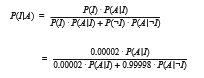
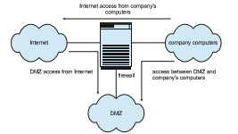

## Implementing Security Defenses

Just as there are myriad threats to system and network security, there are many security solutions. The solutions range from improved user education, through technology, to writing better software. Most security professionals subscribe to the theory of **defense in depth**, which states that more layers of defense are better than fewer layers. Of course, this theory applies to any kind of security. Consider the security of a house without a door lock, with a door lock, and with a lock and an alarm. In this section, we look at the major methods, tools, and techniques that can be used to improve resistance to threats. Note that some security-improving techniques are more properly part of protection than security and are covered in Chapter 17.

### Security Policy

The first step toward improving the security of any aspect of computing is to have a **security policy**. Policies vary widely but generally include a statement of what is being secured. For example, a policy might state that all outside- accessible applications must have a code review before being deployed, or that users should not share their passwords, or that all connection points between a company and the outside must have port scans run every six months. Without a policy in place, it is impossible for users and administrators to know what is permissible, what is required, and what is not allowed. The policy is a road map to security, and if a site is trying to move from less secure to more secure, it needs a map to know how to get there.

Once the security policy is in place, the people it affects should know it well. It should be their guide. The policy should also be a **living document** that is reviewed and updated periodically to ensure that it is still pertinent and still followed.

### Vulnerability Assessment

How can we determine whether a security policy has been correctly imple- mented? The best way is to execute a vulnerability assessment. Such assess- ments can cover broad ground, from social engineering through risk assess- ment to port scans. **Risk assessment**, for example, attempts to value the assets of the entity in question (a program, a management team, a system, or a facil- ity) and determine the odds that a security incident will affect the entity and decrease its value. When the odds of suffering a loss and the amount of the potential loss are known, a value can be placed on trying to secure the entity.

The core activity of most vulnerability assessments is a **penetration test**, in which the entity is scanned for known vulnerabilities. Because this book is concerned with operating systems and the software that runs on them, we concentrate on those aspects of vulnerability assessment.

Vulnerability scans typically are done at times when computer use is rela- tively low, to minimize their impact. When appropriate, they are done on test systems rather than production systems, because they can induce unhappy behavior from the target systems or network devices.

A scan within an individual system can check a variety of aspects of the system:

• Short or easy-to-guess passwords

• Unauthorized privileged programs, such as setuid programs

• Unauthorized programs in system directories

• Unexpectedly long-running processes

• Improper directory protections on user and system directories

• Improper protections on systemdata files, such as the passwordfile, device files, or the operating-system kernel itself

• Dangerous entries in the program search path (for example, the Trojan horse discussed in Section 16.2.1), such as the current directory and any easily-written directories such as /tmp

• Changes to system programs detected with checksum values

• Unexpected or hidden network daemons

Any problems found by a security scan can be either fixed automatically or reported to the managers of the system.

Networked computers are much more susceptible to security attacks than are standalone systems. Rather than attacks from a known set of access points, such as directly connected terminals, we face attacks from an unknown and large set of access points—a potentially severe security problem. To a lesser extent, systems connected to telephone lines via modems are also more exposed.

In fact, the U.S. government considers a system to be only as secure as its most far-reaching connection. For instance, a top-secret system may be accessed only from within a building also considered top-secret. The system loses its top-secret rating if any form of communication can occur outside that environment. Some government facilities take extreme security precautions. The connectors that plug a terminal into the secure computer are locked in a safe in the office when the terminal is not in use. Apersonmust have proper ID to gain access to the building and her office, must know a physical lock com- bination, and must know authentication information for the computer itself to gain access to the computer—an example of multifactor authentication.

Unfortunately for system administrators and computer-security profes- sionals, it is frequently impossible to lock a machine in a room and disallow all remote access. For instance, the Internet currently connects billions of com- puters and devices and has become a mission-critical, indispensable resource for many companies and individuals. If you consider the Internet a club, then, as in any club with millions of members, there are many good members and some badmembers. The badmembers havemany tools they can use to attempt to gain access to the interconnected computers.

Vulnerability scans can be applied to networks to address some of the problems with network security. The scans search a network for ports that respond to a request. If services are enabled that should not be, access to them can be blocked, or they can be disabled. The scans then determine the details of the application listening on that port and try to determine if it has any knownvulnerabilities. Testing those vulnerabilities can determine if the system is misconfigured or lacks needed patches.

Finally, though, consider the use of port scanners in the hands of an attacker rather than someone trying to improve security. These tools could help attack- ers find vulnerabilities to attack. (Fortunately, it is possible to detect port scans through anomaly detection, as we discuss next.) It is a general challenge to security that the same tools can be used for good and for harm. In fact, some people advocate **security through obscurity**, stating that no tools should be written to test security, because such tools can be used to find (and exploit) security holes. Others believe that this approach to security is not a valid one, pointing out, for example, that attackers could write their own tools. It seems reasonable that security through obscurity be considered one of the layers of security only so long as it is not the only layer. For example, a company could publish its entire network configuration, but keeping that information secret makes it harder for intruders to know what to attack. Even here, though, a company assuming that such information will remain a secret has a false sense of security.

### Intrusion Prevention

Securing systems and facilities is intimately linked to intrusion detection and prevention. **Intrusion prevention**, as its name suggests, strives to detect attemptedor successful intrusions into computer systems and to initiate appro- priate responses to the intrusions. Intrusion prevention encompasses a wide array of techniques that vary on a number of axes, including the following:

• The time at which detection occurs. Detection can occur in real time (while the intrusion is occurring) or after the fact.

• The types of inputs examined to detect intrusive activity. These may include user-shell commands, process system calls, and network packet headers or contents. Some forms of intrusion might be detected only by correlating information from several such sources.

• The range of response capabilities. Simple forms of response include alert- ing an administrator to the potential intrusion or somehow halting the potentially intrusive activity—for example, killing a process engaged in such activity. In a sophisticated form of response, a systemmight transpar- ently divert an intruder’s activity to a **honeypot**—a false resource exposed to the attacker. The resource appears real to the attacker and enables the system to monitor and gain information about the attack.

These degrees of freedom in the design space for detecting intrusions have yielded a wide range of solutions, known as **intrusion-prevention systems** (**IPS**). IPSs act as self-modifying firewalls, passing traffic unless an intrusion is detected (at which point that traffic is blocked).

But just what constitutes an intrusion? Defining a suitable specification of intrusion turns out to be quite difficult, and thus automatic IPSs today typically settle for one of two less ambitious approaches. In the first, called **signature-based detection**, system input or network traffic is examined for specific behavior patterns (or **signatures**) known to indicate attacks. A simple example of signature-based detection is scanning network packets for the string “/etc/passwd” targeted for a UNIX system. Another example is virus- detection software,which scans binaries or network packets for known viruses.

The second approach, typically called **anomaly detection**, attempts through various techniques to detect anomalous behavior within computer systems. Of course, not all anomalous system activity indicates an intrusion, but the presumption is that intrusions often induce anomalous behavior. An example of anomaly detection is monitoring system calls of a daemon process to detect whether the system-call behavior deviates from normal patterns, possibly indicating that a buffer overflow has been exploited in the daemon to corrupt its behavior. Another example is monitoring shell commands to detect anomalous commands for a given user or detecting an anomalous login time for a user, either of which may indicate that an attacker has succeeded in gaining access to that user’s account.

Signature-based detection and anomaly detection can be viewed as two sides of the same coin. Signature-based detection attempts to characterize dan- gerous behaviors and to detect when one of these behaviors occurs, whereas anomaly detection attempts to characterize normal (or nondangerous) behav- iors and to detect when something other than these behaviors occurs.

These different approaches yield IPSs with very different properties, how- ever. In particular, anomaly detection can find previouslyunknownmethods of intrusion (so-called **zero-day attacks**). Signature-based detection, in contrast, will identify only known attacks that can be codified in a recognizable pat- tern. Thus, new attacks that were not contemplated when the signatures were generated will evade signature-based detection. This problem is well known to vendors of virus-detection software, who must release new signatures with great frequency as new viruses are detected manually.

Anomalydetection is not necessarily superior to signature-baseddetection, however. Indeed, a significant challenge for systems that attempt anomaly detection is to benchmark “normal” system behavior accurately. If the sys- tem has already been penetrated when it is benchmarked, then the intrusive activity may be included in the “normal” benchmark. Even if the system is benchmarked cleanly, without influence from intrusive behavior, the bench- mark must give a fairly complete picture of normal behavior. Otherwise, the number of **false positives** (false alarms) or, worse, **false negatives** (missed intrusions) will be excessive.

To illustrate the impact of even a marginally high rate of false alarms, consider an installation consisting of a hundred UNIXworkstations from which security-relevant events are recorded for purposes of intrusion detection. A small installation such as this could easily generate a million audit records per day.Only one or twomight beworthy of an administrator’s investigation. Ifwe suppose, optimistically, that each actual attack is reflected in ten audit records, we can roughly compute the rate of occurrence of audit records reflecting truly intrusive activity as follows:

Interpreting this as a “probability of occurrence of intrusive records,” we denote it as _P_(_I_); that is, event _I_ is the occurrence of a record reflecting truly intrusive behavior. Since _P_(_I_) = 0_._00002, we also know that _P_(¬_I_) = 1 − _P_(_I_) = 0_._99998\. Nowwe let_A_ denote the raising of an alarm by an IDS. An accurate IDS should maximize both _P_(_I_|_A_) and _P_(¬_I_|¬_A_)—that is, the probabilities that an alarm indicates an intrusion and that no alarm indicates no intrusion. Focusing on _P_(_I_|_A_) for the moment, we can compute it using **Bayes’ theorem**:

Now consider the impact of the false-alarm rate _P_(_A_|¬_I_) on _P_(_I_|_A_). Even with a very good true-alarm rate of _P_(_A_|_I_) = 0_._8, a seemingly good false- alarm rate of _P_(_A_|¬_I_) = 0_._0001 yields _P_(_I_|_A_) ≈ 0_._14\. That is, fewer than one in every seven alarms indicates a real intrusion! In systems where a security administrator investigates each alarm, a high rate of false alarms—called a “Christmas tree effect”—is exceedingly wasteful and will quickly teach the administrator to ignore alarms.

This example illustrates a general principle for IPSs: for usability, theymust offer an extremely low false-alarm rate. Achieving a sufficiently low false- alarm rate is an especially serious challenge for anomaly-detection systems, as mentioned, because of the difficulties of adequately benchmarking normal system behavior. However, research continues to improve anomaly-detection techniques. Intrusion-detection software is evolving to implement signatures, anomaly algorithms, and other algorithms and to combine the results to arrive at a more accurate anomaly-detection rate.

### Virus Protection

As we have seen, viruses can and do wreak havoc on systems. Protection from viruses thus is an important security concern. Antivirus programs are often used to provide this protection. Some of these programs are effective against only particular known viruses. They work by searching all the programs on a system for the specific pattern of instructions known to make up the virus.  

When they find a known pattern, they remove the instructions, **disinfecting** the program. Antivirus programs may have catalogs of thousands of viruses for which they search.

Both viruses and antivirus software continue to become more sophisti- cated. Some viruses modify themselves as they infect other software to avoid the basic pattern-match approach of antivirus programs. Antivirus programs in turn now look for families of patterns rather than a single pattern to iden- tify a virus. In fact, some antivirus programs implement a variety of detection algorithms. They can decompress compressedviruses before checking for a sig- nature. Some also look for process anomalies. Aprocess opening an executable file for writing is suspicious, for example, unless it is a compiler. Another pop- ular technique is to run a program in a **sandbox** (Section 17.11.3), which is a controlled or emulated section of the system. The antivirus software analyzes the behavior of the code in the sandbox before letting it run unmonitored. Some antivirus programs also put up a complete shield rather than just scanning files within a file system. They search boot sectors, memory, inbound and outbound e-mail, files as they are downloaded, files on removable devices or media, and so on.

The best protection against computer viruses is prevention, or the prac- tice of **safe computing**. Purchasing unopened software from vendors and avoiding free or pirated copies from public sources or disk exchange offer the safest route to preventing infection. However, even new copies of legitimate software applications are not immune to virus infection: in a few cases, dis- gruntled employees of a software company have infected the master copies of software programs to do economic harm to the company. Likewise, hard- ware devices can come from the factory pre-infected for your convenience. For macro viruses, one defense is to exchange Microsoft Word documents in an alternative file format called **rich text format** (**RTF**). Unlike the native Word format, RTF does not include the capability to attach macros.

Another defense is to avoid opening any e-mail attachments from unknown users. Unfortunately, history has shown that e-mail vulnerabilities appear as fast as they are fixed. For example, in 2000, the **_love bug_** virus became very widespread by traveling in e-mail messages that pretended to be love notes sent by friends of the receivers. Once a receiver opened the attached Visual Basic script, the virus propagated by sending itself to the first addresses in the receiver’s e-mail contact list. Fortunately, except for clogging e-mail systems and users’ inboxes, it was relatively harmless. It did, however, effectively negate the defensive strategy of opening attachments only from people known to the receiver. A more effective defense method is to avoid opening any e-mail attachment that contains executable code. Some companies now enforce this as policy by removing all incoming attachments to e-mail messages.

Another safeguard, although it does not prevent infection, does permit early detection. A user must begin by completely reformatting the hard disk, especially the boot sector, which is often targeted for viral attack. Only secure software is uploaded, and a signature of each program is taken via a secure message-digest computation. The resulting file name and associated message- digest list must then be kept free from unauthorized access. Periodically, or each time a program is run, the operating system recomputes the signature and compares itwith the signature on the original list; any differences serve as a warning of possible infection. This technique can be combinedwith others. For example, a high-overhead antivirus scan, such as a sandbox, can be used; and if a program passes the test, a signature can be created for it. If the signatures match the next time the program is run, it does not need to be virus-scanned again.

### Auditing, Accounting, and Logging

Auditing, accounting, and logging can decrease system performance, but they are useful in several areas, including security. Logging can be general or spe- cific. All system-call executions can be logged for analysis of program behavior (or misbehavior). More typically, suspicious events are logged. Authentica- tion failures and authorization failures can tell us quite a lot about break-in attempts.

Accounting is another potential tool in a security administrator’s kit. It can be used to find performance changes, which in turn can reveal security problems. One of the early UNIX computer break-ins was detected by Cliff Stoll when he was examining accounting logs and spotted an anomaly.

### Firewalling to Protect Systems and Networks

We turn next to the question of how a trusted computer can be connected safely to an untrustworthy network. One solution is the use of a firewall to separate trusted and untrusted systems. A **firewal** is a computer, appliance, process, or router that sits between the trusted and the untrusted.Anetwork firewall limits network access between the multiple **security domains** and monitors and logs all connections. It can also limit connections based on source or destination address, source or destination port, or direction of the connection. For instance, web servers use HTTP to communicate with web browsers. Afirewall therefore may allow only HTTP to pass from all hosts outside the firewall to the web server within the firewall. The first worm, the Morris Internet worm, used the finger protocol to break into computers, so finger would not be allowed to pass, for example.

In fact, a network firewall can separate a network into multiple domains. A common implementation has the Internet as the untrusted domain; a semitrusted and semisecure network, called the **demilitarized zone** (**DMZ**), as another domain; and a company’s computers as a third domain (Figure 16.10). Connections are allowed from the Internet to the DMZ computers and from the company computers to the Internet but are not allowed from the Internet or DMZ computers to the company computers. Optionally, controlled communications may be allowed between the DMZ and one company computer or more. For instance, a web server on the DMZ may need to query a database server on the corporate network. With a firewall, however, access is contained, and any DMZ systems that are broken into still are unable to access the company computers.

Of course, a firewall itself must be secure and attack-proof. Otherwise, its ability to secure connections can be compromised. Furthermore, firewalls do not prevent attacks that **tunnel**, or travel within protocols or connections  

**Figure 16.10** Domain separation via firewall.

that the firewall allows. A buffer-overflow attack to a web server will not be stopped by the firewall, for example, because the HTTP connection is allowed; it is the contents of the HTTP connection that house the attack. Likewise, denial- of-service attacks can affect firewalls as much as any other machines. Another vulnerability of firewalls is spoofing, in which an unauthorized host pretends to be an authorized host bymeeting some authorization criterion. For example, if a firewall rule allows a connection from a host and identifies that host by its IP address, then another host could send packets using that same address and be allowed through the firewall.

In addition to the most common network firewalls, there are other, newer kinds of firewalls, eachwith its pros and cons. A**personal firewal** is a software layer either included with the operating system or added as an application. Rather than limiting communication between security domains, it limits com- munication to (and possibly from) a given host. A user could add a personal firewall to her PC so that a Trojan horse would be denied access to the net- work to which the PC is connected, for example. An **application proxy fire wall** understands the protocols that applications speak across the network. For example, SMTP is used formail transfer. An application proxy accepts a connec- tion just as an SMTP server would and then initiates a connection to the original destination SMTP server. It can monitor the traffic as it forwards the message, watching for and disabling illegal commands, attempts to exploit bugs, and so on. Some firewalls are designed for one specific protocol. An **XML firewal** , for example, has the specific purpose of analyzing XML traffic and blocking disallowed or malformed XML. **System-call firewalls** sit between applications and the kernel, monitoring system-call execution. For example, in Solaris 10, the “least privilege” feature implements a list of more than fifty system calls that processes may or may not be allowed to make. A process that does not need to spawn other processes can have that ability taken away, for instance.  

### Other Solutions

In the ongoing battle between CPU designers, operating system implementers, and hackers, one particular technique has been helpful to defend against code injection. To mount a code-injection attack, hackers must be able to deduce the exact address in memory of their target. Normally, this may not be difficult, since memory layout tends to be predictable. An operating system technique called **Address Space Layout Randomization** (**ASLR**) attempts to solve this problemby randomizing address spaces—that is, putting address spaces, such as the starting locations of the stack and heap, in unpredictable locations. Address randomization, although not foolproof, makes exploitation consid- erably more difficult. ASLR is a standard feature in many operating systems, including Windows, Linux, and macOS.

In mobile operating systems such as iOS and Android, an approach often adopted is to place the user data and the system files into two separate parti- tions. The system partition is mounted read-only, whereas the data partition is read–write. This approach has numerous advantages, not the least of which is greater security: the system partition files cannot easily be tampered with, bolstering system integrity. Android takes this a step further by using Linux’s dm-verity mechanism to cryptographically hash the system partition and detect any modifications.

### Security Defenses Summarized

By applying appropriate layers of defense, we can keep systems safe from all but the most persistent attackers. In summary, these layers may include the following:

• Educate users about safe computing—don’t attach devices of unknown origin to the computer, don’t share passwords, use strong passwords, avoid falling for social engineering appeals, realize that an e-mail is not necessarily a private communication, and so on

• Educate users about how to prevent phishing attacks—don’t click on e- mail attachments or links fromunknown (or evenknown) senders; authen- ticate (for example, via a phone call) that a request is legitimate.

• Use secure communication when possible.

• Physically protect computer hardware.

• Configure the operating system to minimize the attack surface; disable all unused services.

• Configure system daemons, privileges applications, and services to be as secure as possible.

• Use modern hardware and software, as they are likely to have up-to-date security features.

• Keep systems and applications up to date and patched.

• Only run applications from trusted sources (such as those that are code signed).  

• Enable logging and auditing; review the logs periodically, or automate alerts.

• Install and use antivirus software on systems susceptible to viruses, and keep the software up to date.

• Use strong passwords and passphrases, and don’t record themwhere they could be found.

• Use intrusion detection, firewalling, and other network-based protection systems as appropriate.

• For important facilities, use periodic vulnerability assessments and other testing methods to test security and response to incidents.

• Encryptmass-storage devices, and consider encrypting important individ- ual files as well.

• Have a security policy for important systems and facilities, and keep it up to date

## An Example: Windows 10

Microsoft Windows 10 is a general-purpose operating system designed to sup- port a variety of security features and methods. In this section, we examine features that Windows 10 uses to perform security functions. For more infor- mation and background on Windows, see Appendix B.

The Windows 10 security model is based on the notion of **user accounts**. Windows 10 allows the creation of any number of user accounts, which can be grouped in any manner. Access to system objects can then be permitted or denied as desired. Users are identified to the system by a **_unique_** security ID. When a user logs on, Windows 10 creates a **security access token** that includes the security ID for the user, security IDs for any groups of which the user is a member, and a list of any special privileges that the user has. Examples of special privileges include backing up files and directories, shutting down the computer, logging on interactively, and changing the system clock. Every process that Windows 10 runs on behalf of a user will receive a copy of the access token. The system uses the security IDs in the access token to permit or deny access to system objects whenever the user, or a process on behalf of the user, attempts to access the object. Authentication of a user account is typically accomplished via a user name and password, although the modular design of Windows 10 allows the development of custom authentication packages. For example, a retinal (or eye) scanner might be used to verify that the user is who she says she is.

Windows 10 uses the idea of a subject to ensure that programs run by a user do not get greater access to the system than the user is authorized to have. A **subject** is used to track and manage permissions for each program that a user runs. It is composed of the user’s access token and the program acting on behalf of the user. Since Windows 10 operates with a client–server model, two classes of subjects are used to control access: simple subjects and server subjects. An example of a **simple subject** is the typical application program that a user executes after she logs on. The simple subject is assigned a **security**  

**context** based on the security access token of the user. A **server subject** is a process implemented as a protected server that uses the security context of the client when acting on the client’s behalf.

As mentioned in Section 16.6.6, auditing is a useful security technique. Windows 10 has built-in auditing that allows many common security threats to be monitored. Examples include failure auditing for login and logoff events to detect random password break-ins, success auditing for login and logoff events to detect login activity at strange hours, success and failure write-access auditing for executable files to track a virus outbreak, and success and failure auditing for file access to detect access to sensitive files.

WindowsVista addedmandatory integrity control, whichworks by assign- ing an **integrity label** to each securable object and subject. In order for a given subject to have access to an object, it must have the access requested in the dis- cretionary access-control list, and its integrity label must be equal to or higher than that of the secured object (for the given operation). The integrity labels in Windows 7 are: untrusted, low, medium, high, and system. In addition, three access mask bits are permitted for integrity labels: NoReadUp, NoWriteUp, and NoExecuteUp. NoWriteUp is automatically enforced, so a lower-integrity subject cannot perform a write operation on a higher-integrity object. How- ever, unless explicitly blocked by the security descriptor, it can perform read or execute operations.

For securable objects without an explicit integrity label, a default label of medium is assigned. The label for a given subject is assigned during logon. For instance, a nonadministrative user will have an integrity label of medium. In addition to integrity labels, Windows Vista also added User Account Control (UAC), which represents an administrative account (not the built-in Admin- istrators account) with two separate tokens. One, for normal usage, has the built-in Administrators group disabled and has an integrity label of medium. The other, for elevated usage, has the built-in Administrators group enabled and an integrity label of high.

Security attributes of an object in Windows 10 are described by a **security descriptor**. The security descriptor contains the security ID of the owner of the object (who can change the access permissions), a group security ID used only by the POSIX subsystem, a discretionary access-control list that identifies which users or groups are allowed (and which are explicitly denied) access, and a system access-control list that controls which auditing messages the system will generate. Optionally, the system access-control list can set the integrity of the object and identifywhich operations to block from lower-integrity subjects: read, write (always enforced), or execute. For example, the security descriptor of the file foo.bar might have owner gwen and this discretionary access- control list:

• owner gwen—all access

• group cs—read–write access

• user maddie—no access

In addition, it might have a system access-control list that tells the system to audit writes by everyone, along with an integrity label of medium that denies read, write, and execute to lower-integrity subjects.  

An access-control list is composed of access-control entries that contain the security ID of the individual or group being granted access and an access mask that defines all possible actions on the object, with a value of AccessAllowedorAccessDenied for each action. Files inWindows 10mayhave the following access types: ReadData, WriteData, AppendData, Execute, ReadExtendedAttribute, WriteExtendedAttribute, ReadAttributes, and WriteAttributes. We can see how this allows a fine degree of control over access to objects.

Windows 10 classifies objects as either container objects or noncontainer objects. **Container objects**, such as directories, can logically contain other objects. By default, when an object is createdwithin a container object, the new object inherits permissions from the parent object. Similarly, if the user copies a file from one directory to a new directory, the filewill inherit the permissions of the destination directory. **Noncontainer objects** inherit no other permissions. Furthermore, if a permission is changed on a directory, the new permissions do not automatically apply to existing files and subdirectories; the user may explicitly apply them if he so desires.

The system administrator can use theWindows 10 PerformanceMonitor to help her spot approaching problems. In general, Windows 10 does a good job of providing features to help ensure a secure computing environment.Many of these features are not enabled by default, however, which may be one reason for themyriad security breaches onWindows 10 systems. Another reason is the vast number of servicesWindows 10 starts at system boot time and the number of applications that typically are installed on a Windows 10 system. For a real multiuser environment, the system administrator should formulate a security plan and implement it, using the features that Windows 10 provides and other security tools.

One feature differentiating security in Windows 10 from earlier versions is code signing. Some versions ofWindows 10 make it mandatory—applications that are not properly signed by their authors will not execute—while other versions make it optional or leave it to the administrator to determine what to do with unsigned applications.

## Summary

• Protection is an internal problem. Security, in contrast, must consider both the computer system and the environment—people, buildings, busi- nesses, valuable objects, and threats—within which the system is used.

• The data stored in the computer system must be protected from unautho- rized access, malicious destruction or alteration, and accidental introduc- tion of inconsistency. It is easier to protect against accidental loss of data consistency than to protect against malicious access to the data. Absolute protection of the information stored in a computer system from malicious abuse is not possible; but the cost to the perpetrator can be made suffi- ciently high to deter most, if not all, attempts to access that information without proper authority.

• Several types of attacks can be launched against programs and against individual computers or the masses. Stack- and buffer-overflow tech-  

**Further Reading 665**

niques allow successful attackers to change their level of system access. Viruses and malware require human interaction, while worms are self- perpetuating, sometimes infecting thousands of computers. Denial-of- service attacks prevent legitimate use of target systems.

• Encryption limits the domain of receivers of data, while authentication limits the domain of senders. Encryption is used to provide confidential- ity of data being stored or transferred. Symmetric encryption requires a shared key, while asymmetric encryption provides a public key and a pri- vate key. Authentication, when combined with hashing, can prove that data have not been changed.

• User authentication methods are used to identify legitimate users of a system. In addition to standard user-name and password protection, sev- eral authentication methods are used. One-time passwords, for example, change from session to session to avoid replay attacks. Two-factor authen- tication requires two forms of authentication, such as a hardware calcula- tor with an activation PIN, or one that presents a different response based on the time. Multifactor authentication uses three or more forms. These methods greatly decrease the chance of authentication forgery.

• Methods of preventing or detecting security incidents include an up-to- date security policy, intrusion-detection systems, antivirus software, audit- ing and logging of system events, system-call monitoring, code signing, sandboxing, and firewalls.

**Further Reading**

Information about viruses and worms can be found at http://www.securelist. com, as well as in \[Ludwig (1998)\] and \[Ludwig (2002)\]. Another website con- taining up-to-date security information is http://www.eeye.com/resources/se curity-center/research. Apaper on the dangers of a computermonoculture can be found at http://cryptome.org/cyberinsecurity.htm.

The first paper discussing least privilege is a Multics overview: https://pdfs.semanticscholar.org/1c8d/06510ad449ad24fbdd164f8008cc730 cab47.pdf).

For the original article that explored buffer overflow attacks, see http://phrack.org/issues/49/14.html. For the development version control system git, see https://github.com/git/.

\[C. Kaufman (2002)\] and \[Stallings and Brown (2011)\] explore the use of cryptography in computer systems. Discussions concerning protection of digital signatures are offered by \[Akl (1983)\], \[Davies (1983)\], \[Denning (1983)\], and \[Denning (1984)\]. Complete cryptography information is presented in \[Schneier (1996)\] and \[Katz and Lindell (2008)\].

Asymmetric key encryption is discussed at https://www-ee.stanford.edu/ hellman/publications/24.pdf). The TLS cryptographic protocol is described in detail at https://tools.ietf.org/html/rfc5246. The nmap network scanning tool is from http://www.insecure.org/nmap/. For more information on port scans and how they are hidden, see http://phrack.org/issues/49/15.html. Nessus is a commercial vulnerability scanner but can be used for free with limited targets: https://www.tenable.com/products/nessus-home.

**Bibliography**

**\[Akl (1983)\]** S. G. Akl, “Digital Signatures: A Tutorial Survey”, _Computer_, Vol- ume 16, Number 2 (1983), pages 15–24.

**\[C. Kaufman (2002)\]** M. S. C. Kaufman, R. Perlman, _Network Security: Private Communication in a Public World,_ Second Edition, Prentice Hall (2002).

**\[Davies (1983)\]** D.W. Davies, “Applying the RSADigital Signature to Electronic Mail”, _Computer_, Volume 16, Number 2 (1983), pages 55–62.

**\[Denning (1983)\]** D. E. Denning, “Protecting Public Keys and Signature Keys”, _Computer_, Volume 16, Number 2 (1983), pages 27–35.

**\[Denning (1984)\]** D. E. Denning, “Digital Signatures with RSA and Other Pub- lic-Key Cryptosystems”, _Communications of the ACM_, Volume 27, Number 4 (1984), pages 388–392.

**\[Katz and Lindell (2008)\]** J. Katz and Y. Lindell, _Introduction to Modern Cryptog- raphy_, Chapman & Hall/CRC Press (2008).

**\[Ludwig (1998)\]** M. Ludwig, _The Giant Black Book of Computer Viruses,_ Second Edition, American Eagle Publications (1998).

**\[Ludwig (2002)\]** M. Ludwig, _The Little Black Book of Email Viruses_, American Eagle Publications (2002).

**\[Schneier (1996)\]** B. Schneier, _Applied Cryptography,_ Second Edition, John Wiley and Sons (1996).

**\[Stallings and Brown (2011)\]** W. Stallings and L. Brown, _Computer Security: Principles and Practice,_ Second Edition, Prentice Hall (2011).  

**Exercises**

**Chapter 16 Exercises**

**16.1** Buffer-overflow attacks can be avoided by adopting a better program- mingmethodology or byusing special hardware support. Discuss these solutions.

**16.2** Apassword may become known to other users in a variety of ways. Is there a simple method for detecting that such an event has occurred? Explain your answer.

**16.3** What is the purpose of using a “salt” along with a user-provided pass- word? Where should the salt be stored, and how should it be used?

**16.4** The list of all passwords is kept in the operating system. Thus, if a user manages to read this list, password protection is no longer provided. Suggest a scheme that will avoid this problem. (Hint: Use different internal and external representations.)

**16.5** An experimental addition to UNIX allows a user to connect a **watch- dog** program to a file. The watchdog is invoked whenever a program requests access to the file. The watchdog then either grants or denies access to the file. Discuss two pros and two cons of using watchdogs for security.

**16.6** Discuss a means by which managers of systems connected to the Inter- net could design their systems to limit or eliminate the damage done by worms. What are the drawbacks of making the change that you suggest?

**16.7** Make a list of six security concerns for a bank’s computer system. For each item on your list, state whether this concern relates to physical, human, or operating-system security.

**16.8** What are two advantages of encrypting data stored in the computer system?

**16.9** What commonly used computer programs are prone to man-in-the- middle attacks? Discuss solutions for preventing this form of attack.

**16.10** Compare symmetric and asymmetric encryption schemes, and discuss the circumstances under which a distributed system would use one or the other.

**16.11** Why doesn’t _Dkd_,_N_(_Eke_,_N_(_m_)) provide authentication of the sender? To what uses can such an encryption be put?

**16.12** Discuss how the asymmetric encryption algorithm can be used to achieve the following goals.

a. Authentication: the receiver knows that only the sender could have generated the message.

b. Secrecy: only the receiver can decrypt the message.

c. Authentication and secrecy: only the receiver can decrypt the message, and the receiver knows that only the sender could have generated the message.

**EX-52**  

**16.13** Consider a system that generates 10 million audit records per day. Assume that, on average, there are 10 attacks per day on this system and each attack is reflected in 20 records. If the intrusion-detection system has a true-alarm rate of 0.6 and a false-alarm rate of 0.0005, what percentage of alarms generated by the system corresponds to real intrusions?

**16.14** Mobile operating systems such as iOS and Android place the user data and the system files into two separate partitions. Aside from security, what is an advantage of that separation?
