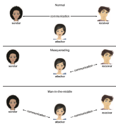

## System and Network Threats

Program threats, by themselves, pose serious security risks. But those risks are compounded by orders ofmagnitudewhen a system is connected to a network. Worldwide connectivity makes the system vulnerable to worldwide attacks.

The more **_open_** an operating system is—the more services it has enabled and the more functions it allows—the more likely it is that a bug is available to exploit it. Increasingly, operating systems strive to be **secure by default**. For example, Solaris 10 moved from a model in which many services (FTP, telnet, and others) were enabled by default when the system was installed to a model in which almost all services are disabled at installation time and must specifically be enabled by system administrators. Such changes reduce the system’s attack surface.

All hackers leave tracks behind them—whether via network traffic pat- terns, unusual packet types, or othermeans. For that reason, hackers frequently launch attacks from **zombie systems**—independent systems or devices that have been compromised by hackers but that continue to serve their own- ers while being used without the owners’ knowledge for nefarious purposes,  

**Figure 16.6** Standard security attacks.1

including denial-of-service attacks and spam relay. Zombiesmake hackers par- ticularly difficult to track because they mask the original source of the attack and the identity of the attacker. This is one ofmany reasons for securing “incon- sequential” systems, not just systems containing “valuable” information or services—lest they be turned into strongholds for hackers.

The widespread use of broadband and WiFi has only exacerbated the difficulty in tracking down attackers: even a simple desktop machine, which can often be easily compromised by malware, can become a valuable machine if used for its bandwidth or network access. Wireless ethernet makes it easy for attackers to launch attacks by joining a public network anonymously or “WarDriving”—locating a private unprotected network to target.

### Attacking Network Traffic

Networks are common and attractive targets, and hackers have many options for mounting network attacks. As shown in Figure 16.6, an attacker can opt to remain passive and intercept network traffic (an attack commonly referred to as **sniffin** ), often obtaining useful information about the types of sessions

conducted between systems or the sessions’ content. Alternatively, an attacker can take a more active role, either masquerading as one of the parties (referred to as **spoofin** ), or becoming a fully activeman-in-the-middle, intercepting and possibly modifying transactions between two peers.

Next, we describe a common type of network attack, the denial-of-service (DoS) attack. Note that it is possible to guard against attacks through such means as encryption and authentication, which are discussed later in the chap- ter. Internet protocols do not, however, support either encryption or authenti- cation by default.

### Denial of Service

As mentioned earlier, denial-of-service attacks are aimed not at gaining infor- mation or stealing resources but rather at disrupting legitimate use of a sys- tem or facility. Most such attacks involve target systems or facilities that the attacker has not penetrated. Launching an attack that prevents legitimate use is frequently easier than breaking into a system or facility.

Denial-of-service attacks are generally network based. They fall into two categories. Attacks in the first category use so many facility resources that, in essence, no useful work can be done. For example, a website click could download a Java applet that proceeds to use all available CPU time or to pop upwindows infinitely. The second category involves disrupting the network of the facility. There have been several successful denial-of-service attacks of this kind against major websites. Such attacks, which can last hours or days, have caused partial or full failure of attempts to use the target facility. The attacks are usually stopped at the network level until the operating systems can be updated to reduce their vulnerability.

Generally, it is impossible to prevent denial-of-service attacks. The attacks use the same mechanisms as normal operation. Even more difficult to prevent and resolve are **Distributed Denial-of-Service** (**DDoS**) attacks. These attacks are launched frommultiple sites at once, toward a common target, typically by zombies. DDoS attacks have become more common and are sometimes asso- ciated with blackmail attempts. A site comes under attack, and the attackers offer to halt the attack in exchange for money.

Sometimes a site does not even know it is under attack. It can be difficult to determine whether a system slowdown is an attack or just a surge in system use. Consider that a successful advertising campaign that greatly increases traffic to a site could be considered a DDoS.

There are other interesting aspects of DoS attacks. For example, if an authentication algorithm locks an account for a period of time after several incorrect attempts to access the account, then an attacker could cause all authentication to be blocked by purposely making incorrect attempts to access all accounts. Similarly, a firewall that automatically blocks certain kinds of traf- fic could be induced to block that traffic when it should not. These examples suggest that programmers and systems managers need to fully understand the algorithms and technologies they are deploying. Finally, computer science classes are notorious sources of accidental system DoS attacks. Consider the first programming exercises in which students learn to create subprocesses or threads. A common bug involves spawning subprocesses infinitely. The system’s free memory and CPU resources don’t stand a chance.  

### Port Scanning

Port scanning is not itself an attack but is a means for a hacker to detect a system’s vulnerabilities to attack. (Security personnel also use port scanning —for example, to detect services that are not needed or are not supposed to be running.) Port scanning typically is automated, involving a tool that attempts to create a TCP/IPconnection or send a UDP packet to a specific port or a range of ports.

Port scanning is often part of a reconnaissance technique known as fin- gerprinting, in which an attacker attempts to deduce the type of operating system in use and its set of services in order to identify known vulnerabilities. Many servers and clients make this easier by disclosing their exact version number as part of network protocol headers (for example, HTTP’s “Server:” and “User-Agent:” headers). Detailed analyses of idiosyncratic behaviors by protocol handlers can also help the attacker figure out what operating system the target is using—a necessary step for successful exploitation.

Network vulnerability scanners are sold as commercial products. There are also tools that perform subsets of the functionality of a full scanner. For example, nmap (from http://www.insecure.org/nmap/) is a very versatile open- source utility for network exploration and security auditing. When pointed at a target, it will determine what services are running, including application names and versions. It can identify the host operating system. It can also provide information about defenses, such as what firewalls are defending the target. It does not exploit known bugs. Other tools, however (such as Metasploit), pick up where the port scanners leave off and provide payload construction facilities that can be used to test for vulnerabilities—or exploit them by creating a specific payload that triggers the bug.

The seminal work on port-scanning techniques can be found in http://phrack.org/issues/49/15.html. Techniques are constantly evolving, as are measures to detect them (which form the basis for network intrusion detection systems, discussed later).
