**_Storage Management_**

Computer systems must provide mass storage for permanently storing files and data. Modern computers implementmass storage as secondary storage, using both hard disks and nonvolatile memory devices.

Secondary storage devices vary in many aspects. Some transfer a character at a time, and some a block of characters. Some can be accessedonly sequentially, and others randomly. Some transfer data syn- chronously, and others asynchronously. Some are dedicated, and some shared. They can be read-only or read–write. And although they vary greatly in speed, they are in many ways the slowest major component of the computer.

Because of all this device variation, the operating system needs to provide a wide range of functionality so that applications can control all aspects of the devices. One key goal of an operating system’s I/O subsystem is to provide the simplest interface possible to the rest of the system. Because devices are a performance bottleneck, another key is to optimize I/O for maximum concurrency.  

# Mass-Storage Structure

In this chapter, we discuss how mass storage—the nonvolatile storage sys- tem of a computer—is structured. The main mass-storage system in modern computers is secondary storage, which is usually provided by hard disk drives (HDD) and nonvolatilememory (NVM) devices. Some systems also have slower, larger, tertiary storage, generally consisting of magnetic tape, optical disks, or even cloud storage.

Because the most common and important storage devices in modern com- puter systems are HDDs and NVM devices, the bulk of this chapter is devoted to discussing these two types of storage. We first describe their physical struc- ture.We then consider scheduling algorithms, which schedule the order of I/Os to maximize performance. Next, we discuss device formatting and manage- ment of boot blocks, damaged blocks, and swap space. Finally, we examine the structure of RAID systems.

There are many types of mass storage, and we use the general term **_non- volatile storage_** (NVS) or talk about storage “drives” when the discussion includes all types. Particular devices, such as HDDs and NVM devices, are specified as appropriate.

**CHAPTER OBJECTIVES**

• Describe the physical structures of various secondary storage devices and the effect of a device’s structure on its uses.

• Explain the performance characteristics of mass-storage devices.

• Evaluate I/O scheduling algorithms.

• Discuss operating-system services provided for mass storage, including RAID.


## NVM Scheduling

The disk-scheduling algorithms just discussed apply to mechanical platter- based storage like HDDs. They focus primarily on minimizing the amount of disk head movement. NVM devices do not contain moving disk heads and commonly use a simple FCFS policy. For example, the Linux **NOOP** scheduler uses an FCFS policy but modifies it to merge adjacent requests. The observed behavior of NVM devices indicates that the time required to service reads is uniform but that, because of the properties of flash memory, write service time is not uniform. Some SSD schedulers have exploited this property and merge only adjacent write requests, servicing all read requests in FCFS order.

Aswe have seen, I/O can occur sequentially or randomly. Sequential access is optimal for mechanical devices like HDD and tape because the data to be read or written is near the read/write head. Random-access I/O, which is measured in **input/output operations per second** (**IOPS**), causesHDDdisk head movement. Naturally, random access I/O is much faster on NVM. An HDD can produce hundreds of IOPS, while an SSD can produce hundreds of thousands of IOPS.

NVM devices offer much less of an advantage for raw sequential through- put, where HDD head seeks are minimized and reading and writing of data to the media are emphasized. In those cases, for reads, performance for the two types of devices can range from equivalent to an order of magnitude advantage for NVM devices.Writing to NVM is slower than reading, decreasing the advantage. Furthermore, while write performance for HDDs is consistent throughout the life of the device, write performance for NVM devices varies depending on how full the device is (recall the need for garbage collection and over-provisioning) and how “worn” it is. An NVM device near its end of life due to many erase cycles generally has much worse performance than a new device.  

One way to improve the lifespan and performance of NVM devices over time is to have the file system inform the device when files are deleted, so that the device can erase the blocks those files were stored on. This approach is discussed further in Section 14.5.6.

Let’s lookmore closely at the impact of garbage collection on performance. Consider an NVM device under random read and write load. Assume that all blocks have beenwritten to, but there is free space available. Garbage collection must occur to reclaim space taken by invalid data. That means that a write might cause a read of one or more pages, a write of the good data in those pages to overprovisioning space, an erase of the all-invalid-data block, and the placement of that block into overprovisioning space. In summary, one write request eventually causes a page write (the data), one or more page reads (by garbage collection), and one or more page writes (of good data from the garbage-collected blocks). The creation of I/O requests not by applications but by the NVM device doing garbage collection and space management is called **write amplificatio** and can greatly impact the write performance of the device. In the worst case, several extra I/Os are triggered with each write request.

## Error Detection and Correction

Error detection and correction are fundamental to many areas of computing, including memory, networking, and storage. **Error detection** determines if a problem has occurred — for example a bit in DRAM spontaneously changed from a 0 to a 1, the contents of a network packet changed during transmission, or a block of data changed between when it was written and when it was read. By detecting the issue, the system can halt an operation before the error is propagated, report the error to the user or administrator, or warn of a device that might be starting to fail or has already failed.

Memory systems have long detected certain errors by using parity bits. In this scenario, each byte in a memory system has a parity bit associated with it that records whether the number of bits in the byte set to 1 is even (parity = 0) or odd (parity = 1). If one of the bits in the byte is damaged (either a 1 becomes a 0, or a 0 becomes a 1), the parity of the byte changes and thus does not match the stored parity. Similarly, if the stored parity bit is damaged, it does not match the computed parity. Thus, all single-bit errors are detected by the memory system. A double-bit-error might go undetected, however. Note that parity is easily calculated by performing an XOR (for “eXclusive OR”) of the bits. Also note that for every byte of memory, we now need an extra bit of memory to store the parity.

Parity is one form of **checksums**, which use modular arithmetic to compute, store, and compare values on fixed-length words. Another error-detection method, common in networking, is a **cyclic redundancy check** (**CRCs**), which uses a hash function to detect multiple-bit errors (see http://www.mathpages.com/home/kmath458/kmath458.htm).

An **error-correction code** (**ECC**) not only detects the problem, but also corrects it. The correction is done by using algorithms and extra amounts of storage. The codes vary based on how much extra storage they need and how many errors they can correct. For example, disks drives use per-sector ECC and flash drives per-page ECC. When the controller writes a sector/page of data during normal I/O, the ECC is writtenwith a value calculated from all the bytes in the data beingwritten.When the sector/page is read, the ECC is recalculated and compared with the stored value. If the stored and calculated numbers are different, this mismatch indicates that the data have become corrupted and that the storage media may be bad (Section 11.5.3). The ECC is error correcting because it contains enough information, if only a few bits of data have been corrupted, to enable the controller to identify which bits have changed and calculate what their correct values should be. It then reports a recoverable **soft error**. If too many changes occur, and the ECC cannot correct the error, a non- correctable **hard error** is signaled. The controller automatically does the ECC processing whenever a sector or page is read or written.

Error detection and correction are frequently differentiators between con- sumer products and enterprise products. ECC is used in some systems for DRAM error correction and data path protection, for example.

## Storage Device Management

The operating system is responsible for several other aspects of storage device management, too. Here, we discuss drive initialization, booting from a drive, and bad-block recovery.

### Drive Formatting, Partitions, and Volumes

Anew storage device is a blank slate: it is just a platter of a magnetic recording material or a set of uninitialized semiconductor storage cells. Before a storage device can store data, it must be divided into sectors that the controller can read andwrite. NVMpagesmust be initialized and the FTL created. This process is called **low-level formatting**, or **physical formatting**. Low-level formatting fills the device with a special data structure for each storage location. The data structure for a sector or page typically consists of a header, a data area, and a trailer. The header and trailer contain information used by the controller, such as a sector/page number and an error detection or correction code.

Most drives are low-level-formatted at the factory as a part of the manu- facturing process. This formatting enables the manufacturer to test the device and to initialize the mapping from logical block numbers to defect-free sectors or pages on themedia. It is usually possible to choose among a few sector sizes, such as 512 bytes and 4KB. Formatting a disk with a larger sector size means that fewer sectors can fit on each track, but it also means that fewer headers and trailers are written on each track and more space is available for user data. Some operating systems can handle only one specific sector size.

Before it can use a drive to hold files, the operating system still needs to record its own data structures on the device. It does so in three steps.

The first step is to **partition** the device into one or more groups of blocks or pages. The operating system can treat each partition as though it were a separate device. For instance, one partition can hold a file system containing a copy of the operating system’s executable code, another the swap space, and another a file system containing the user files. Some operating systems and file systems perform the partitioning automatically when an entire device is to be managed by the file system. The partition information is written in a fixed format at a fixed location on the storage device. In Linux, the fdisk command is used to manage partitions on storage devices. The device, when recognized by the operating system, has its partition information read, and the operating system then creates device entries for the partitions (in /dev in Linux). From there, a configuration file, such as /etc/fstab, tells the operating system to mount each partition containing a file system at a specified location and to use mount options such as read-only. **Mounting** a file system is making the file system available for use by the system and its users.

The second step is volume creation and management. Sometimes, this step is implicit, as when a file system is placed directly within a partition. That **volume** is then ready to be mounted and used. At other times, volume creation andmanagement is explicit—for examplewhenmultiple partitions or devices will be used together as a RAID set (see Section 11.8) with one or more file systems spread across the devices. The Linux volume manager lvm2 can provide these features, as can commercial third-party tools for Linux and other operating systems. ZFS provides both volume management and a file system integrated into one set of commands and features. (Note that “volume” can also mean any mountable file system, even a file containing a file system such as a CD image.)

The third step is **logical formatting**, or creation of a file system. In this step, the operating system stores the initial file-system data structures onto the device. These data structuresmay includemaps of free and allocated space and an initial empty directory.

The partition information also indicates if a partition contains a bootable file system (containing the operating system). The partition labeled for boot is used to establish the root of the file system. Once it is mounted, device links for all other devices and their partitions can be created. Generally, a computer’s “file system” consists of all mounted volumes. OnWindows, these are separately named via a letter (C:, D:, E:). On other systems, such as Linux, at boot time the boot file system is mounted, and other file systems can be mountedwithin that tree structure (as discussed in Section 13.3). OnWindows, the file system interfacemakes it clear when a given device is being used, while in Linux a single file access might traverse many devices before the requested file in the requested file system (within a volume) is accessed. Figure 11.9 shows the Windows 7 Disk Management tool displaying three volumes (C:, E:, and F:). Note that E: and F: are each in a partition of the “Disk 1” device and that there is unallocated space on that device for more partitions (possibly containing file systems).

To increase efficiency, most file systems group blocks together into larger chunks, frequently called **clusters**. Device I/O is done via blocks, but file system I/O is done via clusters, effectively assuring that I/O hasmore sequential-access and fewer random-access characteristics. File systems try to group file contents near its metadata as well, reducing HDD head seeks when operating on a file, for example.

Some operating systems give special programs the ability to use a partition as a large sequential array of logical blocks, without any file-system data structures. This array is sometimes called the **raw disk**, and I/O to this array is termed **_raw I/O._** It can be used for swap space (see Section 11.6.2), for example, and some database systems prefer raw I/O because it enables them to control  


**Figure 11.9** Windows 7 Disk Management tool showing devices, partitions, volumes, and file systems.

the exact location where each database record is stored. Raw I/O bypasses all the file-system services, such as the buffer cache, file locking, prefetching, space allocation, file names, and directories. We can make certain applications more efficient by allowing them to implement their own special-purpose storage services on a raw partition, but most applications use a provided file system rather than managing data themselves. Note that Linux generally does not support raw I/O but can achieve similar access by using the DIRECT flag to the open() system call.

### Boot Block

For a computer to start running—for instance, when it is powered up or rebooted—it must have an initial program to run. This initial **bootstrap** loader tends to be simple. For most computers, the bootstrap is stored in NVM flash memory firmware on the system motherboard and mapped to a known mem- ory location. It can be updated by product manufacturers as needed, but also can be written to by viruses, infecting the system. It initializes all aspects of the system, from CPU registers to device controllers and the contents of main memory.

This tiny bootstrap loader program is also smart enough to bring in a full bootstrap program from secondary storage. The full bootstrap program is stored in the “boot blocks” at a fixed location on the device. The default Linux bootstrap loader is grub2 (https://www.gnu.org/software/grub/manual/ grub.html/). A device that has a boot partition is called a **boot disk** or **system disk**.

The code in the bootstrap NVM instructs the storage controller to read the boot blocks into memory (no device drivers are loaded at this point) and then starts executing that code. The full bootstrap program is more sophisticated than the bootstrap loader: it is able to load the entire operating system from a non-fixed location on the device and to start the operating system running.

Let’s consider as an example the boot process in Windows. First, note that Windows allows a drive to be divided into partitions, and one partition— identified as the **boot partition**—contains the operating system and device drivers. The Windows system places its boot code in the first logical block on the hard disk or first page of the NVM device, which it terms the **master boot**  

**Figure 11.10** Booting from a storage device in Windows.

**record**, or **MBR**. Booting begins by running code that is resident in the system’s firmware. This code directs the system to read the boot code from the MBR, understanding just enough about the storage controller and storage device to load a sector from it. In addition to containing boot code, the MBR contains a table listing the partitions for the drive and a flag indicating which partition the system is to be booted from, as illustrated in Figure 11.10. Once the system identifies the boot partition, it reads the first sector/page from that partition (called the **boot sector**), which directs it to the kernel. It then continues with the remainder of the boot process, which includes loading the various subsystems and system services.

### Bad Blocks

Because disks have moving parts and small tolerances (recall that the disk head flies just above the disk surface), they are prone to failure. Sometimes the failure is complete; in this case, the disk needs to be replaced and its contents restored from backup media to the new disk. More frequently, one or more sectors become defective. Most disks even come from the factory with **bad blocks**. Depending on the disk and controller in use, these blocks are handled in a variety of ways.

On older disks, such as some disks with IDE controllers, bad blocks are handled manually. One strategy is to scan the disk to find bad blocks while the disk is being formatted. Any bad blocks that are discovered are flagged as unusable so that the file system does not allocate them. If blocks go bad during normal operation, a special program (such as the Linux badblocks command) must be runmanually to search for the bad blocks and to lock them away. Data that resided on the bad blocks usually are lost.

More sophisticated disks are smarter about bad-block recovery. The con- troller maintains a list of bad blocks on the disk. The list is initialized during the low-level formatting at the factory and is updated over the life of the disk. Low-level formatting also sets aside spare sectors not visible to the operating system. The controller can be told to replace each bad sector logically with one of the spare sectors. This scheme is known as **sector sparing** or **forwarding**.

A typical bad-sector transaction might be as follows:

• The operating system tries to read logical block 87.  

• The controller calculates the ECC and finds that the sector is bad. It reports this finding to the operating system as an I/O error.

• The device controller replaces the bad sector with a spare.

• After that, whenever the system requests logical block 87, the request is translated into the replacement sector’s address by the controller.

Note that such a redirection by the controller could invalidate any opti- mization by the operating system’s disk-scheduling algorithm! For this reason, most disks are formatted to provide a few spare sectors in each cylinder and a spare cylinder as well. When a bad block is remapped, the controller uses a spare sector from the same cylinder, if possible.

As an alternative to sector sparing, some controllers can be instructed to replace a bad block by **sector slipping**. Here is an example: Suppose that logical block 17 becomes defective and the first available spare follows sector 202. Sector slipping then remaps all the sectors from 17 to 202, moving them all down one spot. That is, sector 202 is copied into the spare, then sector 201 into 202, then 200 into 201, and so on, until sector 18 is copied into sector 19. Slipping the sectors in this way frees up the space of sector 18 so that sector 17 can be mapped to it.

Recoverable soft errors may trigger a device activity in which a copy of the block data is made and the block is spared or slipped. An unrecoverable **hard error**, however, results in lost data. Whatever file was using that block must be repaired (for instance, by restoration from a backup tape), and that requires manual intervention.

NVM devices also have bits, bytes, and even pages that either are nonfunc- tional at manufacturing time or go bad over time. Management of those faulty areas is simpler than for HDDs because there is no seek time performance loss to be avoided. Either multiple pages can be set aside and used as replacement locations, or space from the over-provisioning area can be used (decreasing the usable capacity of the over-provisioning area). Either way, the controller maintains a table of bad pages and never sets those pages as available to write to, so they are never accessed.

## Swap-Space Management

Swappingwas first presented in Section 9.5, wherewe discussedmoving entire processes between secondary storage andmainmemory. Swapping in that set- ting occurs when the amount of physical memory reaches a critically low point andprocesses aremoved frommemory to swap space to free availablememory. In practice, very few modern operating systems implement swapping in this fashion. Rather, systems now combine swapping with virtual memory tech- niques (Chapter 10) and swap pages, not necessarily entire processes. In fact, some systems now use the terms “swapping” and “paging” interchangeably, reflecting the merging of these two concepts.

**Swap-space management** is another low-level task of the operating sys- tem. Virtual memory uses secondary storage space as an extension of main memory. Since drive access is much slower than memory access, using swap space significantly decreases systemperformance. Themain goal for the design and implementation of swap space is to provide the best throughput for the vir- tual memory system. In this section, we discuss how swap space is used, where swap space is located on storage devices, and how swap space is managed.

### Swap-Space Use

Swap space is used in various ways by different operating systems, depending on the memory-management algorithms in use. For instance, systems that implement swapping may use swap space to hold an entire process image, including the code and data segments. Paging systemsmay simply store pages that have been pushed out of mainmemory. The amount of swap space needed on a system can therefore vary froma fewmegabytes of disk space to gigabytes, depending on the amount of physical memory, the amount of virtual memory it is backing, and the way in which the virtual memory is used.

Note that it may be safer to overestimate than to underestimate the amount of swap space required, because if a system runs out of swap space it may be forced to abort processes or may crash entirely. Overestimation wastes secondary storage space that could otherwise be used for files, but it does no other harm. Some systems recommend the amount to be set aside for swap space. Solaris, for example, suggests setting swap space equal to the amount by which virtual memory exceeds pageable physical memory. In the past, Linux has suggested setting swap space to double the amount of physical memory. Today, the paging algorithms have changed, andmost Linux systems use considerably less swap space.

Some operating systems—including Linux—allow the use of multiple swap spaces, including both files and dedicated swap partitions. These swap spaces are usually placed on separate storage devices so that the load placed on the I/O system by paging and swapping can be spread over the system’s I/O bandwidth.

### Swap-Space Location

Aswap space can reside in one of two places: it can be carved out of the normal file system, or it can be in a separate partition. If the swap space is simply a large file within the file system, normal file-system routines can be used to create it, name it, and allocate its space.

Alternatively, swap space can be created in a separate **raw partition**. No file system or directory structure is placed in this space. Rather, a separate swap-space storage manager is used to allocate and deallocate the blocks from the raw partition. This manager uses algorithms optimized for speed rather than for storage efficiency, because swap space is accessed much more frequently than file systems, when it is used (recall that swap space is used for swapping and paging). Internal fragmentation may increase, but this trade- off is acceptable because the life of data in the swap space generally is much shorter than that of files in the file system. Since swap space is reinitialized at boot time, any fragmentation is short-lived. The raw-partition approach creates a fixed amount of swap space during disk partitioning. Adding more swap space requires either repartitioning the device (which involves moving the other file-system partitions or destroying them and restoring them from backup) or adding another swap space elsewhere.

Some operating systems are flexible and can swap both in raw partitions and in file-system space. Linux is an example: the policy and implementa- tion are separate, allowing the machine’s administrator to decide which type of swapping to use. The trade-off is between the convenience of allocation and management in the file system and the performance of swapping in raw partitions.

### Swap-Space Management: An Example

We can illustrate how swap space is used by following the evolution of swap- ping and paging in various UNIX systems. The traditional UNIX kernel started with an implementation of swapping that copied entire processes between contiguous disk regions and memory. UNIX later evolved to a combination of swapping and paging as paging hardware became available.

In Solaris 1 (SunOS), the designers changed standard UNIX methods to improve efficiency and reflect technological developments. When a process executes, text-segment pages containing code are brought in from the file system, accessed in main memory, and thrown away if selected for pageout. It is more efficient to reread a page from the file system than to write it to swap space and then reread it from there. Swap space is only used as a backing store for pages of **anonymous**memory (memory not backed by any file), which includes memory allocated for the stack, heap, and uninitialized data of a process.

More changes were made in later versions of Solaris. The biggest change is that Solaris now allocates swap space only when a page is forced out of physical memory, rather than when the virtual memory page is first created. This scheme gives better performance onmodern computers, which havemore physical memory than older systems and tend to page less.

Linux is similar to Solaris in that swap space is now used only for anony- mous memory. Linux allows one or more swap areas to be established. A swap area may be in either a swap file on a regular file system or a dedicated swap partition. Each swap area consists of a series of 4-KB **page slots**, which are used to hold swapped pages. Associated with each swap area is a **swap map**—an array of integer counters, each corresponding to a page slot in the swap area. If the value of a counter is 0, the corresponding page slot is available. Values greater than 0 indicate that the page slot is occupied by a swapped page. The value of the counter indicates the number of mappings to the swapped page. For example, a value of 3 indicates that the swapped page is mapped to three different processes (which can occur if the swapped page is storing a region of memory shared by three processes). The data structures for swapping on Linux systems are shown in Figure 11.11.

## Storage Attachment

Computers access secondary storage in three ways: via host-attached storage, network-attached storage, and cloud storage.  


**Figure 11.11** The data structures for swapping on Linux systems.

### Host-Attached Storage

**Host-attached storage** is storage accessed through local I/O ports. These ports use several technologies, the most common being SATA, as mentioned earlier. A typical system has one or a few SATA ports.

To allow a system to gain access to more storage, either an individual storage device, a device in a chassis, or multiple drives in a chassis can be connected via USB FireWire or Thunderbolt ports and cables.

High-end workstations and servers generally need more storage or need to share storage, so use more sophisticated I/O architectures, such as **fibr channel** (**FC**), a high-speed serial architecture that can operate over optical fiber or over a four-conductor copper cable. Because of the large address space and the switched nature of the communication, multiple hosts and storage devices can attach to the fabric, allowing great flexibility in I/O communication.

A wide variety of storage devices are suitable for use as host-attached storage. Among these are HDDs; NVM devices; CD, DVD, Blu-ray, and tape drives; and storage-area networks (**SANs**) (discussed in Section 11.7.4). The I/O commands that initiate data transfers to a host-attached storage device are reads andwrites of logical data blocks directed to specifically identified storage units (such as bus ID or target logical unit).

### Network-Attached Storage

**Network-attached storage** (**NAS**) (Figure 11.12) provides access to storage across a network.AnNAS device can be either a special-purpose storage system or a general computer system that provides its storage to other hosts across the network. Clients access network-attached storage via a remote-procedure- call interface such as NFS for UNIX and Linux systems or CIFS for Windows machines. The remote procedure calls (RPCs) are carried via TCP or UDP over an IP network—usually the same local-area network (LAN) that carries all data traffic to the clients. The network-attached storage unit is usually implemented as a storage array with software that implements the RPC interface.

CIFS and NFS provide various locking features, allowing the sharing of files betweenhosts accessing aNASwith those protocols. For example, a user logged in tomultipleNAS clients can access her homedirectory fromall of those clients, simultaneously.  


**Figure 11.12** Network-attached storage.

Network-attached storage provides a convenient way for all the computers on a LAN to share a pool of storage with the same ease of naming and access enjoyed with local host-attached storage. However, it tends to be less efficient and have lower performance than some direct-attached storage options.

**iSCSI** is the latest network-attached storage protocol. In essence, it uses the IP network protocol to carry the SCSI protocol. Thus, networks—rather than SCSI cables—can be used as the interconnects between hosts and their storage. As a result, hosts can treat their storage as if it were directly attached, even if the storage is distant from the host. Whereas NFS and CIFS present a file system and send parts of files across the network, iSCSI sends logical blocks across the network and leaves it to the client to use the blocks directly or create a file system with them.

### Cloud Storage

Section 1.10.5 discussed cloud computing. One offering from cloud providers is **cloud storage**. Similar to network-attached storage, cloud storage provides access to storage across a network. Unlike NAS, the storage is accessed over the Internet or another WAN to a remote data center that provides storage for a fee (or even for free).

Another difference between NAS and cloud storage is how the storage is accessed and presented to users. NAS is accessed as just another file system if the CIFS orNFS protocols are used, or as a rawblock device if the iSCSI protocol is used.Most operating systems have these protocols integrated and present NAS storage in the sameway as other storage. In contrast, cloud storage is API based, and programs use the APIs to access the storage. Amazon S3 is a leading cloud storage offering. Dropbox is an example of a company that provides apps to connect to the cloud storage that it provides. Other examples includeMicrosoft OneDrive and Apple iCloud.

One reason that APIs are used instead of existing protocols is the latency and failure scenarios of a WAN. NAS protocols were designed for use in LANs, which have lower latency thanWANs and aremuch less likely to lose connectiv- ity between the storage user and the storage device. If a LAN connection fails, a system using NFS or CIFS might hang until it recovers. With cloud storage, failures like that are more likely, so an application simply pauses access until connectivity is restored.  

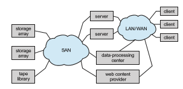
**Figure 11.13** Storage-area network.

### Storage-Area Networks and Storage Arrays

One drawback of network-attached storage systems is that the storage I/O operations consume bandwidth on the data network, thereby increasing the latency of network communication. This problem can be particularly acute in large client–server installations—the communication between servers and clients competes for bandwidth with the communication among servers and storage devices.

A**storage-area network** (**SAN**) is a private network (using storage protocols rather than networking protocols) connecting servers and storage units, as shown in Figure 11.13. The power of a SAN lies in its flexibility. Multiple hosts and multiple storage arrays can attach to the same SAN, and storage can be dynamically allocated to hosts. The storage arrays can be RAID protected or unprotected drives (**Just a Bunch of Disks** (**JBOD**)). A SAN switch allows or prohibits access between the hosts and the storage. As one example, if a host is running low on disk space, the SAN can be configured to allocate more storage to that host. SANs make it possible for clusters of servers to share the same storage and for storage arrays to include multiple direct host connections. SANs typically have more ports—and cost more—than storage arrays. SAN connectivity is over short distances and typically has no routing, so a NAS can have many more connected hosts than a SAN.

A storage array is a purpose-built device (see Figure 11.14) that includes SANports, networkports, or both. It also contains drives to store data and a con- troller (or redundant set of controllers) to manage the storage and allow access to the storage across the networks. The controllers are composed of CPUs, memory, and software that implement the features of the array, which can include network protocols, user interfaces, RAID protection, snapshots, repli- cation, compression, deduplication, and encryption. Some of those functions are discussed in Chapter 14.

Some storage arrays include SSDs. An array may contain only SSDs, result- ing in maximum performance but smaller capacity, or may include a mix of SSDs and HDDs, with the array software (or the administrator) selecting the best medium for a given use or using the SSDs as a cache and HDDs as bulk storage.  


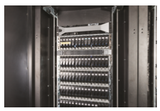
**Figure 11.14** A storage array.

FC is the most common SAN interconnect, although the simplicity of iSCSI is increasing its use. Another SAN interconnect is **InfiniBan** (**IB**)—a special- purpose bus architecture that provides hardware and software support for high-speed interconnection networks for servers and storage units.

## RAID Structure

Storage devices have continued to get smaller and cheaper, so it is now eco- nomically feasible to attach many drives to a computer system. Having a large number of drives in a system presents opportunities for improving the rate at which data can be read or written, if the drives are operated in paral- lel. Furthermore, this setup offers the potential for improving the reliability of data storage, because redundant information can be stored on multiple drives. Thus, failure of one drive does not lead to loss of data. A variety of disk-organization techniques, collectively called **redundant arrays of inde- pendent disks** (**RAIDs**), are commonly used to address the performance and reliability issues.

In the past, RAIDs composed of small, cheap disks were viewed as a cost- effective alternative to large, expensive disks. Today, RAIDs are used for their higher reliability and higher data-transfer rate rather than for economic rea- sons. Hence, the **_I_** in **_RAID,_**which once stood for “inexpensive,” now stands for “independent.”

### Improvement of Reliability via Redundancy

Let’s first consider the reliability of a RAID of HDDs. The chance that some disk out of a set of _N_ disks will fail is much greater than the chance that a specific single disk will fail. Suppose that the **mean time between failures** (**MTBF**) of a single disk is 100,000 hours. Then the MTBF of some disk in an array of 100  


**_STRUCTURING RAID_**

RAID storage can be structured in a variety of ways. For example, a system can have drives directly attached to its buses. In this case, the operating system or system software can implement RAID functionality. Alternatively, an intelligent host controller can control multiple attached devices and can implement RAID on those devices in hardware. Finally, a storage array can be used. A storage array, as just discussed, is a standalone unit with its own controller, cache, anddrives. It is attached to the host via one ormore standard controllers (for example, FC). This common setup allows an operating system or software without RAID functionality to have RAID-protected storage.

disks will be 100,000/100 = 1,000 hours, or 41_._66 days, which is not long at all! If we store only one copy of the data, then each disk failure will result in loss of a significant amount of data—and such a high rate of data loss is unacceptable.

The solution to the problem of reliability is to introduce **redundancy**; we store extra information that is not normally needed but can be used in the event of disk failure to rebuild the lost information. Thus, even if a disk fails, data are not lost. RAID can be applied to NVM devices as well, although NVM devices have no moving parts and therefore are less likely to fail than HDDs.

The simplest (but most expensive) approach to introducing redundancy is to duplicate every drive. This technique is called **mirroring**. With mirroring, a logical disk consists of two physical drives, and every write is carried out on both drives. The result is called a **mirrored volume**. If one of the drives in the volume fails, the data can be read from the other. Data will be lost only if the second drive fails before the first failed drive is replaced.

The MTBF of a mirrored volume—where failure is the loss of data— depends on two factors. One is the MTBF of the individual drives. The other is the **mean time to repair**, which is the time it takes (on average) to replace a failed drive and to restore the data on it. Suppose that the failures of the two drives are independent; that is, the failure of one is not connected to the failure of the other. Then, if the MTBF of a single drive is 100,000 hours and the mean time to repair is 10 hours, the**mean time to data loss** of amirrored drive system is 100, 0002∕(2 ∗ 10) = 500 ∗ 106 hours, or 57,000 years!

You should be aware that we cannot really assume that drive failures will be independent. Power failures and natural disasters, such as earthquakes, fires, and floods, may result in damage to both drives at the same time. Also, manufacturing defects in a batch of drives can cause correlated failures. As drives age, the probability of failure grows, increasing the chance that a second drive will fail while the first is being repaired. In spite of all these considera- tions, however, mirrored-drive systems offer much higher reliability than do single-drive systems.

Power failures are a particular source of concern, since they occur far more frequently than do natural disasters. Even with mirroring of drives, if writes are in progress to the same block in both drives, and power fails before both blocks are fully written, the two blocks can be in an inconsistent state. One solution to this problem is to write one copy first, then the next. Another is to add a solid-state nonvolatile cache to the RAID array. This write-back cache is protected from data loss during power failures, so the write can be considered complete at that point, assuming the cache has some kind of error protection and correction, such as ECC or mirroring.

### Improvement in Performance via Parallelism

Now let’s consider how parallel access to multiple drives improves perfor- mance. With mirroring, the rate at which read requests can be handled is doubled, since read requests can be sent to either drive (as long as both in a pair are functional, as is almost always the case). The transfer rate of each read is the same as in a single-drive system, but the number of reads per unit time has doubled.

With multiple drives, we can improve the transfer rate as well (or instead) by striping data across the drives. In its simplest form, **data striping** consists of splitting the bits of each byte across multiple drives; such striping is called **bit-level striping**. For example, if we have an array of eight drives, we write bit _i_ of each byte to drive _i._ The array of eight drives can be treated as a single drive with sectors that are eight times the normal size and, more important, have eight times the access rate. Every drive participates in every access (read or write); so the number of accesses that can be processed per second is about the same as on a single drive, but each access can read eight times asmany data in the same time as on a single drive.

Bit-level striping can be generalized to include a number of drives that either is a multiple of 8 or divides 8. For example, if we use an array of four drives, bits _i_ and 4+ _i_ of each byte go to drive _i._ Further, striping need not occur at the bit level. In **block-level striping**, for instance, blocks of a file are striped across multiple drives; with _n_ drives, block _i_ of a file goes to drive (_i_mod _n_)+1. Other levels of striping, such as bytes of a sector or sectors of a block, also are possible. Block-level striping is the only commonly available striping.

Parallelism in a storage system, as achieved through striping, has twomain goals:

**1\.** Increase the throughput of multiple small accesses (that is, page accesses) by load balancing.

**2\.** Reduce the response time of large accesses.

### RAID Levels

Mirroring provides high reliability, but it is expensive. Striping provides high data-transfer rates, but it does not improve reliability. Numerous schemes to provide redundancy at lower cost by using disk striping combined with “parity” bits (which we describe shortly) have been proposed. These schemes have different cost–performance trade-offs and are classified according to levels called **RAID levels**. We describe only the most common levels here; Figure 11.15 shows them pictorially (in the figure, _P_ indicates error-correcting bits and _C_ indicates a second copy of the data). In all cases depicted in the figure, four drives’ worth of data are stored, and the extra drives are used to store redundant information for failure recovery.  


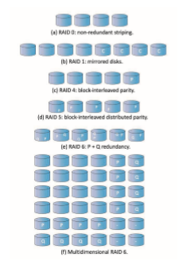
**Figure 11.15** RAID levels.

• **RAID level 0**. RAID level 0 refers to drive arrays with striping at the level of blocks but without any redundancy (such as mirroring or parity bits), as shown in Figure 11.15(a).

• **RAID level 1**. RAID level 1 refers to drive mirroring. Figure 11.15(b) shows a mirrored organization.

• **RAID level 4**. RAID level 4 is also known as memory-style error-correcting- code (ECC) organization. ECC is also used in RAID 5 and 6.

The idea of ECC can be used directly in storage arrays via striping of blocks across drives. For example, the first data block of a sequence of writes can be stored in drive 1, the second block in drive 2, and so on until the _N_th block is stored in drive _N_; the error-correction calculation result of those blocks is stored on drive _N_ \+ 1. This scheme is shown in Figure 11.15(c), where the drive labeled _P_ stores the error-correction block. If one of the drives fails, the error-correction code recalculation detects that and  prevents the data from being passed to the requesting process, throwing an error.

RAID 4 can actually correct errors, even though there is only one ECC block. It takes into account the fact that, unlike memory systems, drive controllers can detect whether a sector has been read correctly, so a single parity block can be used for error correction and detection. The idea is as follows: If one of the sectors is damaged, we know exactly which sector it is.We disregard the data in that sector and use the parity data to recalculate the bad data. For every bit in the block, we can determine if it is a 1 or a 0 by computing the parity of the corresponding bits from sectors in the other drives. If the parity of the remaining bits is equal to the stored parity, the missing bit is 0; otherwise, it is 1.

A block read accesses only one drive, allowing other requests to be processed by the other drives. The transfer rates for large reads are high, since all the disks can be read in parallel. Large writes also have high transfer rates, since the data and parity can be written in parallel. Small independentwrites cannot be performed in parallel. An operating-system write of data smaller than a block requires that the block be read, modified with the new data, and written back. The parity block has to be updated as well. This is known as the **read-modify-write cycle**. Thus, a single write requires four drive accesses: two to read the two old blocks and two to write the two new blocks. WAFL (which we cover in Chapter 14) uses RAID level 4 because this RAID level allows drives to be added to a RAID set seamlessly. If the added drives are initializedwith blocks containing only zeros, then the parity value does not change, and the RAID set is still correct.

RAID level 4 has two advantages over level 1 while providing equal data protection. First, the storage overhead is reduced because only one parity drive is needed for several regular drives, whereas one mirror drive is needed for every drive in level 1. Second, since reads and writes of a series of blocks are spread out over multiple drives with _N_\-way striping of data, the transfer rate for reading or writing a set of blocks is _N_ times as fast as with level 1.

A performance problem with RAID 4—and with all parity-based RAID levels—is the expense of computing and writing the XOR parity. This overhead can result in slower writes than with non-parity RAID arrays. Modern general-purpose CPUs are very fast compared with drive I/O, however, so the performance hit can be minimal. Also, many RAID storage arrays or host bus-adapters include a hardware controller with dedicated parity hardware. This controller offloads the parity computation from the CPU to the array. The array has an NVRAM cache as well, to store the blocks while the parity is computed and to buffer the writes from the controller to the drives. Such buffering can avoid most read-modify- write cycles by gathering data to be written into a full stripe and writing to all drives in the stripe concurrently. This combination of hardware acceleration and buffering can make parity RAID almost as fast as non- parity RAID, frequently outperforming a non-caching non-parity RAID.

• **RAID level 5**. RAID level 5, or block-interleaved distributed parity, differs from level 4 in that it spreads data and parity among all_N_+1 drives, rather than storing data in _N_ drives and parity in one drive. For each set of _N_ blocks, one of the drives stores the parity and the others store data. For example, with an array of five drives, the parity for the _n_th block is stored in drive (_n_mod 5) + 1. The _n_th blocks of the other four drives store actual data for that block. This setup is shown in Figure 11.15(d), where the _P_s are distributed across all the drives. A parity block cannot store parity for blocks in the same drive, because a drive failure would result in loss of data as well as of parity, and hence the loss would not be recoverable. By spreading the parity across all the drives in the set, RAID 5 avoids potential overuse of a single parity drive, which can occur with RAID 4. RAID 5 is the most common parity RAID.

• **RAID level 6**. RAID level 6, also called the **P + Q redundancy scheme**, is much like RAID level 5 but stores extra redundant information to guard against multiple drive failures. XOR parity cannot be used on both parity blocks because theywould be identical andwould not providemore recov- ery information. Instead of parity, error-correcting codes such as **Galois fiel math** are used to calculate Q. In the scheme shown in Figure 11.15(e), 2 blocks of redundant data are stored for every 4 blocks of data—com- paredwith 1 parity block in level 5—and the system can tolerate two drive failures.

• **Multidimensional RAID level 6**. Some sophisticated storage arrays amplify RAID level 6. Consider an array containing hundreds of drives. Putting those drives in a RAID level 6 stripe would result in many data drives and only two logical parity drives. Multidimensional RAID level 6 logically arranges drives into rows and columns (two ormore dimensional arrays) and implements RAID level 6 both horizontally along the rows and vertically down the columns. The system can recover from any failure —or, indeed, multiple failures—by using parity blocks in any of these locations. This RAID level is shown in Figure 11.15(f). For simplicity, the figure shows the RAID parity on dedicated drives, but in reality the RAID blocks are scattered throughout the rows and columns.

• **RAID levels 0 + 1 and 1 + 0**. RAID level 0 + 1 refers to a combination of RAID levels 0 and 1. RAID 0 provides the performance, while RAID 1 provides the reliability. Generally, this level provides better performance than RAID 5. It is common in environments where both performance and reliability are important. Unfortunately, like RAID 1, it doubles the number of drives needed for storage, so it is also relatively expensive. In RAID 0 + 1, a set of drives are striped, and then the stripe is mirrored to another, equivalent stripe.

Another RAID variation is RAID level 1 + 0, in which drives are mirrored in pairs and then the resulting mirrored pairs are striped. This scheme has some theoretical advantages over RAID 0 + 1. For example, if a single drive fails in RAID 0 + 1, an entire stripe is inaccessible, leaving only the other stripe. With a failure in RAID 1 + 0, a single drive is unavailable, but the drive that mirrors it is still available, as are all the rest of the drives (Figure 11.16).  

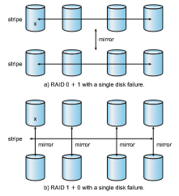
**Figure 11.16** RAID 0 + 1 and 1 + 0 with a single disk failure.

Numerous variations have been proposed to the basic RAID schemes described here. As a result, some confusion may exist about the exact definitions of the different RAID levels.

The implementation of RAID is another area of variation. Consider the following layers at which RAID can be implemented.

• Volume-management software can implement RAIDwithin the kernel or at the system software layer. In this case, the storage hardware can provide minimal features and still be part of a full RAID solution.

• RAID can be implemented in the host bus-adapter (HBA) hardware. Only the drives directly connected to the HBA can be part of a given RAID set. This solution is low in cost but not very flexible.

• RAID can be implemented in the hardware of the storage array. The storage array can create RAID sets of various levels and can even slice these sets into smaller volumes, which are then presented to the operating system. The operating system need only implement the file system on each of the volumes. Arrays can have multiple connections available or can be part of a SAN, allowing multiple hosts to take advantage of the array’s features.

• RAID can be implemented in the SAN interconnect layer by drive virtualiza- tion devices. In this case, a device sits between the hosts and the storage. It accepts commands from the servers and manages access to the storage. It could provide mirroring, for example, by writing each block to two separate storage devices.

Other features, such as snapshots and replication, can be implemented at each of these levels as well. A **snapshot** is a view of the file system before the last update took place. (Snapshots are coveredmore fully inChapter 14.)**Repli- cation** involves the automatic duplication of writes between separate sites for redundancy and disaster recovery. Replication can be synchronous or asyn- chronous. In synchronous replication, each block must be written locally and remotely before the write is considered complete, whereas in asynchronous replication, the writes are grouped together and written periodically. Asyn- chronous replication can result in data loss if the primary site fails, but it is faster and has no distance limitations. Increasingly, replication is also used within a data center or even within a host. As an alternative to RAID protec- tion, replication protects against data loss and also increases read performance (by allowing reads from each of the replica copies). It does of course use more storage than most types of RAID.

The implementation of these features differs depending on the layer at which RAID is implemented. For example, if RAID is implemented in software, then each host may need to carry out and manage its own replication. If replication is implemented in the storage array or in the SAN interconnect, however, then whatever the host operating system or its features, the host’s data can be replicated.

One other aspect of most RAID implementations is a hot spare drive or drives. A **hot spare** is not used for data but is configured to be used as a replacement in case of drive failure. For instance, a hot spare can be used to rebuild a mirrored pair should one of the drives in the pair fail. In this way, the RAID level can be reestablished automatically, without waiting for the failed drive to be replaced. Allocating more than one hot spare allows more than one failure to be repaired without human intervention.

### Selecting a RAID Level

Given the many choices they have, how do system designers choose a RAID level? One consideration is rebuild performance. If a drive fails, the time needed to rebuild its data can be significant. This may be an important factor if a continuous supply of data is required, as it is in high-performance or interactive database systems. Furthermore, rebuild performance influences the mean time between failures.

Rebuild performance varies with the RAID level used. Rebuilding is easiest for RAID level 1, since data can be copied from another drive. For the other levels, we need to access all the other drives in the array to rebuild data in a failed drive. Rebuild times can be hours for RAID level 5 rebuilds of large drive sets.

RAID level 0 is used in high-performance applications where data loss is not critical. For example, in scientific computing where a data set is loaded and explored, RAID level 0 works well because any drive failures would just require a repair and reloading of the data from its source. RAID level 1 is popular for applications that require high reliability with fast recovery. RAID  

**_THE InServ STORAGE ARRAY_**

Innovation, in an effort to provide better, faster, and less expensive solutions, frequently blurs the lines that separated previous technologies. Consider the InServ storage array from HP 3Par. Unlike most other storage arrays, InServ does not require that a set of drives be configured at a specific RAID level. Rather, each drive is broken into 256-MB “chunklets.” RAID is then applied at the chunklet level. Adrive can thus participate in multiple and various RAID levels as its chunklets are used for multiple volumes.

In Serv also provides snapshots similar to those created by the WAFL file system. The format of InServ snapshots can be read–write as well as read- only, allowing multiple hosts to mount copies of a given file system without needing their own copies of the entire file system. Any changes a host makes in its own copy are copy-on-write and so are not reflected in the other copies.

A further innovation is **utility storage**. Some file systems do not expand or shrink. On these systems, the original size is the only size, and any change requires copying data. An administrator can configure InServ to provide a host with a large amount of logical storage that initially occupies only a small amount of physical storage. As the host starts using the storage, unused drives are allocated to the host, up to the original logical level. The host thus can believe that it has a large fixed storage space, create its file systems there, and so on. Drives can be added to or removed from the file system by InServ without the file system’s noticing the change. This feature can reduce the number of drives needed by hosts, or at least delay the purchase of drives until they are really needed.

0 + 1 and 1 + 0 are used where both performance and reliability are important —for example, for small databases. Due to RAID 1’s high space overhead, RAID 5 is often preferred for storing moderate volumes of data. RAID 6 and multidimensional RAID 6 are themost common formats in storage arrays. They offer good performance and protection without large space overhead.

RAID system designers and administrators of storage have to make several other decisions as well. For example, how many drives should be in a given RAID set? Howmany bits should be protected by each parity bit? If more drives are in an array, data-transfer rates are higher, but the system is more expensive. If more bits are protected by a parity bit, the space overhead due to parity bits is lower, but the chance that a second drive will fail before the first failed drive is repaired is greater, and that will result in data loss.

### Extensions

The concepts of RAID have been generalized to other storage devices, including arrays of tapes, and even to the broadcast of data over wireless systems. When applied to arrays of tapes, RAID structures are able to recover data even if one of the tapes in an array is damaged.When applied to broadcast of data, a block of data is split into short units and is broadcast along with a parity unit. If one of the units is not received for any reason, it can be reconstructed from the other units. Commonly, tape-drive robots containing multiple tape drives will stripe data across all the drives to increase throughput and decrease backup time.

### Problems with RAID

Unfortunately, RAID does not always assure that data are available for the operating system and its users. Apointer to a file could be wrong, for example, or pointers within the file structure could be wrong. Incomplete writes (called “torn writes”), if not properly recovered, could result in corrupt data. Some other process could accidentally write over a file system’s structures, too. RAID protects against physical media errors, but not other hardware and software errors. A failure of the hardware RAID controller, or a bug in the software RAID code, could result in total data loss. As large as is the landscape of software and hardware bugs, that is how numerous are the potential perils for data on a system.

The **Solaris ZFS** file system takes an innovative approach to solving these problems through the use of checksums. ZFS maintains internal checksums of all blocks, including data and metadata. These checksums are not kept with the block that is being checksummed. Rather, they are stored with the pointer to that block. (See Figure 11.17.) Consider an **inode**—a data structure for storing file system metadata—with pointers to its data. Within the inode is the checksum of each block of data. If there is a problem with the data, the checksum will be incorrect, and the file system will know about it. If the data are mirrored, and there is a block with a correct checksum and one with an incorrect checksum, ZFS will automatically update the bad block with the good one. Similarly, the directory entry that points to the inode has a check- sum for the inode. Any problem in the inode is detected when the directory is accessed. This checksumming takes places throughout all ZFS structures, providing a much higher level of consistency, error detection, and error cor-
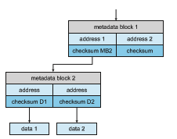
**Figure 11.17** ZFS checksums all metadata and data.  

rection than is found in RAID drive sets or standard file systems. The extra overhead that is created by the checksum calculation and extra block read- modify-write cycles is not noticeable because the overall performance of ZFS is very fast. (A similar checksum feature is found in the Linux BTRFS file system. See https://btrfs.wiki.kernel.org/index.php/Btrfs design.)

Another issue with most RAID implementations is lack of flexibility. Con- sider a storage array with twenty drives divided into four sets of five drives. Each set of five drives is a RAID level 5 set. As a result, there are four separate volumes, each holding a file system. But what if one file system is too large to fit on a five-drive RAID level 5 set? And what if another file system needs very little space? If such factors are known ahead of time, then the drives and volumes can be properly allocated. Very frequently, however, drive use and requirements change over time.

Even if the storage array allowed the entire set of twenty drives to be created as one large RAID set, other issues could arise. Several volumes of various sizes could be built on the set. But some volume managers do not allow us to change a volume’s size. In that case, wewould be left with the same issue described above—mismatched file-system sizes. Some volumemanagers allow size changes, but some file systems do not allow for file-system growth or shrinkage. The volumes could change sizes, but the file systemswould need to be recreated to take advantage of those changes.

ZFS combines file-system management and volume management into a unit providing greater functionality than the traditional separation of those functions allows. Drives, or partitions of drives, are gathered together via RAID sets into **pools** of storage. A pool can hold one or more ZFS file systems. The entire pool’s free space is available to all file systems within that pool. ZFS uses the memory model of malloc() and free() to allocate and release storage for each file system as blocks are used and freed within the file system. As a result, there are no artificial limits on storage use and no need to relocate file systems between volumes or resize volumes. ZFS provides quotas to limit the size of a file system and reservations to assure that a file system can grow by a specified amount, but those variables can be changed by the file-system owner at any time. Other systems like Linux have volumemanagers that allow the logical joining of multiple disks to create larger-than-disk volumes to hold large file systems. Figure 11.18(a) depicts traditional volumes and file systems, and Figure 11.18(b) shows the ZFS model.

### Object Storage

General-purpose computers typically use file systems to store content for users. Another approach to data storage is to start with a storage pool and place objects in that pool. This approach differs from file systems in that there is no way to navigate the pool and find those objects. Thus, rather than being user-oriented, object storage is computer-oriented, designed to be used by programs. A typical sequence is:

**1\.** Create an object within the storage pool, and receive an object ID.

**2\.** Access the object when needed via the object ID.

**3\.** Delete the object via the object ID.  

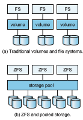
**Figure 11.18** Traditional volumes and file systems compared with the ZFS model.

Object storage management software, such as the **Hadoop fil system** (**HDFS**) and **Ceph**, determines where to store the objects and manages object protection. Typically, this occurs on commodity hardware rather than RAID arrays. For example, HDFS can store _N_ copies of an object on _N_ different com- puters. This approach can be lower in cost than storage arrays and can provide fast access to that object (at least on those_N_ systems). All systems in a Hadoop cluster can access the object, but only systems that have a copy have fast access via the copy. Computations on the data occur on those systems, with results sent across the network, for example, only to the systems requesting them. Other systems neednetwork connectivity to read andwrite to the object. There- fore, object storage is usually used for bulk storage, not high-speed random access. Object storage has the advantage of **horizontal scalability**. That is, whereas a storage array has a fixed maximum capacity, to add capacity to an object store, we simply add more computers with internal disks or attached external disks and add them to the pool. Object storage pools can be petabytes in size.

Another key feature of object storage is that each object is self-describing, including description of its contents. In fact, object storage is also known as **content-addressable storage**, because objects can be retrieved based on their contents. There is no set format for the contents, so what the system stores is **unstructured data**.

While object storage is not common on general-purpose computers, huge amounts of data are stored in object stores, including Google’s Internet search contents, Dropbox contents, Spotify’s songs, and Facebook photos. Cloud com- puting (such as Amazon AWS) generally uses object stores (in Amazon S3) to hold file systems as well as data objects for customer applications running on cloud computers.  

**Practice Exercises 485**

For the history of object stores see http://www.theregister.co.uk/2016/07/15 /the history boys cas and object storage map.

## Summary

• Hard disk drives and nonvolatilememory devices are themajor secondary storage I/O units on most computers. Modern secondary storage is struc- tured as large one-dimensional arrays of logical blocks.

• Drives of either type may be attached to a computer system in one of three ways: (1) through the local I/O ports on the host computer, (2) directly connected to motherboards, or (3) through a communications network or storage network connection.

• Requests for secondary storage I/O are generated by the file system and by the virtual memory system. Each request specifies the address on the device to be referenced in the form of a logical block number.

• Disk-scheduling algorithms can improve the effective bandwidth of HDDs, the average response time, and the variance in response time. Algo- rithms such as SCAN and C-SCAN are designed to make such improve- ments through strategies for disk-queue ordering. Performance of disk- scheduling algorithms can vary greatly on hard disks. In contrast, because solid-state disks have no moving parts, performance varies little among scheduling algorithms, and quite often a simple FCFS strategy is used.

• Data storage and transmission are complex and frequently result in errors. Error detection attempts to spot such problems to alert the system for corrective action and to avoid error propagation. Error correction can detect and repair problems, depending on the amount of correction data available and the amount of data that was corrupted.

• Storage devices are partitioned into one or more chunks of space. Each partition can hold a volume or be part of a multidevice volume. File systems are created in volumes.

• The operating system manages the storage device’s blocks. New devices typically come pre-formatted. The device is partitioned, file systems are created, and boot blocks are allocated to store the system’s bootstrap pro- gram if the device will contain an operating system. Finally, when a block or page is corrupted, the systemmust have a way to lock out that block or to replace it logically with a spare.

• An efficient swap space is a key to good performance in some systems. Some systems dedicate a raw partition to swap space, and others use a file within the file system instead. Still other systems allow the user or system administrator to make the decision by providing both options.

• Because of the amount of storage required on large systems, and because storage devices fail in various ways, secondary storage devices are fre- quently made redundant via RAID algorithms. These algorithms allow more than one drive to be used for a given operation and allow continued operation and even automatic recovery in the face of a drive failure. RAID algorithms are organized into different levels; each level provides some combination of reliability and high transfer rates.

• Object storage is used for big data problems such as indexing the Inter- net and cloud photo storage. Objects are self-defining collections of data, addressed by object ID rather than file name. Typically it uses replication for data protection, computes based on the data on systems where a copy of the data exists, and is horizontally scalable for vast capacity and easy expansion.

**Practice Exercises**

**11.1** Is disk scheduling, other than FCFS scheduling, useful in a single-user environment? Explain your answer.

**11.2** Explain why SSTF scheduling tends to favor middle cylinders over the innermost and outermost cylinders.

**11.3** Why is rotational latency usually not considered in disk scheduling? How would you modify SSTF, SCAN, and C-SCAN to include latency optimization?

**11.4** Why is it important to balance file-system I/O among the disks and controllers on a system in a multitasking environment?

**11.5** What are the tradeoffs involved in rereading code pages from the file system versus using swap space to store them?

**11.6** Is there any way to implement truly stable storage? Explain your answer.

**11.7** It is sometimes said that tape is a sequential-access medium, whereas a hard disk is a random-access medium. In fact, the suitability of a storage device for random access depends on the transfer size. The term **_streaming transfer rate_** denotes the rate for a data transfer that is underway, excluding the effect of access latency. In contrast, the **_effec- tive transfer rate_** is the ratio of total bytes to total seconds, including overhead time such as access latency.

Suppose we have a computer with the following characteristics: the level-2 cache has an access latency of 8 nanoseconds and a streaming transfer rate of 800 megabytes per second, the main memory has an access latency of 60 nanoseconds and a streaming transfer rate of 80 megabytes per second, the hard disk has an access latency of 15 mil- liseconds and a streaming transfer rate of 5 megabytes per second, and a tape drive has an access latency of 60 seconds and a streaming transfer rate of 2 megabytes per second.

a. Random access causes the effective transfer rate of a device to decrease, because no data are transferred during the access time. For the disk described, what is the effective transfer rate if an average access is followed by a streaming transfer of (1) 512 bytes, (2) 8 kilobytes, (3) 1 megabyte, and (4) 16 megabytes?

b. The utilization of a device is the ratio of effective transfer rate to streaming transfer rate. Calculate the utilization of the disk drive for each of the four transfer sizes given in part a.

c. Suppose that a utilization of 25 percent (or higher) is considered acceptable. Using the performance figures given, compute the smallest transfer size for a disk that gives acceptable utilization.

d. Complete the following sentence: A disk is a random- access device for transfers larger than bytes and is a sequential-access device for smaller transfers.

e. Compute the minimum transfer sizes that give acceptable utiliza- tion for cache, memory, and tape.

f. When is a tape a random-access device, and when is it a sequential-access device?

**11.8** Could a RAID level 1 organization achieve better performance for read requests than a RAID level 0 organization (with nonredundant striping of data)? If so, how?

**11.9** Give three reasons to use HDDs as secondary storage.

**11.10** Give three reasons to use NVM devices as secondary storage.

**Further Reading**

\[Services (2012)\] provides an overview of data storage in a variety of modern computing environments. Discussions of redundant arrays of independent disks (RAIDs) are presented by \[Patterson et al. (1988)\]. \[Kim et al. (2009)\] discuss disk-scheduling algorithms for SSDs. Object-based storage is described by \[Mesnier et al. (2003)\].

\[Russinovich et al. (2017)\], \[McDougall and Mauro (2007)\], and \[Love (2010)\] discuss file-systemdetails inWindows, Solaris, and Linux, respectively.

Storage devices are continuously evolving, with goals of increasing perfor- mance, increasing capacity, or both. For one direction in capacity improvement seehttp://www.tomsitpro.com/articles/shingled-magnetic-recoding-smr-101- basics,2-933.html).

RedHat (and other) Linux distributions have multiple, selectable disk scheduling algorithms. For details seehttps://access.redhat.com/site/docume ntation/en-US/Red Hat Enterprise Linux/7/html/Performance Tuning Guide/in dex.html.

Learn more about the default Linux bootstrap loader at https://www.gnu.org/software/grub/manual/grub.html/.

Arelatively newfile system, BTRFS, is detailed in https://btrfs.wiki.kernel.or g/index.php/Btrfs design.

For the history of object stores see http://www.theregister.co.uk/2016/07/15 /the history boys cas and object storage map.  

**Bibliography**

**\[Kim et al. (2009)\]** J. Kim, Y. Oh, E. Kim, J. C. D. Lee, and S. Noh, “Disk Sched- ulers for Solid State Drivers”, _Proceedings of the seventh ACM international confer- ence on Embedded software_ (2009), pages 295–304.

**\[Love (2010)\]** R. Love, _Linux Kernel Development,_ Third Edition, Developer’s Library (2010).

**\[McDougall and Mauro (2007)\]** R. McDougall and J. Mauro, _Solaris Internals,_ Second Edition, Prentice Hall (2007).

**\[Mesnier et al. (2003)\]** M. Mesnier, G. Ganger, and E. Ridel, “Object-based stor- age”, _IEEE Communications Magazine_, Volume 41, Number 8 (2003), pages 84–99.

**\[Patterson et al. (1988)\]** D. A. Patterson, G. Gibson, and R. H. Katz, “A Case for Redundant Arrays of Inexpensive Disks (RAID)”, _Proceedings of the ACM SIGMOD International Conference on the Management of Data_ (1988), pages 109– 116.

**\[Russinovich et al. (2017)\]** M.Russinovich,D.A. Solomon, andA. Ionescu,_Win- dows Internals–Part 1,_ Seventh Edition, Microsoft Press (2017).

**\[Services (2012)\]** E. E. Services, _Information Storage and Management: Storing, Managing, and Protecting Digital Information in Classic, Virtualized, and Cloud Envi- ronments_, Wiley (2012).  

**Chapter 11 Exercises**

**11.11** None of the disk-scheduling disciplines, except FCFS, is truly fair (star- vation may occur).

a. Explain why this assertion is true.

b. Describe a way to modify algorithms such as SCAN to ensure fairness.

c. Explainwhy fairness is an important goal in amulti-user systems.

d. Give three or more examples of circumstances in which it is important that the operating system be unfair in serving I/O requests.

**11.12** ExplainwhyNVMdevices often use an FCFS disk-scheduling algorithm.

**11.13** Suppose that a disk drive has 5,000 cylinders, numbered 0 to 4,999. The drive is currently serving a request at cylinder 2,150, and the previous request was at cylinder 1,805. The queue of pending requests, in FIFO order, is:

2,069; 1,212; 2,296; 2,800; 544; 1,618; 356; 1,523; 4,965; 3,681

Starting from the current head position, what is the total distance (in cylinders) that the disk arm moves to satisfy all the pending requests for each of the following disk-scheduling algorithms?

a. FCFS

b. SCAN

c. C-SCAN

**11.14** Elementary physics states that when an object is subjected to a constant acceleration _a,_ the relationship between distance _d_ and time _t_ is given by _d_ \= 1

2 _at_2\. Suppose that, during a seek, the disk in Exercise 11.14

accelerates the disk arm at a constant rate for the first half of the seek, then decelerates the disk arm at the same rate for the second half of the seek. Assume that the disk can perform a seek to an adjacent cylinder in 1 millisecond and a full-stroke seek over all 5,000 cylinders in 18 milliseconds.

a. The distance of a seek is the number of cylinders over which the head moves. Explain why the seek time is proportional to the square root of the seek distance.

b. Write an equation for the seek time as a function of the seek distance. This equation should be of the form _t_ \= _x_+_y_

√ _L_, where _t_

is the time in milliseconds and _L_ is the seek distance in cylinders.

c. Calculate the total seek time for each of the schedules in Exercise 11.14. Determine which schedule is the fastest (has the smallest total seek time).

**EX-43**  

**Exercises**

d. The **percentage speedup** is the time saved divided by the original time. What is the percentage speedup of the fastest schedule over FCFS?

**11.15** Suppose that the disk in Exercise 11.15 rotates at 7,200 RPM.

a. What is the average rotational latency of this disk drive?

b. What seek distance can be covered in the time that you found for part a?

**11.16** Compare and contrast HDDs and NVM devices.What are the best appli- cations for each type?

**11.17** Describe some advantages and disadvantages of using NVM devices as a caching tier and as a disk-drive replacement compared with using only HDDs.

**11.18** Compare the performance of C-SCAN and SCAN scheduling, assum- ing a uniform distribution of requests. Consider the average response time (the time between the arrival of a request and the completion of that request’s service), the variation in response time, and the effective bandwidth. Howdoes performance depend on the relative sizes of seek time and rotational latency?

**11.19** Requests are not usually uniformly distributed. For example, we can expect a cylinder containing the file-system metadata to be accessed more frequently than a cylinder containing only files. Suppose you know that 50 percent of the requests are for a small, fixed number of cylinders.

a. Would any of the scheduling algorithms discussed in this chapter be particularly good for this case? Explain your answer.

b. Propose a disk-scheduling algorithm that gives even better per- formance by taking advantage of this “hot spot” on the disk.

**11.20** Consider a RAID level 5 organization comprising five disks, with the parity for sets of four blocks on four disks stored on the fifth disk. How many blocks are accessed in order to perform the following?

a. Awrite of one block of data

b. Awrite of seven continuous blocks of data

**11.21** Compare the throughput achieved by a RAID level 5 organization with that achieved by a RAID level 1 organization for the following:

a. Read operations on single blocks

b. Read operations on multiple contiguous blocks

**11.22** Compare the performance of write operations achieved by a RAID level 5 organization with that achieved by a RAID level 1 organization.

**11.23** Assume that you have a mixed configuration comprising disks orga- nized as RAID level 1 and RAID level 5 disks. Assume that the system has flexibility in deciding which disk organization to use for storing a

**EX-44**  

particular file. Which files should be stored in the RAID level 1 disks and which in the RAID level 5 disks in order to optimize performance?

**11.24** The reliability of a storage device is typically described in terms ofmean time between failures (MTBF). Although this quantity is called a “time,” the MTBF actually is measured in drive-hours per failure.

a. If a system contains 1,000 disk drives, each ofwhich has a 750,000- hour MTBF, which of the following best describes how often a drive failurewill occur in that disk farm: once per thousand years, once per century, once per decade, once per year, once per month, once per week, once per day, once per hour, once per minute, or once per second?

b. Mortality statistics indicate that, on the average, a U.S. resident has about 1 chance in 1,000 of dying between the ages of 20 and 21. Deduce the MTBF hours for 20-year-olds. Convert this figure from hours to years. What does this MTBF tell you about the expected lifetime of a 20-year-old?

c. The manufacturer guarantees a 1-million-hour MTBF for a certain model of disk drive. What can you conclude about the number of years for which one of these drives is under warranty?

**11.25** Discuss the relative advantages and disadvantages of sector sparing and sector slipping.

**11.26** Discuss the reasons why the operating system might require accurate information on how blocks are stored on a disk. How could the operat- ing system improve file-system performance with this knowledge?

**EX-45**  

**Chapter 11 Mass-Storage Structure**

**Programming Problems**

**11.27** Write a program that implements the following disk-scheduling algo- rithms:

a. FCFS

b. SCAN

c. C-SCAN

Your program will service a disk with 5,000 cylinders numbered 0 to 4,999. The program will generate a random series of 1,000 cylinder requests and service them according to each of the algorithms listed above. The program will be passed the initial position of the disk head (as a parameter on the command line) and report the total amount of head movement required by each algorithm.


# I/O Systems

The two main jobs of a computer are I/O and computing. In many cases, the main job is I/O, and the computing or processing is merely incidental. For instance, when we browse a web page or edit a file, our immediate interest is to read or enter some information, not to compute an answer.

The role of the operating system in computer I/O is to manage and con- trol I/O operations and I/O devices. Although related topics appear in other chapters, here we bring together the pieces to paint a complete picture of I/O. First, we describe the basics of I/O hardware, because the nature of the hardware interface places constraints on the internal facilities of the operating system. Next, we discuss the I/O services provided by the operating system and the embodiment of these services in the application I/O interface. Then, we explain how the operating system bridges the gap between the hardware interface and the application interface. We also discuss the UNIX System V STREAMS mechanism, which enables an application to assemble pipelines of driver code dynamically. Finally, we discuss the performance aspects of I/O and the principles of operating-system design that improve I/O performance.

**CHAPTER OBJECTIVES**

• Explore the structure of an operating system’s I/O subsystem.

• Discuss the principles and complexities of I/O hardware.

• Explain the performance aspects of I/O hardware and software.

## Overview

The control of devices connected to the computer is a major concern of operating-system designers. Because I/O devices vary so widely in their func- tion and speed (consider a mouse, a hard disk, a flash drive, and a tape robot), varied methods are needed to control them. These methods form the I/O subsystem of the kernel, which separates the rest of the kernel from the complexities of managing I/O devices.

I/O-device technology exhibits two conflicting trends. On the one hand, we see increasing standardization of software and hardware interfaces. This trend helps us to incorporate improved device generations into existing computers and operating systems.On the other hand,we see an increasingly broad variety of I/O devices. Some new devices are so unlike previous devices that it is a challenge to incorporate them into our computers and operating systems. This challenge is met by a combination of hardware and software techniques. The basic I/O hardware elements, such as ports, buses, and device controllers, accommodate a wide variety of I/O devices. To encapsulate the details and oddities of different devices, the kernel of an operating system is structured to use device-driver modules. The **device drivers** present a uniform device- access interface to the I/O subsystem, much as system calls provide a standard interface between the application and the operating system.

## I/O Hardware

Computers operate a great many kinds of devices. Most fit into the general categories of storage devices (disks, tapes), transmission devices (network con- nections, Bluetooth), and human-interface devices (screen, keyboard, mouse, audio in and out). Other devices are more specialized, such as those involved in the steering of a jet. In these aircraft, a human gives input to the flight com- puter via a joystick and foot pedals, and the computer sends output commands that cause motors to move rudders and flaps and fuels to the engines. Despite the incredible variety of I/O devices, though, we need only a few concepts to understand how the devices are attached and how the software can control the hardware.

A device communicates with a computer system by sending signals over a cable or even through the air. The device communicates with the machine via a connection point, or **port**—for example, a serial port. (The term **PHY**, shorthand for the OSI model physical layer, is also used in reference to ports but is more common in data-center nomenclature.) If devices share a common set of wires, the connection is called a bus. A**bus**, like the PCI bus used in most computers today, is a set of wires and a rigidly defined protocol that specifies a set of messages that can be sent on the wires. In terms of the electronics, the messages are conveyed by patterns of electrical voltages applied to the wires with defined timings. When device _A_ has a cable that plugs into device _B,_ and device _B_ has a cable that plugs into device _C,_ and device _C_ plugs into a port on the computer, this arrangement is called a **daisy chain**. A daisy chain usually operates as a bus.

Buses are used widely in computer architecture and vary in their signal- ing methods, speed, throughput, and connection methods. A typical PC bus structure appears in Figure 12.1. In the figure, a **PCIe bus** (the common PC system bus) connects the processor–memory subsystem to fast devices, and an **expansion bus** connects relatively slow devices, such as the keyboard and serial and USB ports. In the lower-left portion of the figure, four disks are connected together on a **serial-attached SCSI** (**SAS**) bus plugged into an SAS controller. PCIe is a flexible bus that sends data over one or more “lanes.” A lane is composed of two signaling pairs, one pair for receiving data and the other for transmitting. Each lane is therefore composed of four wires, and each  

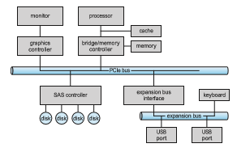
**Figure 12.1** A typical PC bus structure.

lane is used as a full-duplex byte stream, transporting data packets in an eight- bit byte format simultaneously in both directions. Physically, PCIe links may contain 1, 2, 4, 8, 12, 16, or 32 lanes, as signified by an “x” prefix. A PCIe card or connector that uses 8 lanes is designated x8, for example. In addition, PCIe has gone through multiple “generations,” with more coming in the future. Thus, for example, a card might be “PCIe gen3 x8”, which means it works with gen- eration 3 of PCIe and uses 8 lanes. Such a device has maximum throughput of 8 gigabytes per second. Details about PCIe can be found at https://pcisig.com.

A **controller** is a collection of electronics that can operate a port, a bus, or a device. A serial-port controller is a simple device controller. It is a single chip (or portion of a chip) in the computer that controls the signals on the wires of a serial port. By contrast, a **fibr channel** (**FC**) bus controller is not simple. Because the FC protocol is complex and used in data centers rather than on PCs, the FC bus controller is often implemented as a separate circuit board —or a **host bus adapter** (**HBA**)—that connects to a bus in the computer. It typically contains a processor, microcode, and some private memory to enable it to process the FC protocol messages. Some devices have their own built-in controllers. If you look at a disk drive, you will see a circuit board attached to one side. This board is the disk controller. It implements the disk side of the protocol for some kinds of connection—SAS and SATA, for instance. It has microcode and a processor to do many tasks, such as bad-sector mapping, prefetching, buffering, and caching.

### Memory-Mapped I/O

Howdoes the processor give commands and data to a controller to accomplish an I/O transfer? The short answer is that the controller has one ormore registers for data and control signals. The processor communicates with the controller by reading and writing bit patterns in these registers. One way in which this communication can occur is through the use of special I/O instructions  


**Figure 12.2** Device I/O port locations on PCs (partial).

that specify the transfer of a byte or a word to an I/O port address. The I/O instruction triggers bus lines to select the proper device and tomove bits into or out of a device register. Alternatively, the device can support **memory-mapped I/O**. In this case, the device-control registers are mapped into the address space of the processor. The CPU executes I/O requests using the standard data- transfer instructions to read and write the device-control registers at their mapped locations in physical memory.

In the past, PCs often used I/O instructions to control some devices and memory-mapped I/O to control others. Figure 12.2 shows the usual I/O port addresses for PCs. The graphics controller has I/O ports for basic control operations, but the controller has a large memory-mapped region to hold screen contents. A thread sends output to the screen by writing data into the memory-mapped region. The controller generates the screen image based on the contents of this memory. This technique is simple to use. Moreover, writing millions of bytes to the graphics memory is faster than issuing mil- lions of I/O instructions. Therefore, over time, systems have moved toward memory-mapped I/O. Today,most I/O is performedbydevice controllers using memory-mapped I/O.

I/O device control typically consists of four registers, called the status, control, data-in, and data-out registers.

• The **data-in register** is read by the host to get input.

• The **data-out register** is written by the host to send output.

• The **status register** contains bits that can be read by the host. These bits indicate states, such as whether the current command has completed, whether a byte is available to be read from the data-in register, andwhether a device error has occurred.

• The **control register** can be written by the host to start a command or to change the mode of a device. For instance, a certain bit in the control register of a serial port chooses between full-duplex and half-duplex communication, another bit enables parity checking, a third bit sets the word length to 7 or 8 bits, and other bits select one of the speeds supported by the serial port.

The data registers are typically 1 to 4 bytes in size. Some controllers have FIFO chips that can hold several bytes of input or output data to expand the capacity of the controller beyond the size of the data register. A FIFO chip can hold a small burst of data until the device or host is able to receive those data.

### Polling

The complete protocol for interaction between the host and a controller can be intricate, but the basic handshaking notion is simple. We explain hand- shaking with an example. Assume that 2 bits are used to coordinate the producer–consumer relationship between the controller and the host. The con- troller indicates its state through the busy bit in the status register. (Recall that to **_set_** a bit means to write a 1 into the bit and to **_clear_** a bit means to write a 0 into it.) The controller sets the busy bit when it is busy working and clears the busy bit when it is ready to accept the next command. The host signals its wishes via the command-ready bit in the command register. The host sets the command-ready bit when a command is available for the controller to execute. For this example, the host writes output through a port, coordinating with the controller by handshaking as follows.

**1\.** The host repeatedly reads the busy bit until that bit becomes clear.

**2\.** The host sets the write bit in the command register and writes a byte into the data-out register.

**3\.** The host sets the command-ready bit.

**4\.** When the controller notices that the command-ready bit is set, it sets the busy bit.

**5\.** The controller reads the command register and sees the write command. It reads the data-out register to get the byte and does the I/O to the device.

**6\.** The controller clears the command-ready bit, clears the error bit in the status register to indicate that the device I/O succeeded, and clears the busy bit to indicate that it is finished.

This loop is repeated for each byte. In step 1, the host is **busy-waiting** or **polling**: it is in a loop, reading the status register over and over until the busy bit becomes clear. If the controller and device are fast, thismethod is a reasonable one. But if thewaitmay be long, the host should probably switch to another task.How, then, does the host know when the controller has become idle? For some devices, the host must service the device quickly, or data will be lost. For instance, when data are streaming in on a serial port or from a keyboard, the small buffer on the controller will overflow and datawill be lost if the host waits too long before returning to read the bytes.  

In many computer architectures, three CPU-instruction cycles are sufficient to poll a device: read a device register, logical-and to extract a status bit, and branch if not zero. Clearly, the basic polling operation is efficient. But polling becomes inefficient when it is attempted repeatedly yet rarely finds a device ready for service, while other useful CPU processing remains undone. In such instances, it may be more efficient to arrange for the hardware controller to notify the CPU when the device becomes ready for service, rather than to require the CPU to poll repeatedly for an I/O completion. The hardware mechanism that enables a device to notify the CPU is called an **interrupt**.

### Interrupts

The basic interrupt mechanism works as follows. The CPU hardware has a wire called the **interrupt-request line** that the CPU senses after executing every instruction. When the CPU detects that a controller has asserted a signal on the interrupt-request line, the CPU performs a state save and jumps to the **interrupt-handler routine** at a fixed address in memory. The interrupt han- dler determines the cause of the interrupt, performs the necessary processing, performs a state restore, and executes a return from interrupt instruction to return the CPU to the execution state prior to the interrupt. We say that the device controller **_raises_** an interrupt by asserting a signal on the interrupt request line, the CPU **_catches_** the interrupt and **_dispatches_** it to the interrupt


**Figure 12.3** Interrupt-driven I/O cycle.  


**Figure 12.4** Latency command on Mac OS X.

handler, and the handler **_clears_** the interrupt by servicing the device. Figure 12.3 summarizes the interrupt-driven I/O cycle.

We stress interrupt management in this chapter because even single-user modern systems manage hundreds of interrupts per second and servers hun- dreds of thousands per second. For example, Figure 12.4 shows the latency command output on macOS, revealing that over ten seconds a quiet desktop computer performed almost 23,000 interrupts.

The basic interruptmechanism just described enables the CPU to respond to an asynchronous event, as when a device controller becomes ready for service. In amodern operating system, however,we needmore sophisticated interrupt- handling features.

**1\.** We need the ability to defer interrupt handling during critical processing.

**2\.** We need an efficient way to dispatch to the proper interrupt handler for a device without first polling all the devices to see which one raised the interrupt.

**3\.** We need multilevel interrupts, so that the operating system can distin- guish between high- and low-priority interrupts and can respond with the appropriate degree of urgency when there are multiple concurrent interrupts.

**4\.** We need a way for an instruction to get the operating system’s atten- tion directly (separately from I/O requests), for activities such as page faults and errors such as division by zero. As we shall see, this task is accomplished by “traps.”

In modern computer hardware, these features are provided by the CPU and by the **interrupt-controller hardware**.

Most CPUs have two interrupt request lines. One is the **nonmaskable interrupt**, which is reserved for events such as unrecoverable memory errors. The second interrupt line is **maskable**: it can be turned off by the CPU before the execution of critical instruction sequences thatmust not be interrupted. The maskable interrupt is used by device controllers to request service.

The interrupt mechanism accepts an **address**—a number that selects a specific interrupt-handling routine from a small set. In most architectures, this address is an offset in a table called the **interrupt vector**. This vector contains the memory addresses of specialized interrupt handlers. The purpose of a vectored interrupt mechanism is to reduce the need for a single interrupt handler to search all possible sources of interrupts to determine which one needs service. In practice, however, computers have more devices (and, hence, interrupt handlers) than they have address elements in the interrupt vector. A common way to solve this problem is to use **interrupt chaining**, in which each element in the interrupt vector points to the head of a list of interrupt handlers. When an interrupt is raised, the handlers on the corresponding list are called one by one, until one is found that can service the request. This structure is a compromise between the overhead of a huge interrupt table and the inefficiency of dispatching to a single interrupt handler.

Figure 12.5 illustrates the design of the interrupt vector for the Intel Pen- tium processor. The events from 0 to 31, which are nonmaskable, are used to signal various error conditions (which cause system crashes), page faults (needing immediate action), and debugging requests (stopping normal opera- tion and jumping to a debugger application). The events from 32 to 255, which are maskable, are used for purposes such as device-generated interrupts.

**Figure 12.5** Intel Pentium processor event-vector table.  

The interrupt mechanism also implements a system of **interrupt priority levels**. These levels enable the CPU to defer the handling of low-priority inter- rupts without masking all interrupts and make it possible for a high-priority interrupt to preempt the execution of a low-priority interrupt.

Amodern operating system interacts with the interruptmechanism in sev- eral ways. At boot time, the operating system probes the hardware buses to determine what devices are present and installs the corresponding interrupt handlers into the interrupt vector. During I/O, the various device controllers raise interrupts when they are ready for service. These interrupts signify that output has completed, or that input data are available, or that a failure has been detected. The interrupt mechanism is also used to handle a wide variety of **exceptions**, such as dividing by zero, accessing a protected or nonexis- tent memory address, or attempting to execute a privileged instruction from user mode. The events that trigger interrupts have a common property: they are occurrences that induce the operating system to execute an urgent, self- contained routine.

Because interrupt handing in many cases is time and resource constrained and therefore complicated to implement, systems frequently split interrupt management between a **first-leve interrupt handler** (**FLIH**) and a **second-level interrupt handler** (**SLIH**). The FLIH performs the context switch, state storage, and queuing of a handling operation, while the separately scheduled SLIH performs the handling of the requested operation.

Operating systems have other good uses for interrupts as well. For exam- ple, many operating systems use the interrupt mechanism for virtual memory paging. A page fault is an exception that raises an interrupt. The interrupt suspends the current process and jumps to the page-fault handler in the ker- nel. This handler saves the state of the process, moves the process to the wait queue, performs page-cache management, schedules an I/O operation to fetch the page, schedules another process to resume execution, and then returns from the interrupt.

Another example is found in the implementation of system calls. Usually, a program uses library calls to issue system calls. The library routines check the arguments given by the application, build a data structure to convey the argu- ments to the kernel, and then execute a special instruction called a **software interrupt**, or **trap**. This instruction has an operand that identifies the desired kernel service.When a process executes the trap instruction, the interrupt hard- ware saves the state of the user code, switches to kernel mode, and dispatches to the kernel routine or thread that implements the requested service. The trap is given a relatively low interrupt priority compared with those assigned to device interrupts—executing a system call on behalf of an application is less urgent than servicing a device controller before its FIFO queue overflows and loses data.

Interrupts can also be used to manage the flow of control within the ker- nel. For example, consider the case of the processing required to complete a disk read. One step may copy data from kernel space to the user buffer. This copying is time consuming but not urgent—it should not block other high- priority interrupt handling. Another step is to start the next pending I/O for that disk drive. This step has higher priority. If the disks are to be used effi- ciently, we need to start the next I/O as soon as the previous one completes. Consequently, a pair of interrupt handlers implements the kernel code that completes a disk read. The high-priority handler records the I/O status, clears the device interrupt, starts the next pending I/O, and raises a low-priority interrupt to complete the work. Later, when the CPU is not occupied with high- prioritywork, the low-priority interruptwill be dispatched. The corresponding handler completes the user-level I/O by copying data from kernel buffers to the application space and then calling the scheduler to place the application on the ready queue.

A threaded kernel architecture is well suited to implement multiple inter- rupt priorities and to enforce the precedence of interrupt handling over back- ground processing in kernel and application routines. We illustrate this point with the Solaris kernel. In Solaris, interrupt handlers are executed as kernel threads. A range of high scheduling priorities is reserved for these threads. These priorities give interrupt handlers precedence over application code and kernel housekeeping and implement the priority relationships among inter- rupt handlers. The priorities cause the Solaris thread scheduler to preempt low- priority interrupt handlers in favor of higher-priority ones, and the threaded implementation enablesmultiprocessor hardware to run several interrupt han- dlers concurrently. We describe the interrupt architecture of Linux in Chapter 20, Windows10 in Chapter 21, and UNIX in Appendix C.

In summary, interrupts are used throughout modern operating systems to handle asynchronous events and to trap to supervisor-mode routines in the kernel. To enable the most urgent work to be done first, modern computers use a system of interrupt priorities. Device controllers, hardware faults, and system calls all raise interrupts to trigger kernel routines. Because interrupts are used so heavily for time-sensitive processing, efficient interrupt handling is required for good system performance. Interrupt-driven I/O is now much more common than polling, with polling being used for high-throughput I/O. Sometimes the two are used together. Some device drivers use interruptswhen the I/O rate is low and switch to polling when the rate increases to the point where polling is faster and more efficient.

### Direct Memory Access

For a device that does large transfers, such as a disk drive, it seems waste- ful to use an expensive general-purpose processor to watch status bits and to feed data into a controller register one byte at a time—a process termed **programmed I/O** (**PIO**). Computers avoid burdening the main CPU with PIO by offloading some of this work to a special-purpose processor called a **direct- memory-access** (**DMA**) controller. To initiate a DMA transfer, the host writes a DMA command block into memory. This block contains a pointer to the source of a transfer, a pointer to the destination of the transfer, and a count of the number of bytes to be transferred. A command block can be more complex, including a list of sources and destinations addresses that are not contiguous. This **scatter–gather** method allows multiple transfers to be executed via a sin- gle DMA command. The CPU writes the address of this command block to the DMA controller, then goes on with other work. The DMA controller proceeds to operate the memory bus directly, placing addresses on the bus to perform transfers without the help of the main CPU. A simple DMA controller is a stan- dard component in all modern computers, from smartphones to mainframes.  

Note that it is most straightforward for the target address to be in kernel address space. If it were in user space, the user could, for example, modify the contents of that space during the transfer, losing some set of data. To get the DMA-transferred data to the user space for thread access, however, a second copy operation, this time from kernel memory to user memory, is needed. This **double buffering** is inefficient. Over time, operating systems have moved to using memory-mapping (see Section 12.2.1) to perform I/O transfers directly between devices and user address space.

Handshaking between the DMA controller and the device controller is performed via a pair of wires called **DMA-request** and **DMA-acknowledge**. The device controller places a signal on the DMA-request wire when a word of data is available for transfer. This signal causes the DMA controller to seize the memory bus, place the desired address on thememory-addresswire, and place a signal on the DMA-acknowledgewire.When the device controller receives the DMA-acknowledge signal, it transfers theword of data tomemory and removes the DMA-request signal.

When the entire transfer is finished, the DMA controller interrupts the CPU. This process is depicted in Figure 12.6. When the DMA controller seizes the memory bus, the CPU is momentarily prevented from accessing main mem- ory, although it can still access data items in its caches. Although this **cycle stealing** can slow down the CPU computation, offloading the data-transfer work to a DMA controller generally improves the total system performance. Some computer architectures use physical memory addresses for DMA, but

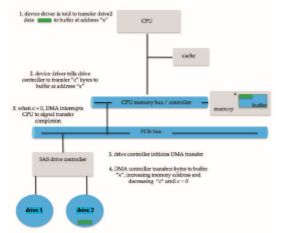
**Figure 12.6** Steps in a DMA transfer.  

others perform **direct virtual memory access** (**DVMA**), using virtual addresses that undergo translation to physical addresses. DVMA can perform a transfer between two memory-mapped devices without the intervention of the CPU or the use of main memory.

On protected-mode kernels, the operating system generally prevents pro- cesses from issuing device commands directly. This discipline protects data from access-control violations and also protects the system from erroneous use of device controllers, which could cause a system crash. Instead, the operat- ing system exports functions that a sufficiently privileged process can use to access low-level operations on the underlying hardware. On kernels without memory protection, processes can access device controllers directly. This direct access can be used to achieve high performance, since it can avoid kernel com- munication, context switches, and layers of kernel software. Unfortunately, it interferes with system security and stability. Common general-purpose oper- ating systems protect memory and devices so that the system can try to guard against erroneous or malicious applications.

### I/O Hardware Summary

Although the hardware aspects of I/O are complex when considered at the level of detail of electronics-hardware design, the concepts that we have just described are sufficient to enable us to understand many I/O features of oper- ating systems. Let’s review the main concepts:

• A bus

• A controller

• An I/O port and its registers

• The handshaking relationship between the host and a device controller

• The execution of this handshaking in a polling loop or via interrupts

• The offloading of this work to a DMA controller for large transfers

We gave a basic example of the handshaking that takes place between a device controller and the host earlier in this section. In reality, the wide variety of available devices poses a problem for operating-system implementers. Each kind of device has its own set of capabilities, control-bit definitions, and pro- tocols for interacting with the host—and they are all different. How can the operating system be designed so that we can attach new devices to the com- puter without rewriting the operating system? And when the devices vary so widely, how can the operating system give a convenient, uniform I/O interface to applications? We address those questions next.

## Application I/O Interface

In this section, we discuss structuring techniques and interfaces for the oper- ating system that enable I/O devices to be treated in a standard, uniform way. We explain, for instance, how an application can open a file on a disk without  


**Figure 12.7** A kernel I/O structure.

knowing what kind of disk it is and how new disks and other devices can be added to a computer without disruption of the operating system.

Like other complex software-engineering problems, the approach here involves abstraction, encapsulation, and software layering. Specifically, we can abstract away the detailed differences in I/O devices by identifying a few gen- eral kinds. Each general kind is accessed through a standardized set of func- tions—an **interface**. The differences are encapsulated in kernelmodules called device drivers that internally are custom-tailored to specific devices but that export one of the standard interfaces. Figure 12.7 illustrates how the I/O-related portions of the kernel are structured in software layers.

The purpose of the device-driver layer is to hide the differences among device controllers from the I/O subsystem of the kernel, much as the I/O sys- tem calls encapsulate the behavior of devices in a few generic classes that hide hardware differences from applications. Making the I/O subsystem indepen- dent of the hardware simplifies the job of the operating-system developer. It also benefits the hardware manufacturers. They either design new devices to be compatible with an existing host controller interface (such as SATA), or they write device drivers to interface the new hardware to popular operating sys- tems. Thus, we can attach new peripherals to a computer without waiting for the operating-system vendor to develop support code.

Unfortunately for device-hardware manufacturers, each type of operating system has its own standards for the device-driver interface. A given device may ship with multiple device drivers—for instance, drivers for Windows, Linux, AIX, and macOS. Devices vary on many dimensions, as illustrated in Figure 12.8.  


**Figure 12.8** Characteristics of I/O devices.

• **Character-stream or block**. A character-stream device transfers bytes one by one, whereas a block device transfers a block of bytes as a unit.

• **Sequential or random access**. A sequential device transfers data in a fixed order determined by the device, whereas the user of a random-access device can instruct the device to seek to any of the available data storage locations.

• **Synchronous or asynchronous**. A synchronous device performs data transfers with predictable response times, in coordination with other aspects of the system. An asynchronous device exhibits irregular or unpredictable response times not coordinated with other computer events.

• **Sharable or dedicated**. A sharable device can be used concurrently by several processes or threads; a dedicated device cannot.

• **Speed of operation**. Device speeds range from a few bytes per second to gigabytes per second.

• **Read–write, read only, write once**. Some devices perform both input and output, but others support only one data transfer direction. Some allow data to be modified after write, but others can be written only once and are read-only thereafter.

For the purpose of application access, many of these differences are hidden by the operating system, and the devices are grouped into a few conventional types. The resulting styles of device access have been found to be useful and broadly applicable. Although the exact system callsmay differ across operating systems, the device categories are fairly standard. The major access conventions include block I/O, character-stream I/O, memory-mapped file access, and network sockets. Operating systems also provide special system calls to access a few additional devices, such as a time-of-day clock and a timer. Some oper- ating systems provide a set of system calls for graphical display, video, and audio devices.

Most operating systems also have an **escape** (or **back door**) that transpar- ently passes arbitrary commands from an application to a device driver. In UNIX, this system call is ioctl() (for “I/O control”). The ioctl() system call enables an application to access any functionality that can be implemented by any device driver, without the need to invent a new system call. The ioctl() system call has three arguments. The first is a device identifier that connects the application to the driver by referring to a hardware devicemanaged by that driver. The second is an integer that selects one of the commands implemented in the driver. The third is a pointer to an arbitrary data structure in memory that enables the application and driver to communicate any necessary control information or data.

The device identifier in UNIX and Linux is a tuple of “major and minor” device numbers. The major number is the device type, and the second is the instance of that device. For example, consider these SSD devices on a system. If one issues a command:

% ls -l /dev/sda\*

then the following output
```
brw-rw---- 1 root disk 8, 0 Mar 16 09:18 /dev/sda 
brw-rw---- 1 root disk 8, 1 Mar 16 09:18 /dev/sda1 
brw-rw---- 1 root disk 8, 2 Mar 16 09:18 /dev/sda2 
brw-rw---- 1 root disk 8, 3 Mar 16 09:18 /dev/sda3
```
shows that 8 is the major device number. The operating system uses that information to route I/O requests to the appropriate device driver. The minor numbers 0, 1, 2, and 3 indicate the instance of the device, allowing requests for I/O to a device entry to select the exact device for the request.

### Block and Character Devices

The**block-device interface** captures all the aspects necessary for accessing disk drives and other block-oriented devices. The device is expected to understand commands such as read() and write(). If it is a random-access device, it is also expected to have a seek() command to specify which block to trans- fer next. Applications normally access such a device through a file-system interface. We can see that read(), write(), and seek() capture the essential behaviors of block-storage devices, so that applications are insulated from the low-level differences among those devices.

The operating system itself, as well as special applications such as database-management systems, may prefer to access a block device as a simple linear array of blocks. This mode of access is sometimes called **raw I/O**. If the application performs its own buffering, then using a file system would cause extra, unneeded buffering. Likewise, if an application provides its own locking of blocks or regions, then any operating-system locking services would be redundant at the least and contradictory at the worst. To avoid  
these conflicts, raw-device access passes control of the device directly to the application, letting the operating system step out of the way. Unfortunately, no operating-system services are then performed on this device. A compromise that is becoming common is for the operating system to allow a mode of operation on a file that disables buffering and locking. In the UNIX world, this is called **direct I/O**.

Memory-mapped file access can be layered on top of block-device drivers. Rather than offering read and write operations, a memory-mapped interface provides access to disk storage via an array of bytes in main memory. The system call that maps a file into memory returns the virtual memory address that contains a copy of the file. The actual data transfers are performed only when needed to satisfy access to the memory image. Because the transfers are handled by the same mechanism as that used for demand-paged virtual memory access, memory-mapped I/O is efficient. Memory mapping is also convenient for programmers—access to a memory-mapped file is as simple as reading from and writing to memory. Operating systems that offer virtual memory commonly use themapping interface for kernel services. For instance, to execute a program, the operating system maps the executable into memory and then transfers control to the entry address of the executable. The mapping interface is also commonly used for kernel access to swap space on disk.

A keyboard is an example of a device that is accessed through a **character- stream interface**. The basic system calls in this interface enable an application to get() or put() one character. On top of this interface, libraries can be built that offer line-at-a-time access, with buffering and editing services (for example, when a user types a backspace, the preceding character is removed from the input stream). This style of access is convenient for input devices such as keyboards, mice, and modems that produce data for input “spontaneously” —that is, at times that cannot necessarily be predicted by the application. This access style is also good for output devices such as printers and audio boards, which naturally fit the concept of a linear stream of bytes.

### Network Devices

Because the performance and addressing characteristics of network I/O differ significantly from those of disk I/O, most operating systems provide a network I/O interface that is different from the read()–write()–seek() interface used for disks. One interface available in many operating systems, including UNIX and Windows, is the network **socket** interface.

Think of a wall socket for electricity: any electrical appliance can be plugged in. By analogy, the system calls in the socket interface enable an application to create a socket, to connect a local socket to a remote address (which plugs this application into a socket created by another application), to listen for any remote application to plug into the local socket, and to send and receive packets over the connection. To support the implementation of network servers, the socket interface also provides a function called select() that manages a set of sockets. A call to select() returns information about which sockets have a packet waiting to be received and which sockets have room to accept a packet to be sent. The use of select() eliminates the polling and busy waiting that would otherwise be necessary for network I/O. These functions encapsulate the essential behaviors of networks, greatly facilitating the creation of distributed applications that can use any underlying network hardware and protocol stack.

Many other approaches to interprocess communication and network com- munication have been implemented. For instance, Windows provides one interface to the network interface card and a second interface to the network protocols. In UNIX, which has a long history as a proving ground for network technology, we find half-duplex pipes, full-duplex FIFOs, full-duplex STREAMS, message queues, and sockets. Information on UNIX networking is given in Section C.9.

### Clocks and Timers

Most computers have hardware clocks and timers that provide three basic functions:

• Give the current time.

• Give the elapsed time.

• Set a timer to trigger operation _X_ at time _T._

These functions are used heavily by the operating system, as well as by time- sensitive applications. Unfortunately, the system calls that implement these functions are not standardized across operating systems.

The hardware to measure elapsed time and to trigger operations is called a **programmable interval timer**. It can be set to wait a certain amount of time and then generate an interrupt, and it can be set to do this once or to repeat the process to generate periodic interrupts. The scheduler uses this mechanism to generate an interrupt that will preempt a process at the end of its time slice. The disk I/O subsystem uses it to invoke the periodic flushing of dirty cache buffers to disk, and the network subsystem uses it to cancel operations that are proceeding too slowly because of network congestion or failures. The operating systemmay also provide an interface for user processes to use timers. The operating system can support more timer requests than the number of timer hardware channels by simulating virtual clocks. To do so, the kernel (or the timer device driver) maintains a list of interrupts wanted by its own routines and by user requests, sorted in earliest-time-first order. It sets the timer for the earliest time.When the timer interrupts, the kernel signals the requester and reloads the timer with the next earliest time.

Computers have clock hardware that is used for a variety of purposes. Modern PCs include a **high-performance event timer** (**HPET**), which runs at rates in the 10-megahertz range. It has several comparators that can be set to trigger once or repeatedly when the value they hold matches that of the HPET. The trigger generates an interrupt, and the operating system’s clock management routines determine what the timer was for and what action to take. The precision of triggers is limited by the resolution of the timer, together with the overhead of maintaining virtual clocks. Furthermore, if the timer ticks are used to maintain the system time-of-day clock, the system clock can drift. Drift can be corrected via protocols designed for that purpose, such as NTP, the **network time protocol**, which uses sophisticated latency calculations to keep a computer’s clock accurate almost to atomic-clock levels. In most computers,the hardware clock is constructed from a high-frequency counter. In some computers, the value of this counter can be read from adevice register, inwhich case the counter can be considered a high-resolution clock. Although this clock does not generate interrupts, it offers accurate measurements of time intervals.

### Nonblocking and Asynchronous I/O

Another aspect of the system-call interface relates to the choice between block- ing I/O and nonblocking I/O. When an application issues a **blocking** system call, the execution of the calling thread is suspended. The thread ismoved from the operating system’s run queue to a wait queue. After the system call com- pletes, the thread is moved back to the run queue, where it is eligible to resume execution. When it resumes execution, it will receive the values returned by the system call. The physical actions performed by I/O devices are generally asynchronous—they take a varying or unpredictable amount of time. Nev- ertheless, operating systems provide blocking system calls for the application interface, because blocking application code is easier towrite than nonblocking application code.

Some user-level processes need **nonblocking** I/O. One example is a user interface that receives keyboard and mouse input while processing and dis- playing data on the screen. Another example is a video application that reads frames from a file on diskwhile simultaneously decompressing and displaying the output on the display.

One way an application writer can overlap execution with I/O is to write a multithreaded application. Some threads can perform blocking system calls, while others continue executing. Some operating systems provide nonblocking I/O system calls. Anonblocking call does not halt the execution of the thread for an extended time. Instead, it returns quickly, with a return value that indicates how many bytes were transferred.

An alternative to a nonblocking system call is an asynchronous system call. An asynchronous call returns immediately, without waiting for the I/O to complete. The thread continues to execute its code. The completion of the I/O at some future time is communicated to the thread, either through the setting of some variable in the address space of the thread or through the triggering of a signal or software interrupt or a call-back routine that is executed outside the linear control flow of the thread. The difference between nonblocking and asynchronous system calls is that a nonblocking read() returns immediately with whatever data are available—the full number of bytes requested, fewer, or none at all. An asynchronous read() call requests a transfer that will be performed in its entirety but will complete at some future time. These two I/O methods are shown in Figure 12.9.

Asynchronous activities occur throughout modern operating systems. Fre- quently, they are not exposed to users or applications but rather are contained within the operating-system operation. Secondary storage device and network I/O are useful examples. By default, when an application issues a network send request or a storage device write request, the operating system notes the request, buffers the I/O, and returns to the application. When possible, to optimize overall system performance, the operating system completes the request. If a system failure occurs in the interim, the application will lose any “in-flight” requests. Therefore, operating systems usually put a limit on how  


**Figure 12.9** Two I/O methods: (a) synchronous and (b) asynchronous.

long they will buffer a request. Some versions of UNIX flush their secondary storage buffers every 30 seconds, for example, or each request is flushedwithin 30 seconds of its occurrence. Systems provide a way to allow applications to request a flush of some buffers (like secondary storage buffers) so the data can be forced to secondary storage without waiting for the buffer flush interval. Data consistency within applications is maintained by the kernel, which reads data from its buffers before issuing I/O requests to devices, ensuring that data not yet written are nevertheless returned to a requesting reader. Note that mul- tiple threads performing I/O to the same file might not receive consistent data, depending on how the kernel implements its I/O. In this situation, the threads may need to use locking protocols. Some I/O requests need to be performed immediately, so I/O system calls usually have a way to indicate that a given request, or I/O to a specific device, should be performed synchronously.

A good example of nonblocking behavior is the select() system call for network sockets. This system call takes an argument that specifies a maxi- mum waiting time. By setting it to 0, a thread can poll for network activity without blocking. But using select() introduces extra overhead, because the select() call only checks whether I/O is possible. For a data transfer, select() must be followed by some kind of read() or write() command. A variation on this approach, found in Mach, is a blocking multiple-read call. It specifies desired reads for several devices in one system call and returns as soon as any one of them completes.

### Vectored I/O

Some operating systems provide another major variation of I/O via their appli- cation interfaces. **Vectored I/O** allows one system call to perform multiple I/O operations involving multiple locations. For example, the UNIX readv sys- tem call accepts a vector of multiple buffers and either reads from a source to that vector or writes from that vector to a destination. The same transfer could be caused by several individual invocations of system calls, but this **scatter–gather** method is useful for a variety of reasons.

Multiple separate buffers can have their contents transferred via one sys- tem call, avoiding context-switching and system-call overhead. Without vec- tored I/O, the data might first need to be transferred to a larger buffer in the right order and then transmitted, which is inefficient. In addition, some versions of scatter–gather provide atomicity, assuring that all the I/O is done without interruption (and avoiding corruption of data if other threads are also performing I/O involving those buffers). When possible, programmers make use of scatter–gather I/O features to increase throughput and decrease system overhead.

## Kernel I/O Subsystem

Kernels provide many services related to I/O. Several services—scheduling, buffering, caching, spooling, device reservation, and error handling—are pro- vided by the kernel’s I/O subsystem and build on the hardware and device- driver infrastructure. The I/O subsystem is also responsible for protecting itself from errant processes and malicious users.

### I/O Scheduling

To schedule a set of I/O requests means to determine a good order in which to execute them. The order in which applications issue system calls rarely is the best choice. Scheduling can improve overall system performance, can share device access fairly among processes, and can reduce the average waiting time for I/O to complete. Here is a simple example to illustrate. Suppose that a disk arm is near the beginning of a disk and that three applications issue blocking read calls to that disk. Application 1 requests a block near the end of the disk, application 2 requests one near the beginning, and application 3 requests one in themiddle of the disk. The operating system can reduce the distance that the disk arm travels by serving the applications in the order 2, 3, 1. Rearranging the order of service in this way is the essence of I/O scheduling.

Operating-system developers implement scheduling by maintaining a wait queue of requests for each device. When an application issues a blocking I/O system call, the request is placed on the queue for that device. The I/O scheduler rearranges the order of the queue to improve the overall system effi- ciency and the average response time experienced by applications. The operat- ing systemmay also try to be fair, so that no one application receives especially poor service, or it may give priority service for delay-sensitive requests. For instance, requests from the virtual memory subsystem may take priority over application requests. Several scheduling algorithms for disk I/O were detailed in Section 11.2.

When a kernel supports asynchronous I/O, it must be able to keep track of many I/O requests at the same time. For this purpose, the operating system might attach the wait queue to a **device-status table**. The kernel manages this table, which contains an entry for each I/O device, as shown in Figure 12.10. Each table entry indicates the device’s type, address, and state (not functioning,  

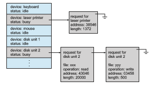
**Figure 12.10** Device-status table.

idle, or busy). If the device is busy with a request, the type of request and other parameters will be stored in the table entry for that device.

Scheduling I/O operations is oneway inwhich the I/O subsystem improves the efficiency of the computer. Another way is by using storage space in main memory or elsewhere in the storage hierarchy via buffering, caching, and spooling.

### Buffering

A**buffer**, of course, is amemory area that stores data being transferred between two devices or between a device and an application. Buffering is done for three reasons. One reason is to cope with a speed mismatch between the producer and consumer of a data stream. Suppose, for example, that a file is being received via Internet for storage on an SSD. The network speed may be a thousand times slower than the drive. So a buffer is created in main memory to accumulate the bytes received from the network. When an entire buffer of data has arrived, the buffer can be written to the drive in a single operation. Since the drivewrite is not instantaneous and the network interface still needs a place to store additional incoming data, two buffers are used.After the network fills the first buffer, the drive write is requested. The network then starts to fill the second buffer while the first buffer is written to storage. By the time the network has filled the second buffer, the drive write from the first one should have completed, so the network can switch back to the first buffer while the drive writes the second one. This **double buffering** decouples the producer of data from the consumer, thus relaxing timing requirements between them. The need for this decoupling is illustrated in Figure 12.11, which lists the enormous differences in device speeds for typical computer hardware and interfaces.

A second use of buffering is to provide adaptations for devices that have different data-transfer sizes. Such disparities are especially common in computer networking, where buffers are used widely for fragmentation and  


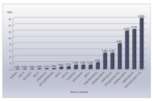
**Figure 12.11** Common PC and data-center I/O device and interface speeds.

reassembly of messages. At the sending side, a large message is fragmented into small network packets. The packets are sent over the network, and the receiving side places them in a reassembly buffer to form an image of the source data.

A third use of buffering is to support copy semantics for application I/O. An example will clarify the meaning of “copy semantics.” Suppose that an application has a buffer of data that it wishes to write to disk. It calls the write() systemcall, providing a pointer to the buffer and an integer specifying the number of bytes to write. After the system call returns, what happens if the application changes the contents of the buffer? With **copy semantics**, the version of the data written to disk is guaranteed to be the version at the time of the application system call, independent of any subsequent changes in the application’s buffer. A simple way in which the operating system can guarantee copy semantics is for the write() system call to copy the application data into a kernel buffer before returning control to the application. The disk write is performed from the kernel buffer, so that subsequent changes to the application buffer have no effect. Copying of data between kernel buffers and application data space is common in operating systems, despite the overhead that this operation introduces, because of the clean semantics. The same effect can be obtained more efficiently by clever use of virtual memory mapping and copy-on-write page protection.

### Caching

A **cache** is a region of fast memory that holds copies of data. Access to the cached copy is more efficient than access to the original. For instance, the instructions of the currently running process are stored on disk, cached in physicalmemory, and copied again in the CPU’s secondary andprimary caches.  

The difference between a buffer and a cache is that a buffer may hold the only existing copy of a data item, whereas a cache, by definition, holds a copy on faster storage of an item that resides elsewhere.

Caching and buffering are distinct functions, but sometimes a region of memory can be used for both purposes. For instance, to preserve copy seman- tics and to enable efficient scheduling of disk I/O, the operating system uses buffers in main memory to hold disk data. These buffers are also used as a cache, to improve the I/O efficiency for files that are shared by applications or that are being written and reread rapidly. When the kernel receives a file I/O request, the kernel first accesses the buffer cache to see whether that region of the file is already available in main memory. If it is, a physical disk I/O can be avoided or deferred. Also, disk writes are accumulated in the buffer cache for several seconds, so that large transfers are gathered to allow efficient write schedules. This strategy of delaying writes to improve I/O efficiency is discussed, in the context of remote file access, in Section 19.8.

### Spooling and Device Reservation

A **spool** is a buffer that holds output for a device, such as a printer, that cannot accept interleaved data streams. Although a printer can serve only one job at a time, several applicationsmaywish to print their output concurrently, without having their output mixed together. The operating system solves this problem by intercepting all output to the printer. Each application’s output is spooled to a separate secondary storage file. When an application finishes printing, the spooling system queues the corresponding spool file for output to the printer. The spooling system copies the queued spool files to the printer one at a time. In some operating systems, spooling is managed by a system daemon process. In others, it is handled by an in-kernel thread. In either case, the operating system provides a control interface that enables users and system administrators to display the queue, remove unwanted jobs before those jobs print, suspend printing while the printer is serviced, and so on.

Some devices, such as tape drives and printers, cannot usefully multiplex the I/O requests of multiple concurrent applications. Spooling is one way operating systems can coordinate concurrent output. Anotherway to dealwith concurrent device access is to provide explicit facilities for coordination. Some operating systems (including VMS) provide support for exclusive device access by enabling a process to allocate an idle device and to deallocate that device when it is no longer needed. Other operating systems enforce a limit of one open file handle to such a device. Many operating systems provide functions that enable processes to coordinate exclusive access among themselves. For instance, Windows provides system calls to wait until a device object becomes available. It also has a parameter to the OpenFile() system call that declares the types of access to be permitted to other concurrent threads. On these systems, it is up to the applications to avoid deadlock.

### Error Handling

An operating system that uses protected memory can guard against many kinds of hardware and application errors, so that a complete system failure is not the usual result of each minor mechanical malfunction. Devices and I/O transfers can fail inmanyways, either for transient reasons, as when a network becomes overloaded, or for “permanent” reasons, as when a disk controller becomes defective. Operating systems can often compensate effectively for transient failures. For instance, a disk read() failure results in a read() retry, and a network send() error results in a resend(), if the protocol so specifies. Unfortunately, if an important component experiences a permanent failure, the operating system is unlikely to recover.

As a general rule, an I/O system call will return one bit of information about the status of the call, signifying either success or failure. In the UNIX operating system, an additional integer variable named errno is used to return an error code—one of about a hundred values—indicating the general nature of the failure (for example, argument out of range, bad pointer, or file not open). By contrast, some hardware can provide highly detailed error infor- mation, although many current operating systems are not designed to convey this information to the application. For instance, a failure of a SCSI device is reported by the SCSI protocol in three levels of detail: a **sense key** that iden- tifies the general nature of the failure, such as a hardware error or an illegal request; an **additional sense code** that states the category of failure, such as a bad command parameter or a self-test failure; and an **additional sense-code qualifie** that gives even more detail, such as which command parameter was in error or which hardware subsystem failed its self-test. Further, many SCSI devices maintain internal pages of error-log information that can be requested by the host—but seldom are.

### I/O Protection

Errors are closely related to the issue of protection. A user process may acci- dentally or purposely attempt to disrupt the normal operation of a system by attempting to issue illegal I/O instructions. We can use various mechanisms to ensure that such disruptions cannot take place in the system.

To prevent users from performing illegal I/O, we define all I/O instructions to be privileged instructions. Thus, users cannot issue I/O instructions directly; they must do it through the operating system. To do I/O, a user program executes a system call to request that the operating system perform I/O on its behalf (Figure 12.12). The operating system, executing inmonitormode, checks that the request is valid and, if it is, does the I/O requested. The operating system then returns to the user.

In addition, any memory-mapped and I/O port memory locations must be protected from user access by the memory-protection system. Note that a kernel cannot simply deny all user access. Most graphics games and video editing and playback software need direct access to memory-mapped graphics controller memory to speed the performance of the graphics, for example. The kernel might in this case provide a locking mechanism to allow a section of graphics memory (representing a window on screen) to be allocated to one process at a time.

### Kernel Data Structures

The kernel needs to keep state information about the use of I/O components. It does so through a variety of in-kernel data structures, such as the open-file table  


**Figure 12.12** Use of a system call to perform I/O.

structure discussed in Section 14.1. The kernel uses many similar structures to track network connections, character-device communications, and other I/O activities.

UNIX provides file-system access to a variety of entities, such as user files, raw devices, and the address spaces of processes. Although each of these entities supports a read() operation, the semantics differ. For instance, to read a user file, the kernel needs to probe the buffer cache before deciding whether to perform a disk I/O. To read a raw disk, the kernel needs to ensure that the request size is a multiple of the disk sector size and is aligned on a sector boundary. To read a process image, it is merely necessary to copy data from memory. UNIX encapsulates these differences within a uniform structure by using an object-oriented technique. The open-file record, shown in Figure 12.13, contains a dispatch table that holds pointers to the appropriate routines, depending on the type of file.

Some operating systems use object-oriented methods even more exten- sively. For instance, Windows uses a message-passing implementation for I/O. An I/O request is converted into a message that is sent through the kernel to the I/O manager and then to the device driver, each of which may change the message contents. For output, the message contains the data to be written. For input, the message contains a buffer to receive the data. The message-passing approach can add overhead, by comparison with procedural techniques that use shared data structures, but it simplifies the structure and design of the I/O system and adds flexibility.  

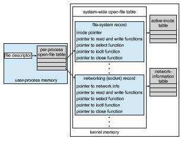
**Figure 12.13** UNIX I/O kernel structure.

### Power Management

Computers residing in data centers may seem far removed from issues of power use, but as power costs increase and the world becomes increasingly troubled about the long-term effects of greenhouse gas emissions, data cen- ters have become a cause for concern and a target for increased efficiencies. Electricity use generates heat, and computer components can fail due to high temperatures, so cooling is part of the equation as well. Consider that cool- ing a modern data center may use twice as much electricity as powering the equipment does. Many approaches to data-center power optimization are in use, ranging from interchanging data-center air without side air, chilling with natural sources such as lake water, and solar panels.

Operating systems play a role in power use (and therefore heat gener- ation and cooling). In cloud computing environments, processing loads can be adjusted by monitoring and management tools to evacuate all user pro- cesses from systems, idling those systems and powering them off until the load requires their use. An operating system could analyze its load and, if suf- ficiently low and hardware-enabled, power off components such as CPUsand external I/O devices.

CPU cores can be suspended when the system load does not require them and resumed when the load increases and more cores are needed to run the queue of threads. Their state, of course, needs to be saved on suspend and restored on resume. This feature is needed in servers because a data center full of servers can use vast amounts of electricity, and disabling unneeded cores can decrease electricity (and cooling) needs.

In mobile computing, power management becomes a high-priority aspect of the operating system.Minimizing power use and therefore maximizing bat- tery life increases the usability of a device and helps it competewith alternative devices. Today’s mobile devices offer the functionality of yesterday’s high- end desktop, yet are powered by batteries and are small enough to fit in your pocket. In order to provide satisfactory battery life, modern mobile operating systems are designed from the ground up with power management as a key feature. Let’s examine in detail three major features that enable the popular Android mobile system to maximize battery life: power collapse, component- level power management, and wakelocks.

Power collapse is the ability to put a device into a very deep sleep state. The device uses only marginally more power than if it were fully powered off, yet it is still able to respond to external stimuli, such as the user pressing a button, at which time it quickly powers back on. Power collapse is achieved by powering off many of the individual components within a device—such as the screen, speakers, and I/O subsystem—so that they consume no power. The operating system then places the CPU in its lowest sleep state. Amodern ARM CPU might consume hundreds of milliwatts per core under typical load yet only a handful of milliwatts in its lowest sleep state. In such a state, although the CPU is idle, it can receive an interrupt, wake up, and resume its previous activity very quickly. Thus, an idle Android phone in your pocket uses very little power, but it can spring to life when it receives a phone call.

How is Android able to turn off the individual components of a phone? How does it know when it is safe to power off the flash storage, and how does it know to do that before powering down the overall I/O subsystem? The answer is component-level powermanagement, which is an infrastructure that understands the relationship between components and whether each compo- nent is in use. To understand the relationship between components, Android builds a device tree that represents the phone’s physical-device topology. For example, in such a topology, flash and USB storage would be sub-nodes of the I/O subsystem, which is a sub-node of the system bus, which in turn connects to the CPU. To understand usage, each component is associated with its device driver, and the driver tracks whether the component is in use—for example, if there is I/O pending to flash or if an application has an open reference to the audio subsystem. With this information, Android can manage the power of the phone’s individual components: If a component is unused, it is turned off. If all of the components on, say, the system bus are unused, the system bus is turned off. And if all of the components in the entire device tree are unused, the system may enter power collapse.

With these technologies, Android can aggressively manage its power con- sumption. But a final piece of the solution ismissing: the ability for applications to temporarily prevent the system from entering power collapse. Consider a user playing a game, watching a video, or waiting for a web page to open. In all of these cases, the application needs a way to keep the device awake, at least temporarily. Wakelocks enable this functionality. Applications acquire and release wakelocks as needed. While an application holds a wakelock, the kernel will prevent the system from entering power collapse. For example, while theAndroidMarket is updating an application, it will hold awakelock to ensure that the system does not go to sleep until the update is complete. Once complete, the Android Market will release the wakelock, allowing the system to enter power collapse.

Power management in general is based on device management, which is more complicated than we have so far portrayed it. At boot time, the firmware systemanalyzes the systemhardware and creates a device tree in RAM. The ker- nel then uses that device tree to load device drivers andmanage devices.Many additional activities pertaining to devices must be managed, though, includ- ing addition and subtraction of devices from a running system (“hot-plug”), understanding and changing device states, and power management. Modern general-purpose computers use another set of firmware code, **advanced con- figuratio and power interface** (**ACPI**), to manage these aspects of hardware. ACPI is an industry standard (http://www.acpi.info) with many features. It pro- vides code that runs as routines callable by the kernel for device state discovery and management, device error management, and power management. For example, when the kernel needs to quiesce a device, it calls the device driver, which calls the ACPI routines, which then talk to the device.

### Kernel I/O Subsystem Summary

In summary, the I/O subsystem coordinates an extensive collection of services that are available to applications and to other parts of the kernel. The I/O subsystem supervises these procedures:

• Management of the name space for files and devices

• Access control to files and devices

• Operation control (for example, a modem cannot seek())

• File-system space allocation

• Device allocation

• Buffering, caching, and spooling

• I/O scheduling

• Device-status monitoring, error handling, and failure recovery

• Device-driver configuration and initialization

• Power management of I/O devices

The upper levels of the I/O subsystem access devices via the uniform interface provided by the device drivers.

**12.5 Transforming I/O Requests to Hardware Operations**

Earlier, we described the handshaking between a device driver and a device controller, but we did not explain how the operating system connects an appli- cation request to a set of network wires or to a specific disk sector. Consider,for example, reading a file from disk. The application refers to the data by a file name. Within a disk, the file system maps from the file name through the file-system directories to obtain the space allocation of the file. For instance, in MS-DOS for FAT (a relatively simple operating and file system still used today as a common interchange format), the name maps to a number that indicates an entry in the file-access table, and that table entry tells which disk blocks are allocated to the file. In UNIX, the name maps to an inode number, and the corresponding inode contains the space-allocation information. But how is the connection made from the file name to the disk controller (the hardware port address or the memory-mapped controller registers)?

One method is that used by MS-DOS for FAT, mentioned above. The first part of an MS-DOS file name, preceding the colon, is a string that identifies a specific hardware device. For example, C: is the first part of every file name on the primary hard disk. The fact that C: represents the primary hard disk is built into the operating system; C: is mapped to a specific port address through a device table. Because of the colon separator, the device name space is separate from the file-system name space. This separationmakes it easy for the operating system to associate extra functionalitywith eachdevice. For instance, it is easy to invoke spooling on any files written to the printer.

If, instead, the device name space is incorporated in the regular file-system name space, as it is in UNIX, the normal file-system name services are provided automatically. If the file system provides ownership and access control to all file names, then devices have owners and access control. Since files are stored on devices, such an interface provides access to the I/O system at two levels. Names can be used to access the devices themselves or to access the files stored on the devices.

UNIX represents device names in the regular file-system name space. Unlike anMS-DOS FAT file name,which has a colon separator, a UNIX path name has no clear separation of the device portion. In fact, no part of the path name is the name of a device. UNIX has a **mount table** that associates prefixes of path names with specific device names. To resolve a path name, UNIX looks up the name in themount table to find the longest matching prefix; the corresponding entry in the mount table gives the device name. This device name also has the formof a name in the file-systemname space.WhenUNIX looks up this name in the file-systemdirectory structures, it finds not an inode number but a_<_major, minor_\>_ device number. The major device number identifies a device driver that should be called to handle I/O to this device. The minor device number is passed to the device driver to index into a device table. The corresponding device-table entry gives the port address or the memory-mapped address of the device controller.

Modern operating systems gain significant flexibility from the multiple stages of lookup tables in the path between a request and a physical device con- troller. The mechanisms that pass requests between applications and drivers are general. Thus, we can introduce new devices and drivers into a com- puter without recompiling the kernel. In fact, some operating systems have the ability to load device drivers on demand. At boot time, the system first probes the hardware buses to determine what devices are present. It then loads the necessary drivers, either immediately or when first required by an I/O request. Devices added after boot can be detected by the error they cause (interrupt-generatedwith no associated interrupt handler, for example), which can prompt the kernel to inspect the device details and load an appropri- ate device driver dynamically. Of course, dynamic loading (and unloading) is more complicated than static loading, requiring more complex kernel algo- rithms, device-structure locking, error handling, and so forth.

We next describe the typical life cycle of a blocking read request, as depicted in Figure 12.14. The figure suggests that an I/O operation requires a greatmany steps that together consume a tremendous number of CPU cycles.

**1\.** Aprocess issues a blocking read() system call to a file descriptor of a file that has been opened previously.

**2\.** The system-call code in the kernel checks the parameters for correctness. In the case of input, if the data are already available in the buffer cache, the data are returned to the process, and the I/O request is completed.

**3\.** Otherwise, a physical I/O must be performed. The process is removed from the run queue and is placed on thewait queue for the device, and the I/O request is scheduled. Eventually, the I/O subsystem sends the request to the device driver. Depending on the operating system, the request is sent via a subroutine call or an in-kernel message.

**Figure 12.14** The life cycle of an I/O request.  

**4\.** The device driver allocates kernel buffer space to receive the data and schedules the I/O. Eventually, the driver sends commands to the device controller by writing into the device-control registers.

**5\.** The device controller operates the device hardware to perform the data transfer.

**6\.** The driver may poll for status and data, or it may have set up a DMA transfer into kernel memory. We assume that the transfer is managed by a DMA controller, which generates an interrupt when the transfer completes.

**7\.** The correct interrupt handler receives the interrupt via the interrupt- vector table, stores any necessary data, signals the device driver, and returns from the interrupt.

**8\.** The device driver receives the signal, determines which I/O request has completed, determines the request’s status, and signals the kernel I/O subsystem that the request has been completed.

**9\.** The kernel transfers data or return codes to the address space of the requesting process and moves the process from the wait queue back to the ready queue.

**10\.** Moving the process to the ready queue unblocks the process. When the scheduler assigns the process to the CPU, the process resumes execution at the completion of the system call.

## STREAMS

UNIX System V (and many subsequent UNIX releases) has an interesting mech- anism, called **STREAMS**, that enables an application to assemble pipelines of driver code dynamically. Astream is a full-duplex connection between a device driver and a user-level process. It consists of a **stream head** that interfaces with the user process, a **driver end** that controls the device, and zero or more **stream modules** between the stream head and the driver end. Each of these compo- nents contains a pair of queues—a read queue and a write queue. Message passing is used to transfer data between queues. The STREAMS structure is shown in Figure 12.15.

Modules provide the functionality of STREAMS processing; they are **_pushed_** onto a stream by use of the ioctl() system call. For example, a process can open a USB device (like a keyboard) via a stream and can push on a module to handle input editing. Because messages are exchanged between queues in adjacent modules, a queue in one module may overflow an adjacent queue. To prevent this from occurring, a queue may support **flo control**. Without flow control, a queue accepts all messages and immediately sends them on to the queue in the adjacent module without buffering them. A queue that supports flow control buffers messages and does not accept messages without sufficient buffer space. This process involves exchanges of control messages between queues in adjacent modules.  


**Figure 12.15** The STREAMS structure.

A user process writes data to a device using either the write() or putmsg() system call. The write() system call writes raw data to the stream, whereas putmsg() allows the user process to specify a message. Regardless of the system call used by the user process, the stream head copies the data into a message and delivers it to the queue for the next module in line. This copying of messages continues until the message is copied to the driver end and hence the device. Similarly, the user process reads data from the stream head using either the read() or getmsg() system call. If read() is used, the stream head gets a message from its adjacent queue and returns ordinary data (an unstructured byte stream) to the process. If getmsg() is used, a message is returned to the process.

STREAMS I/O is asynchronous (or nonblocking) except when the user pro- cess communicates with the stream head. When writing to the stream, the user process will block, assuming the next queue uses flow control, until there is room to copy the message. Likewise, the user process will block when reading from the stream until data are available.

As mentioned, the driver end—like the stream head and modules—has a read and write queue. However, the driver end must respond to interrupts, such as one triggered when a frame is ready to be read from a network. Unlike the stream head, which may block if it is unable to copy a message to the next queue in line, the driver end must handle all incoming data. Drivers must support flow control as well. However, if a device’s buffer is full, the device typically resorts to dropping incoming messages. Consider a network card whose input buffer is full. The network card must simply drop further messages until there is enough buffer space to store incoming messages.  

The benefit of using STREAMS is that it provides a framework for amodular and incremental approach to writing device drivers and network protocols. Modules may be used by different streams and hence by different devices. For example, a networking module may be used by both an Ethernet network card and a 802.11 wireless network card. Furthermore, rather than treating character-device I/O as an unstructured byte stream, STREAMS allows sup- port for message boundaries and control information when communicating betweenmodules.Most UNIX variants support STREAMS, and it is the preferred method for writing protocols and device drivers. For example, System V UNIX and Solaris implement the socket mechanism using STREAMS.

## Performance

I/O is a major factor in system performance. It places heavy demands on the CPU to execute device-driver code and to schedule processes fairly and efficiently as they block and unblock. The resulting context switches stress the CPU and its hardware caches. I/O also exposes any inefficiencies in the interrupt-handling mechanisms in the kernel. In addition, I/O loads down the memory bus during data copies between controllers and physical memory and again during copies between kernel buffers and application data space. Coping gracefully with all these demands is one of the major concerns of a computer architect.

Althoughmodern computers can handlemany thousands of interrupts per second, interrupt handling is a relatively expensive task. Each interrupt causes the system to perform a state change, to execute the interrupt handler, and then to restore state. Programmed I/O can be more efficient than interrupt- driven I/O, if the number of cycles spent in busy waiting is not excessive. An I/O completion typically unblocks a process, leading to the full overhead of a context switch.

Network traffic can also cause a high context-switch rate. Consider, for instance, a remote login from one machine to another. Each character typed on the local machine must be transported to the remote machine. On the local machine, the character is typed; a keyboard interrupt is generated; and the character is passed through the interrupt handler to the device driver, to the kernel, and then to the user process. The user process issues a network I/O system call to send the character to the remote machine. The character then flows into the local kernel, through the network layers that construct a network packet, and into the network device driver. The network device driver transfers the packet to the network controller, which sends the character and generates an interrupt. The interrupt is passed back up through the kernel to cause the network I/O system call to complete.

Now, the remote system’s network hardware receives the packet, and an interrupt is generated. The character is unpacked from the network proto- cols and is given to the appropriate network daemon. The network daemon identifies which remote login session is involved and passes the packet to the appropriate subdaemon for that session. Throughout this flow, there are con- text switches and state switches (Figure 12.16). Usually, the receiver echoes the character back to the sender; that approach doubles the work.  


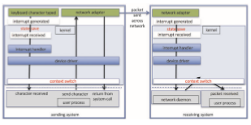
**Figure 12.16** Intercomputer communications.

Some systems use separate **front-end processors** for terminal I/O to reduce the interrupt burden on the main CPU. For instance, a **terminal concentrator** can multiplex the traffic from hundreds of remote terminals into one port on a large computer. An **I/O channel** is a dedicated, special-purpose CPU found in mainframes and in other high-end systems. The job of a channel is to offload I/Owork from themainCPU. The idea is that the channels keep the data flowing smoothly, while the main CPU remains free to process the data. Like the device controllers and DMA controllers found in smaller computers, a channel can process more general and sophisticated programs, so channels can be tuned for particular workloads.

We can employ several principles to improve the efficiency of I/O:

• Reduce the number of context switches.

• Reduce the number of times that data must be copied in memory while passing between device and application.

• Reduce the frequency of interrupts by using large transfers, smart con- trollers, and polling (if busy waiting can be minimized).

• Increase concurrency by using DMA-knowledgeable controllers or chan- nels to offload simple data copying from the CPU.

• Move processing primitives into hardware, to allow their operation in device controllers to be concurrent with CPU and bus operation.

• Balance CPU, memory subsystem, bus, and I/O performance, because an overload in any one area will cause idleness in others.

I/O devices vary greatly in complexity. For instance, a mouse is simple. The mousemovements and button clicks are converted into numeric values that are passed from hardware, through the mouse device driver, to the application. By contrast, the functionality provided by the Windows disk device driver is complex. It not onlymanages individual disks but also implements RAID arrays (Section 11.8). To do so, it converts an application’s read or write request into a coordinated set of disk I/O operations. Moreover, it implements sophisticated error-handling and data-recovery algorithms and takesmany steps to optimize disk performance.

Where should the I/O functionality be implemented—in the device hard- ware, in the device driver, or in application software? Sometimes we observe the progression depicted in Figure 12.17.

• Initially, we implement experimental I/O algorithms at the application level, because application code is flexible and application bugs are unlikely to cause system crashes. Furthermore, by developing code at the applica- tion level, we avoid the need to reboot or reload device drivers after every change to the code. An application-level implementation can be inefficient, however, because of the overhead of context switches and because the application cannot take advantage of internal kernel data structures and kernel functionality (such as efficient in-kernel messaging, threading, and locking). The FUSE system interface, for example, allows file systems to be written and run in user mode.

• When an application-level algorithm has demonstrated its worth, we may reimplement it in the kernel. This can improve performance, but the devel- opment effort is more challenging, because an operating-system kernel is a large, complex software system. Moreover, an in-kernel implementa- tion must be thoroughly debugged to avoid data corruption and system crashes.

• The highest performance may be obtained through a specialized imple- mentation in hardware, either in the device or in the controller. The disad- vantages of a hardware implementation include the difficulty and expense of making further improvements or of fixing bugs, the increased devel-
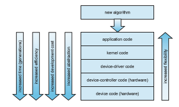

**Figure 12.17** Device functionality progression.  


**Figure 12.18** I/O performance of storage (and network latency).

opment time (months rather than days), and the decreased flexibility. For instance, a hardware RAID controller may not provide any means for the kernel to influence the order or location of individual block reads and writes, even if the kernel has special information about the workload that would enable it to improve the I/O performance.

Over time, as with other aspects of computing, I/O devices have been increasing in speed. Nonvolatile memory devices are growing in popularity and in the variety of devices available. The speed of NVM devices varies from high to extraordinary,with next-generationdevices nearing the speedof DRAM. These developments are increasing pressure on I/O subsystems as well as operating system algorithms to take advantage of the read/write speeds now available. Figure 12.18 shows CPU and storage devices in two dimensions: capacity and latency of I/O operations. Added to the figure is a representation of networking latency to reveal the performance “tax” networking adds to I/O.

## Summary

• The basic hardware elements involved in I/O are buses, device controllers, and the devices themselves.

• Thework ofmoving data between devices andmainmemory is performed by the CPU as programmed I/O or is offloaded to a DMA controller.

• The kernel module that controls a device is a device driver. The system- call interface provided to applications is designed to handle several basic categories of hardware, including block devices, character-stream devices, memory-mapped files, network sockets, and programmed interval timers. The system calls usually block the processes that issue them, but nonblock- ing and asynchronous calls are used by the kernel itself and by applications that must not sleep while waiting for an I/O operation to complete.  

**Practice Exercises 525**

• The kernel’s I/O subsystem provides numerous services. Among these are I/O scheduling, buffering, caching, spooling, device reservation, error han- dling. Another service, name translation, makes the connections between hardware devices and the symbolic file names used by applications. It involves several levels of mapping that translate from character-string names, to specific device drivers and device addresses, and then to phys- ical addresses of I/O ports or bus controllers. This mapping may occur within the file-systemname space, as it does inUNIX, or in a separate device name space, as it does in MS-DOS.

• STREAMS is an implementation and methodology that provides a frame- work for a modular and incremental approach to writing device drivers and network protocols. Through STREAMS, drivers can be stacked, with data passing through them sequentially and bidirectionally for processing.

• I/O system calls are costly in terms of CPU consumption because of the many layers of software between a physical device and an application. These layers imply overhead from several sources: context switching to cross the kernel’s protection boundary, signal and interrupt handling to service the I/O devices, and the load on the CPU and memory system to copy data between kernel buffers and application space.

**Practice Exercises**

**12.1** State three advantages of placing functionality in a device controller, rather than in the kernel. State three disadvantages.

**12.2** The example of handshaking in Section 12.2 used two bits: a busy bit and a command-ready bit. Is it possible to implement this handshaking with only one bit? If it is, describe the protocol. If it is not, explain why one bit is insufficient.

**12.3** Why might a system use interrupt-driven I/O to manage a single serial port and polling I/O tomanage a front-end processor, such as a terminal concentrator?

**12.4** Polling for an I/O completion can waste a large number of CPU cycles if the processor iterates a busy-waiting loop many times before the I/O completes. But if the I/Odevice is ready for service, polling can bemuch more efficient than catching and dispatching an interrupt. Describe a hybrid strategy that combines polling, sleeping, and interrupts for I/O device service. For each of these three strategies (pure polling, pure interrupts, hybrid), describe a computing environment in which that strategy is more efficient than either of the others.

**12.5** How does DMA increase system concurrency? How does it complicate hardware design?

**12.6** Why is it important to scale up system-bus and device speeds as CPU speed increases?

**12.7** Distinguish between a driver end and a stream module in a STREAMS operation.  


**Further Reading**

\[Hennessy and Patterson (2012)\] describe multiprocessor systems and cache- consistency issues. \[Intel (2011)\] is a good source of information for Intel pro- cessors.

Details about PCIe can be found at https://pcisig.com. For more about ACPI see http://www.acpi.info.

The use of FUSE for user-mode file systems can create performance prob- lems. An analysis of those issues can be found in https://www.usenix.org /conference/fast17/technical-sessions/presentation/vangoor.

**Bibliography**

**\[Hennessy and Patterson (2012)\]** J. Hennessy andD. Patterson, _Computer Archi- tecture: A Quantitative Approach,_ Fifth Edition, Morgan Kaufmann (2012).

**\[Intel (2011)\]** _Intel 64 and IA-32 Architectures Software Developer’s Manual, Com- bined Volumes: 1, 2A, 2B, 3A and 3B_. Intel Corporation (2011).  

**Exercises**

**Chapter 12 Exercises**

**12.8** When multiple interrupts from different devices appear at about the same time, a priority scheme could be used to determine the order in which the interrupts would be serviced. Discuss what issues need to be considered in assigning priorities to different interrupts.

**12.9** What are the advantages and disadvantages of supporting memory- mapped I/O to device-control registers?

**12.10** Consider the following I/O scenarios on a single-user PC:

a. Amouse used with a graphical user interface

b. A tape drive on a multitasking operating system (with no device preallocation available)

c. A disk drive containing user files

d. A graphics card with direct bus connection, accessible through memory-mapped I/O

For each of these scenarios, would you design the operating system to use buffering, spooling, caching, or a combination? Would you use polled I/O or interrupt-driven I/O? Give reasons for your choices.

**12.11** In most multiprogrammed systems, user programs access memory through virtual addresses, while the operating system uses raw physi- cal addresses to accessmemory.What are the implications of this design for the initiation of I/O operations by the user program and their exe- cution by the operating system?

**12.12** What are the various kinds of performance overhead associated with servicing an interrupt?

**12.13** Describe three circumstances under which blocking I/O should be used. Describe three circumstances under which nonblocking I/O should be used. Why not just implement nonblocking I/O and have processes busy-wait until their devices are ready?

**12.14** Typically, at the completion of a device I/O, a single interrupt is raised and appropriately handled by the host processor. In certain settings, however, the code that is to be executed at the completion of the I/O can be broken into two separate pieces. The first piece executes imme- diately after the I/O completes and schedules a second interrupt for the remaining piece of code to be executed at a later time. What is the purpose of using this strategy in the design of interrupt handlers?

**12.15** Some DMA controllers support direct virtual memory access, where the targets of I/O operations are specified as virtual addresses and a translation from virtual to physical address is performed during the DMA. How does this design complicate the design of the DMA controller? What are the advantages of providing such functionality?

**12.16** UNIX coordinates the activities of the kernel I/O components bymanip- ulating shared in-kernel data structures, whereasWindows uses object oriented message passing between kernel I/O components. Discuss three pros and three cons of each approach.

**12.17** Write (in pseudocode) an implementation of virtual clocks, including the queueing and management of timer requests for the kernel and applications. Assume that the hardware provides three timer channels.

**12.18** Discuss the advantages and disadvantages of guaranteeing reliable transfer of data between modules in the STREAMS abstraction.

**EX-47**