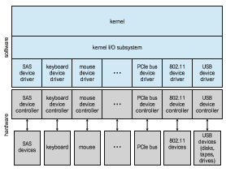
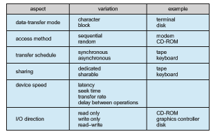

## Application I/O Interface

In this section, we discuss structuring techniques and interfaces for the oper- ating system that enable I/O devices to be treated in a standard, uniform way. We explain, for instance, how an application can open a file on a disk without  


**Figure 12.7** A kernel I/O structure.

knowing what kind of disk it is and how new disks and other devices can be added to a computer without disruption of the operating system.

Like other complex software-engineering problems, the approach here involves abstraction, encapsulation, and software layering. Specifically, we can abstract away the detailed differences in I/O devices by identifying a few gen- eral kinds. Each general kind is accessed through a standardized set of func- tions—an **interface**. The differences are encapsulated in kernelmodules called device drivers that internally are custom-tailored to specific devices but that export one of the standard interfaces. Figure 12.7 illustrates how the I/O-related portions of the kernel are structured in software layers.

The purpose of the device-driver layer is to hide the differences among device controllers from the I/O subsystem of the kernel, much as the I/O sys- tem calls encapsulate the behavior of devices in a few generic classes that hide hardware differences from applications. Making the I/O subsystem indepen- dent of the hardware simplifies the job of the operating-system developer. It also benefits the hardware manufacturers. They either design new devices to be compatible with an existing host controller interface (such as SATA), or they write device drivers to interface the new hardware to popular operating sys- tems. Thus, we can attach new peripherals to a computer without waiting for the operating-system vendor to develop support code.

Unfortunately for device-hardware manufacturers, each type of operating system has its own standards for the device-driver interface. A given device may ship with multiple device drivers—for instance, drivers for Windows, Linux, AIX, and macOS. Devices vary on many dimensions, as illustrated in Figure 12.8.  


**Figure 12.8** Characteristics of I/O devices.

• **Character-stream or block**. A character-stream device transfers bytes one by one, whereas a block device transfers a block of bytes as a unit.

• **Sequential or random access**. A sequential device transfers data in a fixed order determined by the device, whereas the user of a random-access device can instruct the device to seek to any of the available data storage locations.

• **Synchronous or asynchronous**. A synchronous device performs data transfers with predictable response times, in coordination with other aspects of the system. An asynchronous device exhibits irregular or unpredictable response times not coordinated with other computer events.

• **Sharable or dedicated**. A sharable device can be used concurrently by several processes or threads; a dedicated device cannot.

• **Speed of operation**. Device speeds range from a few bytes per second to gigabytes per second.

• **Read–write, read only, write once**. Some devices perform both input and output, but others support only one data transfer direction. Some allow data to be modified after write, but others can be written only once and are read-only thereafter.

For the purpose of application access, many of these differences are hidden by the operating system, and the devices are grouped into a few conventional types. The resulting styles of device access have been found to be useful and broadly applicable. Although the exact system callsmay differ across operating systems, the device categories are fairly standard. The major access conventions include block I/O, character-stream I/O, memory-mapped file access, and network sockets. Operating systems also provide special system calls to access a few additional devices, such as a time-of-day clock and a timer. Some oper- ating systems provide a set of system calls for graphical display, video, and audio devices.

Most operating systems also have an **escape** (or **back door**) that transpar- ently passes arbitrary commands from an application to a device driver. In UNIX, this system call is ioctl() (for “I/O control”). The ioctl() system call enables an application to access any functionality that can be implemented by any device driver, without the need to invent a new system call. The ioctl() system call has three arguments. The first is a device identifier that connects the application to the driver by referring to a hardware devicemanaged by that driver. The second is an integer that selects one of the commands implemented in the driver. The third is a pointer to an arbitrary data structure in memory that enables the application and driver to communicate any necessary control information or data.

The device identifier in UNIX and Linux is a tuple of “major and minor” device numbers. The major number is the device type, and the second is the instance of that device. For example, consider these SSD devices on a system. If one issues a command:

% ls -l /dev/sda\*

then the following output
```
brw-rw---- 1 root disk 8, 0 Mar 16 09:18 /dev/sda 
brw-rw---- 1 root disk 8, 1 Mar 16 09:18 /dev/sda1 
brw-rw---- 1 root disk 8, 2 Mar 16 09:18 /dev/sda2 
brw-rw---- 1 root disk 8, 3 Mar 16 09:18 /dev/sda3
```
shows that 8 is the major device number. The operating system uses that information to route I/O requests to the appropriate device driver. The minor numbers 0, 1, 2, and 3 indicate the instance of the device, allowing requests for I/O to a device entry to select the exact device for the request.

### Block and Character Devices

The**block-device interface** captures all the aspects necessary for accessing disk drives and other block-oriented devices. The device is expected to understand commands such as read() and write(). If it is a random-access device, it is also expected to have a seek() command to specify which block to trans- fer next. Applications normally access such a device through a file-system interface. We can see that read(), write(), and seek() capture the essential behaviors of block-storage devices, so that applications are insulated from the low-level differences among those devices.

The operating system itself, as well as special applications such as database-management systems, may prefer to access a block device as a simple linear array of blocks. This mode of access is sometimes called **raw I/O**. If the application performs its own buffering, then using a file system would cause extra, unneeded buffering. Likewise, if an application provides its own locking of blocks or regions, then any operating-system locking services would be redundant at the least and contradictory at the worst. To avoid  
these conflicts, raw-device access passes control of the device directly to the application, letting the operating system step out of the way. Unfortunately, no operating-system services are then performed on this device. A compromise that is becoming common is for the operating system to allow a mode of operation on a file that disables buffering and locking. In the UNIX world, this is called **direct I/O**.

Memory-mapped file access can be layered on top of block-device drivers. Rather than offering read and write operations, a memory-mapped interface provides access to disk storage via an array of bytes in main memory. The system call that maps a file into memory returns the virtual memory address that contains a copy of the file. The actual data transfers are performed only when needed to satisfy access to the memory image. Because the transfers are handled by the same mechanism as that used for demand-paged virtual memory access, memory-mapped I/O is efficient. Memory mapping is also convenient for programmers—access to a memory-mapped file is as simple as reading from and writing to memory. Operating systems that offer virtual memory commonly use themapping interface for kernel services. For instance, to execute a program, the operating system maps the executable into memory and then transfers control to the entry address of the executable. The mapping interface is also commonly used for kernel access to swap space on disk.

A keyboard is an example of a device that is accessed through a **character- stream interface**. The basic system calls in this interface enable an application to get() or put() one character. On top of this interface, libraries can be built that offer line-at-a-time access, with buffering and editing services (for example, when a user types a backspace, the preceding character is removed from the input stream). This style of access is convenient for input devices such as keyboards, mice, and modems that produce data for input “spontaneously” —that is, at times that cannot necessarily be predicted by the application. This access style is also good for output devices such as printers and audio boards, which naturally fit the concept of a linear stream of bytes.

### Network Devices

Because the performance and addressing characteristics of network I/O differ significantly from those of disk I/O, most operating systems provide a network I/O interface that is different from the read()–write()–seek() interface used for disks. One interface available in many operating systems, including UNIX and Windows, is the network **socket** interface.

Think of a wall socket for electricity: any electrical appliance can be plugged in. By analogy, the system calls in the socket interface enable an application to create a socket, to connect a local socket to a remote address (which plugs this application into a socket created by another application), to listen for any remote application to plug into the local socket, and to send and receive packets over the connection. To support the implementation of network servers, the socket interface also provides a function called select() that manages a set of sockets. A call to select() returns information about which sockets have a packet waiting to be received and which sockets have room to accept a packet to be sent. The use of select() eliminates the polling and busy waiting that would otherwise be necessary for network I/O. These functions encapsulate the essential behaviors of networks, greatly facilitating the creation of distributed applications that can use any underlying network hardware and protocol stack.

Many other approaches to interprocess communication and network com- munication have been implemented. For instance, Windows provides one interface to the network interface card and a second interface to the network protocols. In UNIX, which has a long history as a proving ground for network technology, we find half-duplex pipes, full-duplex FIFOs, full-duplex STREAMS, message queues, and sockets. Information on UNIX networking is given in Section C.9.

### Clocks and Timers

Most computers have hardware clocks and timers that provide three basic functions:

• Give the current time.

• Give the elapsed time.

• Set a timer to trigger operation _X_ at time _T._

These functions are used heavily by the operating system, as well as by time- sensitive applications. Unfortunately, the system calls that implement these functions are not standardized across operating systems.

The hardware to measure elapsed time and to trigger operations is called a **programmable interval timer**. It can be set to wait a certain amount of time and then generate an interrupt, and it can be set to do this once or to repeat the process to generate periodic interrupts. The scheduler uses this mechanism to generate an interrupt that will preempt a process at the end of its time slice. The disk I/O subsystem uses it to invoke the periodic flushing of dirty cache buffers to disk, and the network subsystem uses it to cancel operations that are proceeding too slowly because of network congestion or failures. The operating systemmay also provide an interface for user processes to use timers. The operating system can support more timer requests than the number of timer hardware channels by simulating virtual clocks. To do so, the kernel (or the timer device driver) maintains a list of interrupts wanted by its own routines and by user requests, sorted in earliest-time-first order. It sets the timer for the earliest time.When the timer interrupts, the kernel signals the requester and reloads the timer with the next earliest time.

Computers have clock hardware that is used for a variety of purposes. Modern PCs include a **high-performance event timer** (**HPET**), which runs at rates in the 10-megahertz range. It has several comparators that can be set to trigger once or repeatedly when the value they hold matches that of the HPET. The trigger generates an interrupt, and the operating system’s clock management routines determine what the timer was for and what action to take. The precision of triggers is limited by the resolution of the timer, together with the overhead of maintaining virtual clocks. Furthermore, if the timer ticks are used to maintain the system time-of-day clock, the system clock can drift. Drift can be corrected via protocols designed for that purpose, such as NTP, the **network time protocol**, which uses sophisticated latency calculations to keep a computer’s clock accurate almost to atomic-clock levels. In most computers,the hardware clock is constructed from a high-frequency counter. In some computers, the value of this counter can be read from adevice register, inwhich case the counter can be considered a high-resolution clock. Although this clock does not generate interrupts, it offers accurate measurements of time intervals.

### Nonblocking and Asynchronous I/O

Another aspect of the system-call interface relates to the choice between block- ing I/O and nonblocking I/O. When an application issues a **blocking** system call, the execution of the calling thread is suspended. The thread ismoved from the operating system’s run queue to a wait queue. After the system call com- pletes, the thread is moved back to the run queue, where it is eligible to resume execution. When it resumes execution, it will receive the values returned by the system call. The physical actions performed by I/O devices are generally asynchronous—they take a varying or unpredictable amount of time. Nev- ertheless, operating systems provide blocking system calls for the application interface, because blocking application code is easier towrite than nonblocking application code.

Some user-level processes need **nonblocking** I/O. One example is a user interface that receives keyboard and mouse input while processing and dis- playing data on the screen. Another example is a video application that reads frames from a file on diskwhile simultaneously decompressing and displaying the output on the display.

One way an application writer can overlap execution with I/O is to write a multithreaded application. Some threads can perform blocking system calls, while others continue executing. Some operating systems provide nonblocking I/O system calls. Anonblocking call does not halt the execution of the thread for an extended time. Instead, it returns quickly, with a return value that indicates how many bytes were transferred.

An alternative to a nonblocking system call is an asynchronous system call. An asynchronous call returns immediately, without waiting for the I/O to complete. The thread continues to execute its code. The completion of the I/O at some future time is communicated to the thread, either through the setting of some variable in the address space of the thread or through the triggering of a signal or software interrupt or a call-back routine that is executed outside the linear control flow of the thread. The difference between nonblocking and asynchronous system calls is that a nonblocking read() returns immediately with whatever data are available—the full number of bytes requested, fewer, or none at all. An asynchronous read() call requests a transfer that will be performed in its entirety but will complete at some future time. These two I/O methods are shown in Figure 12.9.

Asynchronous activities occur throughout modern operating systems. Fre- quently, they are not exposed to users or applications but rather are contained within the operating-system operation. Secondary storage device and network I/O are useful examples. By default, when an application issues a network send request or a storage device write request, the operating system notes the request, buffers the I/O, and returns to the application. When possible, to optimize overall system performance, the operating system completes the request. If a system failure occurs in the interim, the application will lose any “in-flight” requests. Therefore, operating systems usually put a limit on how  


**Figure 12.9** Two I/O methods: (a) synchronous and (b) asynchronous.

long they will buffer a request. Some versions of UNIX flush their secondary storage buffers every 30 seconds, for example, or each request is flushedwithin 30 seconds of its occurrence. Systems provide a way to allow applications to request a flush of some buffers (like secondary storage buffers) so the data can be forced to secondary storage without waiting for the buffer flush interval. Data consistency within applications is maintained by the kernel, which reads data from its buffers before issuing I/O requests to devices, ensuring that data not yet written are nevertheless returned to a requesting reader. Note that mul- tiple threads performing I/O to the same file might not receive consistent data, depending on how the kernel implements its I/O. In this situation, the threads may need to use locking protocols. Some I/O requests need to be performed immediately, so I/O system calls usually have a way to indicate that a given request, or I/O to a specific device, should be performed synchronously.

A good example of nonblocking behavior is the select() system call for network sockets. This system call takes an argument that specifies a maxi- mum waiting time. By setting it to 0, a thread can poll for network activity without blocking. But using select() introduces extra overhead, because the select() call only checks whether I/O is possible. For a data transfer, select() must be followed by some kind of read() or write() command. A variation on this approach, found in Mach, is a blocking multiple-read call. It specifies desired reads for several devices in one system call and returns as soon as any one of them completes.

### Vectored I/O

Some operating systems provide another major variation of I/O via their appli- cation interfaces. **Vectored I/O** allows one system call to perform multiple I/O operations involving multiple locations. For example, the UNIX readv sys- tem call accepts a vector of multiple buffers and either reads from a source to that vector or writes from that vector to a destination. The same transfer could be caused by several individual invocations of system calls, but this **scatter–gather** method is useful for a variety of reasons.

Multiple separate buffers can have their contents transferred via one sys- tem call, avoiding context-switching and system-call overhead. Without vec- tored I/O, the data might first need to be transferred to a larger buffer in the right order and then transmitted, which is inefficient. In addition, some versions of scatter–gather provide atomicity, assuring that all the I/O is done without interruption (and avoiding corruption of data if other threads are also performing I/O involving those buffers). When possible, programmers make use of scatter–gather I/O features to increase throughput and decrease system overhead.
