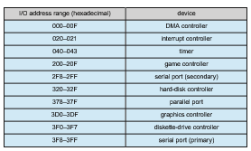
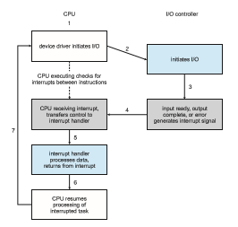
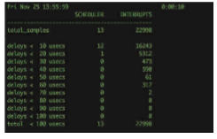
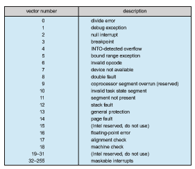

## I/O Hardware

Computers operate a great many kinds of devices. Most fit into the general categories of storage devices (disks, tapes), transmission devices (network con- nections, Bluetooth), and human-interface devices (screen, keyboard, mouse, audio in and out). Other devices are more specialized, such as those involved in the steering of a jet. In these aircraft, a human gives input to the flight com- puter via a joystick and foot pedals, and the computer sends output commands that cause motors to move rudders and flaps and fuels to the engines. Despite the incredible variety of I/O devices, though, we need only a few concepts to understand how the devices are attached and how the software can control the hardware.

A device communicates with a computer system by sending signals over a cable or even through the air. The device communicates with the machine via a connection point, or **port**—for example, a serial port. (The term **PHY**, shorthand for the OSI model physical layer, is also used in reference to ports but is more common in data-center nomenclature.) If devices share a common set of wires, the connection is called a bus. A**bus**, like the PCI bus used in most computers today, is a set of wires and a rigidly defined protocol that specifies a set of messages that can be sent on the wires. In terms of the electronics, the messages are conveyed by patterns of electrical voltages applied to the wires with defined timings. When device _A_ has a cable that plugs into device _B,_ and device _B_ has a cable that plugs into device _C,_ and device _C_ plugs into a port on the computer, this arrangement is called a **daisy chain**. A daisy chain usually operates as a bus.

Buses are used widely in computer architecture and vary in their signal- ing methods, speed, throughput, and connection methods. A typical PC bus structure appears in Figure 12.1. In the figure, a **PCIe bus** (the common PC system bus) connects the processor–memory subsystem to fast devices, and an **expansion bus** connects relatively slow devices, such as the keyboard and serial and USB ports. In the lower-left portion of the figure, four disks are connected together on a **serial-attached SCSI** (**SAS**) bus plugged into an SAS controller. PCIe is a flexible bus that sends data over one or more “lanes.” A lane is composed of two signaling pairs, one pair for receiving data and the other for transmitting. Each lane is therefore composed of four wires, and each  

**Figure 12.1** A typical PC bus structure.

lane is used as a full-duplex byte stream, transporting data packets in an eight- bit byte format simultaneously in both directions. Physically, PCIe links may contain 1, 2, 4, 8, 12, 16, or 32 lanes, as signified by an “x” prefix. A PCIe card or connector that uses 8 lanes is designated x8, for example. In addition, PCIe has gone through multiple “generations,” with more coming in the future. Thus, for example, a card might be “PCIe gen3 x8”, which means it works with gen- eration 3 of PCIe and uses 8 lanes. Such a device has maximum throughput of 8 gigabytes per second. Details about PCIe can be found at https://pcisig.com.

A **controller** is a collection of electronics that can operate a port, a bus, or a device. A serial-port controller is a simple device controller. It is a single chip (or portion of a chip) in the computer that controls the signals on the wires of a serial port. By contrast, a **fibr channel** (**FC**) bus controller is not simple. Because the FC protocol is complex and used in data centers rather than on PCs, the FC bus controller is often implemented as a separate circuit board —or a **host bus adapter** (**HBA**)—that connects to a bus in the computer. It typically contains a processor, microcode, and some private memory to enable it to process the FC protocol messages. Some devices have their own built-in controllers. If you look at a disk drive, you will see a circuit board attached to one side. This board is the disk controller. It implements the disk side of the protocol for some kinds of connection—SAS and SATA, for instance. It has microcode and a processor to do many tasks, such as bad-sector mapping, prefetching, buffering, and caching.

### Memory-Mapped I/O

Howdoes the processor give commands and data to a controller to accomplish an I/O transfer? The short answer is that the controller has one ormore registers for data and control signals. The processor communicates with the controller by reading and writing bit patterns in these registers. One way in which this communication can occur is through the use of special I/O instructions  

**Figure 12.2** Device I/O port locations on PCs (partial).

that specify the transfer of a byte or a word to an I/O port address. The I/O instruction triggers bus lines to select the proper device and tomove bits into or out of a device register. Alternatively, the device can support **memory-mapped I/O**. In this case, the device-control registers are mapped into the address space of the processor. The CPU executes I/O requests using the standard data- transfer instructions to read and write the device-control registers at their mapped locations in physical memory.

In the past, PCs often used I/O instructions to control some devices and memory-mapped I/O to control others. Figure 12.2 shows the usual I/O port addresses for PCs. The graphics controller has I/O ports for basic control operations, but the controller has a large memory-mapped region to hold screen contents. A thread sends output to the screen by writing data into the memory-mapped region. The controller generates the screen image based on the contents of this memory. This technique is simple to use. Moreover, writing millions of bytes to the graphics memory is faster than issuing mil- lions of I/O instructions. Therefore, over time, systems have moved toward memory-mapped I/O. Today,most I/O is performedbydevice controllers using memory-mapped I/O.

I/O device control typically consists of four registers, called the status, control, data-in, and data-out registers.

• The **data-in register** is read by the host to get input.

• The **data-out register** is written by the host to send output.

• The **status register** contains bits that can be read by the host. These bits indicate states, such as whether the current command has completed, whether a byte is available to be read from the data-in register, andwhether a device error has occurred.

• The **control register** can be written by the host to start a command or to change the mode of a device. For instance, a certain bit in the control register of a serial port chooses between full-duplex and half-duplex communication, another bit enables parity checking, a third bit sets the word length to 7 or 8 bits, and other bits select one of the speeds supported by the serial port.

The data registers are typically 1 to 4 bytes in size. Some controllers have FIFO chips that can hold several bytes of input or output data to expand the capacity of the controller beyond the size of the data register. A FIFO chip can hold a small burst of data until the device or host is able to receive those data.

### Polling

The complete protocol for interaction between the host and a controller can be intricate, but the basic handshaking notion is simple. We explain hand- shaking with an example. Assume that 2 bits are used to coordinate the producer–consumer relationship between the controller and the host. The con- troller indicates its state through the busy bit in the status register. (Recall that to **_set_** a bit means to write a 1 into the bit and to **_clear_** a bit means to write a 0 into it.) The controller sets the busy bit when it is busy working and clears the busy bit when it is ready to accept the next command. The host signals its wishes via the command-ready bit in the command register. The host sets the command-ready bit when a command is available for the controller to execute. For this example, the host writes output through a port, coordinating with the controller by handshaking as follows.

**1\.** The host repeatedly reads the busy bit until that bit becomes clear.

**2\.** The host sets the write bit in the command register and writes a byte into the data-out register.

**3\.** The host sets the command-ready bit.

**4\.** When the controller notices that the command-ready bit is set, it sets the busy bit.

**5\.** The controller reads the command register and sees the write command. It reads the data-out register to get the byte and does the I/O to the device.

**6\.** The controller clears the command-ready bit, clears the error bit in the status register to indicate that the device I/O succeeded, and clears the busy bit to indicate that it is finished.

This loop is repeated for each byte. In step 1, the host is **busy-waiting** or **polling**: it is in a loop, reading the status register over and over until the busy bit becomes clear. If the controller and device are fast, thismethod is a reasonable one. But if thewaitmay be long, the host should probably switch to another task.How, then, does the host know when the controller has become idle? For some devices, the host must service the device quickly, or data will be lost. For instance, when data are streaming in on a serial port or from a keyboard, the small buffer on the controller will overflow and datawill be lost if the host waits too long before returning to read the bytes.  

In many computer architectures, three CPU-instruction cycles are sufficient to poll a device: read a device register, logical-and to extract a status bit, and branch if not zero. Clearly, the basic polling operation is efficient. But polling becomes inefficient when it is attempted repeatedly yet rarely finds a device ready for service, while other useful CPU processing remains undone. In such instances, it may be more efficient to arrange for the hardware controller to notify the CPU when the device becomes ready for service, rather than to require the CPU to poll repeatedly for an I/O completion. The hardware mechanism that enables a device to notify the CPU is called an **interrupt**.

### Interrupts

The basic interrupt mechanism works as follows. The CPU hardware has a wire called the **interrupt-request line** that the CPU senses after executing every instruction. When the CPU detects that a controller has asserted a signal on the interrupt-request line, the CPU performs a state save and jumps to the **interrupt-handler routine** at a fixed address in memory. The interrupt han- dler determines the cause of the interrupt, performs the necessary processing, performs a state restore, and executes a return from interrupt instruction to return the CPU to the execution state prior to the interrupt. We say that the device controller **_raises_** an interrupt by asserting a signal on the interrupt request line, the CPU **_catches_** the interrupt and **_dispatches_** it to the interrupt

**Figure 12.3** Interrupt-driven I/O cycle.  

**Figure 12.4** Latency command on Mac OS X.

handler, and the handler **_clears_** the interrupt by servicing the device. Figure 12.3 summarizes the interrupt-driven I/O cycle.

We stress interrupt management in this chapter because even single-user modern systems manage hundreds of interrupts per second and servers hun- dreds of thousands per second. For example, Figure 12.4 shows the latency command output on macOS, revealing that over ten seconds a quiet desktop computer performed almost 23,000 interrupts.

The basic interruptmechanism just described enables the CPU to respond to an asynchronous event, as when a device controller becomes ready for service. In amodern operating system, however,we needmore sophisticated interrupt- handling features.

**1\.** We need the ability to defer interrupt handling during critical processing.

**2\.** We need an efficient way to dispatch to the proper interrupt handler for a device without first polling all the devices to see which one raised the interrupt.

**3\.** We need multilevel interrupts, so that the operating system can distin- guish between high- and low-priority interrupts and can respond with the appropriate degree of urgency when there are multiple concurrent interrupts.

**4\.** We need a way for an instruction to get the operating system’s atten- tion directly (separately from I/O requests), for activities such as page faults and errors such as division by zero. As we shall see, this task is accomplished by “traps.”

In modern computer hardware, these features are provided by the CPU and by the **interrupt-controller hardware**.

Most CPUs have two interrupt request lines. One is the **nonmaskable interrupt**, which is reserved for events such as unrecoverable memory errors. The second interrupt line is **maskable**: it can be turned off by the CPU before the execution of critical instruction sequences thatmust not be interrupted. The maskable interrupt is used by device controllers to request service.

The interrupt mechanism accepts an **address**—a number that selects a specific interrupt-handling routine from a small set. In most architectures, this address is an offset in a table called the **interrupt vector**. This vector contains the memory addresses of specialized interrupt handlers. The purpose of a vectored interrupt mechanism is to reduce the need for a single interrupt handler to search all possible sources of interrupts to determine which one needs service. In practice, however, computers have more devices (and, hence, interrupt handlers) than they have address elements in the interrupt vector. A common way to solve this problem is to use **interrupt chaining**, in which each element in the interrupt vector points to the head of a list of interrupt handlers. When an interrupt is raised, the handlers on the corresponding list are called one by one, until one is found that can service the request. This structure is a compromise between the overhead of a huge interrupt table and the inefficiency of dispatching to a single interrupt handler.

Figure 12.5 illustrates the design of the interrupt vector for the Intel Pen- tium processor. The events from 0 to 31, which are nonmaskable, are used to signal various error conditions (which cause system crashes), page faults (needing immediate action), and debugging requests (stopping normal opera- tion and jumping to a debugger application). The events from 32 to 255, which are maskable, are used for purposes such as device-generated interrupts.

**Figure 12.5** Intel Pentium processor event-vector table.  

The interrupt mechanism also implements a system of **interrupt priority levels**. These levels enable the CPU to defer the handling of low-priority inter- rupts without masking all interrupts and make it possible for a high-priority interrupt to preempt the execution of a low-priority interrupt.

Amodern operating system interacts with the interruptmechanism in sev- eral ways. At boot time, the operating system probes the hardware buses to determine what devices are present and installs the corresponding interrupt handlers into the interrupt vector. During I/O, the various device controllers raise interrupts when they are ready for service. These interrupts signify that output has completed, or that input data are available, or that a failure has been detected. The interrupt mechanism is also used to handle a wide variety of **exceptions**, such as dividing by zero, accessing a protected or nonexis- tent memory address, or attempting to execute a privileged instruction from user mode. The events that trigger interrupts have a common property: they are occurrences that induce the operating system to execute an urgent, self- contained routine.

Because interrupt handing in many cases is time and resource constrained and therefore complicated to implement, systems frequently split interrupt management between a **first-leve interrupt handler** (**FLIH**) and a **second-level interrupt handler** (**SLIH**). The FLIH performs the context switch, state storage, and queuing of a handling operation, while the separately scheduled SLIH performs the handling of the requested operation.

Operating systems have other good uses for interrupts as well. For exam- ple, many operating systems use the interrupt mechanism for virtual memory paging. A page fault is an exception that raises an interrupt. The interrupt suspends the current process and jumps to the page-fault handler in the ker- nel. This handler saves the state of the process, moves the process to the wait queue, performs page-cache management, schedules an I/O operation to fetch the page, schedules another process to resume execution, and then returns from the interrupt.

Another example is found in the implementation of system calls. Usually, a program uses library calls to issue system calls. The library routines check the arguments given by the application, build a data structure to convey the argu- ments to the kernel, and then execute a special instruction called a **software interrupt**, or **trap**. This instruction has an operand that identifies the desired kernel service.When a process executes the trap instruction, the interrupt hard- ware saves the state of the user code, switches to kernel mode, and dispatches to the kernel routine or thread that implements the requested service. The trap is given a relatively low interrupt priority compared with those assigned to device interrupts—executing a system call on behalf of an application is less urgent than servicing a device controller before its FIFO queue overflows and loses data.

Interrupts can also be used to manage the flow of control within the ker- nel. For example, consider the case of the processing required to complete a disk read. One step may copy data from kernel space to the user buffer. This copying is time consuming but not urgent—it should not block other high- priority interrupt handling. Another step is to start the next pending I/O for that disk drive. This step has higher priority. If the disks are to be used effi- ciently, we need to start the next I/O as soon as the previous one completes. Consequently, a pair of interrupt handlers implements the kernel code that completes a disk read. The high-priority handler records the I/O status, clears the device interrupt, starts the next pending I/O, and raises a low-priority interrupt to complete the work. Later, when the CPU is not occupied with high- prioritywork, the low-priority interruptwill be dispatched. The corresponding handler completes the user-level I/O by copying data from kernel buffers to the application space and then calling the scheduler to place the application on the ready queue.

A threaded kernel architecture is well suited to implement multiple inter- rupt priorities and to enforce the precedence of interrupt handling over back- ground processing in kernel and application routines. We illustrate this point with the Solaris kernel. In Solaris, interrupt handlers are executed as kernel threads. A range of high scheduling priorities is reserved for these threads. These priorities give interrupt handlers precedence over application code and kernel housekeeping and implement the priority relationships among inter- rupt handlers. The priorities cause the Solaris thread scheduler to preempt low- priority interrupt handlers in favor of higher-priority ones, and the threaded implementation enablesmultiprocessor hardware to run several interrupt han- dlers concurrently. We describe the interrupt architecture of Linux in Chapter 20, Windows10 in Chapter 21, and UNIX in Appendix C.

In summary, interrupts are used throughout modern operating systems to handle asynchronous events and to trap to supervisor-mode routines in the kernel. To enable the most urgent work to be done first, modern computers use a system of interrupt priorities. Device controllers, hardware faults, and system calls all raise interrupts to trigger kernel routines. Because interrupts are used so heavily for time-sensitive processing, efficient interrupt handling is required for good system performance. Interrupt-driven I/O is now much more common than polling, with polling being used for high-throughput I/O. Sometimes the two are used together. Some device drivers use interruptswhen the I/O rate is low and switch to polling when the rate increases to the point where polling is faster and more efficient.

### Direct Memory Access

For a device that does large transfers, such as a disk drive, it seems waste- ful to use an expensive general-purpose processor to watch status bits and to feed data into a controller register one byte at a time—a process termed **programmed I/O** (**PIO**). Computers avoid burdening the main CPU with PIO by offloading some of this work to a special-purpose processor called a **direct- memory-access** (**DMA**) controller. To initiate a DMA transfer, the host writes a DMA command block into memory. This block contains a pointer to the source of a transfer, a pointer to the destination of the transfer, and a count of the number of bytes to be transferred. A command block can be more complex, including a list of sources and destinations addresses that are not contiguous. This **scatter–gather** method allows multiple transfers to be executed via a sin- gle DMA command. The CPU writes the address of this command block to the DMA controller, then goes on with other work. The DMA controller proceeds to operate the memory bus directly, placing addresses on the bus to perform transfers without the help of the main CPU. A simple DMA controller is a stan- dard component in all modern computers, from smartphones to mainframes.  

Note that it is most straightforward for the target address to be in kernel address space. If it were in user space, the user could, for example, modify the contents of that space during the transfer, losing some set of data. To get the DMA-transferred data to the user space for thread access, however, a second copy operation, this time from kernel memory to user memory, is needed. This **double buffering** is inefficient. Over time, operating systems have moved to using memory-mapping (see Section 12.2.1) to perform I/O transfers directly between devices and user address space.

Handshaking between the DMA controller and the device controller is performed via a pair of wires called **DMA-request** and **DMA-acknowledge**. The device controller places a signal on the DMA-request wire when a word of data is available for transfer. This signal causes the DMA controller to seize the memory bus, place the desired address on thememory-addresswire, and place a signal on the DMA-acknowledgewire.When the device controller receives the DMA-acknowledge signal, it transfers theword of data tomemory and removes the DMA-request signal.

When the entire transfer is finished, the DMA controller interrupts the CPU. This process is depicted in Figure 12.6. When the DMA controller seizes the memory bus, the CPU is momentarily prevented from accessing main mem- ory, although it can still access data items in its caches. Although this **cycle stealing** can slow down the CPU computation, offloading the data-transfer work to a DMA controller generally improves the total system performance. Some computer architectures use physical memory addresses for DMA, but

**Figure 12.6** Steps in a DMA transfer.  

others perform **direct virtual memory access** (**DVMA**), using virtual addresses that undergo translation to physical addresses. DVMA can perform a transfer between two memory-mapped devices without the intervention of the CPU or the use of main memory.

On protected-mode kernels, the operating system generally prevents pro- cesses from issuing device commands directly. This discipline protects data from access-control violations and also protects the system from erroneous use of device controllers, which could cause a system crash. Instead, the operat- ing system exports functions that a sufficiently privileged process can use to access low-level operations on the underlying hardware. On kernels without memory protection, processes can access device controllers directly. This direct access can be used to achieve high performance, since it can avoid kernel com- munication, context switches, and layers of kernel software. Unfortunately, it interferes with system security and stability. Common general-purpose oper- ating systems protect memory and devices so that the system can try to guard against erroneous or malicious applications.

### I/O Hardware Summary

Although the hardware aspects of I/O are complex when considered at the level of detail of electronics-hardware design, the concepts that we have just described are sufficient to enable us to understand many I/O features of oper- ating systems. Let’s review the main concepts:

• A bus

• A controller

• An I/O port and its registers

• The handshaking relationship between the host and a device controller

• The execution of this handshaking in a polling loop or via interrupts

• The offloading of this work to a DMA controller for large transfers

We gave a basic example of the handshaking that takes place between a device controller and the host earlier in this section. In reality, the wide variety of available devices poses a problem for operating-system implementers. Each kind of device has its own set of capabilities, control-bit definitions, and pro- tocols for interacting with the host—and they are all different. How can the operating system be designed so that we can attach new devices to the com- puter without rewriting the operating system? And when the devices vary so widely, how can the operating system give a convenient, uniform I/O interface to applications? We address those questions next.
