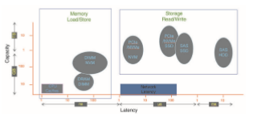

## Performance

I/O is a major factor in system performance. It places heavy demands on the CPU to execute device-driver code and to schedule processes fairly and efficiently as they block and unblock. The resulting context switches stress the CPU and its hardware caches. I/O also exposes any inefficiencies in the interrupt-handling mechanisms in the kernel. In addition, I/O loads down the memory bus during data copies between controllers and physical memory and again during copies between kernel buffers and application data space. Coping gracefully with all these demands is one of the major concerns of a computer architect.

Althoughmodern computers can handlemany thousands of interrupts per second, interrupt handling is a relatively expensive task. Each interrupt causes the system to perform a state change, to execute the interrupt handler, and then to restore state. Programmed I/O can be more efficient than interrupt- driven I/O, if the number of cycles spent in busy waiting is not excessive. An I/O completion typically unblocks a process, leading to the full overhead of a context switch.

Network traffic can also cause a high context-switch rate. Consider, for instance, a remote login from one machine to another. Each character typed on the local machine must be transported to the remote machine. On the local machine, the character is typed; a keyboard interrupt is generated; and the character is passed through the interrupt handler to the device driver, to the kernel, and then to the user process. The user process issues a network I/O system call to send the character to the remote machine. The character then flows into the local kernel, through the network layers that construct a network packet, and into the network device driver. The network device driver transfers the packet to the network controller, which sends the character and generates an interrupt. The interrupt is passed back up through the kernel to cause the network I/O system call to complete.

Now, the remote system’s network hardware receives the packet, and an interrupt is generated. The character is unpacked from the network proto- cols and is given to the appropriate network daemon. The network daemon identifies which remote login session is involved and passes the packet to the appropriate subdaemon for that session. Throughout this flow, there are con- text switches and state switches (Figure 12.16). Usually, the receiver echoes the character back to the sender; that approach doubles the work.  

**Figure 12.16** Intercomputer communications.

Some systems use separate **front-end processors** for terminal I/O to reduce the interrupt burden on the main CPU. For instance, a **terminal concentrator** can multiplex the traffic from hundreds of remote terminals into one port on a large computer. An **I/O channel** is a dedicated, special-purpose CPU found in mainframes and in other high-end systems. The job of a channel is to offload I/Owork from themainCPU. The idea is that the channels keep the data flowing smoothly, while the main CPU remains free to process the data. Like the device controllers and DMA controllers found in smaller computers, a channel can process more general and sophisticated programs, so channels can be tuned for particular workloads.

We can employ several principles to improve the efficiency of I/O:

• Reduce the number of context switches.

• Reduce the number of times that data must be copied in memory while passing between device and application.

• Reduce the frequency of interrupts by using large transfers, smart con- trollers, and polling (if busy waiting can be minimized).

• Increase concurrency by using DMA-knowledgeable controllers or chan- nels to offload simple data copying from the CPU.

• Move processing primitives into hardware, to allow their operation in device controllers to be concurrent with CPU and bus operation.

• Balance CPU, memory subsystem, bus, and I/O performance, because an overload in any one area will cause idleness in others.

I/O devices vary greatly in complexity. For instance, a mouse is simple. The mousemovements and button clicks are converted into numeric values that are passed from hardware, through the mouse device driver, to the application. By contrast, the functionality provided by the Windows disk device driver is complex. It not onlymanages individual disks but also implements RAID arrays (Section 11.8). To do so, it converts an application’s read or write request into a coordinated set of disk I/O operations. Moreover, it implements sophisticated error-handling and data-recovery algorithms and takesmany steps to optimize disk performance.

Where should the I/O functionality be implemented—in the device hard- ware, in the device driver, or in application software? Sometimes we observe the progression depicted in Figure 12.17.

• Initially, we implement experimental I/O algorithms at the application level, because application code is flexible and application bugs are unlikely to cause system crashes. Furthermore, by developing code at the applica- tion level, we avoid the need to reboot or reload device drivers after every change to the code. An application-level implementation can be inefficient, however, because of the overhead of context switches and because the application cannot take advantage of internal kernel data structures and kernel functionality (such as efficient in-kernel messaging, threading, and locking). The FUSE system interface, for example, allows file systems to be written and run in user mode.

• When an application-level algorithm has demonstrated its worth, we may reimplement it in the kernel. This can improve performance, but the devel- opment effort is more challenging, because an operating-system kernel is a large, complex software system. Moreover, an in-kernel implementa- tion must be thoroughly debugged to avoid data corruption and system crashes.

• The highest performance may be obtained through a specialized imple- mentation in hardware, either in the device or in the controller. The disad- vantages of a hardware implementation include the difficulty and expense of making further improvements or of fixing bugs, the increased devel-

**Figure 12.17** Device functionality progression.  

**Figure 12.18** I/O performance of storage (and network latency).

opment time (months rather than days), and the decreased flexibility. For instance, a hardware RAID controller may not provide any means for the kernel to influence the order or location of individual block reads and writes, even if the kernel has special information about the workload that would enable it to improve the I/O performance.

Over time, as with other aspects of computing, I/O devices have been increasing in speed. Nonvolatile memory devices are growing in popularity and in the variety of devices available. The speed of NVM devices varies from high to extraordinary,with next-generationdevices nearing the speedof DRAM. These developments are increasing pressure on I/O subsystems as well as operating system algorithms to take advantage of the read/write speeds now available. Figure 12.18 shows CPU and storage devices in two dimensions: capacity and latency of I/O operations. Added to the figure is a representation of networking latency to reveal the performance “tax” networking adds to I/O.

## Summary

• The basic hardware elements involved in I/O are buses, device controllers, and the devices themselves.

• Thework ofmoving data between devices andmainmemory is performed by the CPU as programmed I/O or is offloaded to a DMA controller.

• The kernel module that controls a device is a device driver. The system- call interface provided to applications is designed to handle several basic categories of hardware, including block devices, character-stream devices, memory-mapped files, network sockets, and programmed interval timers. The system calls usually block the processes that issue them, but nonblock- ing and asynchronous calls are used by the kernel itself and by applications that must not sleep while waiting for an I/O operation to complete.  

**Practice Exercises 525**

• The kernel’s I/O subsystem provides numerous services. Among these are I/O scheduling, buffering, caching, spooling, device reservation, error han- dling. Another service, name translation, makes the connections between hardware devices and the symbolic file names used by applications. It involves several levels of mapping that translate from character-string names, to specific device drivers and device addresses, and then to phys- ical addresses of I/O ports or bus controllers. This mapping may occur within the file-systemname space, as it does inUNIX, or in a separate device name space, as it does in MS-DOS.

• STREAMS is an implementation and methodology that provides a frame- work for a modular and incremental approach to writing device drivers and network protocols. Through STREAMS, drivers can be stacked, with data passing through them sequentially and bidirectionally for processing.

• I/O system calls are costly in terms of CPU consumption because of the many layers of software between a physical device and an application. These layers imply overhead from several sources: context switching to cross the kernel’s protection boundary, signal and interrupt handling to service the I/O devices, and the load on the CPU and memory system to copy data between kernel buffers and application space.

**Practice Exercises**

**12.1** State three advantages of placing functionality in a device controller, rather than in the kernel. State three disadvantages.

**12.2** The example of handshaking in Section 12.2 used two bits: a busy bit and a command-ready bit. Is it possible to implement this handshaking with only one bit? If it is, describe the protocol. If it is not, explain why one bit is insufficient.

**12.3** Why might a system use interrupt-driven I/O to manage a single serial port and polling I/O tomanage a front-end processor, such as a terminal concentrator?

**12.4** Polling for an I/O completion can waste a large number of CPU cycles if the processor iterates a busy-waiting loop many times before the I/O completes. But if the I/Odevice is ready for service, polling can bemuch more efficient than catching and dispatching an interrupt. Describe a hybrid strategy that combines polling, sleeping, and interrupts for I/O device service. For each of these three strategies (pure polling, pure interrupts, hybrid), describe a computing environment in which that strategy is more efficient than either of the others.

**12.5** How does DMA increase system concurrency? How does it complicate hardware design?

**12.6** Why is it important to scale up system-bus and device speeds as CPU speed increases?

**12.7** Distinguish between a driver end and a stream module in a STREAMS operation.  

**Further Reading**

\[Hennessy and Patterson (2012)\] describe multiprocessor systems and cache- consistency issues. \[Intel (2011)\] is a good source of information for Intel pro- cessors.

Details about PCIe can be found at https://pcisig.com. For more about ACPI see http://www.acpi.info.

The use of FUSE for user-mode file systems can create performance prob- lems. An analysis of those issues can be found in https://www.usenix.org /conference/fast17/technical-sessions/presentation/vangoor.

**Bibliography**

**\[Hennessy and Patterson (2012)\]** J. Hennessy andD. Patterson, _Computer Archi- tecture: A Quantitative Approach,_ Fifth Edition, Morgan Kaufmann (2012).

**\[Intel (2011)\]** _Intel 64 and IA-32 Architectures Software Developer’s Manual, Com- bined Volumes: 1, 2A, 2B, 3A and 3B_. Intel Corporation (2011).  

**Exercises**

**Chapter 12 Exercises**

**12.8** When multiple interrupts from different devices appear at about the same time, a priority scheme could be used to determine the order in which the interrupts would be serviced. Discuss what issues need to be considered in assigning priorities to different interrupts.

**12.9** What are the advantages and disadvantages of supporting memory- mapped I/O to device-control registers?

**12.10** Consider the following I/O scenarios on a single-user PC:

a. Amouse used with a graphical user interface

b. A tape drive on a multitasking operating system (with no device preallocation available)

c. A disk drive containing user files

d. A graphics card with direct bus connection, accessible through memory-mapped I/O

For each of these scenarios, would you design the operating system to use buffering, spooling, caching, or a combination? Would you use polled I/O or interrupt-driven I/O? Give reasons for your choices.

**12.11** In most multiprogrammed systems, user programs access memory through virtual addresses, while the operating system uses raw physi- cal addresses to accessmemory.What are the implications of this design for the initiation of I/O operations by the user program and their exe- cution by the operating system?

**12.12** What are the various kinds of performance overhead associated with servicing an interrupt?

**12.13** Describe three circumstances under which blocking I/O should be used. Describe three circumstances under which nonblocking I/O should be used. Why not just implement nonblocking I/O and have processes busy-wait until their devices are ready?

**12.14** Typically, at the completion of a device I/O, a single interrupt is raised and appropriately handled by the host processor. In certain settings, however, the code that is to be executed at the completion of the I/O can be broken into two separate pieces. The first piece executes imme- diately after the I/O completes and schedules a second interrupt for the remaining piece of code to be executed at a later time. What is the purpose of using this strategy in the design of interrupt handlers?

**12.15** Some DMA controllers support direct virtual memory access, where the targets of I/O operations are specified as virtual addresses and a translation from virtual to physical address is performed during the DMA. How does this design complicate the design of the DMA controller? What are the advantages of providing such functionality?

**12.16** UNIX coordinates the activities of the kernel I/O components bymanip- ulating shared in-kernel data structures, whereasWindows uses object oriented message passing between kernel I/O components. Discuss three pros and three cons of each approach.

**12.17** Write (in pseudocode) an implementation of virtual clocks, including the queueing and management of timer requests for the kernel and applications. Assume that the hardware provides three timer channels.

**12.18** Discuss the advantages and disadvantages of guaranteeing reliable transfer of data between modules in the STREAMS abstraction.

**EX-47**