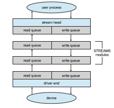

## STREAMS

UNIX System V (and many subsequent UNIX releases) has an interesting mech- anism, called **STREAMS**, that enables an application to assemble pipelines of driver code dynamically. Astream is a full-duplex connection between a device driver and a user-level process. It consists of a **stream head** that interfaces with the user process, a **driver end** that controls the device, and zero or more **stream modules** between the stream head and the driver end. Each of these compo- nents contains a pair of queues—a read queue and a write queue. Message passing is used to transfer data between queues. The STREAMS structure is shown in Figure 12.15.

Modules provide the functionality of STREAMS processing; they are **_pushed_** onto a stream by use of the ioctl() system call. For example, a process can open a USB device (like a keyboard) via a stream and can push on a module to handle input editing. Because messages are exchanged between queues in adjacent modules, a queue in one module may overflow an adjacent queue. To prevent this from occurring, a queue may support **flo control**. Without flow control, a queue accepts all messages and immediately sends them on to the queue in the adjacent module without buffering them. A queue that supports flow control buffers messages and does not accept messages without sufficient buffer space. This process involves exchanges of control messages between queues in adjacent modules.  

**Figure 12.15** The STREAMS structure.

A user process writes data to a device using either the write() or putmsg() system call. The write() system call writes raw data to the stream, whereas putmsg() allows the user process to specify a message. Regardless of the system call used by the user process, the stream head copies the data into a message and delivers it to the queue for the next module in line. This copying of messages continues until the message is copied to the driver end and hence the device. Similarly, the user process reads data from the stream head using either the read() or getmsg() system call. If read() is used, the stream head gets a message from its adjacent queue and returns ordinary data (an unstructured byte stream) to the process. If getmsg() is used, a message is returned to the process.

STREAMS I/O is asynchronous (or nonblocking) except when the user pro- cess communicates with the stream head. When writing to the stream, the user process will block, assuming the next queue uses flow control, until there is room to copy the message. Likewise, the user process will block when reading from the stream until data are available.

As mentioned, the driver end—like the stream head and modules—has a read and write queue. However, the driver end must respond to interrupts, such as one triggered when a frame is ready to be read from a network. Unlike the stream head, which may block if it is unable to copy a message to the next queue in line, the driver end must handle all incoming data. Drivers must support flow control as well. However, if a device’s buffer is full, the device typically resorts to dropping incoming messages. Consider a network card whose input buffer is full. The network card must simply drop further messages until there is enough buffer space to store incoming messages.  

The benefit of using STREAMS is that it provides a framework for amodular and incremental approach to writing device drivers and network protocols. Modules may be used by different streams and hence by different devices. For example, a networking module may be used by both an Ethernet network card and a 802.11 wireless network card. Furthermore, rather than treating character-device I/O as an unstructured byte stream, STREAMS allows sup- port for message boundaries and control information when communicating betweenmodules.Most UNIX variants support STREAMS, and it is the preferred method for writing protocols and device drivers. For example, System V UNIX and Solaris implement the socket mechanism using STREAMS.
