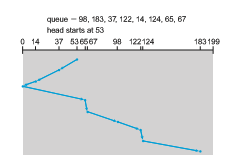

## HDD Scheduling

One of the responsibilities of the operating system is to use the hardware efficiently. For HDDs,meeting this responsibility entailsminimizing access time and maximizing data transfer bandwidth.

For HDDs and other mechanical storage devices that use platters, access time has two major components, as mentioned in Section 11.1. The seek time is the time for the device arm to move the heads to the cylinder containing the desired sector, and the rotational latency is the additional time for the platter to rotate the desired sector to the head. The device **bandwidth** is the total number of bytes transferred, divided by the total time between the first request for service and the completion of the last transfer. We can improve both the access time and the bandwidth by managing the order in which storage I/O requests are serviced.

Whenever a process needs I/O to or from the drive, it issues a system call to the operating system. The request specifies several pieces of information:

• Whether this operation is input or output

• The open file handle indicating the file to operate on

• What the memory address for the transfer is

• The amount of data to transfer  

If the desired drive and controller are available, the request can be serviced immediately. If the drive or controller is busy, any new requests for service will be placed in the queue of pending requests for that drive. For a multiprogram- ming system with many processes, the device queue may often have several pending requests.

The existence of a queue of requests to a device that can have its perfor- mance optimized by avoiding head seeks allows device drivers a chance to improve performance via queue ordering.

In the past, HDD interfaces required that the host specify which track and which head to use, and much effort was spent on disk scheduling algorithms. Drives newer than the turn of the century not only do not expose these controls to the host, but also map LBA to physical addresses under drive control. The current goals of disk scheduling include fairness, timeliness, and optimiza- tions, such as bunching reads or writes that appear in sequence, as drives perform best with sequential I/O. Therefore some scheduling effort is still useful. Any one of several disk-scheduling algorithms can be used, and we discuss them next. Note that absolute knowledge of head location and phys- ical block/cylinder locations is generally not possible on modern drives. But as a rough approximation, algorithms can assume that increasing LBAs mean increasing physical addresses, and LBAs close together equate to physical block proximity.

### FCFS Scheduling

The simplest form of disk scheduling is, of course, the first-come, first-served (FCFS) algorithm (or FIFO). This algorithm is intrinsically fair, but it generally does not provide the fastest service. Consider, for example, a disk queue with requests for I/O to blocks on cylinders

98, 183, 37, 122, 14, 124, 65, 67,

in that order. If the disk head is initially at cylinder 53, it will first move from 53 to 98, then to 183, 37, 122, 14, 124, 65, and finally to 67, for a total head movement of 640 cylinders. This schedule is diagrammed in Figure 11.6.

The wild swing from 122 to 14 and then back to 124 illustrates the problem with this schedule. If the requests for cylinders 37 and 14 could be serviced together, before or after the requests for 122 and 124, the total head movement could be decreased substantially, and performance could be thereby improved.

### SCAN Scheduling

In the **SCAN algorithm**, the disk arm starts at one end of the disk and moves toward the other end, servicing requests as it reaches each cylinder, until it gets to the other end of the disk. At the other end, the direction of head movement is reversed, and servicing continues. The head continuously scans back and forth across the disk. The SCAN algorithm is sometimes called the **elevator algorithm**, since the disk arm behaves just like an elevator in a building, first servicing all the requests going up and then reversing to service requests the other way.

Let’s return to our example to illustrate. Before applying SCAN to schedule the requests on cylinders 98, 183, 37, 122, 14, 124, 65, and 67, we need to know  

**Figure 11.6** FCFS disk scheduling.

the direction of head movement in addition to the head’s current position. Assuming that the disk arm is moving toward 0 and that the initial head position is again 53, the head will next service 37 and then 14. At cylinder 0, the arm will reverse and will move toward the other end of the disk, servicing the requests at 65, 67, 98, 122, 124, and 183 (Figure 11.7). If a request arrives in the queue just in front of the head, it will be serviced almost immediately; a request arriving just behind the head will have to wait until the arm moves to the end of the disk, reverses direction, and comes back.

Assuming a uniform distribution of requests for cylinders, consider the density of requests when the head reaches one end and reverses direction. At this point, relatively few requests are immediately in front of the head, since these cylinders have recently been serviced. The heaviest density of requests is at the other end of the disk. These requests have also waited the longest, so why not go there first? That is the idea of the next algorithm.

**Figure 11.7** SCAN disk scheduling.  

### C-SCAN Scheduling

**Circular SCAN (C-SCAN) scheduling** is a variant of SCAN designed to provide a more uniformwait time. Like SCAN, C-SCANmoves the head from one end of the disk to the other, servicing requests along the way. When the head reaches the other end, however, it immediately returns to the beginning of the disk without servicing any requests on the return trip.

Let’s return to our example to illustrate. Before applying C-SCAN to sched- ule the requests on cylinders 98, 183, 37, 122, 14, 124, 65, and 67, we need to know the direction of head movement in which the requests are scheduled. Assuming that the requests are scheduled when the disk arm is moving from 0 to 199 and that the initial head position is again 53, the request will be served as depicted in Figure 11.8. The C-SCAN scheduling algorithm essentially treats the cylinders as a circular list that wraps around from the final cylinder to the first one.

### Selection of a Disk-Scheduling Algorithm

There are many disk-scheduling algorithms not included in this coverage, because they are rarely used. But how do operating system designers decide which to implement, anddeployers chose the best to use? For any particular list of requests, we can define an optimal order of retrieval, but the computation needed to find an optimal schedule may not justify the savings over SCAN. With any scheduling algorithm, however, performance depends heavily on the number and types of requests. For instance, suppose that the queue usually has just one outstanding request. Then, all scheduling algorithms behave the same, because they have only one choice of where to move the disk head: they all behave like FCFS scheduling.

SCAN and C-SCAN perform better for systems that place a heavy load on the disk, because they are less likely to cause a starvation problem. There can still be starvation though, which drove Linux to create the **deadline** scheduler. This scheduler maintains separate read and write queues, and gives reads priority because processes are more likely to block on read than write. The queues are

**Figure 11.8** C-SCAN disk scheduling.  

sorted in LBAorder, essentially implementing C-SCAN. All I/O requests are sent in a batch in this LBA order. Deadline keeps four queues: two read and two write, one sorted by LBA and the other by FCFS. It checks after each batch to see if there are requests in the FCFS queues older than a configured age (by default, 500 ms). If so, the LBA queue (read or write) containing that request is selected for the next batch of I/O.

The deadline I/O scheduler is the default in the Linux RedHat 7 distribu- tion, but **RHEL** 7 also includes two others. NOOP is preferred for CPU-bound sys- tems using fast storage such as NVM devices, and the **Completely Fair Queue- ing scheduler** (**CFQ**) is the default for SATAdrives. CFQ maintains three queues (with insertion sort to keep them sorted in LBAorder): real time, best effort (the default), and idle. Each has exclusive priority over the others, in that order,with starvation possible. It uses historical data, anticipating if a process will likely issue more I/O requests soon. If it so determines, it idles waiting for the new I/O, ignoring other queued requests. This is to minimize seek time, assuming locality of reference of storage I/O requests, per process. Details of these sched- ulers can be found in https://access.redhat.com/site/documentation/en-US /Red Hat Enterprise Linux/7/html/Performance Tuning Guide/index.html.
