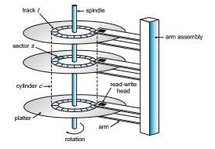

## Overview of Mass-Storage Structure

The bulk of secondary storage for modern computers is provided by **hard disk drives** (**HDDs**) and **nonvolatile memory** (**NVM**) devices. In this section,

**Figure 11.1** HDD moving-head disk mechanism.

we describe the basic mechanisms of these devices and explain how operat- ing systems translate their physical properties to logical storage via address mapping.

### Hard Disk Drives

Conceptually, HDDs are relatively simple (Figure 11.1). Each disk **platter** has a flat circular shape, like a CD. Common platter diameters range from 1.8 to 3.5 inches. The two surfaces of a platter are covered with a magnetic material. We store information by recording it magnetically on the platters, and we read information by detecting the magnetic pattern on the platters.

A read–write head “flies” just above each surface of every platter. The heads are attached to a **disk arm** that moves all the heads as a unit. The surface of a platter is logically divided into circular **tracks**, which are subdivided into **sectors**. The set of tracks at a given arm position make up a **cylinder**. There may be thousands of concentric cylinders in a disk drive, and each track may contain hundreds of sectors. Each sector has a fixed size and is the smallest unit of transfer. The sector size was commonly 512 bytes until around 2010. At that point, many manufacturers start migrating to 4KB sectors. The storage capacity of common disk drives is measured in gigabytes and terabytes. Adisk drive with the cover removed is shown in Figure 11.2.

Adisk drivemotor spins it at high speed.Most drives rotate 60 to 250 times per second, specified in terms of rotations per minute (**RPM**). Common drives spin at 5,400, 7,200, 10,000, and 15,000 RPM. Some drives power down when not in use and spin up upon receiving an I/O request. Rotation speed relates to transfer rates. The **transfer rate** is the rate at which data flow between the drive and the computer. Another performance aspect, the **positioning time**, or **random-access time**, consists of two parts: the time necessary to move the disk arm to the desired cylinder, called the **seek time**, and the time necessary for the  

**Figure 11.2** A 3.5-inch HDD with cover removed.

desired sector to rotate to the disk head, called the **rotational latency**. Typical disks can transfer tens to hundreds of megabytes of data per second, and they have seek times and rotational latencies of several milliseconds. They increase performance by having DRAM buffers in the drive controller.

The disk head flies on an extremely thin cushion (measured in microns) of air or another gas, such as helium, and there is a danger that the headwill make contact with the disk surface. Although the disk platters are coated with a thin protective layer, the head will sometimes damage the magnetic surface. This accident is called a **head crash**. A head crash normally cannot be repaired; the entire disk must be replaced, and the data on the disk are lost unless they were backed up to other storage or RAID protected. (RAID is discussed in Section 11.8.)

HDDs are sealed units, and some chassis that hold HDDs allow their removal without shutting down the system or storage chassis. This is helpful when a system needs more storage than can be connected at a given time or when it is necessary to replace a bad drive with a working one. Other types of storage media are also **removable**, including CDs, DVDs, and Blu-ray discs.

**_DISK TRANSFER RATES_**

As with many aspects of computing, published performance numbers for disks are not the same as real-world performance numbers. Stated transfer rates are always higher than **effective transfer rates**, for example. The transfer rate may be the rate at which bits can be read from themagnetic media by the disk head, but that is different from the rate at which blocks are delivered to the operating system.  

### Nonvolatile Memory Devices

Non volatile memory (NVM) devices are growing in importance. Simply described, NVM devices are electrical rather than mechanical. Most commonly, such a device is composed of a controller and flash NAND die semiconductor chips, which are used to store data. Other NVM technologies exist, like DRAM with battery backing so it doesn’t lose its contents, as well as other semiconductor technology like 3D XPoint, but they are far less common and so are not discussed in this book.

#### Overview of Nonvolatile Memory Devices

Flash-memory-based NVM is frequently used in a disk-drive-like container, in which case it is called a **solid-state disk** (**SSD**) (Figure 11.3). In other instances, it takes the formof a **USB drive** (also known as a thumbdrive or flash drive) or a DRAM stick. It is also surface-mounted onto motherboards as the main storage in devices like smartphones. In all forms, it acts and can be treated in the same way. Our discussion of NVM devices focuses on this technology.

NVM devices can bemore reliable than HDDs because they have nomoving parts and can be faster because they have no seek time or rotational latency. In addition, they consume less power. On the negative side, they are more expensive permegabyte than traditional hard disks and have less capacity than the larger hard disks. Over time, however, the capacity of NVM devices has increased faster than HDD capacity, and their price has dropped more quickly, so their use is increasing dramatically. In fact, SSDs and similar devices are now used in some laptop computers to make them smaller, faster, and more energy-efficient.

Because NVM devices can be much faster than hard disk drives, standard bus interfaces can cause a major limit on throughput. Some NVM devices are designed to connect directly to the system bus (PCIe, for example). This technology is changing other traditional aspects of computer design as well.

**Figure 11.3** A 3.5-inch SSD circuit board.  
Some systems use it as a direct replacement for disk drives, while others use it as a new cache tier, moving data among magnetic disks, NVM, and main memory to optimize performance.

NAND semiconductors have some characteristics that present their own storage and reliability challenges. For example, they can be read and written in a “page” increment (similar to a sector), but data cannot be overwritten— rather, the NAND cells have to be erased first. The erasure, which occurs in a “block” increment that is several pages in size, takes much more time than a read (the fastest operation) or a write (slower than read, but much faster than erase). Helping the situation is that NVM flash devices are composed of many die, with many datapaths to each die, so operations can happen in parallel (each using a datapath). NAND semiconductors also deteriorate with every erase cycle, and after approximately 100,000 program-erase cycles (the specific number varies depending on the medium), the cells no longer retain data. Because of the write wear, and because there are no moving parts, NAND NVM lifespan is not measured in years but in **Drive Writes Per Day** (**DWPD**). That measure is how many times the drive capacity can be written per day before the drive fails. For example, a 1 TB NAND drive with a 5 DWPD rating is expected to have 5 TB per day written to it for the warranty period without failure.

These limitations have led to several ameliorating algorithms. Fortunately, they are usually implemented in the NVM device controller and are not of con- cern to the operating system. The operating system simply reads and writes logical blocks, and the device manages how that is done. (Logical blocks are discussed inmore detail in Section 11.1.5.) However, NVM devices have perfor- mance variations based on their operating algorithms, so a brief discussion of what the controller does is warranted.

#### NAND Flash Controller Algorithms

Because NAND semiconductors cannot be overwritten once written, there are usually pages containing invalid data. Consider a file-system block, written once and then later written again. If no erase has occurred in the meantime, the page first written has the old data, which are now invalid, and the second page has the current, good version of the block. A NAND block containing valid and invalid pages is shown in Figure 11.4. To track which logical blocks contain valid data, the controller maintains a **flas translation layer** (**FTL**). This table maps which physical pages contain currently valid logical blocks. It also

**Figure 11.4** A NAND block with valid and invalid pages.  

tracks physical block state—that is, which blocks contain only invalid pages and therefore can be erased.

Now consider a full SSD with a pending write request. Because the SSD is full, all pages have been written to, but there might be a block that contains no valid data. In that case, the write could wait for the erase to occur, and then the write could occur. But what if there are no free blocks? There still could be some space available if individual pages are holding invalid data. In that case, **garbage collection** could occur—good data could be copied to other locations, freeing up blocks that could be erased and could then receive the writes. However, where would the garbage collection store the good data? To solve this problem and improve write performance, the NVM device uses **over- provisioning**. The device sets aside a number of pages (frequently 20 percent of the total) as an area always available to write to. Blocks that are totally invalid by garbage collection, or write operations invalidating older versions of the data, are erased and placed in the over-provisioning space if the device is full or returned to the free pool.

The over-provisioning space can also help with **wear leveling**. If some blocks are erased repeatedly, while others are not, the frequently erased blocks will wear out faster than the others, and the entire device will have a shorter lifespan than it would if all the blocks wore out concurrently. The controller tries to avoid that by using various algorithms to place data on less-erased blocks so that subsequent erases will happen on those blocks rather than on the more erased blocks, leveling the wear across the entire device.

In terms of data protection, like HDDs, NVM devices provide error- correcting codes, which are calculated and stored along with the data during writing and read with the data to detect errors and correct them if possible. (Error-correcting codes are discussed in Section 11.5.1.) If a page frequently has correctible errors, the page might be marked as bad and not used in subsequent writes. Generally, a single NVM device, like an HDD, can have a catastrophic failure in which it corrupts or fails to reply to read or write requests. To allow data to be recoverable in those instances, RAID protection is used.

### Volatile Memory

It might seem odd to discuss volatile memory in a chapter on mass-storage structure, but it is justifiable because DRAM is frequently used as amass-storage device. Specifically, **RAM drives** (which are known by many names, including RAM disks) act like secondary storage but are created by device drivers that carve out a section of the system’s DRAM and present it to the rest of the system as it if were a storage device. These “drives” can be used as raw block devices, but more commonly, file systems are created on them for standard file operations.

Computers already have buffering and caching, so what is the purpose of yet another use of DRAM for temporary data storage?After all, DRAM is volatile, and data on a RAM drive does not survive a system crash, shutdown, or power down. Caches and buffers are allocated by the programmer or operating sys- tem, whereas RAM drives allow the user (as well as the programmer) to place  

**_MAGNETIC TAPES_**

**Magnetic tape** was used as an early secondary-storage medium. Although it is nonvolatile and can hold large quantities of data, its access time is slow compared with that of main memory and drives. In addition, random access to magnetic tape is about a thousand times slower than random access to HDDs and about a hundred thousand times slower than random access to SSDs so tapes are not very useful for secondary storage. Tapes are used mainly for backup, for storage of infrequently used information, and as a medium for transferring information from one system to another.

A tape is kept in a spool and is wound or rewound past a read–write head. Moving to the correct spot on a tape can take minutes, but once posi- tioned, tape drives can read and write data at speeds comparable to HDDs. Tape capacities vary greatly, depending on the particular kind of tape drive, with current capacities exceeding several terabytes. Some tapes have built-in compression that can more than double the effective storage. Tapes and their drivers are usually categorized by width, including 4, 8, and 19 millimeters and 1/4 and 1/2 inch. Some are named according to technology, such as LTO-6 (Figure 11.5) and SDLT.

**Figure 11.5** An LTO-6 Tape drive with tape cartridge inserted.

data in memory for temporary safekeeping using standard file operations. In fact, RAM drive functionality is useful enough that such drives are found in all major operating systems. On Linux there is /dev/ram, onmacOS the diskutil command creates them, Windows has them via third-party tools, and Solaris and Linux create /tmp at boot time of type “tmpfs”, which is a RAM drive.

RAM drives are useful as high-speed temporary storage space. Although NVM devices are fast, DRAM is much faster, and I/O operations to RAM drives are the fastest way to create, read, write, and delete files and their contents. Many programs use (or could benefit from using) RAM drives for storing temporary files. For example, programs can share data easily by writing and reading files from a RAMdrive. For another example, Linux at boot time creates a temporary root file system (initrd) that allows other parts of the system to have access to a root file system and its contents before the parts of the operating system that understand storage devices are loaded.  

### Secondary Storage Connection Methods

A secondary storage device is attached to a computer by the system bus or an **I/O bus**. Several kinds of buses are available, including **advanced technology attachment** (**ATA**), **serial ATA** (**SATA**), **eSATA**, **serial attached SCSI** (**SAS**), **uni- versal serial bus** (**USB**), and **fibr channel** (**FC**). The most common connection method is SATA. Because NVM devices are much faster than HDDs, the industry created a special, fast interface for NVM devices called **NVM express** (**NVMe**). NVMe directly connects the device to the systemPCI bus, increasing throughput and decreasing latency compared with other connection methods.

The data transfers on a bus are carried out by special electronic processors called **controllers** (or **host-bus adapters** (**HBA**)). The **host controller** is the controller at the computer end of the bus. A **device controller** is built into each storage device. To perform a mass storage I/O operation, the computer places a command into the host controller, typically using memory-mapped I/O ports, as described in Section 12.2.1. The host controller then sends the command via messages to the device controller, and the controller operates the drive hardware to carry out the command. Device controllers usually have a built-in cache. Data transfer at the drive happens between the cache and the storage media, and data transfer to the host, at fast electronic speeds, occurs between the cache host DRAM via DMA.

### Address Mapping

Storage devices are addressed as large one-dimensional arrays of **logical blocks**, where the logical block is the smallest unit of transfer. Each logical block maps to a physical sector or semiconductor page. The one-dimensional array of logical blocks is mapped onto the sectors or pages of the device. Sector 0 could be the first sector of the first track on the outermost cylinder on an HDD, for example. The mapping proceeds in order through that track, then through the rest of the tracks on that cylinder, and then through the rest of the cylinders, from outermost to innermost. For NVM the mapping is from a tuple (finite ordered list) of chip, block, and page to an array of logical blocks. A logical block address (**LBA**) is easier for algorithms to use than a sector, cylinder, head tuple or chip, block, page tuple.

By using this mapping on an HDD, we can—at least in theory—convert a logical block number into an old-style disk address that consists of a cylinder number, a track number within that cylinder, and a sector number within that track. In practice, it is difficult to perform this translation, for three reasons. First, most drives have some defective sectors, but the mapping hides this by substituting spare sectors from elsewhere on the drive. The logical block address stays sequential, but the physical sector location changes. Second, the number of sectors per track is not a constant on some drives. Third, disk man- ufacturers manage LBA to physical address mapping internally, so in current drives there is little relationship between LBA and physical sectors. In spite of these physical address vagaries, algorithms that deal with HDDs tend to assume that logical addresses are relatively related to physical addresses. That is, ascending logical addresses tend to mean ascending physical address.

Let’s look more closely at the second reason. On media that use **constant linear velocity** (**CLV**), the density of bits per track is uniform. The farther a track is from the center of the disk, the greater its length, so the more sectors it can hold. As we move from outer zones to inner zones, the number of sectors per track decreases. Tracks in the outermost zone typically hold 40 percent more sectors than do tracks in the innermost zone. The drive increases its rotation speed as the headmoves from the outer to the inner tracks to keep the same rate of data moving under the head. This method is used in CD-ROM and DVD-ROM drives. Alternatively, the disk rotation speed can stay constant; in this case, the density of bits decreases from inner tracks to outer tracks to keep the data rate constant (and performance relatively the same no matter where data is on the drive). This method is used in hard disks and is known as **constant angular velocity** (**CAV**).

The number of sectors per track has been increasing as disk technology improves, and the outer zone of a disk usually has several hundred sectors per track. Similarly, the number of cylinders per disk has been increasing; large disks have tens of thousands of cylinders.

Note that there are more types of storage devices than are reasonable to cover in an operating systems text. For example, there are “shingled magnetic recording” hard drives with higher density but worse perfor- mance than mainstream HDDs (see http://www.tomsitpro.com/articles/ shingled-magnetic-recoding-smr-101-basics,2-933.html). There are also combination devices that include NVM and HDD technology, or volume managers (see Section 11.5) that can knit together NVM and HDD devices into a storage unit faster than HDD but lower cost than NVM. These devices have different characteristics from the more common devices, and might need different caching and scheduling algorithms to maximize performance.
