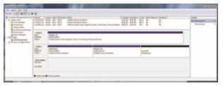
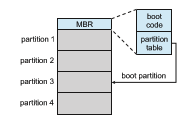

## Storage Device Management

The operating system is responsible for several other aspects of storage device management, too. Here, we discuss drive initialization, booting from a drive, and bad-block recovery.

### Drive Formatting, Partitions, and Volumes

Anew storage device is a blank slate: it is just a platter of a magnetic recording material or a set of uninitialized semiconductor storage cells. Before a storage device can store data, it must be divided into sectors that the controller can read andwrite. NVMpagesmust be initialized and the FTL created. This process is called **low-level formatting**, or **physical formatting**. Low-level formatting fills the device with a special data structure for each storage location. The data structure for a sector or page typically consists of a header, a data area, and a trailer. The header and trailer contain information used by the controller, such as a sector/page number and an error detection or correction code.

Most drives are low-level-formatted at the factory as a part of the manu- facturing process. This formatting enables the manufacturer to test the device and to initialize the mapping from logical block numbers to defect-free sectors or pages on themedia. It is usually possible to choose among a few sector sizes, such as 512 bytes and 4KB. Formatting a disk with a larger sector size means that fewer sectors can fit on each track, but it also means that fewer headers and trailers are written on each track and more space is available for user data. Some operating systems can handle only one specific sector size.

Before it can use a drive to hold files, the operating system still needs to record its own data structures on the device. It does so in three steps.

The first step is to **partition** the device into one or more groups of blocks or pages. The operating system can treat each partition as though it were a separate device. For instance, one partition can hold a file system containing a copy of the operating system’s executable code, another the swap space, and another a file system containing the user files. Some operating systems and file systems perform the partitioning automatically when an entire device is to be managed by the file system. The partition information is written in a fixed format at a fixed location on the storage device. In Linux, the fdisk command is used to manage partitions on storage devices. The device, when recognized by the operating system, has its partition information read, and the operating system then creates device entries for the partitions (in /dev in Linux). From there, a configuration file, such as /etc/fstab, tells the operating system to mount each partition containing a file system at a specified location and to use mount options such as read-only. **Mounting** a file system is making the file system available for use by the system and its users.

The second step is volume creation and management. Sometimes, this step is implicit, as when a file system is placed directly within a partition. That **volume** is then ready to be mounted and used. At other times, volume creation andmanagement is explicit—for examplewhenmultiple partitions or devices will be used together as a RAID set (see Section 11.8) with one or more file systems spread across the devices. The Linux volume manager lvm2 can provide these features, as can commercial third-party tools for Linux and other operating systems. ZFS provides both volume management and a file system integrated into one set of commands and features. (Note that “volume” can also mean any mountable file system, even a file containing a file system such as a CD image.)

The third step is **logical formatting**, or creation of a file system. In this step, the operating system stores the initial file-system data structures onto the device. These data structuresmay includemaps of free and allocated space and an initial empty directory.

The partition information also indicates if a partition contains a bootable file system (containing the operating system). The partition labeled for boot is used to establish the root of the file system. Once it is mounted, device links for all other devices and their partitions can be created. Generally, a computer’s “file system” consists of all mounted volumes. OnWindows, these are separately named via a letter (C:, D:, E:). On other systems, such as Linux, at boot time the boot file system is mounted, and other file systems can be mountedwithin that tree structure (as discussed in Section 13.3). OnWindows, the file system interfacemakes it clear when a given device is being used, while in Linux a single file access might traverse many devices before the requested file in the requested file system (within a volume) is accessed. Figure 11.9 shows the Windows 7 Disk Management tool displaying three volumes (C:, E:, and F:). Note that E: and F: are each in a partition of the “Disk 1” device and that there is unallocated space on that device for more partitions (possibly containing file systems).

To increase efficiency, most file systems group blocks together into larger chunks, frequently called **clusters**. Device I/O is done via blocks, but file system I/O is done via clusters, effectively assuring that I/O hasmore sequential-access and fewer random-access characteristics. File systems try to group file contents near its metadata as well, reducing HDD head seeks when operating on a file, for example.

Some operating systems give special programs the ability to use a partition as a large sequential array of logical blocks, without any file-system data structures. This array is sometimes called the **raw disk**, and I/O to this array is termed **_raw I/O._** It can be used for swap space (see Section 11.6.2), for example, and some database systems prefer raw I/O because it enables them to control  

**Figure 11.9** Windows 7 Disk Management tool showing devices, partitions, volumes, and file systems.

the exact location where each database record is stored. Raw I/O bypasses all the file-system services, such as the buffer cache, file locking, prefetching, space allocation, file names, and directories. We can make certain applications more efficient by allowing them to implement their own special-purpose storage services on a raw partition, but most applications use a provided file system rather than managing data themselves. Note that Linux generally does not support raw I/O but can achieve similar access by using the DIRECT flag to the open() system call.

### Boot Block

For a computer to start running—for instance, when it is powered up or rebooted—it must have an initial program to run. This initial **bootstrap** loader tends to be simple. For most computers, the bootstrap is stored in NVM flash memory firmware on the system motherboard and mapped to a known mem- ory location. It can be updated by product manufacturers as needed, but also can be written to by viruses, infecting the system. It initializes all aspects of the system, from CPU registers to device controllers and the contents of main memory.

This tiny bootstrap loader program is also smart enough to bring in a full bootstrap program from secondary storage. The full bootstrap program is stored in the “boot blocks” at a fixed location on the device. The default Linux bootstrap loader is grub2 (https://www.gnu.org/software/grub/manual/ grub.html/). A device that has a boot partition is called a **boot disk** or **system disk**.

The code in the bootstrap NVM instructs the storage controller to read the boot blocks into memory (no device drivers are loaded at this point) and then starts executing that code. The full bootstrap program is more sophisticated than the bootstrap loader: it is able to load the entire operating system from a non-fixed location on the device and to start the operating system running.

Let’s consider as an example the boot process in Windows. First, note that Windows allows a drive to be divided into partitions, and one partition— identified as the **boot partition**—contains the operating system and device drivers. The Windows system places its boot code in the first logical block on the hard disk or first page of the NVM device, which it terms the **master boot**  

**Figure 11.10** Booting from a storage device in Windows.

**record**, or **MBR**. Booting begins by running code that is resident in the system’s firmware. This code directs the system to read the boot code from the MBR, understanding just enough about the storage controller and storage device to load a sector from it. In addition to containing boot code, the MBR contains a table listing the partitions for the drive and a flag indicating which partition the system is to be booted from, as illustrated in Figure 11.10. Once the system identifies the boot partition, it reads the first sector/page from that partition (called the **boot sector**), which directs it to the kernel. It then continues with the remainder of the boot process, which includes loading the various subsystems and system services.

### Bad Blocks

Because disks have moving parts and small tolerances (recall that the disk head flies just above the disk surface), they are prone to failure. Sometimes the failure is complete; in this case, the disk needs to be replaced and its contents restored from backup media to the new disk. More frequently, one or more sectors become defective. Most disks even come from the factory with **bad blocks**. Depending on the disk and controller in use, these blocks are handled in a variety of ways.

On older disks, such as some disks with IDE controllers, bad blocks are handled manually. One strategy is to scan the disk to find bad blocks while the disk is being formatted. Any bad blocks that are discovered are flagged as unusable so that the file system does not allocate them. If blocks go bad during normal operation, a special program (such as the Linux badblocks command) must be runmanually to search for the bad blocks and to lock them away. Data that resided on the bad blocks usually are lost.

More sophisticated disks are smarter about bad-block recovery. The con- troller maintains a list of bad blocks on the disk. The list is initialized during the low-level formatting at the factory and is updated over the life of the disk. Low-level formatting also sets aside spare sectors not visible to the operating system. The controller can be told to replace each bad sector logically with one of the spare sectors. This scheme is known as **sector sparing** or **forwarding**.

A typical bad-sector transaction might be as follows:

• The operating system tries to read logical block 87.  

• The controller calculates the ECC and finds that the sector is bad. It reports this finding to the operating system as an I/O error.

• The device controller replaces the bad sector with a spare.

• After that, whenever the system requests logical block 87, the request is translated into the replacement sector’s address by the controller.

Note that such a redirection by the controller could invalidate any opti- mization by the operating system’s disk-scheduling algorithm! For this reason, most disks are formatted to provide a few spare sectors in each cylinder and a spare cylinder as well. When a bad block is remapped, the controller uses a spare sector from the same cylinder, if possible.

As an alternative to sector sparing, some controllers can be instructed to replace a bad block by **sector slipping**. Here is an example: Suppose that logical block 17 becomes defective and the first available spare follows sector 202. Sector slipping then remaps all the sectors from 17 to 202, moving them all down one spot. That is, sector 202 is copied into the spare, then sector 201 into 202, then 200 into 201, and so on, until sector 18 is copied into sector 19. Slipping the sectors in this way frees up the space of sector 18 so that sector 17 can be mapped to it.

Recoverable soft errors may trigger a device activity in which a copy of the block data is made and the block is spared or slipped. An unrecoverable **hard error**, however, results in lost data. Whatever file was using that block must be repaired (for instance, by restoration from a backup tape), and that requires manual intervention.

NVM devices also have bits, bytes, and even pages that either are nonfunc- tional at manufacturing time or go bad over time. Management of those faulty areas is simpler than for HDDs because there is no seek time performance loss to be avoided. Either multiple pages can be set aside and used as replacement locations, or space from the over-provisioning area can be used (decreasing the usable capacity of the over-provisioning area). Either way, the controller maintains a table of bad pages and never sets those pages as available to write to, so they are never accessed.
